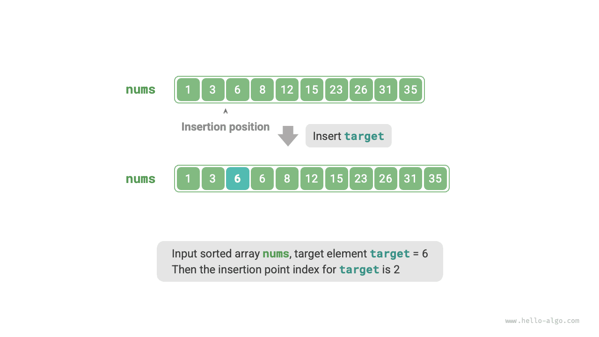
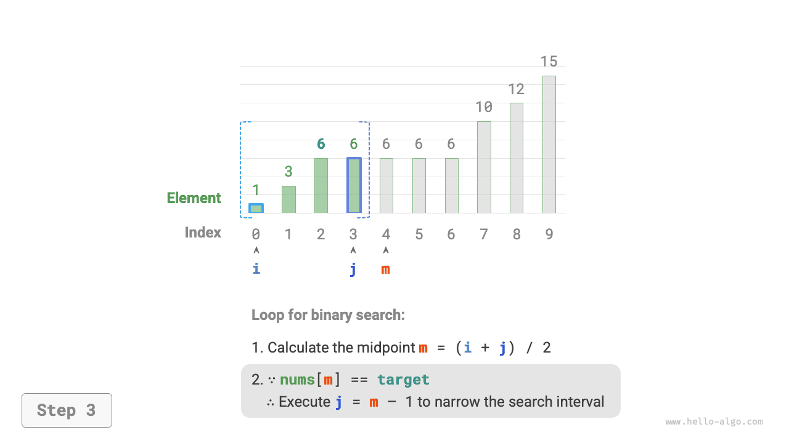
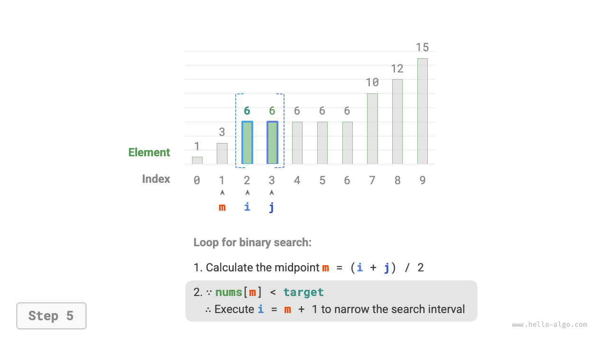
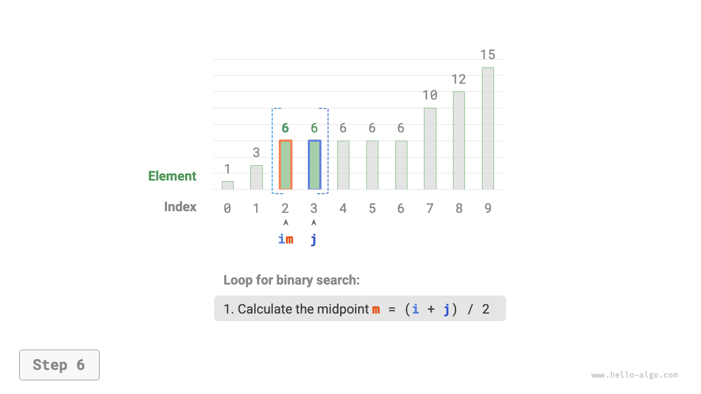

# 10.2 &nbsp; Binary Search Insertion Point

Binary search can be used not only to search for target elements, but also to solve many variant problems, such as finding the insertion position of a target element.

## 10.2.1 &nbsp; Case Without Duplicate Elements

!!! question

    Given a sorted array `nums` of length $n$ and an element `target`, where the array contains no duplicate elements, insert `target` into `nums` while maintaining its sorted order. If `target` already exists in the array, insert it to its left. Return the index of `target` after insertion. An example is shown below.

{ class="animation-figure" }

<p align="center"> Figure 10-4 &nbsp; Binary search insertion point example data </p>

If we want to reuse the binary search code from the previous section, we need to answer the following two questions.

**Question 1**: When the array contains `target`, is the insertion point index the same as that element's index?

The problem requires inserting `target` to the left of equal elements, which means the newly inserted `target` replaces the position of the original `target`. In other words, **when the array contains `target`, the insertion point index is the index of that `target`**.

**Question 2**: When the array does not contain `target`, what is the insertion point index?

To analyze this further, consider the binary search process: when `nums[m] < target`, $i$ moves, meaning that pointer $i$ is approaching elements greater than or equal to `target`. Similarly, pointer $j$ is always approaching elements less than or equal to `target`.

Therefore, when the binary search ends, $i$ must point to the first element greater than `target`, and $j$ must point to the first element less than `target`. **It follows that when the array does not contain `target`, the insertion index is $i$**. The code is shown below:

=== "Python"

    ```python title="binary_search_insertion.py"
    def binary_search_insertion_simple(nums: list[int], target: int) -> int:
        """Binary search for insertion point (no duplicate elements)"""
        i, j = 0, len(nums) - 1  # Initialize closed interval [0, n-1]
        while i <= j:
            m = (i + j) // 2  # Calculate midpoint index m
            if nums[m] < target:
                i = m + 1  # target is in the interval [m+1, j]
            elif nums[m] > target:
                j = m - 1  # target is in the interval [i, m-1]
            else:
                return m  # Found target, return insertion point m
        # Target not found, return insertion point i
        return i
    ```

=== "C++"

    ```cpp title="binary_search_insertion.cpp"
    /* Binary search for insertion point (no duplicate elements) */
    int binarySearchInsertionSimple(vector<int> &nums, int target) {
        int i = 0, j = nums.size() - 1; // Initialize closed interval [0, n-1]
        while (i <= j) {
            int m = i + (j - i) / 2; // Calculate the midpoint index m
            if (nums[m] < target) {
                i = m + 1; // target is in the interval [m+1, j]
            } else if (nums[m] > target) {
                j = m - 1; // target is in the interval [i, m-1]
            } else {
                return m; // Found target, return insertion point m
            }
        }
        // Target not found, return insertion point i
        return i;
    }
    ```

=== "Java"

    ```java title="binary_search_insertion.java"
    /* Binary search for insertion point (no duplicate elements) */
    int binarySearchInsertionSimple(int[] nums, int target) {
        int i = 0, j = nums.length - 1; // Initialize closed interval [0, n-1]
        while (i <= j) {
            int m = i + (j - i) / 2; // Calculate the midpoint index m
            if (nums[m] < target) {
                i = m + 1; // target is in the interval [m+1, j]
            } else if (nums[m] > target) {
                j = m - 1; // target is in the interval [i, m-1]
            } else {
                return m; // Found target, return insertion point m
            }
        }
        // Target not found, return insertion point i
        return i;
    }
    ```

=== "C#"

    ```csharp title="binary_search_insertion.cs"
    /* Binary search for insertion point (no duplicate elements) */
    int BinarySearchInsertionSimple(int[] nums, int target) {
        int i = 0, j = nums.Length - 1; // Initialize closed interval [0, n-1]
        while (i <= j) {
            int m = i + (j - i) / 2; // Calculate the midpoint index m
            if (nums[m] < target) {
                i = m + 1; // target is in the interval [m+1, j]
            } else if (nums[m] > target) {
                j = m - 1; // target is in the interval [i, m-1]
            } else {
                return m; // Found target, return insertion point m
            }
        }
        // Target not found, return insertion point i
        return i;
    }
    ```

=== "Go"

    ```go title="binary_search_insertion.go"
    /* Binary search for insertion point (no duplicate elements) */
    func binarySearchInsertionSimple(nums []int, target int) int {
        // Initialize closed interval [0, n-1]
        i, j := 0, len(nums)-1
        for i <= j {
            // Calculate the midpoint index m
            m := i + (j-i)/2
            if nums[m] < target {
                // target is in the interval [m+1, j]
                i = m + 1
            } else if nums[m] > target {
                // target is in the interval [i, m-1]
                j = m - 1
            } else {
                // Found target, return insertion point m
                return m
            }
        }
        // Target not found, return insertion point i
        return i
    }
    ```

=== "Swift"

    ```swift title="binary_search_insertion.swift"
    /* Binary search for insertion point (no duplicate elements) */
    func binarySearchInsertionSimple(nums: [Int], target: Int) -> Int {
        // Initialize closed interval [0, n-1]
        var i = nums.startIndex
        var j = nums.endIndex - 1
        while i <= j {
            let m = i + (j - i) / 2 // Calculate the midpoint index m
            if nums[m] < target {
                i = m + 1 // target is in the interval [m+1, j]
            } else if nums[m] > target {
                j = m - 1 // target is in the interval [i, m-1]
            } else {
                return m // Found target, return insertion point m
            }
        }
        // Target not found, return insertion point i
        return i
    }
    ```

=== "JS"

    ```javascript title="binary_search_insertion.js"
    /* Binary search for insertion point (no duplicate elements) */
    function binarySearchInsertionSimple(nums, target) {
        let i = 0,
            j = nums.length - 1; // Initialize closed interval [0, n-1]
        while (i <= j) {
            const m = Math.floor(i + (j - i) / 2); // Calculate midpoint index m, use Math.floor() to round down
            if (nums[m] < target) {
                i = m + 1; // target is in the interval [m+1, j]
            } else if (nums[m] > target) {
                j = m - 1; // target is in the interval [i, m-1]
            } else {
                return m; // Found target, return insertion point m
            }
        }
        // Target not found, return insertion point i
        return i;
    }
    ```

=== "TS"

    ```typescript title="binary_search_insertion.ts"
    /* Binary search for insertion point (no duplicate elements) */
    function binarySearchInsertionSimple(
        nums: Array<number>,
        target: number
    ): number {
        let i = 0,
            j = nums.length - 1; // Initialize closed interval [0, n-1]
        while (i <= j) {
            const m = Math.floor(i + (j - i) / 2); // Calculate midpoint index m, use Math.floor() to round down
            if (nums[m] < target) {
                i = m + 1; // target is in the interval [m+1, j]
            } else if (nums[m] > target) {
                j = m - 1; // target is in the interval [i, m-1]
            } else {
                return m; // Found target, return insertion point m
            }
        }
        // Target not found, return insertion point i
        return i;
    }
    ```

=== "Dart"

    ```dart title="binary_search_insertion.dart"
    /* Binary search for insertion point (no duplicate elements) */
    int binarySearchInsertionSimple(List<int> nums, int target) {
      int i = 0, j = nums.length - 1; // Initialize closed interval [0, n-1]
      while (i <= j) {
        int m = i + (j - i) ~/ 2; // Calculate the midpoint index m
        if (nums[m] < target) {
          i = m + 1; // target is in the interval [m+1, j]
        } else if (nums[m] > target) {
          j = m - 1; // target is in the interval [i, m-1]
        } else {
          return m; // Found target, return insertion point m
        }
      }
      // Target not found, return insertion point i
      return i;
    }
    ```

=== "Rust"

    ```rust title="binary_search_insertion.rs"
    /* Binary search for insertion point (no duplicate elements) */
    fn binary_search_insertion_simple(nums: &[i32], target: i32) -> i32 {
        let (mut i, mut j) = (0, nums.len() as i32 - 1); // Initialize closed interval [0, n-1]
        while i <= j {
            let m = i + (j - i) / 2; // Calculate the midpoint index m
            if nums[m as usize] < target {
                i = m + 1; // target is in the interval [m+1, j]
            } else if nums[m as usize] > target {
                j = m - 1; // target is in the interval [i, m-1]
            } else {
                return m;
            }
        }
        // Target not found, return insertion point i
        i
    }
    ```

=== "C"

    ```c title="binary_search_insertion.c"
    /* Binary search for insertion point (no duplicate elements) */
    int binarySearchInsertionSimple(int *nums, int numSize, int target) {
        int i = 0, j = numSize - 1; // Initialize closed interval [0, n-1]
        while (i <= j) {
            int m = i + (j - i) / 2; // Calculate the midpoint index m
            if (nums[m] < target) {
                i = m + 1; // target is in the interval [m+1, j]
            } else if (nums[m] > target) {
                j = m - 1; // target is in the interval [i, m-1]
            } else {
                return m; // Found target, return insertion point m
            }
        }
        // Target not found, return insertion point i
        return i;
    }
    ```

=== "Kotlin"

    ```kotlin title="binary_search_insertion.kt"
    /* Binary search for insertion point (no duplicate elements) */
    fun binarySearchInsertionSimple(nums: IntArray, target: Int): Int {
        var i = 0
        var j = nums.size - 1 // Initialize closed interval [0, n-1]
        while (i <= j) {
            val m = i + (j - i) / 2 // Calculate the midpoint index m
            if (nums[m] < target) {
                i = m + 1 // target is in the interval [m+1, j]
            } else if (nums[m] > target) {
                j = m - 1 // target is in the interval [i, m-1]
            } else {
                return m // Found target, return insertion point m
            }
        }
        // Target not found, return insertion point i
        return i
    }
    ```

=== "Ruby"

    ```ruby title="binary_search_insertion.rb"
    ### Binary search insertion point (no duplicates) ###
    def binary_search_insertion_simple(nums, target)
      # Initialize closed interval [0, n-1]
      i, j = 0, nums.length - 1

      while i <= j
        # Calculate the midpoint index m
        m = (i + j) / 2

        if nums[m] < target
          i = m + 1 # target is in the interval [m+1, j]
        elsif nums[m] > target
          j = m - 1 # target is in the interval [i, m-1]
        else
          return m  # Found target, return insertion point m
        end
      end

      i # Target not found, return insertion point i
    end
    ```

## 10.2.2 &nbsp; Case with Duplicate Elements

!!! question

    Based on the previous problem, assume the array may contain duplicate elements, with everything else remaining the same.

Suppose there are multiple `target` elements in the array. Ordinary binary search can only return the index of one `target`, **and cannot determine how many `target` elements are to the left and right of that element**.

The problem requires inserting the target element at the leftmost position, **so we need to find the index of the leftmost `target` in the array**. A straightforward initial approach is to follow the steps shown in Figure 10-5:

1. Perform binary search to obtain the index of any `target`, denoted as $k$.
2. Starting from index $k$, perform linear traversal to the left, and return when the leftmost `target` is found.

{ class="animation-figure" }

<p align="center"> Figure 10-5 &nbsp; Linear search for insertion point of duplicate elements </p>

Although this method works, it includes linear search, resulting in a time complexity of $O(n)$. When the array contains many duplicate `target` elements, this method is very inefficient.

Now consider extending the binary search code. As shown in Figure 10-6, the overall process remains unchanged: in each iteration, we first compute the midpoint index $m$, then compare `target` with `nums[m]`, leading to the following cases:

- When `nums[m] < target` or `nums[m] > target`, it means `target` has not been found yet, so use the standard interval-shrinking operation of binary search to **move pointers $i$ and $j$ closer to `target`**.
- When `nums[m] == target`, it means elements less than `target` are in the interval $[i, m - 1]$, so use $j = m - 1$ to shrink the interval, thereby **moving pointer $j$ closer to elements less than `target`**.

After the loop completes, $i$ points to the leftmost `target`, and $j$ points to the first element less than `target`, **so index $i$ is the insertion point**.

=== "<1>"
    { class="animation-figure" }

=== "<2>"
    { class="animation-figure" }

=== "<3>"
    { class="animation-figure" }

=== "<4>"
    { class="animation-figure" }

=== "<5>"
    { class="animation-figure" }

=== "<6>"
    { class="animation-figure" }

=== "<7>"
    { class="animation-figure" }

=== "<8>"
    { class="animation-figure" }

<p align="center"> Figure 10-6 &nbsp; Steps for binary search insertion point of duplicate elements </p>

Observe the following code: the branches `nums[m] > target` and `nums[m] == target` perform the same operation, so they can be merged.

Even so, we can still keep the conditional branches expanded, as the logic is clearer and more readable.

=== "Python"

    ```python title="binary_search_insertion.py"
    def binary_search_insertion(nums: list[int], target: int) -> int:
        """Binary search for insertion point (with duplicate elements)"""
        i, j = 0, len(nums) - 1  # Initialize closed interval [0, n-1]
        while i <= j:
            m = (i + j) // 2  # Calculate midpoint index m
            if nums[m] < target:
                i = m + 1  # target is in the interval [m+1, j]
            elif nums[m] > target:
                j = m - 1  # target is in the interval [i, m-1]
            else:
                j = m - 1  # The first element less than target is in the interval [i, m-1]
        # Return insertion point i
        return i
    ```

=== "C++"

    ```cpp title="binary_search_insertion.cpp"
    /* Binary search for insertion point (with duplicate elements) */
    int binarySearchInsertion(vector<int> &nums, int target) {
        int i = 0, j = nums.size() - 1; // Initialize closed interval [0, n-1]
        while (i <= j) {
            int m = i + (j - i) / 2; // Calculate the midpoint index m
            if (nums[m] < target) {
                i = m + 1; // target is in the interval [m+1, j]
            } else if (nums[m] > target) {
                j = m - 1; // target is in the interval [i, m-1]
            } else {
                j = m - 1; // The first element less than target is in the interval [i, m-1]
            }
        }
        // Return insertion point i
        return i;
    }
    ```

=== "Java"

    ```java title="binary_search_insertion.java"
    /* Binary search for insertion point (with duplicate elements) */
    int binarySearchInsertion(int[] nums, int target) {
        int i = 0, j = nums.length - 1; // Initialize closed interval [0, n-1]
        while (i <= j) {
            int m = i + (j - i) / 2; // Calculate the midpoint index m
            if (nums[m] < target) {
                i = m + 1; // target is in the interval [m+1, j]
            } else if (nums[m] > target) {
                j = m - 1; // target is in the interval [i, m-1]
            } else {
                j = m - 1; // The first element less than target is in the interval [i, m-1]
            }
        }
        // Return insertion point i
        return i;
    }
    ```

=== "C#"

    ```csharp title="binary_search_insertion.cs"
    /* Binary search for insertion point (with duplicate elements) */
    int BinarySearchInsertion(int[] nums, int target) {
        int i = 0, j = nums.Length - 1; // Initialize closed interval [0, n-1]
        while (i <= j) {
            int m = i + (j - i) / 2; // Calculate the midpoint index m
            if (nums[m] < target) {
                i = m + 1; // target is in the interval [m+1, j]
            } else if (nums[m] > target) {
                j = m - 1; // target is in the interval [i, m-1]
            } else {
                j = m - 1; // The first element less than target is in the interval [i, m-1]
            }
        }
        // Return insertion point i
        return i;
    }
    ```

=== "Go"

    ```go title="binary_search_insertion.go"
    /* Binary search for insertion point (with duplicate elements) */
    func binarySearchInsertion(nums []int, target int) int {
        // Initialize closed interval [0, n-1]
        i, j := 0, len(nums)-1
        for i <= j {
            // Calculate the midpoint index m
            m := i + (j-i)/2
            if nums[m] < target {
                // target is in the interval [m+1, j]
                i = m + 1
            } else if nums[m] > target {
                // target is in the interval [i, m-1]
                j = m - 1
            } else {
                // The first element less than target is in the interval [i, m-1]
                j = m - 1
            }
        }
        // Return insertion point i
        return i
    }
    ```

=== "Swift"

    ```swift title="binary_search_insertion.swift"
    /* Binary search for insertion point (with duplicate elements) */
    func binarySearchInsertion(nums: [Int], target: Int) -> Int {
        // Initialize closed interval [0, n-1]
        var i = nums.startIndex
        var j = nums.endIndex - 1
        while i <= j {
            let m = i + (j - i) / 2 // Calculate the midpoint index m
            if nums[m] < target {
                i = m + 1 // target is in the interval [m+1, j]
            } else if nums[m] > target {
                j = m - 1 // target is in the interval [i, m-1]
            } else {
                j = m - 1 // The first element less than target is in the interval [i, m-1]
            }
        }
        // Return insertion point i
        return i
    }
    ```

=== "JS"

    ```javascript title="binary_search_insertion.js"
    /* Binary search for insertion point (with duplicate elements) */
    function binarySearchInsertion(nums, target) {
        let i = 0,
            j = nums.length - 1; // Initialize closed interval [0, n-1]
        while (i <= j) {
            const m = Math.floor(i + (j - i) / 2); // Calculate midpoint index m, use Math.floor() to round down
            if (nums[m] < target) {
                i = m + 1; // target is in the interval [m+1, j]
            } else if (nums[m] > target) {
                j = m - 1; // target is in the interval [i, m-1]
            } else {
                j = m - 1; // The first element less than target is in the interval [i, m-1]
            }
        }
        // Return insertion point i
        return i;
    }
    ```

=== "TS"

    ```typescript title="binary_search_insertion.ts"
    /* Binary search for insertion point (with duplicate elements) */
    function binarySearchInsertion(nums: Array<number>, target: number): number {
        let i = 0,
            j = nums.length - 1; // Initialize closed interval [0, n-1]
        while (i <= j) {
            const m = Math.floor(i + (j - i) / 2); // Calculate midpoint index m, use Math.floor() to round down
            if (nums[m] < target) {
                i = m + 1; // target is in the interval [m+1, j]
            } else if (nums[m] > target) {
                j = m - 1; // target is in the interval [i, m-1]
            } else {
                j = m - 1; // The first element less than target is in the interval [i, m-1]
            }
        }
        // Return insertion point i
        return i;
    }
    ```

=== "Dart"

    ```dart title="binary_search_insertion.dart"
    /* Binary search for insertion point (with duplicate elements) */
    int binarySearchInsertion(List<int> nums, int target) {
      int i = 0, j = nums.length - 1; // Initialize closed interval [0, n-1]
      while (i <= j) {
        int m = i + (j - i) ~/ 2; // Calculate the midpoint index m
        if (nums[m] < target) {
          i = m + 1; // target is in the interval [m+1, j]
        } else if (nums[m] > target) {
          j = m - 1; // target is in the interval [i, m-1]
        } else {
          j = m - 1; // The first element less than target is in the interval [i, m-1]
        }
      }
      // Return insertion point i
      return i;
    }
    ```

=== "Rust"

    ```rust title="binary_search_insertion.rs"
    /* Binary search for insertion point (with duplicate elements) */
    pub fn binary_search_insertion(nums: &[i32], target: i32) -> i32 {
        let (mut i, mut j) = (0, nums.len() as i32 - 1); // Initialize closed interval [0, n-1]
        while i <= j {
            let m = i + (j - i) / 2; // Calculate the midpoint index m
            if nums[m as usize] < target {
                i = m + 1; // target is in the interval [m+1, j]
            } else if nums[m as usize] > target {
                j = m - 1; // target is in the interval [i, m-1]
            } else {
                j = m - 1; // The first element less than target is in the interval [i, m-1]
            }
        }
        // Return insertion point i
        i
    }
    ```

=== "C"

    ```c title="binary_search_insertion.c"
    /* Binary search for insertion point (with duplicate elements) */
    int binarySearchInsertion(int *nums, int numSize, int target) {
        int i = 0, j = numSize - 1; // Initialize closed interval [0, n-1]
        while (i <= j) {
            int m = i + (j - i) / 2; // Calculate the midpoint index m
            if (nums[m] < target) {
                i = m + 1; // target is in the interval [m+1, j]
            } else if (nums[m] > target) {
                j = m - 1; // target is in the interval [i, m-1]
            } else {
                j = m - 1; // The first element less than target is in the interval [i, m-1]
            }
        }
        // Return insertion point i
        return i;
    }
    ```

=== "Kotlin"

    ```kotlin title="binary_search_insertion.kt"
    /* Binary search for insertion point (with duplicate elements) */
    fun binarySearchInsertion(nums: IntArray, target: Int): Int {
        var i = 0
        var j = nums.size - 1 // Initialize closed interval [0, n-1]
        while (i <= j) {
            val m = i + (j - i) / 2 // Calculate the midpoint index m
            if (nums[m] < target) {
                i = m + 1 // target is in the interval [m+1, j]
            } else if (nums[m] > target) {
                j = m - 1 // target is in the interval [i, m-1]
            } else {
                j = m - 1 // The first element less than target is in the interval [i, m-1]
            }
        }
        // Return insertion point i
        return i
    }
    ```

=== "Ruby"

    ```ruby title="binary_search_insertion.rb"
    ### Binary search insertion point (with duplicates) ###
    def binary_search_insertion(nums, target)
      # Initialize closed interval [0, n-1]
      i, j = 0, nums.length - 1

      while i <= j
        # Calculate the midpoint index m
        m = (i + j) / 2

        if nums[m] < target
          i = m + 1 # target is in the interval [m+1, j]
        elsif nums[m] > target
          j = m - 1 # target is in the interval [i, m-1]
        else
          j = m - 1 # The first element less than target is in the interval [i, m-1]
        end
      end

      i # Return insertion point i
    end
    ```

!!! tip

    The code in this section uses the "closed interval" approach throughout. Interested readers can implement the "left-closed, right-open" approach themselves.

Overall, binary search is simply a matter of setting separate search targets for pointers $i$ and $j$. The target may be a specific element (such as `target`) or a range of elements (such as elements less than `target`).

With each iteration of binary search, pointers $i$ and $j$ gradually approach their preset targets. Ultimately, they either find the answer or stop after crossing the boundary.
