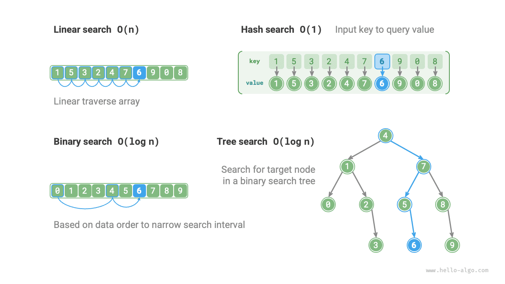

# Search algorithms revisited

<u>Searching algorithms (searching algorithm)</u> are used to search for one or several elements that meet specific criteria in data structures such as arrays, linked lists, trees, or graphs.

Searching algorithms can be divided into the following two categories based on their implementation approaches.

- **Locating the target element by traversing the data structure**, such as traversals of arrays, linked lists, trees, and graphs, etc.
- **Using the organizational structure of the data or the prior information contained in the data to achieve efficient element search**, such as binary search, hash search, and binary search tree search, etc.

It is not difficult to notice that these topics have been introduced in previous chapters, so searching algorithms are not unfamiliar to us. In this section, we will revisit searching algorithms from a more systematic perspective.

## Brute-force search

Brute-force search locates the target element by traversing every element of the data structure.

- "Linear search" is suitable for linear data structures such as arrays and linked lists. It starts from one end of the data structure, accesses each element one by one, until the target element is found or the other end is reached without finding the target element.
- "Breadth-first search" and "Depth-first search" are two traversal strategies for graphs and trees. Breadth-first search starts from the initial node and searches layer by layer, accessing nodes from near to far. Depth-first search starts from the initial node, follows a path until the end, then backtracks and tries other paths until the entire data structure is traversed.

The advantage of brute-force search is its simplicity and versatility, **no need for data preprocessing and the help of additional data structures**.

However, **the time complexity of this type of algorithm is $O(n)$**, where $n$ is the number of elements, so the performance is poor in cases of large data volumes.

## Adaptive search

Adaptive search uses the unique properties of data (such as order) to optimize the search process, thereby locating the target element more efficiently.

- "Binary search" uses the orderliness of data to achieve efficient searching, only suitable for arrays.
- "Hash search" uses a hash table to establish a key-value mapping between search data and target data, thus implementing the query operation.
- "Tree search" in a specific tree structure (such as a binary search tree), quickly eliminates nodes based on node value comparisons, thus locating the target element.

The advantage of these algorithms is high efficiency, **with time complexities reaching $O(\log n)$ or even $O(1)$**.

However, **using these algorithms often requires data preprocessing**. For example, binary search requires sorting the array in advance, and hash search and tree search both require the help of additional data structures, maintaining these structures also requires extra time and space overhead.

!!! tip

    Adaptive search algorithms are often referred to as search algorithms, **mainly used for quickly retrieving target elements in specific data structures**.

## Choosing a search method

Given a set of data of size $n$, we can use linear search, binary search, tree search, hash search, and other methods to search for the target element from it. The working principles of these methods are shown in the figure below.

The operation efficiency and characteristics of the aforementioned methods are shown in the following table.

 Table <id> &nbsp; Comparison of search algorithm efficiency 

|                    | Linear search | Binary search         | Tree search                 | Hash search                |
| ------------------ | ------------- | --------------------- | --------------------------- | -------------------------- |
| Search element     | $O(n)$        | $O(\log n)$           | $O(\log n)$                 | $O(1)$                     |
| Insert element     | $O(1)$        | $O(n)$                | $O(\log n)$                 | $O(1)$                     |
| Delete element     | $O(n)$        | $O(n)$                | $O(\log n)$                 | $O(1)$                     |
| Extra space        | $O(1)$        | $O(1)$                | $O(n)$                      | $O(n)$                     |
| Data preprocessing | /             | Sorting $O(n \log n)$ | Building tree $O(n \log n)$ | Building hash table $O(n)$ |
| Data orderliness   | Unordered     | Ordered               | Ordered                     | Unordered                  |

The choice of search algorithm also depends on the volume of data, search performance requirements, data query and update frequency, etc.

**Linear search**

- Good versatility, no need for any data preprocessing operations. If we only need to query the data once, then the time for data preprocessing in the other three methods would be longer than the time for linear search.
- Suitable for small volumes of data, where time complexity has a smaller impact on efficiency.
- Suitable for scenarios with high data update frequency, because this method does not require any additional maintenance of the data.

**Binary search**

- Suitable for large data volumes, with stable efficiency performance, the worst time complexity being $O(\log n)$.
- The data volume cannot be too large, because storing arrays requires contiguous memory space.
- Not suitable for scenarios with frequent additions and deletions, because maintaining an ordered array incurs high overhead.

**Hash search**

- Suitable for scenarios with high query performance requirements, with an average time complexity of $O(1)$.
- Not suitable for scenarios needing ordered data or range searches, because hash tables cannot maintain data orderliness.
- High dependency on hash functions and hash collision handling strategies, with significant performance degradation risks.
- Not suitable for overly large data volumes, because hash tables need extra space to minimize collisions and provide good query performance.

**Tree search**

- Suitable for massive data, because tree nodes are stored scattered in memory.
- Suitable for maintaining ordered data or range searches.
- In the continuous addition and deletion of nodes, the binary search tree may become skewed, degrading the time complexity to $O(n)$.
- If using AVL trees or red-black trees, operations can run stably at $O(\log n)$ efficiency, but the operation to maintain tree balance adds extra overhead.
