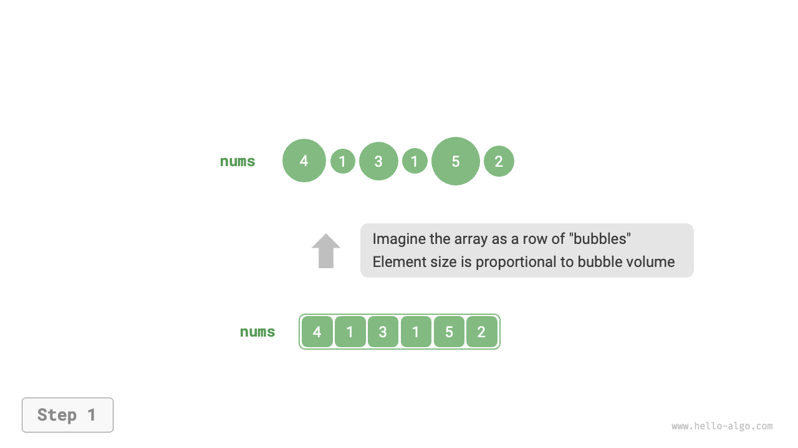
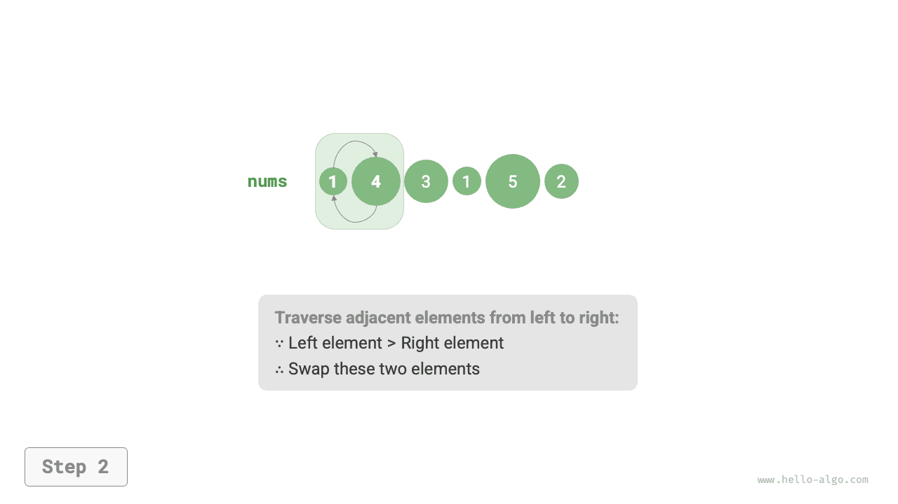
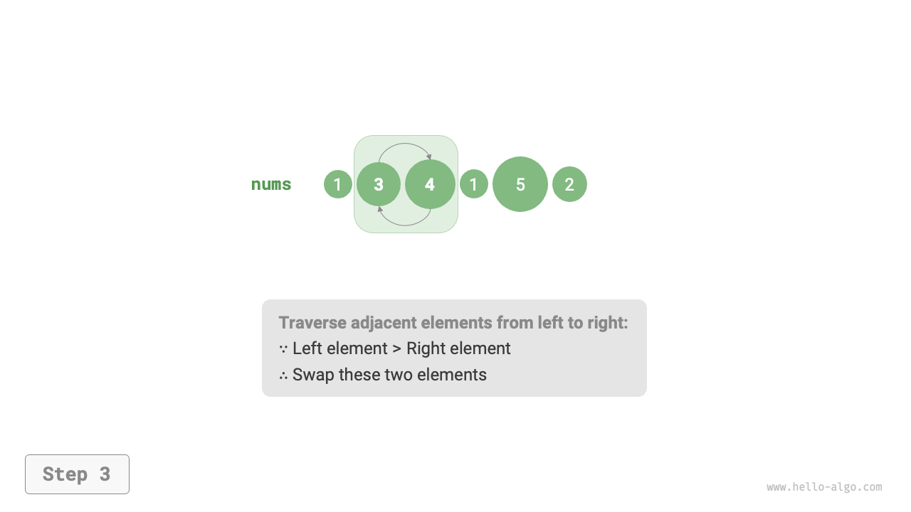
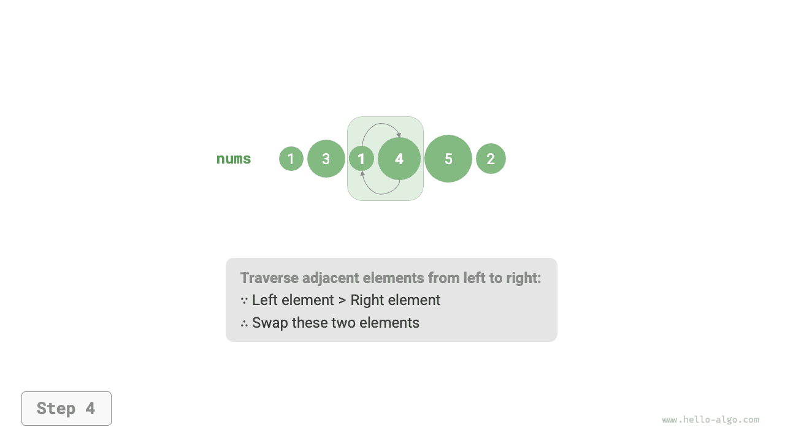
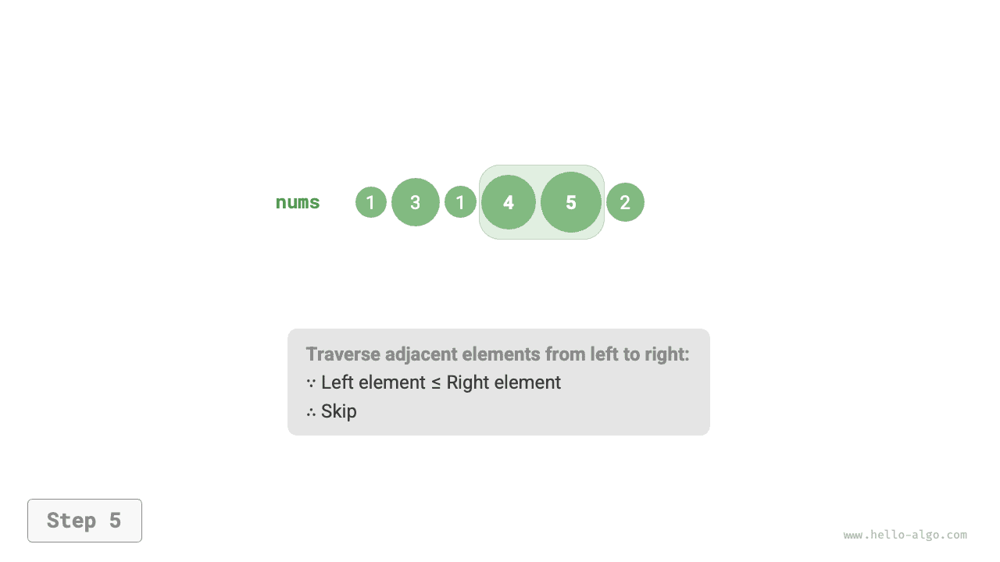
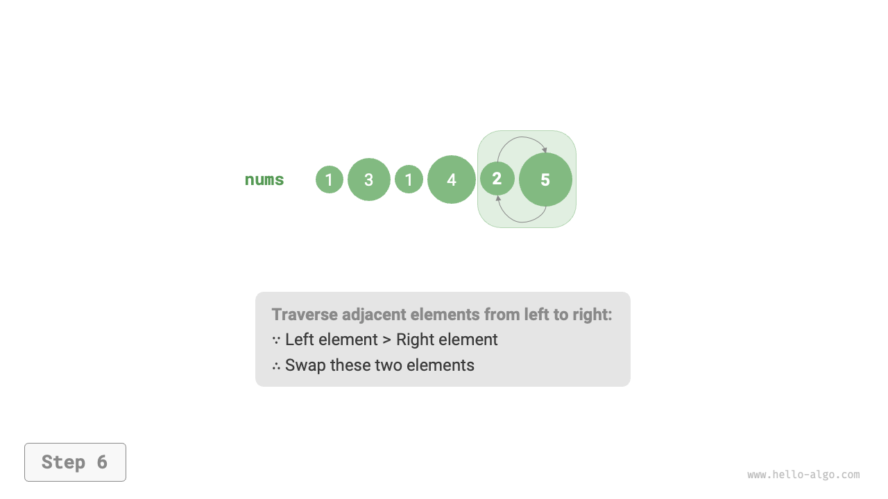
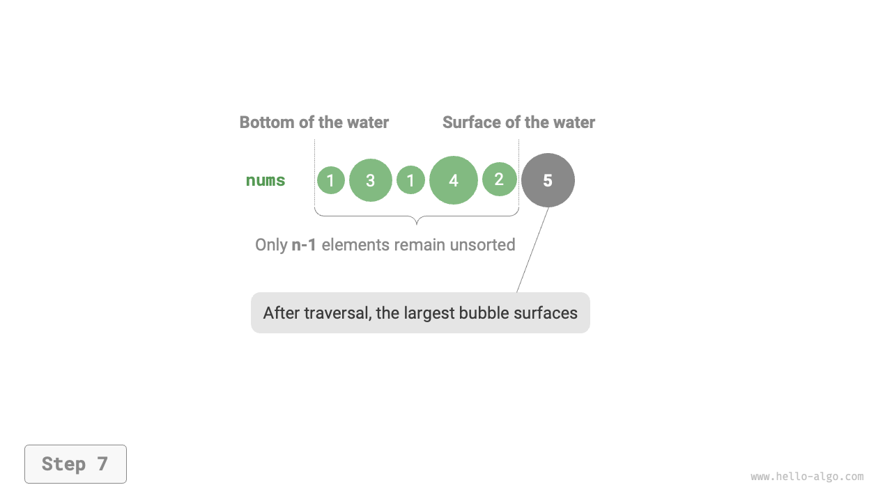
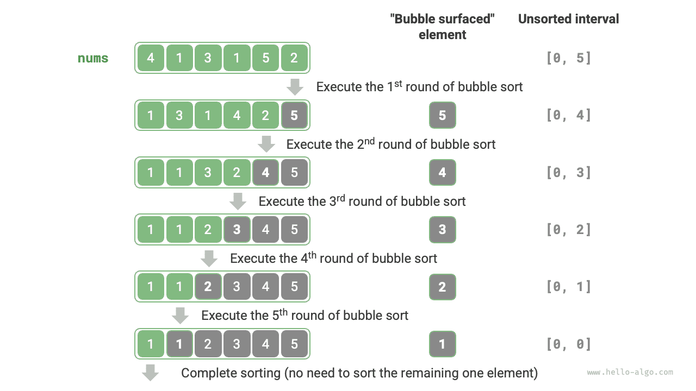

# Bubble sort

<u>Bubble sort</u> achieves sorting by continuously comparing and swapping adjacent elements. This process resembles bubbles rising from the bottom to the top, hence the name bubble sort.

As shown in the figure below, the bubbling process can be simulated using element swap operations: starting from the leftmost end of the array and moving right, sequentially compare the size of adjacent elements. If "left element > right element," then swap them. After the traversal, the largest element will be moved to the far right end of the array.

=== "<1>"
    

=== "<2>"
    

=== "<3>"
    

=== "<4>"
    

=== "<5>"
    

=== "<6>"
    

=== "<7>"
    

## Algorithm process

Assuming the length of the array is $n$, the steps of bubble sort are shown in the figure below.

1. First, perform a "bubble" on $n$ elements, **swapping the largest element to its correct position**.
2. Next, perform a "bubble" on the remaining $n - 1$ elements, **swapping the second largest element to its correct position**.
3. Similarly, after $n - 1$ rounds of "bubbling," **the top $n - 1$ largest elements will be swapped to their correct positions**.
4. The only remaining element is necessarily the smallest and does not require sorting, thus the array sorting is complete.



Example code is as follows:

```src
[file]{bubble_sort}-[class]{}-[func]{bubble_sort}
```

## Efficiency optimization

We find that if no swaps are performed in a round of "bubbling," the array is already sorted, and we can return the result immediately. Thus, we can add a flag `flag` to monitor this situation and return immediately when it occurs.

Even after optimization, the worst-case time complexity and average time complexity of bubble sort remain at $O(n^2)$; however, when the input array is completely ordered, it can achieve the best time complexity of $O(n)$.

```src
[file]{bubble_sort}-[class]{}-[func]{bubble_sort_with_flag}
```

## Algorithm characteristics

- **Time complexity of $O(n^2)$, adaptive sorting**: The length of the array traversed in each round of "bubbling" decreases sequentially from $n - 1$, $n - 2$, $\dots$, $2$, $1$, totaling $(n - 1) n / 2$. With the introduction of `flag` optimization, the best time complexity can reach $O(n)$.
- **Space complexity of $O(1)$, in-place sorting**: Only a constant amount of extra space is used by pointers $i$ and $j$.
- **Stable sorting**: As equal elements are not swapped during the "bubbling".
