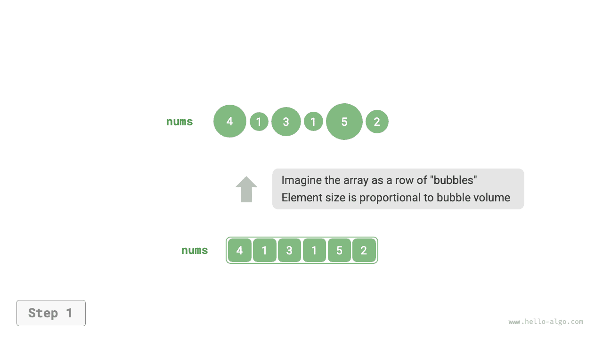
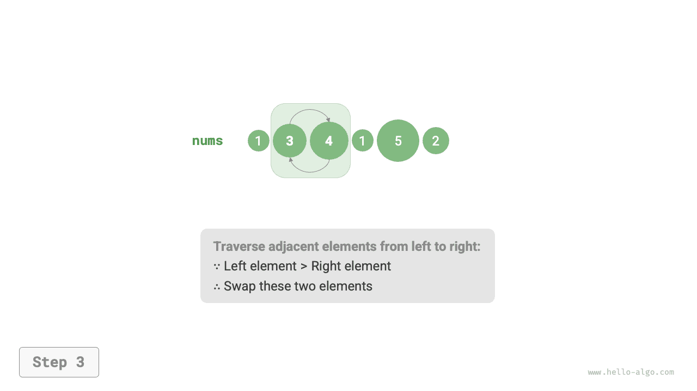
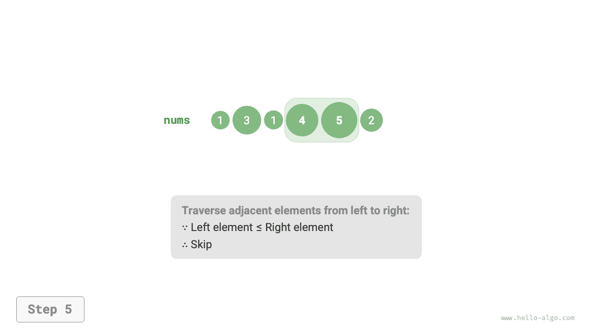
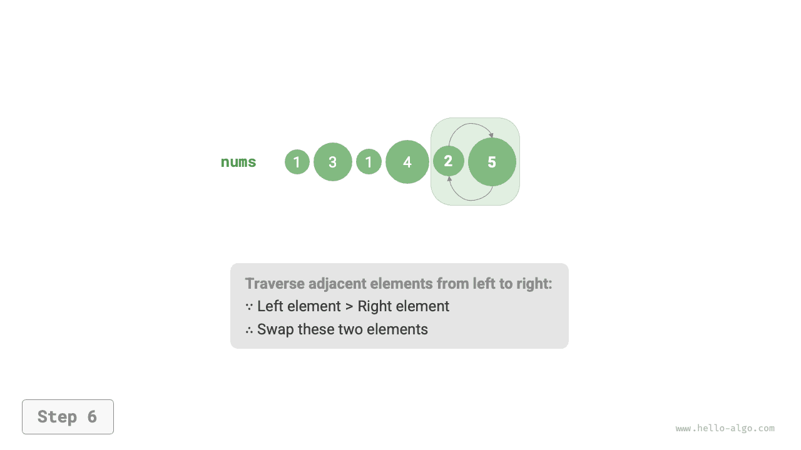
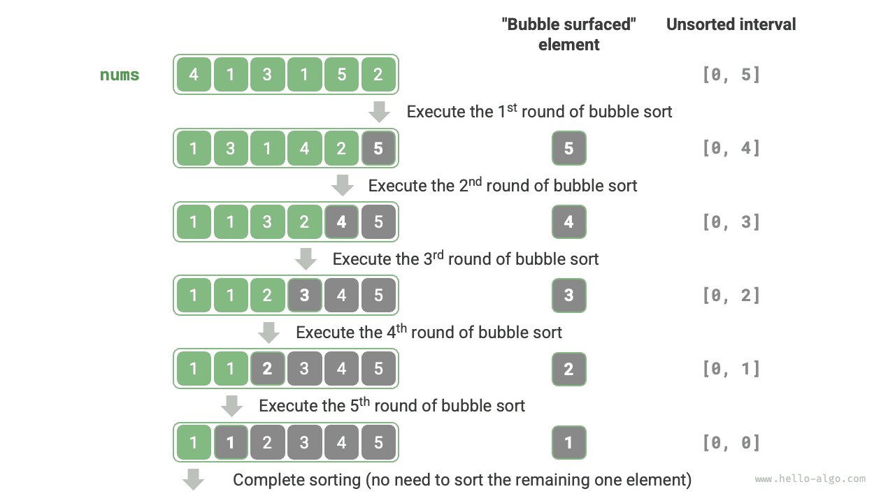

# Bubble Sort

<u>Bubble sort</u> sorts an array by continuously comparing and swapping adjacent elements. This process resembles bubbles rising from the bottom to the top, hence the name bubble sort.

As shown in the figure below, the bubbling process can be simulated using element swaps: starting from the leftmost end of the array and traversing to the right, compare each pair of adjacent elements, and if "left element > right element", swap them. After the traversal is complete, the largest element is moved to the rightmost end of the array.

=== "<1>"
    

=== "<2>"
    

=== "<3>"
    

=== "<4>"
    

=== "<5>"
    

=== "<6>"
    

=== "<7>"
    

## Algorithm Flow

Assume the array has length $n$. The steps of bubble sort are shown in the figure below.

1. First, perform "bubbling" on $n$ elements, **swapping the largest element of the array to its correct position**.
2. Next, perform "bubbling" on the remaining $n - 1$ elements, **swapping the second largest element to its correct position**.
3. And so on. After $n - 1$ rounds of "bubbling", **the largest $n - 1$ elements have all been swapped to their correct positions**.
4. The only remaining element must be the smallest element, requiring no sorting, so the array sorting is complete.



Example code is as follows:

```src
[file]{bubble_sort}-[class]{}-[func]{bubble_sort}
```

## Efficiency Optimization

We can observe that if no swaps occur during a round of "bubbling", the array is already sorted and the algorithm can return immediately. Therefore, we can add a flag `flag` to detect this situation and terminate as soon as it occurs.

After this optimization, the worst-case and average-case time complexities of bubble sort remain $O(n^2)$; however, when the input array is already sorted, the best-case time complexity becomes $O(n)$.

```src
[file]{bubble_sort}-[class]{}-[func]{bubble_sort_with_flag}
```

## Algorithm Characteristics

- **Time complexity is $O(n^2)$; adaptive**: In successive rounds of "bubbling", the traversed portion of the array has lengths $n - 1$, $n - 2$, $\dots$, $2$, $1$, for a total of $(n - 1) n / 2$. After introducing the `flag` optimization, the best-case time complexity can reach $O(n)$.
- **Space complexity of $O(1)$, in-place sorting**: Pointers $i$ and $j$ use a constant amount of extra space.
- **Stable sorting**: Equal elements are not swapped during "bubbling".
