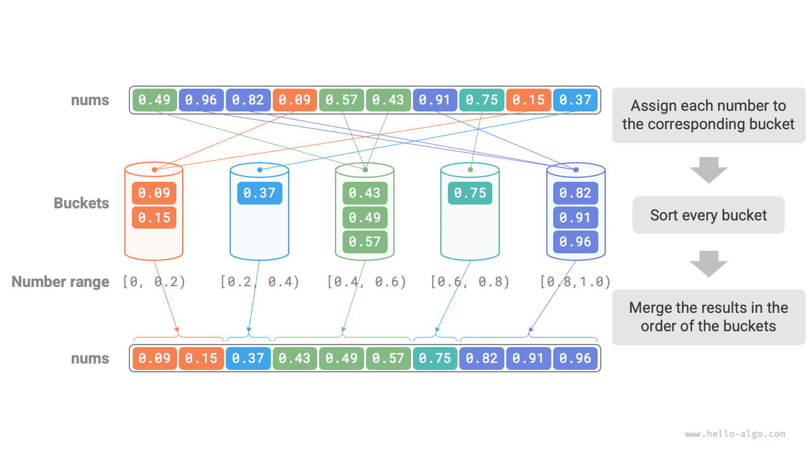
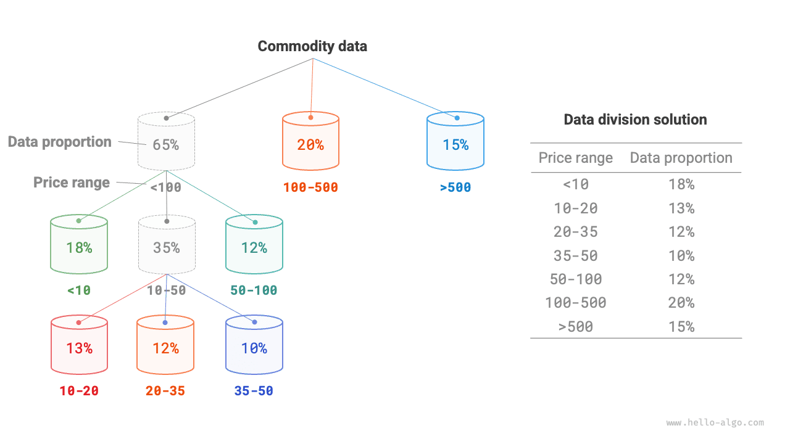
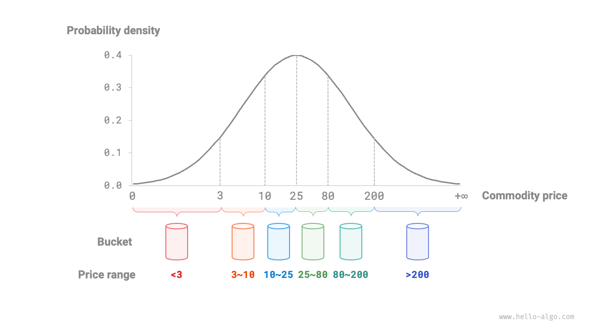

# Bucket Sort

The several sorting algorithms mentioned earlier all belong to "comparison-based sorting algorithms", which achieve sorting by comparing the size of elements. The time complexity of such sorting algorithms cannot exceed $O(n \log n)$. Next, we will explore several "non-comparison sorting algorithms", whose time complexity can reach linear order.

<u>Bucket sort (bucket sort)</u> is a typical application of the divide-and-conquer strategy. It works by setting up buckets with size order, each bucket corresponding to a data range, evenly distributing data to each bucket; then, sorting within each bucket separately; finally, merging all data in the order of the buckets.

## Algorithm Flow

Consider an array of length $n$, whose elements are floating-point numbers in the range $[0, 1)$. The flow of bucket sort is shown in the figure below.

1. Initialize $k$ buckets and distribute the $n$ elements into the $k$ buckets.
2. Sort each bucket separately (here we use the built-in sorting function of the programming language).
3. Merge the results in order from smallest to largest bucket.



The code is as follows:

```src
[file]{bucket_sort}-[class]{}-[func]{bucket_sort}
```

## Algorithm Characteristics

Bucket sort is suitable for processing very large data volumes. For example, if the input data contains 1 million elements and system memory cannot load all the data at once, the data can be divided into 1000 buckets, each bucket sorted separately, and then the results merged.

- **Time complexity of $O(n + k)$**: Assuming the elements are evenly distributed among the buckets, then the number of elements in each bucket is $\frac{n}{k}$. Assuming sorting a single bucket uses $O(\frac{n}{k} \log\frac{n}{k})$ time, then sorting all buckets uses $O(n \log\frac{n}{k})$ time. **When the number of buckets $k$ is relatively large, the time complexity approaches $O(n)$**. Merging results requires traversing all buckets and elements, taking $O(n + k)$ time. In the worst case, all data is distributed into one bucket, and sorting that bucket uses $O(n^2)$ time.
- **Space complexity of $O(n + k)$, non-in-place sorting**: Additional space is required for $k$ buckets and a total of $n$ elements.
- Whether bucket sort is stable depends on whether the algorithm for sorting elements within buckets is stable.

## How to Achieve Even Distribution

Theoretically, bucket sort can achieve $O(n)$ time complexity. **The key is to evenly distribute elements to each bucket**, because real data is often not evenly distributed. For example, if we want to evenly distribute all products on Taobao into 10 buckets by price range, there may be very many products below 100 yuan and very few above 1000 yuan. If the price intervals are evenly divided into 10, the difference in the number of products in each bucket will be very large.

To achieve even distribution, we can first set an approximate dividing line to roughly divide the data into 3 buckets. **After distribution is complete, continue dividing buckets with more products into 3 buckets until the number of elements in all buckets is roughly equal**.

As shown in the figure below, this method essentially creates a recursion tree, with the goal of making the values of leaf nodes as even as possible. Of course, it is not necessary to divide the data into 3 buckets every round; the specific division method can be flexibly chosen according to data characteristics.



If we know the probability distribution of product prices in advance, **we can set the price dividing line for each bucket based on the data probability distribution**. It is worth noting that the data distribution does not necessarily need to be specifically calculated, but can also be approximated using a certain probability model based on data characteristics.

As shown in the figure below, we assume that product prices follow a normal distribution, which allows us to reasonably set price intervals to evenly distribute products to each bucket.


