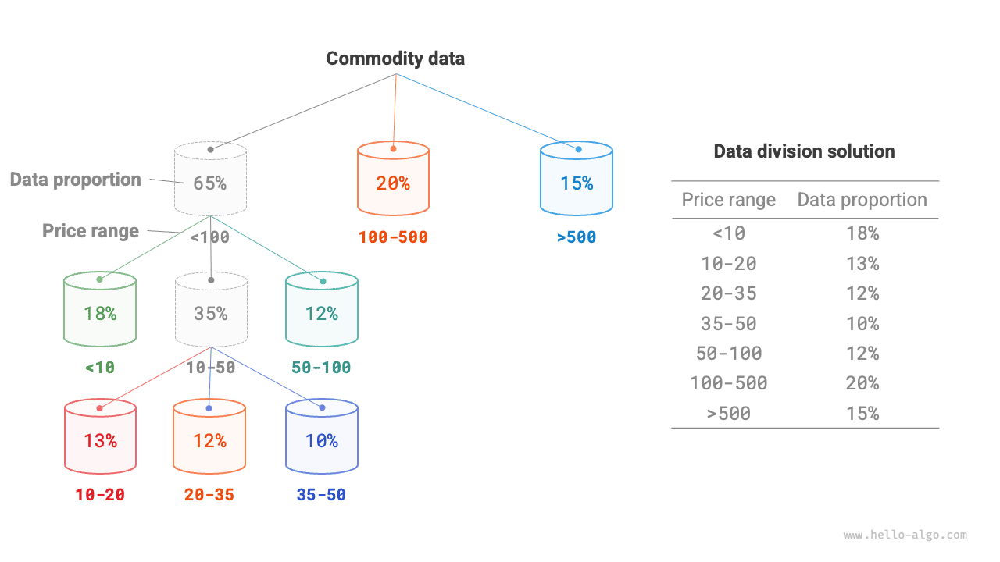

# Bucket Sort

The sorting algorithms discussed earlier are all comparison-based sorting algorithms, which sort by comparing the relative order of elements. The time complexity of such algorithms cannot beat $O(n \log n)$. Next, we will explore several non-comparison sorting algorithms, whose time complexity can be linear.

<u>Bucket sort</u> is a typical application of the divide-and-conquer strategy. It works by creating a sequence of ordered buckets, each corresponding to a data range, and distributing the data evenly among them. The elements within each bucket are then sorted separately. Finally, all buckets are merged in order.

## Algorithm Flow

Consider an array of length $n$, whose elements are floating-point numbers in the range $[0, 1)$. The flow of bucket sort is shown in the figure below.

1. Initialize $k$ buckets and distribute the $n$ elements into the $k$ buckets.
2. Sort each bucket separately (here we use the built-in sorting function of the programming language).
3. Merge the results in order from smallest to largest bucket.


The code is as follows:

```src
[file]{bucket_sort}-[class]{}-[func]{bucket_sort}
```

## Algorithm Characteristics

Bucket sort is suitable for processing very large datasets. For example, suppose the input contains 1 million elements, and limited memory prevents the system from loading all of them at once. In that case, the data can be divided into 1000 buckets, each bucket can be sorted separately, and the results can then be merged.

- **Time complexity is $O(n + k)$**: Assuming the elements are evenly distributed across the buckets, each bucket contains $\frac{n}{k}$ elements. If sorting a single bucket takes $O(\frac{n}{k} \log\frac{n}{k})$ time, then sorting all buckets takes $O(n \log\frac{n}{k})$ time. **When the number of buckets $k$ is relatively large, the time complexity approaches $O(n)$**. Merging the results requires traversing all buckets and elements, which takes $O(n + k)$ time. In the worst case, all data is placed into a single bucket, and sorting that bucket takes $O(n^2)$ time.
- **Space complexity is $O(n + k)$, and bucket sort is not in-place**: It requires extra space for $k$ buckets and a total of $n$ elements.
- Whether bucket sort is stable depends on whether the algorithm for sorting elements within buckets is stable.

## How to Achieve Even Distribution

In theory, bucket sort can achieve $O(n)$ time complexity. **The key is to distribute the elements evenly across the buckets**, because real-world data is often not uniformly distributed. For example, suppose we want to divide all products on Taobao evenly into 10 buckets by price range, but the price distribution is uneven: there are many products priced below 100 yuan and very few priced above 1000 yuan. If the price range is divided evenly into 10 intervals, the numbers of products in the buckets will differ greatly.

To achieve a more even distribution, we can first choose a rough boundary and partition the data into 3 buckets. **After that, buckets containing more products can be further divided into 3 buckets until the numbers of elements in all buckets are roughly equal**.

As shown in the figure below, this method essentially builds a recursion tree whose goal is to make the leaf nodes as balanced as possible. Of course, the data does not have to be split into 3 buckets in every round; the specific partitioning strategy can be chosen flexibly based on the characteristics of the data.



If we know the probability distribution of product prices in advance, **we can set the price boundaries for each bucket according to that distribution**. Notably, the data distribution does not need to be measured exactly; it can also be approximated with a probability model chosen to fit the characteristics of the data.

As shown in the figure below, we assume that product prices follow a normal distribution, which allows us to reasonably set price intervals to evenly distribute products to each bucket.


