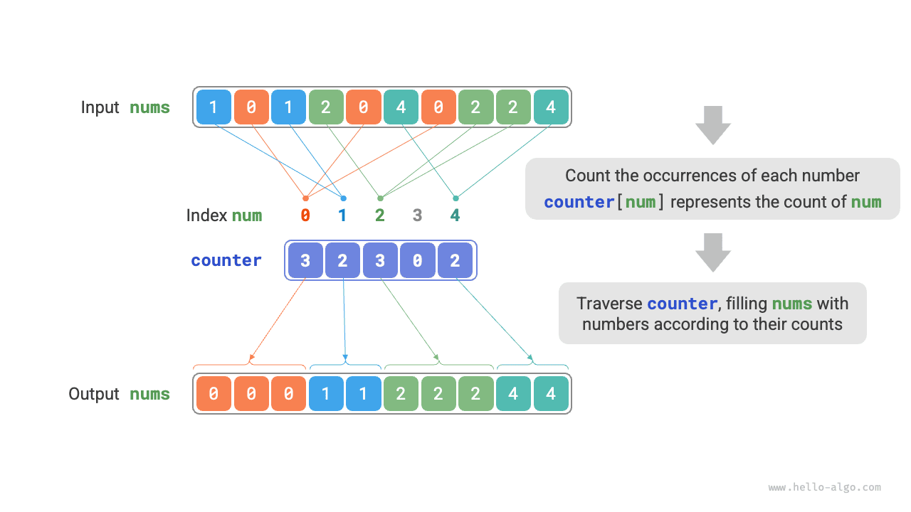
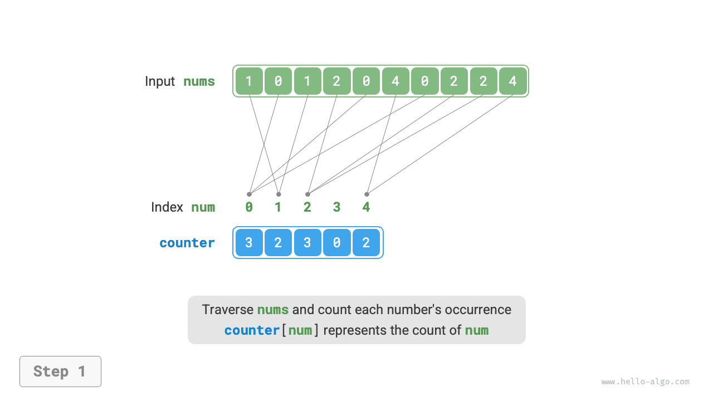
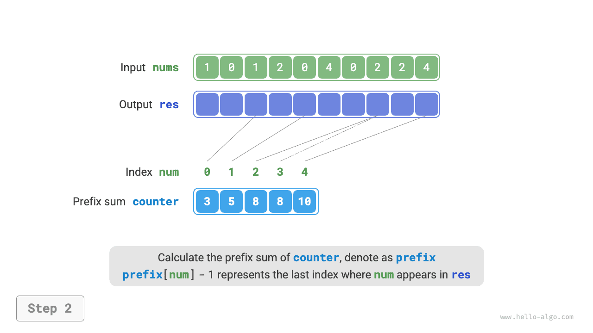
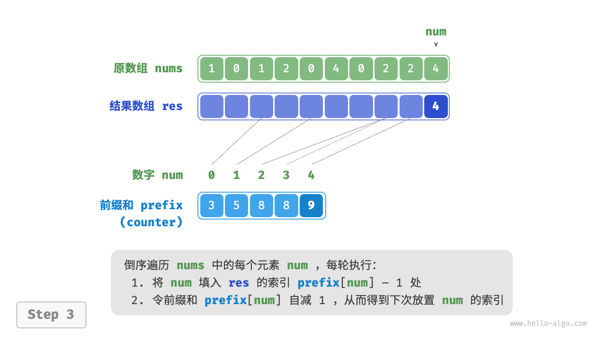
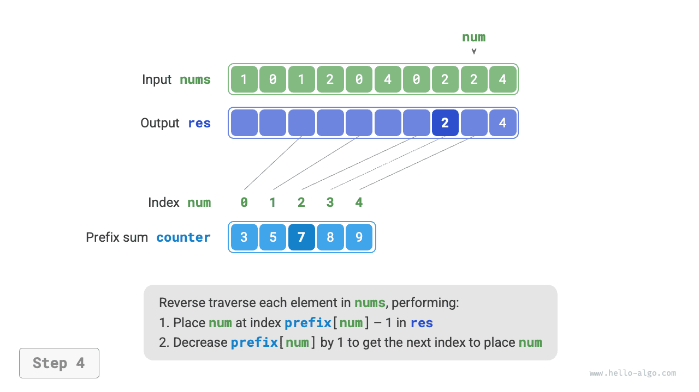
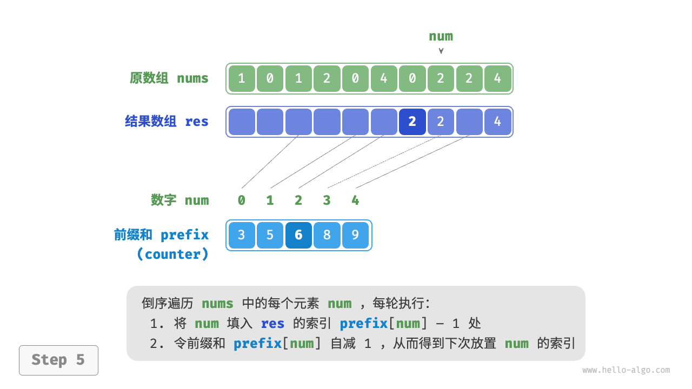
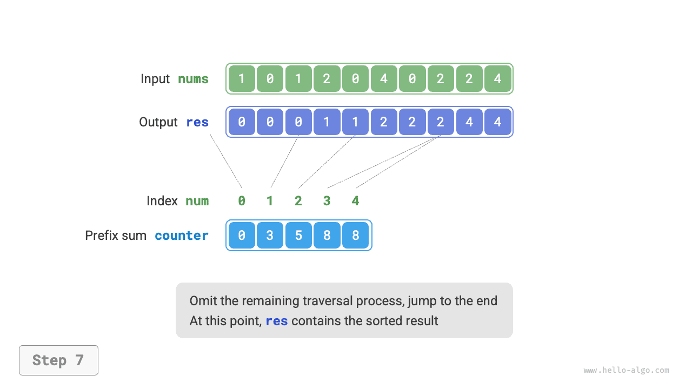

# Counting sort

<u>Counting sort</u> achieves sorting by counting the number of elements, typically applied to arrays of integers.

## Simple implementation

Let's start with a simple example. Given an array `nums` of length $n$, where all elements are "non-negative integers", the overall process of counting sort is illustrated in the figure below.

1. Traverse the array to find the maximum number, denoted as $m$, then create an auxiliary array `counter` of length $m + 1$.
2. **Use `counter` to count the occurrence of each number in `nums`**, where `counter[num]` corresponds to the occurrence of the number `num`. The counting method is simple, just traverse `nums` (suppose the current number is `num`), and increase `counter[num]` by $1$ each round.
3. **Since the indices of `counter` are naturally ordered, all numbers are essentially sorted already**. Next, we traverse `counter`, filling `nums` in ascending order of occurrence.



The code is shown below:

```src
[file]{counting_sort}-[class]{}-[func]{counting_sort_naive}
```

!!! note "Connection between counting sort and bucket sort"

    From the perspective of bucket sort, we can consider each index of the counting array `counter` in counting sort as a bucket, and the process of counting as distributing elements into the corresponding buckets. Essentially, counting sort is a special case of bucket sort for integer data.

## Complete implementation

Astute readers might have noticed, **if the input data is an object, the above step `3.` becomes ineffective**. Suppose the input data is a product object, we want to sort the products by their price (a class member variable), but the above algorithm can only provide the sorting result for the price.

So how can we get the sorting result for the original data? First, we calculate the "prefix sum" of `counter`. As the name suggests, the prefix sum at index `i`, `prefix[i]`, equals the sum of the first `i` elements of the array:

$$
\text{prefix}[i] = \sum_{j=0}^i \text{counter[j]}
$$

**The prefix sum has a clear meaning, `prefix[num] - 1` represents the last occurrence index of element `num` in the result array `res`**. This information is crucial, as it tells us where each element should appear in the result array. Next, we traverse the original array `nums` for each element `num` in reverse order, performing the following two steps in each iteration.

1. Fill `num` into the array `res` at the index `prefix[num] - 1`.
2. Reduce the prefix sum `prefix[num]` by $1$, thus obtaining the next index to place `num`.

After the traversal, the array `res` contains the sorted result, and finally, `res` replaces the original array `nums`. The complete counting sort process is shown in the figure below.

=== "<1>"
    

=== "<2>"
    

=== "<3>"
    

=== "<4>"
    

=== "<5>"
    

=== "<6>"
    

=== "<7>"
    

=== "<8>"
    

The implementation code of counting sort is shown below:

```src
[file]{counting_sort}-[class]{}-[func]{counting_sort}
```

## Algorithm characteristics

- **Time complexity is $O(n + m)$, non-adaptive sort**: Involves traversing `nums` and `counter`, both using linear time. Generally, $n \gg m$, and the time complexity tends towards $O(n)$.
- **Space complexity is $O(n + m)$, non-in-place sort**: Utilizes arrays `res` and `counter` of lengths $n$ and $m$ respectively.
- **Stable sort**: Since elements are filled into `res` in a "right-to-left" order, reversing the traversal of `nums` can prevent changing the relative position between equal elements, thereby achieving a stable sort. Actually, traversing `nums` in order can also produce the correct sorting result, but the outcome is unstable.

## Limitations

By now, you might find counting sort very clever, as it can achieve efficient sorting merely by counting quantities. However, the prerequisites for using counting sort are relatively strict.

**Counting sort is only suitable for non-negative integers**. If you want to apply it to other types of data, you need to ensure that these data can be converted to non-negative integers without changing the relative sizes of the elements. For example, for an array containing negative integers, you can first add a constant to all numbers, converting them all to positive numbers, and then convert them back after sorting is complete.

**Counting sort is suitable for large data volumes but small data ranges**. For example, in the above example, $m$ should not be too large, otherwise, it will occupy too much space. And when $n \ll m$, counting sort uses $O(m)$ time, which may be slower than $O(n \log n)$ sorting algorithms.
