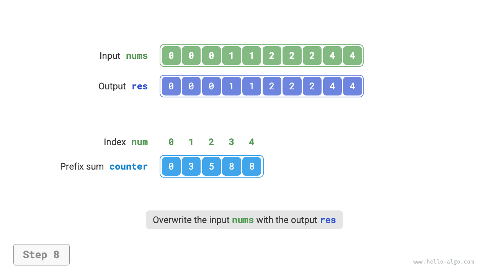

# 11.9 &nbsp; Counting Sort

<u>Counting sort</u> sorts by counting the occurrences of elements and is typically applied to integer arrays.

## 11.9.1 &nbsp; Simple Implementation

Let's start with a simple example. Given an array `nums` of length $n$, where the elements are all "non-negative integers", the overall flow of counting sort is shown in Figure 11-16.

1. Traverse the array to find the largest number, denoted as $m$, and then create an auxiliary array `counter` of length $m + 1$.
2. **Use `counter` to count how many times each number appears in `nums`**, where `counter[num]` stores the number of occurrences of `num`. This is simple: traverse `nums` (denote the current number by `num`) and increment `counter[num]` by $1$ each time.
3. **Because the indices of `counter` are naturally ordered, the numbers are effectively already sorted**. Next, traverse `counter` and write the numbers back into `nums` in ascending order according to their occurrence counts.

{ class="animation-figure" }

<p align="center"> Figure 11-16 &nbsp; Counting sort flow </p>

The code is as follows:

=== "Python"

    ```python title="counting_sort.py"
    def counting_sort_naive(nums: list[int]):
        """Counting sort"""
        # Simple implementation, cannot be used for sorting objects
        # 1. Count the maximum element m in the array
        m = 0
        for num in nums:
            m = max(m, num)
        # 2. Count the occurrence of each number
        # counter[num] represents the occurrence of num
        counter = [0] * (m + 1)
        for num in nums:
            counter[num] += 1
        # 3. Traverse counter, filling each element back into the original array nums
        i = 0
        for num in range(m + 1):
            for _ in range(counter[num]):
                nums[i] = num
                i += 1
    ```

=== "C++"

    ```cpp title="counting_sort.cpp"
    /* Counting sort */
    // Simple implementation, cannot be used for sorting objects
    void countingSortNaive(vector<int> &nums) {
        // 1. Count the maximum element m in the array
        int m = 0;
        for (int num : nums) {
            m = max(m, num);
        }
        // 2. Count the occurrence of each number
        // counter[num] represents the occurrence of num
        vector<int> counter(m + 1, 0);
        for (int num : nums) {
            counter[num]++;
        }
        // 3. Traverse counter, filling each element back into the original array nums
        int i = 0;
        for (int num = 0; num < m + 1; num++) {
            for (int j = 0; j < counter[num]; j++, i++) {
                nums[i] = num;
            }
        }
    }
    ```

=== "Java"

    ```java title="counting_sort.java"
    /* Counting sort */
    // Simple implementation, cannot be used for sorting objects
    void countingSortNaive(int[] nums) {
        // 1. Count the maximum element m in the array
        int m = 0;
        for (int num : nums) {
            m = Math.max(m, num);
        }
        // 2. Count the occurrence of each number
        // counter[num] represents the occurrence of num
        int[] counter = new int[m + 1];
        for (int num : nums) {
            counter[num]++;
        }
        // 3. Traverse counter, filling each element back into the original array nums
        int i = 0;
        for (int num = 0; num < m + 1; num++) {
            for (int j = 0; j < counter[num]; j++, i++) {
                nums[i] = num;
            }
        }
    }
    ```

=== "C#"

    ```csharp title="counting_sort.cs"
    /* Counting sort */
    // Simple implementation, cannot be used for sorting objects
    void CountingSortNaive(int[] nums) {
        // 1. Count the maximum element m in the array
        int m = 0;
        foreach (int num in nums) {
            m = Math.Max(m, num);
        }
        // 2. Count the occurrence of each number
        // counter[num] represents the occurrence of num
        int[] counter = new int[m + 1];
        foreach (int num in nums) {
            counter[num]++;
        }
        // 3. Traverse counter, filling each element back into the original array nums
        int i = 0;
        for (int num = 0; num < m + 1; num++) {
            for (int j = 0; j < counter[num]; j++, i++) {
                nums[i] = num;
            }
        }
    }
    ```

=== "Go"

    ```go title="counting_sort.go"
    /* Counting sort */
    // Simple implementation, cannot be used for sorting objects
    func countingSortNaive(nums []int) {
        // 1. Count the maximum element m in the array
        m := 0
        for _, num := range nums {
            if num > m {
                m = num
            }
        }
        // 2. Count the occurrence of each number
        // counter[num] represents the occurrence of num
        counter := make([]int, m+1)
        for _, num := range nums {
            counter[num]++
        }
        // 3. Traverse counter, filling each element back into the original array nums
        for i, num := 0, 0; num < m+1; num++ {
            for j := 0; j < counter[num]; j++ {
                nums[i] = num
                i++
            }
        }
    }
    ```

=== "Swift"

    ```swift title="counting_sort.swift"
    /* Counting sort */
    // Simple implementation, cannot be used for sorting objects
    func countingSortNaive(nums: inout [Int]) {
        // 1. Count the maximum element m in the array
        let m = nums.max()!
        // 2. Count the occurrence of each number
        // counter[num] represents the occurrence of num
        var counter = Array(repeating: 0, count: m + 1)
        for num in nums {
            counter[num] += 1
        }
        // 3. Traverse counter, filling each element back into the original array nums
        var i = 0
        for num in 0 ..< m + 1 {
            for _ in 0 ..< counter[num] {
                nums[i] = num
                i += 1
            }
        }
    }
    ```

=== "JS"

    ```javascript title="counting_sort.js"
    /* Counting sort */
    // Simple implementation, cannot be used for sorting objects
    function countingSortNaive(nums) {
        // 1. Count the maximum element m in the array
        let m = Math.max(...nums);
        // 2. Count the occurrence of each number
        // counter[num] represents the occurrence of num
        const counter = new Array(m + 1).fill(0);
        for (const num of nums) {
            counter[num]++;
        }
        // 3. Traverse counter, filling each element back into the original array nums
        let i = 0;
        for (let num = 0; num < m + 1; num++) {
            for (let j = 0; j < counter[num]; j++, i++) {
                nums[i] = num;
            }
        }
    }
    ```

=== "TS"

    ```typescript title="counting_sort.ts"
    /* Counting sort */
    // Simple implementation, cannot be used for sorting objects
    function countingSortNaive(nums: number[]): void {
        // 1. Count the maximum element m in the array
        let m: number = Math.max(...nums);
        // 2. Count the occurrence of each number
        // counter[num] represents the occurrence of num
        const counter: number[] = new Array<number>(m + 1).fill(0);
        for (const num of nums) {
            counter[num]++;
        }
        // 3. Traverse counter, filling each element back into the original array nums
        let i = 0;
        for (let num = 0; num < m + 1; num++) {
            for (let j = 0; j < counter[num]; j++, i++) {
                nums[i] = num;
            }
        }
    }
    ```

=== "Dart"

    ```dart title="counting_sort.dart"
    /* Counting sort */
    // Simple implementation, cannot be used for sorting objects
    void countingSortNaive(List<int> nums) {
      // 1. Count the maximum element m in the array
      int m = 0;
      for (int _num in nums) {
        m = max(m, _num);
      }
      // 2. Count the occurrence of each number
      // counter[_num] represents occurrence count of _num
      List<int> counter = List.filled(m + 1, 0);
      for (int _num in nums) {
        counter[_num]++;
      }
      // 3. Traverse counter, filling each element back into the original array nums
      int i = 0;
      for (int _num = 0; _num < m + 1; _num++) {
        for (int j = 0; j < counter[_num]; j++, i++) {
          nums[i] = _num;
        }
      }
    }
    ```

=== "Rust"

    ```rust title="counting_sort.rs"
    /* Counting sort */
    // Simple implementation, cannot be used for sorting objects
    fn counting_sort_naive(nums: &mut [i32]) {
        // 1. Count the maximum element m in the array
        let m = *nums.iter().max().unwrap();
        // 2. Count the occurrence of each number
        // counter[num] represents the occurrence of num
        let mut counter = vec![0; m as usize + 1];
        for &num in nums.iter() {
            counter[num as usize] += 1;
        }
        // 3. Traverse counter, filling each element back into the original array nums
        let mut i = 0;
        for num in 0..m + 1 {
            for _ in 0..counter[num as usize] {
                nums[i] = num;
                i += 1;
            }
        }
    }
    ```

=== "C"

    ```c title="counting_sort.c"
    /* Counting sort */
    // Simple implementation, cannot be used for sorting objects
    void countingSortNaive(int nums[], int size) {
        // 1. Count the maximum element m in the array
        int m = 0;
        for (int i = 0; i < size; i++) {
            if (nums[i] > m) {
                m = nums[i];
            }
        }
        // 2. Count the occurrence of each number
        // counter[num] represents the occurrence of num
        int *counter = calloc(m + 1, sizeof(int));
        for (int i = 0; i < size; i++) {
            counter[nums[i]]++;
        }
        // 3. Traverse counter, filling each element back into the original array nums
        int i = 0;
        for (int num = 0; num < m + 1; num++) {
            for (int j = 0; j < counter[num]; j++, i++) {
                nums[i] = num;
            }
        }
        // 4. Free memory
        free(counter);
    }
    ```

=== "Kotlin"

    ```kotlin title="counting_sort.kt"
    /* Counting sort */
    // Simple implementation, cannot be used for sorting objects
    fun countingSortNaive(nums: IntArray) {
        // 1. Count the maximum element m in the array
        var m = 0
        for (num in nums) {
            m = max(m, num)
        }
        // 2. Count the occurrence of each number
        // counter[num] represents the occurrence of num
        val counter = IntArray(m + 1)
        for (num in nums) {
            counter[num]++
        }
        // 3. Traverse counter, filling each element back into the original array nums
        var i = 0
        for (num in 0..<m + 1) {
            var j = 0
            while (j < counter[num]) {
                nums[i] = num
                j++
                i++
            }
        }
    }
    ```

=== "Ruby"

    ```ruby title="counting_sort.rb"
    ### Counting sort ###
    def counting_sort_naive(nums)
      # Simple implementation, cannot be used for sorting objects
      # 1. Count the maximum element m in the array
      m = 0
      nums.each { |num| m = [m, num].max }
      # 2. Count the occurrence of each number
      # counter[num] represents the occurrence of num
      counter = Array.new(m + 1, 0)
      nums.each { |num| counter[num] += 1 }
      # 3. Traverse counter, filling each element back into the original array nums
      i = 0
      for num in 0...(m + 1)
        (0...counter[num]).each do
          nums[i] = num
          i += 1
        end
      end
    end
    ```

!!! note "Connection between counting sort and bucket sort"

    From the perspective of bucket sort, each index of the counting array `counter` can be viewed as a bucket, and the counting process can be seen as distributing elements into their corresponding buckets. Essentially, counting sort is a special case of bucket sort for integer data.

## 11.9.2 &nbsp; Complete Implementation

Observant readers may have noticed that **if the input consists of objects, step `3.` above no longer works**. Suppose the input consists of product objects and we want to sort them by price (a member variable of the class); the above algorithm can only produce the sorted order of the prices themselves.

So how can we obtain the sorted order of the original data? We first compute the prefix sums of `counter`. As the name suggests, the prefix sum at index `i`, `prefix[i]`, equals the sum of the elements from index `0` through `i`:

$$
\text{prefix}[i] = \sum_{j=0}^i \text{counter[j]}
$$

**The prefix sum has a clear interpretation: `prefix[num] - 1` gives the index of the last occurrence of element `num` in the result array `res`**. This information is crucial because it tells us where each element should be placed in the result array. Next, we traverse the original array `nums` in reverse, and for each element `num`, perform the following two steps.

1. Place `num` at index `prefix[num] - 1` of the array `res`.
2. Decrease the prefix sum `prefix[num]` by $1$ to get the index for the next placement of `num`.

After the traversal is complete, the array `res` contains the sorted result, and finally `res` is used to overwrite the original array `nums`. The complete counting sort flow is shown in Figure 11-17.

=== "<1>"
    { class="animation-figure" }

=== "<2>"
    { class="animation-figure" }

=== "<3>"
    { class="animation-figure" }

=== "<4>"
    { class="animation-figure" }

=== "<5>"
    { class="animation-figure" }

=== "<6>"
    { class="animation-figure" }

=== "<7>"
    { class="animation-figure" }

=== "<8>"
    { class="animation-figure" }

<p align="center"> Figure 11-17 &nbsp; Counting sort steps </p>

The counting sort implementation is shown below:

=== "Python"

    ```python title="counting_sort.py"
    def counting_sort(nums: list[int]):
        """Counting sort"""
        # Complete implementation, can sort objects and is a stable sort
        # 1. Count the maximum element m in the array
        m = max(nums)
        # 2. Count the occurrence of each number
        # counter[num] represents the occurrence of num
        counter = [0] * (m + 1)
        for num in nums:
            counter[num] += 1
        # 3. Calculate the prefix sum of counter, converting "occurrence count" to "tail index"
        # counter[num]-1 is the last index where num appears in res
        for i in range(m):
            counter[i + 1] += counter[i]
        # 4. Traverse nums in reverse order, placing each element into the result array res
        # Initialize the array res to record results
        n = len(nums)
        res = [0] * n
        for i in range(n - 1, -1, -1):
            num = nums[i]
            res[counter[num] - 1] = num  # Place num at the corresponding index
            counter[num] -= 1  # Decrement the prefix sum by 1, getting the next index to place num
        # Use result array res to overwrite the original array nums
        for i in range(n):
            nums[i] = res[i]
    ```

=== "C++"

    ```cpp title="counting_sort.cpp"
    /* Counting sort */
    // Complete implementation, can sort objects and is a stable sort
    void countingSort(vector<int> &nums) {
        // 1. Count the maximum element m in the array
        int m = 0;
        for (int num : nums) {
            m = max(m, num);
        }
        // 2. Count the occurrence of each number
        // counter[num] represents the occurrence of num
        vector<int> counter(m + 1, 0);
        for (int num : nums) {
            counter[num]++;
        }
        // 3. Calculate the prefix sum of counter, converting "occurrence count" to "tail index"
        // counter[num]-1 is the last index where num appears in res
        for (int i = 0; i < m; i++) {
            counter[i + 1] += counter[i];
        }
        // 4. Traverse nums in reverse order, placing each element into the result array res
        // Initialize the array res to record results
        int n = nums.size();
        vector<int> res(n);
        for (int i = n - 1; i >= 0; i--) {
            int num = nums[i];
            res[counter[num] - 1] = num; // Place num at the corresponding index
            counter[num]--;              // Decrement the prefix sum by 1, getting the next index to place num
        }
        // Use result array res to overwrite the original array nums
        nums = res;
    }
    ```

=== "Java"

    ```java title="counting_sort.java"
    /* Counting sort */
    // Complete implementation, can sort objects and is a stable sort
    void countingSort(int[] nums) {
        // 1. Count the maximum element m in the array
        int m = 0;
        for (int num : nums) {
            m = Math.max(m, num);
        }
        // 2. Count the occurrence of each number
        // counter[num] represents the occurrence of num
        int[] counter = new int[m + 1];
        for (int num : nums) {
            counter[num]++;
        }
        // 3. Calculate the prefix sum of counter, converting "occurrence count" to "tail index"
        // counter[num]-1 is the last index where num appears in res
        for (int i = 0; i < m; i++) {
            counter[i + 1] += counter[i];
        }
        // 4. Traverse nums in reverse order, placing each element into the result array res
        // Initialize the array res to record results
        int n = nums.length;
        int[] res = new int[n];
        for (int i = n - 1; i >= 0; i--) {
            int num = nums[i];
            res[counter[num] - 1] = num; // Place num at the corresponding index
            counter[num]--; // Decrement the prefix sum by 1, getting the next index to place num
        }
        // Use result array res to overwrite the original array nums
        for (int i = 0; i < n; i++) {
            nums[i] = res[i];
        }
    }
    ```

=== "C#"

    ```csharp title="counting_sort.cs"
    /* Counting sort */
    // Complete implementation, can sort objects and is a stable sort
    void CountingSort(int[] nums) {
        // 1. Count the maximum element m in the array
        int m = 0;
        foreach (int num in nums) {
            m = Math.Max(m, num);
        }
        // 2. Count the occurrence of each number
        // counter[num] represents the occurrence of num
        int[] counter = new int[m + 1];
        foreach (int num in nums) {
            counter[num]++;
        }
        // 3. Calculate the prefix sum of counter, converting "occurrence count" to "tail index"
        // counter[num]-1 is the last index where num appears in res
        for (int i = 0; i < m; i++) {
            counter[i + 1] += counter[i];
        }
        // 4. Traverse nums in reverse order, placing each element into the result array res
        // Initialize the array res to record results
        int n = nums.Length;
        int[] res = new int[n];
        for (int i = n - 1; i >= 0; i--) {
            int num = nums[i];
            res[counter[num] - 1] = num; // Place num at the corresponding index
            counter[num]--; // Decrement the prefix sum by 1, getting the next index to place num
        }
        // Use result array res to overwrite the original array nums
        for (int i = 0; i < n; i++) {
            nums[i] = res[i];
        }
    }
    ```

=== "Go"

    ```go title="counting_sort.go"
    /* Counting sort */
    // Complete implementation, can sort objects and is a stable sort
    func countingSort(nums []int) {
        // 1. Count the maximum element m in the array
        m := 0
        for _, num := range nums {
            if num > m {
                m = num
            }
        }
        // 2. Count the occurrence of each number
        // counter[num] represents the occurrence of num
        counter := make([]int, m+1)
        for _, num := range nums {
            counter[num]++
        }
        // 3. Calculate the prefix sum of counter, converting "occurrence count" to "tail index"
        // counter[num]-1 is the last index where num appears in res
        for i := 0; i < m; i++ {
            counter[i+1] += counter[i]
        }
        // 4. Traverse nums in reverse order, placing each element into the result array res
        // Initialize the array res to record results
        n := len(nums)
        res := make([]int, n)
        for i := n - 1; i >= 0; i-- {
            num := nums[i]
            // Place num at the corresponding index
            res[counter[num]-1] = num
            // Decrement the prefix sum by 1, getting the next index to place num
            counter[num]--
        }
        // Use result array res to overwrite the original array nums
        copy(nums, res)
    }
    ```

=== "Swift"

    ```swift title="counting_sort.swift"
    /* Counting sort */
    // Complete implementation, can sort objects and is a stable sort
    func countingSort(nums: inout [Int]) {
        // 1. Count the maximum element m in the array
        let m = nums.max()!
        // 2. Count the occurrence of each number
        // counter[num] represents the occurrence of num
        var counter = Array(repeating: 0, count: m + 1)
        for num in nums {
            counter[num] += 1
        }
        // 3. Calculate the prefix sum of counter, converting "occurrence count" to "tail index"
        // counter[num]-1 is the last index where num appears in res
        for i in 0 ..< m {
            counter[i + 1] += counter[i]
        }
        // 4. Traverse nums in reverse order, placing each element into the result array res
        // Initialize the array res to record results
        var res = Array(repeating: 0, count: nums.count)
        for i in nums.indices.reversed() {
            let num = nums[i]
            res[counter[num] - 1] = num // Place num at the corresponding index
            counter[num] -= 1 // Decrement the prefix sum by 1, getting the next index to place num
        }
        // Use result array res to overwrite the original array nums
        for i in nums.indices {
            nums[i] = res[i]
        }
    }
    ```

=== "JS"

    ```javascript title="counting_sort.js"
    /* Counting sort */
    // Complete implementation, can sort objects and is a stable sort
    function countingSort(nums) {
        // 1. Count the maximum element m in the array
        let m = Math.max(...nums);
        // 2. Count the occurrence of each number
        // counter[num] represents the occurrence of num
        const counter = new Array(m + 1).fill(0);
        for (const num of nums) {
            counter[num]++;
        }
        // 3. Calculate the prefix sum of counter, converting "occurrence count" to "tail index"
        // counter[num]-1 is the last index where num appears in res
        for (let i = 0; i < m; i++) {
            counter[i + 1] += counter[i];
        }
        // 4. Traverse nums in reverse order, placing each element into the result array res
        // Initialize the array res to record results
        const n = nums.length;
        const res = new Array(n);
        for (let i = n - 1; i >= 0; i--) {
            const num = nums[i];
            res[counter[num] - 1] = num; // Place num at the corresponding index
            counter[num]--; // Decrement the prefix sum by 1, getting the next index to place num
        }
        // Use result array res to overwrite the original array nums
        for (let i = 0; i < n; i++) {
            nums[i] = res[i];
        }
    }
    ```

=== "TS"

    ```typescript title="counting_sort.ts"
    /* Counting sort */
    // Complete implementation, can sort objects and is a stable sort
    function countingSort(nums: number[]): void {
        // 1. Count the maximum element m in the array
        let m: number = Math.max(...nums);
        // 2. Count the occurrence of each number
        // counter[num] represents the occurrence of num
        const counter: number[] = new Array<number>(m + 1).fill(0);
        for (const num of nums) {
            counter[num]++;
        }
        // 3. Calculate the prefix sum of counter, converting "occurrence count" to "tail index"
        // counter[num]-1 is the last index where num appears in res
        for (let i = 0; i < m; i++) {
            counter[i + 1] += counter[i];
        }
        // 4. Traverse nums in reverse order, placing each element into the result array res
        // Initialize the array res to record results
        const n = nums.length;
        const res: number[] = new Array<number>(n);
        for (let i = n - 1; i >= 0; i--) {
            const num = nums[i];
            res[counter[num] - 1] = num; // Place num at the corresponding index
            counter[num]--; // Decrement the prefix sum by 1, getting the next index to place num
        }
        // Use result array res to overwrite the original array nums
        for (let i = 0; i < n; i++) {
            nums[i] = res[i];
        }
    }
    ```

=== "Dart"

    ```dart title="counting_sort.dart"
    /* Counting sort */
    // Complete implementation, can sort objects and is a stable sort
    void countingSort(List<int> nums) {
      // 1. Count the maximum element m in the array
      int m = 0;
      for (int _num in nums) {
        m = max(m, _num);
      }
      // 2. Count the occurrence of each number
      // counter[_num] represents occurrence count of _num
      List<int> counter = List.filled(m + 1, 0);
      for (int _num in nums) {
        counter[_num]++;
      }
      // 3. Calculate the prefix sum of counter, converting "occurrence count" to "tail index"
      // That is, counter[_num]-1 is the last occurrence index of _num in res
      for (int i = 0; i < m; i++) {
        counter[i + 1] += counter[i];
      }
      // 4. Traverse nums in reverse order, placing each element into the result array res
      // Initialize the array res to record results
      int n = nums.length;
      List<int> res = List.filled(n, 0);
      for (int i = n - 1; i >= 0; i--) {
        int _num = nums[i];
        res[counter[_num] - 1] = _num; // Place _num at corresponding index
        counter[_num]--; // Decrement prefix sum by 1 to get next placement index for _num
      }
      // Use result array res to overwrite the original array nums
      nums.setAll(0, res);
    }
    ```

=== "Rust"

    ```rust title="counting_sort.rs"
    /* Counting sort */
    // Complete implementation, can sort objects and is a stable sort
    fn counting_sort(nums: &mut [i32]) {
        // 1. Count the maximum element m in the array
        let m = *nums.iter().max().unwrap() as usize;
        // 2. Count the occurrence of each number
        // counter[num] represents the occurrence of num
        let mut counter = vec![0; m + 1];
        for &num in nums.iter() {
            counter[num as usize] += 1;
        }
        // 3. Calculate the prefix sum of counter, converting "occurrence count" to "tail index"
        // counter[num]-1 is the last index where num appears in res
        for i in 0..m {
            counter[i + 1] += counter[i];
        }
        // 4. Traverse nums in reverse order, placing each element into the result array res
        // Initialize the array res to record results
        let n = nums.len();
        let mut res = vec![0; n];
        for i in (0..n).rev() {
            let num = nums[i];
            res[counter[num as usize] - 1] = num; // Place num at the corresponding index
            counter[num as usize] -= 1; // Decrement the prefix sum by 1, getting the next index to place num
        }
        // Use result array res to overwrite the original array nums
        nums.copy_from_slice(&res)
    }
    ```

=== "C"

    ```c title="counting_sort.c"
    /* Counting sort */
    // Complete implementation, can sort objects and is a stable sort
    void countingSort(int nums[], int size) {
        // 1. Count the maximum element m in the array
        int m = 0;
        for (int i = 0; i < size; i++) {
            if (nums[i] > m) {
                m = nums[i];
            }
        }
        // 2. Count the occurrence of each number
        // counter[num] represents the occurrence of num
        int *counter = calloc(m, sizeof(int));
        for (int i = 0; i < size; i++) {
            counter[nums[i]]++;
        }
        // 3. Calculate the prefix sum of counter, converting "occurrence count" to "tail index"
        // counter[num]-1 is the last index where num appears in res
        for (int i = 0; i < m; i++) {
            counter[i + 1] += counter[i];
        }
        // 4. Traverse nums in reverse order, placing each element into the result array res
        // Initialize the array res to record results
        int *res = malloc(sizeof(int) * size);
        for (int i = size - 1; i >= 0; i--) {
            int num = nums[i];
            res[counter[num] - 1] = num; // Place num at the corresponding index
            counter[num]--;              // Decrement the prefix sum by 1, getting the next index to place num
        }
        // Use result array res to overwrite the original array nums
        memcpy(nums, res, size * sizeof(int));
        // 5. Free memory
        free(res);
        free(counter);
    }
    ```

=== "Kotlin"

    ```kotlin title="counting_sort.kt"
    /* Counting sort */
    // Complete implementation, can sort objects and is a stable sort
    fun countingSort(nums: IntArray) {
        // 1. Count the maximum element m in the array
        var m = 0
        for (num in nums) {
            m = max(m, num)
        }
        // 2. Count the occurrence of each number
        // counter[num] represents the occurrence of num
        val counter = IntArray(m + 1)
        for (num in nums) {
            counter[num]++
        }
        // 3. Calculate the prefix sum of counter, converting "occurrence count" to "tail index"
        // counter[num]-1 is the last index where num appears in res
        for (i in 0..<m) {
            counter[i + 1] += counter[i]
        }
        // 4. Traverse nums in reverse order, placing each element into the result array res
        // Initialize the array res to record results
        val n = nums.size
        val res = IntArray(n)
        for (i in n - 1 downTo 0) {
            val num = nums[i]
            res[counter[num] - 1] = num // Place num at the corresponding index
            counter[num]-- // Decrement the prefix sum by 1, getting the next index to place num
        }
        // Use result array res to overwrite the original array nums
        for (i in 0..<n) {
            nums[i] = res[i]
        }
    }
    ```

=== "Ruby"

    ```ruby title="counting_sort.rb"
    ### Counting sort ###
    def counting_sort(nums)
      # Complete implementation, can sort objects and is a stable sort
      # 1. Count the maximum element m in the array
      m = nums.max
      # 2. Count the occurrence of each number
      # counter[num] represents the occurrence of num
      counter = Array.new(m + 1, 0)
      nums.each { |num| counter[num] += 1 }
      # 3. Calculate the prefix sum of counter, converting "occurrence count" to "tail index"
      # counter[num]-1 is the last index where num appears in res
      (0...m).each { |i| counter[i + 1] += counter[i] }
      # 4. Traverse nums in reverse, fill elements into result array res
      # Initialize the array res to record results
      n = nums.length
      res = Array.new(n, 0)
      (n - 1).downto(0).each do |i|
        num = nums[i]
        res[counter[num] - 1] = num # Place num at the corresponding index
        counter[num] -= 1 # Decrement the prefix sum by 1, getting the next index to place num
      end
      # Use result array res to overwrite the original array nums
      (0...n).each { |i| nums[i] = res[i] }
    end
    ```

## 11.9.3 &nbsp; Algorithm Characteristics

- **Time complexity is $O(n + m)$, and counting sort is non-adaptive**: Traversing `nums` and `counter` both takes linear time. In general, when $n \gg m$, the time complexity approaches $O(n)$.
- **Space complexity of $O(n + m)$, non-in-place sorting**: Uses arrays `res` and `counter` of lengths $n$ and $m$ respectively.
- **Stable sorting**: Since elements are filled into `res` in a "right-to-left" order, traversing `nums` in reverse can avoid changing the relative positions of equal elements, thereby achieving stable sorting. In fact, traversing `nums` in forward order can also yield correct sorting results, but the result would be unstable.

## 11.9.4 &nbsp; Limitations

At this point, you might think counting sort is quite ingenious because it achieves efficient sorting simply by counting occurrences. However, the prerequisites for using counting sort are fairly restrictive.

**Counting sort is only applicable to non-negative integers**. To apply it to other types of data, you must ensure that they can be converted to non-negative integers without changing the relative ordering of the elements. For example, for an integer array containing negative numbers, you can first add a constant to every number to shift them into the non-negative range, and then shift them back after sorting.

**Counting sort is well suited to cases with many elements but a small value range**. For example, in the above scenario, $m$ cannot be too large; otherwise, it consumes too much space. And when $n \ll m$, counting sort takes $O(m)$ time, which may be slower than sorting algorithms with $O(n \log n)$ time complexity.
