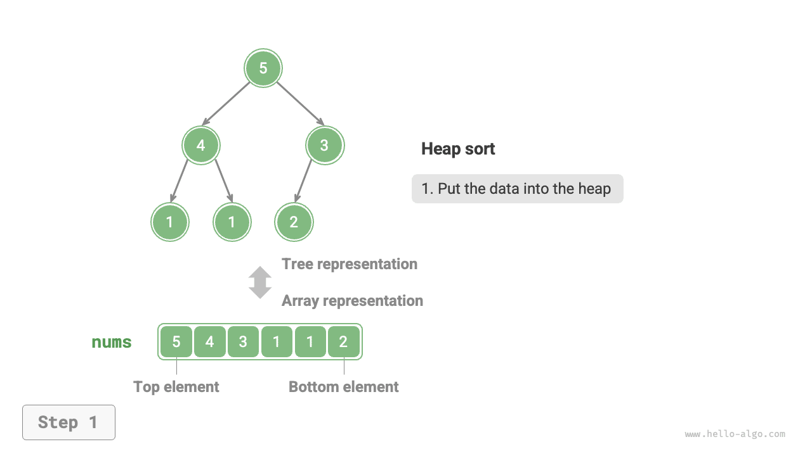
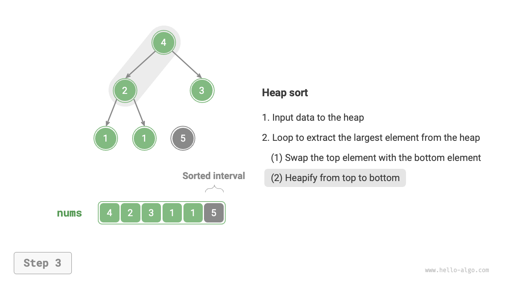
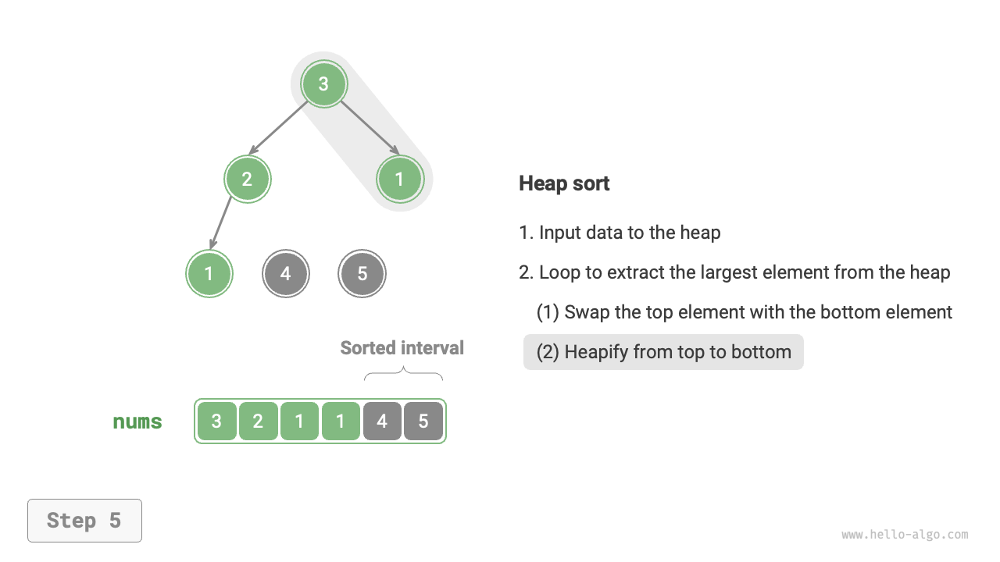
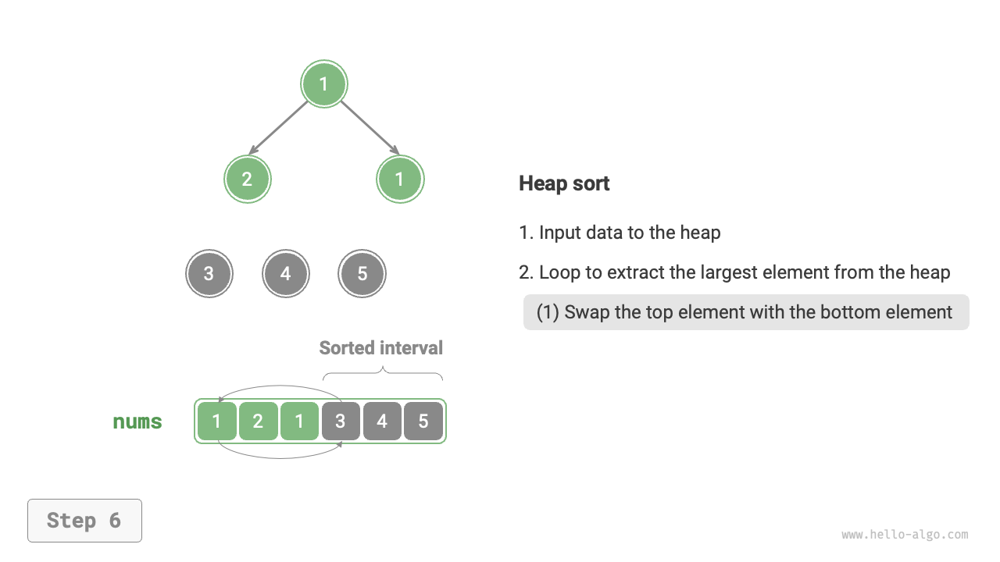
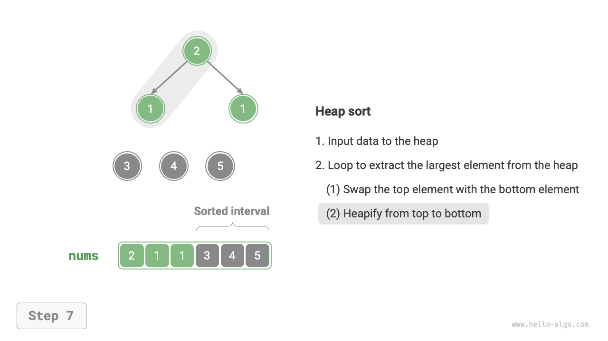
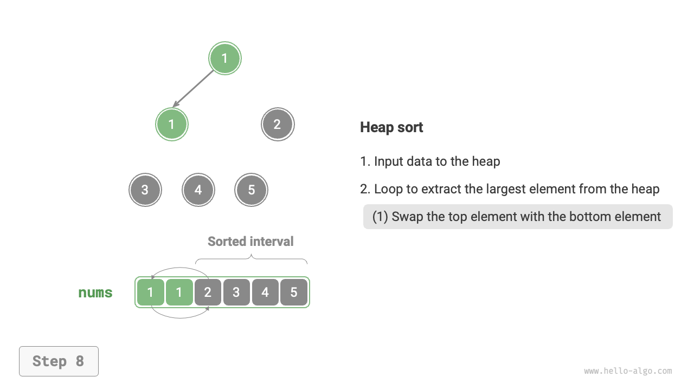
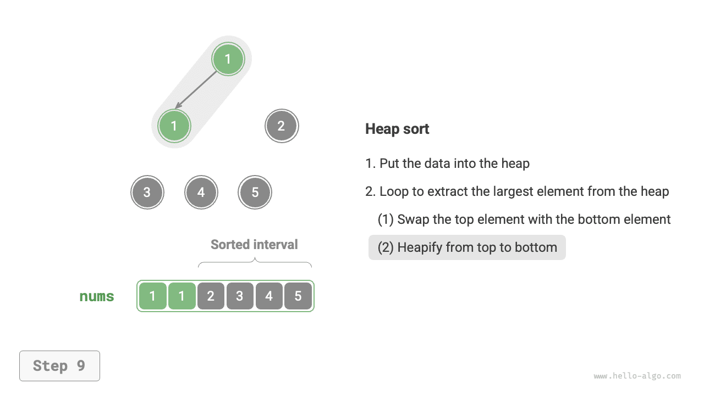
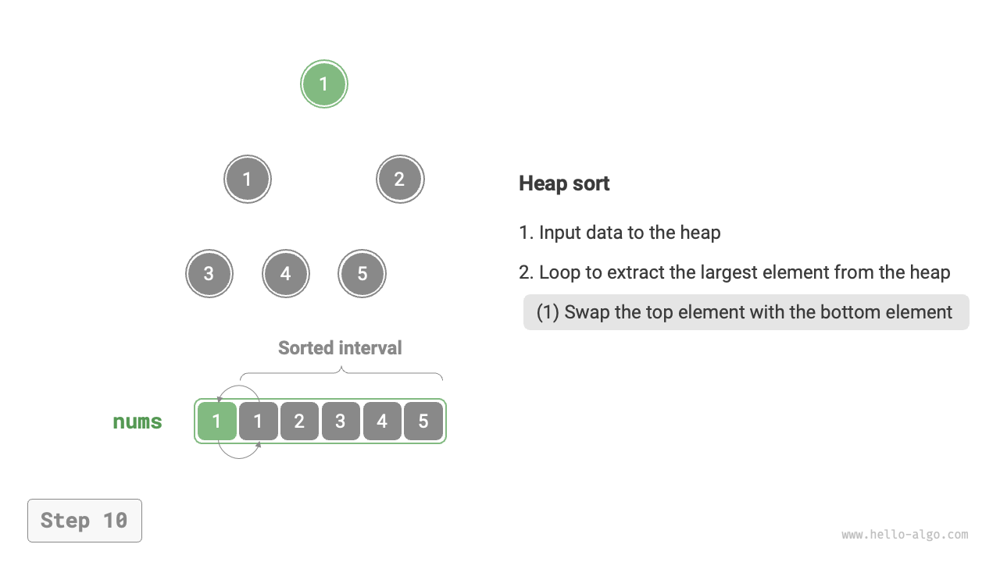
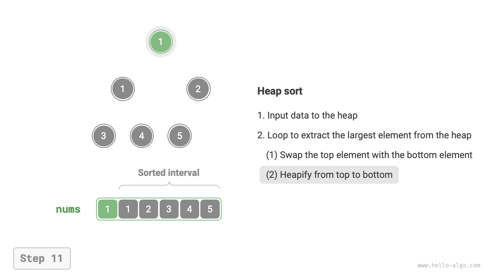
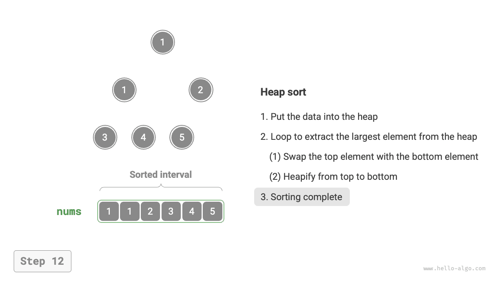

# Heap sort

!!! tip

    Before reading this section, please make sure you have completed the "Heap" chapter.

<u>Heap sort</u> is an efficient sorting algorithm based on the heap data structure. We can implement heap sort using the "heap creation" and "element extraction" operations we have already learned.

1. Input the array and establish a min-heap, where the smallest element is at the heap's top.
2. Continuously perform the extraction operation, recording the extracted elements in sequence to obtain a sorted list from smallest to largest.

Although the above method is feasible, it requires an additional array to save the popped elements, which is somewhat space-consuming. In practice, we usually use a more elegant implementation.

## Algorithm flow

Suppose the array length is $n$, the heap sort process is as follows.

1. Input the array and establish a max-heap. After completion, the largest element is at the heap's top.
2. Swap the top element of the heap (the first element) with the heap's bottom element (the last element). After the swap, reduce the heap's length by $1$ and increase the sorted elements count by $1$.
3. Starting from the heap top, perform the sift-down operation from top to bottom. After the sift-down, the heap's property is restored.
4. Repeat steps `2.` and `3.` Loop for $n - 1$ rounds to complete the sorting of the array.

!!! tip

    In fact, the element extraction operation also includes steps `2.` and `3.`, with the addition of a popping element step.

=== "<1>"
    

=== "<2>"
    

=== "<3>"
    

=== "<4>"
    

=== "<5>"
    

=== "<6>"
    

=== "<7>"
    

=== "<8>"
    

=== "<9>"
    

=== "<10>"
    

=== "<11>"
    

=== "<12>"
    

In the code implementation, we used the sift-down function `sift_down()` from the "Heap" chapter. It is important to note that since the heap's length decreases as the maximum element is extracted, we need to add a length parameter $n$ to the `sift_down()` function to specify the current effective length of the heap. The code is shown below:

```src
[file]{heap_sort}-[class]{}-[func]{heap_sort}
```

## Algorithm characteristics

- **Time complexity is $O(n \log n)$, non-adaptive sort**: The heap creation uses $O(n)$ time. Extracting the largest element from the heap takes $O(\log n)$ time, looping for $n - 1$ rounds.
- **Space complexity is $O(1)$, in-place sort**: A few pointer variables use $O(1)$ space. The element swapping and heapifying operations are performed on the original array.
- **Non-stable sort**: The relative positions of equal elements may change during the swapping of the heap's top and bottom elements.
