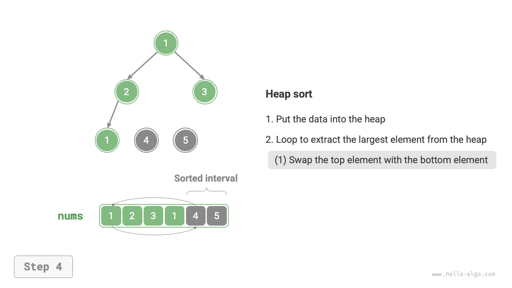
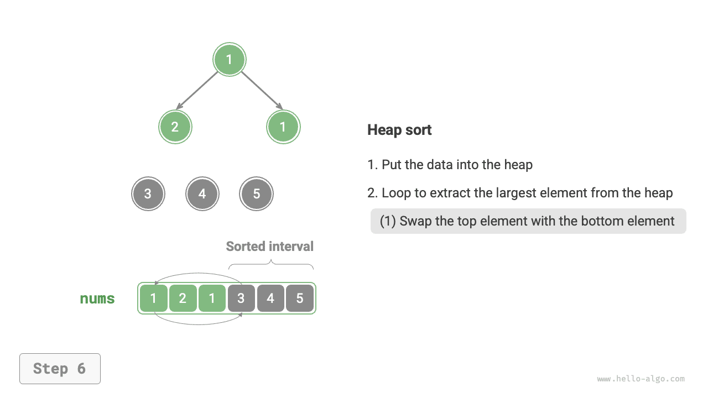

# Heap Sort

!!! tip

    Before reading this section, please ensure you have completed the "Heap" chapter.

<u>Heap sort</u> is an efficient sorting algorithm based on the heap data structure. We can implement heap sort using the heap construction and element removal operations introduced earlier.

1. Input the array and build a min-heap, at which point the smallest element is at the heap top.
2. Continuously perform element removal operations and record the removed elements in order to obtain a sequence sorted in ascending order.

Although the above method is feasible, it requires an additional array to save the popped elements, which is quite wasteful of space. In practice, we usually use a more elegant implementation method.

## Algorithm Flow

Assume the array length is $n$. The flow of heap sort is shown in the figure below.

1. Input the array and build a max-heap. After completion, the largest element is at the heap top.
2. Swap the heap top element (first element) with the heap bottom element (last element). After the swap is complete, reduce the heap length by $1$ and increase the count of sorted elements by $1$.
3. Starting from the heap top element, perform a top-to-bottom heapify operation (sift down). After heapify is complete, the heap property is restored.
4. Repeat steps `2.` and `3.` After $n - 1$ rounds, the array is sorted.

!!! tip

    In fact, the element removal operation also includes steps `2.` and `3.`, with the additional step of removing the element.

=== "<1>"
    

=== "<2>"
    

=== "<3>"
    

=== "<4>"
    

=== "<5>"
    

=== "<6>"
    

=== "<7>"
    

=== "<8>"
    

=== "<9>"
    

=== "<10>"
    

=== "<11>"
    

=== "<12>"
    

In the code below, we use the same `sift_down()` function for top-to-bottom heapify as in the "Heap" chapter. It is worth noting that since the heap length decreases as the largest element is extracted, we need to add a length parameter $n$ to `sift_down()` to specify the current effective length of the heap. The code is as follows:

```src
[file]{heap_sort}-[class]{}-[func]{heap_sort}
```

## Algorithm Characteristics

- **Time complexity is $O(n \log n)$; heap sort is non-adaptive**: Heap construction takes $O(n)$ time. Extracting the largest element from the heap takes $O(\log n)$ time, and this is repeated for a total of $n - 1$ rounds.
- **Space complexity is $O(1)$; heap sort is in-place**: A few pointer variables use $O(1)$ space. Element swapping and heapify are both performed on the original array.
- **Unstable sorting**: When swapping the heap top element and heap bottom element, the relative positions of equal elements may change.
