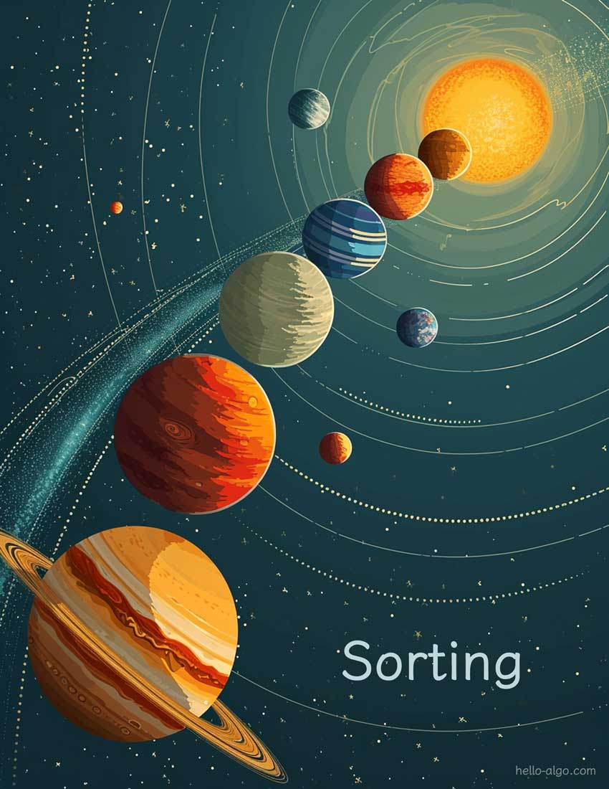

# Sorting

!!! abstract

    Sorting is like a magical key that turns chaos into order, enabling us to understand and handle data more efficiently.

    Whether it's simple ascending order or complex categorical arrangements, sorting reveals the harmonious beauty of data.
