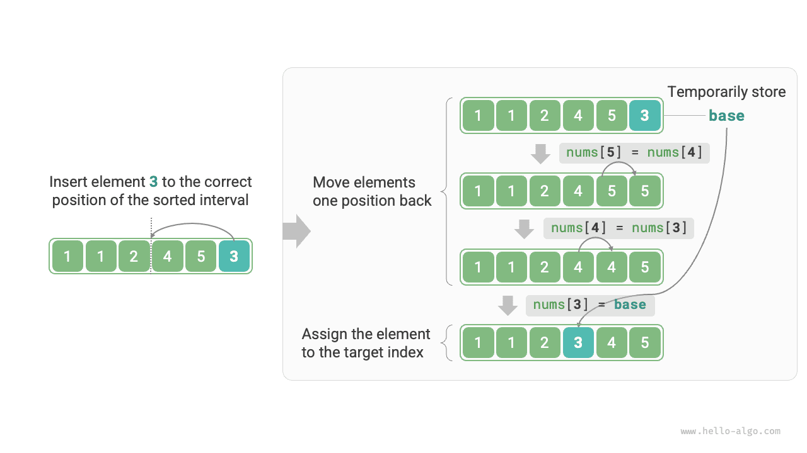

# Insertion Sort

<u>Insertion sort (insertion sort)</u> is a simple sorting algorithm that works very similarly to the process of manually organizing a deck of cards.

Specifically, we select a base element from the unsorted interval, compare the element with elements in the sorted interval to its left one by one, and insert the element into the correct position.

The figure below shows the operation flow of inserting an element into the array. Let the base element be `base`. We need to move all elements from the target index to `base` one position to the right, and then assign `base` to the target index.



## Algorithm Flow

The overall flow of insertion sort is shown in the figure below.

1. Initially, the first element of the array has completed sorting.
2. Select the second element of the array as `base`, and after inserting it into the correct position, **the first 2 elements of the array are sorted**.
3. Select the third element as `base`, and after inserting it into the correct position, **the first 3 elements of the array are sorted**.
4. And so on. In the last round, select the last element as `base`, and after inserting it into the correct position, **all elements are sorted**.


Example code is as follows:

```src
[file]{insertion_sort}-[class]{}-[func]{insertion_sort}
```

## Algorithm Characteristics

- **Time complexity of $O(n^2)$, adaptive sorting**: In the worst case, each insertion operation requires loops of $n - 1$, $n-2$, $\dots$, $2$, $1$, summing to $(n - 1) n / 2$, so the time complexity is $O(n^2)$. When encountering ordered data, the insertion operation will terminate early. When the input array is completely ordered, insertion sort achieves the best-case time complexity of $O(n)$.
- **Space complexity of $O(1)$, in-place sorting**: Pointers $i$ and $j$ use a constant amount of extra space.
- **Stable sorting**: During the insertion operation process, we insert elements to the right of equal elements, without changing their order.

## Advantages of Insertion Sort

The time complexity of insertion sort is $O(n^2)$, while the time complexity of quick sort, which we will learn about next, is $O(n \log n)$. Although insertion sort has a higher time complexity, **insertion sort is usually faster for smaller data volumes**.

This conclusion is similar to the applicable situations of linear search and binary search. Algorithms like quick sort with $O(n \log n)$ complexity are sorting algorithms based on divide-and-conquer strategy and often contain more unit computation operations. When the data volume is small, $n^2$ and $n \log n$ are numerically close, and complexity does not dominate; the number of unit operations per round plays a decisive role.

In fact, the built-in sorting functions in many programming languages (such as Java) adopt insertion sort. The general approach is: for long arrays, use sorting algorithms based on divide-and-conquer strategy, such as quick sort; for short arrays, directly use insertion sort.

Although bubble sort, selection sort, and insertion sort all have a time complexity of $O(n^2)$, in actual situations, **insertion sort is used significantly more frequently than bubble sort and selection sort**, mainly for the following reasons.

- Bubble sort is based on element swapping, requiring the use of a temporary variable, involving 3 unit operations; insertion sort is based on element assignment, requiring only 1 unit operation. Therefore, **the computational overhead of bubble sort is usually higher than that of insertion sort**.
- Selection sort has a time complexity of $O(n^2)$ in any case. **If given a set of partially ordered data, insertion sort is usually more efficient than selection sort**.
- Selection sort is unstable and cannot be applied to multi-level sorting.
