# Merge sort

<u>Merge sort</u> is a sorting algorithm based on the divide-and-conquer strategy, involving the "divide" and "merge" phases shown in the figure below.

1. **Divide phase**: Recursively split the array from the midpoint, transforming the sorting problem of a long array into shorter arrays.
2. **Merge phase**: Stop dividing when the length of the sub-array is 1, and then begin merging. The two shorter sorted arrays are continuously merged into a longer sorted array until the process is complete.

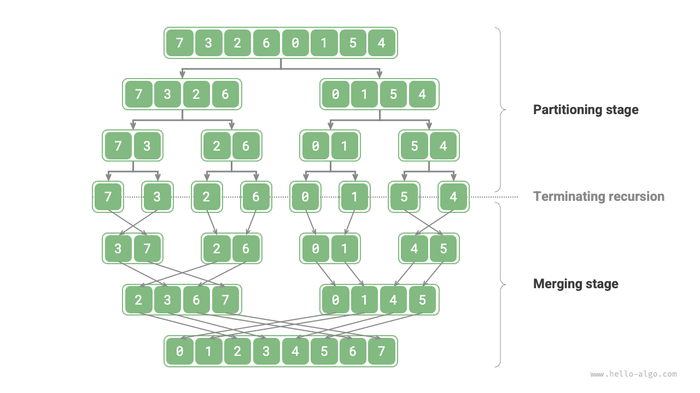

## Algorithm workflow

As shown in the figure below, the "divide phase" recursively splits the array from the midpoint into two sub-arrays from top to bottom.

1. Calculate the midpoint `mid`, recursively divide the left sub-array (interval `[left, mid]`) and the right sub-array (interval `[mid + 1, right]`).
2. Continue with step `1.` recursively until sub-array length becomes 1, then stops.

The "merge phase" combines the left and right sub-arrays into a sorted array from bottom to top. It is important to note that, merging starts with sub-arrays of length 1, and each sub-array is sorted during the merge phase.

=== "<1>"
    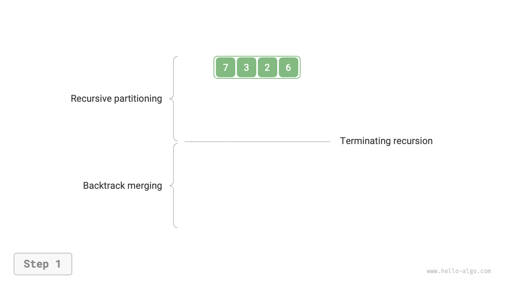

=== "<2>"
    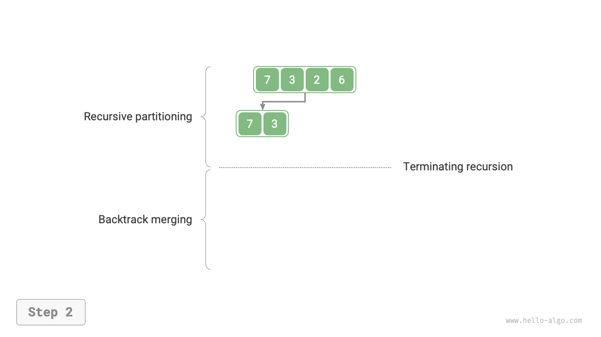

=== "<3>"
    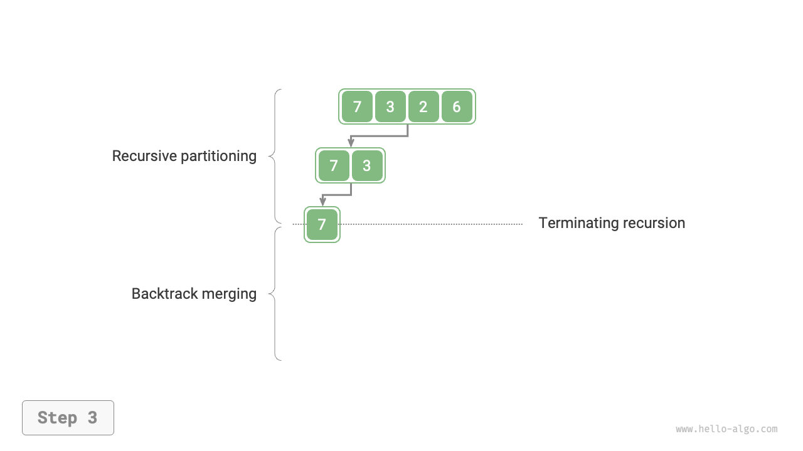

=== "<4>"
    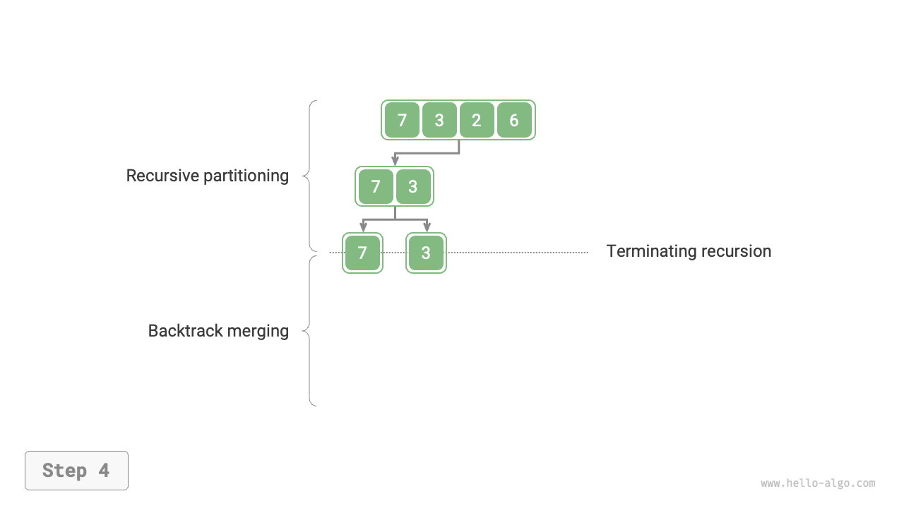

=== "<5>"
    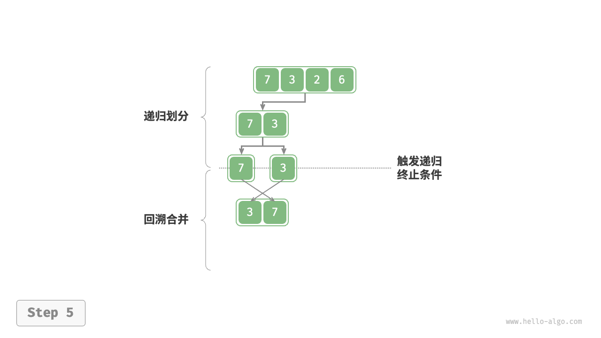

=== "<6>"
    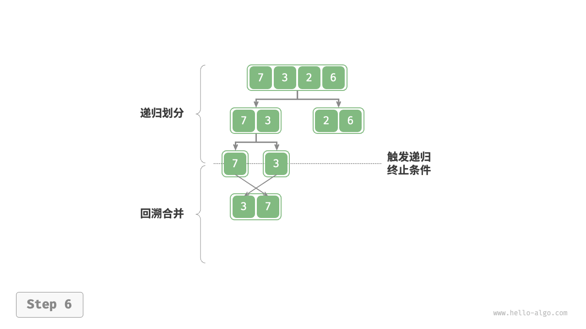

=== "<7>"
    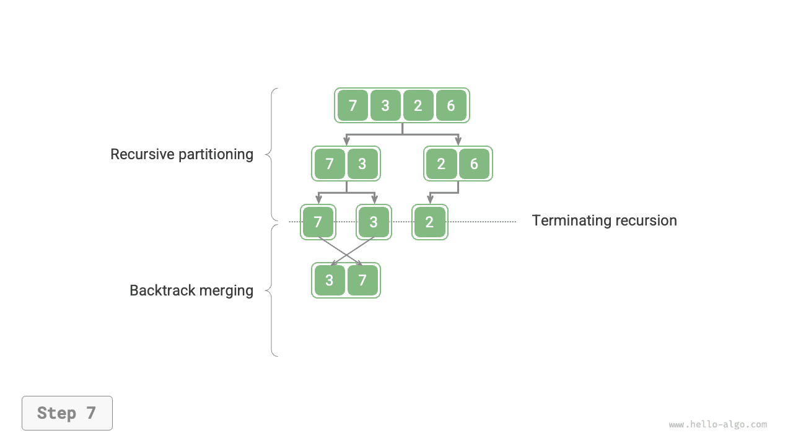

=== "<8>"
    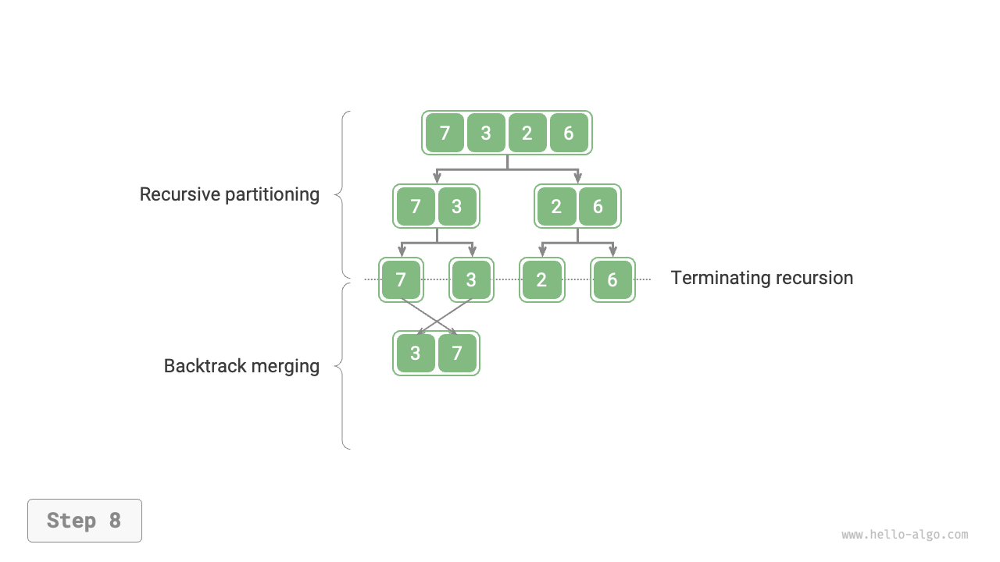

=== "<9>"
    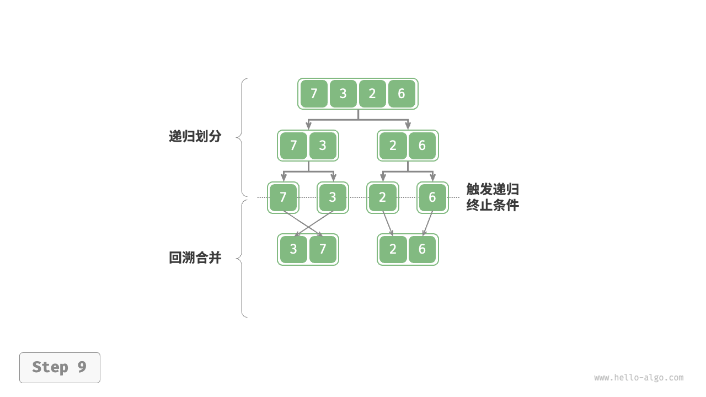

=== "<10>"
    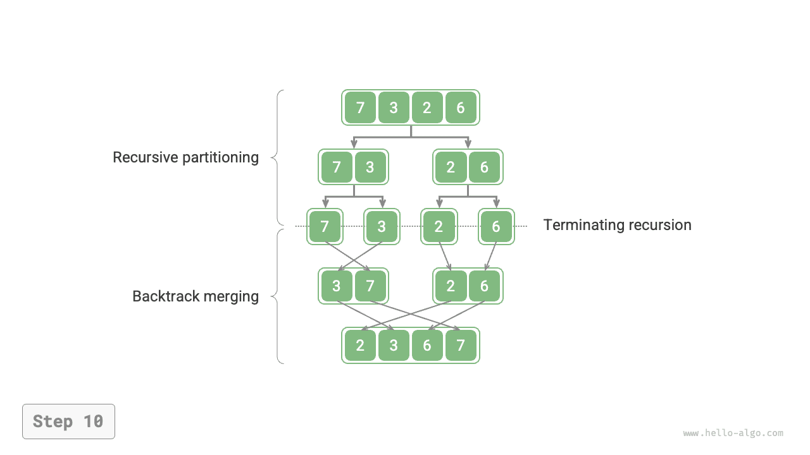

It can be observed that the order of recursion in merge sort is consistent with the post-order traversal of a binary tree.

- **Post-order traversal**: First recursively traverse the left subtree, then the right subtree, and finally process the root node.
- **Merge sort**: First recursively process the left sub-array, then the right sub-array, and finally perform the merge.

The implementation of merge sort is shown in the following code. Note that the interval to be merged in `nums` is `[left, right]`, while the corresponding interval in `tmp` is `[0, right - left]`.

```src
[file]{merge_sort}-[class]{}-[func]{merge_sort}
```

## Algorithm characteristics

- **Time complexity of $O(n \log n)$, non-adaptive sort**: The division creates a recursion tree of height $\log n$, with each layer merging a total of $n$ operations, resulting in an overall time complexity of $O(n \log n)$.
- **Space complexity of $O(n)$, non-in-place sort**: The recursion depth is $\log n$, using $O(\log n)$ stack frame space. The merging operation requires auxiliary arrays, using an additional space of $O(n)$.
- **Stable sort**: During the merging process, the order of equal elements remains unchanged.

## Linked List sorting

For linked lists, merge sort has significant advantages over other sorting algorithms. **It can optimize the space complexity of the linked list sorting task to $O(1)$**.

- **Divide phase**: "Iteration" can be used instead of "recursion" to perform the linked list division work, thus saving the stack frame space used by recursion.
- **Merge phase**: In linked lists, node insertion and deletion operations can be achieved by changing references (pointers), so no extra lists need to be created during the merge phase (combining two short ordered lists into one long ordered list).

The implementation details are relatively complex, and interested readers can consult related materials for learning.
