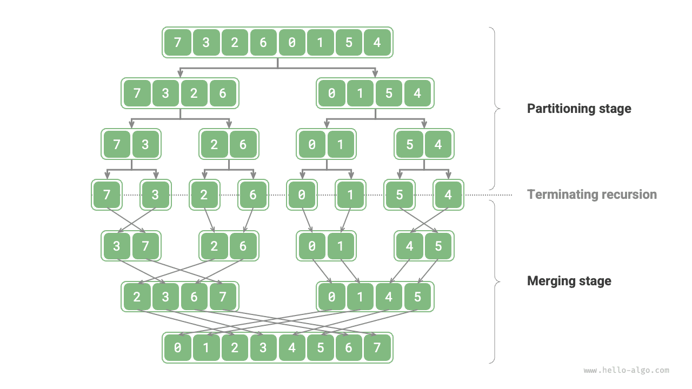

# Merge Sort

<u>Merge sort</u> is a sorting algorithm based on a divide-and-conquer strategy, consisting of the "divide" and "merge" phases shown in the figure below.

1. **Divide phase**: Recursively split the array at the midpoint, reducing the problem of sorting a long array to the problem of sorting shorter arrays.
2. **Merge phase**: When a sub-array has length 1, stop dividing and start merging, continuously combining the shorter sorted sub-arrays on the left and right into a longer sorted array until the process is complete.



## Algorithm Flow

As shown in the figure below, the "divide phase" recursively splits the array from the midpoint into two sub-arrays from top to bottom.

1. Calculate the array midpoint `mid`, recursively divide the left sub-array (interval `[left, mid]`) and right sub-array (interval `[mid + 1, right]`).
2. Repeat step `1.` recursively until a sub-array has length 1.

The "merge phase" merges the left and right sub-arrays into a sorted array from bottom to top. Note that merging starts from sub-arrays of length 1, so every sub-array involved in this phase is already sorted.

=== "<1>"
    

=== "<2>"
    

=== "<3>"
    

=== "<4>"
    

=== "<5>"
    

=== "<6>"
    

=== "<7>"
    

=== "<8>"
    

=== "<9>"
    

=== "<10>"
    

The recursive order of merge sort is consistent with the post-order traversal of a binary tree.

- **Post-order traversal**: First recursively traverse the left subtree, then recursively traverse the right subtree, and finally process the root node.
- **Merge sort**: First recursively process the left sub-array, then recursively process the right sub-array, and finally perform the merge.

The implementation of merge sort is shown in the code below. Note that the interval to be merged in `nums` is `[left, right]`, while the corresponding interval in `tmp` is `[0, right - left]`.

```src
[file]{merge_sort}-[class]{}-[func]{merge_sort}
```

## Algorithm Characteristics

- **Time complexity is $O(n \log n)$; merge sort is non-adaptive**: The divide phase produces a recursion tree of height $\log n$, and the total number of operations performed during merging at each level is $n$, so the overall time complexity is $O(n \log n)$.
- **Space complexity is $O(n)$; merge sort is not in-place**: The recursion depth is $\log n$, which uses $O(\log n)$ stack-frame space. The merge operation requires an auxiliary array, which uses $O(n)$ additional space.
- **Stable sort**: During merging, the relative order of equal elements remains unchanged.

## Linked List Sorting

For linked lists, merge sort has significant advantages over other sorting algorithms, **and it can reduce the space complexity of the sorting task to $O(1)$**.

- **Divide phase**: Iteration can be used instead of recursion to split the linked list, thereby eliminating the stack-frame space used by recursion.
- **Merge phase**: In linked lists, node insertion and deletion require only pointer updates, so the merge phase (merging two short sorted linked lists into one longer sorted linked list) does not require creating an additional linked list.

The specific implementation details are quite complex, and interested readers can consult related materials for learning.
