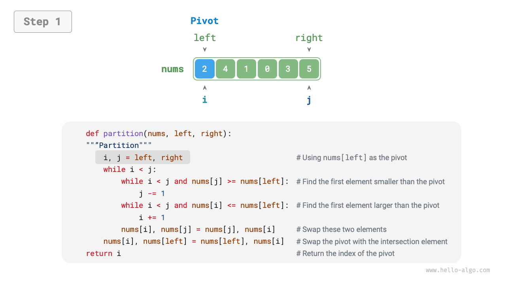
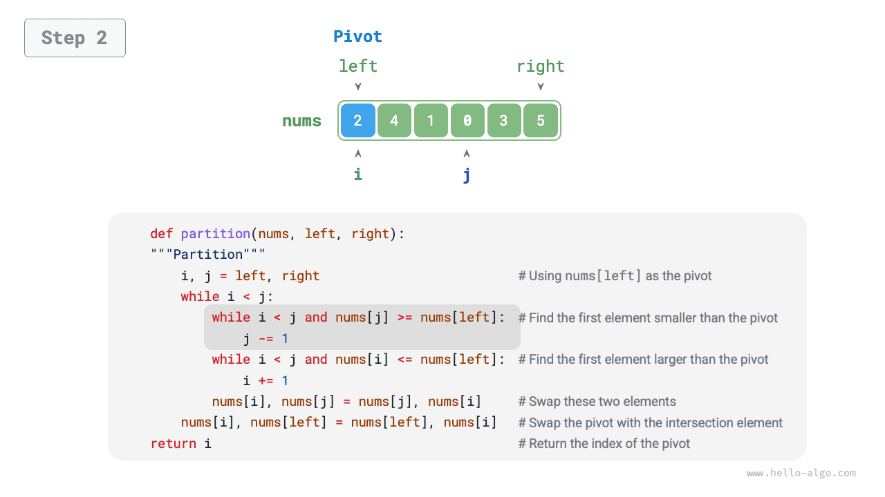
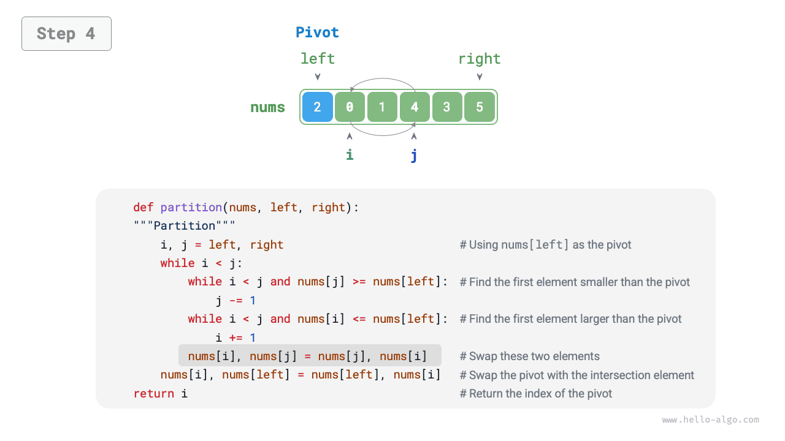
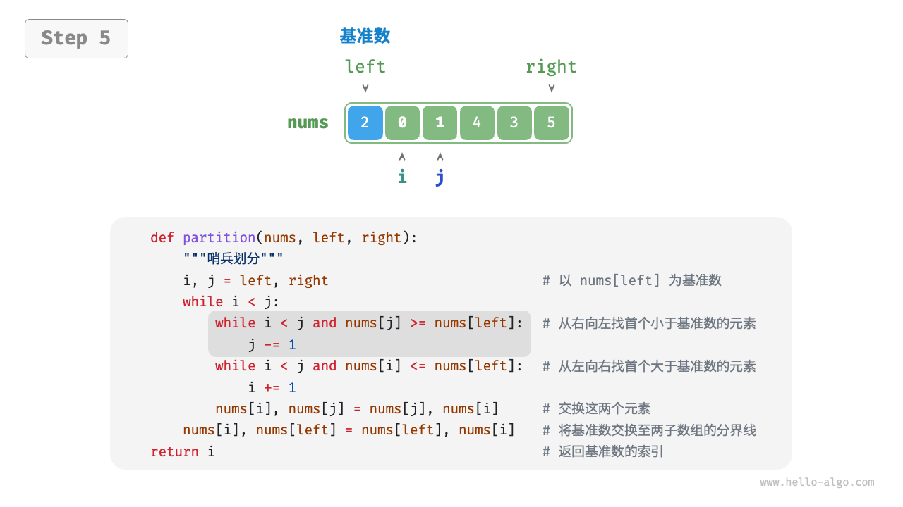
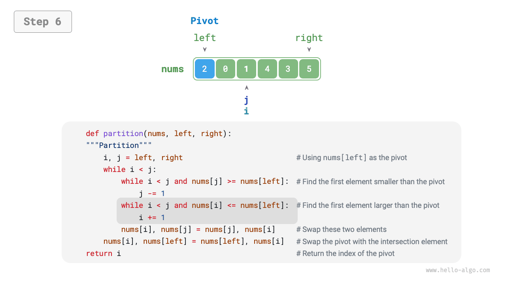
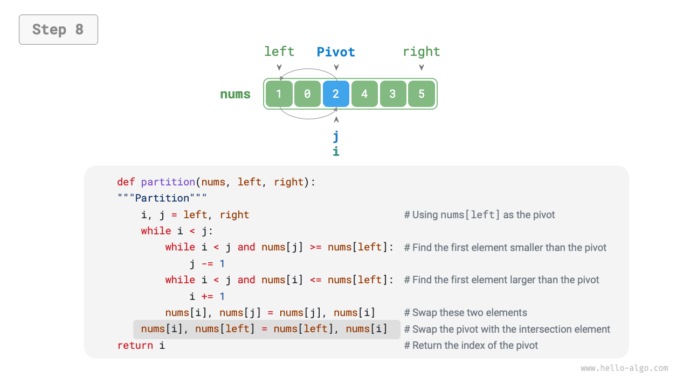
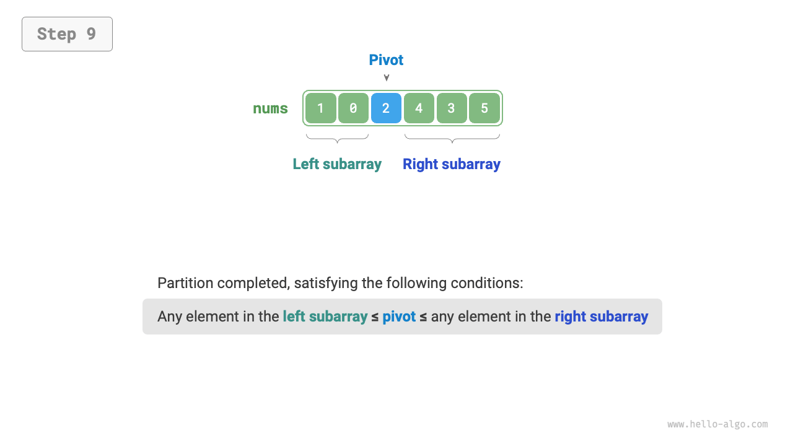
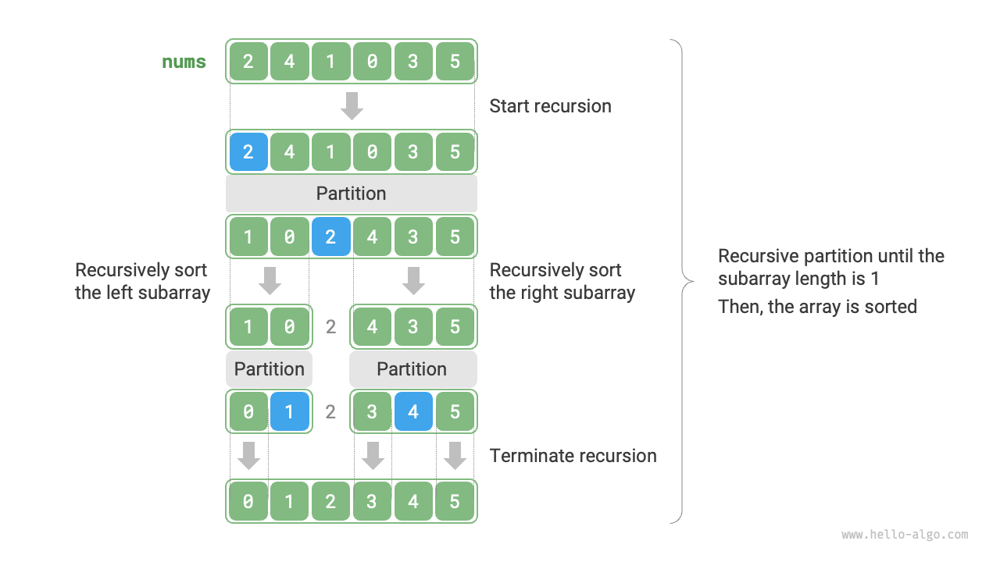

# Quick sort

<u>Quick sort</u> is a sorting algorithm based on the divide-and-conquer strategy, known for its efficiency and wide application.

The core operation of quick sort is "pivot partitioning," which aims to select an element from the array as the "pivot" and move all elements less than the pivot to its left side, while moving all elements greater than the pivot to its right side. Specifically, the process of pivot partitioning is illustrated in the figure below.

1. Select the leftmost element of the array as the pivot, and initialize two pointers `i` and `j` to point to the two ends of the array respectively.
2. Set up a loop where each round uses `i` (`j`) to search for the first element larger (smaller) than the pivot, then swap these two elements.
3. Repeat step `2.` until `i` and `j` meet, finally swap the pivot to the boundary between the two sub-arrays.

=== "<1>"
    

=== "<2>"
    

=== "<3>"
    

=== "<4>"
    

=== "<5>"
    

=== "<6>"
    

=== "<7>"
    

=== "<8>"
    

=== "<9>"
    

After the pivot partitioning, the original array is divided into three parts: left sub-array, pivot, and right sub-array, satisfying "any element in the left sub-array $\leq$ pivot $\leq$ any element in the right sub-array." Therefore, we then only need to sort these two sub-arrays.

!!! note "Divide-and-conquer strategy for quick sort"

    The essence of pivot partitioning is to simplify the sorting problem of a longer array into two shorter arrays.

```src
[file]{quick_sort}-[class]{quick_sort}-[func]{partition}
```

## Algorithm process

The overall process of quick sort is shown in the figure below.

1. First, perform a "pivot partitioning" on the original array to obtain the unsorted left and right sub-arrays.
2. Then, recursively perform "pivot partitioning" on the left and right sub-arrays separately.
3. Continue recursively until the length of sub-array is 1, thus completing the sorting of the entire array.



```src
[file]{quick_sort}-[class]{quick_sort}-[func]{quick_sort}
```

## Algorithm features

- **Time complexity of $O(n \log n)$, non-adaptive sorting**: In average cases, the recursive levels of pivot partitioning are $\log n$, and the total number of loops per level is $n$, using $O(n \log n)$ time overall. In the worst case, each round of pivot partitioning divides an array of length $n$ into two sub-arrays of lengths $0$ and $n - 1$, when the number of recursive levels reaches $n$, the number of loops in each level is $n$, and the total time used is $O(n^2)$.
- **Space complexity of $O(n)$, in-place sorting**: In the case where the input array is completely reversed, the worst recursive depth reaches $n$, using $O(n)$ stack frame space. The sorting operation is performed on the original array without the aid of additional arrays.
- **Non-stable sorting**: In the final step of pivot partitioning, the pivot may be swapped to the right of equal elements.

## Why is quick sort fast

As the name suggests, quick sort should have certain advantages in terms of efficiency. Although the average time complexity of quick sort is the same as that of "merge sort" and "heap sort," it is generally more efficient for the following reasons.

- **Low probability of worst-case scenarios**: Although the worst time complexity of quick sort is $O(n^2)$, less stable than merge sort, in most cases, quick sort can operate under a time complexity of $O(n \log n)$.
- **High cache utilization**: During the pivot partitioning operation, the system can load the entire sub-array into the cache, thus accessing elements more efficiently. In contrast, algorithms like "heap sort" need to access elements in a jumping manner, lacking this feature.
- **Small constant coefficient of complexity**: Among the three algorithms mentioned above, quick sort has the least total number of operations such as comparisons, assignments, and swaps. This is similar to why "insertion sort" is faster than "bubble sort."

## Pivot optimization

**Quick sort's time efficiency may degrade under certain inputs**. For example, if the input array is completely reversed, since we select the leftmost element as the pivot, after the pivot partitioning, the pivot is swapped to the array's right end, causing the left sub-array length to be $n - 1$ and the right sub-array length to be $0$. Continuing this way, each round of pivot partitioning will have a sub-array length of $0$, and the divide-and-conquer strategy fails, degrading quick sort to a form similar to "bubble sort."

To avoid this situation, **we can optimize the pivot selection strategy in the pivot partitioning**. For instance, we can randomly select an element as the pivot. However, if luck is not on our side, and we consistently select suboptimal pivots, the efficiency is still not satisfactory.

It's important to note that programming languages usually generate "pseudo-random numbers". If we construct a specific test case for a pseudo-random number sequence, the efficiency of quick sort may still degrade.

For further improvement, we can select three candidate elements (usually the first, last, and midpoint elements of the array), **and use the median of these three candidate elements as the pivot**. This way, the probability that the pivot is "neither too small nor too large" will be greatly increased. Of course, we can also select more candidate elements to further enhance robustness of the algorithm. With this method, the probability of the time complexity degrading to $O(n^2)$ is greatly reduced.

Sample code is as follows:

```src
[file]{quick_sort}-[class]{quick_sort_median}-[func]{partition}
```

## Tail recursion optimization

**Under certain inputs, quick sort may occupy more space**. For example, consider a completely ordered input array. Let the length of the sub-array in the recursion be $m$. In each round of pivot partitioning, a left sub-array of length $0$ and a right sub-array of length $m - 1$ are produced. This means that the problem size is reduced by only one element per recursive call, resulting in a very small reduction at each level of recursion.
As a result, the height of the recursion tree can reach $n − 1$ , which requires $O(n)$ of stack frame space.

To prevent the accumulation of stack frame space, we can compare the lengths of the two sub-arrays after each round of pivot sorting, **and only recursively sort the shorter sub-array**. Since the length of the shorter sub-array will not exceed $n / 2$, this method ensures that the recursion depth does not exceed $\log n$, thus optimizing the worst space complexity to $O(\log n)$. The code is as follows:

```src
[file]{quick_sort}-[class]{quick_sort_tail_call}-[func]{quick_sort}
```
