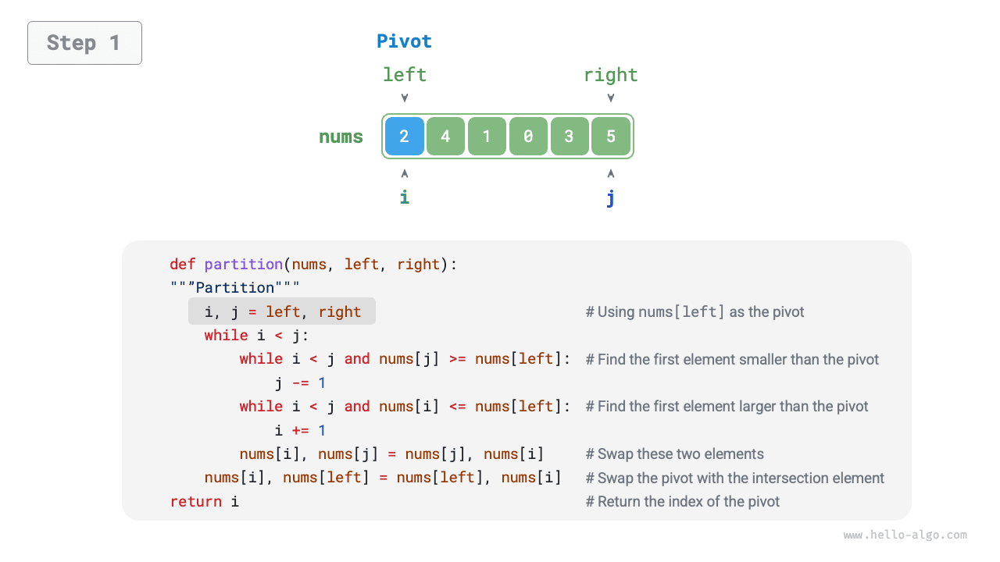
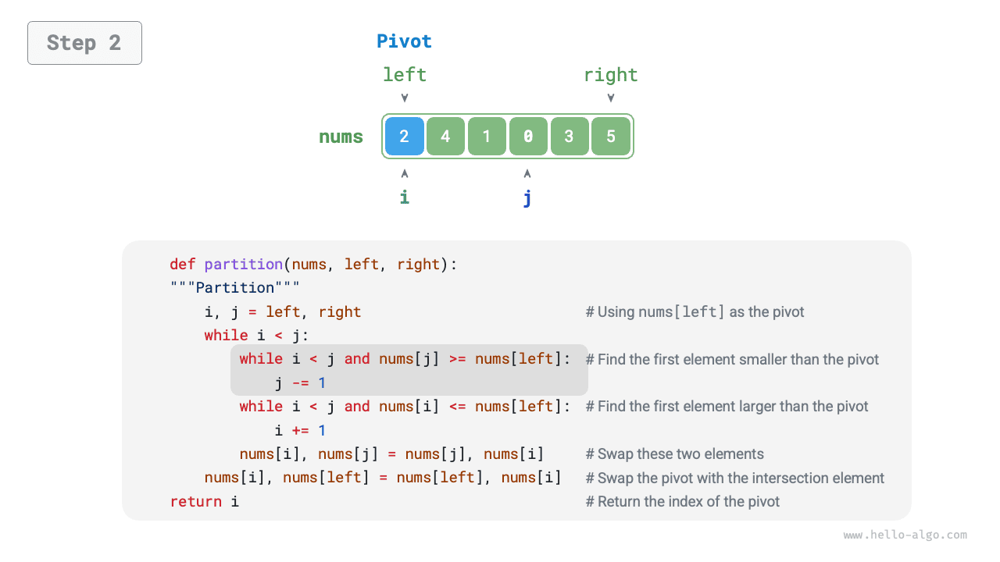
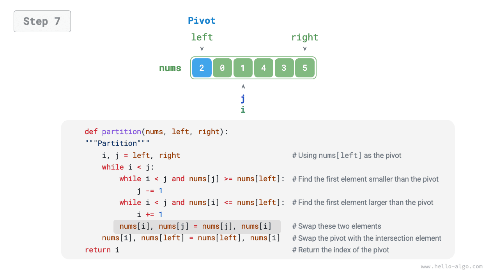
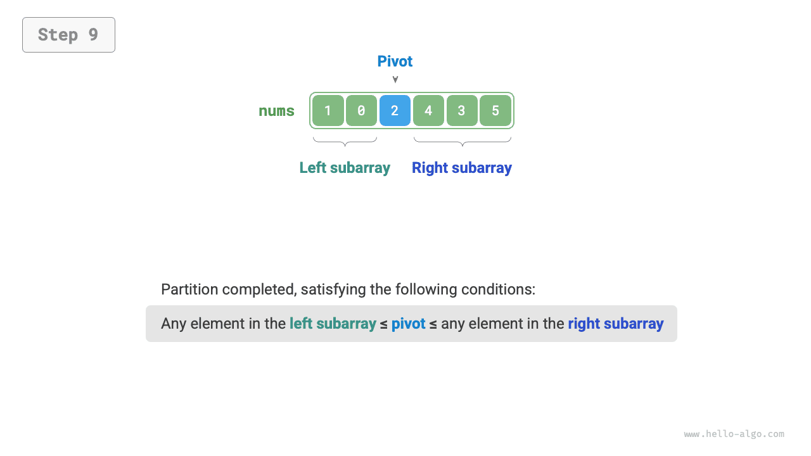
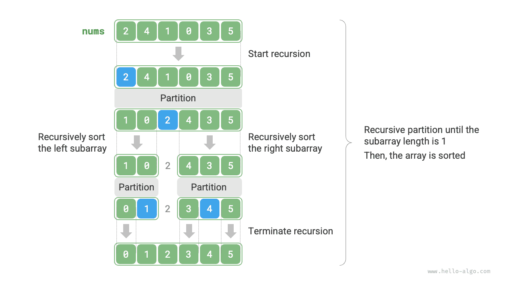

# 11.5 &nbsp; Quick Sort

<u>Quick sort</u> is an efficient and widely used sorting algorithm based on the divide-and-conquer strategy.

The core operation of quick sort is "sentinel partitioning", whose goal is to select an element as the "pivot", move all elements smaller than the pivot to its left, and move all elements larger than the pivot to its right. Specifically, the process is shown in Figure 11-8.

1. Select the leftmost element as the pivot, and initialize two pointers `i` and `j` at the two ends of the array.
2. Enter a loop. In each round, use `i` (`j`) to find the first element larger (smaller) than the pivot, and then swap the two elements.
3. Repeat step `2.` until `i` and `j` meet, then swap the pivot into the boundary position between the two sub-arrays.

=== "<1>"
    { class="animation-figure" }

=== "<2>"
    { class="animation-figure" }

=== "<3>"
    { class="animation-figure" }

=== "<4>"
    { class="animation-figure" }

=== "<5>"
    { class="animation-figure" }

=== "<6>"
    { class="animation-figure" }

=== "<7>"
    { class="animation-figure" }

=== "<8>"
    { class="animation-figure" }

=== "<9>"
    { class="animation-figure" }

<p align="center"> Figure 11-8 &nbsp; Sentinel partitioning steps </p>

After sentinel partitioning, the original array is divided into three parts: the left sub-array, the pivot, and the right sub-array, such that "any element in the left sub-array $\leq$ the pivot $\leq$ any element in the right sub-array". Therefore, we only need to sort the two sub-arrays next.

!!! note "Divide-and-conquer strategy of quick sort"

    The essence of sentinel partitioning is to simplify the sorting problem of a longer array into the sorting problems of two shorter arrays.

=== "Python"

    ```python title="quick_sort.py"
    def partition(self, nums: list[int], left: int, right: int) -> int:
        """Sentinel partition"""
        # Use nums[left] as the pivot
        i, j = left, right
        while i < j:
            while i < j and nums[j] >= nums[left]:
                j -= 1  # Search from right to left for the first element smaller than the pivot
            while i < j and nums[i] <= nums[left]:
                i += 1  # Search from left to right for the first element greater than the pivot
            # Swap elements
            nums[i], nums[j] = nums[j], nums[i]
        # Swap the pivot to the boundary between the two subarrays
        nums[i], nums[left] = nums[left], nums[i]
        return i  # Return the index of the pivot
    ```

=== "C++"

    ```cpp title="quick_sort.cpp"
    /* Sentinel partition */
    int partition(vector<int> &nums, int left, int right) {
        // Use nums[left] as the pivot
        int i = left, j = right;
        while (i < j) {
            while (i < j && nums[j] >= nums[left])
                j--;                // Search from right to left for the first element smaller than the pivot
            while (i < j && nums[i] <= nums[left])
                i++;                // Search from left to right for the first element greater than the pivot
            swap(nums[i], nums[j]); // Swap these two elements
        }
        swap(nums[i], nums[left]);  // Swap the pivot to the boundary between the two subarrays
        return i;                   // Return the index of the pivot
    }
    ```

=== "Java"

    ```java title="quick_sort.java"
    /* Swap elements */
    void swap(int[] nums, int i, int j) {
        int tmp = nums[i];
        nums[i] = nums[j];
        nums[j] = tmp;
    }

    /* Sentinel partition */
    int partition(int[] nums, int left, int right) {
        // Use nums[left] as the pivot
        int i = left, j = right;
        while (i < j) {
            while (i < j && nums[j] >= nums[left])
                j--;          // Search from right to left for the first element smaller than the pivot
            while (i < j && nums[i] <= nums[left])
                i++;          // Search from left to right for the first element greater than the pivot
            swap(nums, i, j); // Swap these two elements
        }
        swap(nums, i, left);  // Swap the pivot to the boundary between the two subarrays
        return i;             // Return the index of the pivot
    }
    ```

=== "C#"

    ```csharp title="quick_sort.cs"
    /* Swap elements */
    void Swap(int[] nums, int i, int j) {
        (nums[j], nums[i]) = (nums[i], nums[j]);
    }

    /* Sentinel partition */
    int Partition(int[] nums, int left, int right) {
        // Use nums[left] as the pivot
        int i = left, j = right;
        while (i < j) {
            while (i < j && nums[j] >= nums[left])
                j--;          // Search from right to left for the first element smaller than the pivot
            while (i < j && nums[i] <= nums[left])
                i++;          // Search from left to right for the first element greater than the pivot
            Swap(nums, i, j); // Swap these two elements
        }
        Swap(nums, i, left);  // Swap the pivot to the boundary between the two subarrays
        return i;             // Return the index of the pivot
    }
    ```

=== "Go"

    ```go title="quick_sort.go"
    /* Sentinel partition */
    func (q *quickSort) partition(nums []int, left, right int) int {
        // Use nums[left] as the pivot
        i, j := left, right
        for i < j {
            for i < j && nums[j] >= nums[left] {
                j-- // Search from right to left for the first element smaller than the pivot
            }
            for i < j && nums[i] <= nums[left] {
                i++ // Search from left to right for the first element greater than the pivot
            }
            // Swap elements
            nums[i], nums[j] = nums[j], nums[i]
        }
        // Swap the pivot to the boundary between the two subarrays
        nums[i], nums[left] = nums[left], nums[i]
        return i // Return the index of the pivot
    }
    ```

=== "Swift"

    ```swift title="quick_sort.swift"
    /* Sentinel partition */
    func partition(nums: inout [Int], left: Int, right: Int) -> Int {
        // Use nums[left] as the pivot
        var i = left
        var j = right
        while i < j {
            while i < j, nums[j] >= nums[left] {
                j -= 1 // Search from right to left for the first element smaller than the pivot
            }
            while i < j, nums[i] <= nums[left] {
                i += 1 // Search from left to right for the first element greater than the pivot
            }
            nums.swapAt(i, j) // Swap these two elements
        }
        nums.swapAt(i, left) // Swap the pivot to the boundary between the two subarrays
        return i // Return the index of the pivot
    }
    ```

=== "JS"

    ```javascript title="quick_sort.js"
    /* Swap elements */
    swap(nums, i, j) {
        let tmp = nums[i];
        nums[i] = nums[j];
        nums[j] = tmp;
    }

    /* Sentinel partition */
    partition(nums, left, right) {
        // Use nums[left] as the pivot
        let i = left,
            j = right;
        while (i < j) {
            while (i < j && nums[j] >= nums[left]) {
                j -= 1; // Search from right to left for the first element smaller than the pivot
            }
            while (i < j && nums[i] <= nums[left]) {
                i += 1; // Search from left to right for the first element greater than the pivot
            }
            // Swap elements
            this.swap(nums, i, j); // Swap these two elements
        }
        this.swap(nums, i, left); // Swap the pivot to the boundary between the two subarrays
        return i; // Return the index of the pivot
    }
    ```

=== "TS"

    ```typescript title="quick_sort.ts"
    /* Swap elements */
    swap(nums: number[], i: number, j: number): void {
        let tmp = nums[i];
        nums[i] = nums[j];
        nums[j] = tmp;
    }

    /* Sentinel partition */
    partition(nums: number[], left: number, right: number): number {
        // Use nums[left] as the pivot
        let i = left,
            j = right;
        while (i < j) {
            while (i < j && nums[j] >= nums[left]) {
                j -= 1; // Search from right to left for the first element smaller than the pivot
            }
            while (i < j && nums[i] <= nums[left]) {
                i += 1; // Search from left to right for the first element greater than the pivot
            }
            // Swap elements
            this.swap(nums, i, j); // Swap these two elements
        }
        this.swap(nums, i, left); // Swap the pivot to the boundary between the two subarrays
        return i; // Return the index of the pivot
    }
    ```

=== "Dart"

    ```dart title="quick_sort.dart"
    /* Swap elements */
    void _swap(List<int> nums, int i, int j) {
      int tmp = nums[i];
      nums[i] = nums[j];
      nums[j] = tmp;
    }

    /* Sentinel partition */
    int _partition(List<int> nums, int left, int right) {
      // Use nums[left] as the pivot
      int i = left, j = right;
      while (i < j) {
        while (i < j && nums[j] >= nums[left]) j--; // Search from right to left for the first element smaller than the pivot
        while (i < j && nums[i] <= nums[left]) i++; // Search from left to right for the first element greater than the pivot
        _swap(nums, i, j); // Swap these two elements
      }
      _swap(nums, i, left); // Swap the pivot to the boundary between the two subarrays
      return i; // Return the index of the pivot
    }
    ```

=== "Rust"

    ```rust title="quick_sort.rs"
    /* Sentinel partition */
    fn partition(nums: &mut [i32], left: usize, right: usize) -> usize {
        // Use nums[left] as the pivot
        let (mut i, mut j) = (left, right);
        while i < j {
            while i < j && nums[j] >= nums[left] {
                j -= 1; // Search from right to left for the first element smaller than the pivot
            }
            while i < j && nums[i] <= nums[left] {
                i += 1; // Search from left to right for the first element greater than the pivot
            }
            nums.swap(i, j); // Swap these two elements
        }
        nums.swap(i, left); // Swap the pivot to the boundary between the two subarrays
        i // Return the index of the pivot
    }
    ```

=== "C"

    ```c title="quick_sort.c"
    /* Swap elements */
    void swap(int nums[], int i, int j) {
        int tmp = nums[i];
        nums[i] = nums[j];
        nums[j] = tmp;
    }

    /* Sentinel partition */
    int partition(int nums[], int left, int right) {
        // Use nums[left] as the pivot
        int i = left, j = right;
        while (i < j) {
            while (i < j && nums[j] >= nums[left]) {
                j--; // Search from right to left for the first element smaller than the pivot
            }
            while (i < j && nums[i] <= nums[left]) {
                i++; // Search from left to right for the first element greater than the pivot
            }
            // Swap these two elements
            swap(nums, i, j);
        }
        // Swap the pivot to the boundary between the two subarrays
        swap(nums, i, left);
        // Return the index of the pivot
        return i;
    }
    ```

=== "Kotlin"

    ```kotlin title="quick_sort.kt"
    /* Swap elements */
    fun swap(nums: IntArray, i: Int, j: Int) {
        val temp = nums[i]
        nums[i] = nums[j]
        nums[j] = temp
    }

    /* Sentinel partition */
    fun partition(nums: IntArray, left: Int, right: Int): Int {
        // Use nums[left] as the pivot
        var i = left
        var j = right
        while (i < j) {
            while (i < j && nums[j] >= nums[left])
                j--           // Search from right to left for the first element smaller than the pivot
            while (i < j && nums[i] <= nums[left])
                i++           // Search from left to right for the first element greater than the pivot
            swap(nums, i, j)  // Swap these two elements
        }
        swap(nums, i, left)   // Swap the pivot to the boundary between the two subarrays
        return i              // Return the index of the pivot
    }
    ```

=== "Ruby"

    ```ruby title="quick_sort.rb"
    ### Sentinel partition ###
    def partition(nums, left, right)
      # Use nums[left] as the pivot
      i, j = left, right
      while i < j
        while i < j && nums[j] >= nums[left]
          j -= 1 # Search from right to left for the first element smaller than the pivot
        end
        while i < j && nums[i] <= nums[left]
          i += 1 # Search from left to right for the first element greater than the pivot
        end
        # Swap elements
        nums[i], nums[j] = nums[j], nums[i]
      end
      # Swap the pivot to the boundary between the two subarrays
      nums[i], nums[left] = nums[left], nums[i]
      i # Return the index of the pivot
    end
    ```

## 11.5.1 &nbsp; Algorithm Flow

The overall flow of quick sort is shown in Figure 11-9.

1. First, perform one "sentinel partitioning" on the original array to obtain the unsorted left sub-array and right sub-array.
2. Then, recursively perform "sentinel partitioning" on the left sub-array and right sub-array respectively.
3. Continue recursively until the sub-array length is 1, at which point sorting of the entire array is complete.

{ class="animation-figure" }

<p align="center"> Figure 11-9 &nbsp; Quick sort flow </p>

=== "Python"

    ```python title="quick_sort.py"
    def quick_sort(self, nums: list[int], left: int, right: int):
        """Quick sort"""
        # Terminate recursion when subarray length is 1
        if left >= right:
            return
        # Sentinel partition
        pivot = self.partition(nums, left, right)
        # Recursively process the left subarray and right subarray
        self.quick_sort(nums, left, pivot - 1)
        self.quick_sort(nums, pivot + 1, right)
    ```

=== "C++"

    ```cpp title="quick_sort.cpp"
    /* Quick sort */
    void quickSort(vector<int> &nums, int left, int right) {
        // Terminate recursion when subarray length is 1
        if (left >= right)
            return;
        // Sentinel partition
        int pivot = partition(nums, left, right);
        // Recursively process the left subarray and right subarray
        quickSort(nums, left, pivot - 1);
        quickSort(nums, pivot + 1, right);
    }
    ```

=== "Java"

    ```java title="quick_sort.java"
    /* Quick sort */
    void quickSort(int[] nums, int left, int right) {
        // Terminate recursion when subarray length is 1
        if (left >= right)
            return;
        // Sentinel partition
        int pivot = partition(nums, left, right);
        // Recursively process the left subarray and right subarray
        quickSort(nums, left, pivot - 1);
        quickSort(nums, pivot + 1, right);
    }
    ```

=== "C#"

    ```csharp title="quick_sort.cs"
    /* Quick sort */
    void QuickSort(int[] nums, int left, int right) {
        // Terminate recursion when subarray length is 1
        if (left >= right)
            return;
        // Sentinel partition
        int pivot = Partition(nums, left, right);
        // Recursively process the left subarray and right subarray
        QuickSort(nums, left, pivot - 1);
        QuickSort(nums, pivot + 1, right);
    }
    ```

=== "Go"

    ```go title="quick_sort.go"
    /* Quick sort */
    func (q *quickSort) quickSort(nums []int, left, right int) {
        // Terminate recursion when subarray length is 1
        if left >= right {
            return
        }
        // Sentinel partition
        pivot := q.partition(nums, left, right)
        // Recursively process the left subarray and right subarray
        q.quickSort(nums, left, pivot-1)
        q.quickSort(nums, pivot+1, right)
    }
    ```

=== "Swift"

    ```swift title="quick_sort.swift"
    /* Quick sort */
    func quickSort(nums: inout [Int], left: Int, right: Int) {
        // Terminate recursion when subarray length is 1
        if left >= right {
            return
        }
        // Sentinel partition
        let pivot = partition(nums: &nums, left: left, right: right)
        // Recursively process the left subarray and right subarray
        quickSort(nums: &nums, left: left, right: pivot - 1)
        quickSort(nums: &nums, left: pivot + 1, right: right)
    }
    ```

=== "JS"

    ```javascript title="quick_sort.js"
    /* Quick sort */
    quickSort(nums, left, right) {
        // Terminate recursion when subarray length is 1
        if (left >= right) return;
        // Sentinel partition
        const pivot = this.partition(nums, left, right);
        // Recursively process the left subarray and right subarray
        this.quickSort(nums, left, pivot - 1);
        this.quickSort(nums, pivot + 1, right);
    }
    ```

=== "TS"

    ```typescript title="quick_sort.ts"
    /* Quick sort */
    quickSort(nums: number[], left: number, right: number): void {
        // Terminate recursion when subarray length is 1
        if (left >= right) {
            return;
        }
        // Sentinel partition
        const pivot = this.partition(nums, left, right);
        // Recursively process the left subarray and right subarray
        this.quickSort(nums, left, pivot - 1);
        this.quickSort(nums, pivot + 1, right);
    }
    ```

=== "Dart"

    ```dart title="quick_sort.dart"
    /* Quick sort */
    void quickSort(List<int> nums, int left, int right) {
      // Terminate recursion when subarray length is 1
      if (left >= right) return;
      // Sentinel partition
      int pivot = _partition(nums, left, right);
      // Recursively process the left subarray and right subarray
      quickSort(nums, left, pivot - 1);
      quickSort(nums, pivot + 1, right);
    }
    ```

=== "Rust"

    ```rust title="quick_sort.rs"
    /* Quick sort */
    pub fn quick_sort(left: i32, right: i32, nums: &mut [i32]) {
        // Terminate recursion when subarray length is 1
        if left >= right {
            return;
        }
        // Sentinel partition
        let pivot = Self::partition(nums, left as usize, right as usize) as i32;
        // Recursively process the left subarray and right subarray
        Self::quick_sort(left, pivot - 1, nums);
        Self::quick_sort(pivot + 1, right, nums);
    }
    ```

=== "C"

    ```c title="quick_sort.c"
    /* Quick sort */
    void quickSort(int nums[], int left, int right) {
        // Terminate recursion when subarray length is 1
        if (left >= right) {
            return;
        }
        // Sentinel partition
        int pivot = partition(nums, left, right);
        // Recursively process the left subarray and right subarray
        quickSort(nums, left, pivot - 1);
        quickSort(nums, pivot + 1, right);
    }
    ```

=== "Kotlin"

    ```kotlin title="quick_sort.kt"
    /* Quick sort */
    fun quickSort(nums: IntArray, left: Int, right: Int) {
        // Terminate recursion when subarray length is 1
        if (left >= right) return
        // Sentinel partition
        val pivot = partition(nums, left, right)
        // Recursively process the left subarray and right subarray
        quickSort(nums, left, pivot - 1)
        quickSort(nums, pivot + 1, right)
    }
    ```

=== "Ruby"

    ```ruby title="quick_sort.rb"
    ### Quick sort class ###
    def quick_sort(nums, left, right)
      # Recurse when subarray length is not 1
      if left < right
        # Sentinel partition
        pivot = partition(nums, left, right)
        # Recursively process the left subarray and right subarray
        quick_sort(nums, left, pivot - 1)
        quick_sort(nums, pivot + 1, right)
      end
      nums
    end
    ```

## 11.5.2 &nbsp; Algorithm Characteristics

- **Time complexity of $O(n \log n)$, non-adaptive sorting**: On average, sentinel partitioning produces $\log n$ recursive levels, and the total number of loop iterations across each level is $n$, so the overall time complexity is $O(n \log n)$. In the worst case, each round of sentinel partitioning splits an array of length $n$ into sub-arrays of lengths $0$ and $n - 1$. The recursion depth then reaches $n$, with $n$ loop iterations at each level, yielding an overall time complexity of $O(n^2)$.
- **Space complexity of $O(n)$, in-place sorting**: In the case where the input array is completely reversed, the worst recursive depth reaches $n$, using $O(n)$ stack frame space. The sorting operation is performed on the original array without the aid of an additional array.
- **Unstable sorting**: In the last step of sentinel partitioning, the pivot may be swapped to the right of an equal element.

## 11.5.3 &nbsp; Why Is Quick Sort Fast

As the name suggests, quick sort has clear efficiency advantages. Although its average time complexity is the same as that of "merge sort" and "heap sort", quick sort is usually faster in practice for the following reasons.

- **The worst case is unlikely to occur**: Although the worst-case time complexity of quick sort is $O(n^2)$ and its performance is less predictable than that of merge sort, quick sort runs in $O(n \log n)$ time in the vast majority of cases.
- **High cache efficiency**: During sentinel partitioning, the system can load the entire sub-array into cache, so accessing elements is relatively efficient. By contrast, algorithms such as "heap sort" require non-contiguous access to elements and therefore do not enjoy this advantage.
- **Small constant factors**: Among the three algorithms above, quick sort performs the fewest comparisons, assignments, and swaps in total. This is similar to why "insertion sort" is faster than "bubble sort".

## 11.5.4 &nbsp; Pivot Optimization

**Quick sort can become less time-efficient for certain inputs**. Consider an extreme example in which the input array is in completely descending order. Because we choose the leftmost element as the pivot, once sentinel partitioning is complete, the pivot is swapped to the far right of the array, leaving a left sub-array of length $n - 1$ and a right sub-array of length $0$. If this continues recursively, each round of sentinel partitioning produces one sub-array of length $0$, the divide-and-conquer strategy breaks down, and quick sort degenerates into an approximation of "bubble sort".

To reduce the chance of this happening, **we can optimize the pivot selection strategy used in sentinel partitioning**. For example, we can choose a pivot at random. However, if we are unlucky and repeatedly pick poor pivots, performance can still be unsatisfactory.

It should be noted that programming languages usually generate "pseudo-random numbers". If we construct a specific test case against a pseudo-random sequence, quick sort can still suffer degraded performance.

To improve further, we can choose three candidate elements from the array, usually the first, last, and middle elements, **and use the median of the three as the pivot**. This greatly increases the chance that the pivot is "neither too small nor too large". We can also choose more candidate elements to further improve the robustness of the algorithm. With this method, the probability that the time complexity degrades to $O(n^2)$ is significantly reduced.

Example code is as follows:

=== "Python"

    ```python title="quick_sort.py"
    def median_three(self, nums: list[int], left: int, mid: int, right: int) -> int:
        """Select the median of three candidate elements"""
        l, m, r = nums[left], nums[mid], nums[right]
        if (l <= m <= r) or (r <= m <= l):
            return mid  # m is between l and r
        if (m <= l <= r) or (r <= l <= m):
            return left  # l is between m and r
        return right

    def partition(self, nums: list[int], left: int, right: int) -> int:
        """Sentinel partition (median of three)"""
        # Use nums[left] as the pivot
        med = self.median_three(nums, left, (left + right) // 2, right)
        # Swap the median to the array's leftmost position
        nums[left], nums[med] = nums[med], nums[left]
        # Use nums[left] as the pivot
        i, j = left, right
        while i < j:
            while i < j and nums[j] >= nums[left]:
                j -= 1  # Search from right to left for the first element smaller than the pivot
            while i < j and nums[i] <= nums[left]:
                i += 1  # Search from left to right for the first element greater than the pivot
            # Swap elements
            nums[i], nums[j] = nums[j], nums[i]
        # Swap the pivot to the boundary between the two subarrays
        nums[i], nums[left] = nums[left], nums[i]
        return i  # Return the index of the pivot
    ```

=== "C++"

    ```cpp title="quick_sort.cpp"
    /* Select the median of three candidate elements */
    int medianThree(vector<int> &nums, int left, int mid, int right) {
        int l = nums[left], m = nums[mid], r = nums[right];
        if ((l <= m && m <= r) || (r <= m && m <= l))
            return mid; // m is between l and r
        if ((m <= l && l <= r) || (r <= l && l <= m))
            return left; // l is between m and r
        return right;
    }

    /* Sentinel partition (median of three) */
    int partition(vector<int> &nums, int left, int right) {
        // Select the median of three candidate elements
        int med = medianThree(nums, left, (left + right) / 2, right);
        // Swap the median to the array's leftmost position
        swap(nums[left], nums[med]);
        // Use nums[left] as the pivot
        int i = left, j = right;
        while (i < j) {
            while (i < j && nums[j] >= nums[left])
                j--;                // Search from right to left for the first element smaller than the pivot
            while (i < j && nums[i] <= nums[left])
                i++;                // Search from left to right for the first element greater than the pivot
            swap(nums[i], nums[j]); // Swap these two elements
        }
        swap(nums[i], nums[left]);  // Swap the pivot to the boundary between the two subarrays
        return i;                   // Return the index of the pivot
    }
    ```

=== "Java"

    ```java title="quick_sort.java"
    /* Select the median of three candidate elements */
    int medianThree(int[] nums, int left, int mid, int right) {
        int l = nums[left], m = nums[mid], r = nums[right];
        if ((l <= m && m <= r) || (r <= m && m <= l))
            return mid; // m is between l and r
        if ((m <= l && l <= r) || (r <= l && l <= m))
            return left; // l is between m and r
        return right;
    }

    /* Sentinel partition (median of three) */
    int partition(int[] nums, int left, int right) {
        // Select the median of three candidate elements
        int med = medianThree(nums, left, (left + right) / 2, right);
        // Swap the median to the array's leftmost position
        swap(nums, left, med);
        // Use nums[left] as the pivot
        int i = left, j = right;
        while (i < j) {
            while (i < j && nums[j] >= nums[left])
                j--;          // Search from right to left for the first element smaller than the pivot
            while (i < j && nums[i] <= nums[left])
                i++;          // Search from left to right for the first element greater than the pivot
            swap(nums, i, j); // Swap these two elements
        }
        swap(nums, i, left);  // Swap the pivot to the boundary between the two subarrays
        return i;             // Return the index of the pivot
    }
    ```

=== "C#"

    ```csharp title="quick_sort.cs"
    /* Select the median of three candidate elements */
    int MedianThree(int[] nums, int left, int mid, int right) {
        int l = nums[left], m = nums[mid], r = nums[right];
        if ((l <= m && m <= r) || (r <= m && m <= l))
            return mid; // m is between l and r
        if ((m <= l && l <= r) || (r <= l && l <= m))
            return left; // l is between m and r
        return right;
    }

    /* Sentinel partition (median of three) */
    int Partition(int[] nums, int left, int right) {
        // Select the median of three candidate elements
        int med = MedianThree(nums, left, (left + right) / 2, right);
        // Swap the median to the array's leftmost position
        Swap(nums, left, med);
        // Use nums[left] as the pivot
        int i = left, j = right;
        while (i < j) {
            while (i < j && nums[j] >= nums[left])
                j--;          // Search from right to left for the first element smaller than the pivot
            while (i < j && nums[i] <= nums[left])
                i++;          // Search from left to right for the first element greater than the pivot
            Swap(nums, i, j); // Swap these two elements
        }
        Swap(nums, i, left);  // Swap the pivot to the boundary between the two subarrays
        return i;             // Return the index of the pivot
    }
    ```

=== "Go"

    ```go title="quick_sort.go"
    /* Select the median of three candidate elements */
    func (q *quickSortMedian) medianThree(nums []int, left, mid, right int) int {
        l, m, r := nums[left], nums[mid], nums[right]
        if (l <= m && m <= r) || (r <= m && m <= l) {
            return mid // m is between l and r
        }
        if (m <= l && l <= r) || (r <= l && l <= m) {
            return left // l is between m and r
        }
        return right
    }

    /* Sentinel partition (median of three) */
    func (q *quickSortMedian) partition(nums []int, left, right int) int {
        // Use nums[left] as the pivot
        med := q.medianThree(nums, left, (left+right)/2, right)
        // Swap the median to the array's leftmost position
        nums[left], nums[med] = nums[med], nums[left]
        // Use nums[left] as the pivot
        i, j := left, right
        for i < j {
            for i < j && nums[j] >= nums[left] {
                j-- // Search from right to left for the first element smaller than the pivot
            }
            for i < j && nums[i] <= nums[left] {
                i++ // Search from left to right for the first element greater than the pivot
            }
            // Swap elements
            nums[i], nums[j] = nums[j], nums[i]
        }
        // Swap the pivot to the boundary between the two subarrays
        nums[i], nums[left] = nums[left], nums[i]
        return i // Return the index of the pivot
    }
    ```

=== "Swift"

    ```swift title="quick_sort.swift"
    /* Select the median of three candidate elements */
    func medianThree(nums: [Int], left: Int, mid: Int, right: Int) -> Int {
        let l = nums[left]
        let m = nums[mid]
        let r = nums[right]
        if (l <= m && m <= r) || (r <= m && m <= l) {
            return mid // m is between l and r
        }
        if (m <= l && l <= r) || (r <= l && l <= m) {
            return left // l is between m and r
        }
        return right
    }

    /* Sentinel partition (median of three) */
    func partitionMedian(nums: inout [Int], left: Int, right: Int) -> Int {
        // Select the median of three candidate elements
        let med = medianThree(nums: nums, left: left, mid: left + (right - left) / 2, right: right)
        // Swap the median to the array's leftmost position
        nums.swapAt(left, med)
        return partition(nums: &nums, left: left, right: right)
    }
    ```

=== "JS"

    ```javascript title="quick_sort.js"
    /* Select the median of three candidate elements */
    medianThree(nums, left, mid, right) {
        let l = nums[left],
            m = nums[mid],
            r = nums[right];
        // m is between l and r
        if ((l <= m && m <= r) || (r <= m && m <= l)) return mid;
        // l is between m and r
        if ((m <= l && l <= r) || (r <= l && l <= m)) return left;
        return right;
    }

    /* Sentinel partition (median of three) */
    partition(nums, left, right) {
        // Select the median of three candidate elements
        let med = this.medianThree(
            nums,
            left,
            Math.floor((left + right) / 2),
            right
        );
        // Swap the median to the array's leftmost position
        this.swap(nums, left, med);
        // Use nums[left] as the pivot
        let i = left,
            j = right;
        while (i < j) {
            while (i < j && nums[j] >= nums[left]) j--; // Search from right to left for the first element smaller than the pivot
            while (i < j && nums[i] <= nums[left]) i++; // Search from left to right for the first element greater than the pivot
            this.swap(nums, i, j); // Swap these two elements
        }
        this.swap(nums, i, left); // Swap the pivot to the boundary between the two subarrays
        return i; // Return the index of the pivot
    }
    ```

=== "TS"

    ```typescript title="quick_sort.ts"
    /* Select the median of three candidate elements */
    medianThree(
        nums: number[],
        left: number,
        mid: number,
        right: number
    ): number {
        let l = nums[left],
            m = nums[mid],
            r = nums[right];
        // m is between l and r
        if ((l <= m && m <= r) || (r <= m && m <= l)) return mid;
        // l is between m and r
        if ((m <= l && l <= r) || (r <= l && l <= m)) return left;
        return right;
    }

    /* Sentinel partition (median of three) */
    partition(nums: number[], left: number, right: number): number {
        // Select the median of three candidate elements
        let med = this.medianThree(
            nums,
            left,
            Math.floor((left + right) / 2),
            right
        );
        // Swap the median to the array's leftmost position
        this.swap(nums, left, med);
        // Use nums[left] as the pivot
        let i = left,
            j = right;
        while (i < j) {
            while (i < j && nums[j] >= nums[left]) {
                j--; // Search from right to left for the first element smaller than the pivot
            }
            while (i < j && nums[i] <= nums[left]) {
                i++; // Search from left to right for the first element greater than the pivot
            }
            this.swap(nums, i, j); // Swap these two elements
        }
        this.swap(nums, i, left); // Swap the pivot to the boundary between the two subarrays
        return i; // Return the index of the pivot
    }
    ```

=== "Dart"

    ```dart title="quick_sort.dart"
    /* Select the median of three candidate elements */
    int _medianThree(List<int> nums, int left, int mid, int right) {
      int l = nums[left], m = nums[mid], r = nums[right];
      if ((l <= m && m <= r) || (r <= m && m <= l))
        return mid; // m is between l and r
      if ((m <= l && l <= r) || (r <= l && l <= m))
        return left; // l is between m and r
      return right;
    }

    /* Sentinel partition (median of three) */
    int _partition(List<int> nums, int left, int right) {
      // Select the median of three candidate elements
      int med = _medianThree(nums, left, (left + right) ~/ 2, right);
      // Swap the median to the array's leftmost position
      _swap(nums, left, med);
      // Use nums[left] as the pivot
      int i = left, j = right;
      while (i < j) {
        while (i < j && nums[j] >= nums[left]) j--; // Search from right to left for the first element smaller than the pivot
        while (i < j && nums[i] <= nums[left]) i++; // Search from left to right for the first element greater than the pivot
        _swap(nums, i, j); // Swap these two elements
      }
      _swap(nums, i, left); // Swap the pivot to the boundary between the two subarrays
      return i; // Return the index of the pivot
    }
    ```

=== "Rust"

    ```rust title="quick_sort.rs"
    /* Select the median of three candidate elements */
    fn median_three(nums: &mut [i32], left: usize, mid: usize, right: usize) -> usize {
        let (l, m, r) = (nums[left], nums[mid], nums[right]);
        if (l <= m && m <= r) || (r <= m && m <= l) {
            return mid; // m is between l and r
        }
        if (m <= l && l <= r) || (r <= l && l <= m) {
            return left; // l is between m and r
        }
        right
    }

    /* Sentinel partition (median of three) */
    fn partition(nums: &mut [i32], left: usize, right: usize) -> usize {
        // Select the median of three candidate elements
        let med = Self::median_three(nums, left, (left + right) / 2, right);
        // Swap the median to the array's leftmost position
        nums.swap(left, med);
        // Use nums[left] as the pivot
        let (mut i, mut j) = (left, right);
        while i < j {
            while i < j && nums[j] >= nums[left] {
                j -= 1; // Search from right to left for the first element smaller than the pivot
            }
            while i < j && nums[i] <= nums[left] {
                i += 1; // Search from left to right for the first element greater than the pivot
            }
            nums.swap(i, j); // Swap these two elements
        }
        nums.swap(i, left); // Swap the pivot to the boundary between the two subarrays
        i // Return the index of the pivot
    }
    ```

=== "C"

    ```c title="quick_sort.c"
    /* Select the median of three candidate elements */
    int medianThree(int nums[], int left, int mid, int right) {
        int l = nums[left], m = nums[mid], r = nums[right];
        if ((l <= m && m <= r) || (r <= m && m <= l))
            return mid; // m is between l and r
        if ((m <= l && l <= r) || (r <= l && l <= m))
            return left; // l is between m and r
        return right;
    }

    /* Sentinel partition (median of three) */
    int partitionMedian(int nums[], int left, int right) {
        // Select the median of three candidate elements
        int med = medianThree(nums, left, (left + right) / 2, right);
        // Swap the median to the array's leftmost position
        swap(nums, left, med);
        // Use nums[left] as the pivot
        int i = left, j = right;
        while (i < j) {
            while (i < j && nums[j] >= nums[left])
                j--; // Search from right to left for the first element smaller than the pivot
            while (i < j && nums[i] <= nums[left])
                i++;          // Search from left to right for the first element greater than the pivot
            swap(nums, i, j); // Swap these two elements
        }
        swap(nums, i, left); // Swap the pivot to the boundary between the two subarrays
        return i;            // Return the index of the pivot
    }
    ```

=== "Kotlin"

    ```kotlin title="quick_sort.kt"
    /* Select the median of three candidate elements */
    fun medianThree(nums: IntArray, left: Int, mid: Int, right: Int): Int {
        val l = nums[left]
        val m = nums[mid]
        val r = nums[right]
        if ((m in l..r) || (m in r..l))
            return mid  // m is between l and r
        if ((l in m..r) || (l in r..m))
            return left // l is between m and r
        return right
    }

    /* Sentinel partition (median of three) */
    fun partitionMedian(nums: IntArray, left: Int, right: Int): Int {
        // Select the median of three candidate elements
        val med = medianThree(nums, left, (left + right) / 2, right)
        // Swap the median to the array's leftmost position
        swap(nums, left, med)
        // Use nums[left] as the pivot
        var i = left
        var j = right
        while (i < j) {
            while (i < j && nums[j] >= nums[left])
                j--                      // Search from right to left for the first element smaller than the pivot
            while (i < j && nums[i] <= nums[left])
                i++                      // Search from left to right for the first element greater than the pivot
            swap(nums, i, j)             // Swap these two elements
        }
        swap(nums, i, left)              // Swap the pivot to the boundary between the two subarrays
        return i                         // Return the index of the pivot
    }
    ```

=== "Ruby"

    ```ruby title="quick_sort.rb"
    ### Select median of three candidate elements ###
    def median_three(nums, left, mid, right)
      # Select the median of three candidate elements
      _l, _m, _r = nums[left], nums[mid], nums[right]
      # m is between l and r
      return mid if (_l <= _m && _m <= _r) || (_r <= _m && _m <= _l)
      # l is between m and r
      return left if (_m <= _l && _l <= _r) || (_r <= _l && _l <= _m)
      return right
    end

    ### Sentinel partition (median of three) ###
    def partition(nums, left, right)
      ### Use nums[left] as pivot
      med = median_three(nums, left, (left + right) / 2, right)
      # Swap median to leftmost position of array
      nums[left], nums[med] = nums[med], nums[left]
      i, j = left, right
      while i < j
        while i < j && nums[j] >= nums[left]
          j -= 1 # Search from right to left for the first element smaller than the pivot
        end
        while i < j && nums[i] <= nums[left]
          i += 1 # Search from left to right for the first element greater than the pivot
        end
        # Swap elements
        nums[i], nums[j] = nums[j], nums[i]
      end
      # Swap the pivot to the boundary between the two subarrays
      nums[i], nums[left] = nums[left], nums[i]
      i # Return the index of the pivot
    end
    ```

## 11.5.5 &nbsp; Recursive Depth Optimization

**Quick sort may also use more space for certain inputs**. Consider a fully sorted input array. Let the length of the current sub-array in the recursion be $m$. Each round of sentinel partitioning produces a left sub-array of length $0$ and a right sub-array of length $m - 1$, which means each recursive call reduces the problem size by only one element. The recursion tree can therefore reach a height of $n - 1$, requiring $O(n)$ stack-frame space.

To prevent stack frames from accumulating, we can compare the lengths of the two sub-arrays after each round of sentinel partitioning, **and recurse only on the shorter one**. Because the shorter sub-array has length at most $n / 2$, this method ensures that the recursion depth does not exceed $\log n$, reducing the worst-case space complexity to $O(\log n)$. The code is shown below:

=== "Python"

    ```python title="quick_sort.py"
    def quick_sort(self, nums: list[int], left: int, right: int):
        """Quick sort (recursion depth optimization)"""
        # Terminate when subarray length is 1
        while left < right:
            # Sentinel partition operation
            pivot = self.partition(nums, left, right)
            # Perform quick sort on the shorter of the two subarrays
            if pivot - left < right - pivot:
                self.quick_sort(nums, left, pivot - 1)  # Recursively sort the left subarray
                left = pivot + 1  # Remaining unsorted interval is [pivot + 1, right]
            else:
                self.quick_sort(nums, pivot + 1, right)  # Recursively sort the right subarray
                right = pivot - 1  # Remaining unsorted interval is [left, pivot - 1]
    ```

=== "C++"

    ```cpp title="quick_sort.cpp"
    /* Quick sort (recursion depth optimization) */
    void quickSort(vector<int> &nums, int left, int right) {
        // Terminate when subarray length is 1
        while (left < right) {
            // Sentinel partition operation
            int pivot = partition(nums, left, right);
            // Perform quick sort on the shorter of the two subarrays
            if (pivot - left < right - pivot) {
                quickSort(nums, left, pivot - 1); // Recursively sort the left subarray
                left = pivot + 1;                 // Remaining unsorted interval is [pivot + 1, right]
            } else {
                quickSort(nums, pivot + 1, right); // Recursively sort the right subarray
                right = pivot - 1;                 // Remaining unsorted interval is [left, pivot - 1]
            }
        }
    }
    ```

=== "Java"

    ```java title="quick_sort.java"
    /* Quick sort (recursion depth optimization) */
    void quickSort(int[] nums, int left, int right) {
        // Terminate when subarray length is 1
        while (left < right) {
            // Sentinel partition operation
            int pivot = partition(nums, left, right);
            // Perform quick sort on the shorter of the two subarrays
            if (pivot - left < right - pivot) {
                quickSort(nums, left, pivot - 1); // Recursively sort the left subarray
                left = pivot + 1; // Remaining unsorted interval is [pivot + 1, right]
            } else {
                quickSort(nums, pivot + 1, right); // Recursively sort the right subarray
                right = pivot - 1; // Remaining unsorted interval is [left, pivot - 1]
            }
        }
    }
    ```

=== "C#"

    ```csharp title="quick_sort.cs"
    /* Quick sort (recursion depth optimization) */
    void QuickSort(int[] nums, int left, int right) {
        // Terminate when subarray length is 1
        while (left < right) {
            // Sentinel partition operation
            int pivot = Partition(nums, left, right);
            // Perform quick sort on the shorter of the two subarrays
            if (pivot - left < right - pivot) {
                QuickSort(nums, left, pivot - 1);  // Recursively sort the left subarray
                left = pivot + 1;  // Remaining unsorted interval is [pivot + 1, right]
            } else {
                QuickSort(nums, pivot + 1, right); // Recursively sort the right subarray
                right = pivot - 1; // Remaining unsorted interval is [left, pivot - 1]
            }
        }
    }
    ```

=== "Go"

    ```go title="quick_sort.go"
    /* Quick sort (recursion depth optimization) */
    func (q *quickSortTailCall) quickSort(nums []int, left, right int) {
        // Terminate when subarray length is 1
        for left < right {
            // Sentinel partition operation
            pivot := q.partition(nums, left, right)
            // Perform quick sort on the shorter of the two subarrays
            if pivot-left < right-pivot {
                q.quickSort(nums, left, pivot-1) // Recursively sort the left subarray
                left = pivot + 1                 // Remaining unsorted interval is [pivot + 1, right]
            } else {
                q.quickSort(nums, pivot+1, right) // Recursively sort the right subarray
                right = pivot - 1                 // Remaining unsorted interval is [left, pivot - 1]
            }
        }
    }
    ```

=== "Swift"

    ```swift title="quick_sort.swift"
    /* Quick sort (recursion depth optimization) */
    func quickSortTailCall(nums: inout [Int], left: Int, right: Int) {
        var left = left
        var right = right
        // Terminate when subarray length is 1
        while left < right {
            // Sentinel partition operation
            let pivot = partition(nums: &nums, left: left, right: right)
            // Perform quick sort on the shorter of the two subarrays
            if (pivot - left) < (right - pivot) {
                quickSortTailCall(nums: &nums, left: left, right: pivot - 1) // Recursively sort the left subarray
                left = pivot + 1 // Remaining unsorted interval is [pivot + 1, right]
            } else {
                quickSortTailCall(nums: &nums, left: pivot + 1, right: right) // Recursively sort the right subarray
                right = pivot - 1 // Remaining unsorted interval is [left, pivot - 1]
            }
        }
    }
    ```

=== "JS"

    ```javascript title="quick_sort.js"
    /* Quick sort (recursion depth optimization) */
    quickSort(nums, left, right) {
        // Terminate when subarray length is 1
        while (left < right) {
            // Sentinel partition operation
            let pivot = this.partition(nums, left, right);
            // Perform quick sort on the shorter of the two subarrays
            if (pivot - left < right - pivot) {
                this.quickSort(nums, left, pivot - 1); // Recursively sort the left subarray
                left = pivot + 1; // Remaining unsorted interval is [pivot + 1, right]
            } else {
                this.quickSort(nums, pivot + 1, right); // Recursively sort the right subarray
                right = pivot - 1; // Remaining unsorted interval is [left, pivot - 1]
            }
        }
    }
    ```

=== "TS"

    ```typescript title="quick_sort.ts"
    /* Quick sort (recursion depth optimization) */
    quickSort(nums: number[], left: number, right: number): void {
        // Terminate when subarray length is 1
        while (left < right) {
            // Sentinel partition operation
            let pivot = this.partition(nums, left, right);
            // Perform quick sort on the shorter of the two subarrays
            if (pivot - left < right - pivot) {
                this.quickSort(nums, left, pivot - 1); // Recursively sort the left subarray
                left = pivot + 1; // Remaining unsorted interval is [pivot + 1, right]
            } else {
                this.quickSort(nums, pivot + 1, right); // Recursively sort the right subarray
                right = pivot - 1; // Remaining unsorted interval is [left, pivot - 1]
            }
        }
    }
    ```

=== "Dart"

    ```dart title="quick_sort.dart"
    /* Quick sort (recursion depth optimization) */
    void quickSort(List<int> nums, int left, int right) {
      // Terminate when subarray length is 1
      while (left < right) {
        // Sentinel partition operation
        int pivot = _partition(nums, left, right);
        // Perform quick sort on the shorter of the two subarrays
        if (pivot - left < right - pivot) {
          quickSort(nums, left, pivot - 1); // Recursively sort the left subarray
          left = pivot + 1; // Remaining unsorted interval is [pivot + 1, right]
        } else {
          quickSort(nums, pivot + 1, right); // Recursively sort the right subarray
          right = pivot - 1; // Remaining unsorted interval is [left, pivot - 1]
        }
      }
    }
    ```

=== "Rust"

    ```rust title="quick_sort.rs"
    /* Quick sort (recursion depth optimization) */
    pub fn quick_sort(mut left: i32, mut right: i32, nums: &mut [i32]) {
        // Terminate when subarray length is 1
        while left < right {
            // Sentinel partition operation
            let pivot = Self::partition(nums, left as usize, right as usize) as i32;
            // Perform quick sort on the shorter of the two subarrays
            if pivot - left < right - pivot {
                Self::quick_sort(left, pivot - 1, nums); // Recursively sort the left subarray
                left = pivot + 1; // Remaining unsorted interval is [pivot + 1, right]
            } else {
                Self::quick_sort(pivot + 1, right, nums); // Recursively sort the right subarray
                right = pivot - 1; // Remaining unsorted interval is [left, pivot - 1]
            }
        }
    }
    ```

=== "C"

    ```c title="quick_sort.c"
    /* Quick sort (recursion depth optimization) */
    void quickSortTailCall(int nums[], int left, int right) {
        // Terminate when subarray length is 1
        while (left < right) {
            // Sentinel partition operation
            int pivot = partition(nums, left, right);
            // Perform quick sort on the shorter of the two subarrays
            if (pivot - left < right - pivot) {
                // Recursively sort the left subarray
                quickSortTailCall(nums, left, pivot - 1);
                // Remaining unsorted interval is [pivot + 1, right]
                left = pivot + 1;
            } else {
                // Recursively sort the right subarray
                quickSortTailCall(nums, pivot + 1, right);
                // Remaining unsorted interval is [left, pivot - 1]
                right = pivot - 1;
            }
        }
    }
    ```

=== "Kotlin"

    ```kotlin title="quick_sort.kt"
    /* Quick sort (recursion depth optimization) */
    fun quickSortTailCall(nums: IntArray, left: Int, right: Int) {
        // Terminate when subarray length is 1
        var l = left
        var r = right
        while (l < r) {
            // Sentinel partition operation
            val pivot = partition(nums, l, r)
            // Perform quick sort on the shorter of the two subarrays
            if (pivot - l < r - pivot) {
                quickSort(nums, l, pivot - 1) // Recursively sort the left subarray
                l = pivot + 1 // Remaining unsorted interval is [pivot + 1, right]
            } else {
                quickSort(nums, pivot + 1, r) // Recursively sort the right subarray
                r = pivot - 1 // Remaining unsorted interval is [left, pivot - 1]
            }
        }
    }
    ```

=== "Ruby"

    ```ruby title="quick_sort.rb"
    ### Quick sort (recursion depth optimization) ###
    def quick_sort(nums, left, right)
      # Recurse when subarray length is not 1
      while left < right
        # Sentinel partition
        pivot = partition(nums, left, right)
        # Perform quick sort on the shorter of the two subarrays
        if pivot - left < right - pivot
          quick_sort(nums, left, pivot - 1)
          left = pivot + 1 # Remaining unsorted interval is [pivot + 1, right]
        else
          quick_sort(nums, pivot + 1, right)
          right = pivot - 1 # Remaining unsorted interval is [left, pivot - 1]
        end
      end
    end
    ```
