# Selection sort

<u>Selection sort</u> works on a very simple principle: it starts a loop where each iteration selects the smallest element from the unsorted interval and moves it to the end of the sorted interval.

Suppose the length of the array is $n$, the algorithm flow of selection sort is as shown in the figure below.

1. Initially, all elements are unsorted, i.e., the unsorted (index) interval is $[0, n-1]$.
2. Select the smallest element in the interval $[0, n-1]$ and swap it with the element at index $0$. After this, the first element of the array is sorted.
3. Select the smallest element in the interval $[1, n-1]$ and swap it with the element at index $1$. After this, the first two elements of the array are sorted.
4. Continue in this manner. After $n - 1$ rounds of selection and swapping, the first $n - 1$ elements are sorted.
5. The only remaining element is necessarily the largest element and does not need sorting, thus the array is sorted.

=== "<1>"
    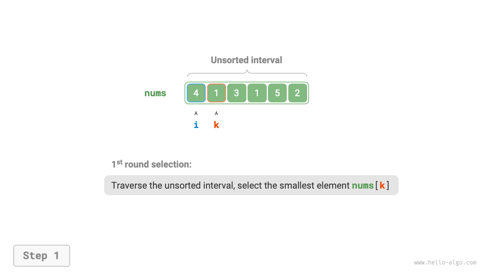

=== "<2>"
    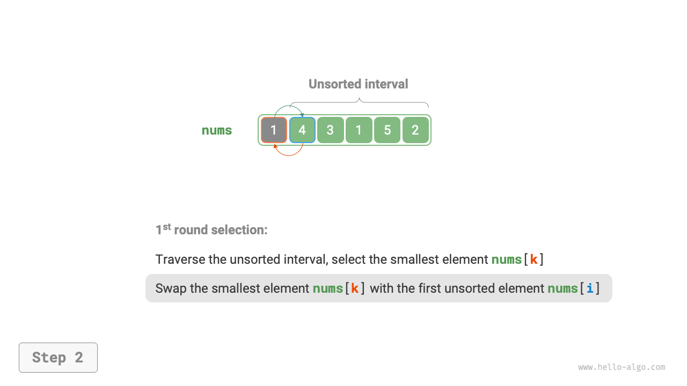

=== "<3>"
    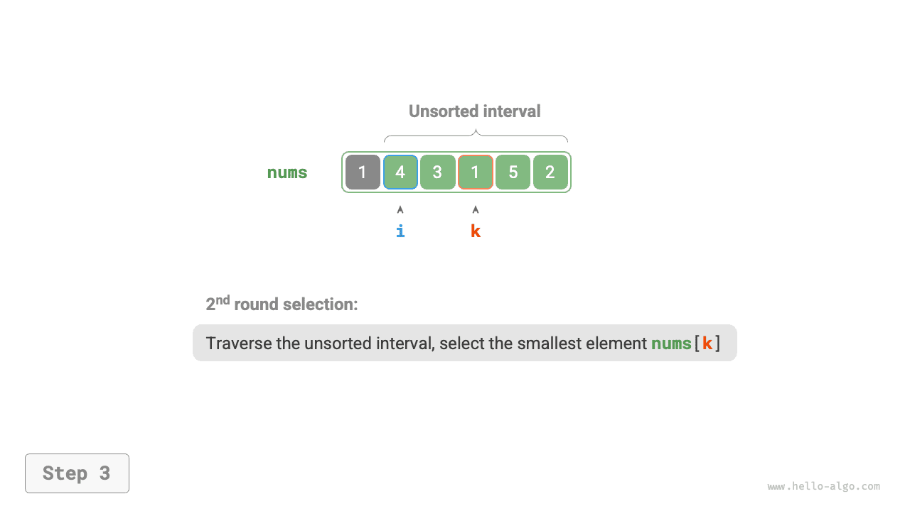

=== "<4>"
    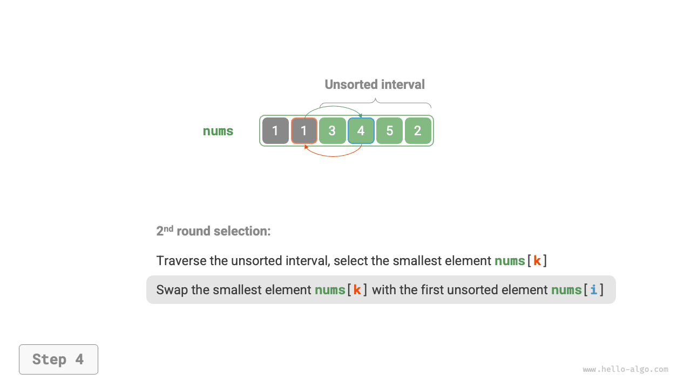

=== "<5>"
    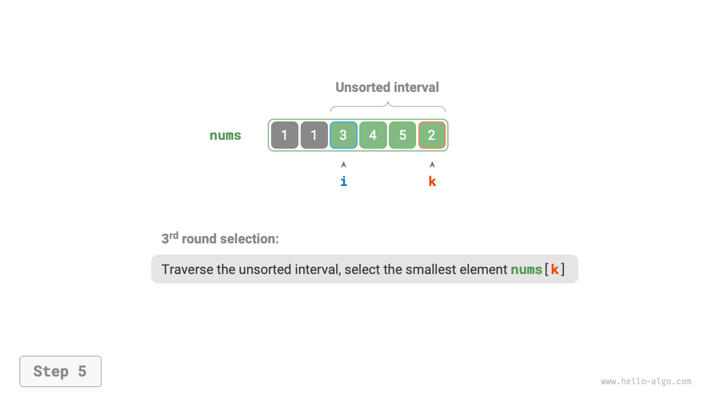

=== "<6>"
    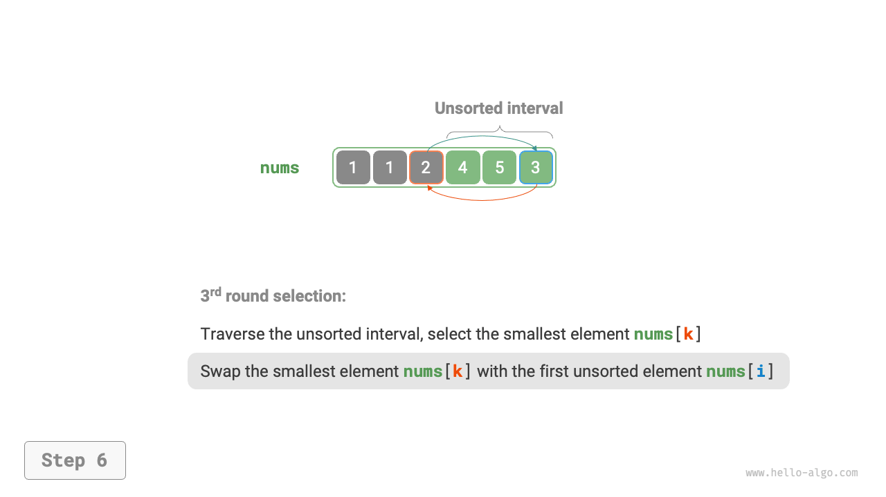

=== "<7>"
    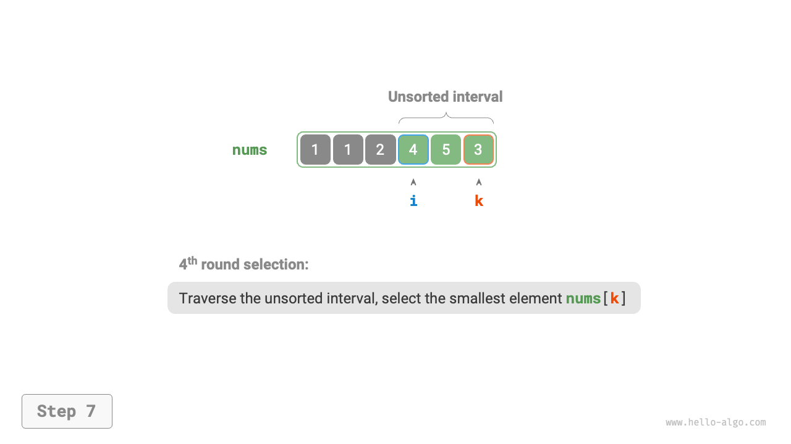

=== "<8>"
    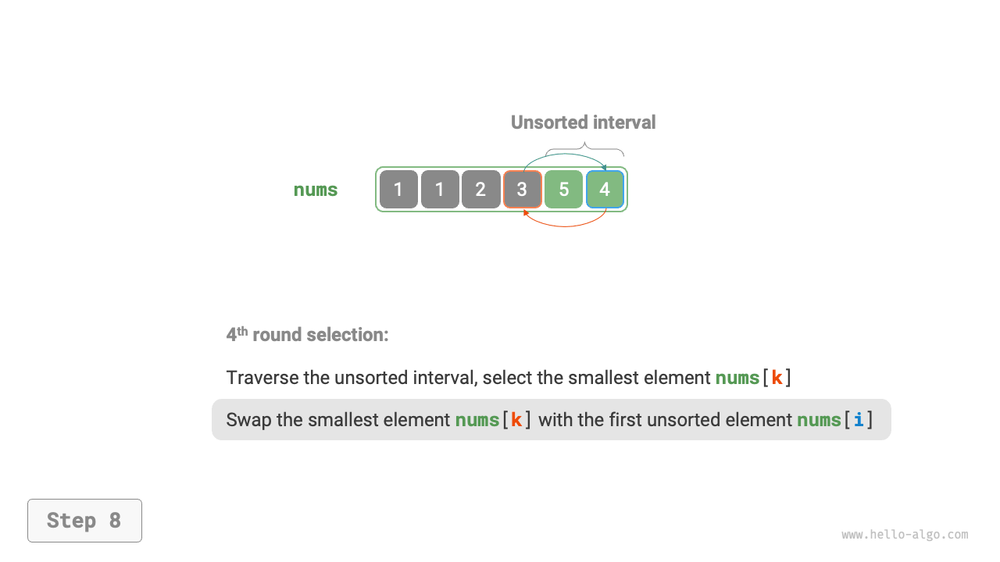

=== "<9>"
    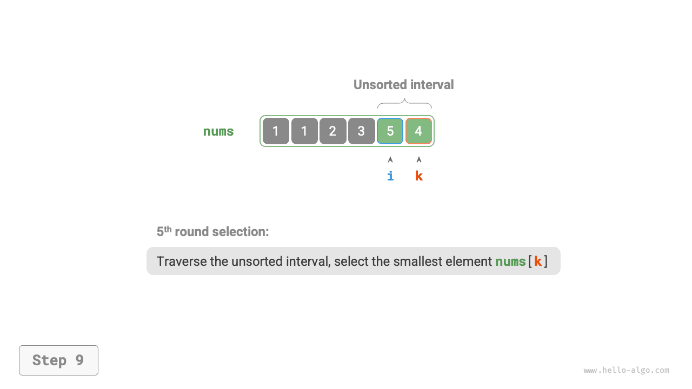

=== "<10>"
    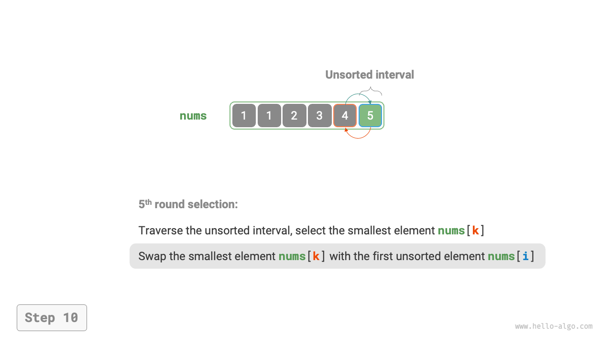

=== "<11>"
    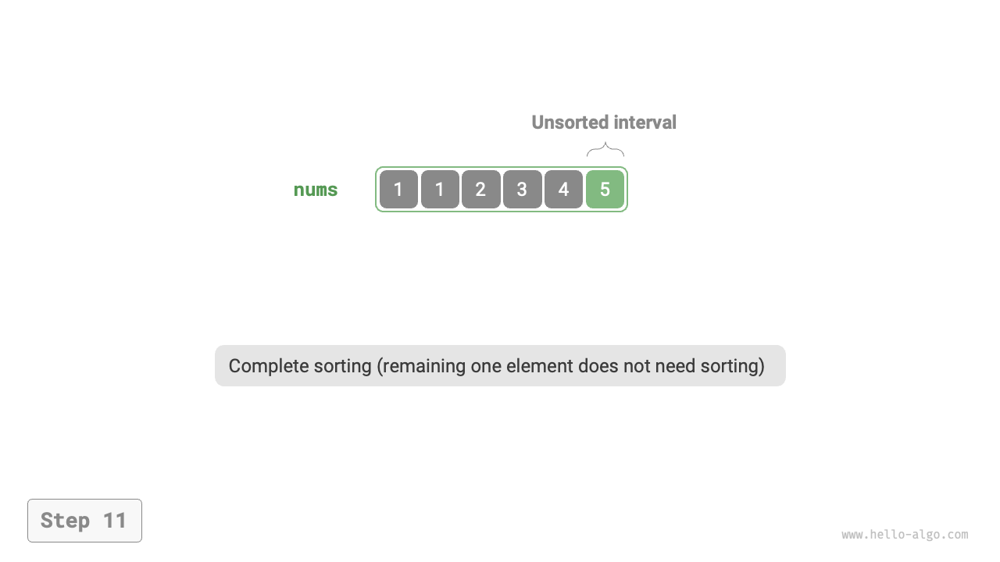

In the code, we use $k$ to record the smallest element within the unsorted interval:

```src
[file]{selection_sort}-[class]{}-[func]{selection_sort}
```

## Algorithm characteristics

- **Time complexity of $O(n^2)$, non-adaptive sort**: There are $n - 1$ rounds in the outer loop, with the unsorted interval length starting at $n$ in the first round and decreasing to $2$ in the last round, i.e., the outer loops contain $n$, $n - 1$, $\dots$, $3$, $2$ inner loops respectively, summing up to $\frac{(n - 1)(n + 2)}{2}$.
- **Space complexity of $O(1)$, in-place sort**: Uses constant extra space with pointers $i$ and $j$.
- **Non-stable sort**: As shown in the figure below, an element `nums[i]` may be swapped to the right of an equal element, causing their relative order to change.

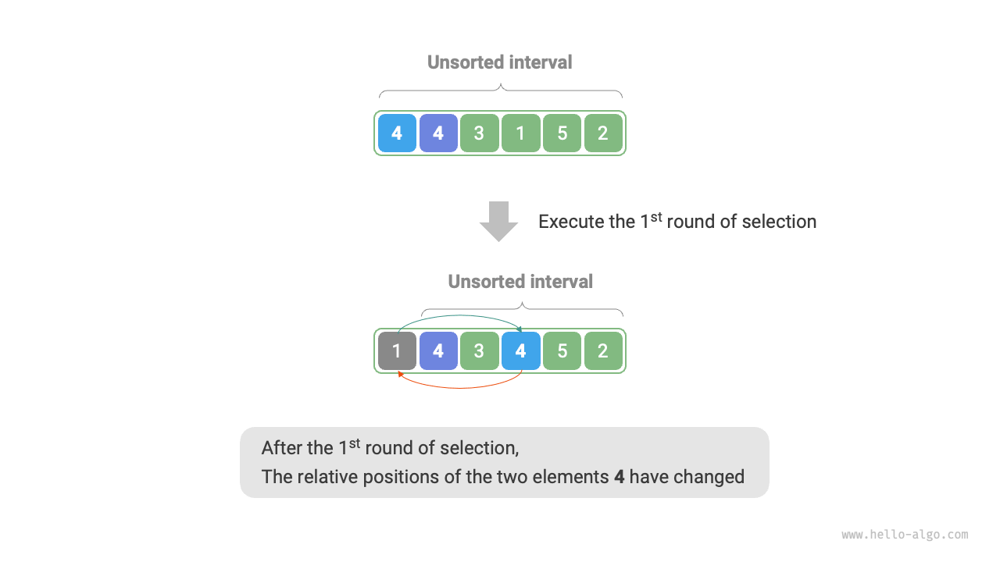
