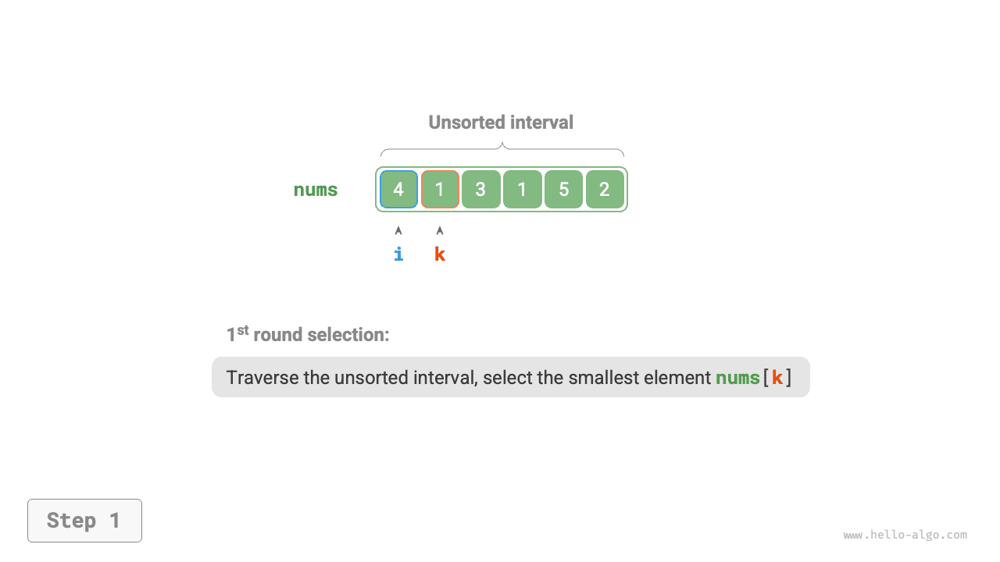
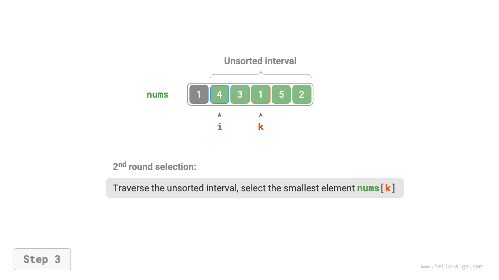
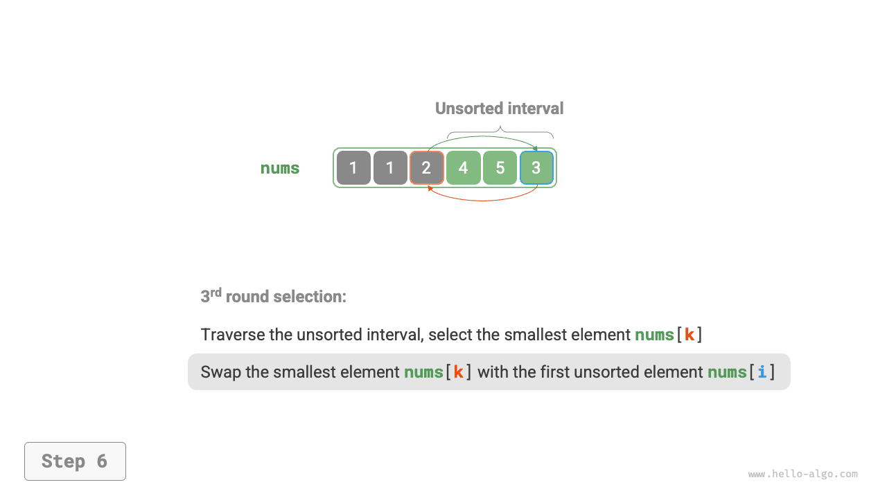
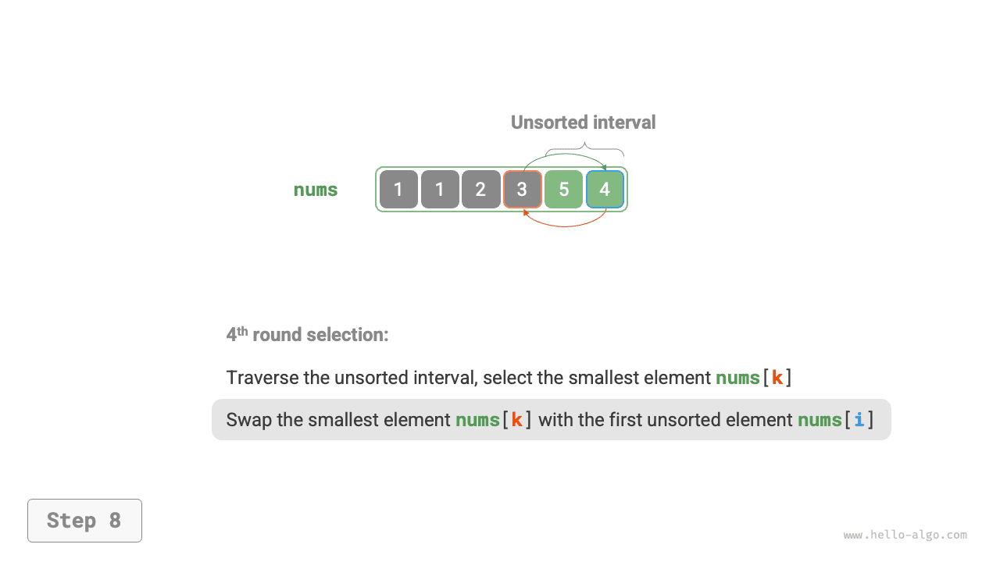
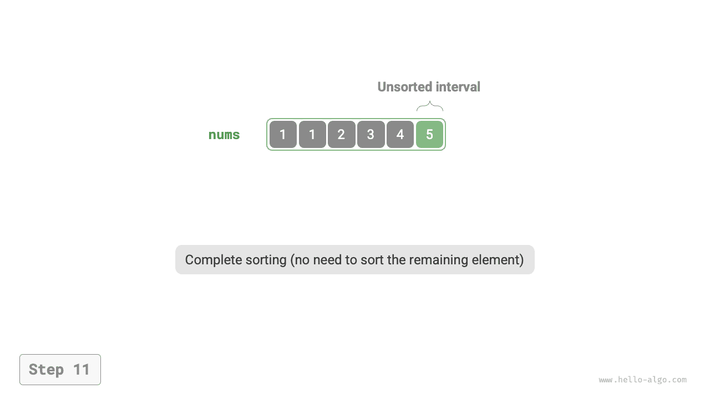

# Selection Sort

<u>Selection sort</u> works very simply: in each round, it selects the smallest element from the unsorted interval and places it at the end of the sorted interval.

Assume the array has length $n$. The procedure of selection sort is shown in the figure below.

1. Initially, all elements are unsorted, i.e., the unsorted (index) interval is $[0, n-1]$.
2. Select the smallest element in the interval $[0, n-1]$ and swap it with the element at index $0$. After completion, the first element of the array is sorted.
3. Select the smallest element in the interval $[1, n-1]$ and swap it with the element at index $1$. After completion, the first 2 elements of the array are sorted.
4. And so on. After $n - 1$ rounds of selection and swapping, the first $n - 1$ elements of the array are sorted.
5. The only remaining element must be the largest, so no further sorting is needed and the array is sorted.

=== "<1>"
    

=== "<2>"
    

=== "<3>"
    

=== "<4>"
    

=== "<5>"
    

=== "<6>"
    

=== "<7>"
    

=== "<8>"
    

=== "<9>"
    

=== "<10>"
    

=== "<11>"
    

In the code, we use $k$ to track the smallest element within the unsorted interval:

```src
[file]{selection_sort}-[class]{}-[func]{selection_sort}
```

## Algorithm Characteristics

- **Time complexity $O(n^2)$, non-adaptive sorting**: The outer loop has $n - 1$ rounds in total. The length of the unsorted interval in the first round is $n$, and the length of the unsorted interval in the last round is $2$. That is, the rounds of the outer loop contain inner loops with $n$, $n - 1$, $\dots$, $3$, and $2$ iterations, summing to $\frac{(n - 1)(n + 2)}{2}$.
- **Space complexity $O(1)$, in-place sorting**: Pointers $i$ and $j$ use a constant amount of extra space.
- **Unstable sorting**: As shown in the figure below, element `nums[i]` may be swapped to the right of an element equal to it, causing a change in their relative order.


