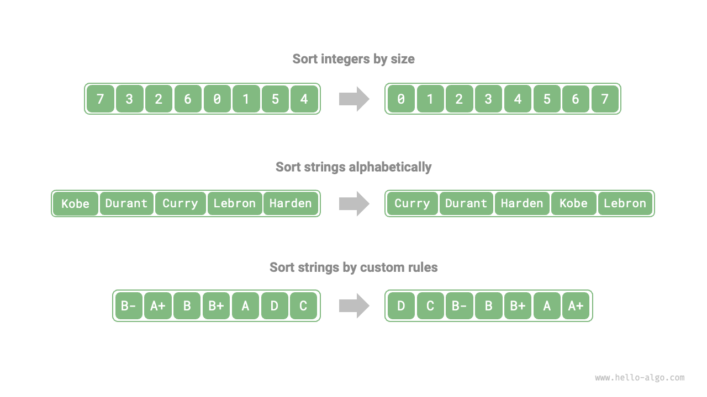

# Sorting algorithms

<u>Sorting algorithms</u> are used to arrange a set of data in a specific order. Sorting algorithms have a wide range of applications because ordered data can usually be searched, analyzed, and processed more efficiently.

As shown in the figure below, the data types in sorting algorithms can be integers, floating point numbers, characters, or strings, etc. Sorting criterion can be set according to needs, such as numerical size, character ASCII order, or custom criterion.



## Evaluation dimensions

**Execution efficiency**: We expect the time complexity of sorting algorithms to be as low as possible, as well as a lower number of overall operations (lowering the constant term of time complexity). For large data volumes, execution efficiency is particularly important.

**In-place property**: As the name implies, <u>in-place sorting</u> is achieved by directly manipulating the original array, without the need for additional helper arrays, thus saving memory. Generally, in-place sorting involves fewer data moving operations and is faster.

**Stability**: <u>Stable sorting</u> ensures that the relative order of equal elements in the array does not change after sorting.

Stable sorting is a necessary condition for multi-key sorting scenarios. Suppose we have a table storing student information, with the first and second columns being name and age, respectively. In this case, <u>unstable sorting</u> might lead to a loss of order in the input data:

```shell
# Input data is sorted by name
# (name, age)
  ('A', 19)
  ('B', 18)
  ('C', 21)
  ('D', 19)
  ('E', 23)

# Assuming an unstable sorting algorithm is used to sort the list by age,
# the result changes the relative position of ('D', 19) and ('A', 19),
# and the property of the input data being sorted by name is lost
  ('B', 18)
  ('D', 19)
  ('A', 19)
  ('C', 21)
  ('E', 23)
```

**Adaptability**: <u>Adaptive sorting</u> leverages existing order information within the input data to reduce computational effort, achieving more optimal time efficiency. The best-case time complexity of adaptive sorting algorithms is typically better than their average-case time complexity.

**Comparison or non-comparison-based**: <u>Comparison-based sorting</u> relies on comparison operators ($<$, $=$, $>$) to determine the relative order of elements and thus sort the entire array, with the theoretical optimal time complexity being $O(n \log n)$. Meanwhile, <u>non-comparison sorting</u> does not use comparison operators and can achieve a time complexity of $O(n)$, but its versatility is relatively poor.

## Ideal sorting algorithm

**Fast execution, in-place, stable, adaptive, and versatile**. Clearly, no sorting algorithm that combines all these features has been found to date. Therefore, when selecting a sorting algorithm, it is necessary to decide based on the specific characteristics of the data and the requirements of the problem.

Next, we will learn about various sorting algorithms together and analyze the advantages and disadvantages of each based on the above evaluation dimensions.
