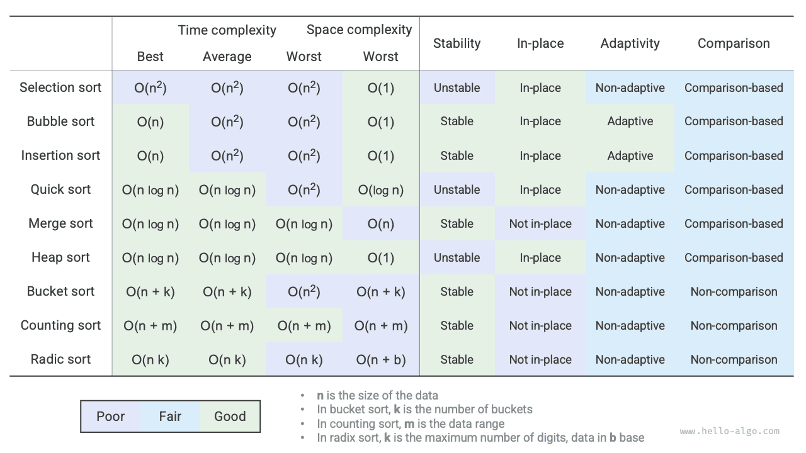

# Summary

### Key review

- Bubble sort works by swapping adjacent elements. By adding a flag to enable early return, we can optimize the best-case time complexity of bubble sort to $O(n)$.
- Insertion sort sorts each round by inserting elements from the unsorted interval into the correct position in the sorted interval. Although the time complexity of insertion sort is $O(n^2)$, it is very popular in sorting small amounts of data due to relatively fewer operations per unit.
- Quick sort is based on sentinel partitioning operations. In sentinel partitioning, it's possible to always pick the worst pivot, leading to a time complexity degradation to $O(n^2)$. Introducing median or random pivots can reduce the probability of such degradation. Tail recursion can effectively reduce the recursion depth, optimizing the space complexity to $O(\log n)$.
- Merge sort includes dividing and merging two phases, typically embodying the divide-and-conquer strategy. In merge sort, sorting an array requires creating auxiliary arrays, resulting in a space complexity of $O(n)$; however, the space complexity for sorting a list can be optimized to $O(1)$.
- Bucket sort consists of three steps: data bucketing, sorting within buckets, and merging results. It also embodies the divide-and-conquer strategy, suitable for very large datasets. The key to bucket sort is the even distribution of data.
- Counting sort is a special case of bucket sort, which sorts by counting the occurrences of each data point. Counting sort is suitable for large datasets with a limited range of data and requires that data can be converted to positive integers.
- Radix sort sorts data by sorting digit by digit, requiring data to be represented as fixed-length numbers.
- Overall, we hope to find a sorting algorithm that has high efficiency, stability, in-place operation, and adaptability. However, like other data structures and algorithms, no sorting algorithm can meet all these conditions simultaneously. In practical applications, we need to choose the appropriate sorting algorithm based on the characteristics of the data.
- The figure below compares mainstream sorting algorithms in terms of efficiency, stability, in-place nature, and adaptability.

### Q & A

**Q**: When is the stability of sorting algorithms necessary?

In reality, we might sort based on one attribute of an object. For example, students have names and heights as attributes, and we aim to implement multi-level sorting: first by name to get `(A, 180) (B, 185) (C, 170) (D, 170)`; then by height. Because the sorting algorithm is unstable, we might end up with `(D, 170) (C, 170) (A, 180) (B, 185)`.

It can be seen that the positions of students D and C have been swapped, disrupting the orderliness of the names, which is undesirable.

**Q**: Can the order of "searching from right to left" and "searching from left to right" in sentinel partitioning be swapped?

No, when using the leftmost element as the pivot, we must first "search from right to left" then "search from left to right". This conclusion is somewhat counterintuitive, so let's analyze the reason.

The last step of the sentinel partition `partition()` is to swap `nums[left]` and `nums[i]`. After the swap, the elements to the left of the pivot are all `<=` the pivot, **which requires that `nums[left] >= nums[i]` must hold before the last swap**. Suppose we "search from left to right" first, then if no element larger than the pivot is found, **we will exit the loop when `i == j`, possibly with `nums[j] == nums[i] > nums[left]`**. In other words, the final swap operation will exchange an element larger than the pivot to the left end of the array, causing the sentinel partition to fail.

For example, given the array `[0, 0, 0, 0, 1]`, if we first "search from left to right", the array after the sentinel partition is `[1, 0, 0, 0, 0]`, which is incorrect.

Upon further consideration, if we choose `nums[right]` as the pivot, then exactly the opposite, we must first "search from left to right".

**Q**: Regarding tail recursion optimization, why does choosing the shorter array ensure that the recursion depth does not exceed $\log n$?

The recursion depth is the number of currently unreturned recursive methods. Each round of sentinel partition divides the original array into two subarrays. With tail recursion optimization, the length of the subarray to be recursively followed is at most half of the original array length. Assuming the worst case always halves the length, the final recursion depth will be $\log n$.

Reviewing the original quicksort, we might continuously recursively process larger arrays, in the worst case from $n$, $n - 1$, ..., $2$, $1$, with a recursion depth of $n$. Tail recursion optimization can avoid this scenario.

**Q**: When all elements in the array are equal, is the time complexity of quicksort $O(n^2)$? How should this degenerate case be handled?

Yes. For this situation, consider using sentinel partitioning to divide the array into three parts: less than, equal to, and greater than the pivot. Only recursively proceed with the less than and greater than parts. In this method, an array where all input elements are equal can be sorted in just one round of sentinel partitioning.

**Q**: Why is the worst-case time complexity of bucket sort $O(n^2)$?

In the worst case, all elements are placed in the same bucket. If we use an $O(n^2)$ algorithm to sort these elements, the time complexity will be $O(n^2)$.
