# Double-ended queue

In a queue, we can only delete elements from the head or add elements to the tail. As shown in the following diagram, a "double-ended queue (deque)" offers more flexibility, allowing the addition or removal of elements at both the head and the tail.

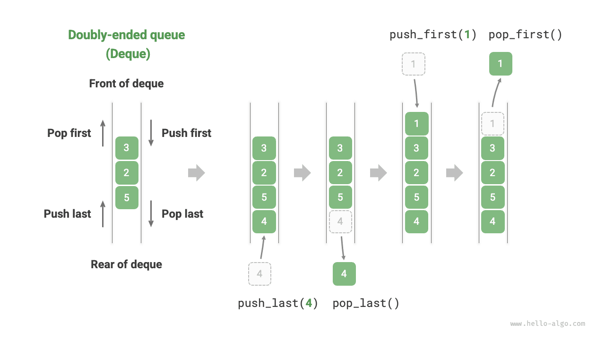

## Common operations in double-ended queue

The common operations in a double-ended queue are listed below, and the names of specific methods depend on the programming language used.

<p align="center"> Table <id> &nbsp; Efficiency of double-ended queue operations </p>

| Method Name   | Description                 | Time Complexity |
| ------------- | --------------------------- | --------------- |
| `pushFirst()` | Add an element to the head | $O(1)$          |
| `pushLast()`  | Add an element to the tail  | $O(1)$          |
| `popFirst()`  | Remove the first element    | $O(1)$          |
| `popLast()`   | Remove the last element     | $O(1)$          |
| `peekFirst()` | Access the first element    | $O(1)$          |
| `peekLast()`  | Access the last element     | $O(1)$          |

Similarly, we can directly use the double-ended queue classes implemented in programming languages:

=== "Python"

    ```python title="deque.py"
    from collections import deque

    # Initialize the deque
    deque: deque[int] = deque()

    # Enqueue elements
    deque.append(2)      # Add to the tail
    deque.append(5)
    deque.append(4)
    deque.appendleft(3)  # Add to the head
    deque.appendleft(1)

    # Access elements
    front: int = deque[0]  # The first element
    rear: int = deque[-1]  # The last element

    # Dequeue elements
    pop_front: int = deque.popleft()  # The first element dequeued
    pop_rear: int = deque.pop()       # The last element dequeued

    # Get the length of the deque
    size: int = len(deque)

    # Check if the deque is empty
    is_empty: bool = len(deque) == 0
    ```

=== "C++"

    ```cpp title="deque.cpp"
    /* Initialize the deque */
    deque<int> deque;

    /* Enqueue elements */
    deque.push_back(2);   // Add to the tail
    deque.push_back(5);
    deque.push_back(4);
    deque.push_front(3);  // Add to the head
    deque.push_front(1);

    /* Access elements */
    int front = deque.front(); // The first element
    int back = deque.back();   // The last element

    /* Dequeue elements */
    deque.pop_front();  // The first element dequeued
    deque.pop_back();   // The last element dequeued

    /* Get the length of the deque */
    int size = deque.size();

    /* Check if the deque is empty */
    bool empty = deque.empty();
    ```

=== "Java"

    ```java title="deque.java"
    /* Initialize the deque */
    Deque<Integer> deque = new LinkedList<>();

    /* Enqueue elements */
    deque.offerLast(2);   // Add to the tail
    deque.offerLast(5);
    deque.offerLast(4);
    deque.offerFirst(3);  // Add to the head
    deque.offerFirst(1);

    /* Access elements */
    int peekFirst = deque.peekFirst();  // The first element
    int peekLast = deque.peekLast();    // The last element

    /* Dequeue elements */
    int popFirst = deque.pollFirst();  // The first element dequeued
    int popLast = deque.pollLast();    // The last element dequeued

    /* Get the length of the deque */
    int size = deque.size();

    /* Check if the deque is empty */
    boolean isEmpty = deque.isEmpty();
    ```

=== "C#"

    ```csharp title="deque.cs"
    /* Initialize the deque */
    // In C#, LinkedList is used as a deque
    LinkedList<int> deque = new();

    /* Enqueue elements */
    deque.AddLast(2);   // Add to the tail
    deque.AddLast(5);
    deque.AddLast(4);
    deque.AddFirst(3);  // Add to the head
    deque.AddFirst(1);

    /* Access elements */
    int peekFirst = deque.First.Value;  // The first element
    int peekLast = deque.Last.Value;    // The last element

    /* Dequeue elements */
    deque.RemoveFirst();  // The first element dequeued
    deque.RemoveLast();   // The last element dequeued

    /* Get the length of the deque */
    int size = deque.Count;

    /* Check if the deque is empty */
    bool isEmpty = deque.Count == 0;
    ```

=== "Go"

    ```go title="deque_test.go"
    /* Initialize the deque */
    // In Go, use list as a deque
    deque := list.New()

    /* Enqueue elements */
    deque.PushBack(2)      // Add to the tail
    deque.PushBack(5)
    deque.PushBack(4)
    deque.PushFront(3)     // Add to the head
    deque.PushFront(1)

    /* Access elements */
    front := deque.Front() // The first element
    rear := deque.Back()   // The last element

    /* Dequeue elements */
    deque.Remove(front)    // The first element dequeued
    deque.Remove(rear)     // The last element dequeued

    /* Get the length of the deque */
    size := deque.Len()

    /* Check if the deque is empty */
    isEmpty := deque.Len() == 0
    ```

=== "Swift"

    ```swift title="deque.swift"
    /* Initialize the deque */
    // Swift does not have a built-in deque class, so Array can be used as a deque
    var deque: [Int] = []

    /* Enqueue elements */
    deque.append(2) // Add to the tail
    deque.append(5)
    deque.append(4)
    deque.insert(3, at: 0) // Add to the head
    deque.insert(1, at: 0)

    /* Access elements */
    let peekFirst = deque.first! // The first element
    let peekLast = deque.last!   // The last element

    /* Dequeue elements */
    // Using Array, popFirst has a complexity of O(n)
    let popFirst = deque.removeFirst() // The first element dequeued
    let popLast = deque.removeLast()   // The last element dequeued

    /* Get the length of the deque */
    let size = deque.count

    /* Check if the deque is empty */
    let isEmpty = deque.isEmpty
    ```

=== "JS"

    ```javascript title="deque.js"
    /* Initialize the deque */
    // JavaScript does not have a built-in deque, so Array is used as a deque
    const deque = [];

    /* Enqueue elements */
    deque.push(2);
    deque.push(5);
    deque.push(4);
    // Note that unshift() has a time complexity of O(n) as it's an array
    deque.unshift(3);
    deque.unshift(1);

    /* Access elements */
    const peekFirst = deque[0]; // The first element
    const peekLast = deque[deque.length - 1]; // The last element

    /* Dequeue elements */
    // Note that shift() has a time complexity of O(n) as it's an array
    const popFront = deque.shift(); // The first element dequeued
    const popBack = deque.pop();    // The last element dequeued

    /* Get the length of the deque */
    const size = deque.length;

    /* Check if the deque is empty */
    const isEmpty = size === 0;
    ```

=== "TS"

    ```typescript title="deque.ts"
    /* Initialize the deque */
    // TypeScript does not have a built-in deque, so Array is used as a deque
    const deque: number[] = [];

    /* Enqueue elements */
    deque.push(2);
    deque.push(5);
    deque.push(4);
    // Note that unshift() has a time complexity of O(n) as it's an array
    deque.unshift(3);
    deque.unshift(1);

    /* Access elements */
    const peekFirst: number = deque[0]; // The first element
    const peekLast: number = deque[deque.length - 1]; // The last element

    /* Dequeue elements */
    // Note that shift() has a time complexity of O(n) as it's an array
    const popFront: number = deque.shift() as number; // The first element dequeued
    const popBack: number = deque.pop() as number;    // The last element dequeued

    /* Get the length of the deque */
    const size: number = deque.length;

    /* Check if the deque is empty */
    const isEmpty: boolean = size === 0;
    ```

=== "Dart"

    ```dart title="deque.dart"
    /* Initialize the deque */
    // In Dart, Queue is defined as a deque
    Queue<int> deque = Queue<int>();

    /* Enqueue elements */
    deque.addLast(2);  // Add to the tail
    deque.addLast(5);
    deque.addLast(4);
    deque.addFirst(3); // Add to the head
    deque.addFirst(1);

    /* Access elements */
    int peekFirst = deque.first; // The first element
    int peekLast = deque.last;   // The last element

    /* Dequeue elements */
    int popFirst = deque.removeFirst(); // The first element dequeued
    int popLast = deque.removeLast();   // The last element dequeued

    /* Get the length of the deque */
    int size = deque.length;

    /* Check if the deque is empty */
    bool isEmpty = deque.isEmpty;
    ```

=== "Rust"

    ```rust title="deque.rs"
    /* Initialize the deque */
    let mut deque: VecDeque<u32> = VecDeque::new();

    /* Enqueue elements */
    deque.push_back(2);  // Add to the tail
    deque.push_back(5);
    deque.push_back(4);
    deque.push_front(3); // Add to the head
    deque.push_front(1);

    /* Access elements */
    if let Some(front) = deque.front() { // The first element
    }
    if let Some(rear) = deque.back() {   // The last element
    }

    /* Dequeue elements */
    if let Some(pop_front) = deque.pop_front() { // The first element dequeued
    }
    if let Some(pop_rear) = deque.pop_back() {   // The last element dequeued
    }

    /* Get the length of the deque */
    let size = deque.len();

    /* Check if the deque is empty */
    let is_empty = deque.is_empty();
    ```

=== "C"

    ```c title="deque.c"
    // C does not provide a built-in deque
    ```

=== "Kotlin"

    ```kotlin title="deque.kt"

    ```

=== "Zig"

    ```zig title="deque.zig"

    ```

??? pythontutor "Visualizing Code"

    https://pythontutor.com/render.html#code=from%20collections%20import%20deque%0A%0A%22%22%22Driver%20Code%22%22%22%0Aif%20__name__%20%3D%3D%20%22__main__%22%3A%0A%20%20%20%20%23%20%E5%88%9D%E5%A7%8B%E5%8C%96%E5%8F%8C%E5%90%91%E9%98%9F%E5%88%97%0A%20%20%20%20deq%20%3D%20deque%28%29%0A%0A%20%20%20%20%23%20%E5%85%83%E7%B4%A0%E5%85%A5%E9%98%9F%0A%20%20%20%20deq.append%282%29%20%20%23%20%E6%B7%BB%E5%8A%A0%E8%87%B3%E9%98%9F%E5%B0%BE%0A%20%20%20%20deq.append%285%29%0A%20%20%20%20deq.append%284%29%0A%20%20%20%20deq.appendleft%283%29%20%20%23%20%E6%B7%BB%E5%8A%A0%E8%87%B3%E9%98%9F%E9%A6%96%0A%20%20%20%20deq.appendleft%281%29%0A%20%20%20%20print%28%22%E5%8F%8C%E5%90%91%E9%98%9F%E5%88%97%20deque%20%3D%22,%20deq%29%0A%0A%20%20%20%20%23%20%E8%AE%BF%E9%97%AE%E5%85%83%E7%B4%A0%0A%20%20%20%20front%20%3D%20deq%5B0%5D%20%20%23%20%E9%98%9F%E9%A6%96%E5%85%83%E7%B4%A0%0A%20%20%20%20print%28%22%E9%98%9F%E9%A6%96%E5%85%83%E7%B4%A0%20front%20%3D%22,%20front%29%0A%20%20%20%20rear%20%3D%20deq%5B-1%5D%20%20%23%20%E9%98%9F%E5%B0%BE%E5%85%83%E7%B4%A0%0A%20%20%20%20print%28%22%E9%98%9F%E5%B0%BE%E5%85%83%E7%B4%A0%20rear%20%3D%22,%20rear%29%0A%0A%20%20%20%20%23%20%E5%85%83%E7%B4%A0%E5%87%BA%E9%98%9F%0A%20%20%20%20pop_front%20%3D%20deq.popleft%28%29%20%20%23%20%E9%98%9F%E9%A6%96%E5%85%83%E7%B4%A0%E5%87%BA%E9%98%9F%0A%20%20%20%20print%28%22%E9%98%9F%E9%A6%96%E5%87%BA%E9%98%9F%E5%85%83%E7%B4%A0%20%20pop_front%20%3D%22,%20pop_front%29%0A%20%20%20%20print%28%22%E9%98%9F%E9%A6%96%E5%87%BA%E9%98%9F%E5%90%8E%20deque%20%3D%22,%20deq%29%0A%20%20%20%20pop_rear%20%3D%20deq.pop%28%29%20%20%23%20%E9%98%9F%E5%B0%BE%E5%85%83%E7%B4%A0%E5%87%BA%E9%98%9F%0A%20%20%20%20print%28%22%E9%98%9F%E5%B0%BE%E5%87%BA%E9%98%9F%E5%85%83%E7%B4%A0%20%20pop_rear%20%3D%22,%20pop_rear%29%0A%20%20%20%20print%28%22%E9%98%9F%E5%B0%BE%E5%87%BA%E9%98%9F%E5%90%8E%20deque%20%3D%22,%20deq%29%0A%0A%20%20%20%20%23%20%E8%8E%B7%E5%8F%96%E5%8F%8C%E5%90%91%E9%98%9F%E5%88%97%E7%9A%84%E9%95%BF%E5%BA%A6%0A%20%20%20%20size%20%3D%20len%28deq%29%0A%20%20%20%20print%28%22%E5%8F%8C%E5%90%91%E9%98%9F%E5%88%97%E9%95%BF%E5%BA%A6%20size%20%3D%22,%20size%29%0A%0A%20%20%20%20%23%20%E5%88%A4%E6%96%AD%E5%8F%8C%E5%90%91%E9%98%9F%E5%88%97%E6%98%AF%E5%90%A6%E4%B8%BA%E7%A9%BA%0A%20%20%20%20is_empty%20%3D%20len%28deq%29%20%3D%3D%200%0A%20%20%20%20print%28%22%E5%8F%8C%E5%90%91%E9%98%9F%E5%88%97%E6%98%AF%E5%90%A6%E4%B8%BA%E7%A9%BA%20%3D%22,%20is_empty%29&cumulative=false&curInstr=3&heapPrimitives=nevernest&mode=display&origin=opt-frontend.js&py=311&rawInputLstJSON=%5B%5D&textReferences=false

## Implementing a double-ended queue *

The implementation of a double-ended queue is similar to that of a regular queue, it can be based on either a linked list or an array as the underlying data structure.

### Implementation based on doubly linked list

Recall from the previous section that we used a regular singly linked list to implement a queue, as it conveniently allows for deleting from the head (corresponding to the dequeue operation) and adding new elements after the tail (corresponding to the enqueue operation).

For a double-ended queue, both the head and the tail can perform enqueue and dequeue operations. In other words, a double-ended queue needs to implement operations in the opposite direction as well. For this, we use a "doubly linked list" as the underlying data structure of the double-ended queue.

As shown in the figure below, we treat the head and tail nodes of the doubly linked list as the front and rear of the double-ended queue, respectively, and implement the functionality to add and remove nodes at both ends.

=== "LinkedListDeque"
    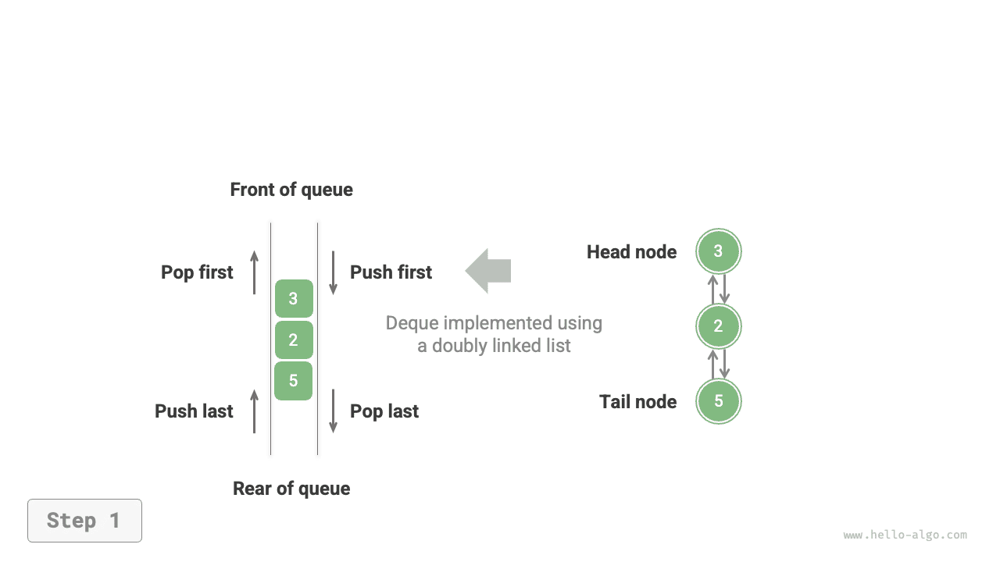

=== "pushLast()"
    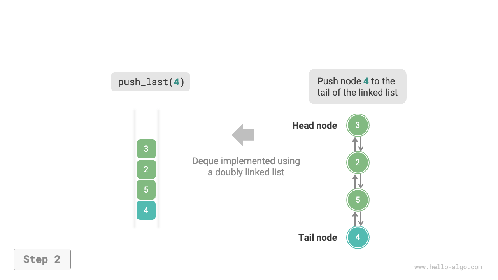

=== "pushFirst()"
    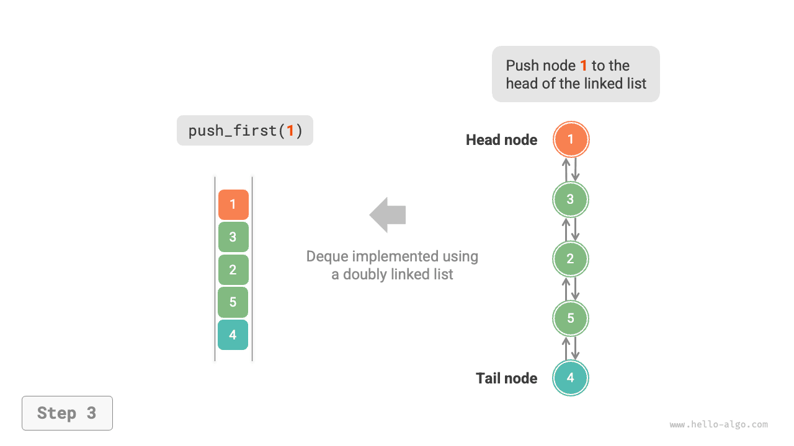

=== "popLast()"
    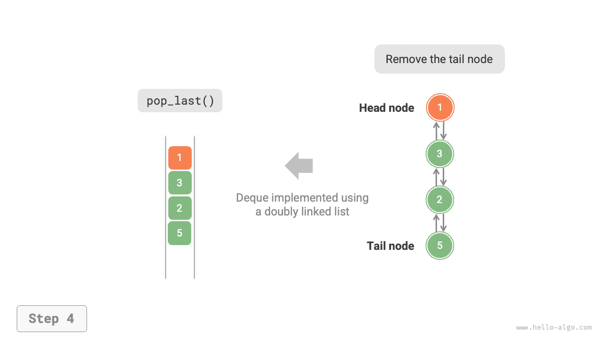

=== "popFirst()"
    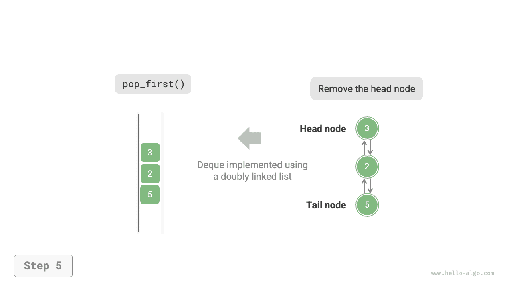

The implementation code is as follows:

```src
[file]{linkedlist_deque}-[class]{linked_list_deque}-[func]{}
```

### Implementation based on array

As shown in the figure below, similar to implementing a queue with an array, we can also use a circular array to implement a double-ended queue.

=== "ArrayDeque"
    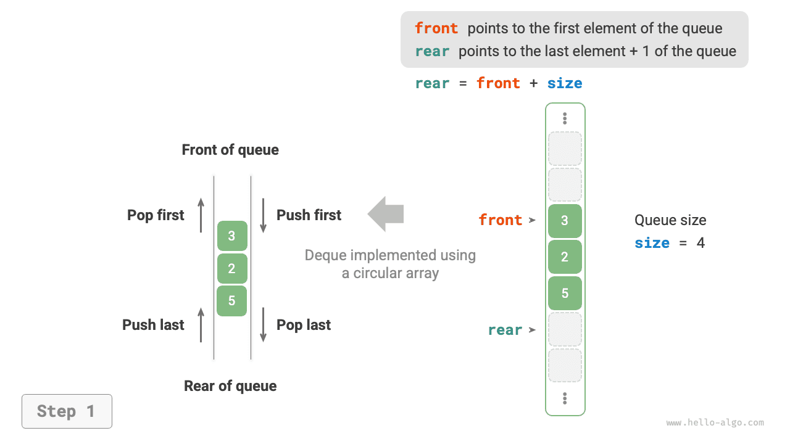

=== "pushLast()"
    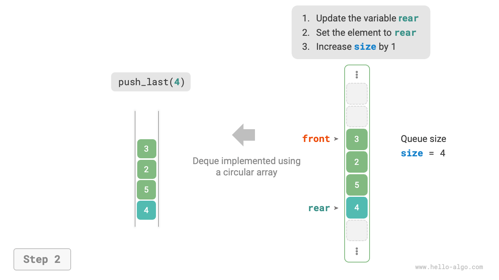

=== "pushFirst()"
    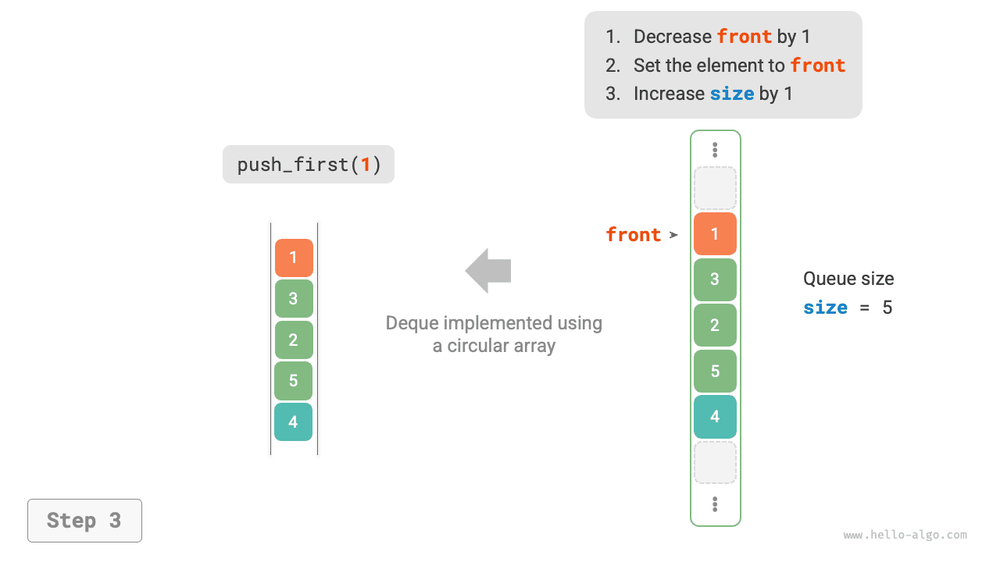

=== "popLast()"
    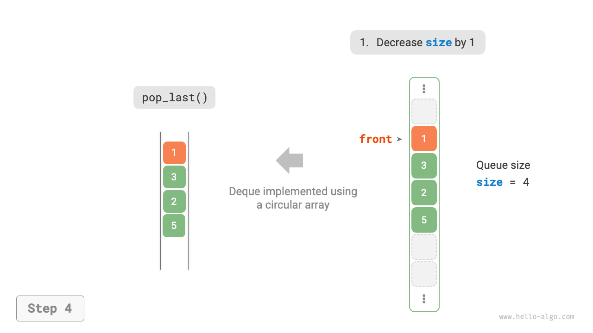

=== "popFirst()"
    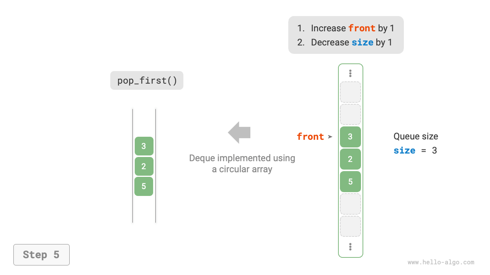

The implementation only needs to add methods for "front enqueue" and "rear dequeue":

```src
[file]{array_deque}-[class]{array_deque}-[func]{}
```

## Applications of double-ended queue

The double-ended queue combines the logic of both stacks and queues, **thus, it can implement all their respective use cases while offering greater flexibility**.

We know that software's "undo" feature is typically implemented using a stack: the system `pushes` each change operation onto the stack and then `pops` to implement undoing. However, considering the limitations of system resources, software often restricts the number of undo steps (for example, only allowing the last 50 steps). When the stack length exceeds 50, the software needs to perform a deletion operation at the bottom of the stack (the front of the queue). **But a regular stack cannot perform this function, where a double-ended queue becomes necessary**. Note that the core logic of "undo" still follows the Last-In-First-Out principle of a stack, but a double-ended queue can more flexibly implement some additional logic.
