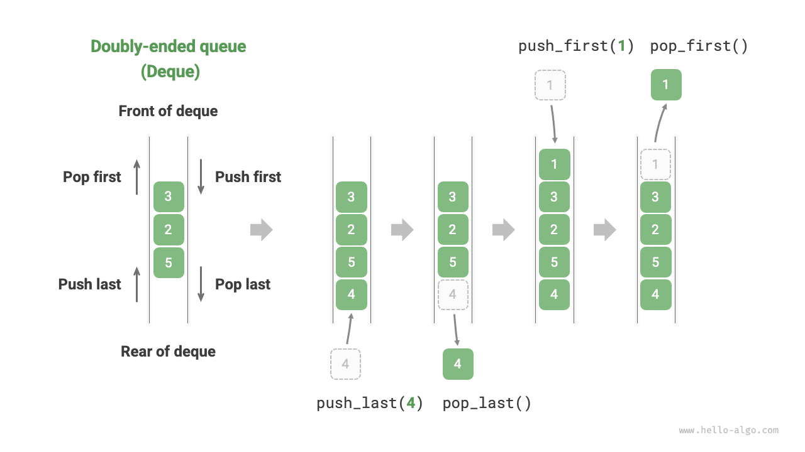
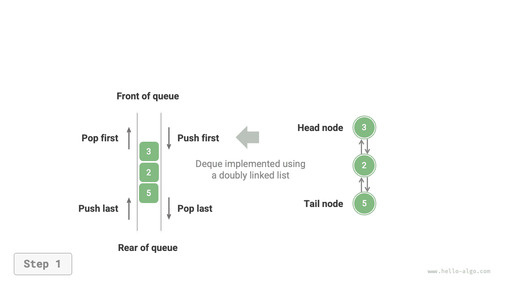

# 5.3 &nbsp; Deques

A queue allows removal only at the front and insertion only at the rear. As shown below, a <u>double-ended queue</u>, or deque, is more flexible: elements can be added or removed at either end.

{ class="animation-figure" }

<p align="center"> Figure 5-7 &nbsp; Deque operations </p>

## 5.3.1 &nbsp; Common deque operations

Table 5-3 lists common operations. Actual method names depend on the programming language.

<p align="center"> Table 5-3 &nbsp; Efficiency of deque operations </p>

<div class="center-table" markdown>

| Method         | Description             | Time complexity |
| -------------- | ---------------- | ---------- |
| `push_first()` | Add an element at the front | $O(1)$     |
| `push_last()`  | Add an element at the rear | $O(1)$     |
| `pop_first()`  | Remove the front element     | $O(1)$     |
| `pop_last()`   | Remove the rear element     | $O(1)$     |
| `peek_first()` | Access the front element     | $O(1)$     |
| `peek_last()`  | Access the rear element     | $O(1)$     |

</div>

Again, we can use a deque class already provided by the programming language:

=== "Python"

    ```python title="deque.py"
    from collections import deque

    # Initialize a deque
    deq: deque[int] = deque()

    # Enqueue elements
    deq.append(2)      # Add at the rear
    deq.append(5)
    deq.append(4)
    deq.appendleft(3)  # Add at the front
    deq.appendleft(1)

    # Access elements
    front: int = deq[0]  # Front element
    rear: int = deq[-1]  # Rear element

    # Dequeue elements
    pop_front: int = deq.popleft()  # Remove the front element
    pop_rear: int = deq.pop()       # Remove the rear element

    # Get the deque size
    size: int = len(deq)

    # Check whether the deque is empty
    is_empty: bool = len(deq) == 0
    ```

=== "C++"

    ```cpp title="deque.cpp"
    /* Initialize a deque */
    deque<int> deque;

    /* Enqueue elements */
    deque.push_back(2);   // Add at the rear
    deque.push_back(5);
    deque.push_back(4);
    deque.push_front(3);  // Add at the front
    deque.push_front(1);

    /* Access elements */
    int front = deque.front(); // Front element
    int back = deque.back();   // Rear element

    /* Dequeue elements */
    deque.pop_front();  // Remove the front element
    deque.pop_back();   // Remove the rear element

    /* Get the deque size */
    int size = deque.size();

    /* Check whether the deque is empty */
    bool empty = deque.empty();
    ```

=== "Java"

    ```java title="deque.java"
    /* Initialize a deque */
    Deque<Integer> deque = new LinkedList<>();

    /* Enqueue elements */
    deque.offerLast(2);   // Add at the rear
    deque.offerLast(5);
    deque.offerLast(4);
    deque.offerFirst(3);  // Add at the front
    deque.offerFirst(1);

    /* Access elements */
    int peekFirst = deque.peekFirst();  // Front element
    int peekLast = deque.peekLast();    // Rear element

    /* Dequeue elements */
    int popFirst = deque.pollFirst();  // Remove the front element
    int popLast = deque.pollLast();    // Remove the rear element

    /* Get the deque size */
    int size = deque.size();

    /* Check whether the deque is empty */
    boolean isEmpty = deque.isEmpty();
    ```

=== "C#"

    ```csharp title="deque.cs"
    /* Initialize a deque */
    // In C#, use a LinkedList as a deque
    LinkedList<int> deque = new();

    /* Enqueue elements */
    deque.AddLast(2);   // Add at the rear
    deque.AddLast(5);
    deque.AddLast(4);
    deque.AddFirst(3);  // Add at the front
    deque.AddFirst(1);

    /* Access elements */
    int peekFirst = deque.First.Value;  // Front element
    int peekLast = deque.Last.Value;    // Rear element

    /* Dequeue elements */
    deque.RemoveFirst();  // Remove the front element
    deque.RemoveLast();   // Remove the rear element

    /* Get the deque size */
    int size = deque.Count;

    /* Check whether the deque is empty */
    bool isEmpty = deque.Count == 0;
    ```

=== "Go"

    ```go title="deque_test.go"
    /* Initialize a deque */
    // In Go, use a list as a deque
    deque := list.New()

    /* Enqueue elements */
    deque.PushBack(2)      // Add at the rear
    deque.PushBack(5)
    deque.PushBack(4)
    deque.PushFront(3)     // Add at the front
    deque.PushFront(1)

    /* Access elements */
    front := deque.Front() // Front element
    rear := deque.Back()   // Rear element

    /* Dequeue elements */
    deque.Remove(front)    // Remove the front element
    deque.Remove(rear)     // Remove the rear element

    /* Get the deque size */
    size := deque.Len()

    /* Check whether the deque is empty */
    isEmpty := deque.Len() == 0
    ```

=== "Swift"

    ```swift title="deque.swift"
    /* Initialize a deque */
    // Swift has no built-in deque class; use an Array as a deque
    var deque: [Int] = []

    /* Enqueue elements */
    deque.append(2) // Add at the rear
    deque.append(5)
    deque.append(4)
    deque.insert(3, at: 0) // Add at the front
    deque.insert(1, at: 0)

    /* Access elements */
    let peekFirst = deque.first! // Front element
    let peekLast = deque.last! // Rear element

    /* Dequeue elements */
    // When using an Array, popFirst takes O(n) time
    let popFirst = deque.removeFirst() // Remove the front element
    let popLast = deque.removeLast() // Remove the rear element

    /* Get the deque size */
    let size = deque.count

    /* Check whether the deque is empty */
    let isEmpty = deque.isEmpty
    ```

=== "JS"

    ```javascript title="deque.js"
    /* Initialize a deque */
    // JavaScript has no built-in deque; use an Array instead
    const deque = [];

    /* Enqueue elements */
    deque.push(2);
    deque.push(5);
    deque.push(4);
    // Note that this is an array, so unshift() takes O(n) time
    deque.unshift(3);
    deque.unshift(1);

    /* Access elements */
    const peekFirst = deque[0];
    const peekLast = deque[deque.length - 1];

    /* Dequeue elements */
    // Note that this is an array, so shift() takes O(n) time
    const popFront = deque.shift();
    const popBack = deque.pop();

    /* Get the deque size */
    const size = deque.length;

    /* Check whether the deque is empty */
    const isEmpty = size === 0;
    ```

=== "TS"

    ```typescript title="deque.ts"
    /* Initialize a deque */
    // TypeScript has no built-in deque; use an Array instead
    const deque: number[] = [];

    /* Enqueue elements */
    deque.push(2);
    deque.push(5);
    deque.push(4);
    // Note that this is an array, so unshift() takes O(n) time
    deque.unshift(3);
    deque.unshift(1);

    /* Access elements */
    const peekFirst: number = deque[0];
    const peekLast: number = deque[deque.length - 1];

    /* Dequeue elements */
    // Note that this is an array, so shift() takes O(n) time
    const popFront: number = deque.shift() as number;
    const popBack: number = deque.pop() as number;

    /* Get the deque size */
    const size: number = deque.length;

    /* Check whether the deque is empty */
    const isEmpty: boolean = size === 0;
    ```

=== "Dart"

    ```dart title="deque.dart"
    /* Initialize a deque */
    // In Dart, Queue is defined as a deque
    Queue<int> deque = Queue<int>();

    /* Enqueue elements */
    deque.addLast(2);  // Add at the rear
    deque.addLast(5);
    deque.addLast(4);
    deque.addFirst(3); // Add at the front
    deque.addFirst(1);

    /* Access elements */
    int peekFirst = deque.first; // Front element
    int peekLast = deque.last;   // Rear element

    /* Dequeue elements */
    int popFirst = deque.removeFirst(); // Remove the front element
    int popLast = deque.removeLast();   // Remove the rear element

    /* Get the deque size */
    int size = deque.length;

    /* Check whether the deque is empty */
    bool isEmpty = deque.isEmpty;
    ```

=== "Rust"

    ```rust title="deque.rs"
    /* Initialize a deque */
    let mut deque: VecDeque<u32> = VecDeque::new();

    /* Enqueue elements */
    deque.push_back(2);  // Add at the rear
    deque.push_back(5);
    deque.push_back(4);
    deque.push_front(3); // Add at the front
    deque.push_front(1);

    /* Access elements */
    if let Some(front) = deque.front() { // Front element
    }
    if let Some(rear) = deque.back() {   // Rear element
    }

    /* Dequeue elements */
    if let Some(pop_front) = deque.pop_front() { // Remove the front element
    }
    if let Some(pop_rear) = deque.pop_back() {   // Remove the rear element
    }

    /* Get the deque size */
    let size = deque.len();

    /* Check whether the deque is empty */
    let is_empty = deque.is_empty();
    ```

=== "C"

    ```c title="deque.c"
    // C provides no built-in deque
    ```

=== "Kotlin"

    ```kotlin title="deque.kt"
    /* Initialize a deque */
    val deque = LinkedList<Int>()

    /* Enqueue elements */
    deque.offerLast(2)  // Add at the rear
    deque.offerLast(5)
    deque.offerLast(4)
    deque.offerFirst(3) // Add at the front
    deque.offerFirst(1)

    /* Access elements */
    val peekFirst = deque.peekFirst() // Front element
    val peekLast = deque.peekLast()   // Rear element

    /* Dequeue elements */
    val popFirst = deque.pollFirst() // Remove the front element
    val popLast = deque.pollLast()   // Remove the rear element

    /* Get the deque size */
    val size = deque.size

    /* Check whether the deque is empty */
    val isEmpty = deque.isEmpty()
    ```

=== "Ruby"

    ```ruby title="deque.rb"
    # Initialize a deque
    # Ruby has no built-in deque; use an Array instead
    deque = []

    # Enqueue elements
    deque << 2
    deque << 5
    deque << 4
    # Note that this is an array, so Array#unshift takes O(n) time
    deque.unshift(3)
    deque.unshift(1)

    # Access elements
    peek_first = deque.first
    peek_last = deque.last

    # Dequeue elements
    # Note that this is an array, so Array#shift takes O(n) time
    pop_front = deque.shift
    pop_back = deque.pop

    # Get the deque size
    size = deque.length

    # Check whether the deque is empty
    is_empty = size.zero?
    ```

??? pythontutor "Visualize execution"

    <div style="height: 549px; width: 100%;"><iframe class="pythontutor-iframe" title="Visualize execution" src="https://pythontutor.com/iframe-embed.html#code=from%20collections%20import%20deque%0A%0A%22%22%22Driver%20Code%22%22%22%0Aif%20__name__%20%3D%3D%20%22__main__%22%3A%0A%20%20%20%20%23%20Initialize%20a%20deque%0A%20%20%20%20deq%20%3D%20deque%28%29%0A%0A%20%20%20%20%23%20Enqueue%20elements%0A%20%20%20%20deq.append%282%29%20%20%23%20Add%20at%20the%20rear%0A%20%20%20%20deq.append%285%29%0A%20%20%20%20deq.append%284%29%0A%20%20%20%20deq.appendleft%283%29%20%20%23%20Add%20at%20the%20front%0A%20%20%20%20deq.appendleft%281%29%0A%20%20%20%20print%28%22Deque%3A%20deque%20%3D%22%2C%20deq%29%0A%0A%20%20%20%20%23%20Access%20elements%0A%20%20%20%20front%20%3D%20deq%5B0%5D%20%20%23%20Front%20element%0A%20%20%20%20print%28%22Front%20element%3A%20front%20%3D%22%2C%20front%29%0A%20%20%20%20rear%20%3D%20deq%5B-1%5D%20%20%23%20Rear%20element%0A%20%20%20%20print%28%22Rear%20element%3A%20rear%20%3D%22%2C%20rear%29%0A%0A%20%20%20%20%23%20Dequeue%20elements%0A%20%20%20%20pop_front%20%3D%20deq.popleft%28%29%20%20%23%20Remove%20the%20front%20element%0A%20%20%20%20print%28%22Element%20removed%20from%20the%20front%3A%20pop_front%20%3D%22%2C%20pop_front%29%0A%20%20%20%20print%28%22After%20removing%20from%20the%20front%3A%20deque%20%3D%22%2C%20deq%29%0A%20%20%20%20pop_rear%20%3D%20deq.pop%28%29%20%20%23%20Remove%20the%20rear%20element%0A%20%20%20%20print%28%22Element%20removed%20from%20the%20rear%3A%20pop_rear%20%3D%22%2C%20pop_rear%29%0A%20%20%20%20print%28%22After%20removing%20from%20the%20rear%3A%20deque%20%3D%22%2C%20deq%29%0A%0A%20%20%20%20%23%20Get%20the%20deque%20size%0A%20%20%20%20size%20%3D%20len%28deq%29%0A%20%20%20%20print%28%22Deque%20size%3A%20size%20%3D%22%2C%20size%29%0A%0A%20%20%20%20%23%20Check%20whether%20the%20deque%20is%20empty%0A%20%20%20%20is_empty%20%3D%20len%28deq%29%20%3D%3D%200%0A%20%20%20%20print%28%22Is%20the%20deque%20empty%20%3D%22%2C%20is_empty%29&codeDivHeight=472&codeDivWidth=350&cumulative=false&curInstr=3&heapPrimitives=nevernest&origin=opt-frontend.js&py=311&rawInputLstJSON=%5B%5D&textReferences=false"> </iframe></div>
    <div style="margin-top: 5px;"><a href="https://pythontutor.com/iframe-embed.html#code=from%20collections%20import%20deque%0A%0A%22%22%22Driver%20Code%22%22%22%0Aif%20__name__%20%3D%3D%20%22__main__%22%3A%0A%20%20%20%20%23%20Initialize%20a%20deque%0A%20%20%20%20deq%20%3D%20deque%28%29%0A%0A%20%20%20%20%23%20Enqueue%20elements%0A%20%20%20%20deq.append%282%29%20%20%23%20Add%20at%20the%20rear%0A%20%20%20%20deq.append%285%29%0A%20%20%20%20deq.append%284%29%0A%20%20%20%20deq.appendleft%283%29%20%20%23%20Add%20at%20the%20front%0A%20%20%20%20deq.appendleft%281%29%0A%20%20%20%20print%28%22Deque%3A%20deque%20%3D%22%2C%20deq%29%0A%0A%20%20%20%20%23%20Access%20elements%0A%20%20%20%20front%20%3D%20deq%5B0%5D%20%20%23%20Front%20element%0A%20%20%20%20print%28%22Front%20element%3A%20front%20%3D%22%2C%20front%29%0A%20%20%20%20rear%20%3D%20deq%5B-1%5D%20%20%23%20Rear%20element%0A%20%20%20%20print%28%22Rear%20element%3A%20rear%20%3D%22%2C%20rear%29%0A%0A%20%20%20%20%23%20Dequeue%20elements%0A%20%20%20%20pop_front%20%3D%20deq.popleft%28%29%20%20%23%20Remove%20the%20front%20element%0A%20%20%20%20print%28%22Element%20removed%20from%20the%20front%3A%20pop_front%20%3D%22%2C%20pop_front%29%0A%20%20%20%20print%28%22After%20removing%20from%20the%20front%3A%20deque%20%3D%22%2C%20deq%29%0A%20%20%20%20pop_rear%20%3D%20deq.pop%28%29%20%20%23%20Remove%20the%20rear%20element%0A%20%20%20%20print%28%22Element%20removed%20from%20the%20rear%3A%20pop_rear%20%3D%22%2C%20pop_rear%29%0A%20%20%20%20print%28%22After%20removing%20from%20the%20rear%3A%20deque%20%3D%22%2C%20deq%29%0A%0A%20%20%20%20%23%20Get%20the%20deque%20size%0A%20%20%20%20size%20%3D%20len%28deq%29%0A%20%20%20%20print%28%22Deque%20size%3A%20size%20%3D%22%2C%20size%29%0A%0A%20%20%20%20%23%20Check%20whether%20the%20deque%20is%20empty%0A%20%20%20%20is_empty%20%3D%20len%28deq%29%20%3D%3D%200%0A%20%20%20%20print%28%22Is%20the%20deque%20empty%20%3D%22%2C%20is_empty%29&codeDivHeight=800&codeDivWidth=600&cumulative=false&curInstr=3&heapPrimitives=nevernest&origin=opt-frontend.js&py=311&rawInputLstJSON=%5B%5D&textReferences=false" target="_blank" rel="noopener noreferrer">View full screen ></a></div>

## 5.3.2 &nbsp; Implementing a deque *

A deque is implemented much like a queue, using either a linked list or an array as the underlying structure.

### 1. &nbsp; Implementation with a doubly linked list

In the previous section, we used a singly linked list for a queue because it easily supports removing the head for dequeueing and adding after the tail for enqueueing.

A deque supports both insertion and removal at both ends. It therefore needs the symmetric operations in the other direction as well. For this reason, we use a doubly linked list.

As shown below, treat the list's head and tail as the deque's front and rear, and support adding and removing nodes at both ends.

=== "<1>"
    { class="animation-figure" }

=== "<2>"
    { class="animation-figure" }

=== "<3>"
    { class="animation-figure" }

=== "<4>"
    { class="animation-figure" }

=== "<5>"
    { class="animation-figure" }

<p align="center"> Figure 5-8 &nbsp; Insertion and removal in a linked-list deque </p>

The implementation is as follows:

=== "Python"

    ```python title="linkedlist_deque.py"
    class ListNode:
        """Doubly linked list node"""

        def __init__(self, val: int):
            """Constructor"""
            self.val: int = val
            self.next: ListNode | None = None  # Reference to the next node
            self.prev: ListNode | None = None  # Reference to the previous node

    class LinkedListDeque:
        """Deque implemented with a doubly linked list"""

        def __init__(self):
            """Constructor"""
            self._front: ListNode | None = None  # Head node front
            self._rear: ListNode | None = None  # Tail node rear
            self._size: int = 0  # Deque size

        def size(self) -> int:
            """Get the deque size"""
            return self._size

        def is_empty(self) -> bool:
            """Check whether the deque is empty"""
            return self._size == 0

        def push(self, num: int, is_front: bool):
            """Enqueue operation"""
            node = ListNode(num)
            # If the linked list is empty, make both front and rear point to node
            if self.is_empty():
                self._front = self._rear = node
            # Enqueue at the front
            elif is_front:
                # Add node to the head of the linked list
                self._front.prev = node
                node.next = self._front
                self._front = node  # Update the head node
            # Enqueue at the rear
            else:
                # Add node to the tail of the linked list
                self._rear.next = node
                node.prev = self._rear
                self._rear = node  # Update the tail node
            self._size += 1  # Update the deque size

        def push_first(self, num: int):
            """Enqueue at the front"""
            self.push(num, True)

        def push_last(self, num: int):
            """Enqueue at the rear"""
            self.push(num, False)

        def pop(self, is_front: bool) -> int:
            """Dequeue operation"""
            if self.is_empty():
                raise IndexError("Deque is empty")
            # When the deque size is 1, the head and tail point to the same node
            if self._size == 1:
                val: int = self._front.val
                self._front = None
                self._rear = None
            # Dequeue from the front
            elif is_front:
                val: int = self._front.val  # Save the head node value
                # Remove the head node
                fnext: ListNode | None = self._front.next
                fnext.prev = None
                self._front.next = None
                self._front = fnext  # Update the head node
            # Dequeue from the rear
            else:
                val: int = self._rear.val  # Save the tail node value
                # Remove the tail node
                rprev: ListNode | None = self._rear.prev
                rprev.next = None
                self._rear.prev = None
                self._rear = rprev  # Update the tail node
            self._size -= 1  # Update the deque size
            return val

        def pop_first(self) -> int:
            """Dequeue from the front"""
            return self.pop(True)

        def pop_last(self) -> int:
            """Dequeue from the rear"""
            return self.pop(False)

        def peek_first(self) -> int:
            """Access the front element"""
            if self.is_empty():
                raise IndexError("Deque is empty")
            return self._front.val

        def peek_last(self) -> int:
            """Access the rear element"""
            if self.is_empty():
                raise IndexError("Deque is empty")
            return self._rear.val

        def to_array(self) -> list[int]:
            """Return an array for printing"""
            node = self._front
            res = [0] * self.size()
            for i in range(self.size()):
                res[i] = node.val
                node = node.next
            return res
    ```

=== "C++"

    ```cpp title="linkedlist_deque.cpp"
    /* Doubly linked list node */
    struct DoublyListNode {
        int val;              // Node value
        DoublyListNode *next; // Pointer to the next node
        DoublyListNode *prev; // Pointer to the previous node
        DoublyListNode(int val) : val(val), prev(nullptr), next(nullptr) {
        }
    };

    /* Deque implemented with a doubly linked list */
    class LinkedListDeque {
      private:
        DoublyListNode *front, *rear; // Head node front and tail node rear
        int queSize = 0;              // Deque size

      public:
        /* Constructor */
        LinkedListDeque() : front(nullptr), rear(nullptr) {
        }

        /* Destructor */
        ~LinkedListDeque() {
            // Traverse the linked list and delete each node to free its memory
            DoublyListNode *pre, *cur = front;
            while (cur != nullptr) {
                pre = cur;
                cur = cur->next;
                delete pre;
            }
        }

        /* Get the deque size */
        int size() {
            return queSize;
        }

        /* Check whether the deque is empty */
        bool isEmpty() {
            return size() == 0;
        }

        /* Enqueue operation */
        void push(int num, bool isFront) {
            DoublyListNode *node = new DoublyListNode(num);
            // If the linked list is empty, make both front and rear point to node
            if (isEmpty())
                front = rear = node;
            // Enqueue at the front
            else if (isFront) {
                // Add node to the head of the linked list
                front->prev = node;
                node->next = front;
                front = node; // Update the head node
            // Enqueue at the rear
            } else {
                // Add node to the tail of the linked list
                rear->next = node;
                node->prev = rear;
                rear = node; // Update the tail node
            }
            queSize++; // Update the deque size
        }

        /* Enqueue at the front */
        void pushFirst(int num) {
            push(num, true);
        }

        /* Enqueue at the rear */
        void pushLast(int num) {
            push(num, false);
        }

        /* Dequeue operation */
        int pop(bool isFront) {
            if (isEmpty())
                throw out_of_range("Deque is empty");
            int val;
            // When the deque size is 1, the head and tail point to the same node
            if (queSize == 1) {
                val = front->val;
                delete front; // Both point to the same node, so free it only once
                front = nullptr;
                rear = nullptr;
            }
            // Dequeue from the front
            else if (isFront) {
                val = front->val; // Save the head node value
                // Remove the head node
                DoublyListNode *fNext = front->next;
                fNext->prev = nullptr;
                front->next = nullptr;
                delete front;
                front = fNext; // Update the head node
            // Dequeue from the rear
            } else {
                val = rear->val; // Save the tail node value
                // Remove the tail node
                DoublyListNode *rPrev = rear->prev;
                rPrev->next = nullptr;
                rear->prev = nullptr;
                delete rear;
                rear = rPrev; // Update the tail node
            }
            queSize--; // Update the deque size
            return val;
        }

        /* Dequeue from the front */
        int popFirst() {
            return pop(true);
        }

        /* Dequeue from the rear */
        int popLast() {
            return pop(false);
        }

        /* Access the front element */
        int peekFirst() {
            if (isEmpty())
                throw out_of_range("Deque is empty");
            return front->val;
        }

        /* Access the rear element */
        int peekLast() {
            if (isEmpty())
                throw out_of_range("Deque is empty");
            return rear->val;
        }

        /* Return a vector for printing */
        vector<int> toVector() {
            DoublyListNode *node = front;
            vector<int> res(size());
            for (int i = 0; i < res.size(); i++) {
                res[i] = node->val;
                node = node->next;
            }
            return res;
        }
    };
    ```

=== "Java"

    ```java title="linkedlist_deque.java"
    /* Doubly linked list node */
    class ListNode {
        int val; // Node value
        ListNode next; // Reference to the next node
        ListNode prev; // Reference to the previous node

        ListNode(int val) {
            this.val = val;
            prev = next = null;
        }
    }

    /* Deque implemented with a doubly linked list */
    class LinkedListDeque {
        private ListNode front, rear; // Head node front and tail node rear
        private int queSize = 0; // Deque size

        public LinkedListDeque() {
            front = rear = null;
        }

        /* Get the deque size */
        public int size() {
            return queSize;
        }

        /* Check whether the deque is empty */
        public boolean isEmpty() {
            return size() == 0;
        }

        /* Enqueue operation */
        private void push(int num, boolean isFront) {
            ListNode node = new ListNode(num);
            // If the linked list is empty, make both front and rear point to node
            if (isEmpty())
                front = rear = node;
            // Enqueue at the front
            else if (isFront) {
                // Add node to the head of the linked list
                front.prev = node;
                node.next = front;
                front = node; // Update the head node
            // Enqueue at the rear
            } else {
                // Add node to the tail of the linked list
                rear.next = node;
                node.prev = rear;
                rear = node; // Update the tail node
            }
            queSize++; // Update the queue size
        }

        /* Enqueue at the front */
        public void pushFirst(int num) {
            push(num, true);
        }

        /* Enqueue at the rear */
        public void pushLast(int num) {
            push(num, false);
        }

        /* Dequeue operation */
        private int pop(boolean isFront) {
            if (isEmpty())
                throw new IndexOutOfBoundsException();
            int val;
            // When the queue size is 1, the head and tail point to the same node
            if (queSize == 1) {
                val = front.val;
                front = null;
                rear = null;
            }
            // Dequeue from the front
            else if (isFront) {
                val = front.val; // Save the head node value
                // Remove the head node
                ListNode fNext = front.next;
                fNext.prev = null;
                front.next = null;
                front = fNext; // Update the head node
            // Dequeue from the rear
            } else {
                val = rear.val; // Save the tail node value
                // Remove the tail node
                ListNode rPrev = rear.prev;
                rPrev.next = null;
                rear.prev = null;
                rear = rPrev; // Update the tail node
            }
            queSize--; // Update the queue size
            return val;
        }

        /* Dequeue from the front */
        public int popFirst() {
            return pop(true);
        }

        /* Dequeue from the rear */
        public int popLast() {
            return pop(false);
        }

        /* Access the front element */
        public int peekFirst() {
            if (isEmpty())
                throw new IndexOutOfBoundsException();
            return front.val;
        }

        /* Access the rear element */
        public int peekLast() {
            if (isEmpty())
                throw new IndexOutOfBoundsException();
            return rear.val;
        }

        /* Return an array for printing */
        public int[] toArray() {
            ListNode node = front;
            int[] res = new int[size()];
            for (int i = 0; i < res.length; i++) {
                res[i] = node.val;
                node = node.next;
            }
            return res;
        }
    }
    ```

=== "C#"

    ```csharp title="linkedlist_deque.cs"
    /* Doubly linked list node */
    class ListNode(int val) {
        public int val = val;       // Node value
        public ListNode? next = null; // Reference to the next node
        public ListNode? prev = null; // Reference to the previous node
    }

    /* Deque implemented with a doubly linked list */
    class LinkedListDeque {
        ListNode? front, rear; // Head node front and tail node rear
        int queSize = 0;      // Deque size

        public LinkedListDeque() {
            front = null;
            rear = null;
        }

        /* Get the deque size */
        public int Size() {
            return queSize;
        }

        /* Check whether the deque is empty */
        public bool IsEmpty() {
            return Size() == 0;
        }

        /* Enqueue operation */
        void Push(int num, bool isFront) {
            ListNode node = new(num);
            // If the linked list is empty, make both front and rear point to node
            if (IsEmpty()) {
                front = node;
                rear = node;
            }
            // Enqueue at the front
            else if (isFront) {
                // Add node to the head of the linked list
                front!.prev = node;
                node.next = front;
                front = node; // Update the head node                           
            }
            // Enqueue at the rear
            else {
                // Add node to the tail of the linked list
                rear!.next = node;
                node.prev = rear;
                rear = node;  // Update the tail node
            }

            queSize++; // Update the queue size
        }

        /* Enqueue at the front */
        public void PushFirst(int num) {
            Push(num, true);
        }

        /* Enqueue at the rear */
        public void PushLast(int num) {
            Push(num, false);
        }

        /* Dequeue operation */
        int? Pop(bool isFront) {
            if (IsEmpty())
                throw new Exception();
            int? val;
            // When the queue size is 1, the head and tail point to the same node
            if (queSize == 1) {
                val = front!.val;
                front = null;
                rear = null;
            }
            // Dequeue from the front
            else if (isFront) {
                val = front!.val; // Save the head node value
                // Remove the head node
                ListNode? fNext = front?.next;
                fNext!.prev = null;
                front.next = null;
                front = fNext;   // Update the head node
            }
            // Dequeue from the rear
            else {
                val = rear!.val;  // Save the tail node value
                // Remove the tail node
                ListNode? rPrev = rear?.prev;
                rPrev!.next = null;
                rear.prev = null;
                rear = rPrev;    // Update the tail node
            }

            queSize--; // Update the queue size
            return val;
        }

        /* Dequeue from the front */
        public int? PopFirst() {
            return Pop(true);
        }

        /* Dequeue from the rear */
        public int? PopLast() {
            return Pop(false);
        }

        /* Access the front element */
        public int? PeekFirst() {
            if (IsEmpty())
                throw new Exception();
            return front?.val;
        }

        /* Access the rear element */
        public int? PeekLast() {
            if (IsEmpty())
                throw new Exception();
            return rear?.val;
        }

        /* Return an array for printing */
        public int?[] ToArray() {
            ListNode? node = front;
            int?[] res = new int?[Size()];
            for (int i = 0; i < res.Length; i++) {
                res[i] = node?.val;
                node = node?.next;
            }

            return res;
        }
    }
    ```

=== "Go"

    ```go title="linkedlist_deque.go"
    /* Deque implemented with a doubly linked list */
    type linkedListDeque struct {
        // Use the standard library list package
        data *list.List
    }

    /* Initialize the deque */
    func newLinkedListDeque() *linkedListDeque {
        return &linkedListDeque{
            data: list.New(),
        }
    }

    /* Enqueue an element at the front */
    func (s *linkedListDeque) pushFirst(value any) {
        s.data.PushFront(value)
    }

    /* Enqueue an element at the rear */
    func (s *linkedListDeque) pushLast(value any) {
        s.data.PushBack(value)
    }

    /* Dequeue the front element */
    func (s *linkedListDeque) popFirst() any {
        if s.isEmpty() {
            return nil
        }
        e := s.data.Front()
        s.data.Remove(e)
        return e.Value
    }

    /* Dequeue the rear element */
    func (s *linkedListDeque) popLast() any {
        if s.isEmpty() {
            return nil
        }
        e := s.data.Back()
        s.data.Remove(e)
        return e.Value
    }

    /* Access the front element */
    func (s *linkedListDeque) peekFirst() any {
        if s.isEmpty() {
            return nil
        }
        e := s.data.Front()
        return e.Value
    }

    /* Access the rear element */
    func (s *linkedListDeque) peekLast() any {
        if s.isEmpty() {
            return nil
        }
        e := s.data.Back()
        return e.Value
    }

    /* Get the queue size */
    func (s *linkedListDeque) size() int {
        return s.data.Len()
    }

    /* Check whether the queue is empty */
    func (s *linkedListDeque) isEmpty() bool {
        return s.data.Len() == 0
    }

    /* Get the list for printing */
    func (s *linkedListDeque) toList() *list.List {
        return s.data
    }
    ```

=== "Swift"

    ```swift title="linkedlist_deque.swift"
    /* Doubly linked list node */
    class ListNode {
        var val: Int // Node value
        var next: ListNode? // Reference to the next node
        weak var prev: ListNode? // Reference to the previous node

        init(val: Int) {
            self.val = val
        }
    }

    /* Deque implemented with a doubly linked list */
    class LinkedListDeque {
        private var front: ListNode? // Head node front
        private var rear: ListNode? // Tail node rear
        private var _size: Int // Deque size

        init() {
            _size = 0
        }

        /* Get the deque size */
        func size() -> Int {
            _size
        }

        /* Check whether the deque is empty */
        func isEmpty() -> Bool {
            size() == 0
        }

        /* Enqueue operation */
        private func push(num: Int, isFront: Bool) {
            let node = ListNode(val: num)
            // If the linked list is empty, make both front and rear point to node
            if isEmpty() {
                front = node
                rear = node
            }
            // Enqueue at the front
            else if isFront {
                // Add node to the head of the linked list
                front?.prev = node
                node.next = front
                front = node // Update the head node
            }
            // Enqueue at the rear
            else {
                // Add node to the tail of the linked list
                rear?.next = node
                node.prev = rear
                rear = node // Update the tail node
            }
            _size += 1 // Update the deque size
        }

        /* Enqueue at the front */
        func pushFirst(num: Int) {
            push(num: num, isFront: true)
        }

        /* Enqueue at the rear */
        func pushLast(num: Int) {
            push(num: num, isFront: false)
        }

        /* Dequeue operation */
        private func pop(isFront: Bool) -> Int {
            if isEmpty() {
                fatalError("Deque is empty")
            }
            let val: Int
            // When the deque size is 1, the head and tail point to the same node
            if _size == 1 {
                val = front!.val
                front = nil
                rear = nil
            }
            // Dequeue from the front
            else if isFront {
                val = front!.val // Save the head node value
                // Remove the head node
                let fNext = front?.next
                fNext?.prev = nil
                front?.next = nil
                front = fNext // Update the head node
            }
            // Dequeue from the rear
            else {
                val = rear!.val // Save the tail node value
                // Remove the tail node
                let rPrev = rear?.prev
                rPrev?.next = nil
                rear?.prev = nil
                rear = rPrev // Update the tail node
            }
            _size -= 1 // Update the deque size
            return val
        }

        /* Dequeue from the front */
        func popFirst() -> Int {
            pop(isFront: true)
        }

        /* Dequeue from the rear */
        func popLast() -> Int {
            pop(isFront: false)
        }

        /* Access the front element */
        func peekFirst() -> Int {
            if isEmpty() {
                fatalError("Deque is empty")
            }
            return front!.val
        }

        /* Access the rear element */
        func peekLast() -> Int {
            if isEmpty() {
                fatalError("Deque is empty")
            }
            return rear!.val
        }

        /* Return an array for printing */
        func toArray() -> [Int] {
            var node = front
            var res = Array(repeating: 0, count: size())
            for i in res.indices {
                res[i] = node!.val
                node = node?.next
            }
            return res
        }
    }
    ```

=== "JS"

    ```javascript title="linkedlist_deque.js"
    /* Doubly linked list node */
    class ListNode {
        prev; // Reference (pointer) to the previous node
        next; // Reference (pointer) to the next node
        val; // Node value

        constructor(val) {
            this.val = val;
            this.next = null;
            this.prev = null;
        }
    }

    /* Deque implemented with a doubly linked list */
    class LinkedListDeque {
        #front; // Head node front
        #rear; // Tail node rear
        #queSize; // Deque size

        constructor() {
            this.#front = null;
            this.#rear = null;
            this.#queSize = 0;
        }

        /* Enqueue at the rear */
        pushLast(val) {
            const node = new ListNode(val);
            // If the linked list is empty, make both front and rear point to node
            if (this.#queSize === 0) {
                this.#front = node;
                this.#rear = node;
            } else {
                // Add node to the tail of the linked list
                this.#rear.next = node;
                node.prev = this.#rear;
                this.#rear = node; // Update the tail node
            }
            this.#queSize++;
        }

        /* Enqueue at the front */
        pushFirst(val) {
            const node = new ListNode(val);
            // If the linked list is empty, make both front and rear point to node
            if (this.#queSize === 0) {
                this.#front = node;
                this.#rear = node;
            } else {
                // Add node to the head of the linked list
                this.#front.prev = node;
                node.next = this.#front;
                this.#front = node; // Update the head node
            }
            this.#queSize++;
        }

        /* Dequeue from the rear */
        popLast() {
            if (this.#queSize === 0) {
                return null;
            }
            const value = this.#rear.val; // Store the tail node value
            // When the queue size is 1, the head and tail point to the same node
            if (this.#queSize === 1) {
                this.#front = null;
                this.#rear = null;
            }
            // Remove the tail node
            else {
                let temp = this.#rear.prev;
                temp.next = null;
                this.#rear.prev = null;
                this.#rear = temp; // Update the tail node
            }
            this.#queSize--;
            return value;
        }

        /* Dequeue from the front */
        popFirst() {
            if (this.#queSize === 0) {
                return null;
            }
            const value = this.#front.val; // Store the head node value
            // When the queue size is 1, the head and tail point to the same node
            if (this.#queSize === 1) {
                this.#front = null;
                this.#rear = null;
            }
            // Remove the head node
            else {
                let temp = this.#front.next;
                temp.prev = null;
                this.#front.next = null;
                this.#front = temp; // Update the head node
            }
            this.#queSize--;
            return value;
        }

        /* Access the rear element */
        peekLast() {
            return this.#queSize === 0 ? null : this.#rear.val;
        }

        /* Access the front element */
        peekFirst() {
            return this.#queSize === 0 ? null : this.#front.val;
        }

        /* Get the deque size */
        size() {
            return this.#queSize;
        }

        /* Check whether the deque is empty */
        isEmpty() {
            return this.#queSize === 0;
        }

        /* Print the deque */
        print() {
            const arr = [];
            let temp = this.#front;
            while (temp !== null) {
                arr.push(temp.val);
                temp = temp.next;
            }
            console.log('[' + arr.join(', ') + ']');
        }
    }
    ```

=== "TS"

    ```typescript title="linkedlist_deque.ts"
    /* Doubly linked list node */
    class ListNode {
        prev: ListNode; // Reference (pointer) to the previous node
        next: ListNode; // Reference (pointer) to the next node
        val: number; // Node value

        constructor(val: number) {
            this.val = val;
            this.next = null;
            this.prev = null;
        }
    }

    /* Deque implemented with a doubly linked list */
    class LinkedListDeque {
        private front: ListNode; // Head node front
        private rear: ListNode; // Tail node rear
        private queSize: number; // Deque size

        constructor() {
            this.front = null;
            this.rear = null;
            this.queSize = 0;
        }

        /* Enqueue at the rear */
        pushLast(val: number): void {
            const node: ListNode = new ListNode(val);
            // If the linked list is empty, make both front and rear point to node
            if (this.queSize === 0) {
                this.front = node;
                this.rear = node;
            } else {
                // Add node to the tail of the linked list
                this.rear.next = node;
                node.prev = this.rear;
                this.rear = node; // Update the tail node
            }
            this.queSize++;
        }

        /* Enqueue at the front */
        pushFirst(val: number): void {
            const node: ListNode = new ListNode(val);
            // If the linked list is empty, make both front and rear point to node
            if (this.queSize === 0) {
                this.front = node;
                this.rear = node;
            } else {
                // Add node to the head of the linked list
                this.front.prev = node;
                node.next = this.front;
                this.front = node; // Update the head node
            }
            this.queSize++;
        }

        /* Dequeue from the rear */
        popLast(): number {
            if (this.queSize === 0) {
                return null;
            }
            const value: number = this.rear!.val; // Store the tail node value
            // When the queue size is 1, the head and tail point to the same node
            if (this.queSize === 1) {
                this.front = null;
                this.rear = null;
            }
            // Remove the tail node
            else {
                let temp: ListNode = this.rear!.prev;
                temp!.next = null;
                this.rear!.prev = null;
                this.rear = temp; // Update the tail node
            }
            this.queSize--;
            return value;
        }

        /* Dequeue from the front */
        popFirst(): number {
            if (this.queSize === 0) {
                return null;
            }
            const value: number = this.front.val; // Store the head node value
            // When the queue size is 1, the head and tail point to the same node
            if (this.queSize === 1) {
                this.front = null;
                this.rear = null;
            }
            // Remove the head node
            else {
                let temp: ListNode = this.front!.next;
                temp!.prev = null;
                this.front!.next = null;
                this.front = temp; // Update the head node
            }
            this.queSize--;
            return value;
        }

        /* Access the rear element */
        peekLast(): number {
            return this.queSize === 0 ? null : this.rear.val;
        }

        /* Access the front element */
        peekFirst(): number {
            return this.queSize === 0 ? null : this.front.val;
        }

        /* Get the deque size */
        size(): number {
            return this.queSize;
        }

        /* Check whether the deque is empty */
        isEmpty(): boolean {
            return this.queSize === 0;
        }

        /* Print the deque */
        print(): void {
            const arr: number[] = [];
            let temp: ListNode = this.front;
            while (temp !== null) {
                arr.push(temp.val);
                temp = temp.next;
            }
            console.log('[' + arr.join(', ') + ']');
        }
    }
    ```

=== "Dart"

    ```dart title="linkedlist_deque.dart"
    /* Doubly linked list node */
    class ListNode {
      int val; // Node value
      ListNode? next; // Reference to the next node
      ListNode? prev; // Reference to the previous node

      ListNode(this.val, {this.next, this.prev});
    }

    /* Deque implemented with a doubly linked list */
    class LinkedListDeque {
      late ListNode? _front; // Head node _front
      late ListNode? _rear; // Tail node _rear
      int _queSize = 0; // Deque size

      LinkedListDeque() {
        this._front = null;
        this._rear = null;
      }

      /* Get the deque size */
      int size() {
        return this._queSize;
      }

      /* Check whether the deque is empty */
      bool isEmpty() {
        return size() == 0;
      }

      /* Enqueue operation */
      void push(int _num, bool isFront) {
        final ListNode node = ListNode(_num);
        if (isEmpty()) {
          // If the linked list is empty, make both _front and _rear point to node
          _front = _rear = node;
        } else if (isFront) {
          // Enqueue at the front
          // Add node to the head of the linked list
          _front!.prev = node;
          node.next = _front;
          _front = node; // Update the head node
        } else {
          // Enqueue at the rear
          // Add node to the tail of the linked list
          _rear!.next = node;
          node.prev = _rear;
          _rear = node; // Update the tail node
        }
        _queSize++; // Update the queue size
      }

      /* Enqueue at the front */
      void pushFirst(int _num) {
        push(_num, true);
      }

      /* Enqueue at the rear */
      void pushLast(int _num) {
        push(_num, false);
      }

      /* Dequeue operation */
      int? pop(bool isFront) {
        // If the queue is empty, return null immediately
        if (isEmpty()) {
          return null;
        }
        final int val;
        // When the queue size is 1, the head and tail point to the same node
        if (_queSize == 1) {
          val = _front!.val;
          _front = null;
          _rear = null;
        }
        // Dequeue from the front
        else if (isFront) {
          val = _front!.val; // Save the head node value
          // Remove the head node
          ListNode? fNext = _front!.next;
          fNext!.prev = null;
          _front!.next = null;
          _front = fNext; // Update the head node
        // Dequeue from the rear
        } else {
          val = _rear!.val; // Save the tail node value
          // Remove the tail node
          ListNode? rPrev = _rear!.prev;
          rPrev!.next = null;
          _rear!.prev = null;
          _rear = rPrev; // Update the tail node
        }
        _queSize--; // Update the queue size
        return val;
      }

      /* Dequeue from the front */
      int? popFirst() {
        return pop(true);
      }

      /* Dequeue from the rear */
      int? popLast() {
        return pop(false);
      }

      /* Access the front element */
      int? peekFirst() {
        return _front?.val;
      }

      /* Access the rear element */
      int? peekLast() {
        return _rear?.val;
      }

      /* Return an array for printing */
      List<int> toArray() {
        ListNode? node = _front;
        final List<int> res = [];
        for (int i = 0; i < _queSize; i++) {
          res.add(node!.val);
          node = node.next;
        }
        return res;
      }
    }
    ```

=== "Rust"

    ```rust title="linkedlist_deque.rs"
    /* Doubly linked list node */
    pub struct ListNode<T> {
        pub val: T,                                 // Node value
        pub next: Option<Rc<RefCell<ListNode<T>>>>, // Pointer to the next node
        pub prev: Option<Rc<RefCell<ListNode<T>>>>, // Pointer to the previous node
    }

    impl<T> ListNode<T> {
        pub fn new(val: T) -> Rc<RefCell<ListNode<T>>> {
            Rc::new(RefCell::new(ListNode {
                val,
                next: None,
                prev: None,
            }))
        }
    }

    /* Deque implemented with a doubly linked list */
    #[allow(dead_code)]
    pub struct LinkedListDeque<T> {
        front: Option<Rc<RefCell<ListNode<T>>>>, // Head node front
        rear: Option<Rc<RefCell<ListNode<T>>>>,  // Tail node rear
        que_size: usize,                         // Deque size
    }

    impl<T: Copy> LinkedListDeque<T> {
        pub fn new() -> Self {
            Self {
                front: None,
                rear: None,
                que_size: 0,
            }
        }

        /* Get the deque size */
        pub fn size(&self) -> usize {
            return self.que_size;
        }

        /* Check whether the deque is empty */
        pub fn is_empty(&self) -> bool {
            return self.que_size == 0;
        }

        /* Enqueue operation */
        fn push(&mut self, num: T, is_front: bool) {
            let node = ListNode::new(num);
            // Enqueue at the front
            if is_front {
                match self.front.take() {
                    // If the linked list is empty, make both front and rear point to node
                    None => {
                        self.rear = Some(node.clone());
                        self.front = Some(node);
                    }
                    // Add node to the head of the linked list
                    Some(old_front) => {
                        old_front.borrow_mut().prev = Some(node.clone());
                        node.borrow_mut().next = Some(old_front);
                        self.front = Some(node); // Update the head node
                    }
                }
            }
            // Enqueue at the rear
            else {
                match self.rear.take() {
                    // If the linked list is empty, make both front and rear point to node
                    None => {
                        self.front = Some(node.clone());
                        self.rear = Some(node);
                    }
                    // Add node to the tail of the linked list
                    Some(old_rear) => {
                        old_rear.borrow_mut().next = Some(node.clone());
                        node.borrow_mut().prev = Some(old_rear);
                        self.rear = Some(node); // Update the tail node
                    }
                }
            }
            self.que_size += 1; // Update the deque size
        }

        /* Enqueue at the front */
        pub fn push_first(&mut self, num: T) {
            self.push(num, true);
        }

        /* Enqueue at the rear */
        pub fn push_last(&mut self, num: T) {
            self.push(num, false);
        }

        /* Dequeue operation */
        fn pop(&mut self, is_front: bool) -> Option<T> {
            // If the deque is empty, return None immediately
            if self.is_empty() {
                return None;
            };
            // Dequeue from the front
            if is_front {
                self.front.take().map(|old_front| {
                    match old_front.borrow_mut().next.take() {
                        Some(new_front) => {
                            new_front.borrow_mut().prev.take();
                            self.front = Some(new_front); // Update the head node
                        }
                        None => {
                            self.rear.take();
                        }
                    }
                    self.que_size -= 1; // Update the deque size
                    old_front.borrow().val
                })
            }
            // Dequeue from the rear
            else {
                self.rear.take().map(|old_rear| {
                    match old_rear.borrow_mut().prev.take() {
                        Some(new_rear) => {
                            new_rear.borrow_mut().next.take();
                            self.rear = Some(new_rear); // Update the tail node
                        }
                        None => {
                            self.front.take();
                        }
                    }
                    self.que_size -= 1; // Update the deque size
                    old_rear.borrow().val
                })
            }
        }

        /* Dequeue from the front */
        pub fn pop_first(&mut self) -> Option<T> {
            return self.pop(true);
        }

        /* Dequeue from the rear */
        pub fn pop_last(&mut self) -> Option<T> {
            return self.pop(false);
        }

        /* Access the front element */
        pub fn peek_first(&self) -> Option<&Rc<RefCell<ListNode<T>>>> {
            self.front.as_ref()
        }

        /* Access the rear element */
        pub fn peek_last(&self) -> Option<&Rc<RefCell<ListNode<T>>>> {
            self.rear.as_ref()
        }

        /* Return a vector for printing */
        pub fn to_array(&self, head: Option<&Rc<RefCell<ListNode<T>>>>) -> Vec<T> {
            let mut res: Vec<T> = Vec::new();
            fn recur<T: Copy>(cur: Option<&Rc<RefCell<ListNode<T>>>>, res: &mut Vec<T>) {
                if let Some(cur) = cur {
                    res.push(cur.borrow().val);
                    recur(cur.borrow().next.as_ref(), res);
                }
            }

            recur(head, &mut res);
            res
        }
    }
    ```

=== "C"

    ```c title="linkedlist_deque.c"
    /* Doubly linked list node */
    typedef struct DoublyListNode {
        int val;                     // Node value
        struct DoublyListNode *next; // Next node
        struct DoublyListNode *prev; // Previous node
    } DoublyListNode;

    /* Constructor */
    DoublyListNode *newDoublyListNode(int num) {
        DoublyListNode *new = (DoublyListNode *)malloc(sizeof(DoublyListNode));
        new->val = num;
        new->next = NULL;
        new->prev = NULL;
        return new;
    }

    /* Destructor */
    void delDoublyListNode(DoublyListNode *node) {
        free(node);
    }

    /* Deque implemented with a doubly linked list */
    typedef struct {
        DoublyListNode *front, *rear; // Head node front and tail node rear
        int queSize;                  // Deque size
    } LinkedListDeque;

    /* Constructor */
    LinkedListDeque *newLinkedListDeque() {
        LinkedListDeque *deque = (LinkedListDeque *)malloc(sizeof(LinkedListDeque));
        deque->front = NULL;
        deque->rear = NULL;
        deque->queSize = 0;
        return deque;
    }

    /* Destructor */
    void delLinkedListdeque(LinkedListDeque *deque) {
        // Free all nodes
        for (int i = 0; i < deque->queSize && deque->front != NULL; i++) {
            DoublyListNode *tmp = deque->front;
            deque->front = deque->front->next;
            free(tmp);
        }
        // Free the deque structure
        free(deque);
    }

    /* Get the queue size */
    int size(LinkedListDeque *deque) {
        return deque->queSize;
    }

    /* Check whether the queue is empty */
    bool empty(LinkedListDeque *deque) {
        return (size(deque) == 0);
    }

    /* Enqueue */
    void push(LinkedListDeque *deque, int num, bool isFront) {
        DoublyListNode *node = newDoublyListNode(num);
        // If the list is empty, make both front and rear point to node
        if (empty(deque)) {
            deque->front = deque->rear = node;
        }
        // Enqueue at the front
        else if (isFront) {
            // Add node to the head of the linked list
            deque->front->prev = node;
            node->next = deque->front;
            deque->front = node; // Update the head node
        }
        // Enqueue at the rear
        else {
            // Add node to the tail of the linked list
            deque->rear->next = node;
            node->prev = deque->rear;
            deque->rear = node;
        }
        deque->queSize++; // Update the queue size
    }

    /* Enqueue at the front */
    void pushFirst(LinkedListDeque *deque, int num) {
        push(deque, num, true);
    }

    /* Enqueue at the rear */
    void pushLast(LinkedListDeque *deque, int num) {
        push(deque, num, false);
    }

    /* Access the front element */
    int peekFirst(LinkedListDeque *deque) {
        assert(size(deque) && deque->front);
        return deque->front->val;
    }

    /* Access the rear element */
    int peekLast(LinkedListDeque *deque) {
        assert(size(deque) && deque->rear);
        return deque->rear->val;
    }

    /* Dequeue */
    int pop(LinkedListDeque *deque, bool isFront) {
        if (empty(deque))
            return -1;
        int val;
        // When the queue size is 1, the head and tail point to the same node
        if (deque->queSize == 1) {
            val = deque->front->val;
            delDoublyListNode(deque->front); // Both point to the same node, so free it only once
            deque->front = NULL;
            deque->rear = NULL;
        }
        // Dequeue from the front
        else if (isFront) {
            val = peekFirst(deque); // Save the head node value
            DoublyListNode *fNext = deque->front->next;
            fNext->prev = NULL;
            deque->front->next = NULL;
            delDoublyListNode(deque->front);
            deque->front = fNext; // Update the head node
        }
        // Dequeue from the rear
        else {
            val = peekLast(deque); // Save the tail node value
            DoublyListNode *rPrev = deque->rear->prev;
            rPrev->next = NULL;
            deque->rear->prev = NULL;
            delDoublyListNode(deque->rear);
            deque->rear = rPrev; // Update the tail node
        }
        deque->queSize--; // Update the queue size
        return val;
    }

    /* Dequeue from the front */
    int popFirst(LinkedListDeque *deque) {
        return pop(deque, true);
    }

    /* Dequeue from the rear */
    int popLast(LinkedListDeque *deque) {
        return pop(deque, false);
    }

    /* Print the queue */
    void printLinkedListDeque(LinkedListDeque *deque) {
        int *arr = malloc(sizeof(int) * deque->queSize);
        // Copy the linked list data into an array
        int i;
        DoublyListNode *node;
        for (i = 0, node = deque->front; i < deque->queSize; i++) {
            arr[i] = node->val;
            node = node->next;
        }
        printArray(arr, deque->queSize);
        free(arr);
    }
    ```

=== "Kotlin"

    ```kotlin title="linkedlist_deque.kt"
    /* Doubly linked list node */
    class ListNode(var _val: Int) {
        // The node value is stored in _val
        var next: ListNode? = null // Reference to the next node
        var prev: ListNode? = null // Reference to the previous node
    }

    /* Deque implemented with a doubly linked list */
    class LinkedListDeque {
        private var front: ListNode? = null // Head node front
        private var rear: ListNode? = null // Tail node rear
        private var queSize: Int = 0 // Deque size

        /* Get the deque size */
        fun size(): Int {
            return queSize
        }

        /* Check whether the deque is empty */
        fun isEmpty(): Boolean {
            return size() == 0
        }

        /* Enqueue operation */
        fun push(num: Int, isFront: Boolean) {
            val node = ListNode(num)
            // If the linked list is empty, make both front and rear point to node
            if (isEmpty()) {
                rear = node
                front = rear
                // Enqueue at the front
            } else if (isFront) {
                // Add node to the head of the linked list
                front?.prev = node
                node.next = front
                front = node // Update the head node
                // Enqueue at the rear
            } else {
                // Add node to the tail of the linked list
                rear?.next = node
                node.prev = rear
                rear = node // Update the tail node
            }
            queSize++ // Update the queue size
        }

        /* Enqueue at the front */
        fun pushFirst(num: Int) {
            push(num, true)
        }

        /* Enqueue at the rear */
        fun pushLast(num: Int) {
            push(num, false)
        }

        /* Dequeue operation */
        fun pop(isFront: Boolean): Int {
            if (isEmpty()) 
                throw IndexOutOfBoundsException()
            val _val: Int
            // When the queue size is 1, the head and tail point to the same node
            if (queSize == 1) {
                _val = front!!._val
                front = null
                rear = null
            }
            // Dequeue from the front
            else if (isFront) {
                _val = front!!._val // Save the head node value
                // Remove the head node
                val fNext = front!!.next
                fNext!!.prev = null
                front!!.next = null
                front = fNext // Update the head node
                // Dequeue from the rear
            } else {
                _val = rear!!._val // Save the tail node value
                // Remove the tail node
                val rPrev = rear!!.prev
                rPrev!!.next = null
                rear!!.prev = null
                rear = rPrev // Update the tail node
            }
            queSize-- // Update the queue size
            return _val
        }

        /* Dequeue from the front */
        fun popFirst(): Int {
            return pop(true)
        }

        /* Dequeue from the rear */
        fun popLast(): Int {
            return pop(false)
        }

        /* Access the front element */
        fun peekFirst(): Int {
            if (isEmpty()) throw IndexOutOfBoundsException()
            return front!!._val
        }

        /* Access the rear element */
        fun peekLast(): Int {
            if (isEmpty()) throw IndexOutOfBoundsException()
            return rear!!._val
        }

        /* Return an array for printing */
        fun toArray(): IntArray {
            var node = front
            val res = IntArray(size())
            for (i in res.indices) {
                res[i] = node!!._val
                node = node.next
            }
            return res
        }
    }
    ```

=== "Ruby"

    ```ruby title="linkedlist_deque.rb"
    =begin
    File: linkedlist_deque.rb
    Created Time: 2024-04-06
    Author: Xuan Khoa Tu Nguyen (ngxktuzkai2000@gmail.com)
    =end

    ### Doubly linked list node
    class ListNode
      attr_accessor :val
      attr_accessor :next # Reference to the next node
      attr_accessor :prev # Reference to the previous node

      ### Constructor ###
      def initialize(val)
        @val = val
      end
    end

    ### Deque implemented with a doubly linked list ###
    class LinkedListDeque
      ### Get the deque size ###
      attr_reader :size

      ### Constructor ###
      def initialize
        @front = nil  # Head node front
        @rear = nil   # Tail node rear
        @size = 0     # Deque size
      end

      ### Check whether the deque is empty ###
      def is_empty?
        size.zero?
      end

      ### Enqueue operation ###
      def push(num, is_front)
        node = ListNode.new(num)
        # If the list is empty, point both front and rear to node
        if is_empty?
          @front = @rear = node
        # Enqueue at the front
        elsif is_front
          # Add node to the head of the linked list
          @front.prev = node
          node.next = @front
          @front = node # Update the head node
        # Enqueue at the rear
        else
          # Add node to the tail of the linked list
          @rear.next = node
          node.prev = @rear
          @rear = node # Update the tail node
        end
        @size += 1 # Update the queue size
      end

      ### Enqueue at the front ###
      def push_first(num)
        push(num, true)
      end

      ### Enqueue at the rear ###
      def push_last(num)
        push(num, false)
      end

      ### Dequeue operation ###
      def pop(is_front)
        raise IndexError, 'Deque is empty' if is_empty?

        # When the queue size is 1, the head and tail point to the same node
        if @size == 1
          val = @front.val
          @front = nil
          @rear = nil
        # Dequeue from the front
        elsif is_front
          val = @front.val # Save the head node value
          # Remove the head node
          fnext = @front.next
          fnext.prev = nil
          @front.next = nil
          @front = fnext # Update the head node
        # Dequeue from the rear
        else
          val = @rear.val # Save the tail node value
          # Remove the tail node
          rprev = @rear.prev
          rprev.next = nil
          @rear.prev = nil
          @rear = rprev # Update the tail node
        end
        @size -= 1 # Update the queue size

        val
      end

      ### Dequeue from the front ###
      def pop_first
        pop(true)
      end

      ### Dequeue from the rear ###
      def pop_last
        pop(false)
      end

      ### Access the front element ###
      def peek_first
        raise IndexError, 'Deque is empty' if is_empty?

        @front.val
      end

      ### Access the rear element ###
      def peek_last
        raise IndexError, 'Deque is empty' if is_empty?

        @rear.val
      end

      ### Return an array for printing ###
      def to_array
        node = @front
        res = Array.new(size, 0)
        for i in 0...size
          res[i] = node.val
          node = node.next
        end
        res
      end
    end
    ```

### 2. &nbsp; Implementation with an array

As with an array-based queue, we can use a circular array to implement a deque, as shown below.

=== "<1>"
    { class="animation-figure" }

=== "<2>"
    { class="animation-figure" }

=== "<3>"
    { class="animation-figure" }

=== "<4>"
    { class="animation-figure" }

=== "<5>"
    { class="animation-figure" }

<p align="center"> Figure 5-9 &nbsp; Insertion and removal in an array-based deque </p>

Starting with the queue implementation, we need only add methods for insertion at the front and removal at the rear:

=== "Python"

    ```python title="array_deque.py"
    class ArrayDeque:
        """Deque implemented with a circular array"""

        def __init__(self, capacity: int):
            """Constructor"""
            self._nums: list[int] = [0] * capacity
            self._front: int = 0
            self._size: int = 0

        def capacity(self) -> int:
            """Get the deque capacity"""
            return len(self._nums)

        def size(self) -> int:
            """Get the deque size"""
            return self._size

        def is_empty(self) -> bool:
            """Check whether the deque is empty"""
            return self._size == 0

        def index(self, i: int) -> int:
            """Calculate an index in the circular array"""
            # Use modulo to connect the end of the array to its beginning
            # When i passes the end of the array, wrap around to the beginning
            # When i passes the beginning of the array, wrap around to the end
            return (i + self.capacity()) % self.capacity()

        def push_first(self, num: int):
            """Enqueue at the front"""
            if self._size == self.capacity():
                print("Deque is full")
                return
            # Move the front pointer one position to the left
            # Use modulo to wrap front to the end when it passes the beginning of the array
            self._front = self.index(self._front - 1)
            # Add num to the front
            self._nums[self._front] = num
            self._size += 1

        def push_last(self, num: int):
            """Enqueue at the rear"""
            if self._size == self.capacity():
                print("Deque is full")
                return
            # Calculate the rear pointer, which points one position past the last element
            rear = self.index(self._front + self._size)
            # Add num to the rear
            self._nums[rear] = num
            self._size += 1

        def pop_first(self) -> int:
            """Dequeue from the front"""
            num = self.peek_first()
            # Advance the front pointer by one position
            self._front = self.index(self._front + 1)
            self._size -= 1
            return num

        def pop_last(self) -> int:
            """Dequeue from the rear"""
            num = self.peek_last()
            self._size -= 1
            return num

        def peek_first(self) -> int:
            """Access the front element"""
            if self.is_empty():
                raise IndexError("Deque is empty")
            return self._nums[self._front]

        def peek_last(self) -> int:
            """Access the rear element"""
            if self.is_empty():
                raise IndexError("Deque is empty")
            # Calculate the index of the last element
            last = self.index(self._front + self._size - 1)
            return self._nums[last]

        def to_array(self) -> list[int]:
            """Return an array for printing"""
            # Convert only the list elements within the occupied range
            res = []
            for i in range(self._size):
                res.append(self._nums[self.index(self._front + i)])
            return res
    ```

=== "C++"

    ```cpp title="array_deque.cpp"
    /* Deque implemented with a circular array */
    class ArrayDeque {
      private:
        vector<int> nums; // Array for storing deque elements
        int front;        // Front index, identifying the first element
        int queSize;      // Deque size

      public:
        /* Constructor */
        ArrayDeque(int capacity) {
            nums.resize(capacity);
            front = queSize = 0;
        }

        /* Get the deque capacity */
        int capacity() {
            return nums.size();
        }

        /* Get the deque size */
        int size() {
            return queSize;
        }

        /* Check whether the deque is empty */
        bool isEmpty() {
            return queSize == 0;
        }

        /* Calculate an index in the circular array */
        int index(int i) {
            // Use modulo to connect the end of the array to its beginning
            // When i passes the end of the array, wrap around to the beginning
            // When i passes the beginning of the array, wrap around to the end
            return (i + capacity()) % capacity();
        }

        /* Enqueue at the front */
        void pushFirst(int num) {
            if (queSize == capacity()) {
                cout << "Deque is full" << endl;
                return;
            }
            // Move the front index one position to the left
            // Use modulo to wrap front to the end when it passes the beginning of the array
            front = index(front - 1);
            // Add num to the front
            nums[front] = num;
            queSize++;
        }

        /* Enqueue at the rear */
        void pushLast(int num) {
            if (queSize == capacity()) {
                cout << "Deque is full" << endl;
                return;
            }
            // Calculate the rear index, one position past the last element
            int rear = index(front + queSize);
            // Add num to the rear
            nums[rear] = num;
            queSize++;
        }

        /* Dequeue from the front */
        int popFirst() {
            int num = peekFirst();
            // Advance the front index by one position
            front = index(front + 1);
            queSize--;
            return num;
        }

        /* Dequeue from the rear */
        int popLast() {
            int num = peekLast();
            queSize--;
            return num;
        }

        /* Access the front element */
        int peekFirst() {
            if (isEmpty())
                throw out_of_range("Deque is empty");
            return nums[front];
        }

        /* Access the rear element */
        int peekLast() {
            if (isEmpty())
                throw out_of_range("Deque is empty");
            // Calculate the index of the last element
            int last = index(front + queSize - 1);
            return nums[last];
        }

        /* Return a vector for printing */
        vector<int> toVector() {
            // Copy only the elements in the occupied range
            vector<int> res(queSize);
            for (int i = 0, j = front; i < queSize; i++, j++) {
                res[i] = nums[index(j)];
            }
            return res;
        }
    };
    ```

=== "Java"

    ```java title="array_deque.java"
    /* Deque implemented with a circular array */
    class ArrayDeque {
        private int[] nums; // Array that stores the deque elements
        private int front; // Front pointer, pointing to the first element
        private int queSize; // Deque size

        /* Constructor */
        public ArrayDeque(int capacity) {
            this.nums = new int[capacity];
            front = queSize = 0;
        }

        /* Get the deque capacity */
        public int capacity() {
            return nums.length;
        }

        /* Get the deque size */
        public int size() {
            return queSize;
        }

        /* Check whether the deque is empty */
        public boolean isEmpty() {
            return queSize == 0;
        }

        /* Calculate an index in the circular array */
        private int index(int i) {
            // Use modulo to connect the end of the array to its beginning
            // When i passes the end of the array, wrap around to the beginning
            // When i passes the beginning of the array, wrap around to the end
            return (i + capacity()) % capacity();
        }

        /* Enqueue at the front */
        public void pushFirst(int num) {
            if (queSize == capacity()) {
                System.out.println("Deque is full");
                return;
            }
            // Move the front pointer one position to the left
            // Use modulo to wrap front to the end when it passes the beginning of the array
            front = index(front - 1);
            // Add num to the front
            nums[front] = num;
            queSize++;
        }

        /* Enqueue at the rear */
        public void pushLast(int num) {
            if (queSize == capacity()) {
                System.out.println("Deque is full");
                return;
            }
            // Calculate the rear pointer, which points one position past the last element
            int rear = index(front + queSize);
            // Add num to the rear
            nums[rear] = num;
            queSize++;
        }

        /* Dequeue from the front */
        public int popFirst() {
            int num = peekFirst();
            // Advance the front pointer by one position
            front = index(front + 1);
            queSize--;
            return num;
        }

        /* Dequeue from the rear */
        public int popLast() {
            int num = peekLast();
            queSize--;
            return num;
        }

        /* Access the front element */
        public int peekFirst() {
            if (isEmpty())
                throw new IndexOutOfBoundsException();
            return nums[front];
        }

        /* Access the rear element */
        public int peekLast() {
            if (isEmpty())
                throw new IndexOutOfBoundsException();
            // Calculate the index of the last element
            int last = index(front + queSize - 1);
            return nums[last];
        }

        /* Return an array for printing */
        public int[] toArray() {
            // Convert only the list elements within the occupied range
            int[] res = new int[queSize];
            for (int i = 0, j = front; i < queSize; i++, j++) {
                res[i] = nums[index(j)];
            }
            return res;
        }
    }
    ```

=== "C#"

    ```csharp title="array_deque.cs"
    /* Deque implemented with a circular array */
    class ArrayDeque {
        int[] nums;  // Array that stores the deque elements
        int front;   // Front pointer, pointing to the first element
        int queSize; // Deque size

        /* Constructor */
        public ArrayDeque(int capacity) {
            nums = new int[capacity];
            front = queSize = 0;
        }

        /* Get the deque capacity */
        int Capacity() {
            return nums.Length;
        }

        /* Get the deque size */
        public int Size() {
            return queSize;
        }

        /* Check whether the deque is empty */
        public bool IsEmpty() {
            return queSize == 0;
        }

        /* Calculate an index in the circular array */
        int Index(int i) {
            // Use modulo to connect the end of the array to its beginning
            // When i passes the end of the array, wrap around to the beginning
            // When i passes the beginning of the array, wrap around to the end
            return (i + Capacity()) % Capacity();
        }

        /* Enqueue at the front */
        public void PushFirst(int num) {
            if (queSize == Capacity()) {
                Console.WriteLine("Deque is full");
                return;
            }
            // Move the front pointer one position to the left
            // Use modulo to wrap front to the end when it passes the beginning of the array
            front = Index(front - 1);
            // Add num to the front
            nums[front] = num;
            queSize++;
        }

        /* Enqueue at the rear */
        public void PushLast(int num) {
            if (queSize == Capacity()) {
                Console.WriteLine("Deque is full");
                return;
            }
            // Calculate the rear pointer, which points one position past the last element
            int rear = Index(front + queSize);
            // Add num to the rear
            nums[rear] = num;
            queSize++;
        }

        /* Dequeue from the front */
        public int PopFirst() {
            int num = PeekFirst();
            // Advance the front pointer by one position
            front = Index(front + 1);
            queSize--;
            return num;
        }

        /* Dequeue from the rear */
        public int PopLast() {
            int num = PeekLast();
            queSize--;
            return num;
        }

        /* Access the front element */
        public int PeekFirst() {
            if (IsEmpty()) {
                throw new InvalidOperationException();
            }
            return nums[front];
        }

        /* Access the rear element */
        public int PeekLast() {
            if (IsEmpty()) {
                throw new InvalidOperationException();
            }
            // Calculate the index of the last element
            int last = Index(front + queSize - 1);
            return nums[last];
        }

        /* Return an array for printing */
        public int[] ToArray() {
            // Copy only the elements within the occupied range
            int[] res = new int[queSize];
            for (int i = 0, j = front; i < queSize; i++, j++) {
                res[i] = nums[Index(j)];
            }
            return res;
        }
    }
    ```

=== "Go"

    ```go title="array_deque.go"
    /* Deque implemented with a circular array */
    type arrayDeque struct {
        nums        []int // Array that stores the deque elements
        front       int   // Front pointer, pointing to the first element
        queSize     int   // Deque size
        queCapacity int   // Queue capacity (the maximum number of elements)
    }

    /* Initialize the queue */
    func newArrayDeque(queCapacity int) *arrayDeque {
        return &arrayDeque{
            nums:        make([]int, queCapacity),
            queCapacity: queCapacity,
            front:       0,
            queSize:     0,
        }
    }

    /* Get the deque size */
    func (q *arrayDeque) size() int {
        return q.queSize
    }

    /* Check whether the deque is empty */
    func (q *arrayDeque) isEmpty() bool {
        return q.queSize == 0
    }

    /* Calculate an index in the circular array */
    func (q *arrayDeque) index(i int) int {
        // Use modulo to connect the end of the array to its beginning
        // When i passes the end of the array, wrap around to the beginning
        // When i passes the beginning of the array, wrap around to the end
        return (i + q.queCapacity) % q.queCapacity
    }

    /* Enqueue at the front */
    func (q *arrayDeque) pushFirst(num int) {
        if q.queSize == q.queCapacity {
            fmt.Println("Deque is full")
            return
        }
        // Move the front pointer one position to the left
        // Use modulo to wrap front to the end when it passes the beginning of the array
        q.front = q.index(q.front - 1)
        // Add num to the front
        q.nums[q.front] = num
        q.queSize++
    }

    /* Enqueue at the rear */
    func (q *arrayDeque) pushLast(num int) {
        if q.queSize == q.queCapacity {
            fmt.Println("Deque is full")
            return
        }
        // Calculate the rear pointer, which points one position past the last element
        rear := q.index(q.front + q.queSize)
        // Add num to the rear
        q.nums[rear] = num
        q.queSize++
    }

    /* Dequeue from the front */
    func (q *arrayDeque) popFirst() any {
        num := q.peekFirst()
        if num == nil {
            return nil
        }
        // Advance the front pointer by one position
        q.front = q.index(q.front + 1)
        q.queSize--
        return num
    }

    /* Dequeue from the rear */
    func (q *arrayDeque) popLast() any {
        num := q.peekLast()
        if num == nil {
            return nil
        }
        q.queSize--
        return num
    }

    /* Access the front element */
    func (q *arrayDeque) peekFirst() any {
        if q.isEmpty() {
            return nil
        }
        return q.nums[q.front]
    }

    /* Access the rear element */
    func (q *arrayDeque) peekLast() any {
        if q.isEmpty() {
            return nil
        }
        // Calculate the index of the last element
        last := q.index(q.front + q.queSize - 1)
        return q.nums[last]
    }

    /* Get a slice for printing */
    func (q *arrayDeque) toSlice() []int {
        // Convert only the list elements within the occupied range
        res := make([]int, q.queSize)
        for i, j := 0, q.front; i < q.queSize; i++ {
            res[i] = q.nums[q.index(j)]
            j++
        }
        return res
    }
    ```

=== "Swift"

    ```swift title="array_deque.swift"
    /* Deque implemented with a circular array */
    class ArrayDeque {
        private var nums: [Int] // Array that stores the deque elements
        private var front: Int // Front index, identifying the first element
        private var _size: Int // Deque size

        /* Constructor */
        init(capacity: Int) {
            nums = Array(repeating: 0, count: capacity)
            front = 0
            _size = 0
        }

        /* Get the deque capacity */
        func capacity() -> Int {
            nums.count
        }

        /* Get the deque size */
        func size() -> Int {
            _size
        }

        /* Check whether the deque is empty */
        func isEmpty() -> Bool {
            size() == 0
        }

        /* Calculate an index in the circular array */
        private func index(i: Int) -> Int {
            // Use modulo to connect the end of the array to its beginning
            // When i passes the end of the array, wrap around to the beginning
            // When i passes the beginning of the array, wrap around to the end
            (i + capacity()) % capacity()
        }

        /* Enqueue at the front */
        func pushFirst(num: Int) {
            if size() == capacity() {
                print("Deque is full")
                return
            }
            // Move the front index one position to the left
            // Use modulo to wrap front to the end when it passes the beginning of the array
            front = index(i: front - 1)
            // Add num to the front
            nums[front] = num
            _size += 1
        }

        /* Enqueue at the rear */
        func pushLast(num: Int) {
            if size() == capacity() {
                print("Deque is full")
                return
            }
            // Calculate the rear index, one position past the last element
            let rear = index(i: front + size())
            // Add num to the rear
            nums[rear] = num
            _size += 1
        }

        /* Dequeue from the front */
        func popFirst() -> Int {
            let num = peekFirst()
            // Advance the front index by one position
            front = index(i: front + 1)
            _size -= 1
            return num
        }

        /* Dequeue from the rear */
        func popLast() -> Int {
            let num = peekLast()
            _size -= 1
            return num
        }

        /* Access the front element */
        func peekFirst() -> Int {
            if isEmpty() {
                fatalError("Deque is empty")
            }
            return nums[front]
        }

        /* Access the rear element */
        func peekLast() -> Int {
            if isEmpty() {
                fatalError("Deque is empty")
            }
            // Calculate the index of the last element
            let last = index(i: front + size() - 1)
            return nums[last]
        }

        /* Return an array for printing */
        func toArray() -> [Int] {
            // Include only the elements in the occupied range
            (front ..< front + size()).map { nums[index(i: $0)] }
        }
    }
    ```

=== "JS"

    ```javascript title="array_deque.js"
    /* Deque implemented with a circular array */
    class ArrayDeque {
        #nums; // Array for storing deque elements
        #front; // Front pointer, pointing to the first element
        #queSize; // Deque size

        /* Constructor */
        constructor(capacity) {
            this.#nums = new Array(capacity);
            this.#front = 0;
            this.#queSize = 0;
        }

        /* Get the deque capacity */
        capacity() {
            return this.#nums.length;
        }

        /* Get the deque size */
        size() {
            return this.#queSize;
        }

        /* Check whether the deque is empty */
        isEmpty() {
            return this.#queSize === 0;
        }

        /* Calculate an index in the circular array */
        index(i) {
            // Use modulo to connect the end of the array to its beginning
            // When i passes the end of the array, wrap around to the beginning
            // When i passes the beginning of the array, wrap around to the end
            return (i + this.capacity()) % this.capacity();
        }

        /* Enqueue at the front */
        pushFirst(num) {
            if (this.#queSize === this.capacity()) {
                console.log('Deque is full');
                return;
            }
            // Move the front pointer one position to the left
            // Use modulo to wrap front to the end when it passes the beginning of the array
            this.#front = this.index(this.#front - 1);
            // Add num to the front
            this.#nums[this.#front] = num;
            this.#queSize++;
        }

        /* Enqueue at the rear */
        pushLast(num) {
            if (this.#queSize === this.capacity()) {
                console.log('Deque is full');
                return;
            }
            // Calculate the rear pointer, which points one position past the last element
            const rear = this.index(this.#front + this.#queSize);
            // Add num to the rear
            this.#nums[rear] = num;
            this.#queSize++;
        }

        /* Dequeue from the front */
        popFirst() {
            const num = this.peekFirst();
            // Advance the front pointer by one position
            this.#front = this.index(this.#front + 1);
            this.#queSize--;
            return num;
        }

        /* Dequeue from the rear */
        popLast() {
            const num = this.peekLast();
            this.#queSize--;
            return num;
        }

        /* Access the front element */
        peekFirst() {
            if (this.isEmpty()) throw new Error('Deque is empty');
            return this.#nums[this.#front];
        }

        /* Access the rear element */
        peekLast() {
            if (this.isEmpty()) throw new Error('Deque is empty');
            // Calculate the index of the last element
            const last = this.index(this.#front + this.#queSize - 1);
            return this.#nums[last];
        }

        /* Return an array for printing */
        toArray() {
            // Convert only the list elements within the occupied range
            const res = [];
            for (let i = 0, j = this.#front; i < this.#queSize; i++, j++) {
                res[i] = this.#nums[this.index(j)];
            }
            return res;
        }
    }
    ```

=== "TS"

    ```typescript title="array_deque.ts"
    /* Deque implemented with a circular array */
    class ArrayDeque {
        private nums: number[]; // Array for storing deque elements
        private front: number; // Front pointer, pointing to the first element
        private queSize: number; // Deque size

        /* Constructor */
        constructor(capacity: number) {
            this.nums = new Array(capacity);
            this.front = 0;
            this.queSize = 0;
        }

        /* Get the deque capacity */
        capacity(): number {
            return this.nums.length;
        }

        /* Get the deque size */
        size(): number {
            return this.queSize;
        }

        /* Check whether the deque is empty */
        isEmpty(): boolean {
            return this.queSize === 0;
        }

        /* Calculate an index in the circular array */
        index(i: number): number {
            // Use modulo to connect the end of the array to its beginning
            // When i passes the end of the array, wrap around to the beginning
            // When i passes the beginning of the array, wrap around to the end
            return (i + this.capacity()) % this.capacity();
        }

        /* Enqueue at the front */
        pushFirst(num: number): void {
            if (this.queSize === this.capacity()) {
                console.log('Deque is full');
                return;
            }
            // Move the front pointer one position to the left
            // Use modulo to wrap front to the end when it passes the beginning of the array
            this.front = this.index(this.front - 1);
            // Add num to the front
            this.nums[this.front] = num;
            this.queSize++;
        }

        /* Enqueue at the rear */
        pushLast(num: number): void {
            if (this.queSize === this.capacity()) {
                console.log('Deque is full');
                return;
            }
            // Calculate the rear pointer, which points one position past the last element
            const rear: number = this.index(this.front + this.queSize);
            // Add num to the rear
            this.nums[rear] = num;
            this.queSize++;
        }

        /* Dequeue from the front */
        popFirst(): number {
            const num: number = this.peekFirst();
            // Advance the front pointer by one position
            this.front = this.index(this.front + 1);
            this.queSize--;
            return num;
        }

        /* Dequeue from the rear */
        popLast(): number {
            const num: number = this.peekLast();
            this.queSize--;
            return num;
        }

        /* Access the front element */
        peekFirst(): number {
            if (this.isEmpty()) throw new Error('Deque is empty');
            return this.nums[this.front];
        }

        /* Access the rear element */
        peekLast(): number {
            if (this.isEmpty()) throw new Error('Deque is empty');
            // Calculate the index of the last element
            const last = this.index(this.front + this.queSize - 1);
            return this.nums[last];
        }

        /* Return an array for printing */
        toArray(): number[] {
            // Convert only the list elements within the occupied range
            const res: number[] = [];
            for (let i = 0, j = this.front; i < this.queSize; i++, j++) {
                res[i] = this.nums[this.index(j)];
            }
            return res;
        }
    }
    ```

=== "Dart"

    ```dart title="array_deque.dart"
    /* Deque implemented with a circular array */
    class ArrayDeque {
      late List<int> _nums; // Array for storing deque elements
      late int _front; // Front pointer, pointing to the first element
      late int _queSize; // Deque size

      /* Constructor */
      ArrayDeque(int capacity) {
        this._nums = List.filled(capacity, 0);
        this._front = this._queSize = 0;
      }

      /* Get the deque capacity */
      int capacity() {
        return _nums.length;
      }

      /* Get the deque size */
      int size() {
        return _queSize;
      }

      /* Check whether the deque is empty */
      bool isEmpty() {
        return _queSize == 0;
      }

      /* Calculate an index in the circular array */
      int index(int i) {
        // Use modulo to connect the end of the array to its beginning
        // When i passes the end of the array, wrap around to the beginning
        // When i passes the beginning of the array, wrap around to the end
        return (i + capacity()) % capacity();
      }

      /* Enqueue at the front */
      void pushFirst(int _num) {
        if (_queSize == capacity()) {
          throw Exception("Deque is full");
        }
        // Move the front pointer one position to the left
        // Use modulo to wrap _front to the end when it passes the beginning of the array
        _front = index(_front - 1);
        // Add _num to the front
        _nums[_front] = _num;
        _queSize++;
      }

      /* Enqueue at the rear */
      void pushLast(int _num) {
        if (_queSize == capacity()) {
          throw Exception("Deque is full");
        }
        // Calculate the rear pointer, which points one position past the last element
        int rear = index(_front + _queSize);
        // Add _num to the rear
        _nums[rear] = _num;
        _queSize++;
      }

      /* Dequeue from the front */
      int popFirst() {
        int _num = peekFirst();
        // Move the front pointer one position to the right
        _front = index(_front + 1);
        _queSize--;
        return _num;
      }

      /* Dequeue from the rear */
      int popLast() {
        int _num = peekLast();
        _queSize--;
        return _num;
      }

      /* Access the front element */
      int peekFirst() {
        if (isEmpty()) {
          throw Exception("Deque is empty");
        }
        return _nums[_front];
      }

      /* Access the rear element */
      int peekLast() {
        if (isEmpty()) {
          throw Exception("Deque is empty");
        }
        // Calculate the index of the last element
        int last = index(_front + _queSize - 1);
        return _nums[last];
      }

      /* Return an array for printing */
      List<int> toArray() {
        // Convert only the list elements within the occupied range
        List<int> res = List.filled(_queSize, 0);
        for (int i = 0, j = _front; i < _queSize; i++, j++) {
          res[i] = _nums[index(j)];
        }
        return res;
      }
    }
    ```

=== "Rust"

    ```rust title="array_deque.rs"
    /* Deque implemented with a circular array */
    struct ArrayDeque<T> {
        nums: Vec<T>,    // Array for storing deque elements
        front: usize,    // Front index, identifying the first element
        que_size: usize, // Deque size
    }

    impl<T: Copy + Default> ArrayDeque<T> {
        /* Constructor */
        pub fn new(capacity: usize) -> Self {
            Self {
                nums: vec![T::default(); capacity],
                front: 0,
                que_size: 0,
            }
        }

        /* Get the deque capacity */
        pub fn capacity(&self) -> usize {
            self.nums.len()
        }

        /* Get the deque size */
        pub fn size(&self) -> usize {
            self.que_size
        }

        /* Check whether the deque is empty */
        pub fn is_empty(&self) -> bool {
            self.que_size == 0
        }

        /* Calculate an index in the circular array */
        fn index(&self, i: i32) -> usize {
            // Use modulo to connect the end of the array to its beginning
            // When i passes the end of the array, wrap around to the beginning
            // When i passes the beginning of the array, wrap around to the end
            ((i + self.capacity() as i32) % self.capacity() as i32) as usize
        }

        /* Enqueue at the front */
        pub fn push_first(&mut self, num: T) {
            if self.que_size == self.capacity() {
                println!("Deque is full");
                return;
            }
            // Move the front index one position to the left
            // Use modulo to wrap front to the end when it passes the beginning of the array
            self.front = self.index(self.front as i32 - 1);
            // Add num to the front
            self.nums[self.front] = num;
            self.que_size += 1;
        }

        /* Enqueue at the rear */
        pub fn push_last(&mut self, num: T) {
            if self.que_size == self.capacity() {
                println!("Deque is full");
                return;
            }
            // Calculate the rear index, one position past the last element
            let rear = self.index(self.front as i32 + self.que_size as i32);
            // Add num to the rear
            self.nums[rear] = num;
            self.que_size += 1;
        }

        /* Dequeue from the front */
        fn pop_first(&mut self) -> T {
            let num = self.peek_first();
            // Advance the front index by one position
            self.front = self.index(self.front as i32 + 1);
            self.que_size -= 1;
            num
        }

        /* Dequeue from the rear */
        fn pop_last(&mut self) -> T {
            let num = self.peek_last();
            self.que_size -= 1;
            num
        }

        /* Access the front element */
        fn peek_first(&self) -> T {
            if self.is_empty() {
                panic!("Deque is empty")
            };
            self.nums[self.front]
        }

        /* Access the rear element */
        fn peek_last(&self) -> T {
            if self.is_empty() {
                panic!("Deque is empty")
            };
            // Calculate the index of the last element
            let last = self.index(self.front as i32 + self.que_size as i32 - 1);
            self.nums[last]
        }

        /* Return a vector for printing */
        fn to_array(&self) -> Vec<T> {
            // Convert only the list elements within the occupied range
            let mut res = vec![T::default(); self.que_size];
            let mut j = self.front;
            for i in 0..self.que_size {
                res[i] = self.nums[self.index(j as i32)];
                j += 1;
            }
            res
        }
    }
    ```

=== "C"

    ```c title="array_deque.c"
    /* Deque implemented with a circular array */
    typedef struct {
        int *nums;       // Array that stores the queue elements
        int front;       // Front pointer, pointing to the first element
        int queSize;     // Current number of elements in the deque
        int queCapacity; // Queue capacity
    } ArrayDeque;

    /* Constructor */
    ArrayDeque *newArrayDeque(int capacity) {
        ArrayDeque *deque = (ArrayDeque *)malloc(sizeof(ArrayDeque));
        // Initialize the array
        deque->queCapacity = capacity;
        deque->nums = (int *)malloc(sizeof(int) * deque->queCapacity);
        deque->front = deque->queSize = 0;
        return deque;
    }

    /* Destructor */
    void delArrayDeque(ArrayDeque *deque) {
        free(deque->nums);
        free(deque);
    }

    /* Get the deque capacity */
    int capacity(ArrayDeque *deque) {
        return deque->queCapacity;
    }

    /* Get the deque size */
    int size(ArrayDeque *deque) {
        return deque->queSize;
    }

    /* Check whether the deque is empty */
    bool empty(ArrayDeque *deque) {
        return deque->queSize == 0;
    }

    /* Calculate an index in the circular array */
    int dequeIndex(ArrayDeque *deque, int i) {
        // Use modulo to connect the end of the array to its beginning
        // When i passes the end of the array, wrap to the beginning
        // When i passes the beginning of the array, wrap around to the end
        return ((i + capacity(deque)) % capacity(deque));
    }

    /* Enqueue at the front */
    void pushFirst(ArrayDeque *deque, int num) {
        if (deque->queSize == capacity(deque)) {
            printf("Deque is full\r\n");
            return;
        }
        // Move the front pointer one position to the left
        // Use modulo to wrap front to the end when it passes the beginning
        deque->front = dequeIndex(deque, deque->front - 1);
        // Add num to the front
        deque->nums[deque->front] = num;
        deque->queSize++;
    }

    /* Enqueue at the rear */
    void pushLast(ArrayDeque *deque, int num) {
        if (deque->queSize == capacity(deque)) {
            printf("Deque is full\r\n");
            return;
        }
        // Calculate the rear pointer, which points one position past the last element
        int rear = dequeIndex(deque, deque->front + deque->queSize);
        // Add num to the rear
        deque->nums[rear] = num;
        deque->queSize++;
    }

    /* Access the front element */
    int peekFirst(ArrayDeque *deque) {
        // Access error: the deque is empty
        assert(empty(deque) == 0);
        return deque->nums[deque->front];
    }

    /* Access the rear element */
    int peekLast(ArrayDeque *deque) {
        // Access error: the deque is empty
        assert(empty(deque) == 0);
        int last = dequeIndex(deque, deque->front + deque->queSize - 1);
        return deque->nums[last];
    }

    /* Dequeue from the front */
    int popFirst(ArrayDeque *deque) {
        int num = peekFirst(deque);
        // Advance the front pointer by one position
        deque->front = dequeIndex(deque, deque->front + 1);
        deque->queSize--;
        return num;
    }

    /* Dequeue from the rear */
    int popLast(ArrayDeque *deque) {
        int num = peekLast(deque);
        deque->queSize--;
        return num;
    }

    /* Return an array for printing */
    int *toArray(ArrayDeque *deque, int *queSize) {
        *queSize = deque->queSize;
        int *res = (int *)calloc(deque->queSize, sizeof(int));
        int j = deque->front;
        for (int i = 0; i < deque->queSize; i++) {
            res[i] = deque->nums[j % deque->queCapacity];
            j++;
        }
        return res;
    }
    ```

=== "Kotlin"

    ```kotlin title="array_deque.kt"
    /* Constructor */
    class ArrayDeque(capacity: Int) {
        private var nums: IntArray = IntArray(capacity) // Array that stores the deque elements
        private var front: Int = 0 // Front pointer, pointing to the first element
        private var queSize: Int = 0 // Deque size

        /* Get the deque capacity */
        fun capacity(): Int {
            return nums.size
        }

        /* Get the deque size */
        fun size(): Int {
            return queSize
        }

        /* Check whether the deque is empty */
        fun isEmpty(): Boolean {
            return queSize == 0
        }

        /* Calculate an index in the circular array */
        private fun index(i: Int): Int {
            // Use modulo to connect the end of the array to its beginning
            // When i passes the end of the array, wrap around to the beginning
            // When i passes the beginning of the array, wrap around to the end
            return (i + capacity()) % capacity()
        }

        /* Enqueue at the front */
        fun pushFirst(num: Int) {
            if (queSize == capacity()) {
                println("Deque is full")
                return
            }
            // Move the front pointer one position to the left
            // Use modulo to wrap front to the end when it passes the beginning of the array
            front = index(front - 1)
            // Add num to the front
            nums[front] = num
            queSize++
        }

        /* Enqueue at the rear */
        fun pushLast(num: Int) {
            if (queSize == capacity()) {
                println("Deque is full")
                return
            }
            // Calculate the rear pointer, which points one position past the last element
            val rear = index(front + queSize)
            // Add num to the rear
            nums[rear] = num
            queSize++
        }

        /* Dequeue from the front */
        fun popFirst(): Int {
            val num = peekFirst()
            // Advance the front pointer by one position
            front = index(front + 1)
            queSize--
            return num
        }

        /* Dequeue from the rear */
        fun popLast(): Int {
            val num = peekLast()
            queSize--
            return num
        }

        /* Access the front element */
        fun peekFirst(): Int {
            if (isEmpty()) throw IndexOutOfBoundsException()
            return nums[front]
        }

        /* Access the rear element */
        fun peekLast(): Int {
            if (isEmpty()) throw IndexOutOfBoundsException()
            // Calculate the index of the last element
            val last = index(front + queSize - 1)
            return nums[last]
        }

        /* Return an array for printing */
        fun toArray(): IntArray {
            // Copy only the elements within the occupied range
            val res = IntArray(queSize)
            var i = 0
            var j = front
            while (i < queSize) {
                res[i] = nums[index(j)]
                i++
                j++
            }
            return res
        }
    }
    ```

=== "Ruby"

    ```ruby title="array_deque.rb"
    ### Deque implemented with a circular array ###
    class ArrayDeque
      ### Get the deque size ###
      attr_reader :size

      ### Constructor ###
      def initialize(capacity)
        @nums = Array.new(capacity, 0)
        @front = 0
        @size = 0
      end

      ### Get the deque capacity ###
      def capacity
        @nums.length
      end

      ### Check whether the deque is empty ###
      def is_empty?
        size.zero?
      end

      ### Enqueue at the front ###
      def push_first(num)
        if size == capacity
          puts 'Deque is full'
          return
        end

        # Move the front pointer one position to the left
        # Use modulo to wrap front to the end when it passes the beginning of the array
        @front = index(@front - 1)
        # Add num to the front
        @nums[@front] = num
        @size += 1
      end

      ### Enqueue at the rear ###
      def push_last(num)
        if size == capacity
          puts 'Deque is full'
          return
        end

        # Calculate the rear pointer, which points one position past the last element
        rear = index(@front + size)
        # Add num to the rear
        @nums[rear] = num
        @size += 1
      end

      ### Dequeue from the front ###
      def pop_first
        num = peek_first
        # Advance the front pointer by one position
        @front = index(@front + 1)
        @size -= 1
        num
      end

      ### Dequeue from the rear ###
      def pop_last
        num = peek_last
        @size -= 1
        num
      end

      ### Access the front element ###
      def peek_first
        raise IndexError, 'Deque is empty' if is_empty?

        @nums[@front]
      end

      ### Access the rear element ###
      def peek_last
        raise IndexError, 'Deque is empty' if is_empty?

        # Calculate the index of the last element
        last = index(@front + size - 1)
        @nums[last]
      end

      ### Return an array for printing ###
      def to_array
        # Convert only the list elements within the occupied range
        res = []
        for i in 0...size
          res << @nums[index(@front + i)]
        end
        res
      end

      private

      ### Calculate an index in the circular array ###
      def index(i)
        # Use modulo to connect the end of the array to its beginning
        # When i passes the end of the array, wrap around to the beginning
        # When i passes the beginning of the array, wrap around to the end
        (i + capacity) % capacity
      end
    end
    ```

## 5.3.3 &nbsp; Applications

A deque combines stack and queue behavior, **so it supports all their applications while offering greater flexibility**.

Software undo is usually implemented with a stack: the system uses `push` to record each change and `pop` to undo it. Because resources are limited, software often restricts the history to a fixed number of steps, such as $50$. When the stack grows beyond $50$, the oldest entry must be removed from the bottom, the front of the deque. **A stack cannot provide this operation, so a deque is needed instead**. The core undo behavior still follows last-in, first-out order; the deque simply provides flexibility for the additional logic.
