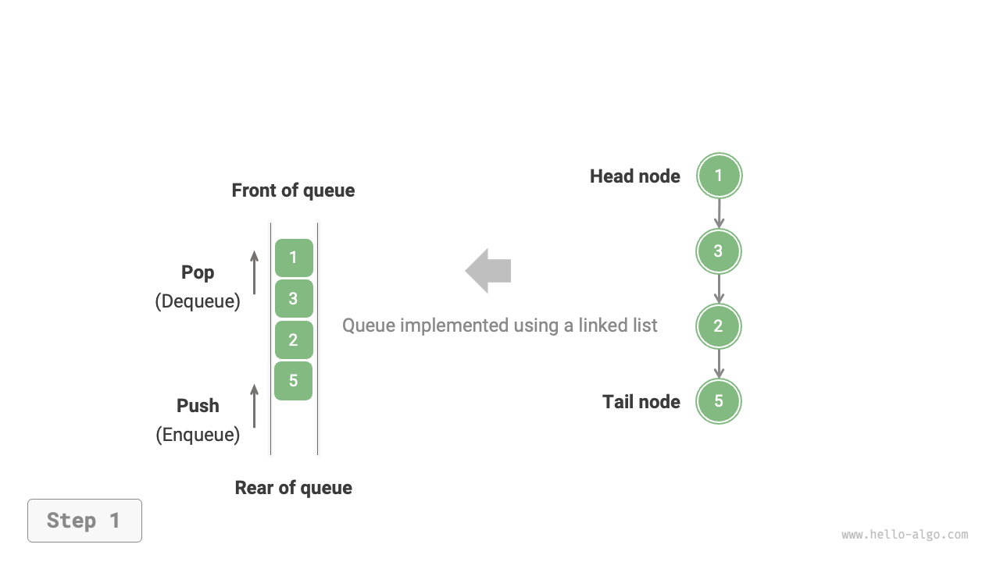
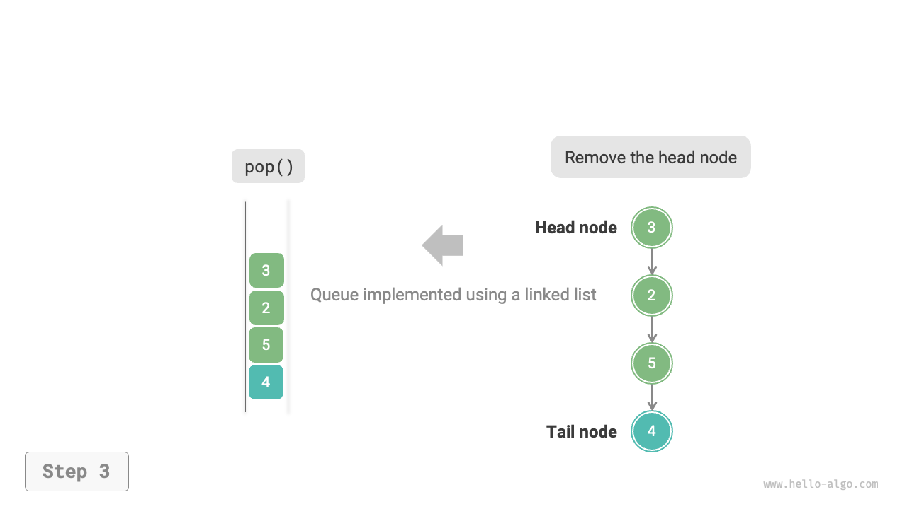
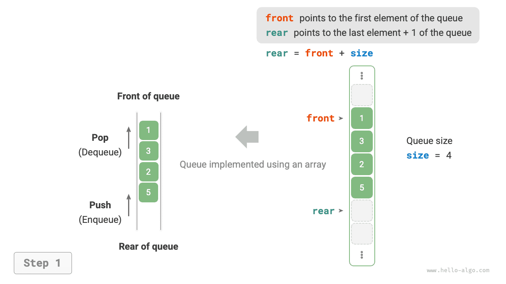
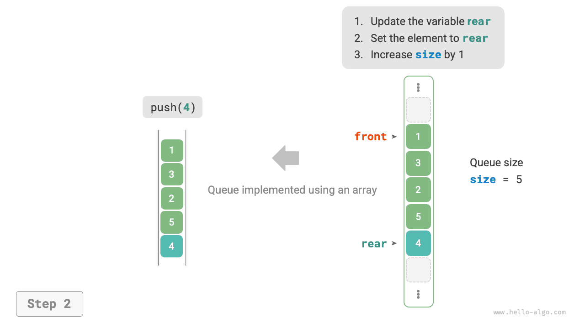
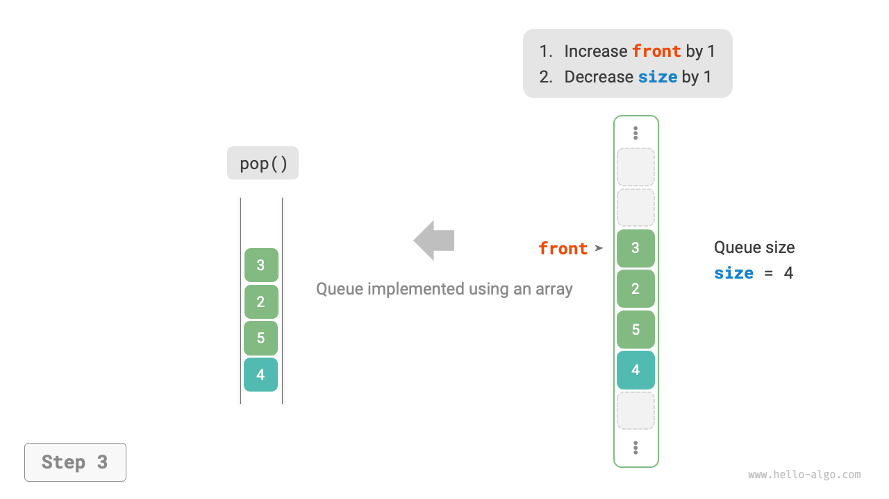

# Queue

"Queue" is a linear data structure that follows the First-In-First-Out (FIFO) rule. As the name suggests, a queue simulates the phenomenon of lining up, where newcomers join the queue at the rear, and the person at the front leaves the queue first.

As shown in the figure below, we call the front of the queue the "head" and the back the "tail." The operation of adding elements to the rear of the queue is termed "enqueue," and the operation of removing elements from the front is termed "dequeue."


## Common operations on queue

The common operations on a queue are shown in the table below. Note that method names may vary across different programming languages. Here, we use the same naming convention as that used for stacks.

<p align="center"> Table <id> &nbsp; Efficiency of queue operations </p>

| Method Name | Description                            | Time Complexity |
| ----------- | -------------------------------------- | --------------- |
| `push()`    | Enqueue an element, add it to the tail | $O(1)$          |
| `pop()`     | Dequeue the head element               | $O(1)$          |
| `peek()`    | Access the head element                | $O(1)$          |

We can directly use the ready-made queue classes in programming languages:

=== "Python"

    ```python title="queue.py"
    from collections import deque

    # Initialize the queue
    # In Python, we generally use the deque class as a queue
    # Although queue.Queue() is a pure queue class, it's not very user-friendly, so it's not recommended
    que: deque[int] = deque()

    # Enqueue elements
    que.append(1)
    que.append(3)
    que.append(2)
    que.append(5)
    que.append(4)

    # Access the first element
    front: int = que[0]

    # Dequeue an element
    pop: int = que.popleft()

    # Get the length of the queue
    size: int = len(que)

    # Check if the queue is empty
    is_empty: bool = len(que) == 0
    ```

=== "C++"

    ```cpp title="queue.cpp"
    /* Initialize the queue */
    queue<int> queue;

    /* Enqueue elements */
    queue.push(1);
    queue.push(3);
    queue.push(2);
    queue.push(5);
    queue.push(4);

    /* Access the first element*/
    int front = queue.front();

    /* Dequeue an element */
    queue.pop();

    /* Get the length of the queue */
    int size = queue.size();

    /* Check if the queue is empty */
    bool empty = queue.empty();
    ```

=== "Java"

    ```java title="queue.java"
    /* Initialize the queue */
    Queue<Integer> queue = new LinkedList<>();

    /* Enqueue elements */
    queue.offer(1);
    queue.offer(3);
    queue.offer(2);
    queue.offer(5);
    queue.offer(4);

    /* Access the first element */
    int peek = queue.peek();

    /* Dequeue an element */
    int pop = queue.poll();

    /* Get the length of the queue */
    int size = queue.size();

    /* Check if the queue is empty */
    boolean isEmpty = queue.isEmpty();
    ```

=== "C#"

    ```csharp title="queue.cs"
    /* Initialize the queue */
    Queue<int> queue = new();

    /* Enqueue elements */
    queue.Enqueue(1);
    queue.Enqueue(3);
    queue.Enqueue(2);
    queue.Enqueue(5);
    queue.Enqueue(4);

    /* Access the first element */
    int peek = queue.Peek();

    /* Dequeue an element */
    int pop = queue.Dequeue();

    /* Get the length of the queue */
    int size = queue.Count;

    /* Check if the queue is empty */
    bool isEmpty = queue.Count == 0;
    ```

=== "Go"

    ```go title="queue_test.go"
    /* Initialize the queue */
    // In Go, use list as a queue
    queue := list.New()

    /* Enqueue elements */
    queue.PushBack(1)
    queue.PushBack(3)
    queue.PushBack(2)
    queue.PushBack(5)
    queue.PushBack(4)

    /* Access the first element */
    peek := queue.Front()

    /* Dequeue an element */
    pop := queue.Front()
    queue.Remove(pop)

    /* Get the length of the queue */
    size := queue.Len()

    /* Check if the queue is empty */
    isEmpty := queue.Len() == 0
    ```

=== "Swift"

    ```swift title="queue.swift"
    /* Initialize the queue */
    // Swift does not have a built-in queue class, so Array can be used as a queue
    var queue: [Int] = []

    /* Enqueue elements */
    queue.append(1)
    queue.append(3)
    queue.append(2)
    queue.append(5)
    queue.append(4)

    /* Access the first element */
    let peek = queue.first!

    /* Dequeue an element */
    // Since it's an array, removeFirst has a complexity of O(n)
    let pool = queue.removeFirst()

    /* Get the length of the queue */
    let size = queue.count

    /* Check if the queue is empty */
    let isEmpty = queue.isEmpty
    ```

=== "JS"

    ```javascript title="queue.js"
    /* Initialize the queue */
    // JavaScript does not have a built-in queue, so Array can be used as a queue
    const queue = [];

    /* Enqueue elements */
    queue.push(1);
    queue.push(3);
    queue.push(2);
    queue.push(5);
    queue.push(4);

    /* Access the first element */
    const peek = queue[0];

    /* Dequeue an element */
    // Since the underlying structure is an array, shift() method has a time complexity of O(n)
    const pop = queue.shift();

    /* Get the length of the queue */
    const size = queue.length;

    /* Check if the queue is empty */
    const empty = queue.length === 0;
    ```

=== "TS"

    ```typescript title="queue.ts"
    /* Initialize the queue */
    // TypeScript does not have a built-in queue, so Array can be used as a queue 
    const queue: number[] = [];

    /* Enqueue elements */
    queue.push(1);
    queue.push(3);
    queue.push(2);
    queue.push(5);
    queue.push(4);

    /* Access the first element */
    const peek = queue[0];

    /* Dequeue an element */
    // Since the underlying structure is an array, shift() method has a time complexity of O(n)
    const pop = queue.shift();

    /* Get the length of the queue */
    const size = queue.length;

    /* Check if the queue is empty */
    const empty = queue.length === 0;
    ```

=== "Dart"

    ```dart title="queue.dart"
    /* Initialize the queue */
    // In Dart, the Queue class is a double-ended queue but can be used as a queue
    Queue<int> queue = Queue();

    /* Enqueue elements */
    queue.add(1);
    queue.add(3);
    queue.add(2);
    queue.add(5);
    queue.add(4);

    /* Access the first element */
    int peek = queue.first;

    /* Dequeue an element */
    int pop = queue.removeFirst();

    /* Get the length of the queue */
    int size = queue.length;

    /* Check if the queue is empty */
    bool isEmpty = queue.isEmpty;
    ```

=== "Rust"

    ```rust title="queue.rs"
    /* Initialize the double-ended queue */
    // In Rust, use a double-ended queue as a regular queue
    let mut deque: VecDeque<u32> = VecDeque::new();

    /* Enqueue elements */
    deque.push_back(1);
    deque.push_back(3);
    deque.push_back(2);
    deque.push_back(5);
    deque.push_back(4);

    /* Access the first element */
    if let Some(front) = deque.front() {
    }

    /* Dequeue an element */
    if let Some(pop) = deque.pop_front() {
    }

    /* Get the length of the queue */
    let size = deque.len();

    /* Check if the queue is empty */
    let is_empty = deque.is_empty();
    ```

=== "C"

    ```c title="queue.c"
    // C does not provide a built-in queue
    ```

=== "Kotlin"

    ```kotlin title="queue.kt"

    ```

=== "Zig"

    ```zig title="queue.zig"

    ```

??? pythontutor "Code Visualization"

    https://pythontutor.com/render.html#code=from%20collections%20import%20deque%0A%0A%22%22%22Driver%20Code%22%22%22%0Aif%20__name__%20%3D%3D%20%22__main__%22%3A%0A%20%20%20%20%23%20%E5%88%9D%E5%A7%8B%E5%8C%96%E9%98%9F%E5%88%97%0A%20%20%20%20%23%20%E5%9C%A8%20Python%20%E4%B8%AD%EF%BC%8C%E6%88%91%E4%BB%AC%E4%B8%80%E8%88%AC%E5%B0%86%E5%8F%8C%E5%90%91%E9%98%9F%E5%88%97%E7%B1%BB%20deque%20%E7%9C%8B%E4%BD%9C%E9%98%9F%E5%88%97%E4%BD%BF%E7%94%A8%0A%20%20%20%20%23%20%E8%99%BD%E7%84%B6%20queue.Queue%28%29%20%E6%98%AF%E7%BA%AF%E6%AD%A3%E7%9A%84%E9%98%9F%E5%88%97%E7%B1%BB%EF%BC%8C%E4%BD%86%E4%B8%8D%E5%A4%AA%E5%A5%BD%E7%94%A8%0A%20%20%20%20que%20%3D%20deque%28%29%0A%0A%20%20%20%20%23%20%E5%85%83%E7%B4%A0%E5%85%A5%E9%98%9F%0A%20%20%20%20que.append%281%29%0A%20%20%20%20que.append%283%29%0A%20%20%20%20que.append%282%29%0A%20%20%20%20que.append%285%29%0A%20%20%20%20que.append%284%29%0A%20%20%20%20print%28%22%E9%98%9F%E5%88%97%20que%20%3D%22,%20que%29%0A%0A%20%20%20%20%23%20%E8%AE%BF%E9%97%AE%E9%98%9F%E9%A6%96%E5%85%83%E7%B4%A0%0A%20%20%20%20front%20%3D%20que%5B0%5D%0A%20%20%20%20print%28%22%E9%98%9F%E9%A6%96%E5%85%83%E7%B4%A0%20front%20%3D%22,%20front%29%0A%0A%20%20%20%20%23%20%E5%85%83%E7%B4%A0%E5%87%BA%E9%98%9F%0A%20%20%20%20pop%20%3D%20que.popleft%28%29%0A%20%20%20%20print%28%22%E5%87%BA%E9%98%9F%E5%85%83%E7%B4%A0%20pop%20%3D%22,%20pop%29%0A%20%20%20%20print%28%22%E5%87%BA%E9%98%9F%E5%90%8E%20que%20%3D%22,%20que%29%0A%0A%20%20%20%20%23%20%E8%8E%B7%E5%8F%96%E9%98%9F%E5%88%97%E7%9A%84%E9%95%BF%E5%BA%A6%0A%20%20%20%20size%20%3D%20len%28que%29%0A%20%20%20%20print%28%22%E9%98%9F%E5%88%97%E9%95%BF%E5%BA%A6%20size%20%3D%22,%20size%29%0A%0A%20%20%20%20%23%20%E5%88%A4%E6%96%AD%E9%98%9F%E5%88%97%E6%98%AF%E5%90%A6%E4%B8%BA%E7%A9%BA%0A%20%20%20%20is_empty%20%3D%20len%28que%29%20%3D%3D%200%0A%20%20%20%20print%28%22%E9%98%9F%E5%88%97%E6%98%AF%E5%90%A6%E4%B8%BA%E7%A9%BA%20%3D%22,%20is_empty%29&cumulative=false&curInstr=3&heapPrimitives=nevernest&mode=display&origin=opt-frontend.js&py=311&rawInputLstJSON=%5B%5D&textReferences=false

## Implementing a queue

To implement a queue, we need a data structure that allows adding elements at one end and removing them at the other. Both linked lists and arrays meet this requirement.

### Implementation based on a linked list

As shown in the figure below, we can consider the "head node" and "tail node" of a linked list as the "front" and "rear" of the queue, respectively. It is stipulated that nodes can only be added at the rear and removed at the front.

=== "LinkedListQueue"
    

=== "push()"
    

=== "pop()"
    

Below is the code for implementing a queue using a linked list:

```src
[file]{linkedlist_queue}-[class]{linked_list_queue}-[func]{}
```

### Implementation based on an array

Deleting the first element in an array has a time complexity of $O(n)$, which would make the dequeue operation inefficient. However, this problem can be cleverly avoided as follows.

We use a variable `front` to indicate the index of the front element and maintain a variable `size` to record the queue's length. Define `rear = front + size`, which points to the position immediately following the tail element.

With this design, **the effective interval of elements in the array is `[front, rear - 1]`**. The implementation methods for various operations are shown in the figure below.

- Enqueue operation: Assign the input element to the `rear` index and increase `size` by 1.
- Dequeue operation: Simply increase `front` by 1 and decrease `size` by 1.

Both enqueue and dequeue operations only require a single operation, each with a time complexity of $O(1)$.

=== "ArrayQueue"
    

=== "push()"
    

=== "pop()"
    

You might notice a problem: as enqueue and dequeue operations are continuously performed, both `front` and `rear` move to the right and **will eventually reach the end of the array and can't move further**. To resolve this, we can treat the array as a "circular array" where connecting the end of the array back to its beginning.

In a circular array, `front` or `rear` needs to loop back to the start of the array upon reaching the end. This cyclical pattern can be achieved with a "modulo operation" as shown in the code below:

```src
[file]{array_queue}-[class]{array_queue}-[func]{}
```

The above implementation of the queue still has its limitations: its length is fixed. However, this issue is not difficult to resolve. We can replace the array with a dynamic array that can expand itself if needed. Interested readers can try to implement this themselves.

The comparison of the two implementations is consistent with that of the stack and is not repeated here.

## Typical applications of queue

- **Amazon orders**: After shoppers place orders, these orders join a queue, and the system processes them in order. During events like Singles' Day, a massive number of orders are generated in a short time, making high concurrency a key challenge for engineers.
- **Various to-do lists**: Any scenario requiring a "first-come, first-served" functionality, such as a printer's task queue or a restaurant's food delivery queue, can effectively maintain the order of processing with a queue.
