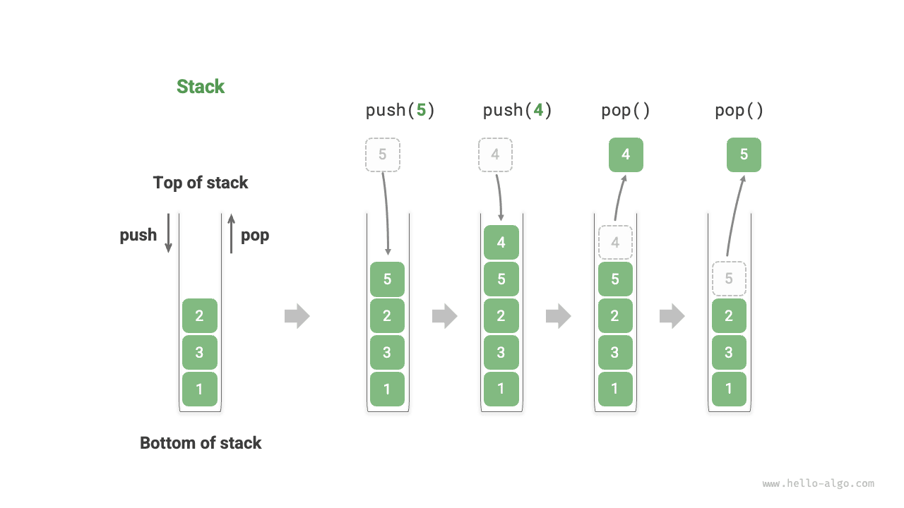
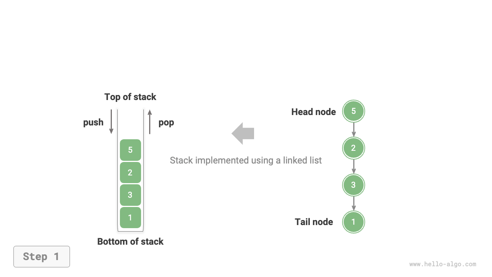
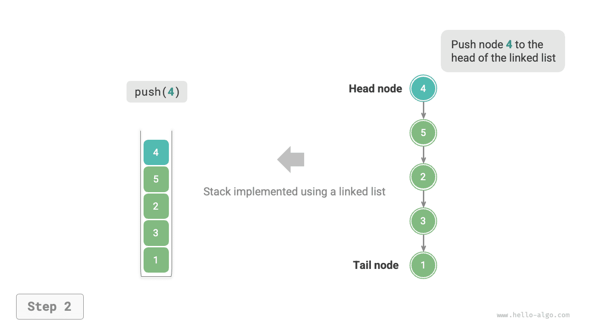
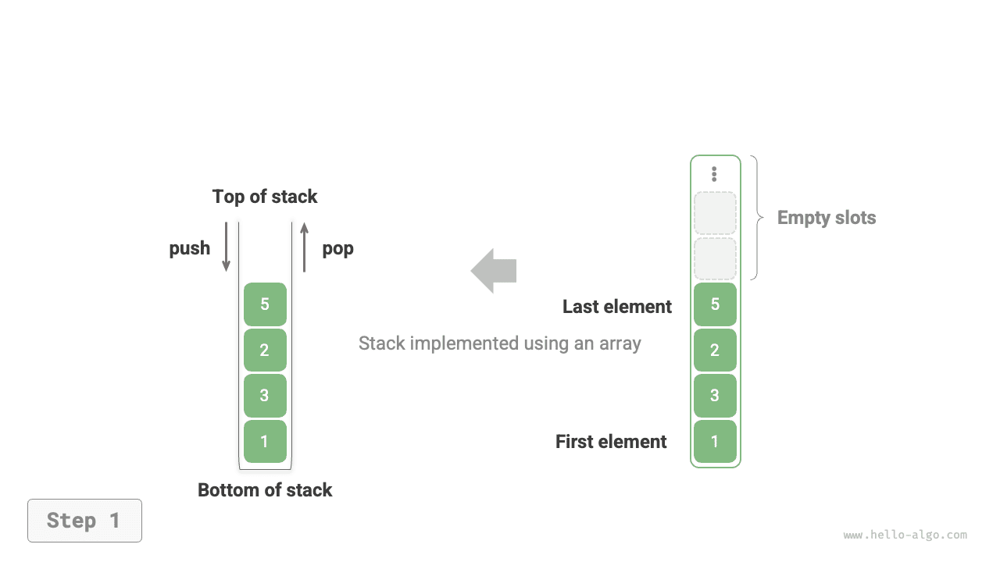
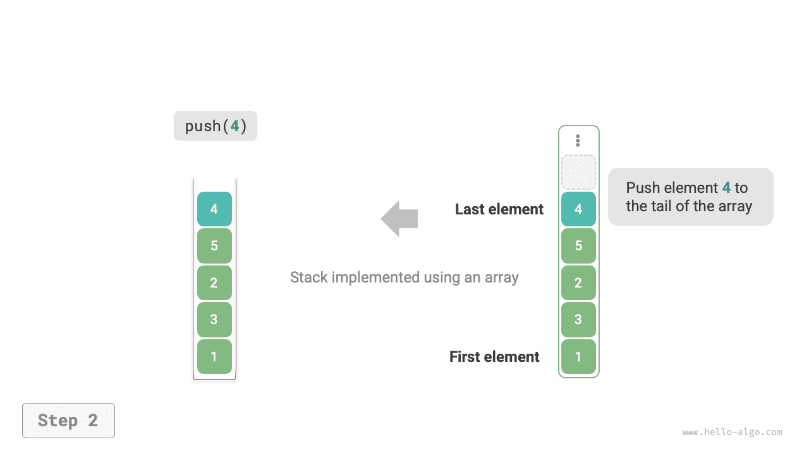
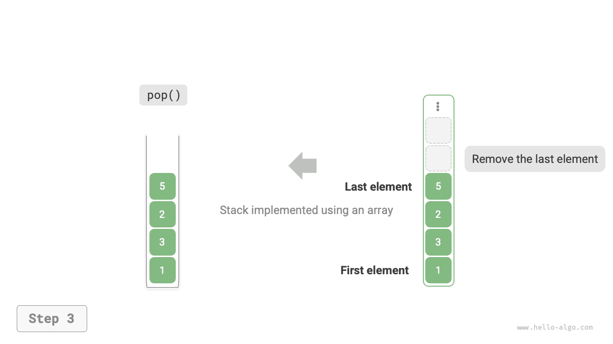

# Stack

A <u>stack</u> is a linear data structure that follows the Last In First Out (LIFO) logic.

We can compare a stack to a pile of plates on a table. If we specify that only one plate can be moved at a time, then to get the bottom plate, we must first remove the plates above it one by one. If we replace the plates with various types of elements (such as integers, characters, objects, etc.), we get the stack data structure.

As shown in the figure below, we call the top of the stacked elements the "top" and the bottom the "base." The operation of adding an element to the top is called "push," and the operation of removing the top element is called "pop."



## Common Stack Operations

The common operations on a stack are shown in the table below. The specific method names depend on the programming language used. Here, we use the common naming convention of `push()`, `pop()`, and `peek()`.

<p align="center"> Table <id> &nbsp; Efficiency of Stack Operations </p>

| Method   | Description                                    | Time Complexity |
| -------- | ---------------------------------------------- | --------------- |
| `push()` | Push element onto stack (add to top)          | $O(1)$          |
| `pop()`  | Pop top element from stack                     | $O(1)$          |
| `peek()` | Access top element                             | $O(1)$          |

Typically, we can directly use the built-in stack class provided by the programming language. However, some languages may not provide a dedicated stack class. In these cases, we can use the language's "array" or "linked list" as a stack and ignore operations unrelated to the stack in the program logic.

=== "Python"

    ```python title="stack.py"
    # Initialize stack
    # Python does not have a built-in stack class, can use list as a stack
    stack: list[int] = []

    # Push elements
    stack.append(1)
    stack.append(3)
    stack.append(2)
    stack.append(5)
    stack.append(4)

    # Access top element
    peek: int = stack[-1]

    # Pop element
    pop: int = stack.pop()

    # Get stack length
    size: int = len(stack)

    # Check if empty
    is_empty: bool = len(stack) == 0
    ```

=== "C++"

    ```cpp title="stack.cpp"
    /* Initialize stack */
    stack<int> stack;

    /* Push elements */
    stack.push(1);
    stack.push(3);
    stack.push(2);
    stack.push(5);
    stack.push(4);

    /* Access top element */
    int top = stack.top();

    /* Pop element */
    stack.pop(); // No return value

    /* Get stack length */
    int size = stack.size();

    /* Check if empty */
    bool empty = stack.empty();
    ```

=== "Java"

    ```java title="stack.java"
    /* Initialize stack */
    Stack<Integer> stack = new Stack<>();

    /* Push elements */
    stack.push(1);
    stack.push(3);
    stack.push(2);
    stack.push(5);
    stack.push(4);

    /* Access top element */
    int peek = stack.peek();

    /* Pop element */
    int pop = stack.pop();

    /* Get stack length */
    int size = stack.size();

    /* Check if empty */
    boolean isEmpty = stack.isEmpty();
    ```

=== "C#"

    ```csharp title="stack.cs"
    /* Initialize stack */
    Stack<int> stack = new();

    /* Push elements */
    stack.Push(1);
    stack.Push(3);
    stack.Push(2);
    stack.Push(5);
    stack.Push(4);

    /* Access top element */
    int peek = stack.Peek();

    /* Pop element */
    int pop = stack.Pop();

    /* Get stack length */
    int size = stack.Count;

    /* Check if empty */
    bool isEmpty = stack.Count == 0;
    ```

=== "Go"

    ```go title="stack_test.go"
    /* Initialize stack */
    // In Go, it is recommended to use Slice as a stack
    var stack []int

    /* Push elements */
    stack = append(stack, 1)
    stack = append(stack, 3)
    stack = append(stack, 2)
    stack = append(stack, 5)
    stack = append(stack, 4)

    /* Access top element */
    peek := stack[len(stack)-1]

    /* Pop element */
    pop := stack[len(stack)-1]
    stack = stack[:len(stack)-1]

    /* Get stack length */
    size := len(stack)

    /* Check if empty */
    isEmpty := len(stack) == 0
    ```

=== "Swift"

    ```swift title="stack.swift"
    /* Initialize stack */
    // Swift does not have a built-in stack class, can use Array as a stack
    var stack: [Int] = []

    /* Push elements */
    stack.append(1)
    stack.append(3)
    stack.append(2)
    stack.append(5)
    stack.append(4)

    /* Access top element */
    let peek = stack.last!

    /* Pop element */
    let pop = stack.removeLast()

    /* Get stack length */
    let size = stack.count

    /* Check if empty */
    let isEmpty = stack.isEmpty
    ```

=== "JS"

    ```javascript title="stack.js"
    /* Initialize stack */
    // JavaScript does not have a built-in stack class, can use Array as a stack
    const stack = [];

    /* Push elements */
    stack.push(1);
    stack.push(3);
    stack.push(2);
    stack.push(5);
    stack.push(4);

    /* Access top element */
    const peek = stack[stack.length-1];

    /* Pop element */
    const pop = stack.pop();

    /* Get stack length */
    const size = stack.length;

    /* Check if empty */
    const is_empty = stack.length === 0;
    ```

=== "TS"

    ```typescript title="stack.ts"
    /* Initialize stack */
    // TypeScript does not have a built-in stack class, can use Array as a stack
    const stack: number[] = [];

    /* Push elements */
    stack.push(1);
    stack.push(3);
    stack.push(2);
    stack.push(5);
    stack.push(4);

    /* Access top element */
    const peek = stack[stack.length - 1];

    /* Pop element */
    const pop = stack.pop();

    /* Get stack length */
    const size = stack.length;

    /* Check if empty */
    const is_empty = stack.length === 0;
    ```

=== "Dart"

    ```dart title="stack.dart"
    /* Initialize stack */
    // Dart does not have a built-in stack class, can use List as a stack
    List<int> stack = [];

    /* Push elements */
    stack.add(1);
    stack.add(3);
    stack.add(2);
    stack.add(5);
    stack.add(4);

    /* Access top element */
    int peek = stack.last;

    /* Pop element */
    int pop = stack.removeLast();

    /* Get stack length */
    int size = stack.length;

    /* Check if empty */
    bool isEmpty = stack.isEmpty;
    ```

=== "Rust"

    ```rust title="stack.rs"
    /* Initialize stack */
    // Use Vec as a stack
    let mut stack: Vec<i32> = Vec::new();

    /* Push elements */
    stack.push(1);
    stack.push(3);
    stack.push(2);
    stack.push(5);
    stack.push(4);

    /* Access top element */
    let top = stack.last().unwrap();

    /* Pop element */
    let pop = stack.pop().unwrap();

    /* Get stack length */
    let size = stack.len();

    /* Check if empty */
    let is_empty = stack.is_empty();
    ```

=== "C"

    ```c title="stack.c"
    // C does not provide a built-in stack
    ```

=== "Kotlin"

    ```kotlin title="stack.kt"
    /* Initialize stack */
    val stack = Stack<Int>()

    /* Push elements */
    stack.push(1)
    stack.push(3)
    stack.push(2)
    stack.push(5)
    stack.push(4)

    /* Access top element */
    val peek = stack.peek()

    /* Pop element */
    val pop = stack.pop()

    /* Get stack length */
    val size = stack.size

    /* Check if empty */
    val isEmpty = stack.isEmpty()
    ```

=== "Ruby"

    ```ruby title="stack.rb"
    # Initialize stack
    # Ruby does not have a built-in stack class, can use Array as a stack
    stack = []

    # Push elements
    stack << 1
    stack << 3
    stack << 2
    stack << 5
    stack << 4

    # Access top element
    peek = stack.last

    # Pop element
    pop = stack.pop

    # Get stack length
    size = stack.length

    # Check if empty
    is_empty = stack.empty?
    ```

??? pythontutor "Code Visualization"

    https://pythontutor.com/render.html#code=%22%22%22Driver%20Code%22%22%22%0Aif%20__name__%20%3D%3D%20%22__main__%22%3A%0A%20%20%20%20%23%20%E5%88%9D%E5%A7%8B%E5%8C%96%E6%A0%88%0A%20%20%20%20%23%20Python%20%E6%B2%A1%E6%9C%89%E5%86%85%E7%BD%AE%E7%9A%84%E6%A0%88%E7%B1%BB%EF%BC%8C%E5%8F%AF%E4%BB%A5%E6%8A%8A%20list%20%E5%BD%93%E4%BD%9C%E6%A0%88%E6%9D%A5%E4%BD%BF%E7%94%A8%0A%20%20%20%20stack%20%3D%20%5B%5D%0A%0A%20%20%20%20%23%20%E5%85%83%E7%B4%A0%E5%85%A5%E6%A0%88%0A%20%20%20%20stack.append%281%29%0A%20%20%20%20stack.append%283%29%0A%20%20%20%20stack.append%282%29%0A%20%20%20%20stack.append%285%29%0A%20%20%20%20stack.append%284%29%0A%20%20%20%20print%28%22%E6%A0%88%20stack%20%3D%22,%20stack%29%0A%0A%20%20%20%20%23%20%E8%AE%BF%E9%97%AE%E6%A0%88%E9%A1%B6%E5%85%83%E7%B4%A0%0A%20%20%20%20peek%20%3D%20stack%5B-1%5D%0A%20%20%20%20print%28%22%E6%A0%88%E9%A1%B6%E5%85%83%E7%B4%A0%20peek%20%3D%22,%20peek%29%0A%0A%20%20%20%20%23%20%E5%85%83%E7%B4%A0%E5%87%BA%E6%A0%88%0A%20%20%20%20pop%20%3D%20stack.pop%28%29%0A%20%20%20%20print%28%22%E5%87%BA%E6%A0%88%E5%85%83%E7%B4%A0%20pop%20%3D%22,%20pop%29%0A%20%20%20%20print%28%22%E5%87%BA%E6%A0%88%E5%90%8E%20stack%20%3D%22,%20stack%29%0A%0A%20%20%20%20%23%20%E8%8E%B7%E5%8F%96%E6%A0%88%E7%9A%84%E9%95%BF%E5%BA%A6%0A%20%20%20%20size%20%3D%20len%28stack%29%0A%20%20%20%20print%28%22%E6%A0%88%E7%9A%84%E9%95%BF%E5%BA%A6%20size%20%3D%22,%20size%29%0A%0A%20%20%20%20%23%20%E5%88%A4%E6%96%AD%E6%98%AF%E5%90%A6%E4%B8%BA%E7%A9%BA%0A%20%20%20%20is_empty%20%3D%20len%28stack%29%20%3D%3D%200%0A%20%20%20%20print%28%22%E6%A0%88%E6%98%AF%E5%90%A6%E4%B8%BA%E7%A9%BA%20%3D%22,%20is_empty%29&cumulative=false&curInstr=2&heapPrimitives=nevernest&mode=display&origin=opt-frontend.js&py=311&rawInputLstJSON=%5B%5D&textReferences=false

## Stack Implementation

To gain a deeper understanding of how a stack operates, let's try implementing a stack class ourselves.

A stack follows the LIFO principle, so we can only add or remove elements at the top. However, both arrays and linked lists allow adding and removing elements at any position. **Therefore, a stack can be viewed as a restricted array or linked list**. In other words, we can "shield" some irrelevant operations of arrays or linked lists so that their external logic conforms to the characteristics of a stack.

### Linked List Implementation

When implementing a stack using a linked list, we can treat the head node of the linked list as the top of the stack and the tail node as the base.

As shown in the figure below, for the push operation, we simply insert an element at the head of the linked list. This node insertion method is called the "head insertion method." For the pop operation, we just need to remove the head node from the linked list.

=== "LinkedListStack"
    

=== "push()"
    

=== "pop()"
    

Below is sample code for implementing a stack based on a linked list:

```src
[file]{linkedlist_stack}-[class]{linked_list_stack}-[func]{}
```

### Array Implementation

When implementing a stack using an array, we can treat the end of the array as the top of the stack. As shown in the figure below, push and pop operations correspond to adding and removing elements at the end of the array, both with a time complexity of $O(1)$.

=== "ArrayStack"
    

=== "push()"
    

=== "pop()"
    

Since elements pushed onto the stack may increase continuously, we can use a dynamic array, which eliminates the need to handle array expansion ourselves. Here is the sample code:

```src
[file]{array_stack}-[class]{array_stack}-[func]{}
```

## Comparison of the Two Implementations

**Supported Operations**

Both implementations support all operations defined by the stack. The array implementation additionally supports random access, but this goes beyond the stack definition and is generally not used.

**Time Efficiency**

In the array-based implementation, both push and pop operations occur in pre-allocated contiguous memory, which has good cache locality and is therefore more efficient. However, if pushing exceeds the array capacity, it triggers an expansion mechanism, causing the time complexity of that particular push operation to become $O(n)$.

In the linked list-based implementation, list expansion is very flexible, and there is no issue of reduced efficiency due to array expansion. However, the push operation requires initializing a node object and modifying pointers, so it is relatively less efficient. Nevertheless, if the pushed elements are already node objects, the initialization step can be omitted, thereby improving efficiency.

In summary, when the elements pushed and popped are basic data types such as `int` or `double`, we can draw the following conclusions:

- The array-based stack implementation has reduced efficiency when expansion is triggered, but since expansion is an infrequent operation, the average efficiency is higher.
- The linked list-based stack implementation can provide more stable efficiency performance.

**Space Efficiency**

When initializing a list, the system allocates an "initial capacity" that may exceed the actual need. Additionally, the expansion mechanism typically expands at a specific ratio (e.g., 2x), and the capacity after expansion may also exceed actual needs. Therefore, **the array-based stack implementation may cause some space wastage**.

However, since linked list nodes need to store additional pointers, **the space occupied by linked list nodes is relatively large**.

In summary, we cannot simply determine which implementation is more memory-efficient and need to analyze the specific situation.

## Typical Applications of Stack

- **Back and forward in browsers, undo and redo in software**. Every time we open a new webpage, the browser pushes the previous page onto the stack, allowing us to return to the previous page via the back operation. The back operation is essentially performing a pop. To support both back and forward, two stacks are needed to work together.
- **Program memory management**. Each time a function is called, the system adds a stack frame to the top of the stack to record the function's context information. During recursion, the downward recursive phase continuously performs push operations, while the upward backtracking phase continuously performs pop operations.
