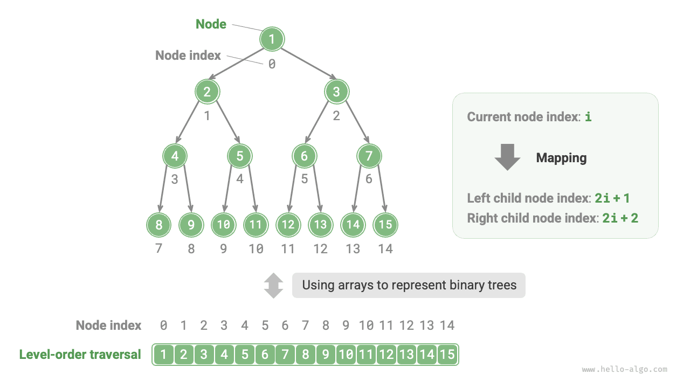
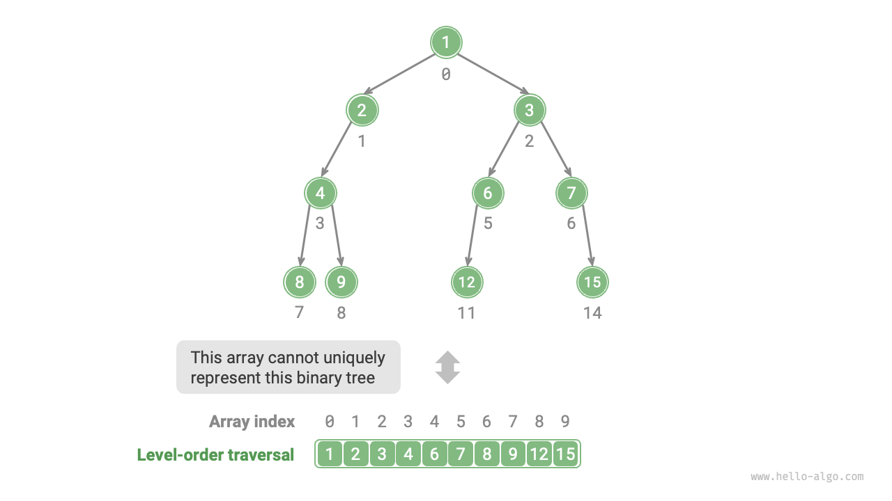

# Array representation of binary trees

Under the linked list representation, the storage unit of a binary tree is a node `TreeNode`, with nodes connected by pointers. The basic operations of binary trees under the linked list representation were introduced in the previous section.

So, can we use an array to represent a binary tree? The answer is yes.

## Representing perfect binary trees

Let's analyze a simple case first. Given a perfect binary tree, we store all nodes in an array according to the order of level-order traversal, where each node corresponds to a unique array index.

Based on the characteristics of level-order traversal, we can deduce a "mapping formula" between the index of a parent node and its children: **If a node's index is $i$, then the index of its left child is $2i + 1$ and the right child is $2i + 2$**. The figure below shows the mapping relationship between the indices of various nodes.



**The mapping formula plays a role similar to the node references (pointers) in linked lists**. Given any node in the array, we can access its left (right) child node using the mapping formula.

## Representing any binary tree

Perfect binary trees are a special case; there are often many `None` values in the middle levels of a binary tree. Since the sequence of level-order traversal does not include these `None` values, we cannot solely rely on this sequence to deduce the number and distribution of `None` values. **This means that multiple binary tree structures can match the same level-order traversal sequence**.

As shown in the figure below, given a non-perfect binary tree, the above method of array representation fails.



To solve this problem, **we can consider explicitly writing out all `None` values in the level-order traversal sequence**. As shown in the figure below, after this treatment, the level-order traversal sequence can uniquely represent a binary tree. Example code is as follows:

=== "Python"

    ```python title=""
    # Array representation of a binary tree
    # Using None to represent empty slots
    tree = [1, 2, 3, 4, None, 6, 7, 8, 9, None, None, 12, None, None, 15]
    ```

=== "C++"

    ```cpp title=""
    /* Array representation of a binary tree */
    // Using the maximum integer value INT_MAX to mark empty slots
    vector<int> tree = {1, 2, 3, 4, INT_MAX, 6, 7, 8, 9, INT_MAX, INT_MAX, 12, INT_MAX, INT_MAX, 15};
    ```

=== "Java"

    ```java title=""
    /* Array representation of a binary tree */
    // Using the Integer wrapper class allows for using null to mark empty slots
    Integer[] tree = { 1, 2, 3, 4, null, 6, 7, 8, 9, null, null, 12, null, null, 15 };
    ```

=== "C#"

    ```csharp title=""
    /* Array representation of a binary tree */
    // Using nullable int (int?) allows for using null to mark empty slots
    int?[] tree = [1, 2, 3, 4, null, 6, 7, 8, 9, null, null, 12, null, null, 15];
    ```

=== "Go"

    ```go title=""
    /* Array representation of a binary tree */
    // Using an any type slice, allowing for nil to mark empty slots
    tree := []any{1, 2, 3, 4, nil, 6, 7, 8, 9, nil, nil, 12, nil, nil, 15}
    ```

=== "Swift"

    ```swift title=""
    /* Array representation of a binary tree */
    // Using optional Int (Int?) allows for using nil to mark empty slots
    let tree: [Int?] = [1, 2, 3, 4, nil, 6, 7, 8, 9, nil, nil, 12, nil, nil, 15]
    ```

=== "JS"

    ```javascript title=""
    /* Array representation of a binary tree */
    // Using null to represent empty slots
    let tree = [1, 2, 3, 4, null, 6, 7, 8, 9, null, null, 12, null, null, 15];
    ```

=== "TS"

    ```typescript title=""
    /* Array representation of a binary tree */
    // Using null to represent empty slots
    let tree: (number | null)[] = [1, 2, 3, 4, null, 6, 7, 8, 9, null, null, 12, null, null, 15];
    ```

=== "Dart"

    ```dart title=""
    /* Array representation of a binary tree */
    // Using nullable int (int?) allows for using null to mark empty slots
    List<int?> tree = [1, 2, 3, 4, null, 6, 7, 8, 9, null, null, 12, null, null, 15];
    ```

=== "Rust"

    ```rust title=""
    /* Array representation of a binary tree */
    // Using None to mark empty slots
    let tree = [Some(1), Some(2), Some(3), Some(4), None, Some(6), Some(7), Some(8), Some(9), None, None, Some(12), None, None, Some(15)];
    ```

=== "C"

    ```c title=""
    /* Array representation of a binary tree */
    // Using the maximum int value to mark empty slots, therefore, node values must not be INT_MAX
    int tree[] = {1, 2, 3, 4, INT_MAX, 6, 7, 8, 9, INT_MAX, INT_MAX, 12, INT_MAX, INT_MAX, 15};
    ```

=== "Kotlin"

    ```kotlin title=""
    /* Array representation of a binary tree */
    // Using null to represent empty slots
    val tree = mutableListOf( 1, 2, 3, 4, null, 6, 7, 8, 9, null, null, 12, null, null, 15 )
    ```

=== "Ruby"

    ```ruby title=""

    ```

=== "Zig"

    ```zig title=""

    ```


It's worth noting that **complete binary trees are very suitable for array representation**. Recalling the definition of a complete binary tree, `None` appears only at the bottom level and towards the right, **meaning all `None` values definitely appear at the end of the level-order traversal sequence**.

This means that when using an array to represent a complete binary tree, it's possible to omit storing all `None` values, which is very convenient. The figure below gives an example.


The following code implements a binary tree based on array representation, including the following operations:

- Given a node, obtain its value, left (right) child node, and parent node.
- Obtain the pre-order, in-order, post-order, and level-order traversal sequences.

```src
[file]{array_binary_tree}-[class]{array_binary_tree}-[func]{}
```

## Advantages and limitations

The array representation of binary trees has the following advantages:

- Arrays are stored in contiguous memory spaces, which is cache-friendly and allows for faster access and traversal.
- It does not require storing pointers, which saves space.
- It allows random access to nodes.

However, the array representation also has some limitations:

- Array storage requires contiguous memory space, so it is not suitable for storing trees with a large amount of data.
- Adding or deleting nodes requires array insertion and deletion operations, which are less efficient.
- When there are many `None` values in the binary tree, the proportion of node data contained in the array is low, leading to lower space utilization.
