# AVL tree *

In the "Binary Search Tree" section, we mentioned that after multiple insertions and removals, a binary search tree might degrade to a linked list. In such cases, the time complexity of all operations degrades from $O(\log n)$ to $O(n)$.

As shown in the figure below, after two node removal operations, this binary search tree will degrade into a linked list.

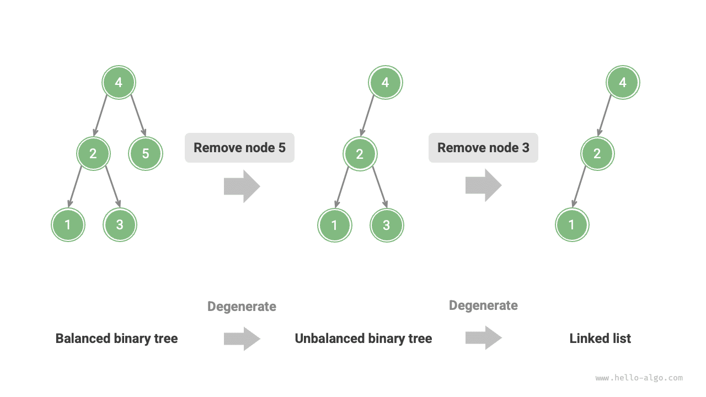

For example, in the perfect binary tree shown in the figure below, after inserting two nodes, the tree will lean heavily to the left, and the time complexity of search operations will also degrade.

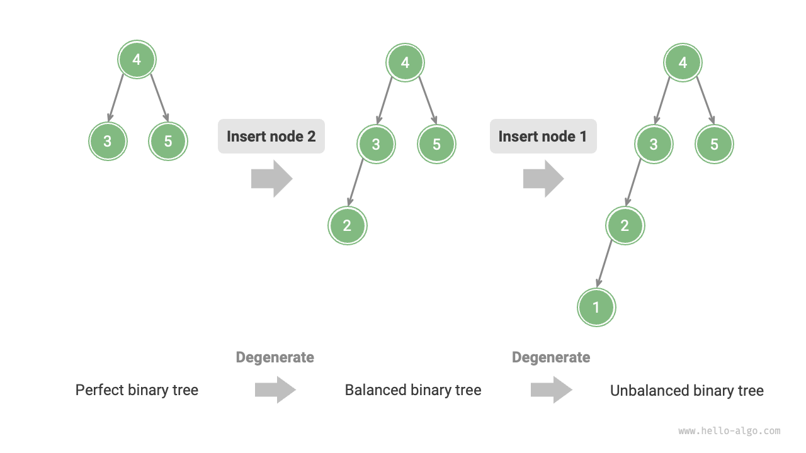

In 1962, G. M. Adelson-Velsky and E. M. Landis proposed the <u>AVL Tree</u> in their paper "An algorithm for the organization of information". The paper detailed a series of operations to ensure that after continuously adding and removing nodes, the AVL tree would not degrade, thus maintaining the time complexity of various operations at $O(\log n)$ level. In other words, in scenarios where frequent additions, removals, searches, and modifications are needed, the AVL tree can always maintain efficient data operation performance, which has great application value.

## Common terminology in AVL trees

An AVL tree is both a binary search tree and a balanced binary tree, satisfying all properties of these two types of binary trees, hence it is a <u>balanced binary search tree</u>.

### Node height

Since the operations related to AVL trees require obtaining node heights, we need to add a `height` variable to the node class:

=== "Python"

    ```python title=""
    class TreeNode:
        """AVL tree node"""
        def __init__(self, val: int):
            self.val: int = val                 # Node value
            self.height: int = 0                # Node height
            self.left: TreeNode | None = None   # Left child reference
            self.right: TreeNode | None = None  # Right child reference
    ```

=== "C++"

    ```cpp title=""
    /* AVL tree node */
    struct TreeNode {
        int val{};          // Node value
        int height = 0;     // Node height
        TreeNode *left{};   // Left child
        TreeNode *right{};  // Right child
        TreeNode() = default;
        explicit TreeNode(int x) : val(x){}
    };
    ```

=== "Java"

    ```java title=""
    /* AVL tree node */
    class TreeNode {
        public int val;        // Node value
        public int height;     // Node height
        public TreeNode left;  // Left child
        public TreeNode right; // Right child
        public TreeNode(int x) { val = x; }
    }
    ```

=== "C#"

    ```csharp title=""
    /* AVL tree node */
    class TreeNode(int? x) {
        public int? val = x;    // Node value
        public int height;      // Node height
        public TreeNode? left;  // Left child reference
        public TreeNode? right; // Right child reference
    }
    ```

=== "Go"

    ```go title=""
    /* AVL tree node */
    type TreeNode struct {
        Val    int       // Node value
        Height int       // Node height
        Left   *TreeNode // Left child reference
        Right  *TreeNode // Right child reference
    }
    ```

=== "Swift"

    ```swift title=""
    /* AVL tree node */
    class TreeNode {
        var val: Int // Node value
        var height: Int // Node height
        var left: TreeNode? // Left child
        var right: TreeNode? // Right child

        init(x: Int) {
            val = x
            height = 0
        }
    }
    ```

=== "JS"

    ```javascript title=""
    /* AVL tree node */
    class TreeNode {
        val; // Node value
        height; // Node height
        left; // Left child pointer
        right; // Right child pointer
        constructor(val, left, right, height) {
            this.val = val === undefined ? 0 : val;
            this.height = height === undefined ? 0 : height;
            this.left = left === undefined ? null : left;
            this.right = right === undefined ? null : right;
        }
    }
    ```

=== "TS"

    ```typescript title=""
    /* AVL tree node */
    class TreeNode {
        val: number;            // Node value
        height: number;         // Node height
        left: TreeNode | null;  // Left child pointer
        right: TreeNode | null; // Right child pointer
        constructor(val?: number, height?: number, left?: TreeNode | null, right?: TreeNode | null) {
            this.val = val === undefined ? 0 : val;
            this.height = height === undefined ? 0 : height; 
            this.left = left === undefined ? null : left; 
            this.right = right === undefined ? null : right; 
        }
    }
    ```

=== "Dart"

    ```dart title=""
    /* AVL tree node */
    class TreeNode {
      int val;         // Node value
      int height;      // Node height
      TreeNode? left;  // Left child
      TreeNode? right; // Right child
      TreeNode(this.val, [this.height = 0, this.left, this.right]);
    }
    ```

=== "Rust"

    ```rust title=""
    use std::rc::Rc;
    use std::cell::RefCell;

    /* AVL tree node */
    struct TreeNode {
        val: i32,                               // Node value
        height: i32,                            // Node height
        left: Option<Rc<RefCell<TreeNode>>>,    // Left child
        right: Option<Rc<RefCell<TreeNode>>>,   // Right child
    }

    impl TreeNode {
        /* Constructor */
        fn new(val: i32) -> Rc<RefCell<Self>> {
            Rc::new(RefCell::new(Self {
                val,
                height: 0,
                left: None,
                right: None
            }))
        }
    }
    ```

=== "C"

    ```c title=""
    /* AVL tree node */
    TreeNode struct TreeNode {
        int val;
        int height;
        struct TreeNode *left;
        struct TreeNode *right;
    } TreeNode;

    /* Constructor */
    TreeNode *newTreeNode(int val) {
        TreeNode *node;

        node = (TreeNode *)malloc(sizeof(TreeNode));
        node->val = val;
        node->height = 0;
        node->left = NULL;
        node->right = NULL;
        return node;
    }
    ```

=== "Kotlin"

    ```kotlin title=""
    /* AVL tree node */
    class TreeNode(val _val: Int) {  // Node value
        val height: Int = 0          // Node height
        val left: TreeNode? = null   // Left child
        val right: TreeNode? = null  // Right child
    }
    ```

=== "Ruby"

    ```ruby title=""

    ```

=== "Zig"

    ```zig title=""

    ```

The "node height" refers to the distance from that node to its farthest leaf node, i.e., the number of "edges" passed. It is important to note that the height of a leaf node is $0$, and the height of a null node is $-1$. We will create two utility functions for getting and updating the height of a node:

```src
[file]{avl_tree}-[class]{avl_tree}-[func]{update_height}
```

### Node balance factor

The <u>balance factor</u> of a node is defined as the height of the node's left subtree minus the height of its right subtree, with the balance factor of a null node defined as $0$. We will also encapsulate the functionality of obtaining the node balance factor into a function for easy use later on:

```src
[file]{avl_tree}-[class]{avl_tree}-[func]{balance_factor}
```

!!! tip

    Let the balance factor be $f$, then the balance factor of any node in an AVL tree satisfies $-1 \le f \le 1$.

## Rotations in AVL trees

The characteristic feature of an AVL tree is the "rotation" operation, which can restore balance to an unbalanced node without affecting the in-order traversal sequence of the binary tree. In other words, **the rotation operation can maintain the property of a "binary search tree" while also turning the tree back into a "balanced binary tree"**.

We call nodes with an absolute balance factor $> 1$ "unbalanced nodes". Depending on the type of imbalance, there are four kinds of rotations: right rotation, left rotation, right-left rotation, and left-right rotation. Below, we detail these rotation operations.

### Right rotation

As shown in the figure below, the first unbalanced node from the bottom up in the binary tree is "node 3". Focusing on the subtree with this unbalanced node as the root, denoted as `node`, and its left child as `child`, perform a "right rotation". After the right rotation, the subtree is balanced again while still maintaining the properties of a binary search tree.

=== "<1>"
    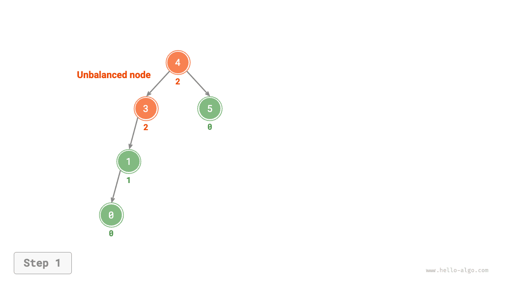

=== "<2>"
    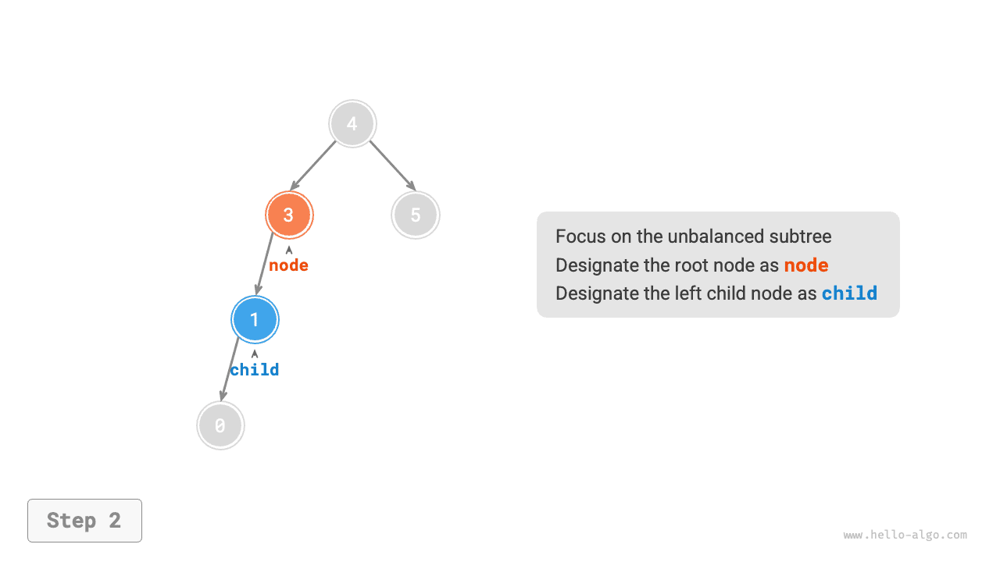

=== "<3>"
    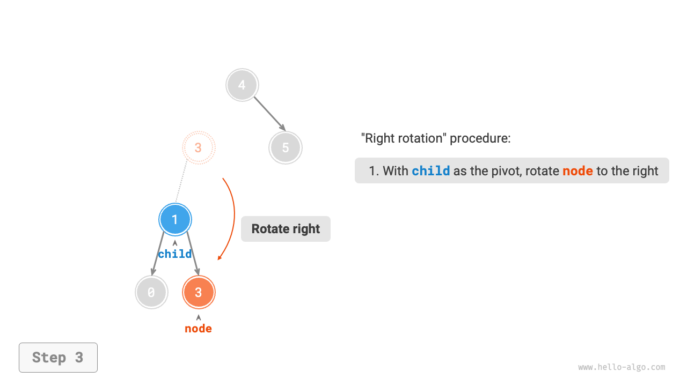

=== "<4>"
    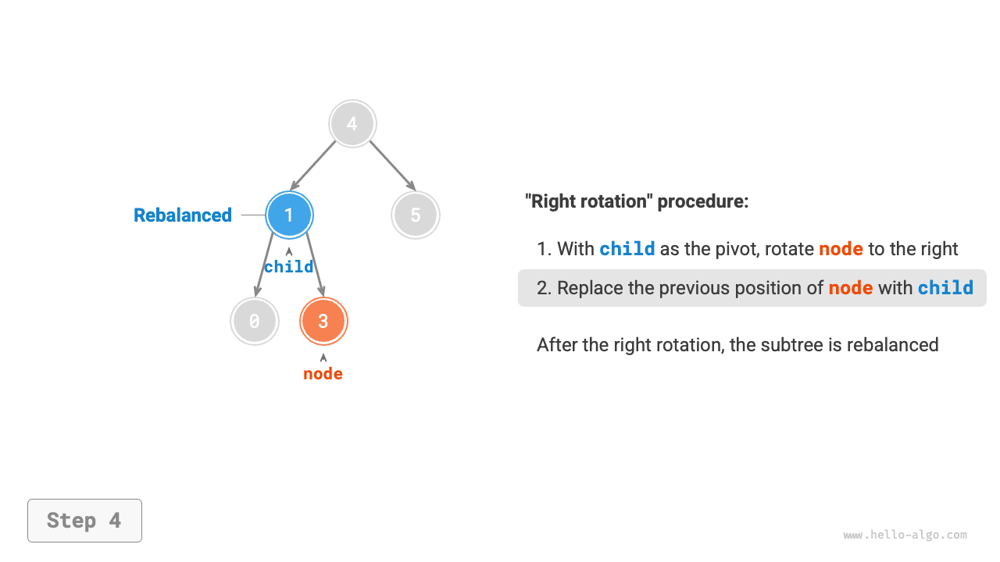

As shown in the figure below, when the `child` node has a right child (denoted as `grand_child`), a step needs to be added in the right rotation: set `grand_child` as the left child of `node`.

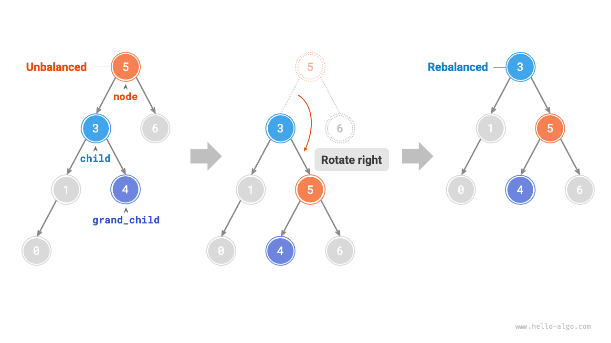

"Right rotation" is a figurative term; in practice, it is achieved by modifying node pointers, as shown in the following code:

```src
[file]{avl_tree}-[class]{avl_tree}-[func]{right_rotate}
```

### Left rotation

Correspondingly, if considering the "mirror" of the above unbalanced binary tree, the "left rotation" operation shown in the figure below needs to be performed.


Similarly, as shown in the figure below, when the `child` node has a left child (denoted as `grand_child`), a step needs to be added in the left rotation: set `grand_child` as the right child of `node`.

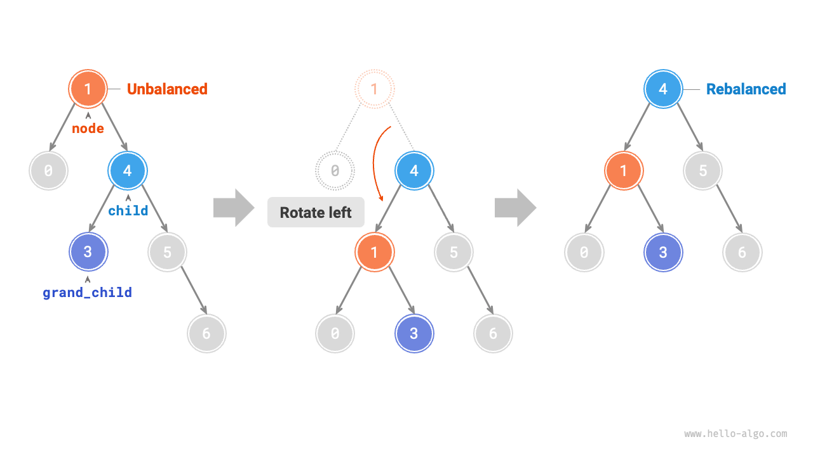

It can be observed that **the right and left rotation operations are logically symmetrical, and they solve two symmetrical types of imbalance**. Based on symmetry, by replacing all `left` with `right`, and all `right` with `left` in the implementation code of right rotation, we can get the implementation code for left rotation:

```src
[file]{avl_tree}-[class]{avl_tree}-[func]{left_rotate}
```

### Left-right rotation

For the unbalanced node 3 shown in the figure below, using either left or right rotation alone cannot restore balance to the subtree. In this case, a "left rotation" needs to be performed on `child` first, followed by a "right rotation" on `node`.

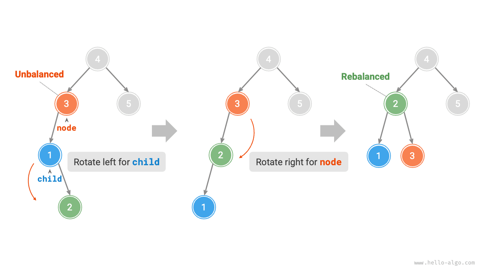

### Right-left rotation

As shown in the figure below, for the mirror case of the above unbalanced binary tree, a "right rotation" needs to be performed on `child` first, followed by a "left rotation" on `node`.

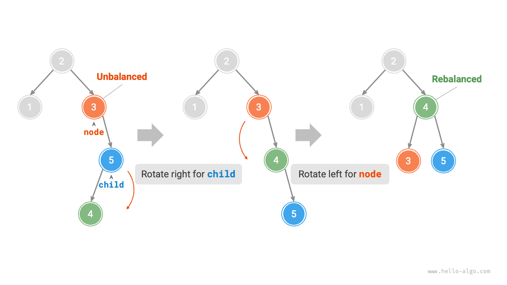

### Choice of rotation

The four kinds of imbalances shown in the figure below correspond to the cases described above, respectively requiring right rotation, left-right rotation, right-left rotation, and left rotation.

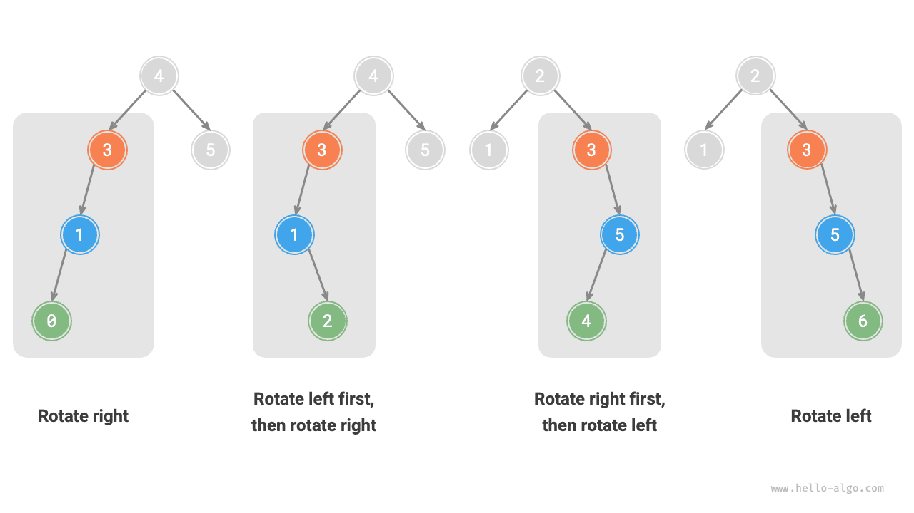

As shown in the table below, we determine which of the above cases an unbalanced node belongs to by judging the sign of the balance factor of the unbalanced node and its higher-side child's balance factor.

<p align="center"> Table <id> &nbsp; Conditions for Choosing Among the Four Rotation Cases </p>

| Balance factor of unbalanced node | Balance factor of child node | Rotation method to use            |
| --------------------------------- | ---------------------------- | --------------------------------- |
| $> 1$ (Left-leaning tree)         | $\geq 0$                     | Right rotation                    |
| $> 1$ (Left-leaning tree)         | $<0$                         | Left rotation then right rotation |
| $< -1$ (Right-leaning tree)       | $\leq 0$                     | Left rotation                     |
| $< -1$ (Right-leaning tree)       | $>0$                         | Right rotation then left rotation |

For convenience, we encapsulate the rotation operations into a function. **With this function, we can perform rotations on various kinds of imbalances, restoring balance to unbalanced nodes**. The code is as follows:

```src
[file]{avl_tree}-[class]{avl_tree}-[func]{rotate}
```

## Common operations in AVL trees

### Node insertion

The node insertion operation in AVL trees is similar to that in binary search trees. The only difference is that after inserting a node in an AVL tree, a series of unbalanced nodes may appear along the path from that node to the root node. Therefore, **we need to start from this node and perform rotation operations upwards to restore balance to all unbalanced nodes**. The code is as follows:

```src
[file]{avl_tree}-[class]{avl_tree}-[func]{insert_helper}
```

### Node removal

Similarly, based on the method of removing nodes in binary search trees, rotation operations need to be performed from the bottom up to restore balance to all unbalanced nodes. The code is as follows:

```src
[file]{avl_tree}-[class]{avl_tree}-[func]{remove_helper}
```

### Node search

The node search operation in AVL trees is consistent with that in binary search trees and will not be detailed here.

## Typical applications of AVL trees

- Organizing and storing large amounts of data, suitable for scenarios with high-frequency searches and low-frequency intertions and removals.
- Used to build index systems in databases.
- Red-black trees are also a common type of balanced binary search tree. Compared to AVL trees, red-black trees have more relaxed balancing conditions, require fewer rotations for node insertion and removal, and have a higher average efficiency for node addition and removal operations.
