# Binary search tree

As shown in the figure below, a "binary search tree" satisfies the following conditions.

1. For the root node, the value of all nodes in the left subtree < the value of the root node < the value of all nodes in the right subtree.
2. The left and right subtrees of any node are also binary search trees, i.e., they satisfy condition `1.` as well.

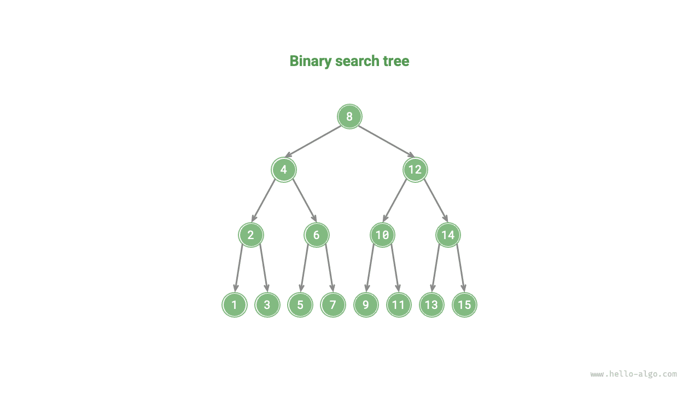

## Operations on a binary search tree

We encapsulate the binary search tree as a class `BinarySearchTree` and declare a member variable `root`, pointing to the tree's root node.

### Searching for a node

Given a target node value `num`, one can search according to the properties of the binary search tree. As shown in the figure below, we declare a node `cur` and start from the binary tree's root node `root`, looping to compare the size relationship between the node value `cur.val` and `num`.

- If `cur.val < num`, it means the target node is in `cur`'s right subtree, thus execute `cur = cur.right`.
- If `cur.val > num`, it means the target node is in `cur`'s left subtree, thus execute `cur = cur.left`.
- If `cur.val = num`, it means the target node is found, exit the loop and return the node.

=== "<1>"
    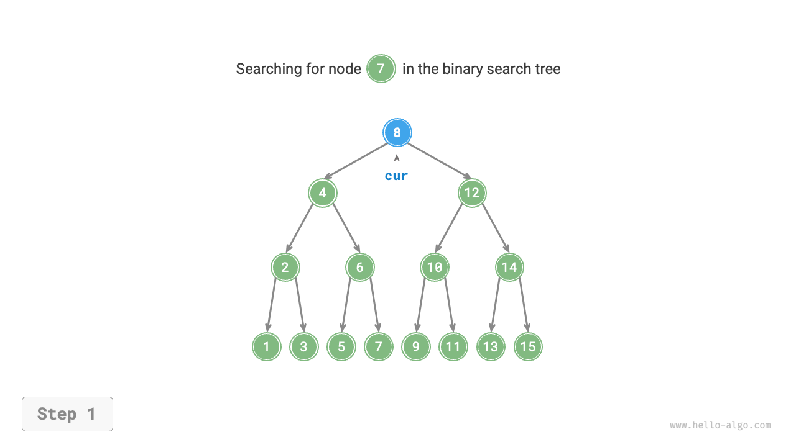

=== "<2>"
    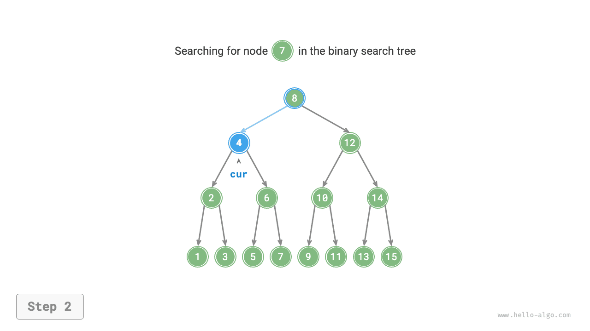

=== "<3>"
    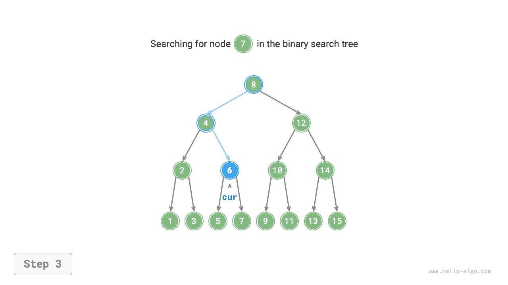

=== "<4>"
    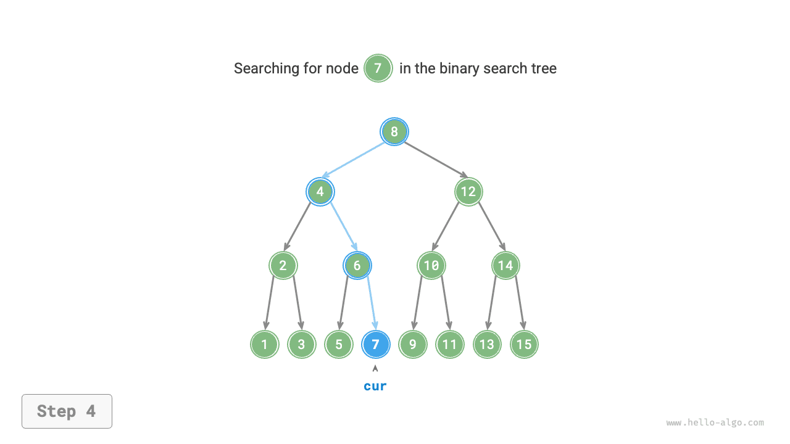

The search operation in a binary search tree works on the same principle as the binary search algorithm, eliminating half of the possibilities in each round. The number of loops is at most the height of the binary tree. When the binary tree is balanced, it uses $O(\log n)$ time. Example code is as follows:

```src
[file]{binary_search_tree}-[class]{binary_search_tree}-[func]{search}
```

### Inserting a node

Given an element `num` to be inserted, to maintain the property of the binary search tree "left subtree < root node < right subtree," the insertion operation proceeds as shown in the figure below.

1. **Finding the insertion position**: Similar to the search operation, start from the root node and loop downwards according to the size relationship between the current node value and `num` until passing through the leaf node (traversing to `None`) then exit the loop.
2. **Insert the node at that position**: Initialize the node `num` and place it where `None` was.

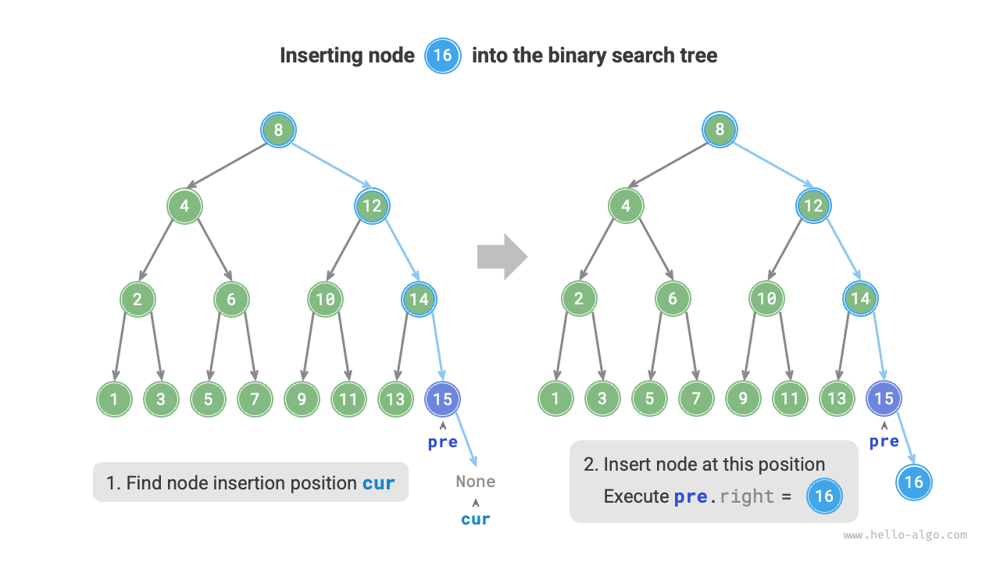

In the code implementation, note the following two points.

- The binary search tree does not allow duplicate nodes; otherwise, it will violate its definition. Therefore, if the node to be inserted already exists in the tree, the insertion is not performed, and it directly returns.
- To perform the insertion operation, we need to use the node `pre` to save the node from the last loop. This way, when traversing to `None`, we can get its parent node, thus completing the node insertion operation.

```src
[file]{binary_search_tree}-[class]{binary_search_tree}-[func]{insert}
```

Similar to searching for a node, inserting a node uses $O(\log n)$ time.

### Removing a node

First, find the target node in the binary tree, then remove it. Similar to inserting a node, we need to ensure that after the removal operation is completed, the property of the binary search tree "left subtree < root node < right subtree" is still satisfied. Therefore, based on the number of child nodes of the target node, we divide it into 0, 1, and 2 cases, performing the corresponding node removal operations.

As shown in the figure below, when the degree of the node to be removed is $0$, it means the node is a leaf node, and it can be directly removed.

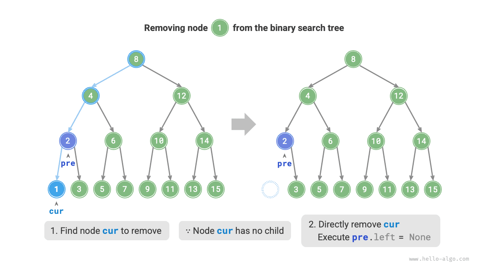

As shown in the figure below, when the degree of the node to be removed is $1$, replacing the node to be removed with its child node is sufficient.

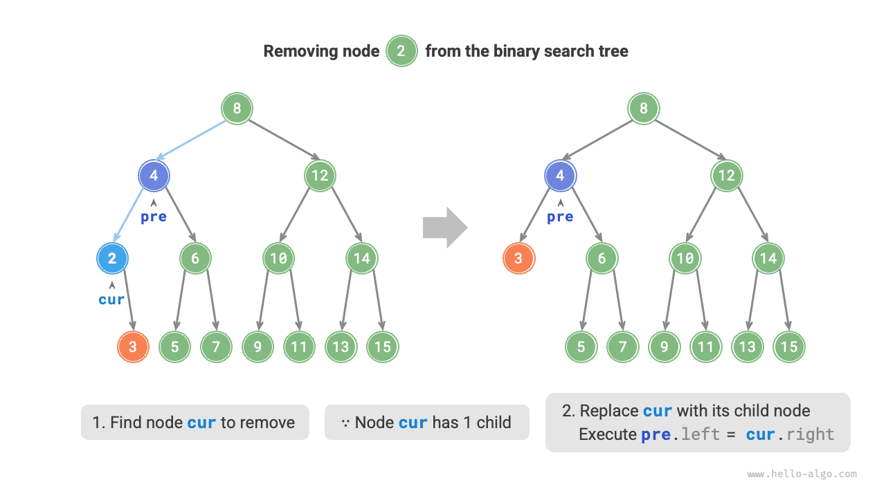

When the degree of the node to be removed is $2$, we cannot remove it directly, but need to use a node to replace it. To maintain the property of the binary search tree "left subtree < root node < right subtree," **this node can be either the smallest node of the right subtree or the largest node of the left subtree**.

Assuming we choose the smallest node of the right subtree (the next node in in-order traversal), then the removal operation proceeds as shown in the figure below.

1. Find the next node in the "in-order traversal sequence" of the node to be removed, denoted as `tmp`.
2. Replace the value of the node to be removed with `tmp`'s value, and recursively remove the node `tmp` in the tree.

=== "<1>"
    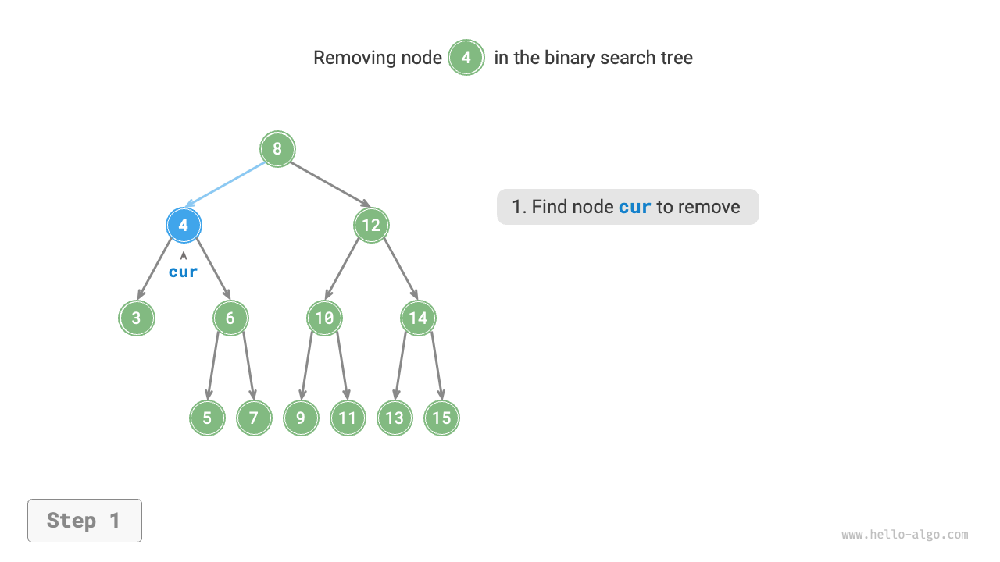

=== "<2>"
    

=== "<3>"
    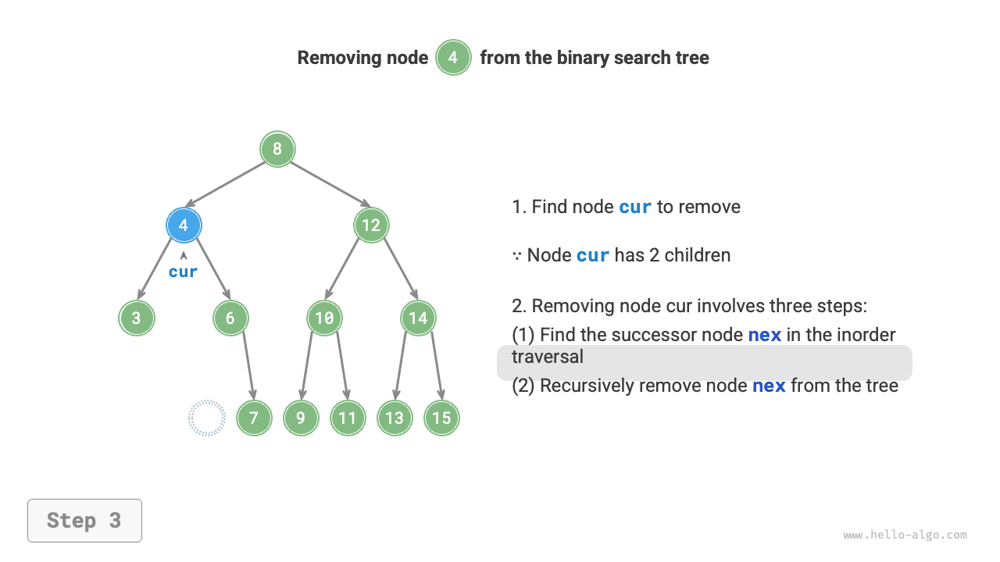

=== "<4>"
    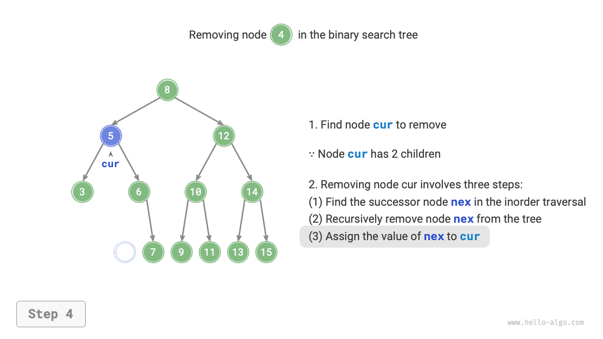

The operation of removing a node also uses $O(\log n)$ time, where finding the node to be removed requires $O(\log n)$ time, and obtaining the in-order traversal successor node requires $O(\log n)$ time. Example code is as follows:

```src
[file]{binary_search_tree}-[class]{binary_search_tree}-[func]{remove}
```

### In-order traversal is ordered

As shown in the figure below, the in-order traversal of a binary tree follows the "left $\rightarrow$ root $\rightarrow$ right" traversal order, and a binary search tree satisfies the size relationship "left child node < root node < right child node".

This means that in-order traversal in a binary search tree always traverses the next smallest node first, thus deriving an important property: **The in-order traversal sequence of a binary search tree is ascending**.

Using the ascending property of in-order traversal, obtaining ordered data in a binary search tree requires only $O(n)$ time, without the need for additional sorting operations, which is very efficient.


## Efficiency of binary search trees

Given a set of data, we consider using an array or a binary search tree for storage. Observing the table below, the operations on a binary search tree all have logarithmic time complexity, which is stable and efficient. Only in scenarios of high-frequency addition and low-frequency search and removal, arrays are more efficient than binary search trees.

<p align="center"> Table <id> &nbsp; Efficiency comparison between arrays and search trees </p>

|                | Unsorted array | Binary search tree |
| -------------- | -------------- | ------------------ |
| Search element | $O(n)$         | $O(\log n)$        |
| Insert element | $O(1)$         | $O(\log n)$        |
| Remove element | $O(n)$         | $O(\log n)$        |

In ideal conditions, the binary search tree is "balanced," thus any node can be found within $\log n$ loops.

However, continuously inserting and removing nodes in a binary search tree may lead to the binary tree degenerating into a chain list as shown in the figure below, at which point the time complexity of various operations also degrades to $O(n)$.

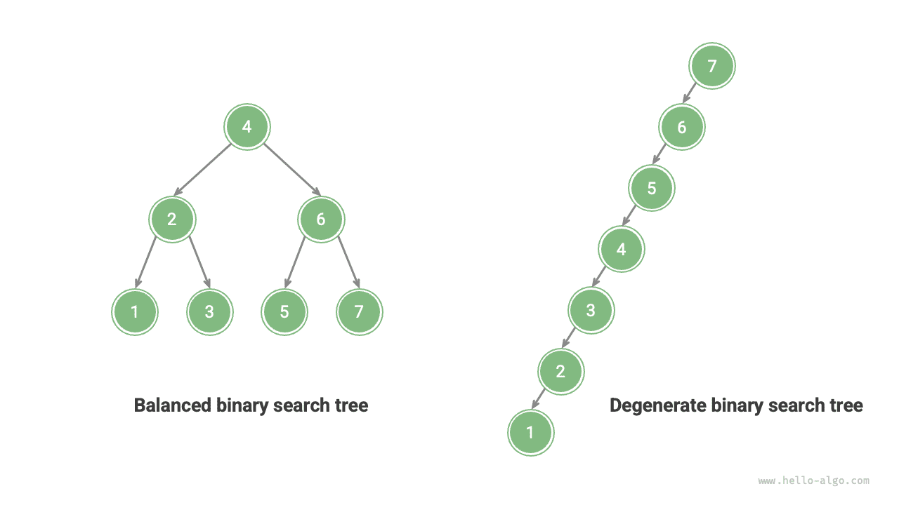

## Common applications of binary search trees

- Used as multi-level indexes in systems to implement efficient search, insertion, and removal operations.
- Serves as the underlying data structure for certain search algorithms.
- Used to store data streams to maintain their ordered state.
