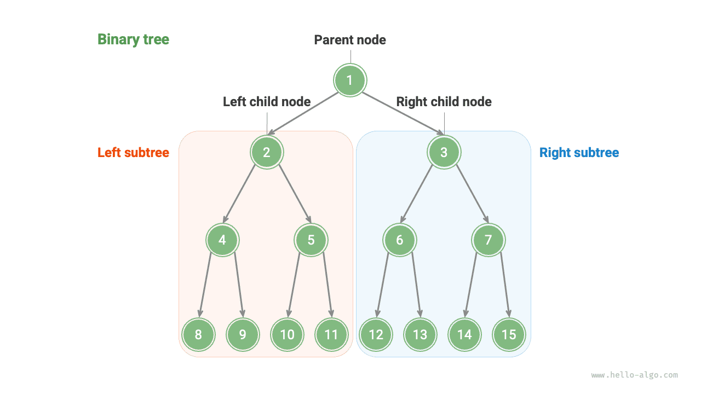
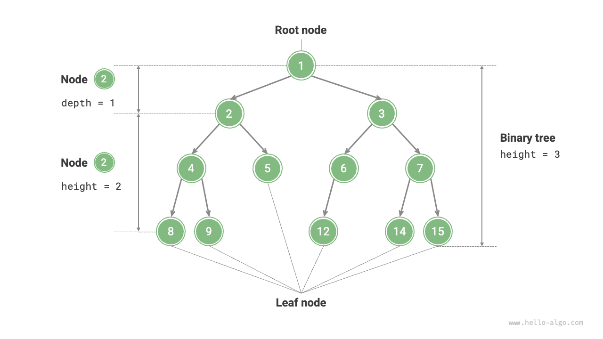
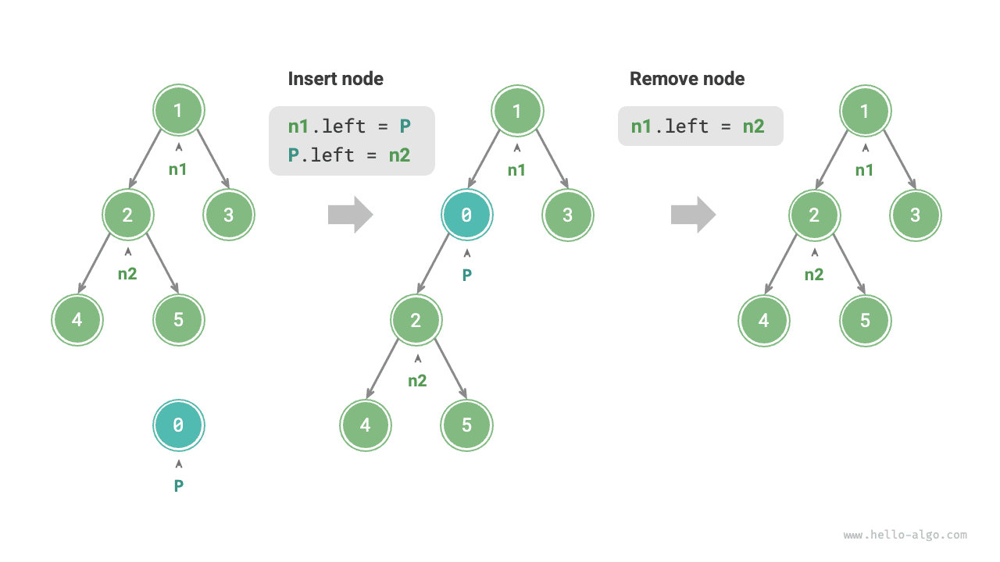
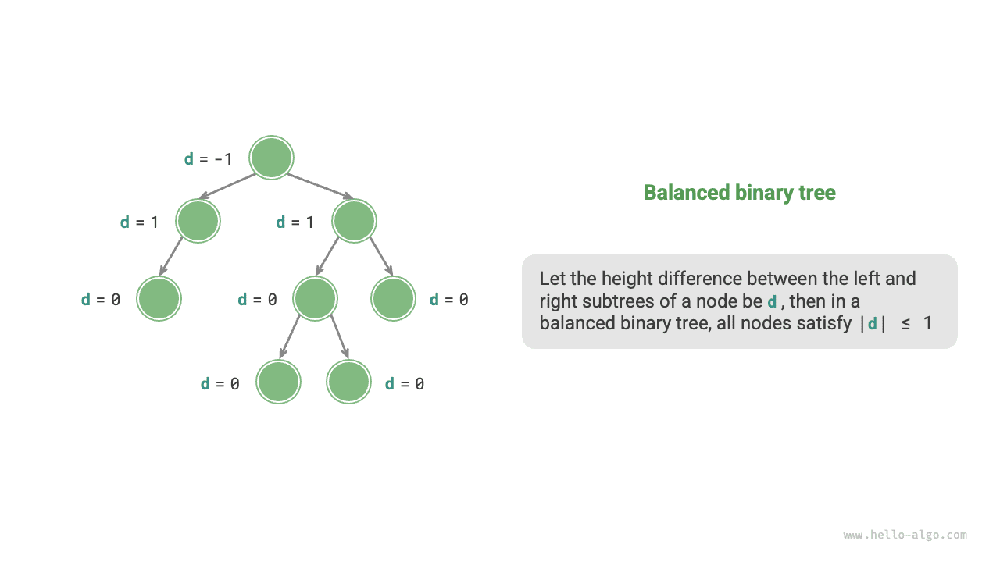
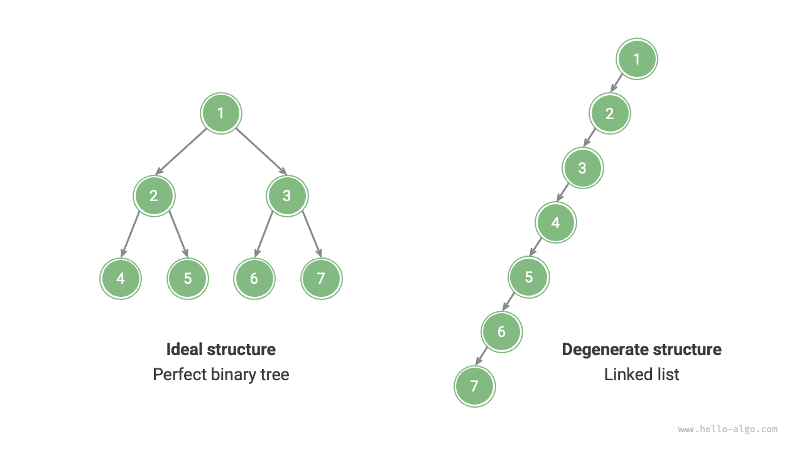

# Binary tree

A "binary tree" is a non-linear data structure that represents the ancestral and descendent relationships, embodying the "divide and conquer" logic. Similar to a linked list, the basic unit of a binary tree is a node, each containing a value, a reference to the left child node, and a reference to the right child node.

=== "Python"

    ```python title=""
    class TreeNode:
        """Binary tree node"""
        def __init__(self, val: int):
            self.val: int = val                # Node value
            self.left: TreeNode | None = None  # Reference to left child node
            self.right: TreeNode | None = None # Reference to right child node
    ```

=== "C++"

    ```cpp title=""
    /* Binary tree node */
    struct TreeNode {
        int val;          // Node value
        TreeNode *left;   // Pointer to left child node
        TreeNode *right;  // Pointer to right child node
        TreeNode(int x) : val(x), left(nullptr), right(nullptr) {}
    };
    ```

=== "Java"

    ```java title=""
    /* Binary tree node */
    class TreeNode {
        int val;         // Node value
        TreeNode left;   // Reference to left child node
        TreeNode right;  // Reference to right child node
        TreeNode(int x) { val = x; }
    }
    ```

=== "C#"

    ```csharp title=""
    /* Binary tree node */
    class TreeNode(int? x) {
        public int? val = x;    // Node value
        public TreeNode? left;  // Reference to left child node
        public TreeNode? right; // Reference to right child node
    }
    ```

=== "Go"

    ```go title=""
    /* Binary tree node */
    type TreeNode struct {
        Val   int
        Left  *TreeNode
        Right *TreeNode
    }
    /* 构造方法 */
    func NewTreeNode(v int) *TreeNode {
        return &TreeNode{
            Left:  nil, // Pointer to left child node
            Right: nil, // Pointer to right child node
            Val:   v,   // Node value
        }
    }
    ```

=== "Swift"

    ```swift title=""
    /* Binary tree node */
    class TreeNode {
        var val: Int // Node value
        var left: TreeNode? // Reference to left child node
        var right: TreeNode? // Reference to right child node

        init(x: Int) {
            val = x
        }
    }
    ```

=== "JS"

    ```javascript title=""
    /* Binary tree node */
    class TreeNode {
        val; // Node value
        left; // Pointer to left child node
        right; // Pointer to right child node
        constructor(val, left, right) {
            this.val = val === undefined ? 0 : val;
            this.left = left === undefined ? null : left;
            this.right = right === undefined ? null : right;
        }
    }
    ```

=== "TS"

    ```typescript title=""
    /* Binary tree node */
    class TreeNode {
        val: number;
        left: TreeNode | null;
        right: TreeNode | null;
    
        constructor(val?: number, left?: TreeNode | null, right?: TreeNode | null) {
            this.val = val === undefined ? 0 : val; // Node value
            this.left = left === undefined ? null : left; // Reference to left child node
            this.right = right === undefined ? null : right; // Reference to right child node
        }
    }
    ```

=== "Dart"

    ```dart title=""
    /* Binary tree node */
    class TreeNode {
      int val;         // Node value
      TreeNode? left;  // Reference to left child node
      TreeNode? right; // Reference to right child node
      TreeNode(this.val, [this.left, this.right]);
    }
    ```

=== "Rust"

    ```rust title=""
    use std::rc::Rc;
    use std::cell::RefCell;

    /* Binary tree node */
    struct TreeNode {
        val: i32,                               // Node value
        left: Option<Rc<RefCell<TreeNode>>>,    // Reference to left child node
        right: Option<Rc<RefCell<TreeNode>>>,   // Reference to right child node
    }

    impl TreeNode {
        /* 构造方法 */
        fn new(val: i32) -> Rc<RefCell<Self>> {
            Rc::new(RefCell::new(Self {
                val,
                left: None,
                right: None
            }))
        }
    }
    ```

=== "C"

    ```c title=""
    /* Binary tree node */
    typedef struct TreeNode {
        int val;                // Node value
        int height;             // 节点高度
        struct TreeNode *left;  // Pointer to left child node
        struct TreeNode *right; // Pointer to right child node
    } TreeNode;

    /* 构造函数 */
    TreeNode *newTreeNode(int val) {
        TreeNode *node;

        node = (TreeNode *)malloc(sizeof(TreeNode));
        node->val = val;
        node->height = 0;
        node->left = NULL;
        node->right = NULL;
        return node;
    }
    ```

=== "Kotlin"

    ```kotlin title=""
    /* Binary tree node */
    class TreeNode(val _val: Int) {  // Node value
        val left: TreeNode? = null   // Reference to left child node
        val right: TreeNode? = null  // Reference to right child node
    }
    ```

=== "Ruby"

    ```ruby title=""

    ```

=== "Zig"

    ```zig title=""

    ```

Each node has two references (pointers), pointing to the "left-child node" and "right-child node," respectively. This node is called the "parent node" of these two child nodes. When given a node of a binary tree, we call the tree formed by this node's left child and all nodes under it the "left subtree" of this node. Similarly, the "right subtree" can be defined.

**In a binary tree, except for leaf nodes, all other nodes contain child nodes and non-empty subtrees.** As shown in the figure below, if "Node 2" is considered as the parent node, then its left and right child nodes are "Node 4" and "Node 5," respectively. The left subtree is "the tree formed by Node 4 and all nodes under it," and the right subtree is "the tree formed by Node 5 and all nodes under it."



## Common terminology of binary trees

The commonly used terminology of binary trees is shown in the following figure.

- "Root node": The node at the top level of the binary tree, which has no parent node.
- "Leaf node": A node with no children, both of its pointers point to `None`.
- "Edge": The line segment connecting two nodes, i.e., node reference (pointer).
- The "level" of a node: Incrementing from top to bottom, with the root node's level being 1.
- The "degree" of a node: The number of a node's children. In a binary tree, the degree can be 0, 1, or 2.
- The "height" of a binary tree: The number of edges passed from the root node to the farthest leaf node.
- The "depth" of a node: The number of edges passed from the root node to the node.
- The "height" of a node: The number of edges from the farthest leaf node to the node.



!!! tip

    Please note that we usually define "height" and "depth" as "the number of edges passed," but some problems or textbooks may define them as "the number of nodes passed." In this case, both height and depth need to be incremented by 1.

## Basic operations of binary trees

### Initializing a binary tree

Similar to a linked list, initialize nodes first, then construct references (pointers).

=== "Python"

    ```python title="binary_tree.py"
    # Initializing a binary tree
    # Initializing nodes
    n1 = TreeNode(val=1)
    n2 = TreeNode(val=2)
    n3 = TreeNode(val=3)
    n4 = TreeNode(val=4)
    n5 = TreeNode(val=5)
    # Linking references (pointers) between nodes
    n1.left = n2
    n1.right = n3
    n2.left = n4
    n2.right = n5
    ```

=== "C++"

    ```cpp title="binary_tree.cpp"
    /* Initializing a binary tree */
    // Initializing nodes
    TreeNode* n1 = new TreeNode(1);
    TreeNode* n2 = new TreeNode(2);
    TreeNode* n3 = new TreeNode(3);
    TreeNode* n4 = new TreeNode(4);
    TreeNode* n5 = new TreeNode(5);
    // Linking references (pointers) between nodes
    n1->left = n2;
    n1->right = n3;
    n2->left = n4;
    n2->right = n5;
    ```

=== "Java"

    ```java title="binary_tree.java"
    // Initializing nodes
    TreeNode n1 = new TreeNode(1);
    TreeNode n2 = new TreeNode(2);
    TreeNode n3 = new TreeNode(3);
    TreeNode n4 = new TreeNode(4);
    TreeNode n5 = new TreeNode(5);
    // Linking references (pointers) between nodes
    n1.left = n2;
    n1.right = n3;
    n2.left = n4;
    n2.right = n5;
    ```

=== "C#"

    ```csharp title="binary_tree.cs"
    /* Initializing a binary tree */
    // Initializing nodes
    TreeNode n1 = new(1);
    TreeNode n2 = new(2);
    TreeNode n3 = new(3);
    TreeNode n4 = new(4);
    TreeNode n5 = new(5);
    // Linking references (pointers) between nodes
    n1.left = n2;
    n1.right = n3;
    n2.left = n4;
    n2.right = n5;
    ```

=== "Go"

    ```go title="binary_tree.go"
    /* Initializing a binary tree */
    // Initializing nodes
    n1 := NewTreeNode(1)
    n2 := NewTreeNode(2)
    n3 := NewTreeNode(3)
    n4 := NewTreeNode(4)
    n5 := NewTreeNode(5)
    // Linking references (pointers) between nodes
    n1.Left = n2
    n1.Right = n3
    n2.Left = n4
    n2.Right = n5
    ```

=== "Swift"

    ```swift title="binary_tree.swift"
    // Initializing nodes
    let n1 = TreeNode(x: 1)
    let n2 = TreeNode(x: 2)
    let n3 = TreeNode(x: 3)
    let n4 = TreeNode(x: 4)
    let n5 = TreeNode(x: 5)
    // Linking references (pointers) between nodes
    n1.left = n2
    n1.right = n3
    n2.left = n4
    n2.right = n5
    ```

=== "JS"

    ```javascript title="binary_tree.js"
    /* Initializing a binary tree */
    // Initializing nodes
    let n1 = new TreeNode(1),
        n2 = new TreeNode(2),
        n3 = new TreeNode(3),
        n4 = new TreeNode(4),
        n5 = new TreeNode(5);
    // Linking references (pointers) between nodes
    n1.left = n2;
    n1.right = n3;
    n2.left = n4;
    n2.right = n5;
    ```

=== "TS"

    ```typescript title="binary_tree.ts"
    /* Initializing a binary tree */
    // Initializing nodes
    let n1 = new TreeNode(1),
        n2 = new TreeNode(2),
        n3 = new TreeNode(3),
        n4 = new TreeNode(4),
        n5 = new TreeNode(5);
    // Linking references (pointers) between nodes
    n1.left = n2;
    n1.right = n3;
    n2.left = n4;
    n2.right = n5;
    ```

=== "Dart"

    ```dart title="binary_tree.dart"
    /* Initializing a binary tree */
    // Initializing nodes
    TreeNode n1 = new TreeNode(1);
    TreeNode n2 = new TreeNode(2);
    TreeNode n3 = new TreeNode(3);
    TreeNode n4 = new TreeNode(4);
    TreeNode n5 = new TreeNode(5);
    // Linking references (pointers) between nodes
    n1.left = n2;
    n1.right = n3;
    n2.left = n4;
    n2.right = n5;
    ```

=== "Rust"

    ```rust title="binary_tree.rs"
    // Initializing nodes
    let n1 = TreeNode::new(1);
    let n2 = TreeNode::new(2);
    let n3 = TreeNode::new(3);
    let n4 = TreeNode::new(4);
    let n5 = TreeNode::new(5);
    // Linking references (pointers) between nodes
    n1.borrow_mut().left = Some(n2.clone());
    n1.borrow_mut().right = Some(n3);
    n2.borrow_mut().left = Some(n4);
    n2.borrow_mut().right = Some(n5);
    ```

=== "C"

    ```c title="binary_tree.c"
    /* Initializing a binary tree */
    // Initializing nodes
    TreeNode *n1 = newTreeNode(1);
    TreeNode *n2 = newTreeNode(2);
    TreeNode *n3 = newTreeNode(3);
    TreeNode *n4 = newTreeNode(4);
    TreeNode *n5 = newTreeNode(5);
    // Linking references (pointers) between nodes
    n1->left = n2;
    n1->right = n3;
    n2->left = n4;
    n2->right = n5;
    ```

=== "Kotlin"

    ```kotlin title="binary_tree.kt"
    // Initializing nodes
    val n1 = TreeNode(1)
    val n2 = TreeNode(2)
    val n3 = TreeNode(3)
    val n4 = TreeNode(4)
    val n5 = TreeNode(5)
    // Linking references (pointers) between nodes
    n1.left = n2
    n1.right = n3
    n2.left = n4
    n2.right = n5
    ```

=== "Ruby"

    ```ruby title="binary_tree.rb"

    ```

=== "Zig"

    ```zig title="binary_tree.zig"

    ```

??? pythontutor "Code visualization"

    https://pythontutor.com/render.html#code=class%20TreeNode%3A%0A%20%20%20%20%22%22%22%E4%BA%8C%E5%8F%89%E6%A0%91%E8%8A%82%E7%82%B9%E7%B1%BB%22%22%22%0A%20%20%20%20def%20__init__%28self,%20val%3A%20int%29%3A%0A%20%20%20%20%20%20%20%20self.val%3A%20int%20%3D%20val%20%20%20%20%20%20%20%20%20%20%20%20%20%20%20%20%23%20%E8%8A%82%E7%82%B9%E5%80%BC%0A%20%20%20%20%20%20%20%20self.left%3A%20TreeNode%20%7C%20None%20%3D%20None%20%20%23%20%E5%B7%A6%E5%AD%90%E8%8A%82%E7%82%B9%E5%BC%95%E7%94%A8%0A%20%20%20%20%20%20%20%20self.right%3A%20TreeNode%20%7C%20None%20%3D%20None%20%23%20%E5%8F%B3%E5%AD%90%E8%8A%82%E7%82%B9%E5%BC%95%E7%94%A8%0A%0A%22%22%22Driver%20Code%22%22%22%0Aif%20__name__%20%3D%3D%20%22__main__%22%3A%0A%20%20%20%20%23%20%E5%88%9D%E5%A7%8B%E5%8C%96%E4%BA%8C%E5%8F%89%E6%A0%91%0A%20%20%20%20%23%20%E5%88%9D%E5%A7%8B%E5%8C%96%E8%8A%82%E7%82%B9%0A%20%20%20%20n1%20%3D%20TreeNode%28val%3D1%29%0A%20%20%20%20n2%20%3D%20TreeNode%28val%3D2%29%0A%20%20%20%20n3%20%3D%20TreeNode%28val%3D3%29%0A%20%20%20%20n4%20%3D%20TreeNode%28val%3D4%29%0A%20%20%20%20n5%20%3D%20TreeNode%28val%3D5%29%0A%20%20%20%20%23%20%E6%9E%84%E5%BB%BA%E8%8A%82%E7%82%B9%E4%B9%8B%E9%97%B4%E7%9A%84%E5%BC%95%E7%94%A8%EF%BC%88%E6%8C%87%E9%92%88%EF%BC%89%0A%20%20%20%20n1.left%20%3D%20n2%0A%20%20%20%20n1.right%20%3D%20n3%0A%20%20%20%20n2.left%20%3D%20n4%0A%20%20%20%20n2.right%20%3D%20n5&cumulative=false&curInstr=3&heapPrimitives=nevernest&mode=display&origin=opt-frontend.js&py=311&rawInputLstJSON=%5B%5D&textReferences=false

### Inserting and removing nodes

Similar to a linked list, inserting and removing nodes in a binary tree can be achieved by modifying pointers. The figure below provides an example.



=== "Python"

    ```python title="binary_tree.py"
    # Inserting and removing nodes
    p = TreeNode(0)
    # Inserting node P between n1 -> n2
    n1.left = p
    p.left = n2
    # Removing node P
    n1.left = n2
    ```

=== "C++"

    ```cpp title="binary_tree.cpp"
    /* Inserting and removing nodes */
    TreeNode* P = new TreeNode(0);
    // Inserting node P between n1 and n2
    n1->left = P;
    P->left = n2;
    // Removing node P
    n1->left = n2;
    ```

=== "Java"

    ```java title="binary_tree.java"
    TreeNode P = new TreeNode(0);
    // Inserting node P between n1 and n2
    n1.left = P;
    P.left = n2;
    // Removing node P
    n1.left = n2;
    ```

=== "C#"

    ```csharp title="binary_tree.cs"
    /* Inserting and removing nodes */
    TreeNode P = new(0);
    // Inserting node P between n1 and n2
    n1.left = P;
    P.left = n2;
    // Removing node P
    n1.left = n2;
    ```

=== "Go"

    ```go title="binary_tree.go"
    /* Inserting and removing nodes */
    // Inserting node P between n1 and n2
    p := NewTreeNode(0)
    n1.Left = p
    p.Left = n2
    // Removing node P
    n1.Left = n2
    ```

=== "Swift"

    ```swift title="binary_tree.swift"
    let P = TreeNode(x: 0)
    // Inserting node P between n1 and n2
    n1.left = P
    P.left = n2
    // Removing node P
    n1.left = n2
    ```

=== "JS"

    ```javascript title="binary_tree.js"
    /* Inserting and removing nodes */
    let P = new TreeNode(0);
    // Inserting node P between n1 and n2
    n1.left = P;
    P.left = n2;
    // Removing node P
    n1.left = n2;
    ```

=== "TS"

    ```typescript title="binary_tree.ts"
    /* Inserting and removing nodes */
    const P = new TreeNode(0);
    // Inserting node P between n1 and n2
    n1.left = P;
    P.left = n2;
    // Removing node P
    n1.left = n2;
    ```

=== "Dart"

    ```dart title="binary_tree.dart"
    /* Inserting and removing nodes */
    TreeNode P = new TreeNode(0);
    // Inserting node P between n1 and n2
    n1.left = P;
    P.left = n2;
    // Removing node P
    n1.left = n2;
    ```

=== "Rust"

    ```rust title="binary_tree.rs"
    let p = TreeNode::new(0);
    // Inserting node P between n1 and n2
    n1.borrow_mut().left = Some(p.clone());
    p.borrow_mut().left = Some(n2.clone());
    // Removing node P
    n1.borrow_mut().left = Some(n2);
    ```

=== "C"

    ```c title="binary_tree.c"
    /* Inserting and removing nodes */
    TreeNode *P = newTreeNode(0);
    // Inserting node P between n1 and n2
    n1->left = P;
    P->left = n2;
    // Removing node P
    n1->left = n2;
    ```

=== "Kotlin"

    ```kotlin title="binary_tree.kt"
    val P = TreeNode(0)
    // Inserting node P between n1 and n2
    n1.left = P
    P.left = n2
    // Removing node P
    n1.left = n2
    ```

=== "Ruby"

    ```ruby title="binary_tree.rb"

    ```

=== "Zig"

    ```zig title="binary_tree.zig"

    ```

??? pythontutor "Code visualization"

    https://pythontutor.com/render.html#code=class%20TreeNode%3A%0A%20%20%20%20%22%22%22%E4%BA%8C%E5%8F%89%E6%A0%91%E8%8A%82%E7%82%B9%E7%B1%BB%22%22%22%0A%20%20%20%20def%20__init__%28self,%20val%3A%20int%29%3A%0A%20%20%20%20%20%20%20%20self.val%3A%20int%20%3D%20val%20%20%20%20%20%20%20%20%20%20%20%20%20%20%20%20%23%20%E8%8A%82%E7%82%B9%E5%80%BC%0A%20%20%20%20%20%20%20%20self.left%3A%20TreeNode%20%7C%20None%20%3D%20None%20%20%23%20%E5%B7%A6%E5%AD%90%E8%8A%82%E7%82%B9%E5%BC%95%E7%94%A8%0A%20%20%20%20%20%20%20%20self.right%3A%20TreeNode%20%7C%20None%20%3D%20None%20%23%20%E5%8F%B3%E5%AD%90%E8%8A%82%E7%82%B9%E5%BC%95%E7%94%A8%0A%0A%22%22%22Driver%20Code%22%22%22%0Aif%20__name__%20%3D%3D%20%22__main__%22%3A%0A%20%20%20%20%23%20%E5%88%9D%E5%A7%8B%E5%8C%96%E4%BA%8C%E5%8F%89%E6%A0%91%0A%20%20%20%20%23%20%E5%88%9D%E5%A7%8B%E5%8C%96%E8%8A%82%E7%82%B9%0A%20%20%20%20n1%20%3D%20TreeNode%28val%3D1%29%0A%20%20%20%20n2%20%3D%20TreeNode%28val%3D2%29%0A%20%20%20%20n3%20%3D%20TreeNode%28val%3D3%29%0A%20%20%20%20n4%20%3D%20TreeNode%28val%3D4%29%0A%20%20%20%20n5%20%3D%20TreeNode%28val%3D5%29%0A%20%20%20%20%23%20%E6%9E%84%E5%BB%BA%E8%8A%82%E7%82%B9%E4%B9%8B%E9%97%B4%E7%9A%84%E5%BC%95%E7%94%A8%EF%BC%88%E6%8C%87%E9%92%88%EF%BC%89%0A%20%20%20%20n1.left%20%3D%20n2%0A%20%20%20%20n1.right%20%3D%20n3%0A%20%20%20%20n2.left%20%3D%20n4%0A%20%20%20%20n2.right%20%3D%20n5%0A%0A%20%20%20%20%23%20%E6%8F%92%E5%85%A5%E4%B8%8E%E5%88%A0%E9%99%A4%E8%8A%82%E7%82%B9%0A%20%20%20%20p%20%3D%20TreeNode%280%29%0A%20%20%20%20%23%20%E5%9C%A8%20n1%20-%3E%20n2%20%E4%B8%AD%E9%97%B4%E6%8F%92%E5%85%A5%E8%8A%82%E7%82%B9%20P%0A%20%20%20%20n1.left%20%3D%20p%0A%20%20%20%20p.left%20%3D%20n2%0A%20%20%20%20%23%20%E5%88%A0%E9%99%A4%E8%8A%82%E7%82%B9%20P%0A%20%20%20%20n1.left%20%3D%20n2&cumulative=false&curInstr=37&heapPrimitives=nevernest&mode=display&origin=opt-frontend.js&py=311&rawInputLstJSON=%5B%5D&textReferences=false

!!! note

    It's important to note that inserting nodes may change the original logical structure of the binary tree, while removing nodes usually means removing the node and all its subtrees. Therefore, in a binary tree, insertion and removal are usually performed through a set of operations to achieve meaningful actions.

## Common types of binary trees

### Perfect binary tree

As shown in the figure below, in a "perfect binary tree," all levels of nodes are fully filled. In a perfect binary tree, the degree of leaf nodes is $0$, and the degree of all other nodes is $2$; if the tree's height is $h$, then the total number of nodes is $2^{h+1} - 1$, showing a standard exponential relationship, reflecting the common phenomenon of cell division in nature.

!!! tip

    Please note that in the Chinese community, a perfect binary tree is often referred to as a "full binary tree."


### Complete binary tree

As shown in the figure below, a "complete binary tree" has only the bottom level nodes not fully filled, and the bottom level nodes are filled as far left as possible.


### Full binary tree

As shown in the figure below, a "full binary tree" has all nodes except leaf nodes having two children.


### Balanced binary tree

As shown in the figure below, in a "balanced binary tree," the absolute difference in height between the left and right subtrees of any node does not exceed 1.



## Degeneration of binary trees

The figure below shows the ideal and degenerate structures of binary trees. When every level of a binary tree is filled, it reaches the "perfect binary tree"; when all nodes are biased towards one side, the binary tree degenerates into a "linked list".

- The perfect binary tree is the ideal situation, fully leveraging the "divide and conquer" advantage of binary trees.
- A linked list is another extreme, where operations become linear, degrading the time complexity to $O(n)$.



As shown in the table below, in the best and worst structures, the number of leaf nodes, total number of nodes, and height of the binary tree reach their maximum or minimum values.

<p align="center"> Table <id> &nbsp; The Best and Worst Structures of Binary Trees </p>

|                                                 | Perfect binary tree | Linked list |
| ----------------------------------------------- | ------------------- | ----------- |
| Number of nodes at level $i$                    | $2^{i-1}$           | $1$         |
| Number of leaf nodes in a tree with height $h$  | $2^h$               | $1$         |
| Total number of nodes in a tree with height $h$ | $2^{h+1} - 1$       | $h + 1$     |
| Height of a tree with $n$ total nodes           | $\log_2 (n+1) - 1$  | $n - 1$     |
