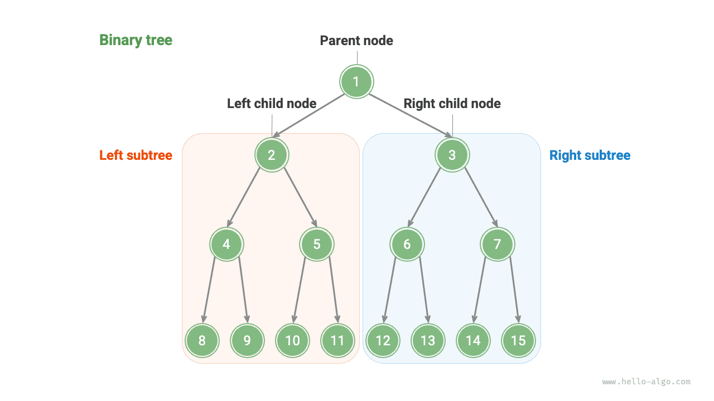
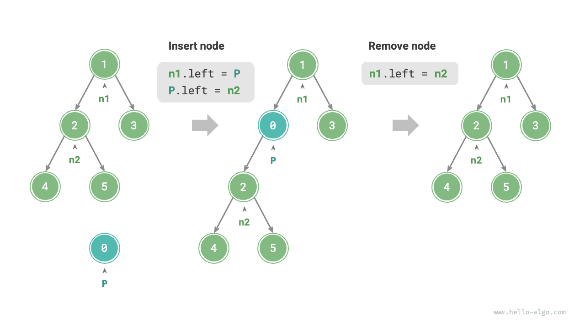
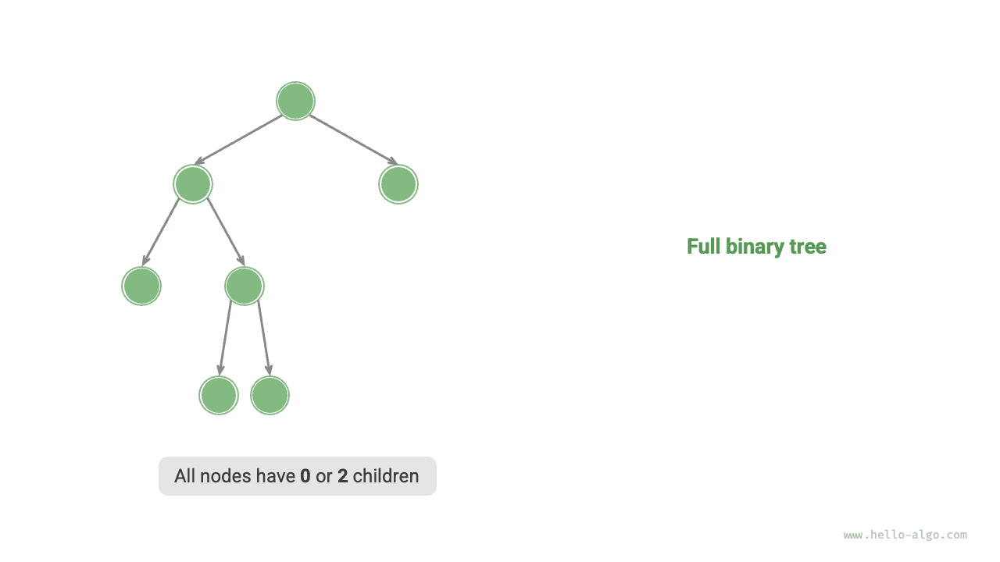
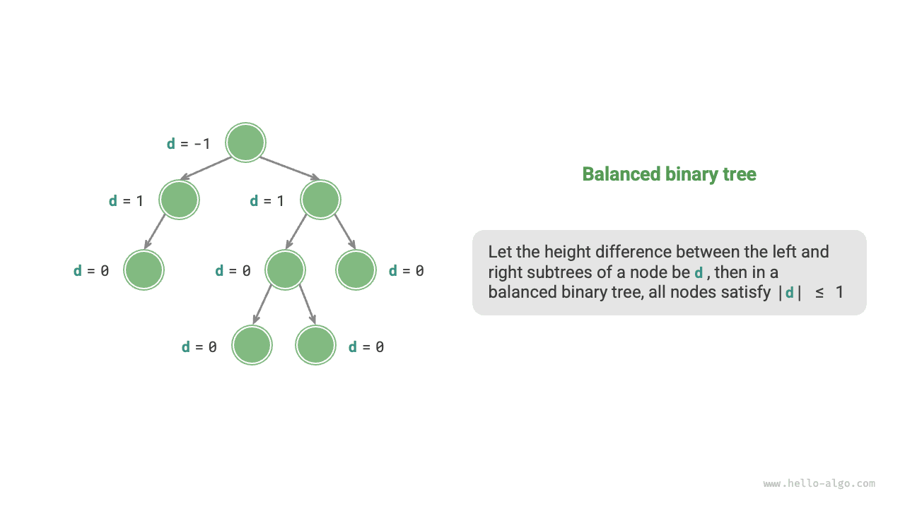

# 7.1 &nbsp; Binary trees

A <u>binary tree</u> is a nonlinear data structure representing relationships between ancestors and descendants. It embodies the divide-and-conquer idea of splitting in two. Like a linked list, it is built from nodes, each containing a value and references to its left and right children.

=== "Python"

    ```python title=""
    class TreeNode:
        """Binary tree node class"""
        def __init__(self, val: int):
            self.val: int = val                # Node value
            self.left: TreeNode | None = None  # Left child reference
            self.right: TreeNode | None = None # Right child reference
    ```

=== "C++"

    ```cpp title=""
    /* Binary tree node struct */
    struct TreeNode {
        int val;          // Node value
        TreeNode *left;   // Left child pointer
        TreeNode *right;  // Right child pointer
        TreeNode(int x) : val(x), left(nullptr), right(nullptr) {}
    };
    ```

=== "Java"

    ```java title=""
    /* Binary tree node class */
    class TreeNode {
        int val;         // Node value
        TreeNode left;   // Left child reference
        TreeNode right;  // Right child reference
        TreeNode(int x) { val = x; }
    }
    ```

=== "C#"

    ```csharp title=""
    /* Binary tree node class */
    class TreeNode(int? x) {
        public int? val = x;    // Node value
        public TreeNode? left;  // Left child reference
        public TreeNode? right; // Right child reference
    }
    ```

=== "Go"

    ```go title=""
    /* Binary tree node struct */
    type TreeNode struct {
        Val   int
        Left  *TreeNode
        Right *TreeNode
    }
    /* Constructor */
    func NewTreeNode(v int) *TreeNode {
        return &TreeNode{
            Left:  nil, // Left child pointer
            Right: nil, // Right child pointer
            Val:   v,   // Node value
        }
    }
    ```

=== "Swift"

    ```swift title=""
    /* Binary tree node class */
    class TreeNode {
        var val: Int // Node value
        var left: TreeNode? // Left child reference
        var right: TreeNode? // Right child reference

        init(x: Int) {
            val = x
        }
    }
    ```

=== "JS"

    ```javascript title=""
    /* Binary tree node class */
    class TreeNode {
        val; // Node value
        left; // Left child pointer
        right; // Right child pointer
        constructor(val, left, right) {
            this.val = val === undefined ? 0 : val;
            this.left = left === undefined ? null : left;
            this.right = right === undefined ? null : right;
        }
    }
    ```

=== "TS"

    ```typescript title=""
    /* Binary tree node class */
    class TreeNode {
        val: number;
        left: TreeNode | null;
        right: TreeNode | null;

        constructor(val?: number, left?: TreeNode | null, right?: TreeNode | null) {
            this.val = val === undefined ? 0 : val; // Node value
            this.left = left === undefined ? null : left; // Left child reference
            this.right = right === undefined ? null : right; // Right child reference
        }
    }
    ```

=== "Dart"

    ```dart title=""
    /* Binary tree node class */
    class TreeNode {
      int val;         // Node value
      TreeNode? left;  // Left child reference
      TreeNode? right; // Right child reference
      TreeNode(this.val, [this.left, this.right]);
    }
    ```

=== "Rust"

    ```rust title=""
    use std::rc::Rc;
    use std::cell::RefCell;

    /* Binary tree node struct */
    struct TreeNode {
        val: i32,                               // Node value
        left: Option<Rc<RefCell<TreeNode>>>,    // Left child reference
        right: Option<Rc<RefCell<TreeNode>>>,   // Right child reference
    }

    impl TreeNode {
        /* Constructor */
        fn new(val: i32) -> Rc<RefCell<Self>> {
            Rc::new(RefCell::new(Self {
                val,
                left: None,
                right: None
            }))
        }
    }
    ```

=== "C"

    ```c title=""
    /* Binary tree node struct */
    typedef struct TreeNode {
        int val;                // Node value
        int height;             // Node height
        struct TreeNode *left;  // Left child pointer
        struct TreeNode *right; // Right child pointer
    } TreeNode;

    /* Constructor */
    TreeNode *newTreeNode(int val) {
        TreeNode *node;

        node = (TreeNode *)malloc(sizeof(TreeNode));
        node->val = val;
        node->height = 0;
        node->left = NULL;
        node->right = NULL;
        return node;
    }
    ```

=== "Kotlin"

    ```kotlin title=""
    /* Binary tree node class */
    class TreeNode(val _val: Int) {  // Node value
        var left: TreeNode? = null   // Left child reference
        var right: TreeNode? = null  // Right child reference
    }
    ```

=== "Ruby"

    ```ruby title=""
    ### Binary tree node class ###
    class TreeNode
      attr_accessor :val    # Node value
      attr_accessor :left   # Left child reference
      attr_accessor :right  # Right child reference

      def initialize(val)
        @val = val
      end
    end
    ```

Each node has two references or pointers, one to its <u>left child</u> and one to its <u>right child</u>. The node is their <u>parent</u>. Its left child and all nodes below that child form its <u>left subtree</u>; the <u>right subtree</u> is defined similarly.

**Every non-leaf node has children and at least one nonempty subtree**. In Figure 7-1, if node 2 is the parent, its left and right children are nodes 4 and 5. Its left subtree consists of node 4 and everything below it, and its right subtree consists of node 5 and everything below it.

{ class="animation-figure" }

<p align="center"> Figure 7-1 &nbsp; Parents, children, and subtrees </p>

## 7.1.1 &nbsp; Common terminology

Figure 7-2 illustrates common binary-tree terminology.

- <u>Root</u>: the topmost node, which has no parent.
- <u>Leaf</u>: a node with no children; both of its child references point to `None`.
- <u>Edge</u>: a connection between two nodes, represented by a reference or pointer.
- A node's <u>level</u>: levels increase from top to bottom, with the root at level 1.
- A node's <u>degree</u>: its number of children, which is 0, 1, or 2 in a binary tree.
- A tree's <u>height</u>: the number of edges from the root to its farthest leaf.
- A node's <u>depth</u>: the number of edges from the root to that node.
- A node's <u>height</u>: the number of edges from that node to its farthest leaf.

{ class="animation-figure" }

<p align="center"> Figure 7-2 &nbsp; Common binary-tree terminology </p>

!!! tip

    Height and depth are usually measured in edges, but some problems or textbooks count nodes instead. Under that convention, add 1 to both height and depth.

## 7.1.2 &nbsp; Basic operations

### 1. &nbsp; Initializing a binary tree

As with a linked list, first create the nodes, then connect them with references or pointers.

=== "Python"

    ```python title="binary_tree.py"
    # Initialize a binary tree
    # Initialize nodes
    n1 = TreeNode(val=1)
    n2 = TreeNode(val=2)
    n3 = TreeNode(val=3)
    n4 = TreeNode(val=4)
    n5 = TreeNode(val=5)
    # Connect nodes with references (pointers)
    n1.left = n2
    n1.right = n3
    n2.left = n4
    n2.right = n5
    ```

=== "C++"

    ```cpp title="binary_tree.cpp"
    /* Initialize a binary tree */
    // Initialize nodes
    TreeNode* n1 = new TreeNode(1);
    TreeNode* n2 = new TreeNode(2);
    TreeNode* n3 = new TreeNode(3);
    TreeNode* n4 = new TreeNode(4);
    TreeNode* n5 = new TreeNode(5);
    // Connect nodes with references (pointers)
    n1->left = n2;
    n1->right = n3;
    n2->left = n4;
    n2->right = n5;
    ```

=== "Java"

    ```java title="binary_tree.java"
    // Initialize nodes
    TreeNode n1 = new TreeNode(1);
    TreeNode n2 = new TreeNode(2);
    TreeNode n3 = new TreeNode(3);
    TreeNode n4 = new TreeNode(4);
    TreeNode n5 = new TreeNode(5);
    // Connect nodes with references (pointers)
    n1.left = n2;
    n1.right = n3;
    n2.left = n4;
    n2.right = n5;
    ```

=== "C#"

    ```csharp title="binary_tree.cs"
    /* Initialize a binary tree */
    // Initialize nodes
    TreeNode n1 = new(1);
    TreeNode n2 = new(2);
    TreeNode n3 = new(3);
    TreeNode n4 = new(4);
    TreeNode n5 = new(5);
    // Connect nodes with references (pointers)
    n1.left = n2;
    n1.right = n3;
    n2.left = n4;
    n2.right = n5;
    ```

=== "Go"

    ```go title="binary_tree.go"
    /* Initialize a binary tree */
    // Initialize nodes
    n1 := NewTreeNode(1)
    n2 := NewTreeNode(2)
    n3 := NewTreeNode(3)
    n4 := NewTreeNode(4)
    n5 := NewTreeNode(5)
    // Connect nodes with references (pointers)
    n1.Left = n2
    n1.Right = n3
    n2.Left = n4
    n2.Right = n5
    ```

=== "Swift"

    ```swift title="binary_tree.swift"
    // Initialize nodes
    let n1 = TreeNode(x: 1)
    let n2 = TreeNode(x: 2)
    let n3 = TreeNode(x: 3)
    let n4 = TreeNode(x: 4)
    let n5 = TreeNode(x: 5)
    // Connect nodes with references (pointers)
    n1.left = n2
    n1.right = n3
    n2.left = n4
    n2.right = n5
    ```

=== "JS"

    ```javascript title="binary_tree.js"
    /* Initialize a binary tree */
    // Initialize nodes
    let n1 = new TreeNode(1),
        n2 = new TreeNode(2),
        n3 = new TreeNode(3),
        n4 = new TreeNode(4),
        n5 = new TreeNode(5);
    // Connect nodes with references (pointers)
    n1.left = n2;
    n1.right = n3;
    n2.left = n4;
    n2.right = n5;
    ```

=== "TS"

    ```typescript title="binary_tree.ts"
    /* Initialize a binary tree */
    // Initialize nodes
    let n1 = new TreeNode(1),
        n2 = new TreeNode(2),
        n3 = new TreeNode(3),
        n4 = new TreeNode(4),
        n5 = new TreeNode(5);
    // Connect nodes with references (pointers)
    n1.left = n2;
    n1.right = n3;
    n2.left = n4;
    n2.right = n5;
    ```

=== "Dart"

    ```dart title="binary_tree.dart"
    /* Initialize a binary tree */
    // Initialize nodes
    TreeNode n1 = new TreeNode(1);
    TreeNode n2 = new TreeNode(2);
    TreeNode n3 = new TreeNode(3);
    TreeNode n4 = new TreeNode(4);
    TreeNode n5 = new TreeNode(5);
    // Connect nodes with references (pointers)
    n1.left = n2;
    n1.right = n3;
    n2.left = n4;
    n2.right = n5;
    ```

=== "Rust"

    ```rust title="binary_tree.rs"
    // Initialize nodes
    let n1 = TreeNode::new(1);
    let n2 = TreeNode::new(2);
    let n3 = TreeNode::new(3);
    let n4 = TreeNode::new(4);
    let n5 = TreeNode::new(5);
    // Connect nodes with references (pointers)
    n1.borrow_mut().left = Some(n2.clone());
    n1.borrow_mut().right = Some(n3);
    n2.borrow_mut().left = Some(n4);
    n2.borrow_mut().right = Some(n5);
    ```

=== "C"

    ```c title="binary_tree.c"
    /* Initialize a binary tree */
    // Initialize nodes
    TreeNode *n1 = newTreeNode(1);
    TreeNode *n2 = newTreeNode(2);
    TreeNode *n3 = newTreeNode(3);
    TreeNode *n4 = newTreeNode(4);
    TreeNode *n5 = newTreeNode(5);
    // Connect nodes with references (pointers)
    n1->left = n2;
    n1->right = n3;
    n2->left = n4;
    n2->right = n5;
    ```

=== "Kotlin"

    ```kotlin title="binary_tree.kt"
    // Initialize nodes
    val n1 = TreeNode(1)
    val n2 = TreeNode(2)
    val n3 = TreeNode(3)
    val n4 = TreeNode(4)
    val n5 = TreeNode(5)
    // Connect nodes with references (pointers)
    n1.left = n2
    n1.right = n3
    n2.left = n4
    n2.right = n5
    ```

=== "Ruby"

    ```ruby title="binary_tree.rb"
    # Initialize a binary tree
    # Initialize nodes
    n1 = TreeNode.new(1)
    n2 = TreeNode.new(2)
    n3 = TreeNode.new(3)
    n4 = TreeNode.new(4)
    n5 = TreeNode.new(5)
    # Connect nodes with references (pointers)
    n1.left = n2
    n1.right = n3
    n2.left = n4
    n2.right = n5
    ```

??? pythontutor "Visualize execution"

    <div style="height: 549px; width: 100%;"><iframe class="pythontutor-iframe" title="Visualize execution" src="https://pythontutor.com/iframe-embed.html#code=class%20TreeNode%3A%0A%20%20%20%20%22%22%22Binary%20tree%20node%20class%22%22%22%0A%20%20%20%20def%20__init__%28self%2C%20val%3A%20int%29%3A%0A%20%20%20%20%20%20%20%20self.val%3A%20int%20%3D%20val%20%20%20%20%20%20%20%20%20%20%20%20%20%20%20%20%23%20Node%20value%0A%20%20%20%20%20%20%20%20self.left%3A%20TreeNode%20%7C%20None%20%3D%20None%20%20%23%20Left%20child%20reference%0A%20%20%20%20%20%20%20%20self.right%3A%20TreeNode%20%7C%20None%20%3D%20None%20%23%20Right%20child%20reference%0A%0A%22%22%22Driver%20Code%22%22%22%0Aif%20__name__%20%3D%3D%20%22__main__%22%3A%0A%20%20%20%20%23%20Initialize%20a%20binary%20tree%0A%20%20%20%20%23%20Initialize%20nodes%0A%20%20%20%20n1%20%3D%20TreeNode%28val%3D1%29%0A%20%20%20%20n2%20%3D%20TreeNode%28val%3D2%29%0A%20%20%20%20n3%20%3D%20TreeNode%28val%3D3%29%0A%20%20%20%20n4%20%3D%20TreeNode%28val%3D4%29%0A%20%20%20%20n5%20%3D%20TreeNode%28val%3D5%29%0A%20%20%20%20%23%20Connect%20nodes%20with%20references%20%28pointers%29%0A%20%20%20%20n1.left%20%3D%20n2%0A%20%20%20%20n1.right%20%3D%20n3%0A%20%20%20%20n2.left%20%3D%20n4%0A%20%20%20%20n2.right%20%3D%20n5&codeDivHeight=472&codeDivWidth=350&cumulative=false&curInstr=3&heapPrimitives=nevernest&origin=opt-frontend.js&py=311&rawInputLstJSON=%5B%5D&textReferences=false"> </iframe></div>
    <div style="margin-top: 5px;"><a href="https://pythontutor.com/iframe-embed.html#code=class%20TreeNode%3A%0A%20%20%20%20%22%22%22Binary%20tree%20node%20class%22%22%22%0A%20%20%20%20def%20__init__%28self%2C%20val%3A%20int%29%3A%0A%20%20%20%20%20%20%20%20self.val%3A%20int%20%3D%20val%20%20%20%20%20%20%20%20%20%20%20%20%20%20%20%20%23%20Node%20value%0A%20%20%20%20%20%20%20%20self.left%3A%20TreeNode%20%7C%20None%20%3D%20None%20%20%23%20Left%20child%20reference%0A%20%20%20%20%20%20%20%20self.right%3A%20TreeNode%20%7C%20None%20%3D%20None%20%23%20Right%20child%20reference%0A%0A%22%22%22Driver%20Code%22%22%22%0Aif%20__name__%20%3D%3D%20%22__main__%22%3A%0A%20%20%20%20%23%20Initialize%20a%20binary%20tree%0A%20%20%20%20%23%20Initialize%20nodes%0A%20%20%20%20n1%20%3D%20TreeNode%28val%3D1%29%0A%20%20%20%20n2%20%3D%20TreeNode%28val%3D2%29%0A%20%20%20%20n3%20%3D%20TreeNode%28val%3D3%29%0A%20%20%20%20n4%20%3D%20TreeNode%28val%3D4%29%0A%20%20%20%20n5%20%3D%20TreeNode%28val%3D5%29%0A%20%20%20%20%23%20Connect%20nodes%20with%20references%20%28pointers%29%0A%20%20%20%20n1.left%20%3D%20n2%0A%20%20%20%20n1.right%20%3D%20n3%0A%20%20%20%20n2.left%20%3D%20n4%0A%20%20%20%20n2.right%20%3D%20n5&codeDivHeight=800&codeDivWidth=600&cumulative=false&curInstr=3&heapPrimitives=nevernest&origin=opt-frontend.js&py=311&rawInputLstJSON=%5B%5D&textReferences=false" target="_blank" rel="noopener noreferrer">View full screen ></a></div>

### 2. &nbsp; Inserting and deleting nodes

As with linked lists, insertion and deletion can be implemented by changing pointers. An example is shown below.

{ class="animation-figure" }

<p align="center"> Figure 7-3 &nbsp; Inserting and deleting a binary-tree node </p>

=== "Python"

    ```python title="binary_tree.py"
    # Insert and delete a node
    p = TreeNode(0)
    # Insert node P between n1 and n2
    n1.left = p
    p.left = n2
    # Delete node P
    n1.left = n2
    ```

=== "C++"

    ```cpp title="binary_tree.cpp"
    /* Insert and delete a node */
    TreeNode* P = new TreeNode(0);
    // Insert node P between n1 and n2
    n1->left = P;
    P->left = n2;
    // Delete node P
    n1->left = n2;
    // Free the memory
    delete P;
    ```

=== "Java"

    ```java title="binary_tree.java"
    TreeNode P = new TreeNode(0);
    // Insert node P between n1 and n2
    n1.left = P;
    P.left = n2;
    // Delete node P
    n1.left = n2;
    ```

=== "C#"

    ```csharp title="binary_tree.cs"
    /* Insert and delete a node */
    TreeNode P = new(0);
    // Insert node P between n1 and n2
    n1.left = P;
    P.left = n2;
    // Delete node P
    n1.left = n2;
    ```

=== "Go"

    ```go title="binary_tree.go"
    /* Insert and delete a node */
    // Insert node P between n1 and n2
    p := NewTreeNode(0)
    n1.Left = p
    p.Left = n2
    // Delete node P
    n1.Left = n2
    ```

=== "Swift"

    ```swift title="binary_tree.swift"
    let P = TreeNode(x: 0)
    // Insert node P between n1 and n2
    n1.left = P
    P.left = n2
    // Delete node P
    n1.left = n2
    ```

=== "JS"

    ```javascript title="binary_tree.js"
    /* Insert and delete a node */
    let P = new TreeNode(0);
    // Insert node P between n1 and n2
    n1.left = P;
    P.left = n2;
    // Delete node P
    n1.left = n2;
    ```

=== "TS"

    ```typescript title="binary_tree.ts"
    /* Insert and delete a node */
    const P = new TreeNode(0);
    // Insert node P between n1 and n2
    n1.left = P;
    P.left = n2;
    // Delete node P
    n1.left = n2;
    ```

=== "Dart"

    ```dart title="binary_tree.dart"
    /* Insert and delete a node */
    TreeNode P = new TreeNode(0);
    // Insert node P between n1 and n2
    n1.left = P;
    P.left = n2;
    // Delete node P
    n1.left = n2;
    ```

=== "Rust"

    ```rust title="binary_tree.rs"
    let p = TreeNode::new(0);
    // Insert node P between n1 and n2
    n1.borrow_mut().left = Some(p.clone());
    p.borrow_mut().left = Some(n2.clone());
    // Delete node p
    n1.borrow_mut().left = Some(n2);
    ```

=== "C"

    ```c title="binary_tree.c"
    /* Insert and delete a node */
    TreeNode *P = newTreeNode(0);
    // Insert node P between n1 and n2
    n1->left = P;
    P->left = n2;
    // Delete node P
    n1->left = n2;
    // Free the memory
    free(P);
    ```

=== "Kotlin"

    ```kotlin title="binary_tree.kt"
    val P = TreeNode(0)
    // Insert node P between n1 and n2
    n1.left = P
    P.left = n2
    // Delete node P
    n1.left = n2
    ```

=== "Ruby"

    ```ruby title="binary_tree.rb"
    # Insert and delete a node
    _p = TreeNode.new(0)
    # Insert node _p between n1 and n2
    n1.left = _p
    _p.left = n2
    # Delete the node
    n1.left = n2
    ```

??? pythontutor "Visualize execution"

    <div style="height: 549px; width: 100%;"><iframe class="pythontutor-iframe" title="Visualize execution" src="https://pythontutor.com/iframe-embed.html#code=class%20TreeNode%3A%0A%20%20%20%20%22%22%22Binary%20tree%20node%20class%22%22%22%0A%20%20%20%20def%20__init__%28self%2C%20val%3A%20int%29%3A%0A%20%20%20%20%20%20%20%20self.val%3A%20int%20%3D%20val%20%20%20%20%20%20%20%20%20%20%20%20%20%20%20%20%23%20Node%20value%0A%20%20%20%20%20%20%20%20self.left%3A%20TreeNode%20%7C%20None%20%3D%20None%20%20%23%20Left%20child%20reference%0A%20%20%20%20%20%20%20%20self.right%3A%20TreeNode%20%7C%20None%20%3D%20None%20%23%20Right%20child%20reference%0A%0A%22%22%22Driver%20Code%22%22%22%0Aif%20__name__%20%3D%3D%20%22__main__%22%3A%0A%20%20%20%20%23%20Initialize%20a%20binary%20tree%0A%20%20%20%20%23%20Initialize%20nodes%0A%20%20%20%20n1%20%3D%20TreeNode%28val%3D1%29%0A%20%20%20%20n2%20%3D%20TreeNode%28val%3D2%29%0A%20%20%20%20n3%20%3D%20TreeNode%28val%3D3%29%0A%20%20%20%20n4%20%3D%20TreeNode%28val%3D4%29%0A%20%20%20%20n5%20%3D%20TreeNode%28val%3D5%29%0A%20%20%20%20%23%20Connect%20nodes%20with%20references%20%28pointers%29%0A%20%20%20%20n1.left%20%3D%20n2%0A%20%20%20%20n1.right%20%3D%20n3%0A%20%20%20%20n2.left%20%3D%20n4%0A%20%20%20%20n2.right%20%3D%20n5%0A%0A%20%20%20%20%23%20Insert%20and%20delete%20a%20node%0A%20%20%20%20p%20%3D%20TreeNode%280%29%0A%20%20%20%20%23%20Insert%20node%20P%20between%20n1%20and%20n2%0A%20%20%20%20n1.left%20%3D%20p%0A%20%20%20%20p.left%20%3D%20n2%0A%20%20%20%20%23%20Delete%20node%20P%0A%20%20%20%20n1.left%20%3D%20n2&codeDivHeight=472&codeDivWidth=350&cumulative=false&curInstr=37&heapPrimitives=nevernest&origin=opt-frontend.js&py=311&rawInputLstJSON=%5B%5D&textReferences=false"> </iframe></div>
    <div style="margin-top: 5px;"><a href="https://pythontutor.com/iframe-embed.html#code=class%20TreeNode%3A%0A%20%20%20%20%22%22%22Binary%20tree%20node%20class%22%22%22%0A%20%20%20%20def%20__init__%28self%2C%20val%3A%20int%29%3A%0A%20%20%20%20%20%20%20%20self.val%3A%20int%20%3D%20val%20%20%20%20%20%20%20%20%20%20%20%20%20%20%20%20%23%20Node%20value%0A%20%20%20%20%20%20%20%20self.left%3A%20TreeNode%20%7C%20None%20%3D%20None%20%20%23%20Left%20child%20reference%0A%20%20%20%20%20%20%20%20self.right%3A%20TreeNode%20%7C%20None%20%3D%20None%20%23%20Right%20child%20reference%0A%0A%22%22%22Driver%20Code%22%22%22%0Aif%20__name__%20%3D%3D%20%22__main__%22%3A%0A%20%20%20%20%23%20Initialize%20a%20binary%20tree%0A%20%20%20%20%23%20Initialize%20nodes%0A%20%20%20%20n1%20%3D%20TreeNode%28val%3D1%29%0A%20%20%20%20n2%20%3D%20TreeNode%28val%3D2%29%0A%20%20%20%20n3%20%3D%20TreeNode%28val%3D3%29%0A%20%20%20%20n4%20%3D%20TreeNode%28val%3D4%29%0A%20%20%20%20n5%20%3D%20TreeNode%28val%3D5%29%0A%20%20%20%20%23%20Connect%20nodes%20with%20references%20%28pointers%29%0A%20%20%20%20n1.left%20%3D%20n2%0A%20%20%20%20n1.right%20%3D%20n3%0A%20%20%20%20n2.left%20%3D%20n4%0A%20%20%20%20n2.right%20%3D%20n5%0A%0A%20%20%20%20%23%20Insert%20and%20delete%20a%20node%0A%20%20%20%20p%20%3D%20TreeNode%280%29%0A%20%20%20%20%23%20Insert%20node%20P%20between%20n1%20and%20n2%0A%20%20%20%20n1.left%20%3D%20p%0A%20%20%20%20p.left%20%3D%20n2%0A%20%20%20%20%23%20Delete%20node%20P%0A%20%20%20%20n1.left%20%3D%20n2&codeDivHeight=800&codeDivWidth=600&cumulative=false&curInstr=37&heapPrimitives=nevernest&origin=opt-frontend.js&py=311&rawInputLstJSON=%5B%5D&textReferences=false" target="_blank" rel="noopener noreferrer">View full screen ></a></div>

!!! tip

    Inserting a node may change the tree's logical structure, while deleting a node generally means deleting it and all its subtrees. Meaningful insertion and deletion operations therefore usually require several coordinated steps.

## 7.1.3 &nbsp; Common types of binary trees

### 1. &nbsp; Perfect binary trees

In a <u>perfect binary tree</u>, every level is completely filled, as shown below. Leaves have degree $0$, and all other nodes have degree $2$. A tree of height $h$ has $2^{h+1} - 1$ nodes, an exponential relationship reminiscent of cell division in nature.

!!! tip

    In Chinese-language resources, a perfect binary tree is often called <u>满二叉树</u>.

{ class="animation-figure" }

<p align="center"> Figure 7-4 &nbsp; A perfect binary tree </p>

### 2. &nbsp; Complete binary trees

Only the lowest level of a <u>complete binary tree</u> may be incomplete, and its nodes must fill that level consecutively from left to right, as shown below. Every perfect binary tree is also complete.

{ class="animation-figure" }

<p align="center"> Figure 7-5 &nbsp; A complete binary tree </p>

### 3. &nbsp; Full binary trees

In a <u>full binary tree</u>, every node other than a leaf has exactly two children, as shown below.

{ class="animation-figure" }

<p align="center"> Figure 7-6 &nbsp; A full binary tree </p>

### 4. &nbsp; Balanced binary trees

In a <u>balanced binary tree</u>, the heights of the left and right subtrees of every node differ by at most 1, as shown below.

{ class="animation-figure" }

<p align="center"> Figure 7-7 &nbsp; A balanced binary tree </p>

## 7.1.4 &nbsp; Degeneration of a binary tree

Figure 7-8 shows ideal and degenerate tree structures. When every level is full, the tree is perfect. When every node lies along one side, the tree degenerates into a linked list.

- A perfect binary tree is the ideal case, making full use of divide and conquer.
- A linked list is the opposite extreme: operations become linear, with time complexity degrading to $O(n)$.

{ class="animation-figure" }

<p align="center"> Figure 7-8 &nbsp; Best and worst binary-tree structures </p>

As Table 7-1 shows, quantities such as leaf count, total node count, and height reach their maximum or minimum values in these best and worst structures.

<p align="center"> Table 7-1 &nbsp; Best and worst binary-tree structures </p>

<div class="center-table" markdown>

|                             | Perfect binary tree         | Linked list    |
| --------------------------- | ------------------ | ------- |
| Nodes at level $i$         | $2^{i-1}$          | $1$     |
| Leaves in a tree of height $h$ | $2^h$              | $1$     |
| Total nodes in a tree of height $h$   | $2^{h+1} - 1$      | $h + 1$ |
| Height of a tree with $n$ nodes   | $\log_2 (n+1) - 1$ | $n - 1$ |

</div>
