# Binary tree traversal

From the perspective of physical structure, a tree is a data structure based on linked lists, hence its traversal method involves accessing nodes one by one through pointers. However, a tree is a non-linear data structure, which makes traversing a tree more complex than traversing a linked list, requiring the assistance of search algorithms to achieve.

Common traversal methods for binary trees include level-order traversal, preorder traversal, inorder traversal, and postorder traversal, among others.

## Level-order traversal

As shown in the figure below, "level-order traversal" traverses the binary tree from top to bottom, layer by layer, and accesses nodes in each layer in a left-to-right order.

Level-order traversal essentially belongs to "breadth-first traversal", also known as "breadth-first search (BFS)", which embodies a "circumferentially outward expanding" layer-by-layer traversal method.

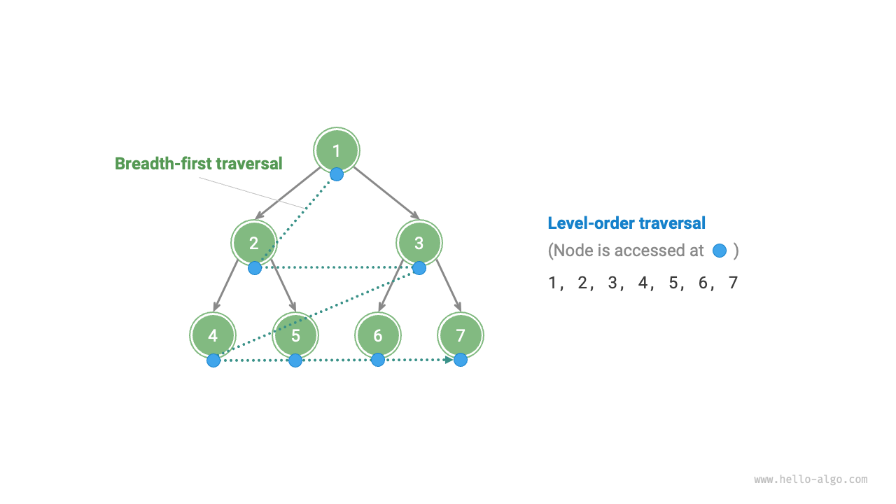

### Code implementation

Breadth-first traversal is usually implemented with the help of a "queue". The queue follows the "first in, first out" rule, while breadth-first traversal follows the "layer-by-layer progression" rule, the underlying ideas of the two are consistent. The implementation code is as follows:

```src
[file]{binary_tree_bfs}-[class]{}-[func]{level_order}
```

### Complexity analysis

- **Time complexity is $O(n)$**: All nodes are visited once, using $O(n)$ time, where $n$ is the number of nodes.
- **Space complexity is $O(n)$**: In the worst case, i.e., a full binary tree, before traversing to the lowest level, the queue can contain at most $(n + 1) / 2$ nodes at the same time, occupying $O(n)$ space.

## Preorder, inorder, and postorder traversal

Correspondingly, preorder, inorder, and postorder traversal all belong to "depth-first traversal", also known as "depth-first search (DFS)", which embodies a "proceed to the end first, then backtrack and continue" traversal method.

The figure below shows the working principle of performing a depth-first traversal on a binary tree. **Depth-first traversal is like walking around the perimeter of the entire binary tree**, encountering three positions at each node, corresponding to preorder traversal, inorder traversal, and postorder traversal.

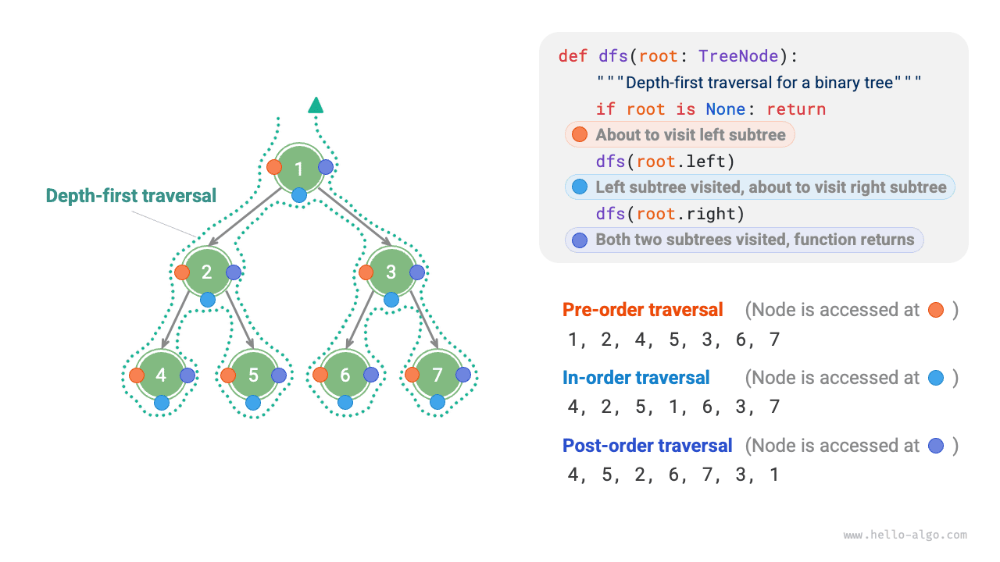

### Code implementation

Depth-first search is usually implemented based on recursion:

```src
[file]{binary_tree_dfs}-[class]{}-[func]{post_order}
```

!!! tip

    Depth-first search can also be implemented based on iteration, interested readers can study this on their own.

The figure below shows the recursive process of preorder traversal of a binary tree, which can be divided into two opposite parts: "recursion" and "return".

1. "Recursion" means starting a new method, the program accesses the next node in this process.
2. "Return" means the function returns, indicating the current node has been fully accessed.

=== "<1>"
    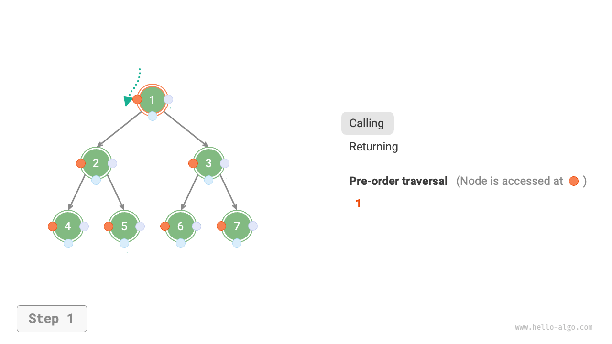

=== "<2>"
    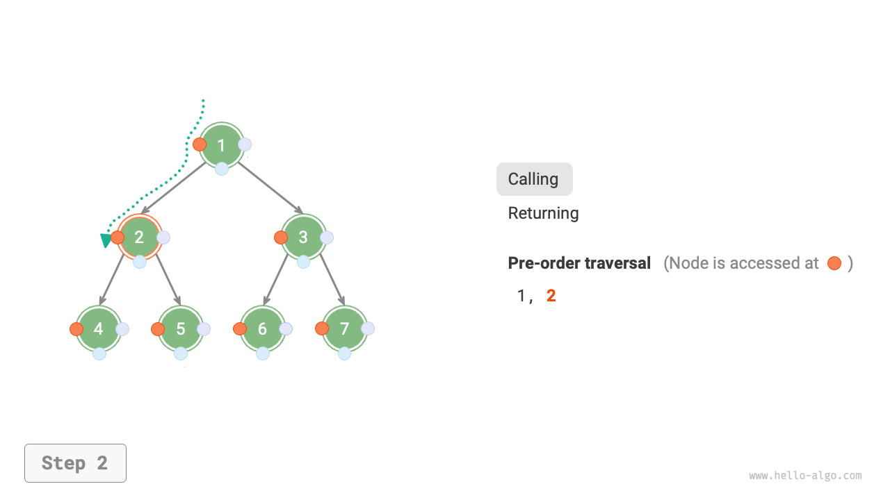

=== "<3>"
    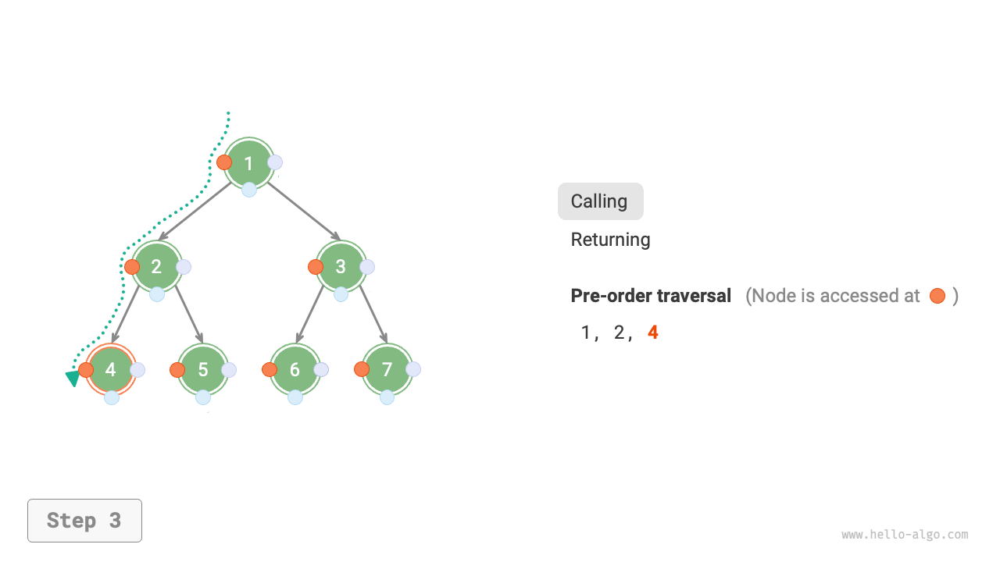

=== "<4>"
    

=== "<5>"
    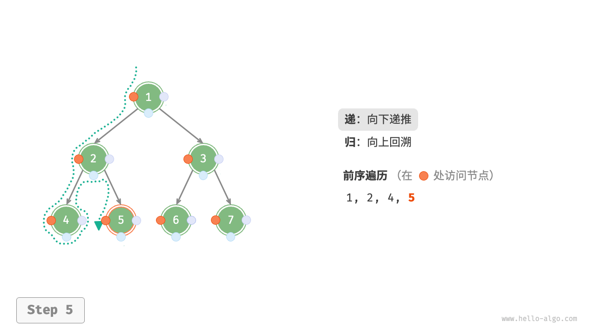

=== "<6>"
    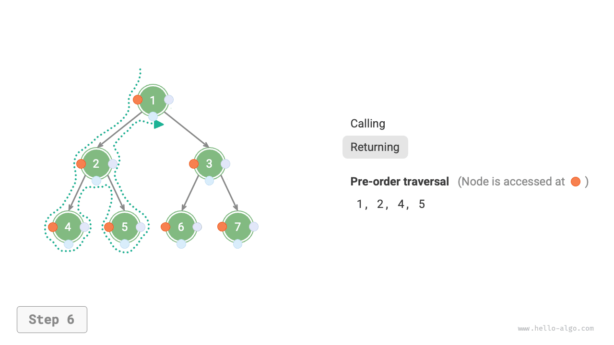

=== "<7>"
    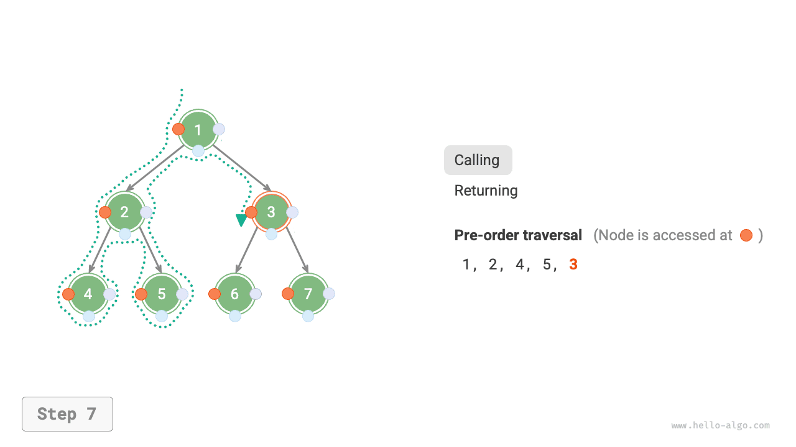

=== "<8>"
    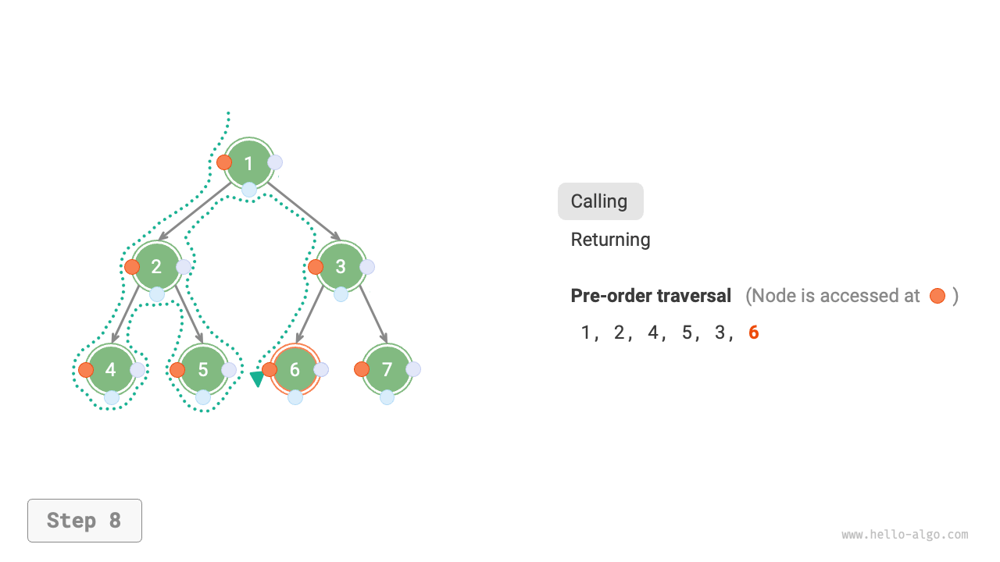

=== "<9>"
    

=== "<10>"
    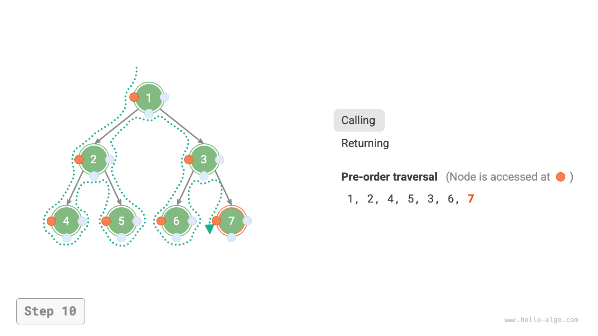

=== "<11>"
    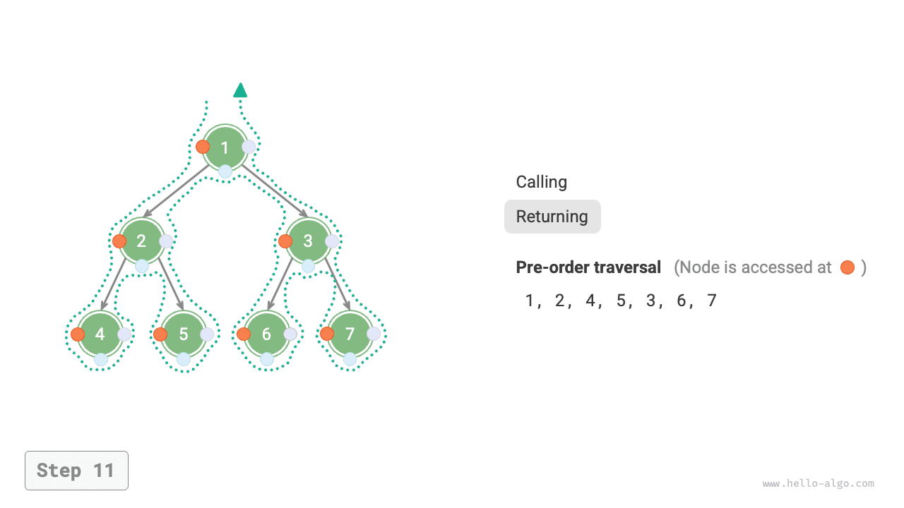

### Complexity analysis

- **Time complexity is $O(n)$**: All nodes are visited once, using $O(n)$ time.
- **Space complexity is $O(n)$**: In the worst case, i.e., the tree degrades into a linked list, the recursion depth reaches $n$, the system occupies $O(n)$ stack frame space.
