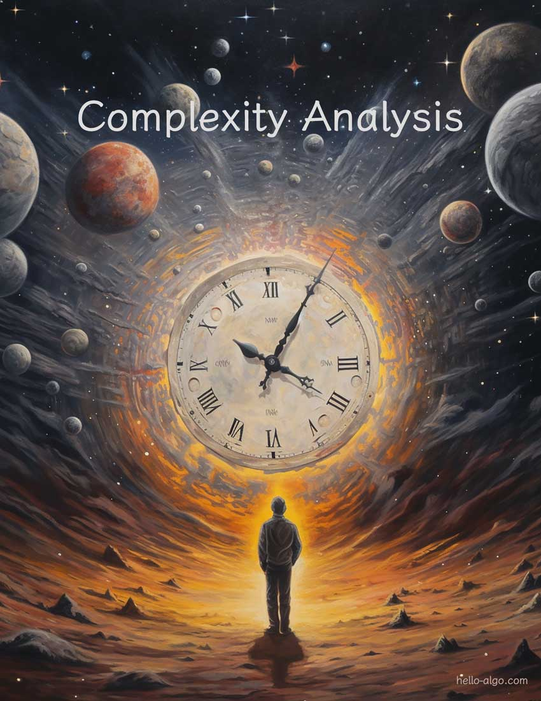

# Análisis de complejidad

!!! abstract

    El análisis de complejidad es como un navegador espacio-temporal en el vasto universo de los algoritmos.

    Nos guía en la exploración de las profundidades de las dimensiones del tiempo y el espacio, en busca de soluciones más elegantes.
