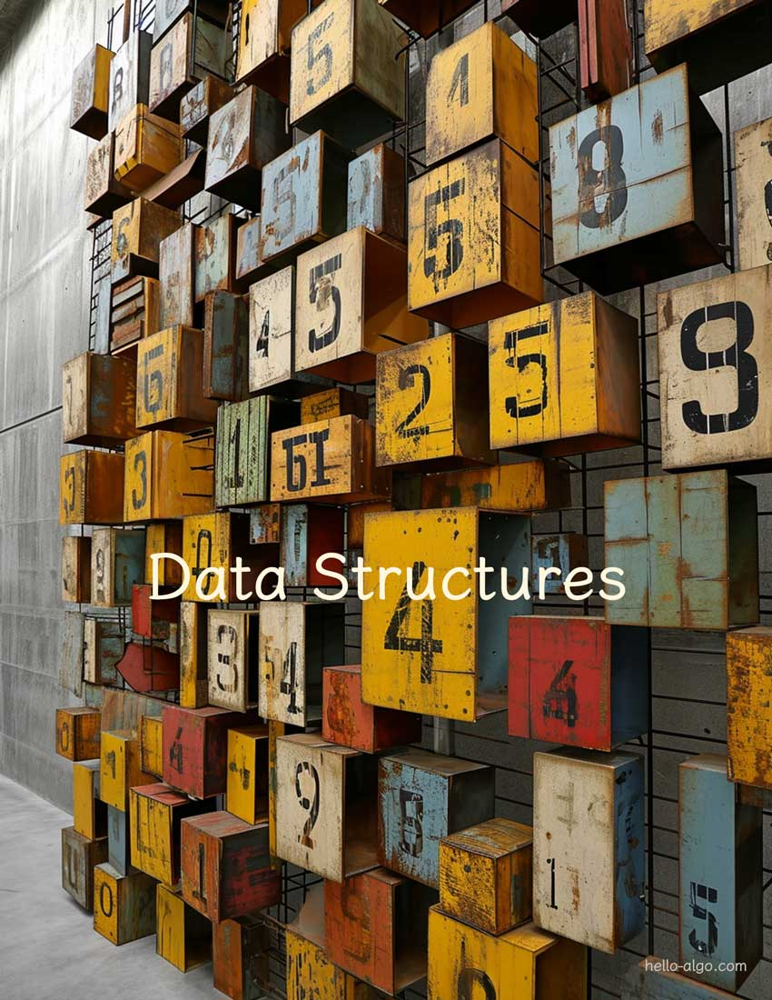

# Estructuras de datos

!!! abstract

    Las estructuras de datos sirven como un marco robusto y diverso.

    Ofrecen un plan para la organización ordenada de los datos, sobre el cual los algoritmos cobran vida.
