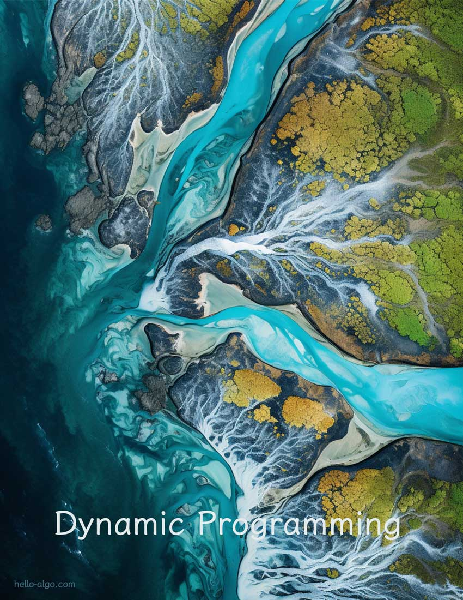

# Programación dinámica

!!! abstract

    Los arroyos se unen en ríos, y los ríos se unen en el mar.
    
    La programación dinámica entrelaza las soluciones de problemas más pequeños en problemas más grandes, guiándonos paso a paso hacia la orilla lejana, donde espera la respuesta definitiva.
