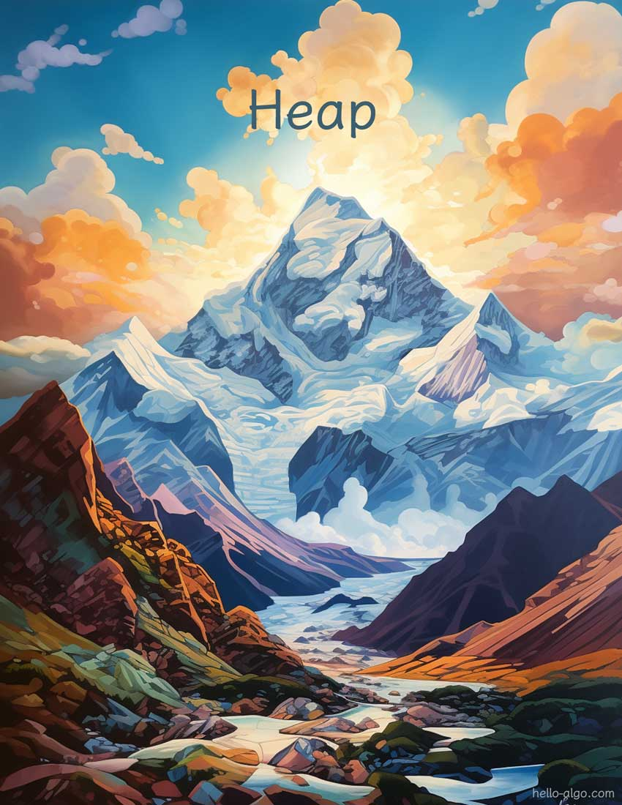

# Montículo

!!! abstract

    Los montículos se asemejan a montañas y sus picos irregulares, en capas y ondulados, cada uno con su forma única.

    Cada pico de montaña sube y baja en alturas dispersas, pero el más alto siempre capta la atención primero.
