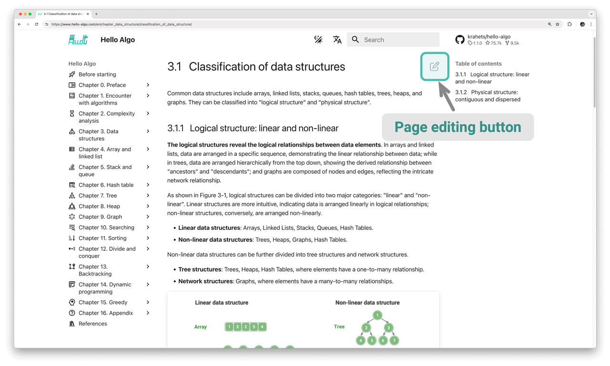

# コントリビューション

著者の能力に限りがあるため、本書にはいくつかの省略や誤りが避けられません。ご理解をお願いします。誤字、リンク切れ、内容の欠落、文章の曖昧さ、説明の不明確さ、または不合理な文章構造を発見された場合は、読者により良質な学習リソースを提供するため、修正にご協力ください。

すべての[コントリビューター](https://github.com/krahets/hello-algo/graphs/contributors)のGitHub IDは、本書のリポジトリ、ウェブ、PDFバージョンのホームページに表示され、オープンソースコミュニティへの無私の貢献に感謝いたします。

!!! success "オープンソースの魅力"

    紙の本の2つの印刷版の間隔はしばしば長く、内容の更新が非常に不便です。

    しかし、このオープンソースの本では、内容の更新サイクルは数日、さらには数時間に短縮されます。

### 内容の微調整

下の図に示すように、各ページの右上角に「編集アイコン」があります。以下の手順に従ってテキストやコードを修正できます。

1. 「編集アイコン」をクリックします。「このリポジトリをフォークしますか」と促された場合は、同意してください。
2. Markdownソースファイルの内容を修正し、内容の正確性を確認し、フォーマットの一貫性を保つようにしてください。
3. ページの下部で修正説明を記入し、「Propose file change」ボタンをクリックします。ページがリダイレクトされた後、「Create pull request」ボタンをクリックしてプルリクエストを開始します。



図は直接修正できないため、新しい[Issue](https://github.com/krahets/hello-algo/issues)を作成するか、問題を説明するコメントが必要です。できるだけ早く図を再描画して置き換えます。

### 内容の作成

このオープンソースプロジェクトへの参加に興味がある場合、コードを他のプログラミング言語に翻訳したり、記事の内容を拡張したりすることを含めて、以下のプルリクエストワークフローを実装する必要があります。

1. GitHubにログインし、本書の[コードリポジトリ](https://github.com/krahets/hello-algo)を個人アカウントにフォークします。
2. フォークしたリポジトリのウェブページに移動し、`git clone`コマンドを使用してリポジトリをローカルマシンにクローンします。
3. ローカルで内容を作成し、完全なテストを実行してコードの正確性を検証します。
4. ローカルで行った変更をコミットし、リモートリポジトリにプッシュします。
5. リポジトリのウェブページを更新し、「Create pull request」ボタンをクリックしてプルリクエストを開始します。

### Dockerデプロイメント

`hello-algo`ルートディレクトリで、以下のDockerスクリプトを実行して`http://localhost:8000`でプロジェクトにアクセスします：

```shell
docker-compose up -d
```

以下のコマンドを使用してデプロイメントを削除します：

```shell
docker-compose down
```
