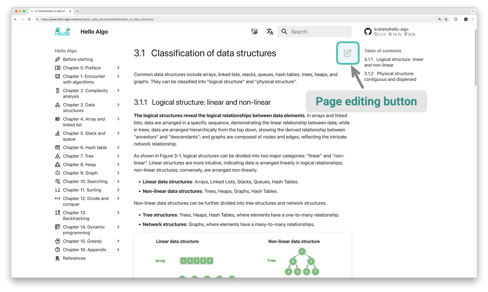

# 一緒に制作に参加しましょう

著者の力には限りがあるため、本書にはどうしても一部の漏れや誤りが含まれる可能性があります。ご了承ください。誤字、リンク切れ、内容の欠落、表現の曖昧さ、説明の不明瞭さ、文章構成の不適切さなどの問題を見つけた場合は、ぜひ修正にご協力ください。読者により良い学習リソースを提供できます。

すべての[寄稿者](https://github.com/krahets/hello-algo/graphs/contributors)の GitHub ID は、本書のリポジトリ、Web 版、PDF 版のホームページに掲載され、オープンソースコミュニティへの惜しみない貢献に感謝を表します。

!!! success "オープンソースの魅力"

    紙の書籍では、2 回の増刷の間隔が長くなりがちで、内容更新は非常に不便です。
    
    一方、このオープンソース書籍では、内容更新のサイクルは数日、場合によっては数時間にまで短縮されています。

### 内容の微調整

以下の図のように、各ページの右上には「編集アイコン」があります。次の手順で本文やコードを修正できます。

1. 「編集アイコン」をクリックし、「このリポジトリを Fork する必要があります」と表示された場合は、その操作を承認してください。
2. Markdown のソースファイルを修正し、内容が正しいことを確認したうえで、できるだけ書式の統一を保ってください。
3. ページ下部に修正内容の説明を入力し、その後「Propose file change」ボタンをクリックします。ページ遷移後、「Create pull request」ボタンをクリックするとプルリクエストを作成できます。



画像は直接修正できないため、新しい [Issue](https://github.com/krahets/hello-algo/issues) を作成するかコメントで問題を説明してください。できるだけ早く描き直して差し替えます。

### コンテンツ制作

コードを他のプログラミング言語へ翻訳することや、記事内容を拡充することなど、このオープンソースプロジェクトへの参加に興味がある場合は、以下の Pull Request ワークフローに従ってください。

1. GitHub にログインし、本書の[コードリポジトリ](https://github.com/krahets/hello-algo)を個人アカウントに Fork します。
2. Fork したリポジトリのページに入り、`git clone` コマンドを使ってリポジトリをローカルにクローンします。
3. ローカルでコンテンツを作成し、完全なテストを行ってコードの正しさを確認します。
4. ローカルで行った変更を Commit し、その後リモートリポジトリへ Push します。
5. リポジトリのページを更新し、「Create pull request」ボタンをクリックするとプルリクエストを作成できます。

### Docker デプロイ

`hello-algo` のルートディレクトリで以下の Docker スクリプトを実行すると、`http://localhost:8000` で本プロジェクトにアクセスできます。

```shell
docker-compose up -d
```

以下のコマンドでデプロイを削除できます。

```shell
docker-compose down
```
