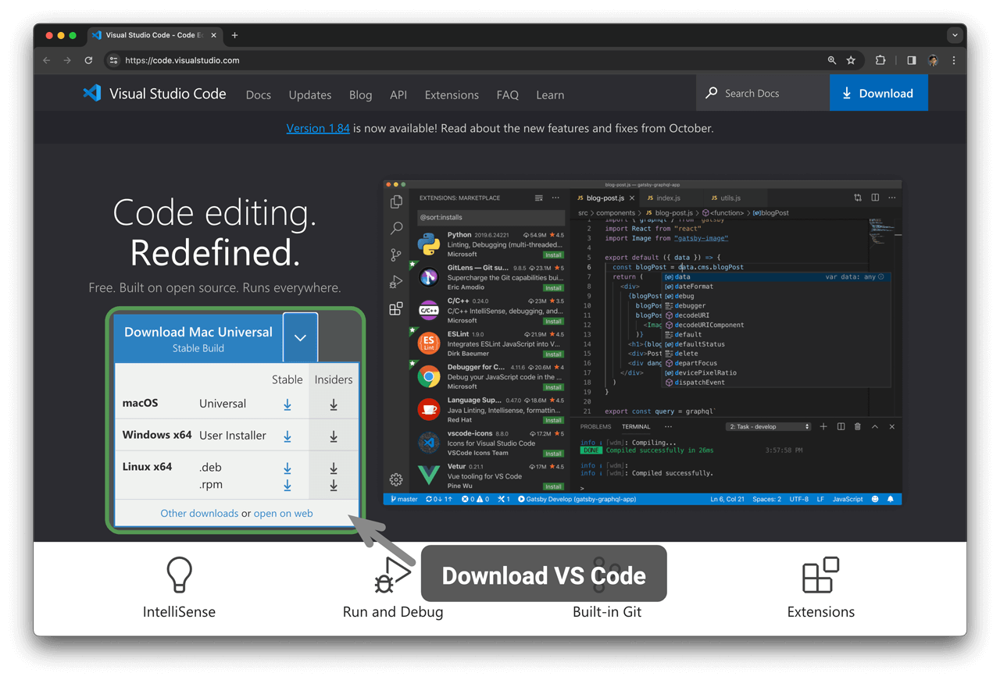
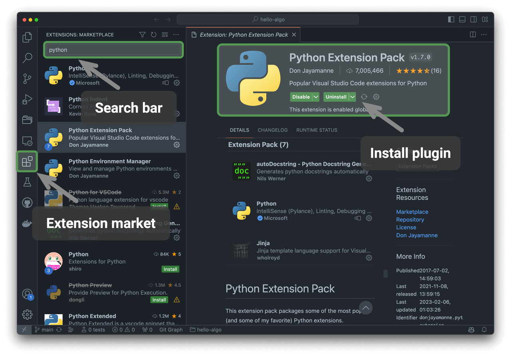

# インストール

## IDEのインストール

ローカルの統合開発環境（IDE）として、オープンソースで軽量なVS Codeを使用することをお勧めします。[VS Code公式ウェブサイト](https://code.visualstudio.com/)にアクセスし、お使いのオペレーティングシステムに適したVS Codeのバージョンを選択してダウンロードし、インストールしてください。

VS Codeには強力な拡張機能エコシステムがあり、ほとんどのプログラミング言語の実行とデバッグをサポートしています。例えば、「Python Extension Pack」をインストールした後、Pythonコードをデバッグできます。インストール手順を下の図に示します。

## 言語環境のインストール

### Python環境

1. [Miniconda3](https://docs.conda.io/en/latest/miniconda.html)をダウンロードしてインストールします。Python 3.10以降が必要です。
2. VS Code拡張機能マーケットプレイスで`python`を検索し、Python Extension Packをインストールします。
3. （オプション）コマンドラインで`pip install black`を入力して、コードフォーマッティングツールをインストールします。

### C/C++環境

1. Windowsシステムでは[MinGW](https://sourceforge.net/projects/mingw-w64/files/)をインストールする必要があります（[設定チュートリアル](https://blog.csdn.net/qq_33698226/article/details/129031241)）。MacOSにはClangが付属しているため、インストールは不要です。
2. VS Code拡張機能マーケットプレイスで`c++`を検索し、C/C++ Extension Packをインストールします。
3. （オプション）設定ページを開き、`Clang_format_fallback Style`コードフォーマッティングオプションを検索し、`{ BasedOnStyle: Microsoft, BreakBeforeBraces: Attach }`に設定します。

### Java環境

1. [OpenJDK](https://jdk.java.net/18/)をダウンロードしてインストールします（バージョンはJDK 9より新しい必要があります）。
2. VS Code拡張機能マーケットプレイスで`java`を検索し、Extension Pack for Javaをインストールします。

### C#環境

1. [.Net 8.0](https://dotnet.microsoft.com/en-us/download)をダウンロードしてインストールします。
2. VS Code拡張機能マーケットプレイスで`C# Dev Kit`を検索し、C# Dev Kitをインストールします（[設定チュートリアル](https://code.visualstudio.com/docs/csharp/get-started)）。
3. Visual Studioを使用することもできます（[インストールチュートリアル](https://learn.microsoft.com/zh-cn/visualstudio/install/install-visual-studio?view=vs-2022)）。

### Go環境

1. [go](https://go.dev/dl/)をダウンロードしてインストールします。
2. VS Code拡張機能マーケットプレイスで`go`を検索し、Goをインストールします。
3. `Ctrl + Shift + P`を押してコマンドバーを呼び出し、goと入力し、`Go: Install/Update Tools`を選択し、すべてを選択してインストールします。

### Swift環境

1. [Swift](https://www.swift.org/download/)をダウンロードしてインストールします。
2. VS Code拡張機能マーケットプレイスで`swift`を検索し、[Swift for Visual Studio Code](https://marketplace.visualstudio.com/items?itemName=sswg.swift-lang)をインストールします。

### JavaScript環境

1. [Node.js](https://nodejs.org/en/)をダウンロードしてインストールします。
2. （オプション）VS Code拡張機能マーケットプレイスで`Prettier`を検索し、コードフォーマッティングツールをインストールします。

### TypeScript環境

1. JavaScript環境と同じインストール手順に従います。
2. [TypeScript Execute (tsx)](https://github.com/privatenumber/tsx?tab=readme-ov-file#global-installation)をインストールします。
3. VS Code拡張機能マーケットプレイスで`typescript`を検索し、[Pretty TypeScript Errors](https://marketplace.visualstudio.com/items?itemName=yoavbls.pretty-ts-errors)をインストールします。

### Dart環境

1. [Dart](https://dart.dev/get-dart)をダウンロードしてインストールします。
2. VS Code拡張機能マーケットプレイスで`dart`を検索し、[Dart](https://marketplace.visualstudio.com/items?itemName=Dart-Code.dart-code)をインストールします。

### Rust環境

1. [Rust](https://www.rust-lang.org/tools/install)をダウンロードしてインストールします。
2. VS Code拡張機能マーケットプレイスで`rust`を検索し、[rust-analyzer](https://marketplace.visualstudio.com/items?itemName=rust-lang.rust-analyzer)をインストールします。
