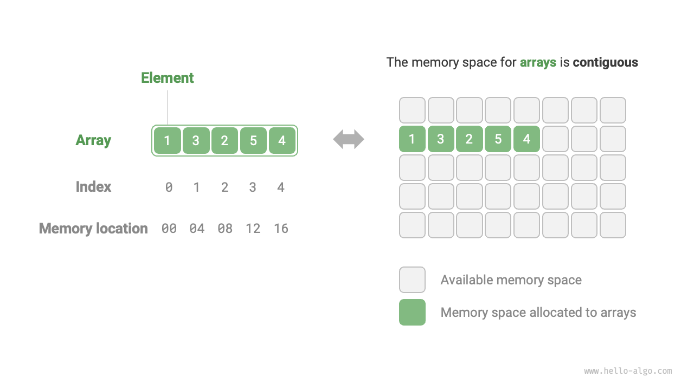
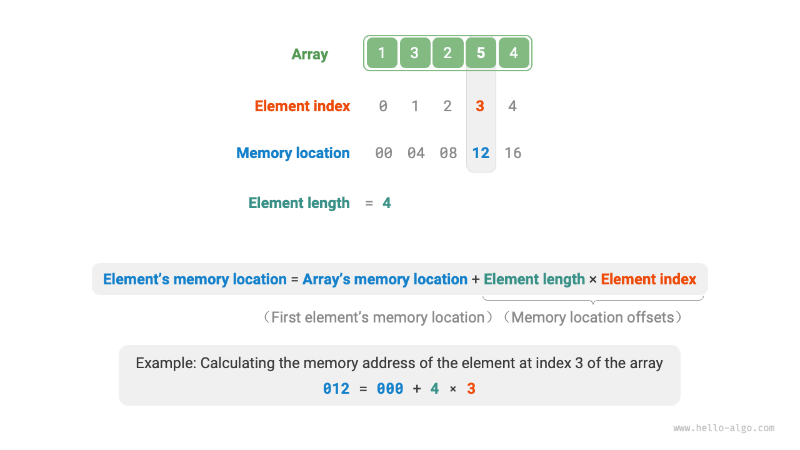
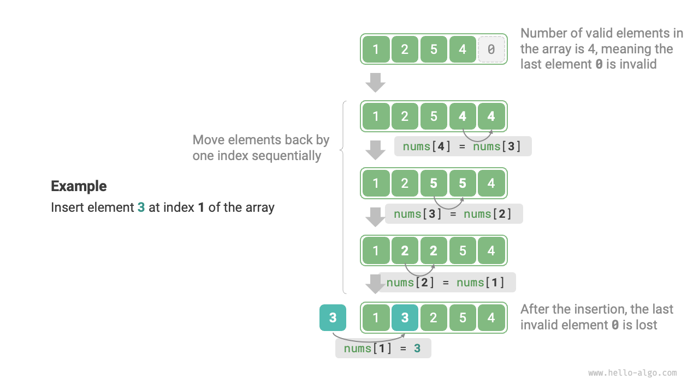
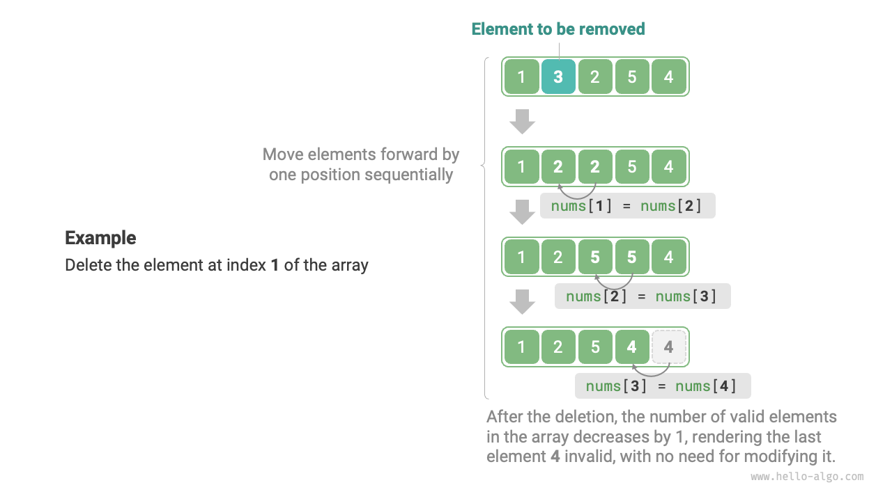

# 配列

<u>配列</u>は線形データ構造で、同じような項目が並んでいるようなもので、コンピュータのメモリ内の連続した空間に一緒に格納されます。これは整理された格納を維持するシーケンスのようなものです。この並びの各項目には、<u>インデックス</u>として知られる独自の「位置」があります。以下の図を参照して、配列の動作を観察し、これらの重要な用語を理解してください。



## 配列の一般的な操作

### 配列の初期化

配列は必要に応じて2つの方法で初期化できます：初期値なしまたは指定された初期値付きです。初期値が指定されていない場合、ほとんどのプログラミング言語は配列要素を$0$に設定します：

=== "Python"

    ```python title="array.py"
    # 配列を初期化
    arr: list[int] = [0] * 5  # [ 0, 0, 0, 0, 0 ]
    nums: list[int] = [1, 3, 2, 5, 4]
    ```

=== "C++"

    ```cpp title="array.cpp"
    /* 配列を初期化 */
    // スタックに格納
    int arr[5];
    int nums[5] = { 1, 3, 2, 5, 4 };
    // ヒープに格納（手動でのメモリ解放が必要）
    int* arr1 = new int[5];
    int* nums1 = new int[5] { 1, 3, 2, 5, 4 };
    ```

=== "Java"

    ```java title="array.java"
    /* 配列を初期化 */
    int[] arr = new int[5]; // { 0, 0, 0, 0, 0 }
    int[] nums = { 1, 3, 2, 5, 4 };
    ```

=== "C#"

    ```csharp title="array.cs"
    /* 配列を初期化 */
    int[] arr = new int[5]; // [ 0, 0, 0, 0, 0 ]
    int[] nums = [1, 3, 2, 5, 4];
    ```

=== "Go"

    ```go title="array.go"
    /* 配列を初期化 */
    var arr [5]int
    // Goでは、長さを指定（[5]int）すると配列を示し、指定しない（[]int）とスライスを示します。
    // Goの配列はコンパイル時に固定長を持つよう設計されているため、長さの指定には定数のみ使用できます。
    // extend()メソッドの実装の便宜上、ここではSliceを配列として扱います。
    nums := []int{1, 3, 2, 5, 4}
    ```

=== "Swift"

    ```swift title="array.swift"
    /* 配列を初期化 */
    let arr = Array(repeating: 0, count: 5) // [0, 0, 0, 0, 0]
    let nums = [1, 3, 2, 5, 4]
    ```

=== "JS"

    ```javascript title="array.js"
    /* 配列を初期化 */
    var arr = new Array(5).fill(0);
    var nums = [1, 3, 2, 5, 4];
    ```

=== "TS"

    ```typescript title="array.ts"
    /* 配列を初期化 */
    let arr: number[] = new Array(5).fill(0);
    let nums: number[] = [1, 3, 2, 5, 4];
    ```

=== "Dart"

    ```dart title="array.dart"
    /* 配列を初期化 */
    List<int> arr = List.filled(5, 0); // [0, 0, 0, 0, 0]
    List<int> nums = [1, 3, 2, 5, 4];
    ```

=== "Rust"

    ```rust title="array.rs"
    /* 配列を初期化 */
    let arr: [i32; 5] = [0; 5]; // [0, 0, 0, 0, 0]
    let slice: &[i32] = &[0; 5];
    // Rustでは、長さを指定（[i32; 5]）すると配列を示し、指定しない（&[i32]）とスライスを示します。
    // Rustの配列はコンパイル時に固定長を持つよう設計されているため、長さの指定には定数のみ使用できます。
    // 一般的にRustでは動的配列としてVectorが使用されます。
    // extend()メソッドの実装の便宜上、ここではベクターを配列として扱います。
    let nums: Vec<i32> = vec![1, 3, 2, 5, 4];
    ```

=== "C"

    ```c title="array.c"
    /* 配列を初期化 */
    int arr[5] = { 0 }; // { 0, 0, 0, 0, 0 }
    int nums[5] = { 1, 3, 2, 5, 4 };
    ```

=== "Kotlin"

    ```kotlin title="array.kt"

    ```

=== "Zig"

    ```zig title="array.zig"
    // 配列を初期化
    var arr = [_]i32{0} ** 5; // { 0, 0, 0, 0, 0 }
    var nums = [_]i32{ 1, 3, 2, 5, 4 };
    ```

### 要素へのアクセス

配列内の要素は連続したメモリ空間に格納されるため、各要素のメモリアドレスを計算することが簡単になります。以下の図に示されている公式は、配列のメモリアドレス（特に、最初の要素のアドレス）と要素のインデックスを利用して、要素のメモリアドレスを決定するのに役立ちます。この計算により、目的の要素への直接アクセスが合理化されます。



上の図で観察されるように、配列のインデックスは慣例的に$0$から始まります。これは直感に反するように見えるかもしれません。数を数えるのは通常$1$から始まるためですが、アドレス計算公式内では、**インデックスは本質的にメモリアドレスからのオフセット**です。最初の要素のアドレスでは、このオフセットは$0$で、そのインデックスが$0$であることを検証しています。

配列内の要素へのアクセスは非常に効率的で、$O(1)$時間で任意の要素にランダムアクセスできます。

```src
[file]{array}-[class]{}-[func]{random_access}
```

### 要素の挿入

配列要素はメモリ内で密に詰まっており、それらの間に追加データを収容するための空間はありません。以下の図に示すように、配列の中央に要素を挿入するには、後続のすべての要素を1つずつ後ろにシフトして、新しい要素のための空間を作る必要があります。



配列の長さが固定されているため、要素を挿入すると必然的に配列の最後の要素が失われることに注意することが重要です。この問題を解決する方法は「リスト」の章で探求されます。

```src
[file]{array}-[class]{}-[func]{insert}
```

### 要素の削除

同様に、以下の図に示すように、インデックス$i$の要素を削除するには、インデックス$i$に続くすべての要素を1つずつ前に移動する必要があります。



削除後、元の最後の要素は「意味がない」ものになるため、特定の修正は必要ないことに注意してください。

```src
[file]{array}-[class]{}-[func]{remove}
```

要約すると、配列の挿入と削除操作には以下の欠点があります：

- **高い時間計算量**：配列の挿入と削除の両方の平均時間計算量は$O(n)$で、ここで$n$は配列の長さです。
- **要素の損失**：配列の長さが固定されているため、挿入時に配列の容量を超える要素は失われます。
- **メモリの無駄**：より長い配列を初期化して前部分のみを利用すると、挿入時に「意味のない」末尾要素が生じ、メモリ空間の無駄につながります。

### 配列の走査

ほとんどのプログラミング言語では、インデックスを使用するか、各要素を直接反復することで配列を走査できます：

```src
[file]{array}-[class]{}-[func]{traverse}
```

### 要素の検索

配列内の特定の要素を見つけることは、配列を反復し、各要素をチェックして目的の値と一致するかどうかを決定することを含みます。

配列は線形データ構造であるため、この操作は一般的に「線形探索」と呼ばれます。

```src
[file]{array}-[class]{}-[func]{find}
```

### 配列の拡張

複雑なシステム環境では、安全な容量拡張のために配列の後にメモリ空間の可用性を確保することが困難になります。その結果、ほとんどのプログラミング言語では、**配列の長さは不変**です。

配列を拡張するには、より大きな配列を作成し、元の配列から要素をコピーする必要があります。この操作の時間計算量は$O(n)$で、大きな配列では時間がかかる可能性があります。コードは以下の通りです：

```src
[file]{array}-[class]{}-[func]{extend}
```

## 配列の利点と制限

配列は連続したメモリ空間に格納され、同じ型の要素で構成されます。このアプローチは、システムがデータ構造操作の効率を最適化するために活用できる実質的な事前情報を提供します。

- **高い空間効率**：配列はデータのための連続したメモリブロックを割り当て、追加の構造的オーバーヘッドの必要性を排除します。
- **ランダムアクセスのサポート**：配列は任意の要素への$O(1)$時間アクセスを可能にします。
- **キャッシュ局所性**：配列要素にアクセスするとき、コンピュータはそれらを読み込むだけでなく、周囲のデータもキャッシュし、高速キャッシュを利用して後続の操作速度を向上させます。

しかし、連続空間格納は諸刃の剣で、以下の制限があります：

- **挿入と削除の効率が低い**：配列に多くの要素が蓄積されると、要素の挿入や削除には大量の要素をシフトする必要があります。
- **固定長**：配列の長さは初期化後に固定されます。配列を拡張するには、すべてのデータを新しい配列にコピーする必要があり、大きなコストがかかります。
- **空間の無駄**：割り当てられた配列サイズが必要以上に大きい場合、余分な空間が無駄になります。

## 配列の典型的な応用

配列は基本的で広く使用されるデータ構造です。様々なアルゴリズムで頻繁に応用され、複雑なデータ構造の実装に役立ちます。

- **ランダムアクセス**：配列はランダムサンプリングが必要なときのデータ格納に理想的です。インデックスに基づいてランダムシーケンスを生成することで、効率的にランダムサンプリングを実現できます。
- **ソートと検索**：配列はソートと検索アルゴリズムで最も一般的に使用されるデータ構造です。クイックソート、マージソート、二分探索などの技術は主に配列で動作します。
- **ルックアップテーブル**：配列は迅速な要素や関係の取得のための効率的なルックアップテーブルとして機能します。例えば、文字をASCIIコードにマッピングすることは、ASCIIコード値をインデックスとして使用し、対応する要素を配列に格納することで簡単になります。
- **機械学習**：ニューラルネットワークの領域では、配列はベクトル、行列、テンソルを含む重要な線形代数演算の実行において重要な役割を果たします。配列はニューラルネットワークプログラミングにおいて主要かつ最も広範囲に使用されるデータ構造として機能します。
- **データ構造の実装**：配列は、スタック、キュー、ハッシュ表、ヒープ、グラフなど、様々なデータ構造を実装するための構成要素として機能します。例えば、グラフの隣接行列表現は本質的に二次元配列です。
