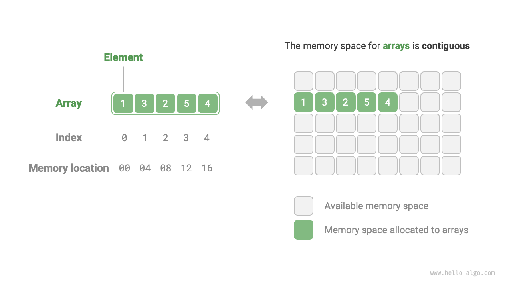
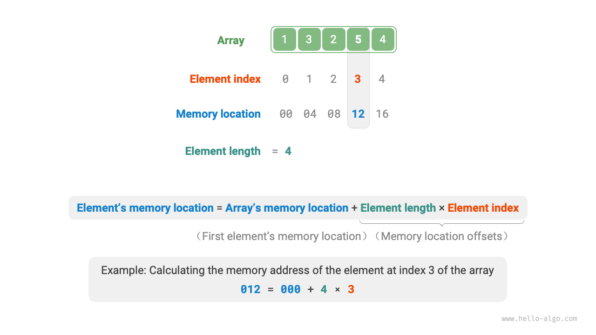
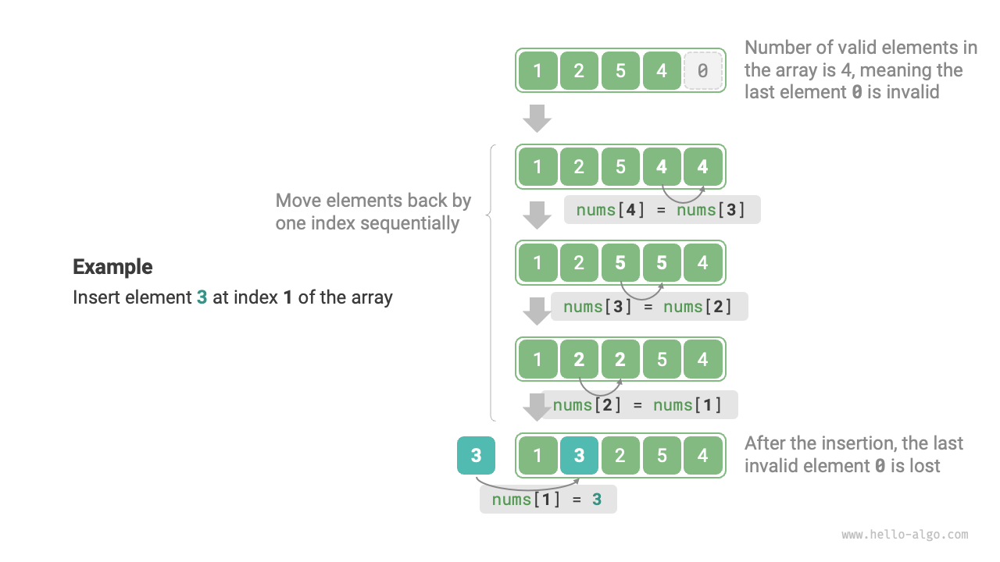
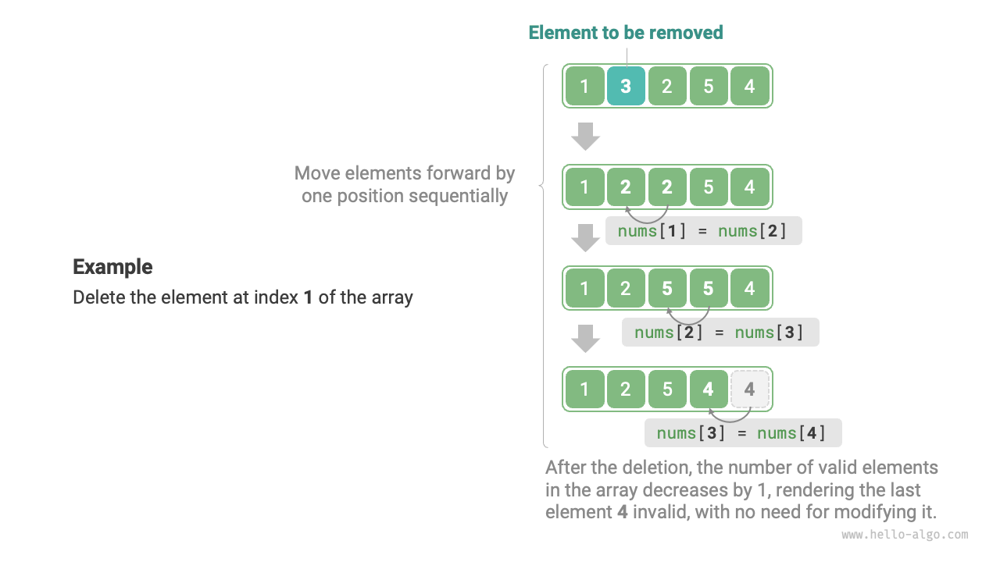

# 4.1 &nbsp; 配列

<u>配列（array）</u>は線形データ構造の一種であり、同じ型の要素を連続したメモリ領域に格納します。要素が配列内にある位置を、その要素の<u>インデックス（index）</u>と呼びます。下図は、配列の主要な概念と格納方式を示しています。

{ class="animation-figure" }

<p align="center"> 図 4-1 &nbsp; 配列の定義と格納方式 </p>

## 4.1.1 &nbsp; 配列の一般的な操作

### 1. &nbsp; 配列の初期化

必要に応じて、配列の初期化方法として初期値なしと初期値ありの 2 種類を使い分けられます。初期値を指定しない場合、多くのプログラミング言語では配列要素は $0$ に初期化されます。

=== "Python"

    ```python title="array.py"
    # 配列を初期化する
    arr: list[int] = [0] * 5  # [ 0, 0, 0, 0, 0 ]
    nums: list[int] = [1, 3, 2, 5, 4]
    ```

=== "C++"

    ```cpp title="array.cpp"
    /* 配列を初期化する */
    // スタック上に格納
    int arr[5];
    int nums[5] = { 1, 3, 2, 5, 4 };
    // ヒープ上に格納（手動で領域を解放する必要がある）
    int* arr1 = new int[5];
    int* nums1 = new int[5] { 1, 3, 2, 5, 4 };
    ```

=== "Java"

    ```java title="array.java"
    /* 配列を初期化する */
    int[] arr = new int[5]; // { 0, 0, 0, 0, 0 }
    int[] nums = { 1, 3, 2, 5, 4 };
    ```

=== "C#"

    ```csharp title="array.cs"
    /* 配列を初期化する */
    int[] arr = new int[5]; // [ 0, 0, 0, 0, 0 ]
    int[] nums = [1, 3, 2, 5, 4];
    ```

=== "Go"

    ```go title="array.go"
    /* 配列を初期化する */
    var arr [5]int
    // Go では、長さを指定する場合（[5]int）は配列であり、長さを指定しない場合（[]int）はスライス
    // Go の配列はコンパイル時に長さが確定するよう設計されているため、長さの指定には定数しか使用できない
    // 拡張 extend() メソッドを実装しやすくするため、以下ではスライス（Slice）を配列（Array）として扱う
    nums := []int{1, 3, 2, 5, 4}
    ```

=== "Swift"

    ```swift title="array.swift"
    /* 配列を初期化する */
    let arr = Array(repeating: 0, count: 5) // [0, 0, 0, 0, 0]
    let nums = [1, 3, 2, 5, 4]
    ```

=== "JS"

    ```javascript title="array.js"
    /* 配列を初期化する */
    var arr = new Array(5).fill(0);
    var nums = [1, 3, 2, 5, 4];
    ```

=== "TS"

    ```typescript title="array.ts"
    /* 配列を初期化する */
    let arr: number[] = new Array(5).fill(0);
    let nums: number[] = [1, 3, 2, 5, 4];
    ```

=== "Dart"

    ```dart title="array.dart"
    /* 配列を初期化する */
    List<int> arr = List.filled(5, 0); // [0, 0, 0, 0, 0]
    List<int> nums = [1, 3, 2, 5, 4];
    ```

=== "Rust"

    ```rust title="array.rs"
    /* 配列を初期化する */
    let arr: [i32; 5] = [0; 5]; // [0, 0, 0, 0, 0]
    let slice: &[i32] = &[0; 5];
    // Rust では、長さを指定する場合（[i32; 5]）は配列であり、長さを指定しない場合（&[i32]）はスライス
    // Rust の配列はコンパイル時に長さが確定するよう設計されているため、長さの指定には定数しか使用できない
    // Vector は Rust で一般に動的配列として使われる型
    // 拡張 extend() メソッドを実装しやすくするため、以下では vector を配列（array）として扱う
    let nums: Vec<i32> = vec![1, 3, 2, 5, 4];
    ```

=== "C"

    ```c title="array.c"
    /* 配列を初期化する */
    int arr[5] = { 0 }; // { 0, 0, 0, 0, 0 }
    int nums[5] = { 1, 3, 2, 5, 4 };
    ```

=== "Kotlin"

    ```kotlin title="array.kt"
    /* 配列を初期化する */
    var arr = IntArray(5) // { 0, 0, 0, 0, 0 }
    var nums = intArrayOf(1, 3, 2, 5, 4)
    ```

=== "Ruby"

    ```ruby title="array.rb"
    # 配列を初期化する
    arr = Array.new(5, 0)
    nums = [1, 3, 2, 5, 4]
    ```

??? pythontutor "実行の可視化"

    https://pythontutor.com/render.html#code=%23%20%E5%88%9D%E5%A7%8B%E5%8C%96%E6%95%B0%E7%BB%84%0Aarr%20%3D%20%5B0%5D%20*%205%20%20%23%20%5B%200,%200,%200,%200,%200%20%5D%0Anums%20%3D%20%5B1,%203,%202,%205,%204%5D&cumulative=false&curInstr=0&heapPrimitives=nevernest&mode=display&origin=opt-frontend.js&py=311&rawInputLstJSON=%5B%5D&textReferences=false

### 2. &nbsp; 要素へのアクセス

配列要素は連続したメモリ領域に格納されるため、要素のメモリアドレスの計算は非常に容易です。配列のメモリアドレス（先頭要素のメモリアドレス）とある要素のインデックスが与えられれば、下図の式を使ってその要素のメモリアドレスを計算でき、直接その要素にアクセスできます。

{ class="animation-figure" }

<p align="center"> 図 4-2 &nbsp; 配列要素のメモリアドレスの計算 </p>

上図を見ると、配列の最初の要素のインデックスは $0$ であり、これは少し直感に反するように思えます。というのも、$1$ から数え始めるほうが自然だからです。しかし、アドレス計算式の観点では、**インデックスの本質はメモリアドレスのオフセット**です。先頭要素のアドレスのオフセットは $0$ であるため、そのインデックスが $0$ なのは妥当です。

配列では要素へのアクセスは非常に効率的であり、$O(1)$ 時間で任意の要素にランダムアクセスできます。

=== "Python"

    ```python title="array.py"
    def random_access(nums: list[int]) -> int:
        """要素へランダムアクセス"""
        # 区間 [0, len(nums)-1] からランダムに数字を 1 つ選ぶ
        random_index = random.randint(0, len(nums) - 1)
        # ランダムな要素を取得して返す
        random_num = nums[random_index]
        return random_num
    ```

=== "C++"

    ```cpp title="array.cpp"
    /* 要素へランダムアクセス */
    int randomAccess(int *nums, int size) {
        // 区間 [0, size) からランダムに 1 つの数を選ぶ
        int randomIndex = rand() % size;
        // ランダムな要素を取得して返す
        int randomNum = nums[randomIndex];
        return randomNum;
    }
    ```

=== "Java"

    ```java title="array.java"
    /* 要素へランダムアクセス */
    int randomAccess(int[] nums) {
        // 区間 [0, nums.length) からランダムに 1 つの数を選ぶ
        int randomIndex = ThreadLocalRandom.current().nextInt(0, nums.length);
        // ランダムな要素を取得して返す
        int randomNum = nums[randomIndex];
        return randomNum;
    }
    ```

=== "C#"

    ```csharp title="array.cs"
    /* 要素へランダムアクセス */
    int RandomAccess(int[] nums) {
        Random random = new();
        // 区間 [0, nums.Length) からランダムに数字を 1 つ選ぶ
        int randomIndex = random.Next(nums.Length);
        // ランダムな要素を取得して返す
        int randomNum = nums[randomIndex];
        return randomNum;
    }
    ```

=== "Go"

    ```go title="array.go"
    /* 要素へランダムアクセス */
    func randomAccess(nums []int) (randomNum int) {
        // 区間 [0, nums.length) からランダムに 1 つの数を選ぶ
        randomIndex := rand.Intn(len(nums))
        // ランダムな要素を取得して返す
        randomNum = nums[randomIndex]
        return
    }
    ```

=== "Swift"

    ```swift title="array.swift"
    /* 要素へランダムアクセス */
    func randomAccess(nums: [Int]) -> Int {
        // 区間 [0, nums.count) からランダムに数字を 1 つ選ぶ
        let randomIndex = nums.indices.randomElement()!
        // ランダムな要素を取得して返す
        let randomNum = nums[randomIndex]
        return randomNum
    }
    ```

=== "JS"

    ```javascript title="array.js"
    /* 要素へランダムアクセス */
    function randomAccess(nums) {
        // 区間 [0, nums.length) からランダムに 1 つの数を選ぶ
        const random_index = Math.floor(Math.random() * nums.length);
        // ランダムな要素を取得して返す
        const random_num = nums[random_index];
        return random_num;
    }
    ```

=== "TS"

    ```typescript title="array.ts"
    /* 要素へランダムアクセス */
    function randomAccess(nums: number[]): number {
        // 区間 [0, nums.length) からランダムに 1 つの数を選ぶ
        const random_index = Math.floor(Math.random() * nums.length);
        // ランダムな要素を取得して返す
        const random_num = nums[random_index];
        return random_num;
    }
    ```

=== "Dart"

    ```dart title="array.dart"
    /* 要素へランダムアクセス */
    int randomAccess(List<int> nums) {
      // 区間 [0, nums.length) からランダムに 1 つの数を選ぶ
      int randomIndex = Random().nextInt(nums.length);
      // ランダムな要素を取得して返す
      int randomNum = nums[randomIndex];
      return randomNum;
    }
    ```

=== "Rust"

    ```rust title="array.rs"
    /* 要素へランダムアクセス */
    fn random_access(nums: &[i32]) -> i32 {
        // 区間 [0, nums.len()) からランダムに数字を 1 つ選ぶ
        let random_index = rand::thread_rng().gen_range(0..nums.len());
        // ランダムな要素を取得して返す
        let random_num = nums[random_index];
        random_num
    }
    ```

=== "C"

    ```c title="array.c"
    /* 要素へランダムアクセス */
    int randomAccess(int *nums, int size) {
        // 区間 [0, size) からランダムに 1 つの数を選ぶ
        int randomIndex = rand() % size;
        // ランダムな要素を取得して返す
        int randomNum = nums[randomIndex];
        return randomNum;
    }
    ```

=== "Kotlin"

    ```kotlin title="array.kt"
    /* 要素へランダムアクセス */
    fun randomAccess(nums: IntArray): Int {
        // 区間 [0, nums.size) からランダムに数字を 1 つ選ぶ
        val randomIndex = ThreadLocalRandom.current().nextInt(0, nums.size)
        // ランダムな要素を取得して返す
        val randomNum = nums[randomIndex]
        return randomNum
    }
    ```

=== "Ruby"

    ```ruby title="array.rb"
    ### 要素にランダムアクセス ###
    def random_access(nums)
      # 区間 [0, nums.length) からランダムに 1 つの数を選ぶ
      random_index = Random.rand(0...nums.length)

      # ランダムな要素を取得して返す
      nums[random_index]
    end
    ```

??? pythontutor "コードの可視化"

    <div style="height: 513px; width: 100%;"><iframe class="pythontutor-iframe" src="https://pythontutor.com/iframe-embed.html#code=import%20random%0A%0Adef%20random_access%28nums%3A%20list%5Bint%5D%29%20-%3E%20int%3A%0A%20%20%20%20%22%22%22%E8%A6%81%E7%B4%A0%E3%81%B8%E3%83%A9%E3%83%B3%E3%83%80%E3%83%A0%E3%82%A2%E3%82%AF%E3%82%BB%E3%82%B9%22%22%22%0A%20%20%20%20%23%20%E5%8C%BA%E9%96%93%20%5B0%2C%20len%28nums%29-1%5D%20%E3%81%8B%E3%82%89%E3%83%A9%E3%83%B3%E3%83%80%E3%83%A0%E3%81%AB%E6%95%B0%E5%AD%97%E3%82%92%201%20%E3%81%A4%E9%81%B8%E3%81%B6%0A%20%20%20%20random_index%20%3D%20random.randint%280%2C%20len%28nums%29%20-%201%29%0A%20%20%20%20%23%20%E3%83%A9%E3%83%B3%E3%83%80%E3%83%A0%E3%81%AA%E8%A6%81%E7%B4%A0%E3%82%92%E5%8F%96%E5%BE%97%E3%81%97%E3%81%A6%E8%BF%94%E3%81%99%0A%20%20%20%20random_num%20%3D%20nums%5Brandom_index%5D%0A%20%20%20%20return%20random_num%0A%0Aif%20__name__%20%3D%3D%20%22__main__%22%3A%0A%20%20%20%20%23%20%E9%85%8D%E5%88%97%E3%82%92%E5%88%9D%E6%9C%9F%E5%8C%96%0A%20%20%20%20nums%20%3D%20%5B1%2C%203%2C%202%2C%205%2C%204%5D%0A%20%20%20%20print%28%22%E9%85%8D%E5%88%97%20nums%20%3D%22%2C%20nums%29%0A%0A%20%20%20%20%23%20%E3%83%A9%E3%83%B3%E3%83%80%E3%83%A0%E3%82%A2%E3%82%AF%E3%82%BB%E3%82%B9%0A%20%20%20%20random_num%3A%20int%20%3D%20random_access%28nums%29%0A%20%20%20%20print%28%22nums%20%E3%81%8B%E3%82%89%E3%83%A9%E3%83%B3%E3%83%80%E3%83%A0%E3%81%AA%E8%A6%81%E7%B4%A0%E3%82%92%E5%8F%96%E5%BE%97%22%2C%20random_num%29&codeDivHeight=472&codeDivWidth=350&cumulative=false&curInstr=7&heapPrimitives=nevernest&origin=opt-frontend.js&py=311&rawInputLstJSON=%5B%5D&textReferences=false"> </iframe></div>
    <div style="margin-top: 5px;"><a href="https://pythontutor.com/iframe-embed.html#code=import%20random%0A%0Adef%20random_access%28nums%3A%20list%5Bint%5D%29%20-%3E%20int%3A%0A%20%20%20%20%22%22%22%E8%A6%81%E7%B4%A0%E3%81%B8%E3%83%A9%E3%83%B3%E3%83%80%E3%83%A0%E3%82%A2%E3%82%AF%E3%82%BB%E3%82%B9%22%22%22%0A%20%20%20%20%23%20%E5%8C%BA%E9%96%93%20%5B0%2C%20len%28nums%29-1%5D%20%E3%81%8B%E3%82%89%E3%83%A9%E3%83%B3%E3%83%80%E3%83%A0%E3%81%AB%E6%95%B0%E5%AD%97%E3%82%92%201%20%E3%81%A4%E9%81%B8%E3%81%B6%0A%20%20%20%20random_index%20%3D%20random.randint%280%2C%20len%28nums%29%20-%201%29%0A%20%20%20%20%23%20%E3%83%A9%E3%83%B3%E3%83%80%E3%83%A0%E3%81%AA%E8%A6%81%E7%B4%A0%E3%82%92%E5%8F%96%E5%BE%97%E3%81%97%E3%81%A6%E8%BF%94%E3%81%99%0A%20%20%20%20random_num%20%3D%20nums%5Brandom_index%5D%0A%20%20%20%20return%20random_num%0A%0Aif%20__name__%20%3D%3D%20%22__main__%22%3A%0A%20%20%20%20%23%20%E9%85%8D%E5%88%97%E3%82%92%E5%88%9D%E6%9C%9F%E5%8C%96%0A%20%20%20%20nums%20%3D%20%5B1%2C%203%2C%202%2C%205%2C%204%5D%0A%20%20%20%20print%28%22%E9%85%8D%E5%88%97%20nums%20%3D%22%2C%20nums%29%0A%0A%20%20%20%20%23%20%E3%83%A9%E3%83%B3%E3%83%80%E3%83%A0%E3%82%A2%E3%82%AF%E3%82%BB%E3%82%B9%0A%20%20%20%20random_num%3A%20int%20%3D%20random_access%28nums%29%0A%20%20%20%20print%28%22nums%20%E3%81%8B%E3%82%89%E3%83%A9%E3%83%B3%E3%83%80%E3%83%A0%E3%81%AA%E8%A6%81%E7%B4%A0%E3%82%92%E5%8F%96%E5%BE%97%22%2C%20random_num%29&codeDivHeight=800&codeDivWidth=600&cumulative=false&curInstr=7&heapPrimitives=nevernest&origin=opt-frontend.js&py=311&rawInputLstJSON=%5B%5D&textReferences=false" target="_blank" rel="noopener noreferrer">全画面で見る ></a></div>

### 3. &nbsp; 要素の挿入

配列要素はメモリ内で「ぴったり隣接して」おり、その間にほかのデータを格納する余地はありません。下図のように、配列の途中に要素を挿入したい場合は、その要素より後ろにあるすべての要素を 1 つずつ後ろへずらし、その後でそのインデックスに要素を代入する必要があります。

{ class="animation-figure" }

<p align="center"> 図 4-3 &nbsp; 配列への要素挿入の例 </p>

注意すべき点として、配列の長さは固定であるため、要素を 1 つ挿入すると配列末尾の要素が必ず「失われ」ます。この問題の解決策は「リスト」の章で扱います。

=== "Python"

    ```python title="array.py"
    def insert(nums: list[int], num: int, index: int):
        """配列の index 番目に要素 num を挿入"""
        # インデックス index 以降の全要素を 1 つ後ろへ移動する
        for i in range(len(nums) - 1, index, -1):
            nums[i] = nums[i - 1]
        # index の要素に num を代入する
        nums[index] = num
    ```

=== "C++"

    ```cpp title="array.cpp"
    /* 配列の index 番目に要素 num を挿入 */
    void insert(int *nums, int size, int num, int index) {
        // インデックス index 以降の全要素を 1 つ後ろへ移動する
        for (int i = size - 1; i > index; i--) {
            nums[i] = nums[i - 1];
        }
        // index の要素に num を代入する
        nums[index] = num;
    }
    ```

=== "Java"

    ```java title="array.java"
    /* 配列の index 番目に要素 num を挿入 */
    void insert(int[] nums, int num, int index) {
        // インデックス index 以降の全要素を 1 つ後ろへ移動する
        for (int i = nums.length - 1; i > index; i--) {
            nums[i] = nums[i - 1];
        }
        // index の要素に num を代入する
        nums[index] = num;
    }
    ```

=== "C#"

    ```csharp title="array.cs"
    /* 配列の index 番目に要素 num を挿入 */
    void Insert(int[] nums, int num, int index) {
        // インデックス index 以降の全要素を 1 つ後ろへ移動する
        for (int i = nums.Length - 1; i > index; i--) {
            nums[i] = nums[i - 1];
        }
        // index の要素に num を代入する
        nums[index] = num;
    }
    ```

=== "Go"

    ```go title="array.go"
    /* 配列の index 番目に要素 num を挿入 */
    func insert(nums []int, num int, index int) {
        // インデックス index 以降の全要素を 1 つ後ろへ移動する
        for i := len(nums) - 1; i > index; i-- {
            nums[i] = nums[i-1]
        }
        // index の要素に num を代入する
        nums[index] = num
    }
    ```

=== "Swift"

    ```swift title="array.swift"
    /* 配列の index 番目に要素 num を挿入 */
    func insert(nums: inout [Int], num: Int, index: Int) {
        // インデックス index 以降の全要素を 1 つ後ろへ移動する
        for i in nums.indices.dropFirst(index).reversed() {
            nums[i] = nums[i - 1]
        }
        // index の要素に num を代入する
        nums[index] = num
    }
    ```

=== "JS"

    ```javascript title="array.js"
    /* 配列の index 番目に要素 num を挿入 */
    function insert(nums, num, index) {
        // インデックス index 以降の全要素を 1 つ後ろへ移動する
        for (let i = nums.length - 1; i > index; i--) {
            nums[i] = nums[i - 1];
        }
        // index の要素に num を代入する
        nums[index] = num;
    }
    ```

=== "TS"

    ```typescript title="array.ts"
    /* 配列の index 番目に要素 num を挿入 */
    function insert(nums: number[], num: number, index: number): void {
        // インデックス index 以降の全要素を 1 つ後ろへ移動する
        for (let i = nums.length - 1; i > index; i--) {
            nums[i] = nums[i - 1];
        }
        // index の要素に num を代入する
        nums[index] = num;
    }
    ```

=== "Dart"

    ```dart title="array.dart"
    /* 配列の添字 index に要素 _num を挿入 */
    void insert(List<int> nums, int _num, int index) {
      // インデックス index 以降の全要素を 1 つ後ろへ移動する
      for (var i = nums.length - 1; i > index; i--) {
        nums[i] = nums[i - 1];
      }
      // _num を index の位置の要素に代入
      nums[index] = _num;
    }
    ```

=== "Rust"

    ```rust title="array.rs"
    /* 配列の index 番目に要素 num を挿入 */
    fn insert(nums: &mut [i32], num: i32, index: usize) {
        // インデックス index 以降の全要素を 1 つ後ろへ移動する
        for i in (index + 1..nums.len()).rev() {
            nums[i] = nums[i - 1];
        }
        // index の要素に num を代入する
        nums[index] = num;
    }
    ```

=== "C"

    ```c title="array.c"
    /* 配列の index 番目に要素 num を挿入 */
    void insert(int *nums, int size, int num, int index) {
        // インデックス index 以降の全要素を 1 つ後ろへ移動する
        for (int i = size - 1; i > index; i--) {
            nums[i] = nums[i - 1];
        }
        // index の要素に num を代入する
        nums[index] = num;
    }
    ```

=== "Kotlin"

    ```kotlin title="array.kt"
    /* 配列の index 番目に要素 num を挿入 */
    fun insert(nums: IntArray, num: Int, index: Int) {
        // インデックス index 以降の全要素を 1 つ後ろへ移動する
        for (i in nums.size - 1 downTo index + 1) {
            nums[i] = nums[i - 1]
        }
        // index の要素に num を代入する
        nums[index] = num
    }
    ```

=== "Ruby"

    ```ruby title="array.rb"
    ### 配列のインデックス index に要素 num を挿入 ###
    def insert(nums, num, index)
      # インデックス index 以降の全要素を 1 つ後ろへ移動する
      for i in (nums.length - 1).downto(index + 1)
        nums[i] = nums[i - 1]
      end

      # index の要素に num を代入する
      nums[index] = num
    end
    ```

??? pythontutor "コードの可視化"

    <div style="height: 477px; width: 100%;"><iframe class="pythontutor-iframe" src="https://pythontutor.com/iframe-embed.html#code=def%20insert%28nums%3A%20list%5Bint%5D%2C%20num%3A%20int%2C%20index%3A%20int%29%3A%0A%20%20%20%20%22%22%22%E9%85%8D%E5%88%97%E3%81%AE%20index%20%E7%95%AA%E7%9B%AE%E3%81%AB%E8%A6%81%E7%B4%A0%20num%20%E3%82%92%E6%8C%BF%E5%85%A5%22%22%22%0A%20%20%20%20%23%20%E3%82%A4%E3%83%B3%E3%83%87%E3%83%83%E3%82%AF%E3%82%B9%20index%20%E4%BB%A5%E9%99%8D%E3%81%AE%E5%85%A8%E8%A6%81%E7%B4%A0%E3%82%92%201%20%E3%81%A4%E5%BE%8C%E3%82%8D%E3%81%B8%E7%A7%BB%E5%8B%95%E3%81%99%E3%82%8B%0A%20%20%20%20for%20i%20in%20range%28len%28nums%29%20-%201%2C%20index%2C%20-1%29%3A%0A%20%20%20%20%20%20%20%20nums%5Bi%5D%20%3D%20nums%5Bi%20-%201%5D%0A%20%20%20%20%23%20index%20%E3%81%AE%E8%A6%81%E7%B4%A0%E3%81%AB%20num%20%E3%82%92%E4%BB%A3%E5%85%A5%E3%81%99%E3%82%8B%0A%20%20%20%20nums%5Bindex%5D%20%3D%20num%0A%0Aif%20__name__%20%3D%3D%20%22__main__%22%3A%0A%20%20%20%20%23%20%E9%85%8D%E5%88%97%E3%82%92%E5%88%9D%E6%9C%9F%E5%8C%96%0A%20%20%20%20nums%20%3D%20%5B1%2C%203%2C%202%2C%205%2C%204%5D%0A%20%20%20%20print%28%22%E9%85%8D%E5%88%97%20nums%20%3D%22%2C%20nums%29%0A%0A%20%20%20%20%23%20%E8%A6%81%E7%B4%A0%E3%82%92%E6%8C%BF%E5%85%A5%E3%81%99%E3%82%8B%0A%20%20%20%20insert%28nums%2C%206%2C%203%29%0A%20%20%20%20print%28%22%E3%82%A4%E3%83%B3%E3%83%87%E3%83%83%E3%82%AF%E3%82%B9%203%20%E3%81%AB%E6%95%B0%E5%80%A4%206%20%E3%82%92%E6%8C%BF%E5%85%A5%E3%81%97%E3%80%81nums%20%3D%22%2C%20nums%29&codeDivHeight=472&codeDivWidth=350&cumulative=false&curInstr=6&heapPrimitives=nevernest&origin=opt-frontend.js&py=311&rawInputLstJSON=%5B%5D&textReferences=false"> </iframe></div>
    <div style="margin-top: 5px;"><a href="https://pythontutor.com/iframe-embed.html#code=def%20insert%28nums%3A%20list%5Bint%5D%2C%20num%3A%20int%2C%20index%3A%20int%29%3A%0A%20%20%20%20%22%22%22%E9%85%8D%E5%88%97%E3%81%AE%20index%20%E7%95%AA%E7%9B%AE%E3%81%AB%E8%A6%81%E7%B4%A0%20num%20%E3%82%92%E6%8C%BF%E5%85%A5%22%22%22%0A%20%20%20%20%23%20%E3%82%A4%E3%83%B3%E3%83%87%E3%83%83%E3%82%AF%E3%82%B9%20index%20%E4%BB%A5%E9%99%8D%E3%81%AE%E5%85%A8%E8%A6%81%E7%B4%A0%E3%82%92%201%20%E3%81%A4%E5%BE%8C%E3%82%8D%E3%81%B8%E7%A7%BB%E5%8B%95%E3%81%99%E3%82%8B%0A%20%20%20%20for%20i%20in%20range%28len%28nums%29%20-%201%2C%20index%2C%20-1%29%3A%0A%20%20%20%20%20%20%20%20nums%5Bi%5D%20%3D%20nums%5Bi%20-%201%5D%0A%20%20%20%20%23%20index%20%E3%81%AE%E8%A6%81%E7%B4%A0%E3%81%AB%20num%20%E3%82%92%E4%BB%A3%E5%85%A5%E3%81%99%E3%82%8B%0A%20%20%20%20nums%5Bindex%5D%20%3D%20num%0A%0Aif%20__name__%20%3D%3D%20%22__main__%22%3A%0A%20%20%20%20%23%20%E9%85%8D%E5%88%97%E3%82%92%E5%88%9D%E6%9C%9F%E5%8C%96%0A%20%20%20%20nums%20%3D%20%5B1%2C%203%2C%202%2C%205%2C%204%5D%0A%20%20%20%20print%28%22%E9%85%8D%E5%88%97%20nums%20%3D%22%2C%20nums%29%0A%0A%20%20%20%20%23%20%E8%A6%81%E7%B4%A0%E3%82%92%E6%8C%BF%E5%85%A5%E3%81%99%E3%82%8B%0A%20%20%20%20insert%28nums%2C%206%2C%203%29%0A%20%20%20%20print%28%22%E3%82%A4%E3%83%B3%E3%83%87%E3%83%83%E3%82%AF%E3%82%B9%203%20%E3%81%AB%E6%95%B0%E5%80%A4%206%20%E3%82%92%E6%8C%BF%E5%85%A5%E3%81%97%E3%80%81nums%20%3D%22%2C%20nums%29&codeDivHeight=800&codeDivWidth=600&cumulative=false&curInstr=6&heapPrimitives=nevernest&origin=opt-frontend.js&py=311&rawInputLstJSON=%5B%5D&textReferences=false" target="_blank" rel="noopener noreferrer">全画面で見る ></a></div>

### 4. &nbsp; 要素の削除

同様に、下図のように、インデックス $i$ の要素を削除したい場合は、インデックス $i$ より後ろの要素をすべて 1 つずつ前へずらす必要があります。

{ class="animation-figure" }

<p align="center"> 図 4-4 &nbsp; 配列からの要素削除の例 </p>

注意してください。要素の削除が完了すると、もともとの末尾要素は「意味を持たない」状態になるため、わざわざ変更する必要はありません。

=== "Python"

    ```python title="array.py"
    def remove(nums: list[int], index: int):
        """index の要素を削除する"""
        # インデックス index より後ろの全要素を 1 つ前へ移動する
        for i in range(index, len(nums) - 1):
            nums[i] = nums[i + 1]
    ```

=== "C++"

    ```cpp title="array.cpp"
    /* index の要素を削除する */
    void remove(int *nums, int size, int index) {
        // インデックス index より後ろの全要素を 1 つ前へ移動する
        for (int i = index; i < size - 1; i++) {
            nums[i] = nums[i + 1];
        }
    }
    ```

=== "Java"

    ```java title="array.java"
    /* index の要素を削除する */
    void remove(int[] nums, int index) {
        // インデックス index より後ろの全要素を 1 つ前へ移動する
        for (int i = index; i < nums.length - 1; i++) {
            nums[i] = nums[i + 1];
        }
    }
    ```

=== "C#"

    ```csharp title="array.cs"
    /* index の要素を削除する */
    void Remove(int[] nums, int index) {
        // インデックス index より後ろの全要素を 1 つ前へ移動する
        for (int i = index; i < nums.Length - 1; i++) {
            nums[i] = nums[i + 1];
        }
    }
    ```

=== "Go"

    ```go title="array.go"
    /* index の要素を削除する */
    func remove(nums []int, index int) {
        // インデックス index より後ろの全要素を 1 つ前へ移動する
        for i := index; i < len(nums)-1; i++ {
            nums[i] = nums[i+1]
        }
    }
    ```

=== "Swift"

    ```swift title="array.swift"
    /* index の要素を削除する */
    func remove(nums: inout [Int], index: Int) {
        // インデックス index より後ろの全要素を 1 つ前へ移動する
        for i in nums.indices.dropFirst(index).dropLast() {
            nums[i] = nums[i + 1]
        }
    }
    ```

=== "JS"

    ```javascript title="array.js"
    /* index の要素を削除する */
    function remove(nums, index) {
        // インデックス index より後ろの全要素を 1 つ前へ移動する
        for (let i = index; i < nums.length - 1; i++) {
            nums[i] = nums[i + 1];
        }
    }
    ```

=== "TS"

    ```typescript title="array.ts"
    /* index の要素を削除する */
    function remove(nums: number[], index: number): void {
        // インデックス index より後ろの全要素を 1 つ前へ移動する
        for (let i = index; i < nums.length - 1; i++) {
            nums[i] = nums[i + 1];
        }
    }
    ```

=== "Dart"

    ```dart title="array.dart"
    /* index の要素を削除する */
    void remove(List<int> nums, int index) {
      // インデックス index より後ろの全要素を 1 つ前へ移動する
      for (var i = index; i < nums.length - 1; i++) {
        nums[i] = nums[i + 1];
      }
    }
    ```

=== "Rust"

    ```rust title="array.rs"
    /* index の要素を削除する */
    fn remove(nums: &mut [i32], index: usize) {
        // インデックス index より後ろの全要素を 1 つ前へ移動する
        for i in index..nums.len() - 1 {
            nums[i] = nums[i + 1];
        }
    }
    ```

=== "C"

    ```c title="array.c"
    /* index の要素を削除する */
    // 注意: stdio.h が remove 識別子を使用している
    void removeItem(int *nums, int size, int index) {
        // インデックス index より後ろの全要素を 1 つ前へ移動する
        for (int i = index; i < size - 1; i++) {
            nums[i] = nums[i + 1];
        }
    }
    ```

=== "Kotlin"

    ```kotlin title="array.kt"
    /* index の要素を削除する */
    fun remove(nums: IntArray, index: Int) {
        // インデックス index より後ろの全要素を 1 つ前へ移動する
        for (i in index..<nums.size - 1) {
            nums[i] = nums[i + 1]
        }
    }
    ```

=== "Ruby"

    ```ruby title="array.rb"
    ### インデックス index の要素を削除 ###
    def remove(nums, index)
      # インデックス index より後ろの全要素を 1 つ前へ移動する
      for i in index...(nums.length - 1)
        nums[i] = nums[i + 1]
      end
    end
    ```

??? pythontutor "コードの可視化"

    <div style="height: 441px; width: 100%;"><iframe class="pythontutor-iframe" src="https://pythontutor.com/iframe-embed.html#code=def%20remove%28nums%3A%20list%5Bint%5D%2C%20index%3A%20int%29%3A%0A%20%20%20%20%22%22%22index%20%E3%81%AE%E8%A6%81%E7%B4%A0%E3%82%92%E5%89%8A%E9%99%A4%E3%81%99%E3%82%8B%22%22%22%0A%20%20%20%20%23%20%E3%82%A4%E3%83%B3%E3%83%87%E3%83%83%E3%82%AF%E3%82%B9%20index%20%E3%82%88%E3%82%8A%E5%BE%8C%E3%82%8D%E3%81%AE%E5%85%A8%E8%A6%81%E7%B4%A0%E3%82%92%201%20%E3%81%A4%E5%89%8D%E3%81%B8%E7%A7%BB%E5%8B%95%E3%81%99%E3%82%8B%0A%20%20%20%20for%20i%20in%20range%28index%2C%20len%28nums%29%20-%201%29%3A%0A%20%20%20%20%20%20%20%20nums%5Bi%5D%20%3D%20nums%5Bi%20%2B%201%5D%0A%0Aif%20__name__%20%3D%3D%20%22__main__%22%3A%0A%20%20%20%20%23%20%E9%85%8D%E5%88%97%E3%82%92%E5%88%9D%E6%9C%9F%E5%8C%96%0A%20%20%20%20nums%20%3D%20%5B1%2C%203%2C%202%2C%205%2C%204%5D%0A%20%20%20%20print%28%22%E9%85%8D%E5%88%97%20nums%20%3D%22%2C%20nums%29%0A%0A%20%20%20%20%23%20%E8%A6%81%E7%B4%A0%E3%82%92%E5%89%8A%E9%99%A4%0A%20%20%20%20remove%28nums%2C%202%29%0A%20%20%20%20print%28%22%E3%82%A4%E3%83%B3%E3%83%87%E3%83%83%E3%82%AF%E3%82%B9%202%20%E3%81%AE%E8%A6%81%E7%B4%A0%E3%82%92%E5%89%8A%E9%99%A4%E3%81%97%E3%80%81nums%20%3D%22%2C%20nums%29&codeDivHeight=472&codeDivWidth=350&cumulative=false&curInstr=6&heapPrimitives=nevernest&origin=opt-frontend.js&py=311&rawInputLstJSON=%5B%5D&textReferences=false"> </iframe></div>
    <div style="margin-top: 5px;"><a href="https://pythontutor.com/iframe-embed.html#code=def%20remove%28nums%3A%20list%5Bint%5D%2C%20index%3A%20int%29%3A%0A%20%20%20%20%22%22%22index%20%E3%81%AE%E8%A6%81%E7%B4%A0%E3%82%92%E5%89%8A%E9%99%A4%E3%81%99%E3%82%8B%22%22%22%0A%20%20%20%20%23%20%E3%82%A4%E3%83%B3%E3%83%87%E3%83%83%E3%82%AF%E3%82%B9%20index%20%E3%82%88%E3%82%8A%E5%BE%8C%E3%82%8D%E3%81%AE%E5%85%A8%E8%A6%81%E7%B4%A0%E3%82%92%201%20%E3%81%A4%E5%89%8D%E3%81%B8%E7%A7%BB%E5%8B%95%E3%81%99%E3%82%8B%0A%20%20%20%20for%20i%20in%20range%28index%2C%20len%28nums%29%20-%201%29%3A%0A%20%20%20%20%20%20%20%20nums%5Bi%5D%20%3D%20nums%5Bi%20%2B%201%5D%0A%0Aif%20__name__%20%3D%3D%20%22__main__%22%3A%0A%20%20%20%20%23%20%E9%85%8D%E5%88%97%E3%82%92%E5%88%9D%E6%9C%9F%E5%8C%96%0A%20%20%20%20nums%20%3D%20%5B1%2C%203%2C%202%2C%205%2C%204%5D%0A%20%20%20%20print%28%22%E9%85%8D%E5%88%97%20nums%20%3D%22%2C%20nums%29%0A%0A%20%20%20%20%23%20%E8%A6%81%E7%B4%A0%E3%82%92%E5%89%8A%E9%99%A4%0A%20%20%20%20remove%28nums%2C%202%29%0A%20%20%20%20print%28%22%E3%82%A4%E3%83%B3%E3%83%87%E3%83%83%E3%82%AF%E3%82%B9%202%20%E3%81%AE%E8%A6%81%E7%B4%A0%E3%82%92%E5%89%8A%E9%99%A4%E3%81%97%E3%80%81nums%20%3D%22%2C%20nums%29&codeDivHeight=800&codeDivWidth=600&cumulative=false&curInstr=6&heapPrimitives=nevernest&origin=opt-frontend.js&py=311&rawInputLstJSON=%5B%5D&textReferences=false" target="_blank" rel="noopener noreferrer">全画面で見る ></a></div>

全体として見ると、配列の挿入と削除には次の欠点があります。

- **時間計算量が高い**：配列の挿入と削除の平均時間計算量はいずれも $O(n)$ であり、ここで $n$ は配列長です。
- **要素が失われる**：配列の長さは不変であるため、要素を挿入すると配列長の範囲を超えた要素は失われます。
- **メモリの浪費**：やや長めの配列を初期化して先頭部分だけを使うこともでき、この場合データ挿入時に失われる末尾要素はすべて「無意味」ですが、その代わり一部のメモリ領域が無駄になります。

### 5. &nbsp; 配列の走査

ほとんどのプログラミング言語では、インデックスを使って配列を走査することも、各要素を直接取り出しながら走査することもできます。

=== "Python"

    ```python title="array.py"
    def traverse(nums: list[int]):
        """配列を走査"""
        count = 0
        # インデックスで配列を走査
        for i in range(len(nums)):
            count += nums[i]
        # 配列要素を直接走査
        for num in nums:
            count += num
        # データのインデックスと要素を同時に走査する
        for i, num in enumerate(nums):
            count += nums[i]
            count += num
    ```

=== "C++"

    ```cpp title="array.cpp"
    /* 配列を走査 */
    void traverse(int *nums, int size) {
        int count = 0;
        // インデックスで配列を走査
        for (int i = 0; i < size; i++) {
            count += nums[i];
        }
    }
    ```

=== "Java"

    ```java title="array.java"
    /* 配列を走査 */
    void traverse(int[] nums) {
        int count = 0;
        // インデックスで配列を走査
        for (int i = 0; i < nums.length; i++) {
            count += nums[i];
        }
        // 配列要素を直接走査
        for (int num : nums) {
            count += num;
        }
    }
    ```

=== "C#"

    ```csharp title="array.cs"
    /* 配列を走査 */
    void Traverse(int[] nums) {
        int count = 0;
        // インデックスで配列を走査
        for (int i = 0; i < nums.Length; i++) {
            count += nums[i];
        }
        // 配列要素を直接走査
        foreach (int num in nums) {
            count += num;
        }
    }
    ```

=== "Go"

    ```go title="array.go"
    /* 配列を走査 */
    func traverse(nums []int) {
        count := 0
        // インデックスで配列を走査
        for i := 0; i < len(nums); i++ {
            count += nums[i]
        }
        count = 0
        // 配列要素を直接走査
        for _, num := range nums {
            count += num
        }
        // データのインデックスと要素を同時に走査する
        for i, num := range nums {
            count += nums[i]
            count += num
        }
    }
    ```

=== "Swift"

    ```swift title="array.swift"
    /* 配列を走査 */
    func traverse(nums: [Int]) {
        var count = 0
        // インデックスで配列を走査
        for i in nums.indices {
            count += nums[i]
        }
        // 配列要素を直接走査
        for num in nums {
            count += num
        }
        // データのインデックスと要素を同時に走査する
        for (i, num) in nums.enumerated() {
            count += nums[i]
            count += num
        }
    }
    ```

=== "JS"

    ```javascript title="array.js"
    /* 配列を走査 */
    function traverse(nums) {
        let count = 0;
        // インデックスで配列を走査
        for (let i = 0; i < nums.length; i++) {
            count += nums[i];
        }
        // 配列要素を直接走査
        for (const num of nums) {
            count += num;
        }
    }
    ```

=== "TS"

    ```typescript title="array.ts"
    /* 配列を走査 */
    function traverse(nums: number[]): void {
        let count = 0;
        // インデックスで配列を走査
        for (let i = 0; i < nums.length; i++) {
            count += nums[i];
        }
        // 配列要素を直接走査
        for (const num of nums) {
            count += num;
        }
    }
    ```

=== "Dart"

    ```dart title="array.dart"
    /* 配列要素を走査する */
    void traverse(List<int> nums) {
      int count = 0;
      // インデックスで配列を走査
      for (var i = 0; i < nums.length; i++) {
        count += nums[i];
      }
      // 配列要素を直接走査
      for (int _num in nums) {
        count += _num;
      }
      // forEach メソッドで配列を走査する
      nums.forEach((_num) {
        count += _num;
      });
    }
    ```

=== "Rust"

    ```rust title="array.rs"
    /* 配列を走査 */
    fn traverse(nums: &[i32]) {
        let mut _count = 0;
        // インデックスで配列を走査
        for i in 0..nums.len() {
            _count += nums[i];
        }
        // 配列要素を直接走査
        _count = 0;
        for &num in nums {
            _count += num;
        }
    }
    ```

=== "C"

    ```c title="array.c"
    /* 配列を走査 */
    void traverse(int *nums, int size) {
        int count = 0;
        // インデックスで配列を走査
        for (int i = 0; i < size; i++) {
            count += nums[i];
        }
    }
    ```

=== "Kotlin"

    ```kotlin title="array.kt"
    /* 配列を走査 */
    fun traverse(nums: IntArray) {
        var count = 0
        // インデックスで配列を走査
        for (i in nums.indices) {
            count += nums[i]
        }
        // 配列要素を直接走査
        for (j in nums) {
            count += j
        }
    }
    ```

=== "Ruby"

    ```ruby title="array.rb"
    ### 配列を走査 ###
    def traverse(nums)
      count = 0

      # インデックスで配列を走査
      for i in 0...nums.length
        count += nums[i]
      end

      # 配列要素を直接走査
      for num in nums
        count += num
      end
    end
    ```

??? pythontutor "コードの可視化"

    <div style="height: 549px; width: 100%;"><iframe class="pythontutor-iframe" src="https://pythontutor.com/iframe-embed.html#code=def%20traverse%28nums%3A%20list%5Bint%5D%29%3A%0A%20%20%20%20%22%22%22%E9%85%8D%E5%88%97%E3%82%92%E8%B5%B0%E6%9F%BB%22%22%22%0A%20%20%20%20count%20%3D%200%0A%20%20%20%20%23%20%E3%82%A4%E3%83%B3%E3%83%87%E3%83%83%E3%82%AF%E3%82%B9%E3%81%A7%E9%85%8D%E5%88%97%E3%82%92%E8%B5%B0%E6%9F%BB%0A%20%20%20%20for%20i%20in%20range%28len%28nums%29%29%3A%0A%20%20%20%20%20%20%20%20count%20%2B%3D%20nums%5Bi%5D%0A%20%20%20%20%23%20%E9%85%8D%E5%88%97%E8%A6%81%E7%B4%A0%E3%82%92%E7%9B%B4%E6%8E%A5%E8%B5%B0%E6%9F%BB%0A%20%20%20%20for%20num%20in%20nums%3A%0A%20%20%20%20%20%20%20%20count%20%2B%3D%20num%0A%20%20%20%20%23%20%E3%83%87%E3%83%BC%E3%82%BF%E3%81%AE%E3%82%A4%E3%83%B3%E3%83%87%E3%83%83%E3%82%AF%E3%82%B9%E3%81%A8%E8%A6%81%E7%B4%A0%E3%82%92%E5%90%8C%E6%99%82%E3%81%AB%E8%B5%B0%E6%9F%BB%E3%81%99%E3%82%8B%0A%20%20%20%20for%20i%2C%20num%20in%20enumerate%28nums%29%3A%0A%20%20%20%20%20%20%20%20count%20%2B%3D%20nums%5Bi%5D%0A%20%20%20%20%20%20%20%20count%20%2B%3D%20num%0A%0Aif%20__name__%20%3D%3D%20%22__main__%22%3A%0A%20%20%20%20%23%20%E9%85%8D%E5%88%97%E3%82%92%E5%88%9D%E6%9C%9F%E5%8C%96%0A%20%20%20%20nums%20%3D%20%5B1%2C%203%2C%202%2C%205%2C%204%5D%0A%20%20%20%20print%28%22%E9%85%8D%E5%88%97%20nums%20%3D%22%2C%20nums%29%0A%0A%20%20%20%20%23%20%E9%85%8D%E5%88%97%E3%82%92%E8%B5%B0%E6%9F%BB%0A%20%20%20%20traverse%28nums%29&codeDivHeight=472&codeDivWidth=350&cumulative=false&curInstr=6&heapPrimitives=nevernest&origin=opt-frontend.js&py=311&rawInputLstJSON=%5B%5D&textReferences=false"> </iframe></div>
    <div style="margin-top: 5px;"><a href="https://pythontutor.com/iframe-embed.html#code=def%20traverse%28nums%3A%20list%5Bint%5D%29%3A%0A%20%20%20%20%22%22%22%E9%85%8D%E5%88%97%E3%82%92%E8%B5%B0%E6%9F%BB%22%22%22%0A%20%20%20%20count%20%3D%200%0A%20%20%20%20%23%20%E3%82%A4%E3%83%B3%E3%83%87%E3%83%83%E3%82%AF%E3%82%B9%E3%81%A7%E9%85%8D%E5%88%97%E3%82%92%E8%B5%B0%E6%9F%BB%0A%20%20%20%20for%20i%20in%20range%28len%28nums%29%29%3A%0A%20%20%20%20%20%20%20%20count%20%2B%3D%20nums%5Bi%5D%0A%20%20%20%20%23%20%E9%85%8D%E5%88%97%E8%A6%81%E7%B4%A0%E3%82%92%E7%9B%B4%E6%8E%A5%E8%B5%B0%E6%9F%BB%0A%20%20%20%20for%20num%20in%20nums%3A%0A%20%20%20%20%20%20%20%20count%20%2B%3D%20num%0A%20%20%20%20%23%20%E3%83%87%E3%83%BC%E3%82%BF%E3%81%AE%E3%82%A4%E3%83%B3%E3%83%87%E3%83%83%E3%82%AF%E3%82%B9%E3%81%A8%E8%A6%81%E7%B4%A0%E3%82%92%E5%90%8C%E6%99%82%E3%81%AB%E8%B5%B0%E6%9F%BB%E3%81%99%E3%82%8B%0A%20%20%20%20for%20i%2C%20num%20in%20enumerate%28nums%29%3A%0A%20%20%20%20%20%20%20%20count%20%2B%3D%20nums%5Bi%5D%0A%20%20%20%20%20%20%20%20count%20%2B%3D%20num%0A%0Aif%20__name__%20%3D%3D%20%22__main__%22%3A%0A%20%20%20%20%23%20%E9%85%8D%E5%88%97%E3%82%92%E5%88%9D%E6%9C%9F%E5%8C%96%0A%20%20%20%20nums%20%3D%20%5B1%2C%203%2C%202%2C%205%2C%204%5D%0A%20%20%20%20print%28%22%E9%85%8D%E5%88%97%20nums%20%3D%22%2C%20nums%29%0A%0A%20%20%20%20%23%20%E9%85%8D%E5%88%97%E3%82%92%E8%B5%B0%E6%9F%BB%0A%20%20%20%20traverse%28nums%29&codeDivHeight=800&codeDivWidth=600&cumulative=false&curInstr=6&heapPrimitives=nevernest&origin=opt-frontend.js&py=311&rawInputLstJSON=%5B%5D&textReferences=false" target="_blank" rel="noopener noreferrer">全画面で見る ></a></div>

### 6. &nbsp; 要素の検索

配列内で指定した要素を探すには、配列を走査し、各反復で要素値が一致するかを判定し、一致したら対応するインデックスを出力します。

配列は線形データ構造であるため、上記の検索操作は「線形探索」と呼ばれます。

=== "Python"

    ```python title="array.py"
    def find(nums: list[int], target: int) -> int:
        """配列内で指定要素を探す"""
        for i in range(len(nums)):
            if nums[i] == target:
                return i
        return -1
    ```

=== "C++"

    ```cpp title="array.cpp"
    /* 配列内で指定要素を探す */
    int find(int *nums, int size, int target) {
        for (int i = 0; i < size; i++) {
            if (nums[i] == target)
                return i;
        }
        return -1;
    }
    ```

=== "Java"

    ```java title="array.java"
    /* 配列内で指定要素を探す */
    int find(int[] nums, int target) {
        for (int i = 0; i < nums.length; i++) {
            if (nums[i] == target)
                return i;
        }
        return -1;
    }
    ```

=== "C#"

    ```csharp title="array.cs"
    /* 配列内で指定要素を探す */
    int Find(int[] nums, int target) {
        for (int i = 0; i < nums.Length; i++) {
            if (nums[i] == target)
                return i;
        }
        return -1;
    }
    ```

=== "Go"

    ```go title="array.go"
    /* 配列内で指定要素を探す */
    func find(nums []int, target int) (index int) {
        index = -1
        for i := 0; i < len(nums); i++ {
            if nums[i] == target {
                index = i
                break
            }
        }
        return
    }
    ```

=== "Swift"

    ```swift title="array.swift"
    /* 配列内で指定要素を探す */
    func find(nums: [Int], target: Int) -> Int {
        for i in nums.indices {
            if nums[i] == target {
                return i
            }
        }
        return -1
    }
    ```

=== "JS"

    ```javascript title="array.js"
    /* 配列内で指定要素を探す */
    function find(nums, target) {
        for (let i = 0; i < nums.length; i++) {
            if (nums[i] === target) return i;
        }
        return -1;
    }
    ```

=== "TS"

    ```typescript title="array.ts"
    /* 配列内で指定要素を探す */
    function find(nums: number[], target: number): number {
        for (let i = 0; i < nums.length; i++) {
            if (nums[i] === target) {
                return i;
            }
        }
        return -1;
    }
    ```

=== "Dart"

    ```dart title="array.dart"
    /* 配列内で指定要素を探す */
    int find(List<int> nums, int target) {
      for (var i = 0; i < nums.length; i++) {
        if (nums[i] == target) return i;
      }
      return -1;
    }
    ```

=== "Rust"

    ```rust title="array.rs"
    /* 配列内で指定要素を探す */
    fn find(nums: &[i32], target: i32) -> Option<usize> {
        for i in 0..nums.len() {
            if nums[i] == target {
                return Some(i);
            }
        }
        None
    }
    ```

=== "C"

    ```c title="array.c"
    /* 配列内で指定要素を探す */
    int find(int *nums, int size, int target) {
        for (int i = 0; i < size; i++) {
            if (nums[i] == target)
                return i;
        }
        return -1;
    }
    ```

=== "Kotlin"

    ```kotlin title="array.kt"
    /* 配列内で指定要素を探す */
    fun find(nums: IntArray, target: Int): Int {
        for (i in nums.indices) {
            if (nums[i] == target)
                return i
        }
        return -1
    }
    ```

=== "Ruby"

    ```ruby title="array.rb"
    ### 配列内の指定要素を検索 ###
    def find(nums, target)
      for i in 0...nums.length
        return i if nums[i] == target
      end

      -1
    end
    ```

??? pythontutor "コードの可視化"

    <div style="height: 459px; width: 100%;"><iframe class="pythontutor-iframe" src="https://pythontutor.com/iframe-embed.html#code=def%20find%28nums%3A%20list%5Bint%5D%2C%20target%3A%20int%29%20-%3E%20int%3A%0A%20%20%20%20%22%22%22%E9%85%8D%E5%88%97%E5%86%85%E3%81%A7%E6%8C%87%E5%AE%9A%E8%A6%81%E7%B4%A0%E3%82%92%E6%8E%A2%E3%81%99%22%22%22%0A%20%20%20%20for%20i%20in%20range%28len%28nums%29%29%3A%0A%20%20%20%20%20%20%20%20if%20nums%5Bi%5D%20%3D%3D%20target%3A%0A%20%20%20%20%20%20%20%20%20%20%20%20return%20i%0A%20%20%20%20return%20-1%0A%0Aif%20__name__%20%3D%3D%20%22__main__%22%3A%0A%20%20%20%20%23%20%E9%85%8D%E5%88%97%E3%82%92%E5%88%9D%E6%9C%9F%E5%8C%96%0A%20%20%20%20nums%20%3D%20%5B1%2C%203%2C%202%2C%205%2C%204%5D%0A%20%20%20%20print%28%22%E9%85%8D%E5%88%97%20nums%20%3D%22%2C%20nums%29%0A%0A%20%20%20%20%23%20%E8%A6%81%E7%B4%A0%E3%82%92%E6%8E%A2%E7%B4%A2%E3%81%99%E3%82%8B%0A%20%20%20%20index%3A%20int%20%3D%20find%28nums%2C%203%29%0A%20%20%20%20print%28%22nums%20%E3%81%A7%E8%A6%81%E7%B4%A0%203%20%E3%82%92%E6%A4%9C%E7%B4%A2%E3%81%97%E3%80%81%E3%82%A4%E3%83%B3%E3%83%87%E3%83%83%E3%82%AF%E3%82%B9%20%3D%22%2C%20index%29&codeDivHeight=472&codeDivWidth=350&cumulative=false&curInstr=6&heapPrimitives=nevernest&origin=opt-frontend.js&py=311&rawInputLstJSON=%5B%5D&textReferences=false"> </iframe></div>
    <div style="margin-top: 5px;"><a href="https://pythontutor.com/iframe-embed.html#code=def%20find%28nums%3A%20list%5Bint%5D%2C%20target%3A%20int%29%20-%3E%20int%3A%0A%20%20%20%20%22%22%22%E9%85%8D%E5%88%97%E5%86%85%E3%81%A7%E6%8C%87%E5%AE%9A%E8%A6%81%E7%B4%A0%E3%82%92%E6%8E%A2%E3%81%99%22%22%22%0A%20%20%20%20for%20i%20in%20range%28len%28nums%29%29%3A%0A%20%20%20%20%20%20%20%20if%20nums%5Bi%5D%20%3D%3D%20target%3A%0A%20%20%20%20%20%20%20%20%20%20%20%20return%20i%0A%20%20%20%20return%20-1%0A%0Aif%20__name__%20%3D%3D%20%22__main__%22%3A%0A%20%20%20%20%23%20%E9%85%8D%E5%88%97%E3%82%92%E5%88%9D%E6%9C%9F%E5%8C%96%0A%20%20%20%20nums%20%3D%20%5B1%2C%203%2C%202%2C%205%2C%204%5D%0A%20%20%20%20print%28%22%E9%85%8D%E5%88%97%20nums%20%3D%22%2C%20nums%29%0A%0A%20%20%20%20%23%20%E8%A6%81%E7%B4%A0%E3%82%92%E6%8E%A2%E7%B4%A2%E3%81%99%E3%82%8B%0A%20%20%20%20index%3A%20int%20%3D%20find%28nums%2C%203%29%0A%20%20%20%20print%28%22nums%20%E3%81%A7%E8%A6%81%E7%B4%A0%203%20%E3%82%92%E6%A4%9C%E7%B4%A2%E3%81%97%E3%80%81%E3%82%A4%E3%83%B3%E3%83%87%E3%83%83%E3%82%AF%E3%82%B9%20%3D%22%2C%20index%29&codeDivHeight=800&codeDivWidth=600&cumulative=false&curInstr=6&heapPrimitives=nevernest&origin=opt-frontend.js&py=311&rawInputLstJSON=%5B%5D&textReferences=false" target="_blank" rel="noopener noreferrer">全画面で見る ></a></div>

### 7. &nbsp; 配列の拡張

複雑なシステム環境では、配列の後方にあるメモリ領域が利用可能であることをプログラム側で保証できず、そのため安全に配列容量を拡張できません。したがって、ほとんどのプログラミング言語では、**配列の長さは不変です**。

配列を拡張したい場合は、より大きな新しい配列を作り、元の配列の要素を順に新配列へコピーする必要があります。これは $O(n)$ の操作であり、配列が大きい場合は非常に時間がかかります。コードは次のとおりです。

=== "Python"

    ```python title="array.py"
    def extend(nums: list[int], enlarge: int) -> list[int]:
        """配列長を拡張する"""
        # 拡張後の長さを持つ配列を初期化する
        res = [0] * (len(nums) + enlarge)
        # 元の配列の全要素を新しい配列にコピー
        for i in range(len(nums)):
            res[i] = nums[i]
        # 拡張後の新しい配列を返す
        return res
    ```

=== "C++"

    ```cpp title="array.cpp"
    /* 配列長を拡張する */
    int *extend(int *nums, int size, int enlarge) {
        // 拡張後の長さを持つ配列を初期化する
        int *res = new int[size + enlarge];
        // 元の配列の全要素を新しい配列にコピー
        for (int i = 0; i < size; i++) {
            res[i] = nums[i];
        }
        // メモリを解放する
        delete[] nums;
        // 拡張後の新しい配列を返す
        return res;
    }
    ```

=== "Java"

    ```java title="array.java"
    /* 配列長を拡張する */
    int[] extend(int[] nums, int enlarge) {
        // 拡張後の長さを持つ配列を初期化する
        int[] res = new int[nums.length + enlarge];
        // 元の配列の全要素を新しい配列にコピー
        for (int i = 0; i < nums.length; i++) {
            res[i] = nums[i];
        }
        // 拡張後の新しい配列を返す
        return res;
    }
    ```

=== "C#"

    ```csharp title="array.cs"
    /* 配列長を拡張する */
    int[] Extend(int[] nums, int enlarge) {
        // 拡張後の長さを持つ配列を初期化する
        int[] res = new int[nums.Length + enlarge];
        // 元の配列の全要素を新しい配列にコピー
        for (int i = 0; i < nums.Length; i++) {
            res[i] = nums[i];
        }
        // 拡張後の新しい配列を返す
        return res;
    }
    ```

=== "Go"

    ```go title="array.go"
    /* 配列長を拡張する */
    func extend(nums []int, enlarge int) []int {
        // 拡張後の長さを持つ配列を初期化する
        res := make([]int, len(nums)+enlarge)
        // 元の配列の全要素を新しい配列にコピー
        for i, num := range nums {
            res[i] = num
        }
        // 拡張後の新しい配列を返す
        return res
    }
    ```

=== "Swift"

    ```swift title="array.swift"
    /* 配列長を拡張する */
    func extend(nums: [Int], enlarge: Int) -> [Int] {
        // 拡張後の長さを持つ配列を初期化する
        var res = Array(repeating: 0, count: nums.count + enlarge)
        // 元の配列の全要素を新しい配列にコピー
        for i in nums.indices {
            res[i] = nums[i]
        }
        // 拡張後の新しい配列を返す
        return res
    }
    ```

=== "JS"

    ```javascript title="array.js"
    /* 配列長を拡張する */
    // JavaScript の Array は動的配列であり、直接拡張できます
    // 学習しやすいよう、本関数では Array を長さ不変の配列として扱います
    function extend(nums, enlarge) {
        // 拡張後の長さを持つ配列を初期化する
        const res = new Array(nums.length + enlarge).fill(0);
        // 元の配列の全要素を新しい配列にコピー
        for (let i = 0; i < nums.length; i++) {
            res[i] = nums[i];
        }
        // 拡張後の新しい配列を返す
        return res;
    }
    ```

=== "TS"

    ```typescript title="array.ts"
    /* 配列長を拡張する */
    // TypeScript の Array は動的配列であり、直接拡張できます
    // 学習しやすいよう、本関数では Array を長さ不変の配列として扱います
    function extend(nums: number[], enlarge: number): number[] {
        // 拡張後の長さを持つ配列を初期化する
        const res = new Array(nums.length + enlarge).fill(0);
        // 元の配列の全要素を新しい配列にコピー
        for (let i = 0; i < nums.length; i++) {
            res[i] = nums[i];
        }
        // 拡張後の新しい配列を返す
        return res;
    }
    ```

=== "Dart"

    ```dart title="array.dart"
    /* 配列長を拡張する */
    List<int> extend(List<int> nums, int enlarge) {
      // 拡張後の長さを持つ配列を初期化する
      List<int> res = List.filled(nums.length + enlarge, 0);
      // 元の配列の全要素を新しい配列にコピー
      for (var i = 0; i < nums.length; i++) {
        res[i] = nums[i];
      }
      // 拡張後の新しい配列を返す
      return res;
    }
    ```

=== "Rust"

    ```rust title="array.rs"
    /* 配列長を拡張する */
    fn extend(nums: &[i32], enlarge: usize) -> Vec<i32> {
        // 拡張後の長さを持つ配列を初期化する
        let mut res: Vec<i32> = vec![0; nums.len() + enlarge];
        // 元の配列の全要素を新しい配列にコピー
        res[0..nums.len()].copy_from_slice(nums);

        // 拡張後の新しい配列を返す
        res
    }
    ```

=== "C"

    ```c title="array.c"
    /* 配列長を拡張する */
    int *extend(int *nums, int size, int enlarge) {
        // 拡張後の長さを持つ配列を初期化する
        int *res = (int *)malloc(sizeof(int) * (size + enlarge));
        // 元の配列の全要素を新しい配列にコピー
        for (int i = 0; i < size; i++) {
            res[i] = nums[i];
        }
        // 拡張後の領域を初期化する
        for (int i = size; i < size + enlarge; i++) {
            res[i] = 0;
        }
        // 拡張後の新しい配列を返す
        return res;
    }
    ```

=== "Kotlin"

    ```kotlin title="array.kt"
    /* 配列長を拡張する */
    fun extend(nums: IntArray, enlarge: Int): IntArray {
        // 拡張後の長さを持つ配列を初期化する
        val res = IntArray(nums.size + enlarge)
        // 元の配列の全要素を新しい配列にコピー
        for (i in nums.indices) {
            res[i] = nums[i]
        }
        // 拡張後の新しい配列を返す
        return res
    }
    ```

=== "Ruby"

    ```ruby title="array.rb"
    ### 配列長を拡張 ###
    # Ruby の Array は動的配列であり、直接拡張できます
    # 学習しやすいよう、本関数では Array を長さ不変の配列として扱います
    def extend(nums, enlarge)
      # 拡張後の長さを持つ配列を初期化する
      res = Array.new(nums.length + enlarge, 0)

      # 元の配列の全要素を新しい配列にコピー
      for i in 0...nums.length
        res[i] = nums[i]
      end

      # 拡張後の新しい配列を返す
      res
    end
    ```

??? pythontutor "コードの可視化"

    <div style="height: 549px; width: 100%;"><iframe class="pythontutor-iframe" src="https://pythontutor.com/iframe-embed.html#code=%23%20Python%20%E3%81%AE%20list%20%E3%81%AF%E5%8B%95%E7%9A%84%E9%85%8D%E5%88%97%E3%81%A7%E3%81%82%E3%82%8A%E3%80%81%E7%9B%B4%E6%8E%A5%E6%8B%A1%E5%BC%B5%E3%81%A7%E3%81%8D%E3%81%BE%E3%81%99%0A%23%20%E5%AD%A6%E7%BF%92%E3%81%97%E3%82%84%E3%81%99%E3%81%84%E3%82%88%E3%81%86%E3%80%81%E6%9C%AC%E9%96%A2%E6%95%B0%E3%81%A7%E3%81%AF%20list%20%E3%82%92%E9%95%B7%E3%81%95%E4%B8%8D%E5%A4%89%E3%81%AE%E9%85%8D%E5%88%97%E3%81%A8%E3%81%97%E3%81%A6%E6%89%B1%E3%81%84%E3%81%BE%E3%81%99%0Adef%20extend%28nums%3A%20list%5Bint%5D%2C%20enlarge%3A%20int%29%20-%3E%20list%5Bint%5D%3A%0A%20%20%20%20%22%22%22%E9%85%8D%E5%88%97%E9%95%B7%E3%82%92%E6%8B%A1%E5%BC%B5%E3%81%99%E3%82%8B%22%22%22%0A%20%20%20%20%23%20%E6%8B%A1%E5%BC%B5%E5%BE%8C%E3%81%AE%E9%95%B7%E3%81%95%E3%82%92%E6%8C%81%E3%81%A4%E9%85%8D%E5%88%97%E3%82%92%E5%88%9D%E6%9C%9F%E5%8C%96%E3%81%99%E3%82%8B%0A%20%20%20%20res%20%3D%20%5B0%5D%20%2A%20%28len%28nums%29%20%2B%20enlarge%29%0A%20%20%20%20%23%20%E5%85%83%E3%81%AE%E9%85%8D%E5%88%97%E3%81%AE%E5%85%A8%E8%A6%81%E7%B4%A0%E3%82%92%E6%96%B0%E3%81%97%E3%81%84%E9%85%8D%E5%88%97%E3%81%AB%E3%82%B3%E3%83%94%E3%83%BC%0A%20%20%20%20for%20i%20in%20range%28len%28nums%29%29%3A%0A%20%20%20%20%20%20%20%20res%5Bi%5D%20%3D%20nums%5Bi%5D%0A%20%20%20%20%23%20%E6%8B%A1%E5%BC%B5%E5%BE%8C%E3%81%AE%E6%96%B0%E3%81%97%E3%81%84%E9%85%8D%E5%88%97%E3%82%92%E8%BF%94%E3%81%99%0A%20%20%20%20return%20res%0A%0Aif%20__name__%20%3D%3D%20%22__main__%22%3A%0A%20%20%20%20%23%20%E9%85%8D%E5%88%97%E3%82%92%E5%88%9D%E6%9C%9F%E5%8C%96%0A%20%20%20%20nums%20%3D%20%5B1%2C%203%2C%202%2C%205%2C%204%5D%0A%20%20%20%20print%28%22%E9%85%8D%E5%88%97%20nums%20%3D%22%2C%20nums%29%0A%0A%20%20%20%20%23%20%E9%95%B7%E3%81%95%E3%82%92%E6%8B%A1%E5%BC%B5%0A%20%20%20%20nums%20%3D%20extend%28nums%2C%203%29%0A%20%20%20%20print%28%22%E9%85%8D%E5%88%97%E3%81%AE%E9%95%B7%E3%81%95%E3%82%92%208%20%E3%81%AB%E6%8B%A1%E5%BC%B5%E3%81%97%E3%80%81nums%20%3D%22%2C%20nums%29&codeDivHeight=472&codeDivWidth=350&cumulative=false&curInstr=6&heapPrimitives=nevernest&origin=opt-frontend.js&py=311&rawInputLstJSON=%5B%5D&textReferences=false"> </iframe></div>
    <div style="margin-top: 5px;"><a href="https://pythontutor.com/iframe-embed.html#code=%23%20Python%20%E3%81%AE%20list%20%E3%81%AF%E5%8B%95%E7%9A%84%E9%85%8D%E5%88%97%E3%81%A7%E3%81%82%E3%82%8A%E3%80%81%E7%9B%B4%E6%8E%A5%E6%8B%A1%E5%BC%B5%E3%81%A7%E3%81%8D%E3%81%BE%E3%81%99%0A%23%20%E5%AD%A6%E7%BF%92%E3%81%97%E3%82%84%E3%81%99%E3%81%84%E3%82%88%E3%81%86%E3%80%81%E6%9C%AC%E9%96%A2%E6%95%B0%E3%81%A7%E3%81%AF%20list%20%E3%82%92%E9%95%B7%E3%81%95%E4%B8%8D%E5%A4%89%E3%81%AE%E9%85%8D%E5%88%97%E3%81%A8%E3%81%97%E3%81%A6%E6%89%B1%E3%81%84%E3%81%BE%E3%81%99%0Adef%20extend%28nums%3A%20list%5Bint%5D%2C%20enlarge%3A%20int%29%20-%3E%20list%5Bint%5D%3A%0A%20%20%20%20%22%22%22%E9%85%8D%E5%88%97%E9%95%B7%E3%82%92%E6%8B%A1%E5%BC%B5%E3%81%99%E3%82%8B%22%22%22%0A%20%20%20%20%23%20%E6%8B%A1%E5%BC%B5%E5%BE%8C%E3%81%AE%E9%95%B7%E3%81%95%E3%82%92%E6%8C%81%E3%81%A4%E9%85%8D%E5%88%97%E3%82%92%E5%88%9D%E6%9C%9F%E5%8C%96%E3%81%99%E3%82%8B%0A%20%20%20%20res%20%3D%20%5B0%5D%20%2A%20%28len%28nums%29%20%2B%20enlarge%29%0A%20%20%20%20%23%20%E5%85%83%E3%81%AE%E9%85%8D%E5%88%97%E3%81%AE%E5%85%A8%E8%A6%81%E7%B4%A0%E3%82%92%E6%96%B0%E3%81%97%E3%81%84%E9%85%8D%E5%88%97%E3%81%AB%E3%82%B3%E3%83%94%E3%83%BC%0A%20%20%20%20for%20i%20in%20range%28len%28nums%29%29%3A%0A%20%20%20%20%20%20%20%20res%5Bi%5D%20%3D%20nums%5Bi%5D%0A%20%20%20%20%23%20%E6%8B%A1%E5%BC%B5%E5%BE%8C%E3%81%AE%E6%96%B0%E3%81%97%E3%81%84%E9%85%8D%E5%88%97%E3%82%92%E8%BF%94%E3%81%99%0A%20%20%20%20return%20res%0A%0Aif%20__name__%20%3D%3D%20%22__main__%22%3A%0A%20%20%20%20%23%20%E9%85%8D%E5%88%97%E3%82%92%E5%88%9D%E6%9C%9F%E5%8C%96%0A%20%20%20%20nums%20%3D%20%5B1%2C%203%2C%202%2C%205%2C%204%5D%0A%20%20%20%20print%28%22%E9%85%8D%E5%88%97%20nums%20%3D%22%2C%20nums%29%0A%0A%20%20%20%20%23%20%E9%95%B7%E3%81%95%E3%82%92%E6%8B%A1%E5%BC%B5%0A%20%20%20%20nums%20%3D%20extend%28nums%2C%203%29%0A%20%20%20%20print%28%22%E9%85%8D%E5%88%97%E3%81%AE%E9%95%B7%E3%81%95%E3%82%92%208%20%E3%81%AB%E6%8B%A1%E5%BC%B5%E3%81%97%E3%80%81nums%20%3D%22%2C%20nums%29&codeDivHeight=800&codeDivWidth=600&cumulative=false&curInstr=6&heapPrimitives=nevernest&origin=opt-frontend.js&py=311&rawInputLstJSON=%5B%5D&textReferences=false" target="_blank" rel="noopener noreferrer">全画面で見る ></a></div>

## 4.1.2 &nbsp; 配列の利点と限界

配列は連続したメモリ領域に格納され、要素の型も同一です。この方法には豊富な事前情報が含まれており、システムはそれらを利用してデータ構造の操作効率を最適化できます。

- **空間効率が高い**：配列はデータに連続したメモリブロックを割り当てるため、追加の構造オーバーヘッドが不要です。
- **ランダムアクセスをサポートする**：配列では任意の要素に $O(1)$ 時間でアクセスできます。
- **キャッシュ局所性**：配列要素にアクセスする際、コンピュータはその要素だけでなく周囲のデータもキャッシュするため、高速キャッシュを利用して後続操作の実行速度を高められます。

連続領域への格納は諸刃の剣であり、次のような制約があります。

- **挿入と削除の効率が低い**：配列内の要素が多い場合、挿入や削除では大量の要素を移動する必要があります。
- **長さが不変**：配列は初期化後に長さが固定され、拡張するにはすべてのデータを新しい配列へコピーする必要があり、コストが大きくなります。
- **空間の浪費**：配列に割り当てたサイズが実際の必要量を上回る場合、余分な領域は無駄になります。

## 4.1.3 &nbsp; 配列の典型的な応用

配列は基礎的で一般的なデータ構造であり、さまざまなアルゴリズムで頻繁に使われるだけでなく、多様な複雑データ構造の実装にも利用できます。

- **ランダムアクセス**：いくつかのサンプルをランダムに抽出したい場合、配列に格納してランダムな系列を生成し、インデックスに基づいてランダムサンプリングを行えます。
- **ソートと探索**：配列はソートアルゴリズムと探索アルゴリズムで最もよく使われるデータ構造です。クイックソート、マージソート、二分探索などは主に配列上で行われます。
- **ルックアップテーブル**：ある要素やその対応関係を高速に調べる必要がある場合、配列をルックアップテーブルとして使えます。たとえば文字から ASCII コードへの対応を実装したいなら、文字の ASCII コード値をインデックスとし、対応する要素を配列の対応位置に格納できます。
- **機械学習**：ニューラルネットワークでは、ベクトル、行列、テンソル間の線形代数演算が大量に使われ、これらのデータはいずれも配列の形で構築されます。配列はニューラルネットワークプログラミングで最もよく使われるデータ構造です。
- **データ構造の実装**：配列はスタック、キュー、ハッシュテーブル、ヒープ、グラフなどのデータ構造の実装に利用できます。たとえば、グラフの隣接行列表現は実際には 2 次元配列です。
