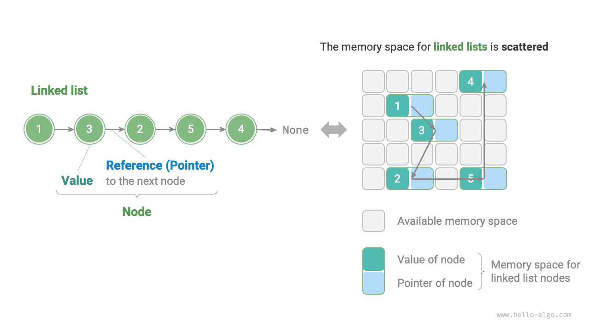
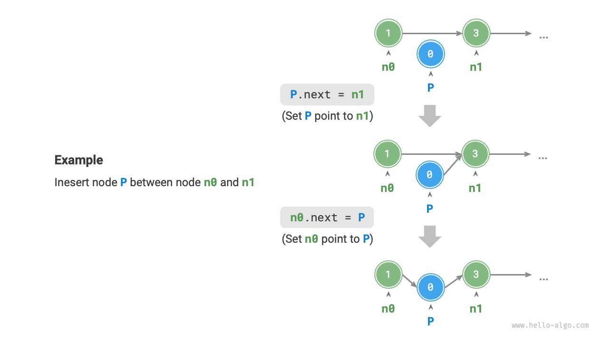
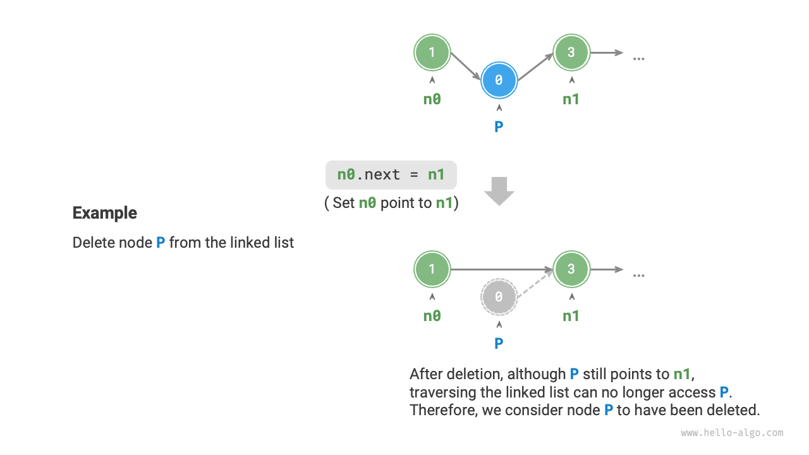
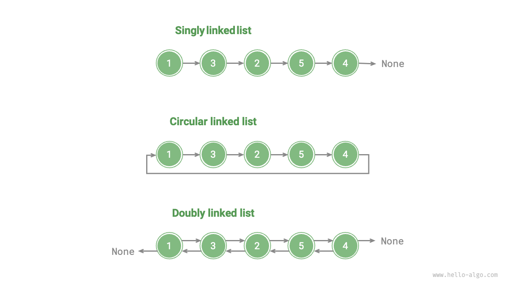

# 連結リスト

メモリ空間は、すべてのプログラム間で共有されるリソースです。複雑なシステム環境では、使用可能なメモリがメモリ空間全体に分散している可能性があります。配列に割り当てられるメモリは連続している必要があることを理解していますが、非常に大きな配列の場合、十分な大きさの連続メモリ空間を見つけるのは困難な場合があります。ここで、連結リストの柔軟な利点が明らかになります。

<u>連結リスト</u>は線形データ構造であり、各要素はノードオブジェクトで、ノードは「参照」を通じて相互接続されています。これらの参照は後続ノードのメモリアドレスを保持し、1つのノードから次のノードへのナビゲーションを可能にします。

連結リストの設計では、ノードを連続するメモリアドレスを必要とせずに、メモリ位置全体に分散配置することができます。



上図に示すように、連結リストの基本的な構成要素は<u>ノード</u>オブジェクトです。各ノードは2つの主要なコンポーネントで構成されています：ノードの「値」と次のノードへの「参照」です。

- 連結リストの最初のノードは「ヘッドノード」、最後のノードは「テールノード」です。
- テールノードは「null」を指し、Javaでは`null`、C++では`nullptr`、Pythonでは`None`として指定されます。
- C、C++、Go、Rustなどのポインタをサポートする言語では、この「参照」は通常「ポインタ」として実装されます。

以下のコードが示すように、連結リストの`ListNode`は値を保持するだけでなく、追加の参照（またはポインタ）も維持する必要があります。したがって、**連結リストは同じ量のデータを格納する場合、配列よりも多くのメモリ空間を占有します**。

=== "Python"

    ```python title=""
    class ListNode:
        """連結リストノードクラス"""
        def __init__(self, val: int):
            self.val: int = val               # ノード値
            self.next: ListNode | None = None # 次のノードへの参照
    ```

=== "C++"

    ```cpp title=""
    /* 連結リストノード構造体 */
    struct ListNode {
        int val;         // ノード値
        ListNode *next;  // 次のノードへのポインタ
        ListNode(int x) : val(x), next(nullptr) {}  // コンストラクタ
    };
    ```

=== "Java"

    ```java title=""
    /* 連結リストノードクラス */
    class ListNode {
        int val;        // ノード値
        ListNode next;  // 次のノードへの参照
        ListNode(int x) { val = x; }  // コンストラクタ
    }
    ```

=== "C#"

    ```csharp title=""
    /* 連結リストノードクラス */
    class ListNode(int x) {  // コンストラクタ
        int val = x;         // ノード値
        ListNode? next;      // 次のノードへの参照
    }
    ```

=== "Go"

    ```go title=""
    /* 連結リストノード構造体 */
    type ListNode struct {
        Val  int       // ノード値
        Next *ListNode // 次のノードへのポインタ
    }

    // NewListNode コンストラクタ、新しい連結リストを作成
    func NewListNode(val int) *ListNode {
        return &ListNode{
            Val:  val,
            Next: nil,
        }
    }
    ```

=== "Swift"

    ```swift title=""
    /* 連結リストノードクラス */
    class ListNode {
        var val: Int // ノード値
        var next: ListNode? // 次のノードへの参照

        init(x: Int) { // コンストラクタ
            val = x
        }
    }
    ```

=== "JS"

    ```javascript title=""
    /* 連結リストノードクラス */
    class ListNode {
        constructor(val, next) {
            this.val = (val === undefined ? 0 : val);       // ノード値
            this.next = (next === undefined ? null : next); // 次のノードへの参照
        }
    }
    ```

=== "TS"

    ```typescript title=""
    /* 連結リストノードクラス */
    class ListNode {
        val: number;
        next: ListNode | null;
        constructor(val?: number, next?: ListNode | null) {
            this.val = val === undefined ? 0 : val;        // ノード値
            this.next = next === undefined ? null : next;  // 次のノードへの参照
        }
    }
    ```

=== "Dart"

    ```dart title=""
    /* 連結リストノードクラス */
    class ListNode {
      int val; // ノード値
      ListNode? next; // 次のノードへの参照
      ListNode(this.val, [this.next]); // コンストラクタ
    }
    ```

=== "Rust"

    ```rust title=""
    use std::rc::Rc;
    use std::cell::RefCell;
    /* 連結リストノードクラス */
    #[derive(Debug)]
    struct ListNode {
        val: i32, // ノード値
        next: Option<Rc<RefCell<ListNode>>>, // 次のノードへのポインタ
    }
    ```

=== "C"

    ```c title=""
    /* 連結リストノード構造体 */
    typedef struct ListNode {
        int val;               // ノード値
        struct ListNode *next; // 次のノードへのポインタ
    } ListNode;

    /* コンストラクタ */
    ListNode *newListNode(int val) {
        ListNode *node;
        node = (ListNode *) malloc(sizeof(ListNode));
        node->val = val;
        node->next = NULL;
        return node;
    }
    ```

=== "Kotlin"

    ```kotlin title=""

    ```

=== "Zig"

    ```zig title=""
    // 連結リストノードクラス
    pub fn ListNode(comptime T: type) type {
        return struct {
            const Self = @This();

            val: T = 0, // ノード値
            next: ?*Self = null, // 次のノードへのポインタ

            // コンストラクタ
            pub fn init(self: *Self, x: i32) void {
                self.val = x;
                self.next = null;
            }
        };
    }
    ```

## 連結リストの一般的な操作

### 連結リストの初期化

連結リストの構築は2段階のプロセスです：まず各ノードオブジェクトを初期化し、次にノード間の参照リンクを形成します。初期化後、ヘッドノードから`next`参照をたどってすべてのノードを順次巡回できます。

=== "Python"

    ```python title="linked_list.py"
    # 連結リストを初期化: 1 -> 3 -> 2 -> 5 -> 4
    # 各ノードを初期化
    n0 = ListNode(1)
    n1 = ListNode(3)
    n2 = ListNode(2)
    n3 = ListNode(5)
    n4 = ListNode(4)
    # ノード間の参照を構築
    n0.next = n1
    n1.next = n2
    n2.next = n3
    n3.next = n4
    ```

=== "C++"

    ```cpp title="linked_list.cpp"
    /* 連結リストを初期化: 1 -> 3 -> 2 -> 5 -> 4 */
    // 各ノードを初期化
    ListNode* n0 = new ListNode(1);
    ListNode* n1 = new ListNode(3);
    ListNode* n2 = new ListNode(2);
    ListNode* n3 = new ListNode(5);
    ListNode* n4 = new ListNode(4);
    // ノード間の参照を構築
    n0->next = n1;
    n1->next = n2;
    n2->next = n3;
    n3->next = n4;
    ```

=== "Java"

    ```java title="linked_list.java"
    /* 連結リストを初期化: 1 -> 3 -> 2 -> 5 -> 4 */
    // 各ノードを初期化
    ListNode n0 = new ListNode(1);
    ListNode n1 = new ListNode(3);
    ListNode n2 = new ListNode(2);
    ListNode n3 = new ListNode(5);
    ListNode n4 = new ListNode(4);
    // ノード間の参照を構築
    n0.next = n1;
    n1.next = n2;
    n2.next = n3;
    n3.next = n4;
    ```

=== "C#"

    ```csharp title="linked_list.cs"
    /* 連結リストを初期化: 1 -> 3 -> 2 -> 5 -> 4 */
    // 各ノードを初期化
    ListNode n0 = new(1);
    ListNode n1 = new(3);
    ListNode n2 = new(2);
    ListNode n3 = new(5);
    ListNode n4 = new(4);
    // ノード間の参照を構築
    n0.next = n1;
    n1.next = n2;
    n2.next = n3;
    n3.next = n4;
    ```

=== "Go"

    ```go title="linked_list.go"
    /* 連結リストを初期化: 1 -> 3 -> 2 -> 5 -> 4 */
    // 各ノードを初期化
    n0 := NewListNode(1)
    n1 := NewListNode(3)
    n2 := NewListNode(2)
    n3 := NewListNode(5)
    n4 := NewListNode(4)
    // ノード間の参照を構築
    n0.Next = n1
    n1.Next = n2
    n2.Next = n3
    n3.Next = n4
    ```

=== "Swift"

    ```swift title="linked_list.swift"
    /* 連結リストを初期化: 1 -> 3 -> 2 -> 5 -> 4 */
    // 各ノードを初期化
    let n0 = ListNode(x: 1)
    let n1 = ListNode(x: 3)
    let n2 = ListNode(x: 2)
    let n3 = ListNode(x: 5)
    let n4 = ListNode(x: 4)
    // ノード間の参照を構築
    n0.next = n1
    n1.next = n2
    n2.next = n3
    n3.next = n4
    ```

=== "JS"

    ```javascript title="linked_list.js"
    /* 連結リストを初期化: 1 -> 3 -> 2 -> 5 -> 4 */
    // 各ノードを初期化
    const n0 = new ListNode(1);
    const n1 = new ListNode(3);
    const n2 = new ListNode(2);
    const n3 = new ListNode(5);
    const n4 = new ListNode(4);
    // ノード間の参照を構築
    n0.next = n1;
    n1.next = n2;
    n2.next = n3;
    n3.next = n4;
    ```

=== "TS"

    ```typescript title="linked_list.ts"
    /* 連結リストを初期化: 1 -> 3 -> 2 -> 5 -> 4 */
    // 各ノードを初期化
    const n0 = new ListNode(1);
    const n1 = new ListNode(3);
    const n2 = new ListNode(2);
    const n3 = new ListNode(5);
    const n4 = new ListNode(4);
    // ノード間の参照を構築
    n0.next = n1;
    n1.next = n2;
    n2.next = n3;
    n3.next = n4;
    ```

=== "Dart"

    ```dart title="linked_list.dart"
    /* 連結リストを初期化: 1 -> 3 -> 2 -> 5 -> 4 */
    // 各ノードを初期化
    ListNode n0 = ListNode(1);
    ListNode n1 = ListNode(3);
    ListNode n2 = ListNode(2);
    ListNode n3 = ListNode(5);
    ListNode n4 = ListNode(4);
    // ノード間の参照を構築
    n0.next = n1;
    n1.next = n2;
    n2.next = n3;
    n3.next = n4;
    ```

=== "Rust"

    ```rust title="linked_list.rs"
    /* 連結リストを初期化: 1 -> 3 -> 2 -> 5 -> 4 */
    // 各ノードを初期化
    let n0 = Rc::new(RefCell::new(ListNode { val: 1, next: None }));
    let n1 = Rc::new(RefCell::new(ListNode { val: 3, next: None }));
    let n2 = Rc::new(RefCell::new(ListNode { val: 2, next: None }));
    let n3 = Rc::new(RefCell::new(ListNode { val: 5, next: None }));
    let n4 = Rc::new(RefCell::new(ListNode { val: 4, next: None }));

    // ノード間の参照を構築
    n0.borrow_mut().next = Some(n1.clone());
    n1.borrow_mut().next = Some(n2.clone());
    n2.borrow_mut().next = Some(n3.clone());
    n3.borrow_mut().next = Some(n4.clone());
    ```

=== "C"

    ```c title="linked_list.c"
    /* 連結リストを初期化: 1 -> 3 -> 2 -> 5 -> 4 */
    // 各ノードを初期化
    ListNode* n0 = newListNode(1);
    ListNode* n1 = newListNode(3);
    ListNode* n2 = newListNode(2);
    ListNode* n3 = newListNode(5);
    ListNode* n4 = newListNode(4);
    // ノード間の参照を構築
    n0->next = n1;
    n1->next = n2;
    n2->next = n3;
    n3->next = n4;
    ```

=== "Kotlin"

    ```kotlin title="linked_list.kt"

    ```

=== "Zig"

    ```zig title="linked_list.zig"
    // 連結リストを初期化
    // 各ノードを初期化
    var n0 = inc.ListNode(i32){.val = 1};
    var n1 = inc.ListNode(i32){.val = 3};
    var n2 = inc.ListNode(i32){.val = 2};
    var n3 = inc.ListNode(i32){.val = 5};
    var n4 = inc.ListNode(i32){.val = 4};
    // ノード間の参照を構築
    n0.next = &n1;
    n1.next = &n2;
    n2.next = &n3;
    n3.next = &n4;
    ```

配列全体は1つの変数です。例えば、配列`nums`には`nums[0]`、`nums[1]`などの要素が含まれますが、連結リストは複数の異なるノードオブジェクトで構成されています。**通常、連結リストはそのヘッドノードで参照されます**。例えば、前のコードスニペットの連結リストは`n0`として参照されます。

### ノードの挿入

連結リストにノードを挿入するのは非常に簡単です。下図に示すように、隣接する2つのノード`n0`と`n1`の間に新しいノード`P`を挿入することを目指すとします。**これは2つのノード参照（ポインタ）を変更するだけで実現でき**、時間計算量は$O(1)$です。

比較すると、配列に要素を挿入する時間計算量は$O(n)$であり、大量のデータを扱う場合には効率が悪くなります。



```src
[file]{linked_list}-[class]{}-[func]{insert}
```

### ノードの削除

下図に示すように、連結リストからノードを削除することも非常に簡単で、**1つのノードの参照（ポインタ）を変更するだけです**。

重要な点は、ノード`P`が削除された後も`n1`を指し続けていることですが、連結リストの巡回中にはアクセスできなくなることです。これは事実上、`P`が連結リストの一部ではなくなったことを意味します。



```src
[file]{linked_list}-[class]{}-[func]{remove}
```

### ノードへのアクセス

**連結リストでのノードへのアクセスは効率が悪いです**。前述したように、配列の任意の要素には$O(1)$時間でアクセスできます。対照的に、連結リストでは、プログラムはヘッドノードから開始して目的のノードが見つかるまで順次ノードを巡回する必要があります。つまり、連結リストの$i$番目のノードにアクセスするには、プログラムは$i - 1$個のノードを反復処理する必要があり、時間計算量は$O(n)$になります。

```src
[file]{linked_list}-[class]{}-[func]{access}
```

### ノードの検索

連結リストを巡回して、値が`target`に一致するノードを見つけ、連結リスト内でのそのノードのインデックスを出力します。この手順も線形検索の例です。対応するコードは以下のとおりです：

```src
[file]{linked_list}-[class]{}-[func]{find}
```

## 配列 vs. 連結リスト

下表は配列と連結リストの特性をまとめ、様々な操作における効率も比較しています。それぞれが対照的な格納戦略を使用するため、それぞれの特性と操作効率は明確に対比されています。

<p align="center"> 表 <id> &nbsp; 配列と連結リストの効率比較 </p>

|                    | 配列                                           | 連結リスト            |
| ------------------ | ------------------------------------------------ | ----------------------- |
| 格納方式            | 連続メモリ空間                          | 分散メモリ空間  |
| 容量拡張 | 固定長                                     | 柔軟な拡張      |
| メモリ効率  | 要素あたりのメモリ少、潜在的な空間の無駄 | 要素あたりのメモリ多 |
| 要素へのアクセス | $O(1)$                                           | $O(n)$                  |
| 要素の追加    | $O(n)$                                           | $O(1)$                  |
| 要素の削除  | $O(n)$                                           | $O(1)$                  |

## 連結リストの一般的な種類

下図に示すように、連結リストには3つの一般的な種類があります。

- **単方向連結リスト**：これは前述した標準的な連結リストです。単方向連結リストのノードには値と次のノードへの参照が含まれます。最初のノードはヘッドノードと呼ばれ、null（`None`）を指す最後のノードはテールノードです。
- **循環連結リスト**：これは単方向連結リストのテールノードがヘッドノードを指してループを作ることで形成されます。循環連結リストでは、任意のノードがヘッドノードとして機能できます。
- **双方向連結リスト**：単方向連結リストとは対照的に、双方向連結リストは2つの方向で参照を維持します。各ノードには後続者（次のノード）と前任者（前のノード）の両方への参照（ポインタ）が含まれます。双方向連結リストはどちらの方向にも巡回できるより多くの柔軟性を提供しますが、より多くのメモリ空間も消費します。

=== "Python"

    ```python title=""
    class ListNode:
        """双方向連結リストノードクラス"""
        def __init__(self, val: int):
            self.val: int = val                # ノード値
            self.next: ListNode | None = None  # 後続ノードへの参照
            self.prev: ListNode | None = None  # 前任ノードへの参照
    ```

=== "C++"

    ```cpp title=""
    /* 双方向連結リストノード構造体 */
    struct ListNode {
        int val;         // ノード値
        ListNode *next;  // 後続ノードへのポインタ
        ListNode *prev;  // 前任ノードへのポインタ
        ListNode(int x) : val(x), next(nullptr), prev(nullptr) {}  // コンストラクタ
    };
    ```

=== "Java"

    ```java title=""
    /* 双方向連結リストノードクラス */
    class ListNode {
        int val;        // ノード値
        ListNode next;  // 次のノードへの参照
        ListNode prev;  // 前任ノードへの参照
        ListNode(int x) { val = x; }  // コンストラクタ
    }
    ```

=== "C#"

    ```csharp title=""
    /* 双方向連結リストノードクラス */
    class ListNode(int x) {  // コンストラクタ
        int val = x;    // ノード値
        ListNode next;  // 次のノードへの参照
        ListNode prev;  // 前任ノードへの参照
    }
    ```

=== "Go"

    ```go title=""
    /* 双方向連結リストノード構造体 */
    type DoublyListNode struct {
        Val  int             // ノード値
        Next *DoublyListNode // 後続ノードへのポインタ
        Prev *DoublyListNode // 前任ノードへのポインタ
    }

    // NewDoublyListNode 初期化
    func NewDoublyListNode(val int) *DoublyListNode {
        return &DoublyListNode{
            Val:  val,
            Next: nil,
            Prev: nil,
        }
    }
    ```

=== "Swift"

    ```swift title=""
    /* 双方向連結リストノードクラス */
    class ListNode {
        var val: Int // ノード値
        var next: ListNode? // 次のノードへの参照
        var prev: ListNode? // 前任ノードへの参照

        init(x: Int) { // コンストラクタ
            val = x
        }
    }
    ```

=== "JS"

    ```javascript title=""
    /* 双方向連結リストノードクラス */
    class ListNode {
        constructor(val, next, prev) {
            this.val = val  ===  undefined ? 0 : val;        // ノード値
            this.next = next  ===  undefined ? null : next;  // 後続ノードへの参照
            this.prev = prev  ===  undefined ? null : prev;  // 前任ノードへの参照
        }
    }
    ```

=== "TS"

    ```typescript title=""
    /* 双方向連結リストノードクラス */
    class ListNode {
        val: number;
        next: ListNode | null;
        prev: ListNode | null;
        constructor(val?: number, next?: ListNode | null, prev?: ListNode | null) {
            this.val = val  ===  undefined ? 0 : val;        // ノード値
            this.next = next  ===  undefined ? null : next;  // 後続ノードへの参照
            this.prev = prev  ===  undefined ? null : prev;  // 前任ノードへの参照
        }
    }
    ```

=== "Dart"

    ```dart title=""
    /* 双方向連結リストノードクラス */
    class ListNode {
        int val;        // ノード値
        ListNode next;  // 次のノードへの参照
        ListNode prev;  // 前任ノードへの参照
        ListNode(this.val, [this.next, this.prev]);  // コンストラクタ
    }
    ```

=== "Rust"

    ```rust title=""
    use std::rc::Rc;
    use std::cell::RefCell;

    /* 双方向連結リストノード型 */
    #[derive(Debug)]
    struct ListNode {
        val: i32, // ノード値
        next: Option<Rc<RefCell<ListNode>>>, // 後続ノードへのポインタ
        prev: Option<Rc<RefCell<ListNode>>>, // 前任ノードへのポインタ
    }

    /* コンストラクタ */
    impl ListNode {
        fn new(val: i32) -> Self {
            ListNode {
                val,
                next: None,
                prev: None,
            }
        }
    }
    ```

=== "C"

    ```c title=""
    /* 双方向連結リストノード構造体 */
    typedef struct ListNode {
        int val;               // ノード値
        struct ListNode *next; // 後続ノードへのポインタ
        struct ListNode *prev; // 前任ノードへのポインタ
    } ListNode;

    /* コンストラクタ */
    ListNode *newListNode(int val) {
        ListNode *node, *next;
        node = (ListNode *) malloc(sizeof(ListNode));
        node->val = val;
        node->next = NULL;
        node->prev = NULL;
        return node;
    }
    ```

=== "Kotlin"

    ```kotlin title=""

    ```

=== "Zig"

    ```zig title=""
    // 双方向連結リストノードクラス
    pub fn ListNode(comptime T: type) type {
        return struct {
            const Self = @This();

            val: T = 0, // ノード値
            next: ?*Self = null, // 後続ノードへのポインタ
            prev: ?*Self = null, // 前任ノードへのポインタ

            // コンストラクタ
            pub fn init(self: *Self, x: i32) void {
                self.val = x;
                self.next = null;
                self.prev = null;
            }
        };
    }
    ```



## 連結リストの典型的な応用

単方向連結リストは、スタック、キュー、ハッシュ表、グラフの実装によく使用されます。

- **スタックとキュー**：単方向連結リストで、挿入と削除が同じ端で行われる場合、スタック（後入先出）のように動作します。逆に、挿入が一方の端で、削除がもう一方の端で行われる場合、キュー（先入先出）のように機能します。
- **ハッシュ表**：連結リストは、ハッシュ衝突を解決する人気の方法である連鎖法で使用されます。ここでは、すべての衝突した要素が連結リストにグループ化されます。
- **グラフ**：グラフ表現の標準的な方法である隣接リストは、各グラフ頂点を連結リストに関連付けます。このリストには、対応する頂点に接続された頂点を表す要素が含まれます。

双方向連結リストは、前後の要素への高速アクセスが必要なシナリオに最適です。

- **高度なデータ構造**：赤黒木やB木などの構造では、ノードの親へのアクセスが重要です。これは各ノードに親ノードへの参照を組み込むことで実現され、双方向連結リストに似ています。
- **ブラウザ履歴**：Webブラウザでは、双方向連結リストにより、ユーザーが前進または後退ボタンをクリックしたときの訪問ページの履歴ナビゲーションが容易になります。
- **LRUアルゴリズム**：双方向連結リストは、最近最少使用（LRU）キャッシュ削除アルゴリズムに適しており、最近最少使用データの迅速な識別と、高速なノード追加・削除を可能にします。

循環連結リストは、オペレーティングシステムでのリソーススケジューリングなど、周期的な操作が必要なアプリケーションに最適です。

- **ラウンドロビンスケジューリングアルゴリズム**：オペレーティングシステムでは、ラウンドロビンスケジューリングアルゴリズムは一般的なCPUスケジューリング方法であり、プロセスのグループを循環する必要があります。各プロセスにはタイムスライスが割り当てられ、期限切れになるとCPUは次のプロセスに回転します。この循環操作は循環連結リストを使用して効率的に実現でき、すべてのプロセス間で公平かつ時分割システムを可能にします。
- **データバッファ**：循環連結リストは、オーディオやビデオプレーヤーなどのデータバッファでも使用され、データストリームが複数のバッファブロックに分割され、シームレスな再生のために循環方式で配置されます。
