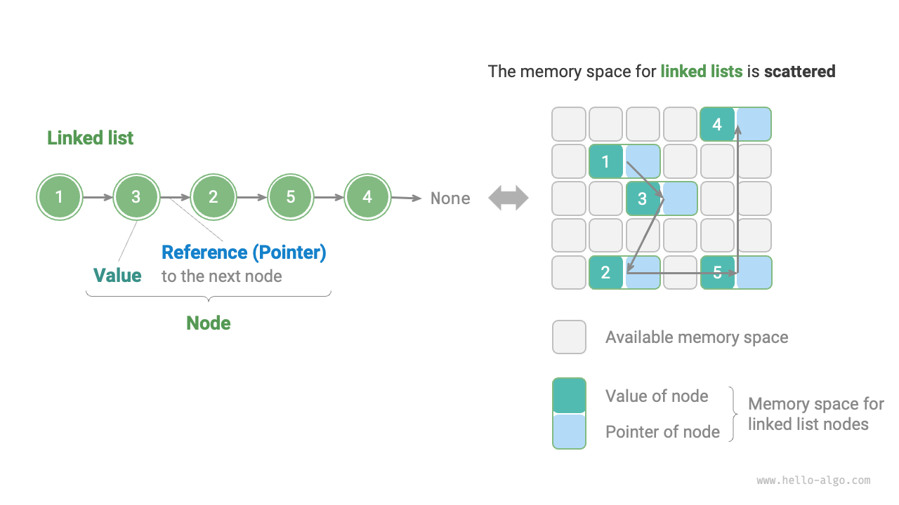
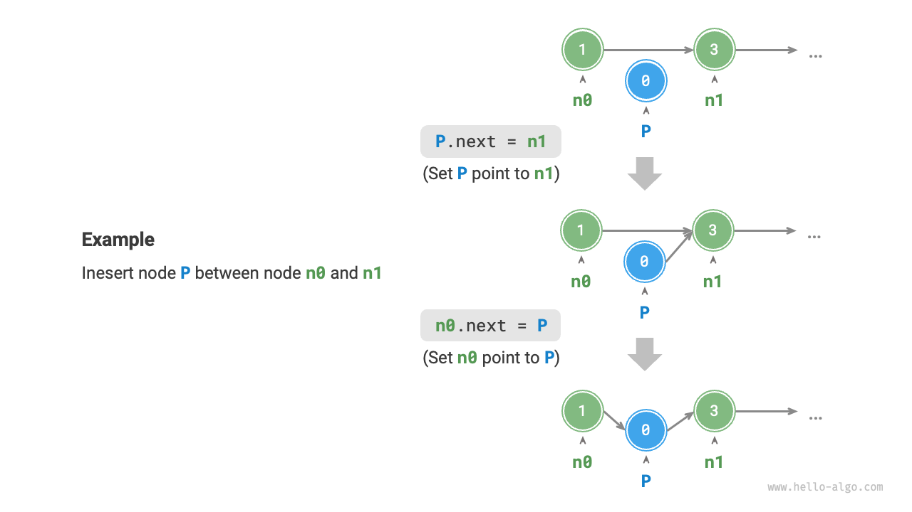
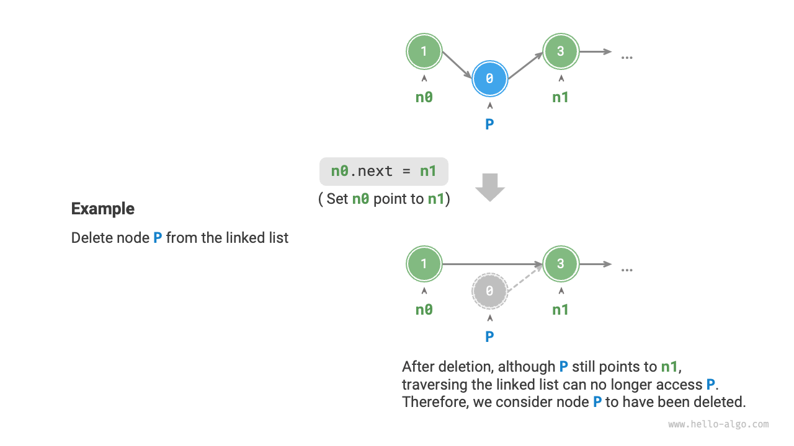
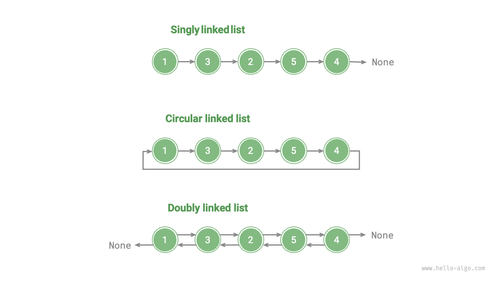

# 連結リスト

メモリ空間はすべてのプログラムに共通の資源であり、複雑なシステム実行環境では、空きメモリがメモリの各所に散在している可能性があります。配列を格納するメモリ空間は連続していなければなりませんが、配列が非常に大きい場合、メモリはそのような大きな連続領域を提供できないことがあります。このとき、連結リストの柔軟性という利点が現れます。

<u>連結リスト（linked list）</u>は線形データ構造の一種であり、各要素はノードオブジェクトです。各ノードは「参照」によって接続されます。参照には次のノードのメモリアドレスが記録されており、これによって現在のノードから次のノードへアクセスできます。

連結リストの設計では、各ノードをメモリの各所に分散して格納でき、それらのメモリアドレスは連続している必要がありません。



上図を見ると、連結リストの構成単位は<u>ノード（node）</u>オブジェクトです。各ノードは 2 つのデータ、すなわちノードの「値」と次のノードを指す「参照」を含みます。

- 連結リストの最初のノードを「先頭ノード」、最後のノードを「末尾ノード」と呼びます。
- 末尾ノードが指す先は「空」であり、Java、C++、Python ではそれぞれ `null`、`nullptr`、`None` と表記します。
- C、C++、Go、Rust などポインタをサポートする言語では、上記の「参照」は「ポインタ」に置き換えるべきです。

以下のコードが示すように、連結リストノード `ListNode` は値のほかに、追加で 1 つの参照（ポインタ）を保持する必要があります。そのため、同じデータ量であれば、**連結リストは配列より多くのメモリ空間を消費します**。

=== "Python"

    ```python title=""
    class ListNode:
        """連結リストノードクラス"""
        def __init__(self, val: int):
            self.val: int = val               # ノードの値
            self.next: ListNode | None = None # 次のノードへの参照
    ```

=== "C++"

    ```cpp title=""
    /* 連結リストノード構造体 */
    struct ListNode {
        int val;         // ノードの値
        ListNode *next;  // 次のノードへのポインタ
        ListNode(int x) : val(x), next(nullptr) {}  // コンストラクタ
    };
    ```

=== "Java"

    ```java title=""
    /* 連結リストノードクラス */
    class ListNode {
        int val;        // ノードの値
        ListNode next;  // 次のノードへの参照
        ListNode(int x) { val = x; }  // コンストラクタ
    }
    ```

=== "C#"

    ```csharp title=""
    /* 連結リストノードクラス */
    class ListNode(int x) {  //コンストラクタ
        int val = x;         // ノードの値
        ListNode? next;      // 次のノードへの参照
    }
    ```

=== "Go"

    ```go title=""
    /* 連結リストノード構造体 */
    type ListNode struct {
        Val  int       // ノードの値
        Next *ListNode // 次のノードへのポインタ
    }

    // NewListNode コンストラクタ。新しい連結リストを作成する
    func NewListNode(val int) *ListNode {
        return &ListNode{
            Val:  val,
            Next: nil,
        }
    }
    ```

=== "Swift"

    ```swift title=""
    /* 連結リストノードクラス */
    class ListNode {
        var val: Int // ノードの値
        var next: ListNode? // 次のノードへの参照

        init(x: Int) { // コンストラクタ
            val = x
        }
    }
    ```

=== "JS"

    ```javascript title=""
    /* 連結リストノードクラス */
    class ListNode {
        constructor(val, next) {
            this.val = (val === undefined ? 0 : val);       // ノードの値
            this.next = (next === undefined ? null : next); // 次のノードへの参照
        }
    }
    ```

=== "TS"

    ```typescript title=""
    /* 連結リストノードクラス */
    class ListNode {
        val: number;
        next: ListNode | null;
        constructor(val?: number, next?: ListNode | null) {
            this.val = val === undefined ? 0 : val;        // ノードの値
            this.next = next === undefined ? null : next;  // 次のノードへの参照
        }
    }
    ```

=== "Dart"

    ```dart title=""
    /* 連結リストノードクラス */
    class ListNode {
      int val; // ノードの値
      ListNode? next; // 次のノードへの参照
      ListNode(this.val, [this.next]); // コンストラクタ
    }
    ```

=== "Rust"

    ```rust title=""
    use std::rc::Rc;
    use std::cell::RefCell;
    /* 連結リストノードクラス */
    #[derive(Debug)]
    struct ListNode {
        val: i32, // ノードの値
        next: Option<Rc<RefCell<ListNode>>>, // 次のノードへのポインタ
    }
    ```

=== "C"

    ```c title=""
    /* 連結リストノード構造体 */
    typedef struct ListNode {
        int val;               // ノードの値
        struct ListNode *next; // 次のノードへのポインタ
    } ListNode;

    /* コンストラクタ */
    ListNode *newListNode(int val) {
        ListNode *node;
        node = (ListNode *) malloc(sizeof(ListNode));
        node->val = val;
        node->next = NULL;
        return node;
    }
    ```

=== "Kotlin"

    ```kotlin title=""
    /* 連結リストノードクラス */
    // コンストラクタ
    class ListNode(x: Int) {
        val _val: Int = x          // ノードの値
        val next: ListNode? = null // 次のノードへの参照
    }
    ```

=== "Ruby"

    ```ruby title=""
    # 連結リストノードクラス
    class ListNode
      attr_accessor :val  # ノードの値
      attr_accessor :next # 次のノードへの参照

      def initialize(val=0, next_node=nil)
        @val = val
        @next = next_node
      end
    end
    ```

## 連結リストの基本操作

### 連結リストの初期化

連結リストの構築は 2 つの手順に分かれます。第 1 に各ノードオブジェクトを初期化し、第 2 にノード間の参照関係を構築します。初期化が完了したら、連結リストの先頭ノードから出発し、参照で `next` をたどってすべてのノードに順にアクセスできます。

=== "Python"

    ```python title="linked_list.py"
    # 連結リスト 1 -> 3 -> 2 -> 5 -> 4 を初期化
    # 各ノードを初期化
    n0 = ListNode(1)
    n1 = ListNode(3)
    n2 = ListNode(2)
    n3 = ListNode(5)
    n4 = ListNode(4)
    # ノード間の参照を構築
    n0.next = n1
    n1.next = n2
    n2.next = n3
    n3.next = n4
    ```

=== "C++"

    ```cpp title="linked_list.cpp"
    /* 連結リスト 1 -> 3 -> 2 -> 5 -> 4 を初期化 */
    // 各ノードを初期化
    ListNode* n0 = new ListNode(1);
    ListNode* n1 = new ListNode(3);
    ListNode* n2 = new ListNode(2);
    ListNode* n3 = new ListNode(5);
    ListNode* n4 = new ListNode(4);
    // ノード間の参照を構築
    n0->next = n1;
    n1->next = n2;
    n2->next = n3;
    n3->next = n4;
    ```

=== "Java"

    ```java title="linked_list.java"
    /* 連結リスト 1 -> 3 -> 2 -> 5 -> 4 を初期化 */
    // 各ノードを初期化
    ListNode n0 = new ListNode(1);
    ListNode n1 = new ListNode(3);
    ListNode n2 = new ListNode(2);
    ListNode n3 = new ListNode(5);
    ListNode n4 = new ListNode(4);
    // ノード間の参照を構築
    n0.next = n1;
    n1.next = n2;
    n2.next = n3;
    n3.next = n4;
    ```

=== "C#"

    ```csharp title="linked_list.cs"
    /* 連結リスト 1 -> 3 -> 2 -> 5 -> 4 を初期化 */
    // 各ノードを初期化
    ListNode n0 = new(1);
    ListNode n1 = new(3);
    ListNode n2 = new(2);
    ListNode n3 = new(5);
    ListNode n4 = new(4);
    // ノード間の参照を構築
    n0.next = n1;
    n1.next = n2;
    n2.next = n3;
    n3.next = n4;
    ```

=== "Go"

    ```go title="linked_list.go"
    /* 連結リスト 1 -> 3 -> 2 -> 5 -> 4 を初期化 */
    // 各ノードを初期化
    n0 := NewListNode(1)
    n1 := NewListNode(3)
    n2 := NewListNode(2)
    n3 := NewListNode(5)
    n4 := NewListNode(4)
    // ノード間の参照を構築
    n0.Next = n1
    n1.Next = n2
    n2.Next = n3
    n3.Next = n4
    ```

=== "Swift"

    ```swift title="linked_list.swift"
    /* 連結リスト 1 -> 3 -> 2 -> 5 -> 4 を初期化 */
    // 各ノードを初期化
    let n0 = ListNode(x: 1)
    let n1 = ListNode(x: 3)
    let n2 = ListNode(x: 2)
    let n3 = ListNode(x: 5)
    let n4 = ListNode(x: 4)
    // ノード間の参照を構築
    n0.next = n1
    n1.next = n2
    n2.next = n3
    n3.next = n4
    ```

=== "JS"

    ```javascript title="linked_list.js"
    /* 連結リスト 1 -> 3 -> 2 -> 5 -> 4 を初期化 */
    // 各ノードを初期化
    const n0 = new ListNode(1);
    const n1 = new ListNode(3);
    const n2 = new ListNode(2);
    const n3 = new ListNode(5);
    const n4 = new ListNode(4);
    // ノード間の参照を構築
    n0.next = n1;
    n1.next = n2;
    n2.next = n3;
    n3.next = n4;
    ```

=== "TS"

    ```typescript title="linked_list.ts"
    /* 連結リスト 1 -> 3 -> 2 -> 5 -> 4 を初期化 */
    // 各ノードを初期化
    const n0 = new ListNode(1);
    const n1 = new ListNode(3);
    const n2 = new ListNode(2);
    const n3 = new ListNode(5);
    const n4 = new ListNode(4);
    // ノード間の参照を構築
    n0.next = n1;
    n1.next = n2;
    n2.next = n3;
    n3.next = n4;
    ```

=== "Dart"

    ```dart title="linked_list.dart"
    /* 連結リスト 1 -> 3 -> 2 -> 5 -> 4 を初期化 */\
    // 各ノードを初期化
    ListNode n0 = ListNode(1);
    ListNode n1 = ListNode(3);
    ListNode n2 = ListNode(2);
    ListNode n3 = ListNode(5);
    ListNode n4 = ListNode(4);
    // ノード間の参照を構築
    n0.next = n1;
    n1.next = n2;
    n2.next = n3;
    n3.next = n4;
    ```

=== "Rust"

    ```rust title="linked_list.rs"
    /* 連結リスト 1 -> 3 -> 2 -> 5 -> 4 を初期化 */
    // 各ノードを初期化
    let n0 = Rc::new(RefCell::new(ListNode { val: 1, next: None }));
    let n1 = Rc::new(RefCell::new(ListNode { val: 3, next: None }));
    let n2 = Rc::new(RefCell::new(ListNode { val: 2, next: None }));
    let n3 = Rc::new(RefCell::new(ListNode { val: 5, next: None }));
    let n4 = Rc::new(RefCell::new(ListNode { val: 4, next: None }));

    // ノード間の参照を構築
    n0.borrow_mut().next = Some(n1.clone());
    n1.borrow_mut().next = Some(n2.clone());
    n2.borrow_mut().next = Some(n3.clone());
    n3.borrow_mut().next = Some(n4.clone());
    ```

=== "C"

    ```c title="linked_list.c"
    /* 連結リスト 1 -> 3 -> 2 -> 5 -> 4 を初期化 */
    // 各ノードを初期化
    ListNode* n0 = newListNode(1);
    ListNode* n1 = newListNode(3);
    ListNode* n2 = newListNode(2);
    ListNode* n3 = newListNode(5);
    ListNode* n4 = newListNode(4);
    // ノード間の参照を構築
    n0->next = n1;
    n1->next = n2;
    n2->next = n3;
    n3->next = n4;
    ```

=== "Kotlin"

    ```kotlin title="linked_list.kt"
    /* 連結リスト 1 -> 3 -> 2 -> 5 -> 4 を初期化 */
    // 各ノードを初期化
    val n0 = ListNode(1)
    val n1 = ListNode(3)
    val n2 = ListNode(2)
    val n3 = ListNode(5)
    val n4 = ListNode(4)
    // ノード間の参照を構築
    n0.next = n1;
    n1.next = n2;
    n2.next = n3;
    n3.next = n4;
    ```

=== "Ruby"

    ```ruby title="linked_list.rb"
    # 連結リスト 1 -> 3 -> 2 -> 5 -> 4 を初期化
    # 各ノードを初期化
    n0 = ListNode.new(1)
    n1 = ListNode.new(3)
    n2 = ListNode.new(2)
    n3 = ListNode.new(5)
    n4 = ListNode.new(4)
    # ノード間の参照を構築
    n0.next = n1
    n1.next = n2
    n2.next = n3
    n3.next = n4
    ```

??? pythontutor "可視化実行"

    https://pythontutor.com/render.html#code=class%20ListNode%3A%0A%20%20%20%20%22%22%22%E9%93%BE%E8%A1%A8%E8%8A%82%E7%82%B9%E7%B1%BB%22%22%22%0A%20%20%20%20def%20__init__%28self,%20val%3A%20int%29%3A%0A%20%20%20%20%20%20%20%20self.val%3A%20int%20%3D%20val%20%20%23%20%E8%8A%82%E7%82%B9%E5%80%BC%0A%20%20%20%20%20%20%20%20self.next%3A%20ListNode%20%7C%20None%20%3D%20None%20%20%23%20%E5%90%8E%E7%BB%A7%E8%8A%82%E7%82%B9%E5%BC%95%E7%94%A8%0A%0A%22%22%22Driver%20Code%22%22%22%0Aif%20__name__%20%3D%3D%20%22__main__%22%3A%0A%20%20%20%20%23%20%E5%88%9D%E5%A7%8B%E5%8C%96%E9%93%BE%E8%A1%A8%201%20-%3E%203%20-%3E%202%20-%3E%205%20-%3E%204%0A%20%20%20%20%23%20%E5%88%9D%E5%A7%8B%E5%8C%96%E5%90%84%E4%B8%AA%E8%8A%82%E7%82%B9%0A%20%20%20%20n0%20%3D%20ListNode%281%29%0A%20%20%20%20n1%20%3D%20ListNode%283%29%0A%20%20%20%20n2%20%3D%20ListNode%282%29%0A%20%20%20%20n3%20%3D%20ListNode%285%29%0A%20%20%20%20n4%20%3D%20ListNode%284%29%0A%20%20%20%20%23%20%E6%9E%84%E5%BB%BA%E8%8A%82%E7%82%B9%E4%B9%8B%E9%97%B4%E7%9A%84%E5%BC%95%E7%94%A8%0A%20%20%20%20n0.next%20%3D%20n1%0A%20%20%20%20n1.next%20%3D%20n2%0A%20%20%20%20n2.next%20%3D%20n3%0A%20%20%20%20n3.next%20%3D%20n4&cumulative=false&curInstr=3&heapPrimitives=nevernest&mode=display&origin=opt-frontend.js&py=311&rawInputLstJSON=%5B%5D&textReferences=false

配列全体は 1 つの変数であり、たとえば配列 `nums` には `nums[0]` や `nums[1]` などの要素が含まれます。一方、連結リストは複数の独立したノードオブジェクトで構成されます。**通常、先頭ノードを連結リストの代名詞として扱います**。たとえば上記のコードの連結リストは `n0` と表せます。

### ノードの挿入

連結リストへのノード挿入は非常に簡単です。下図に示すように、隣り合う 2 つのノード `n0` と `n1` の間に新しいノード `P` を挿入したいとします。**このとき 2 つのノードの参照（ポインタ）を変更するだけでよく**、時間計算量は $O(1)$ です。

これに対して、配列に要素を挿入する時間計算量は $O(n)$ であり、データ量が大きい場合の効率は低くなります。



```src
[file]{linked_list}-[class]{}-[func]{insert}
```

### ノードの削除

下図に示すように、連結リストでのノード削除も非常に簡単で、**1 つのノードの参照（ポインタ）を変更するだけで済みます**。

なお、削除操作が完了した後もノード `P` は依然として `n1` を指していますが、実際にはこの連結リストをたどっても `P` へはアクセスできません。つまり、`P` はすでにこの連結リストには属していません。



```src
[file]{linked_list}-[class]{}-[func]{remove}
```

### ノードへのアクセス

**連結リストでノードにアクセスする効率は低い**です。前節で述べたように、配列では任意の要素へ $O(1)$ 時間でアクセスできます。これに対して連結リストでは、プログラムは先頭ノードから出発し、1 つずつ後ろへたどって目的のノードを見つける必要があります。つまり、連結リストの第 $i$ ノードにアクセスするには $i - 1$ 回のループが必要であり、時間計算量は $O(n)$ です。

```src
[file]{linked_list}-[class]{}-[func]{access}
```

### ノードの探索

連結リストを走査し、その中から値が `target` のノードを探し、そのノードの連結リスト内でのインデックスを出力します。この処理も線形探索に属します。コードは次のとおりです。

```src
[file]{linked_list}-[class]{}-[func]{find}
```

## 配列 vs. 連結リスト

次の表は、配列と連結リストの各種特徴と操作効率をまとめたものです。両者は互いに逆の格納戦略を採用しているため、各種性質や操作効率にも対照的な特徴が現れます。

<p align="center"> 表 <id> &nbsp; 配列と連結リストの効率比較 </p>

|          | 配列                           | 連結リスト     |
| -------- | ------------------------------ | -------------- |
| 格納方式 | 連続したメモリ空間             | 分散したメモリ空間 |
| 容量拡張 | 長さは不変                     | 柔軟に拡張可能 |
| メモリ効率 | 要素のメモリ消費は少ないが、空間を無駄にする可能性がある | 要素のメモリ消費が多い |
| 要素へのアクセス | $O(1)$                 | $O(n)$         |
| 要素の追加 | $O(n)$                       | $O(1)$         |
| 要素の削除 | $O(n)$                       | $O(1)$         |

## 一般的な連結リストの種類

下図に示すように、一般的な連結リストの種類は 3 つあります。

- **単方向連結リスト**：前述した通常の連結リストのことです。単方向連結リストのノードは、値と次のノードを指す参照の 2 つのデータを含みます。最初のノードを先頭ノード、最後のノードを末尾ノードと呼び、末尾ノードは空 `None` を指します。
- **循環連結リスト**：単方向連結リストの末尾ノードを先頭ノードへ向けると（先頭と末尾をつなぐと）、循環連結リストが得られます。循環連結リストでは、任意のノードを先頭ノードとみなせます。
- **双方向連結リスト**：単方向連結リストと比べて、双方向連結リストは 2 方向の参照を記録します。双方向連結リストのノード定義には、後続ノード（次のノード）と前駆ノード（前のノード）を指す参照（ポインタ）が含まれます。単方向連結リストより柔軟で、2 方向に連結リストを走査できますが、そのぶん多くのメモリ空間を必要とします。

=== "Python"

    ```python title=""
    class ListNode:
        """双方向連結リストノードクラス"""
        def __init__(self, val: int):
            self.val: int = val                # ノードの値
            self.next: ListNode | None = None  # 後続ノードへの参照
            self.prev: ListNode | None = None  # 前駆ノードへの参照
    ```

=== "C++"

    ```cpp title=""
    /* 双方向連結リストノード構造体 */
    struct ListNode {
        int val;         // ノードの値
        ListNode *next;  // 後続ノードへのポインタ
        ListNode *prev;  // 前駆ノードへのポインタ
        ListNode(int x) : val(x), next(nullptr), prev(nullptr) {}  // コンストラクタ
    };
    ```

=== "Java"

    ```java title=""
    /* 双方向連結リストノードクラス */
    class ListNode {
        int val;        // ノードの値
        ListNode next;  // 後続ノードへの参照
        ListNode prev;  // 前駆ノードへの参照
        ListNode(int x) { val = x; }  // コンストラクタ
    }
    ```

=== "C#"

    ```csharp title=""
    /* 双方向連結リストノードクラス */
    class ListNode(int x) {  // コンストラクタ
        int val = x;    // ノードの値
        ListNode next;  // 後続ノードへの参照
        ListNode prev;  // 前駆ノードへの参照
    }
    ```

=== "Go"

    ```go title=""
    /* 双方向連結リストノード構造体 */
    type DoublyListNode struct {
        Val  int             // ノードの値
        Next *DoublyListNode // 後続ノードへのポインタ
        Prev *DoublyListNode // 前駆ノードへのポインタ
    }

    // NewDoublyListNode の初期化
    func NewDoublyListNode(val int) *DoublyListNode {
        return &DoublyListNode{
            Val:  val,
            Next: nil,
            Prev: nil,
        }
    }
    ```

=== "Swift"

    ```swift title=""
    /* 双方向連結リストノードクラス */
    class ListNode {
        var val: Int // ノードの値
        var next: ListNode? // 後続ノードへの参照
        var prev: ListNode? // 前駆ノードへの参照

        init(x: Int) { // コンストラクタ
            val = x
        }
    }
    ```

=== "JS"

    ```javascript title=""
    /* 双方向連結リストノードクラス */
    class ListNode {
        constructor(val, next, prev) {
            this.val = val  ===  undefined ? 0 : val;        // ノードの値
            this.next = next  ===  undefined ? null : next;  // 後続ノードへの参照
            this.prev = prev  ===  undefined ? null : prev;  // 前駆ノードへの参照
        }
    }
    ```

=== "TS"

    ```typescript title=""
    /* 双方向連結リストノードクラス */
    class ListNode {
        val: number;
        next: ListNode | null;
        prev: ListNode | null;
        constructor(val?: number, next?: ListNode | null, prev?: ListNode | null) {
            this.val = val  ===  undefined ? 0 : val;        // ノードの値
            this.next = next  ===  undefined ? null : next;  // 後続ノードへの参照
            this.prev = prev  ===  undefined ? null : prev;  // 前駆ノードへの参照
        }
    }
    ```

=== "Dart"

    ```dart title=""
    /* 双方向連結リストノードクラス */
    class ListNode {
        int val;        // ノードの値
        ListNode? next;  // 後続ノードへの参照
        ListNode? prev;  // 前駆ノードへの参照
        ListNode(this.val, [this.next, this.prev]);  // コンストラクタ
    }
    ```

=== "Rust"

    ```rust title=""
    use std::rc::Rc;
    use std::cell::RefCell;

    /* 双方向連結リストノード型 */
    #[derive(Debug)]
    struct ListNode {
        val: i32, // ノードの値
        next: Option<Rc<RefCell<ListNode>>>, // 後続ノードへのポインタ
        prev: Option<Rc<RefCell<ListNode>>>, // 前駆ノードへのポインタ
    }

    /* コンストラクタ */
    impl ListNode {
        fn new(val: i32) -> Self {
            ListNode {
                val,
                next: None,
                prev: None,
            }
        }
    }
    ```

=== "C"

    ```c title=""
    /* 双方向連結リストノード構造体 */
    typedef struct ListNode {
        int val;               // ノードの値
        struct ListNode *next; // 後続ノードへのポインタ
        struct ListNode *prev; // 前駆ノードへのポインタ
    } ListNode;

    /* コンストラクタ */
    ListNode *newListNode(int val) {
        ListNode *node;
        node = (ListNode *) malloc(sizeof(ListNode));
        node->val = val;
        node->next = NULL;
        node->prev = NULL;
        return node;
    }
    ```

=== "Kotlin"

    ```kotlin title=""
    /* 双方向連結リストノードクラス */
    // コンストラクタ
    class ListNode(x: Int) {
        val _val: Int = x           // ノードの値
        val next: ListNode? = null  // 後続ノードへの参照
        val prev: ListNode? = null  // 前駆ノードへの参照
    }
    ```

=== "Ruby"

    ```ruby title=""
    # 双方向連結リストノードクラス
    class ListNode
      attr_accessor :val    # ノードの値
      attr_accessor :next   # 後続ノードへの参照
      attr_accessor :prev   # 前駆ノードへの参照

      def initialize(val=0, next_node=nil, prev_node=nil)
        @val = val
        @next = next_node
        @prev = prev_node
      end
    end
    ```



## 連結リストの典型的な応用

単方向連結リストは、スタック、キュー、ハッシュテーブル、グラフなどのデータ構造の実装によく用いられます。

- **スタックとキュー**：挿入と削除の両方の操作を連結リストの一端で行うと、その性質は後入れ先出しとなり、スタックに対応します。挿入を連結リストの一端で行い、削除をもう一端で行うと、その性質は先入れ先出しとなり、キューに対応します。
- **ハッシュテーブル**：連鎖アドレス法はハッシュ衝突を解決する主流の方式の 1 つであり、この方式では、衝突したすべての要素が 1 つの連結リストに格納されます。
- **グラフ**：隣接リストはグラフを表現する一般的な方法の 1 つであり、グラフの各頂点は 1 つの連結リストに関連付けられます。連結リスト内の各要素は、その頂点に接続されたほかの頂点を表します。

双方向連結リストは、前後の要素をすばやく見つける必要がある場面でよく用いられます。

- **高度なデータ構造**：たとえば赤黒木や B 木では、ノードの親ノードへアクセスする必要があります。これは、ノード内に親ノードを指す参照を保持することで実現でき、双方向連結リストに似ています。
- **ブラウザ履歴**：Web ブラウザでユーザーが進むボタンや戻るボタンをクリックしたとき、ブラウザはユーザーが訪れた前後のページを知る必要があります。双方向連結リストの性質によって、この操作は簡単になります。
- **LRU アルゴリズム**：キャッシュ淘汰（LRU）アルゴリズムでは、最近最も使用されていないデータをすばやく見つける必要があり、さらにノードの高速な追加と削除も必要です。そのため、双方向連結リストが非常に適しています。

循環連結リストは、オペレーティングシステムのリソーススケジューリングのように、周期的な操作が必要な場面でよく用いられます。

- **ラウンドロビン時間片スケジューリングアルゴリズム**：オペレーティングシステムにおいて、ラウンドロビン時間片スケジューリングは一般的な CPU スケジューリングアルゴリズムであり、一連のプロセスを循環的に処理する必要があります。各プロセスには 1 つの時間片が割り当てられ、その時間片を使い切ると、CPU は次のプロセスへ切り替わります。この循環操作は、循環連結リストで実現できます。
- **データバッファ**：一部のデータバッファ実装でも、循環連結リストが使われることがあります。たとえば音声・動画プレーヤーでは、データストリームを複数のバッファブロックに分割して循環連結リストへ格納し、シームレス再生を実現できます。
