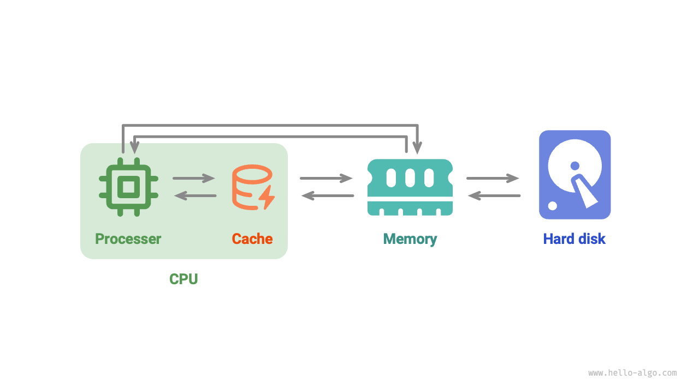

# メモリとキャッシュ *

この章の最初の2つのセクションでは、「連続格納」と「分散格納」をそれぞれ表現する2つの基本的なデータ構造である配列と連結リストを探究しました。

実際、**物理構造はプログラムがメモリとキャッシュをどの程度効率的に利用するかを大きく決定し**、これがアルゴリズムの全体的なパフォーマンスに影響を与えます。

## コンピュータ記憶装置

コンピュータには3種類の記憶装置があります：<u>ハードディスク</u>、<u>ランダムアクセスメモリ（RAM）</u>、および<u>キャッシュメモリ</u>です。以下の表は、コンピュータシステムにおけるそれぞれの役割とパフォーマンス特性を示しています。

 表 <id> &nbsp; コンピュータ記憶装置 

|             | ハードディスク                                                      | メモリ                                                                   | キャッシュ                                                                                           |
| ----------- | -------------------------------------------------------------- | ------------------------------------------------------------------------ | ----------------------------------------------------------------------------------------------- |
| 用途       | OS、プログラム、ファイルなどのデータの長期保存 | 現在実行中のプログラムと処理中のデータの一時保存 | 頻繁にアクセスされるデータと命令を保存し、CPUのメモリへのアクセス数を削減 |
| 揮発性  | 電源オフ後もデータは失われない                               | 電源オフ後にデータは失われる                                             | 電源オフ後にデータは失われる                                                                    |
| 容量    | より大きい、TBレベル                                               | より小さい、GBレベル                                                        | 非常に小さい、MBレベル                                                                            |
| 速度       | より遅い、数百から数千MB/s                      | より高速、数十GB/s                                             | 非常に高速、数十から数百GB/s                                                     |
| 価格（USD） | より安価、数セント/GB                                      | より高価、数ドル/GB                                       | 非常に高価、CPUと一緒に価格設定                                                                 |

コンピュータ記憶システムは、下図に示すようにピラミッドとして視覚化できます。ピラミッドの上部にある記憶装置ほど高速で、容量が小さく、より高価です。このマルチレベル設計は偶然ではなく、コンピュータ科学者とエンジニアによる慎重な検討の結果です。

- **ハードディスクをメモリに置き換えるのは困難です**。第一に、メモリ内のデータは電源オフ後に失われるため、長期データ保存には適していません。第二に、メモリはハードディスクよりも大幅に高価で、消費者市場での広範囲な使用の実現可能性を制限しています。
- **キャッシュは大容量と高速のトレードオフに直面しています**。L1、L2、L3キャッシュの容量が増加するにつれて、その物理サイズが大きくなり、CPUコアからの距離が増加します。これによりデータ転送時間が長くなり、アクセス遅延が高くなります。現在の技術では、マルチレベルキャッシュ構造が容量、速度、コストの間の最適なバランスを提供します。

!!! tip

    コンピュータの記憶階層は、速度、容量、コストの間の慎重なバランスを反映しています。このタイプのトレードオフは様々な業界で一般的であり、利益と制限の間の最適なバランスを見つけることが重要です。

全体的に、**ハードディスクは大量のデータの長期保存を提供し、メモリはプログラム実行中に処理されるデータの一時保存として機能し、キャッシュは頻繁にアクセスされるデータと命令を保存して実行効率を向上させます**。それらは一緒になってコンピュータシステムの効率的な動作を保証します。

下図に示すように、プログラム実行中、データはハードディスクからメモリに読み込まれ、CPU計算が行われます。CPUの拡張として機能するキャッシュは、**メモリからインテリジェントにデータを先読み**し、CPUのより高速なデータアクセスを可能にします。これによりプログラム実行効率が大幅に向上し、低速なメモリへの依存が減少します。

## データ構造のメモリ効率

メモリ空間利用の観点から、配列と連結リストにはそれぞれ利点と制限があります。

一方で、**メモリは限られており、複数のプログラム間で共有できない**ため、データ構造での空間使用の最適化は重要です。配列は要素が密接にパックされており、連結リストのように参照（ポインタ）のための追加メモリを必要としないため、空間効率的です。しかし、配列は連続したメモリブロックを事前に割り当てる必要があり、割り当てられた空間が実際の必要量を超える場合、無駄につながる可能性があります。配列の拡張も追加の時間と空間のオーバーヘッドを伴います。対照的に、連結リストは各ノードに対してメモリを動的に割り当て・解放し、ポインタのための追加メモリのコストでより大きな柔軟性を提供します。

一方で、プログラム実行中、**繰り返されるメモリの割り当てと解放はメモリの断片化を増加させ**、メモリ利用効率を低下させます。配列は連続記憶方式により、メモリ断片化を引き起こす可能性が比較的低いです。対照的に、連結リストは要素を非連続の場所に保存し、頻繁な挿入と削除はメモリ断片化を悪化させる可能性があります。

## データ構造のキャッシュ効率

キャッシュはメモリよりも空間容量がはるかに小さいですが、はるかに高速で、プログラム実行速度において重要な役割を果たします。限られた容量のため、キャッシュは頻繁にアクセスされるデータのサブセットのみを保存できます。CPUがキャッシュに存在しないデータにアクセスしようとすると、<u>キャッシュミス</u>が発生し、CPUは低速なメモリから必要なデータを取得する必要があり、パフォーマンスに影響を与える可能性があります。

明らかに、**キャッシュミスが少ないほど、CPUのデータ読み書き効率が高く**、プログラムパフォーマンスが向上します。CPUがキャッシュからデータを正常に取得する割合は<u>キャッシュヒット率</u>と呼ばれ、キャッシュ効率を測定するためによく使用される指標です。

より高い効率を達成するために、キャッシュは以下のデータロードメカニズムを採用します。

- **キャッシュライン**：キャッシュは個々のバイトではなく、キャッシュラインと呼ばれる単位でデータを保存・ロードして動作します。このアプローチは、一度により大きなデータブロックを転送することで効率を向上させます。
- **先読みメカニズム**：プロセッサはデータアクセスパターン（例：連続または固定ストライドアクセス）を予測し、これらのパターンに基づいてデータをキャッシュに先読みして、キャッシュヒット率を向上させます。
- **空間的局所性**：特定のデータがアクセスされると、近くのデータもまもなくアクセスされる可能性があります。これを活用するために、キャッシュは要求されたデータと一緒に隣接するデータをロードし、ヒット率を向上させます。
- **時間的局所性**：データがアクセスされた場合、近い将来に再びアクセスされる可能性があります。キャッシュはこの原理を使用して、最近アクセスされたデータを保持してヒット率を向上させます。

実際、**配列と連結リストは異なるキャッシュ利用効率を持ち**、これは主に以下の側面に反映されます。

- **占有空間**：連結リスト要素は配列要素よりも多くの空間を占有するため、キャッシュに保持される有効データが少なくなります。
- **キャッシュライン**：連結リストデータはメモリ全体に散在し、キャッシュは「行単位でロード」されるため、ロードされる無効データの割合が高くなります。
- **先読みメカニズム**：配列のデータアクセスパターンは連結リストよりも「予測可能」で、つまりシステムがこれからロードされるデータを推測しやすいです。
- **空間的局所性**：配列は連続したメモリ空間に保存されるため、ロードされているデータの近くのデータがまもなくアクセスされる可能性が高くなります。

全体的に、**配列はより高いキャッシュヒット率を持ち、一般的に連結リストよりも操作効率が高いです**。これにより、配列に基づくデータ構造はアルゴリズム問題の解決において人気があります。

**高いキャッシュ効率が配列が常に連結リストより優れているという意味ではない**ことに注意すべきです。データ構造の選択は特定のアプリケーション要件に依存すべきです。例えば、配列と連結リストの両方が「スタック」データ構造を実装できますが（次章で詳細説明）、それらは異なるシナリオに適しています。

- アルゴリズム問題では、より高い操作効率とランダムアクセス機能を提供するため、配列に基づくスタックを選択する傾向があります。唯一のコストは配列に対して一定量のメモリ空間を事前に割り当てる必要があることです。
- データ量が非常に大きく、高度に動的で、スタックの予想サイズを推定するのが困難な場合、連結リストに基づくスタックがより良い選択です。連結リストは大量のデータをメモリの異なる部分に分散でき、配列拡張の追加オーバーヘッドを回避できます。
