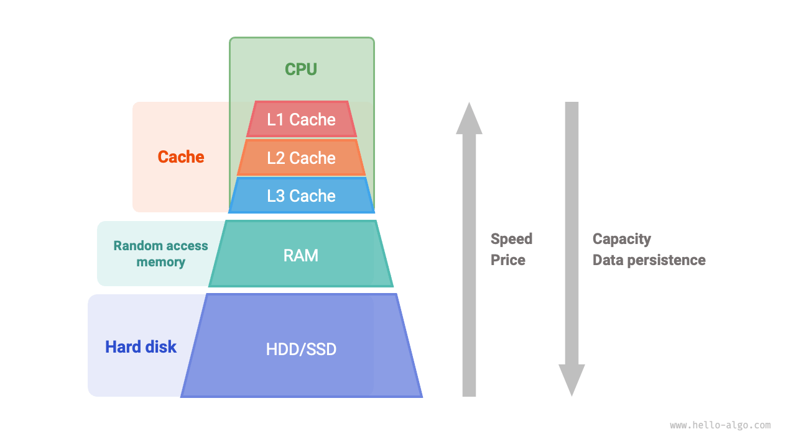
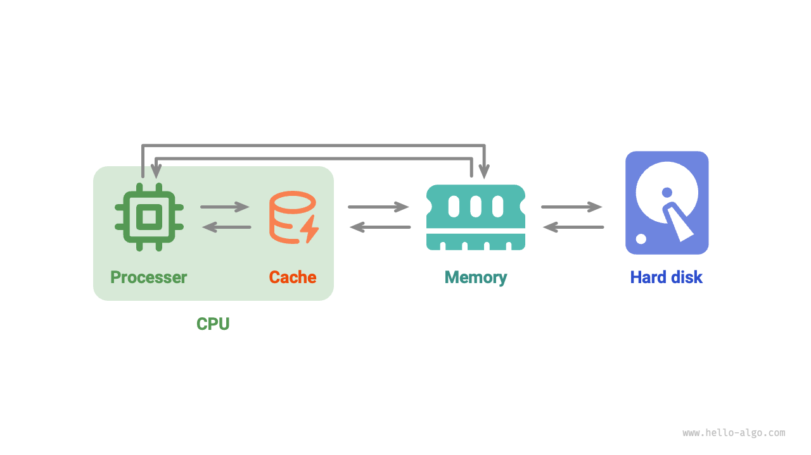

# メモリとキャッシュ *

本章の前二節では、配列と連結リストという二つの基礎的かつ重要なデータ構造を扱いました。これらはそれぞれ「連続格納」と「分散格納」という二つの物理構造を表しています。

実際には、**物理構造はプログラムにおけるメモリとキャッシュの利用効率を大きく左右し**、ひいてはアルゴリズムプログラム全体の性能に影響します。

## コンピュータの記憶装置

コンピュータには三種類の記憶装置があります。<u>ハードディスク（hard disk）</u>、<u>メモリ（random-access memory, RAM）</u>、<u>キャッシュ（cache memory）</u>です。以下の表は、これらがコンピュータシステムで担う役割と性能上の特徴を示しています。

 表 <id> &nbsp; コンピュータの記憶装置 

|                | ハードディスク                           | メモリ                                 | キャッシュ                                        |
| -------------- | ---------------------------------------- | -------------------------------------- | ------------------------------------------------- |
| 用途           | OS、プログラム、ファイルなどを長期保存   | 実行中のプログラムや処理中のデータを一時保存 | 頻繁にアクセスされるデータや命令を保存し、CPU のメモリアクセス回数を減らす |
| 揮発性         | 電源断後もデータは失われない             | 電源断後にデータは失われる             | 電源断後にデータは失われる                        |
| 容量           | 大きい、TB 級                            | 小さい、GB 級                          | 非常に小さい、MB 級                               |
| 速度           | 遅い、数百〜数千 MB/s                    | 速い、数十 GB/s                        | 非常に速い、数十〜数百 GB/s                       |
| 価格（人民元） | 比較的安価、数角〜数元 / GB              | 比較的高価、数十〜数百元 / GB          | 非常に高価、CPU と一体で価格設定される           |

コンピュータの記憶システムは、下図のようなピラミッド構造として捉えられます。ピラミッドの頂点に近い記憶装置ほど速度は速く、容量は小さく、コストは高くなります。この多層構造は偶然ではなく、コンピュータ科学者やエンジニアによる熟慮の末の設計です。

- **ハードディスクはメモリで置き換えにくい**。まず、メモリ内のデータは電源断後に失われるため、長期保存には向きません。次に、メモリのコストはハードディスクの数十倍であり、消費者市場で広く普及しにくいという問題があります。
- **キャッシュは大容量と高速性を両立しにくい**。L1、L2、L3 キャッシュの容量が段階的に増えるにつれて、物理サイズは大きくなり、CPU コアとの物理的距離も遠くなります。その結果、データ転送時間が増え、要素アクセスの遅延も大きくなります。現在の技術では、多層キャッシュ構造が容量、速度、コストの最適なバランスです。

!!! tip

    コンピュータの記憶階層は、速度、容量、コストの三者間にある巧妙なバランスを体現しています。実際、このようなトレードオフはあらゆる工業分野に広く存在しており、異なる利点と制約のあいだで最適な均衡点を見つけることが求められます。

要するに、**ハードディスクは大量データの長期保存に、メモリはプログラム実行中に処理しているデータの一時保存に、キャッシュは頻繁にアクセスされるデータや命令の保存に用いられ**、プログラム実行効率を高めます。三者は協調して動作し、コンピュータシステムの高効率な運用を支えています。

次の図に示すように、プログラム実行時にはデータがハードディスクからメモリへ読み込まれ、CPU の計算に使われます。キャッシュは CPU の一部と見なせ、**メモリからデータを賢く読み込むことで**、CPU に高速なデータ読み出しを提供し、プログラムの実行効率を大きく高め、低速なメモリへの依存を減らします。

## データ構造のメモリ効率

メモリ空間の利用という観点では、配列と連結リストにはそれぞれ利点と制約があります。

一方で、**メモリは有限であり、同じメモリ領域を複数のプログラムで共有することはできません**。そのため、データ構造にはできるだけ効率よく空間を使うことが求められます。配列の要素は密に並んでおり、連結リストのノード間参照（ポインタ）を保持する追加領域が不要なため、空間効率は高くなります。しかし、配列は十分な連続メモリを一度に確保する必要があり、メモリ浪費を招くことがありますし、拡張時にも追加の時間と空間コストがかかります。これに対して連結リストは「ノード」単位で動的にメモリを割り当て・解放でき、より高い柔軟性を備えています。

他方で、プログラムの実行中には、**メモリの確保と解放を繰り返すにつれて、空きメモリの断片化はますます進み**、メモリ利用効率の低下を招きます。配列は連続した格納方式を取るため、比較的メモリ断片化を起こしにくい構造です。反対に、連結リストの要素は分散して格納されるため、頻繁な挿入や削除を行うと、より断片化を招きやすくなります。

## データ構造のキャッシュ効率

キャッシュは容量こそメモリよりはるかに小さいものの、速度はメモリよりずっと速く、プログラム実行速度において極めて重要な役割を果たします。キャッシュ容量には限りがあり、頻繁にアクセスされる一部のデータしか保持できません。そのため、CPU がアクセスしようとするデータがキャッシュ内に存在しない場合、<u>キャッシュミス（cache miss）</u>が発生し、CPU は低速なメモリから必要なデータを読み込まなければなりません。

当然ながら、**「キャッシュミス」が少ないほど、CPU のデータ読み書き効率は高くなり**、プログラム性能も向上します。CPU がキャッシュからデータを正常に取得できた割合を<u>キャッシュヒット率（cache hit rate）</u>と呼び、この指標は通常、キャッシュ効率の評価に用いられます。

できるだけ高い効率を実現するため、キャッシュは次のようなデータ読み込みの仕組みを採用しています。

- **キャッシュライン**：キャッシュはデータを 1 バイト単位で保存・読み込みするのではなく、キャッシュライン単位で扱います。1 バイト単位の転送と比べて、キャッシュライン単位のほうが効率的です。
- **プリフェッチ機構**：プロセッサはデータアクセスのパターン（たとえば順次アクセス、一定ステップ幅のスキップアクセスなど）を予測し、そのパターンに応じてデータをキャッシュへ読み込むことで、ヒット率を高めます。
- **空間的局所性**：あるデータがアクセスされた場合、その近傍のデータも近いうちにアクセスされる可能性があります。そのため、キャッシュはあるデータを読み込む際に、その周辺のデータもあわせて読み込み、ヒット率を高めます。
- **時間的局所性**：あるデータがアクセスされた場合、そのデータは近い将来に再びアクセスされる可能性が高いです。キャッシュはこの性質を利用し、最近アクセスしたデータを保持することでヒット率を高めます。

実際には、**配列と連結リストではキャッシュの利用効率が異なり**、主に次の点に表れます。

- **使用空間**：連結リストの要素は配列要素より多くの空間を占めるため、キャッシュに収まる有効データ量は少なくなります。
- **キャッシュライン**：連結リストのデータはメモリの各所に分散しており、キャッシュは「ライン単位で読み込む」ため、無効データまで読み込む割合が高くなります。
- **プリフェッチ機構**：配列のほうが連結リストよりもデータアクセスのパターンを「予測しやすく」、システムが次に読み込まれるデータを推測しやすくなります。
- **空間的局所性**：配列はまとまったメモリ空間に格納されるため、読み込まれたデータの近くにあるデータも、まもなくアクセスされる可能性が高くなります。

全体として、**配列はより高いキャッシュヒット率を持つため、操作効率では通常、連結リストより優れています**。このため、アルゴリズム問題を解く際には、配列ベースで実装されたデータ構造のほうが好まれることが多くなります。

注意すべきなのは、**キャッシュ効率が高いからといって、配列があらゆる状況で連結リストより優れているとは限らない**という点です。実際にどのデータ構造を選ぶかは、具体的な要件に応じて決めるべきです。たとえば、配列と連結リストはいずれも「スタック」データ構造を実装できますが（次章で詳しく説明します）、適した場面は異なります。

- アルゴリズム問題に取り組むときは、一般に配列ベースのスタックを選ぶ傾向があります。より高い操作効率とランダムアクセス能力を備えており、その代償は配列用に一定量のメモリを事前確保することだけです。
- データ量が非常に大きく、動的性が高く、スタックの想定サイズを見積もりにくい場合は、連結リストベースのスタックのほうが適しています。連結リストなら大量のデータをメモリの異なる場所に分散して保存でき、配列拡張による追加コストも回避できます。
