# 13.1 &nbsp; バックトラッキングアルゴリズム

<u>バックトラッキングアルゴリズム（backtracking algorithm）</u>は、総当たりによって問題を解く手法です。その中核となる考え方は、初期状態から出発し、あり得るすべての解を力任せに探索し、正しい解に到達したらそれを記録し、解を見つけるか、考えられるすべての選択を試しても解が見つからなくなるまで続ける、というものです。

バックトラッキングアルゴリズムでは、通常「深さ優先探索」を用いて解空間をたどります。「二分木」の章で述べたように、前順・中順・後順走査はいずれも深さ優先探索に属します。ここでは前順走査を使ってバックトラッキング問題を構成し、その仕組みを段階的に理解していきます。

!!! question "例題1"

    1 本の二分木が与えられたとき、値が $7$ のノードをすべて探索して記録し、そのノードのリストを返してください。

この問題では、この木を前順走査し、現在のノードの値が $7$ かどうかを判定します。該当する場合は、そのノードの値を結果リスト `res` に追加します。関連する処理は下図と次のコードのとおりです。

=== "Python"

    ```python title="preorder_traversal_i_compact.py"
    def pre_order(root: TreeNode):
        """前順走査：例題 1"""
        if root is None:
            return
        if root.val == 7:
            # 解を記録
            res.append(root)
        pre_order(root.left)
        pre_order(root.right)
    ```

=== "C++"

    ```cpp title="preorder_traversal_i_compact.cpp"
    /* 前順走査：例題 1 */
    void preOrder(TreeNode *root) {
        if (root == nullptr) {
            return;
        }
        if (root->val == 7) {
            // 解を記録
            res.push_back(root);
        }
        preOrder(root->left);
        preOrder(root->right);
    }
    ```

=== "Java"

    ```java title="preorder_traversal_i_compact.java"
    /* 前順走査：例題 1 */
    void preOrder(TreeNode root) {
        if (root == null) {
            return;
        }
        if (root.val == 7) {
            // 解を記録
            res.add(root);
        }
        preOrder(root.left);
        preOrder(root.right);
    }
    ```

=== "C#"

    ```csharp title="preorder_traversal_i_compact.cs"
    /* 前順走査：例題 1 */
    void PreOrder(TreeNode? root) {
        if (root == null) {
            return;
        }
        if (root.val == 7) {
            // 解を記録
            res.Add(root);
        }
        PreOrder(root.left);
        PreOrder(root.right);
    }
    ```

=== "Go"

    ```go title="preorder_traversal_i_compact.go"
    /* 前順走査：例題 1 */
    func preOrderI(root *TreeNode, res *[]*TreeNode) {
        if root == nil {
            return
        }
        if (root.Val).(int) == 7 {
            // 解を記録
            *res = append(*res, root)
        }
        preOrderI(root.Left, res)
        preOrderI(root.Right, res)
    }
    ```

=== "Swift"

    ```swift title="preorder_traversal_i_compact.swift"
    /* 前順走査：例題 1 */
    func preOrder(root: TreeNode?) {
        guard let root = root else {
            return
        }
        if root.val == 7 {
            // 解を記録
            res.append(root)
        }
        preOrder(root: root.left)
        preOrder(root: root.right)
    }
    ```

=== "JS"

    ```javascript title="preorder_traversal_i_compact.js"
    /* 前順走査：例題 1 */
    function preOrder(root, res) {
        if (root === null) {
            return;
        }
        if (root.val === 7) {
            // 解を記録
            res.push(root);
        }
        preOrder(root.left, res);
        preOrder(root.right, res);
    }
    ```

=== "TS"

    ```typescript title="preorder_traversal_i_compact.ts"
    /* 前順走査：例題 1 */
    function preOrder(root: TreeNode | null, res: TreeNode[]): void {
        if (root === null) {
            return;
        }
        if (root.val === 7) {
            // 解を記録
            res.push(root);
        }
        preOrder(root.left, res);
        preOrder(root.right, res);
    }
    ```

=== "Dart"

    ```dart title="preorder_traversal_i_compact.dart"
    /* 前順走査：例題 1 */
    void preOrder(TreeNode? root, List<TreeNode> res) {
      if (root == null) {
        return;
      }
      if (root.val == 7) {
        // 解を記録
        res.add(root);
      }
      preOrder(root.left, res);
      preOrder(root.right, res);
    }
    ```

=== "Rust"

    ```rust title="preorder_traversal_i_compact.rs"
    /* 前順走査：例題 1 */
    fn pre_order(res: &mut Vec<Rc<RefCell<TreeNode>>>, root: Option<&Rc<RefCell<TreeNode>>>) {
        if root.is_none() {
            return;
        }
        if let Some(node) = root {
            if node.borrow().val == 7 {
                // 解を記録
                res.push(node.clone());
            }
            pre_order(res, node.borrow().left.as_ref());
            pre_order(res, node.borrow().right.as_ref());
        }
    }
    ```

=== "C"

    ```c title="preorder_traversal_i_compact.c"
    /* 前順走査：例題 1 */
    void preOrder(TreeNode *root) {
        if (root == NULL) {
            return;
        }
        if (root->val == 7) {
            // 解を記録
            res[resSize++] = root;
        }
        preOrder(root->left);
        preOrder(root->right);
    }
    ```

=== "Kotlin"

    ```kotlin title="preorder_traversal_i_compact.kt"
    /* 前順走査：例題 1 */
    fun preOrder(root: TreeNode?) {
        if (root == null) {
            return
        }
        if (root._val == 7) {
            // 解を記録
            res!!.add(root)
        }
        preOrder(root.left)
        preOrder(root.right)
    }
    ```

=== "Ruby"

    ```ruby title="preorder_traversal_i_compact.rb"
    ### 前順走査：例題1 ###
    def pre_order(root)
      return unless root

      # 解を記録
      $res << root if root.val == 7

      pre_order(root.left)
      pre_order(root.right)
    end
    ```

??? pythontutor "コードの可視化"

    <div style="height: 549px; width: 100%;"><iframe class="pythontutor-iframe" src="https://pythontutor.com/iframe-embed.html#code=class%20TreeNode%3A%0A%20%20%20%20%22%22%22%E4%BA%8C%E5%88%86%E6%9C%A8%E3%83%8E%E3%83%BC%E3%83%89%E3%82%AF%E3%83%A9%E3%82%B9%22%22%22%0A%0A%20%20%20%20def%20__init__%28self%2C%20val%3A%20int%20%3D%200%29%3A%0A%20%20%20%20%20%20%20%20self.val%3A%20int%20%3D%20val%20%20%23%20%E3%83%8E%E3%83%BC%E3%83%89%E5%80%A4%0A%20%20%20%20%20%20%20%20self.left%3A%20TreeNode%20%7C%20None%20%3D%20None%20%20%23%20%E5%B7%A6%E5%AD%90%E3%83%8E%E3%83%BC%E3%83%89%E3%81%B8%E3%81%AE%E5%8F%82%E7%85%A7%0A%20%20%20%20%20%20%20%20self.right%3A%20TreeNode%20%7C%20None%20%3D%20None%20%20%23%20%E5%8F%B3%E5%AD%90%E3%83%8E%E3%83%BC%E3%83%89%E3%81%B8%E3%81%AE%E5%8F%82%E7%85%A7%0A%0Adef%20list_to_tree_dfs%28arr%3A%20list%5Bint%5D%2C%20i%3A%20int%29%20-%3E%20TreeNode%20%7C%20None%3A%0A%20%20%20%20%22%22%22%E3%83%AA%E3%82%B9%E3%83%88%E3%82%92%E4%BA%8C%E5%88%86%E6%9C%A8%E3%81%AB%E3%83%87%E3%82%B7%E3%83%AA%E3%82%A2%E3%83%A9%E3%82%A4%E3%82%BA%E3%81%99%E3%82%8B%3A%20%E5%86%8D%E5%B8%B0%22%22%22%0A%20%20%20%20%23%20%E6%B7%BB%E5%AD%97%E3%81%8C%E9%85%8D%E5%88%97%E9%95%B7%E3%82%92%E8%B6%85%E3%81%88%E3%82%8B%E3%81%8B%E3%80%81%E5%AF%BE%E5%BF%9C%E3%81%99%E3%82%8B%E8%A6%81%E7%B4%A0%E3%81%8C%20None%20%E3%81%AA%E3%82%89%E3%80%81None%20%E3%82%92%E8%BF%94%E3%81%99%0A%20%20%20%20if%20i%20%3C%200%20or%20i%20%3E%3D%20len%28arr%29%20or%20arr%5Bi%5D%20is%20None%3A%0A%20%20%20%20%20%20%20%20return%20None%0A%20%20%20%20%23%20%E7%8F%BE%E5%9C%A8%E3%81%AE%E3%83%8E%E3%83%BC%E3%83%89%E3%82%92%E6%A7%8B%E7%AF%89%E3%81%99%E3%82%8B%0A%20%20%20%20root%20%3D%20TreeNode%28arr%5Bi%5D%29%0A%20%20%20%20%23%20%E5%B7%A6%E5%8F%B3%E3%81%AE%E9%83%A8%E5%88%86%E6%9C%A8%E3%82%92%E5%86%8D%E5%B8%B0%E7%9A%84%E3%81%AB%E6%A7%8B%E7%AF%89%E3%81%99%E3%82%8B%0A%20%20%20%20root.left%20%3D%20list_to_tree_dfs%28arr%2C%202%20%2A%20i%20%2B%201%29%0A%20%20%20%20root.right%20%3D%20list_to_tree_dfs%28arr%2C%202%20%2A%20i%20%2B%202%29%0A%20%20%20%20return%20root%0A%0Adef%20list_to_tree%28arr%3A%20list%5Bint%5D%29%20-%3E%20TreeNode%20%7C%20None%3A%0A%20%20%20%20%22%22%22%E3%83%AA%E3%82%B9%E3%83%88%E3%82%92%E4%BA%8C%E5%88%86%E6%9C%A8%E3%81%AB%E3%83%87%E3%82%B7%E3%83%AA%E3%82%A2%E3%83%A9%E3%82%A4%E3%82%BA%E3%81%99%E3%82%8B%22%22%22%0A%20%20%20%20return%20list_to_tree_dfs%28arr%2C%200%29%0A%0A%0Adef%20pre_order%28root%3A%20TreeNode%29%3A%0A%20%20%20%20%22%22%22%E5%89%8D%E9%A0%86%E8%B5%B0%E6%9F%BB%EF%BC%9A%E4%BE%8B%E9%A1%8C%201%22%22%22%0A%20%20%20%20if%20root%20is%20None%3A%0A%20%20%20%20%20%20%20%20return%0A%20%20%20%20if%20root.val%20%3D%3D%207%3A%0A%20%20%20%20%20%20%20%20%23%20%E8%A7%A3%E3%82%92%E8%A8%98%E9%8C%B2%0A%20%20%20%20%20%20%20%20res.append%28root%29%0A%20%20%20%20pre_order%28root.left%29%0A%20%20%20%20pre_order%28root.right%29%0A%0A%0Aif%20__name__%20%3D%3D%20%22__main__%22%3A%0A%20%20%20%20root%20%3D%20list_to_tree%28%5B1%2C%207%2C%203%2C%204%2C%205%2C%206%2C%207%5D%29%0A%0A%20%20%20%20%23%20%E5%85%88%E8%A1%8C%E9%A0%86%E8%B5%B0%E6%9F%BB%0A%20%20%20%20res%20%3D%20list%5BTreeNode%5D%28%29%0A%20%20%20%20pre_order%28root%29%0A%0A%20%20%20%20print%28%22%5Cn%E5%80%A4%E3%81%8C%207%20%E3%81%AE%E3%83%8E%E3%83%BC%E3%83%89%E3%82%92%E3%81%99%E3%81%B9%E3%81%A6%E5%87%BA%E5%8A%9B%22%29%0A%20%20%20%20print%28%5Bnode.val%20for%20node%20in%20res%5D%29&codeDivHeight=472&codeDivWidth=350&cumulative=false&curInstr=126&heapPrimitives=nevernest&origin=opt-frontend.js&py=311&rawInputLstJSON=%5B%5D&textReferences=false"> </iframe></div>
    <div style="margin-top: 5px;"><a href="https://pythontutor.com/iframe-embed.html#code=class%20TreeNode%3A%0A%20%20%20%20%22%22%22%E4%BA%8C%E5%88%86%E6%9C%A8%E3%83%8E%E3%83%BC%E3%83%89%E3%82%AF%E3%83%A9%E3%82%B9%22%22%22%0A%0A%20%20%20%20def%20__init__%28self%2C%20val%3A%20int%20%3D%200%29%3A%0A%20%20%20%20%20%20%20%20self.val%3A%20int%20%3D%20val%20%20%23%20%E3%83%8E%E3%83%BC%E3%83%89%E5%80%A4%0A%20%20%20%20%20%20%20%20self.left%3A%20TreeNode%20%7C%20None%20%3D%20None%20%20%23%20%E5%B7%A6%E5%AD%90%E3%83%8E%E3%83%BC%E3%83%89%E3%81%B8%E3%81%AE%E5%8F%82%E7%85%A7%0A%20%20%20%20%20%20%20%20self.right%3A%20TreeNode%20%7C%20None%20%3D%20None%20%20%23%20%E5%8F%B3%E5%AD%90%E3%83%8E%E3%83%BC%E3%83%89%E3%81%B8%E3%81%AE%E5%8F%82%E7%85%A7%0A%0Adef%20list_to_tree_dfs%28arr%3A%20list%5Bint%5D%2C%20i%3A%20int%29%20-%3E%20TreeNode%20%7C%20None%3A%0A%20%20%20%20%22%22%22%E3%83%AA%E3%82%B9%E3%83%88%E3%82%92%E4%BA%8C%E5%88%86%E6%9C%A8%E3%81%AB%E3%83%87%E3%82%B7%E3%83%AA%E3%82%A2%E3%83%A9%E3%82%A4%E3%82%BA%E3%81%99%E3%82%8B%3A%20%E5%86%8D%E5%B8%B0%22%22%22%0A%20%20%20%20%23%20%E6%B7%BB%E5%AD%97%E3%81%8C%E9%85%8D%E5%88%97%E9%95%B7%E3%82%92%E8%B6%85%E3%81%88%E3%82%8B%E3%81%8B%E3%80%81%E5%AF%BE%E5%BF%9C%E3%81%99%E3%82%8B%E8%A6%81%E7%B4%A0%E3%81%8C%20None%20%E3%81%AA%E3%82%89%E3%80%81None%20%E3%82%92%E8%BF%94%E3%81%99%0A%20%20%20%20if%20i%20%3C%200%20or%20i%20%3E%3D%20len%28arr%29%20or%20arr%5Bi%5D%20is%20None%3A%0A%20%20%20%20%20%20%20%20return%20None%0A%20%20%20%20%23%20%E7%8F%BE%E5%9C%A8%E3%81%AE%E3%83%8E%E3%83%BC%E3%83%89%E3%82%92%E6%A7%8B%E7%AF%89%E3%81%99%E3%82%8B%0A%20%20%20%20root%20%3D%20TreeNode%28arr%5Bi%5D%29%0A%20%20%20%20%23%20%E5%B7%A6%E5%8F%B3%E3%81%AE%E9%83%A8%E5%88%86%E6%9C%A8%E3%82%92%E5%86%8D%E5%B8%B0%E7%9A%84%E3%81%AB%E6%A7%8B%E7%AF%89%E3%81%99%E3%82%8B%0A%20%20%20%20root.left%20%3D%20list_to_tree_dfs%28arr%2C%202%20%2A%20i%20%2B%201%29%0A%20%20%20%20root.right%20%3D%20list_to_tree_dfs%28arr%2C%202%20%2A%20i%20%2B%202%29%0A%20%20%20%20return%20root%0A%0Adef%20list_to_tree%28arr%3A%20list%5Bint%5D%29%20-%3E%20TreeNode%20%7C%20None%3A%0A%20%20%20%20%22%22%22%E3%83%AA%E3%82%B9%E3%83%88%E3%82%92%E4%BA%8C%E5%88%86%E6%9C%A8%E3%81%AB%E3%83%87%E3%82%B7%E3%83%AA%E3%82%A2%E3%83%A9%E3%82%A4%E3%82%BA%E3%81%99%E3%82%8B%22%22%22%0A%20%20%20%20return%20list_to_tree_dfs%28arr%2C%200%29%0A%0A%0Adef%20pre_order%28root%3A%20TreeNode%29%3A%0A%20%20%20%20%22%22%22%E5%89%8D%E9%A0%86%E8%B5%B0%E6%9F%BB%EF%BC%9A%E4%BE%8B%E9%A1%8C%201%22%22%22%0A%20%20%20%20if%20root%20is%20None%3A%0A%20%20%20%20%20%20%20%20return%0A%20%20%20%20if%20root.val%20%3D%3D%207%3A%0A%20%20%20%20%20%20%20%20%23%20%E8%A7%A3%E3%82%92%E8%A8%98%E9%8C%B2%0A%20%20%20%20%20%20%20%20res.append%28root%29%0A%20%20%20%20pre_order%28root.left%29%0A%20%20%20%20pre_order%28root.right%29%0A%0A%0Aif%20__name__%20%3D%3D%20%22__main__%22%3A%0A%20%20%20%20root%20%3D%20list_to_tree%28%5B1%2C%207%2C%203%2C%204%2C%205%2C%206%2C%207%5D%29%0A%0A%20%20%20%20%23%20%E5%85%88%E8%A1%8C%E9%A0%86%E8%B5%B0%E6%9F%BB%0A%20%20%20%20res%20%3D%20list%5BTreeNode%5D%28%29%0A%20%20%20%20pre_order%28root%29%0A%0A%20%20%20%20print%28%22%5Cn%E5%80%A4%E3%81%8C%207%20%E3%81%AE%E3%83%8E%E3%83%BC%E3%83%89%E3%82%92%E3%81%99%E3%81%B9%E3%81%A6%E5%87%BA%E5%8A%9B%22%29%0A%20%20%20%20print%28%5Bnode.val%20for%20node%20in%20res%5D%29&codeDivHeight=800&codeDivWidth=600&cumulative=false&curInstr=126&heapPrimitives=nevernest&origin=opt-frontend.js&py=311&rawInputLstJSON=%5B%5D&textReferences=false" target="_blank" rel="noopener noreferrer">全画面で見る ></a></div>

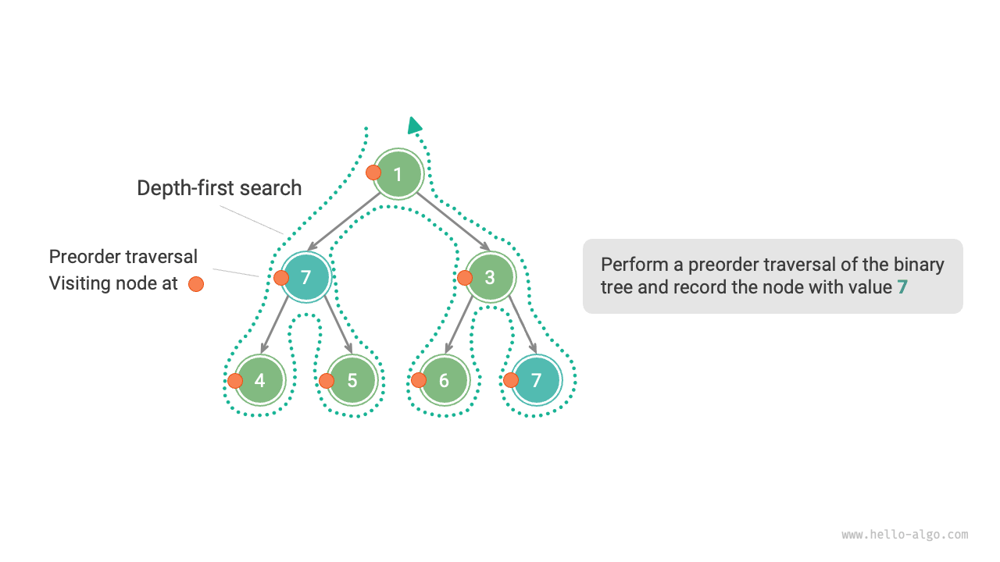{ class="animation-figure" }

<p align="center"> 図 13-1 &nbsp; 前順走査でノードを探索する </p>

## 13.1.1 &nbsp; 試行と戻る

**バックトラッキングアルゴリズムと呼ばれるのは、解空間を探索する際に「試行」と「戻る」という戦略を取るためです**。探索中に、ある状態から先へ進めない、または条件を満たす解を得られないと分かった場合、アルゴリズムは直前の選択を取り消して前の状態へ戻り、別の選択肢を試します。

例題1では、各ノードへの訪問が 1 回の「試行」に対応し、葉ノードを越えるか親ノードへ戻る `return` は「戻る」を表します。

ここで強調しておきたいのは、**戻るとは関数の return だけを指すわけではない**という点です。これを説明するために、例題1を少し拡張します。

!!! question "例題2"

    二分木の中で値が $7$ のノードをすべて探索し、**根ノードからそれらのノードまでの経路を返してください**。

例題1のコードを土台に、訪問済みノードの経路を記録するためのリスト `path` を導入します。値が $7$ のノードに到達したら、`path` をコピーして結果リスト `res` に追加します。走査が完了すると、`res` にはすべての解が保存されています。コードは次のとおりです。

=== "Python"

    ```python title="preorder_traversal_ii_compact.py"
    def pre_order(root: TreeNode):
        """前順走査：例題 2"""
        if root is None:
            return
        # 試す
        path.append(root)
        if root.val == 7:
            # 解を記録
            res.append(list(path))
        pre_order(root.left)
        pre_order(root.right)
        # バックトラック
        path.pop()
    ```

=== "C++"

    ```cpp title="preorder_traversal_ii_compact.cpp"
    /* 前順走査：例題 2 */
    void preOrder(TreeNode *root) {
        if (root == nullptr) {
            return;
        }
        // 試す
        path.push_back(root);
        if (root->val == 7) {
            // 解を記録
            res.push_back(path);
        }
        preOrder(root->left);
        preOrder(root->right);
        // バックトラック
        path.pop_back();
    }
    ```

=== "Java"

    ```java title="preorder_traversal_ii_compact.java"
    /* 前順走査：例題 2 */
    void preOrder(TreeNode root) {
        if (root == null) {
            return;
        }
        // 試す
        path.add(root);
        if (root.val == 7) {
            // 解を記録
            res.add(new ArrayList<>(path));
        }
        preOrder(root.left);
        preOrder(root.right);
        // バックトラック
        path.remove(path.size() - 1);
    }
    ```

=== "C#"

    ```csharp title="preorder_traversal_ii_compact.cs"
    /* 前順走査：例題 2 */
    void PreOrder(TreeNode? root) {
        if (root == null) {
            return;
        }
        // 試す
        path.Add(root);
        if (root.val == 7) {
            // 解を記録
            res.Add(new List<TreeNode>(path));
        }
        PreOrder(root.left);
        PreOrder(root.right);
        // バックトラック
        path.RemoveAt(path.Count - 1);
    }
    ```

=== "Go"

    ```go title="preorder_traversal_ii_compact.go"
    /* 前順走査：例題 2 */
    func preOrderII(root *TreeNode, res *[][]*TreeNode, path *[]*TreeNode) {
        if root == nil {
            return
        }
        // 試す
        *path = append(*path, root)
        if root.Val.(int) == 7 {
            // 解を記録
            *res = append(*res, append([]*TreeNode{}, *path...))
        }
        preOrderII(root.Left, res, path)
        preOrderII(root.Right, res, path)
        // バックトラック
        *path = (*path)[:len(*path)-1]
    }
    ```

=== "Swift"

    ```swift title="preorder_traversal_ii_compact.swift"
    /* 前順走査：例題 2 */
    func preOrder(root: TreeNode?) {
        guard let root = root else {
            return
        }
        // 試す
        path.append(root)
        if root.val == 7 {
            // 解を記録
            res.append(path)
        }
        preOrder(root: root.left)
        preOrder(root: root.right)
        // バックトラック
        path.removeLast()
    }
    ```

=== "JS"

    ```javascript title="preorder_traversal_ii_compact.js"
    /* 前順走査：例題 2 */
    function preOrder(root, path, res) {
        if (root === null) {
            return;
        }
        // 試す
        path.push(root);
        if (root.val === 7) {
            // 解を記録
            res.push([...path]);
        }
        preOrder(root.left, path, res);
        preOrder(root.right, path, res);
        // バックトラック
        path.pop();
    }
    ```

=== "TS"

    ```typescript title="preorder_traversal_ii_compact.ts"
    /* 前順走査：例題 2 */
    function preOrder(
        root: TreeNode | null,
        path: TreeNode[],
        res: TreeNode[][]
    ): void {
        if (root === null) {
            return;
        }
        // 試す
        path.push(root);
        if (root.val === 7) {
            // 解を記録
            res.push([...path]);
        }
        preOrder(root.left, path, res);
        preOrder(root.right, path, res);
        // バックトラック
        path.pop();
    }
    ```

=== "Dart"

    ```dart title="preorder_traversal_ii_compact.dart"
    /* 前順走査：例題 2 */
    void preOrder(
      TreeNode? root,
      List<TreeNode> path,
      List<List<TreeNode>> res,
    ) {
      if (root == null) {
        return;
      }

      // 試す
      path.add(root);
      if (root.val == 7) {
        // 解を記録
        res.add(List.from(path));
      }
      preOrder(root.left, path, res);
      preOrder(root.right, path, res);
      // バックトラック
      path.removeLast();
    }
    ```

=== "Rust"

    ```rust title="preorder_traversal_ii_compact.rs"
    /* 前順走査：例題 2 */
    fn pre_order(
        res: &mut Vec<Vec<Rc<RefCell<TreeNode>>>>,
        path: &mut Vec<Rc<RefCell<TreeNode>>>,
        root: Option<&Rc<RefCell<TreeNode>>>,
    ) {
        if root.is_none() {
            return;
        }
        if let Some(node) = root {
            // 試す
            path.push(node.clone());
            if node.borrow().val == 7 {
                // 解を記録
                res.push(path.clone());
            }
            pre_order(res, path, node.borrow().left.as_ref());
            pre_order(res, path, node.borrow().right.as_ref());
            // バックトラック
            path.pop();
        }
    }
    ```

=== "C"

    ```c title="preorder_traversal_ii_compact.c"
    /* 前順走査：例題 2 */
    void preOrder(TreeNode *root) {
        if (root == NULL) {
            return;
        }
        // 試す
        path[pathSize++] = root;
        if (root->val == 7) {
            // 解を記録
            for (int i = 0; i < pathSize; ++i) {
                res[resSize][i] = path[i];
            }
            resSize++;
        }
        preOrder(root->left);
        preOrder(root->right);
        // バックトラック
        pathSize--;
    }
    ```

=== "Kotlin"

    ```kotlin title="preorder_traversal_ii_compact.kt"
    /* 前順走査：例題 2 */
    fun preOrder(root: TreeNode?) {
        if (root == null) {
            return
        }
        // 試す
        path!!.add(root)
        if (root._val == 7) {
            // 解を記録
            res!!.add(path!!.toMutableList())
        }
        preOrder(root.left)
        preOrder(root.right)
        // バックトラック
        path!!.removeAt(path!!.size - 1)
    }
    ```

=== "Ruby"

    ```ruby title="preorder_traversal_ii_compact.rb"
    ### 前順走査：例題2 ###
    def pre_order(root)
      return unless root

      # 試す
      $path << root

      # 解を記録
      $res << $path.dup if root.val == 7

      pre_order(root.left)
      pre_order(root.right)

      # バックトラック
      $path.pop
    end
    ```

??? pythontutor "コードの可視化"

    <div style="height: 549px; width: 100%;"><iframe class="pythontutor-iframe" src="https://pythontutor.com/iframe-embed.html#code=class%20TreeNode%3A%0A%20%20%20%20%22%22%22%E4%BA%8C%E5%88%86%E6%9C%A8%E3%83%8E%E3%83%BC%E3%83%89%E3%82%AF%E3%83%A9%E3%82%B9%22%22%22%0A%0A%20%20%20%20def%20__init__%28self%2C%20val%3A%20int%20%3D%200%29%3A%0A%20%20%20%20%20%20%20%20self.val%3A%20int%20%3D%20val%20%20%23%20%E3%83%8E%E3%83%BC%E3%83%89%E5%80%A4%0A%20%20%20%20%20%20%20%20self.left%3A%20TreeNode%20%7C%20None%20%3D%20None%20%20%23%20%E5%B7%A6%E5%AD%90%E3%83%8E%E3%83%BC%E3%83%89%E3%81%B8%E3%81%AE%E5%8F%82%E7%85%A7%0A%20%20%20%20%20%20%20%20self.right%3A%20TreeNode%20%7C%20None%20%3D%20None%20%20%23%20%E5%8F%B3%E5%AD%90%E3%83%8E%E3%83%BC%E3%83%89%E3%81%B8%E3%81%AE%E5%8F%82%E7%85%A7%0A%0Adef%20list_to_tree_dfs%28arr%3A%20list%5Bint%5D%2C%20i%3A%20int%29%20-%3E%20TreeNode%20%7C%20None%3A%0A%20%20%20%20%22%22%22%E3%83%AA%E3%82%B9%E3%83%88%E3%82%92%E4%BA%8C%E5%88%86%E6%9C%A8%E3%81%AB%E3%83%87%E3%82%B7%E3%83%AA%E3%82%A2%E3%83%A9%E3%82%A4%E3%82%BA%E3%81%99%E3%82%8B%3A%20%E5%86%8D%E5%B8%B0%22%22%22%0A%20%20%20%20%23%20%E6%B7%BB%E5%AD%97%E3%81%8C%E9%85%8D%E5%88%97%E9%95%B7%E3%82%92%E8%B6%85%E3%81%88%E3%82%8B%E3%81%8B%E3%80%81%E5%AF%BE%E5%BF%9C%E3%81%99%E3%82%8B%E8%A6%81%E7%B4%A0%E3%81%8C%20None%20%E3%81%AA%E3%82%89%E3%80%81None%20%E3%82%92%E8%BF%94%E3%81%99%0A%20%20%20%20if%20i%20%3C%200%20or%20i%20%3E%3D%20len%28arr%29%20or%20arr%5Bi%5D%20is%20None%3A%0A%20%20%20%20%20%20%20%20return%20None%0A%20%20%20%20%23%20%E7%8F%BE%E5%9C%A8%E3%81%AE%E3%83%8E%E3%83%BC%E3%83%89%E3%82%92%E6%A7%8B%E7%AF%89%E3%81%99%E3%82%8B%0A%20%20%20%20root%20%3D%20TreeNode%28arr%5Bi%5D%29%0A%20%20%20%20%23%20%E5%B7%A6%E5%8F%B3%E3%81%AE%E9%83%A8%E5%88%86%E6%9C%A8%E3%82%92%E5%86%8D%E5%B8%B0%E7%9A%84%E3%81%AB%E6%A7%8B%E7%AF%89%E3%81%99%E3%82%8B%0A%20%20%20%20root.left%20%3D%20list_to_tree_dfs%28arr%2C%202%20%2A%20i%20%2B%201%29%0A%20%20%20%20root.right%20%3D%20list_to_tree_dfs%28arr%2C%202%20%2A%20i%20%2B%202%29%0A%20%20%20%20return%20root%0A%0Adef%20list_to_tree%28arr%3A%20list%5Bint%5D%29%20-%3E%20TreeNode%20%7C%20None%3A%0A%20%20%20%20%22%22%22%E3%83%AA%E3%82%B9%E3%83%88%E3%82%92%E4%BA%8C%E5%88%86%E6%9C%A8%E3%81%AB%E3%83%87%E3%82%B7%E3%83%AA%E3%82%A2%E3%83%A9%E3%82%A4%E3%82%BA%E3%81%99%E3%82%8B%22%22%22%0A%20%20%20%20return%20list_to_tree_dfs%28arr%2C%200%29%0A%0A%0Adef%20pre_order%28root%3A%20TreeNode%29%3A%0A%20%20%20%20%22%22%22%E5%89%8D%E9%A0%86%E8%B5%B0%E6%9F%BB%EF%BC%9A%E4%BE%8B%E9%A1%8C%202%22%22%22%0A%20%20%20%20if%20root%20is%20None%3A%0A%20%20%20%20%20%20%20%20return%0A%20%20%20%20%23%20%E8%A9%A6%E3%81%99%0A%20%20%20%20path.append%28root%29%0A%20%20%20%20if%20root.val%20%3D%3D%207%3A%0A%20%20%20%20%20%20%20%20%23%20%E8%A7%A3%E3%82%92%E8%A8%98%E9%8C%B2%0A%20%20%20%20%20%20%20%20res.append%28list%28path%29%29%0A%20%20%20%20pre_order%28root.left%29%0A%20%20%20%20pre_order%28root.right%29%0A%20%20%20%20%23%20%E3%83%90%E3%83%83%E3%82%AF%E3%83%88%E3%83%A9%E3%83%83%E3%82%AF%0A%20%20%20%20path.pop%28%29%0A%0A%0Aif%20__name__%20%3D%3D%20%22__main__%22%3A%0A%20%20%20%20root%20%3D%20list_to_tree%28%5B1%2C%207%2C%203%2C%204%2C%205%2C%206%2C%207%5D%29%0A%0A%20%20%20%20%23%20%E5%85%88%E8%A1%8C%E9%A0%86%E8%B5%B0%E6%9F%BB%0A%20%20%20%20path%20%3D%20list%5BTreeNode%5D%28%29%0A%20%20%20%20res%20%3D%20list%5Blist%5BTreeNode%5D%5D%28%29%0A%20%20%20%20pre_order%28root%29%0A%0A%20%20%20%20print%28%22%5Cn%E6%A0%B9%E3%83%8E%E3%83%BC%E3%83%89%E3%81%8B%E3%82%89%E3%83%8E%E3%83%BC%E3%83%89%207%20%E3%81%BE%E3%81%A7%E3%81%AE%E7%B5%8C%E8%B7%AF%E3%82%92%E3%81%99%E3%81%B9%E3%81%A6%E5%87%BA%E5%8A%9B%22%29%0A%20%20%20%20for%20path%20in%20res%3A%0A%20%20%20%20%20%20%20%20print%28%5Bnode.val%20for%20node%20in%20path%5D%29&codeDivHeight=472&codeDivWidth=350&cumulative=false&curInstr=126&heapPrimitives=nevernest&origin=opt-frontend.js&py=311&rawInputLstJSON=%5B%5D&textReferences=false"> </iframe></div>
    <div style="margin-top: 5px;"><a href="https://pythontutor.com/iframe-embed.html#code=class%20TreeNode%3A%0A%20%20%20%20%22%22%22%E4%BA%8C%E5%88%86%E6%9C%A8%E3%83%8E%E3%83%BC%E3%83%89%E3%82%AF%E3%83%A9%E3%82%B9%22%22%22%0A%0A%20%20%20%20def%20__init__%28self%2C%20val%3A%20int%20%3D%200%29%3A%0A%20%20%20%20%20%20%20%20self.val%3A%20int%20%3D%20val%20%20%23%20%E3%83%8E%E3%83%BC%E3%83%89%E5%80%A4%0A%20%20%20%20%20%20%20%20self.left%3A%20TreeNode%20%7C%20None%20%3D%20None%20%20%23%20%E5%B7%A6%E5%AD%90%E3%83%8E%E3%83%BC%E3%83%89%E3%81%B8%E3%81%AE%E5%8F%82%E7%85%A7%0A%20%20%20%20%20%20%20%20self.right%3A%20TreeNode%20%7C%20None%20%3D%20None%20%20%23%20%E5%8F%B3%E5%AD%90%E3%83%8E%E3%83%BC%E3%83%89%E3%81%B8%E3%81%AE%E5%8F%82%E7%85%A7%0A%0Adef%20list_to_tree_dfs%28arr%3A%20list%5Bint%5D%2C%20i%3A%20int%29%20-%3E%20TreeNode%20%7C%20None%3A%0A%20%20%20%20%22%22%22%E3%83%AA%E3%82%B9%E3%83%88%E3%82%92%E4%BA%8C%E5%88%86%E6%9C%A8%E3%81%AB%E3%83%87%E3%82%B7%E3%83%AA%E3%82%A2%E3%83%A9%E3%82%A4%E3%82%BA%E3%81%99%E3%82%8B%3A%20%E5%86%8D%E5%B8%B0%22%22%22%0A%20%20%20%20%23%20%E6%B7%BB%E5%AD%97%E3%81%8C%E9%85%8D%E5%88%97%E9%95%B7%E3%82%92%E8%B6%85%E3%81%88%E3%82%8B%E3%81%8B%E3%80%81%E5%AF%BE%E5%BF%9C%E3%81%99%E3%82%8B%E8%A6%81%E7%B4%A0%E3%81%8C%20None%20%E3%81%AA%E3%82%89%E3%80%81None%20%E3%82%92%E8%BF%94%E3%81%99%0A%20%20%20%20if%20i%20%3C%200%20or%20i%20%3E%3D%20len%28arr%29%20or%20arr%5Bi%5D%20is%20None%3A%0A%20%20%20%20%20%20%20%20return%20None%0A%20%20%20%20%23%20%E7%8F%BE%E5%9C%A8%E3%81%AE%E3%83%8E%E3%83%BC%E3%83%89%E3%82%92%E6%A7%8B%E7%AF%89%E3%81%99%E3%82%8B%0A%20%20%20%20root%20%3D%20TreeNode%28arr%5Bi%5D%29%0A%20%20%20%20%23%20%E5%B7%A6%E5%8F%B3%E3%81%AE%E9%83%A8%E5%88%86%E6%9C%A8%E3%82%92%E5%86%8D%E5%B8%B0%E7%9A%84%E3%81%AB%E6%A7%8B%E7%AF%89%E3%81%99%E3%82%8B%0A%20%20%20%20root.left%20%3D%20list_to_tree_dfs%28arr%2C%202%20%2A%20i%20%2B%201%29%0A%20%20%20%20root.right%20%3D%20list_to_tree_dfs%28arr%2C%202%20%2A%20i%20%2B%202%29%0A%20%20%20%20return%20root%0A%0Adef%20list_to_tree%28arr%3A%20list%5Bint%5D%29%20-%3E%20TreeNode%20%7C%20None%3A%0A%20%20%20%20%22%22%22%E3%83%AA%E3%82%B9%E3%83%88%E3%82%92%E4%BA%8C%E5%88%86%E6%9C%A8%E3%81%AB%E3%83%87%E3%82%B7%E3%83%AA%E3%82%A2%E3%83%A9%E3%82%A4%E3%82%BA%E3%81%99%E3%82%8B%22%22%22%0A%20%20%20%20return%20list_to_tree_dfs%28arr%2C%200%29%0A%0A%0Adef%20pre_order%28root%3A%20TreeNode%29%3A%0A%20%20%20%20%22%22%22%E5%89%8D%E9%A0%86%E8%B5%B0%E6%9F%BB%EF%BC%9A%E4%BE%8B%E9%A1%8C%202%22%22%22%0A%20%20%20%20if%20root%20is%20None%3A%0A%20%20%20%20%20%20%20%20return%0A%20%20%20%20%23%20%E8%A9%A6%E3%81%99%0A%20%20%20%20path.append%28root%29%0A%20%20%20%20if%20root.val%20%3D%3D%207%3A%0A%20%20%20%20%20%20%20%20%23%20%E8%A7%A3%E3%82%92%E8%A8%98%E9%8C%B2%0A%20%20%20%20%20%20%20%20res.append%28list%28path%29%29%0A%20%20%20%20pre_order%28root.left%29%0A%20%20%20%20pre_order%28root.right%29%0A%20%20%20%20%23%20%E3%83%90%E3%83%83%E3%82%AF%E3%83%88%E3%83%A9%E3%83%83%E3%82%AF%0A%20%20%20%20path.pop%28%29%0A%0A%0Aif%20__name__%20%3D%3D%20%22__main__%22%3A%0A%20%20%20%20root%20%3D%20list_to_tree%28%5B1%2C%207%2C%203%2C%204%2C%205%2C%206%2C%207%5D%29%0A%0A%20%20%20%20%23%20%E5%85%88%E8%A1%8C%E9%A0%86%E8%B5%B0%E6%9F%BB%0A%20%20%20%20path%20%3D%20list%5BTreeNode%5D%28%29%0A%20%20%20%20res%20%3D%20list%5Blist%5BTreeNode%5D%5D%28%29%0A%20%20%20%20pre_order%28root%29%0A%0A%20%20%20%20print%28%22%5Cn%E6%A0%B9%E3%83%8E%E3%83%BC%E3%83%89%E3%81%8B%E3%82%89%E3%83%8E%E3%83%BC%E3%83%89%207%20%E3%81%BE%E3%81%A7%E3%81%AE%E7%B5%8C%E8%B7%AF%E3%82%92%E3%81%99%E3%81%B9%E3%81%A6%E5%87%BA%E5%8A%9B%22%29%0A%20%20%20%20for%20path%20in%20res%3A%0A%20%20%20%20%20%20%20%20print%28%5Bnode.val%20for%20node%20in%20path%5D%29&codeDivHeight=800&codeDivWidth=600&cumulative=false&curInstr=126&heapPrimitives=nevernest&origin=opt-frontend.js&py=311&rawInputLstJSON=%5B%5D&textReferences=false" target="_blank" rel="noopener noreferrer">全画面で見る ></a></div>

各「試行」で現在のノードを `path` に追加して経路を記録し、「戻る」前にはそのノードを `path` から取り除き、**今回の試行前の状態を復元する**必要があります。

次の図に示す過程を見ると、**試行と戻るは「前進」と「取り消し」として理解できます**。この 2 つの操作は互いに逆向きです。

=== "<1>"
    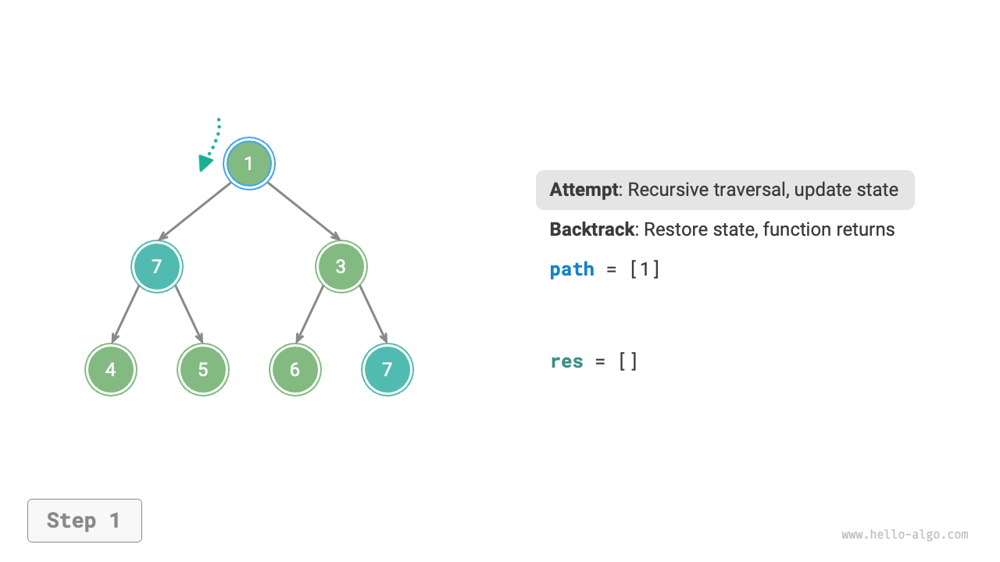{ class="animation-figure" }

=== "<2>"
    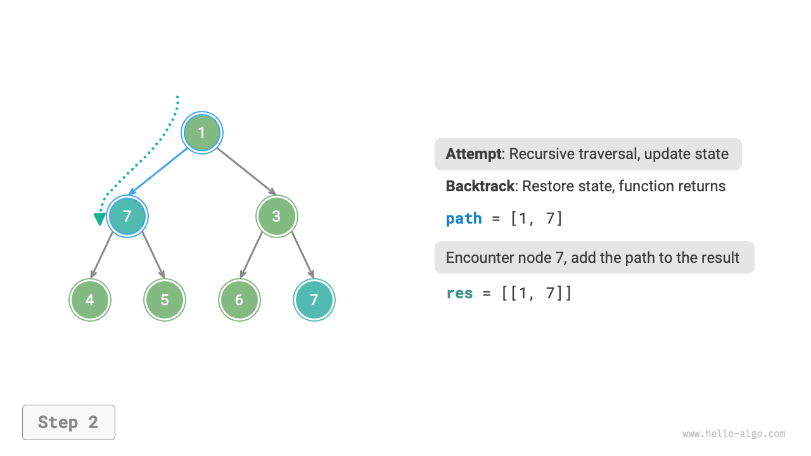{ class="animation-figure" }

=== "<3>"
    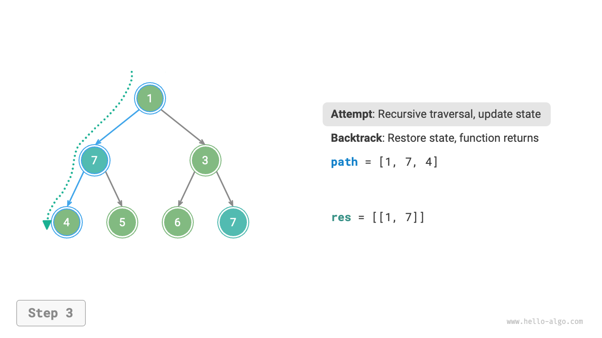{ class="animation-figure" }

=== "<4>"
    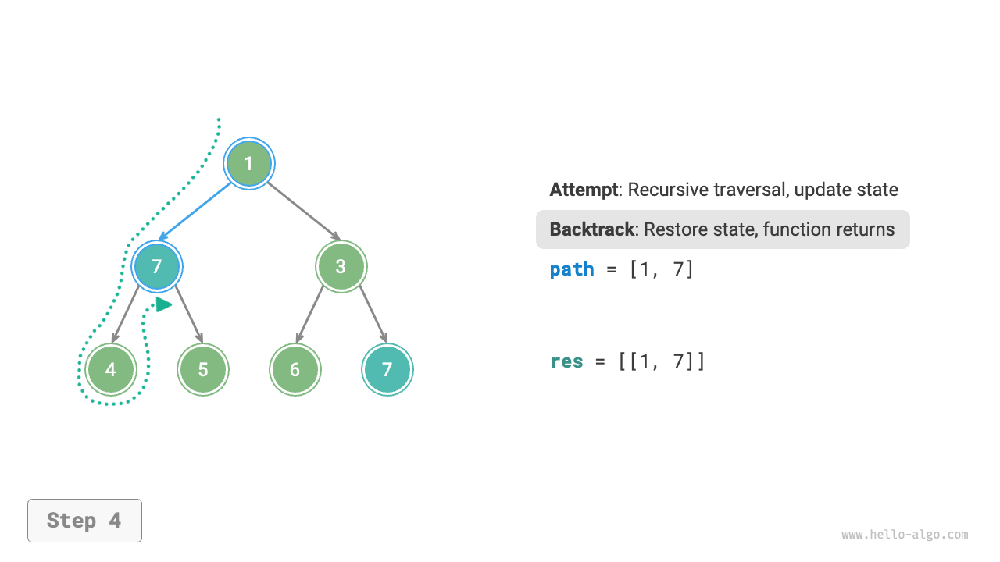{ class="animation-figure" }

=== "<5>"
    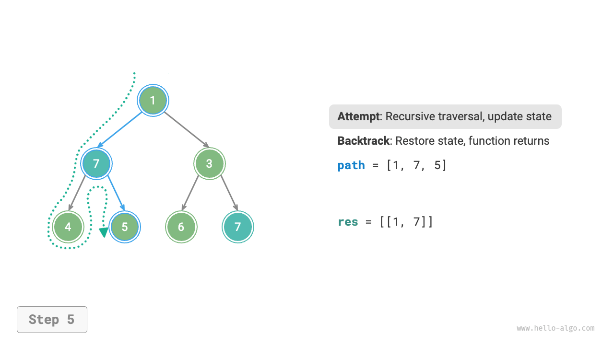{ class="animation-figure" }

=== "<6>"
    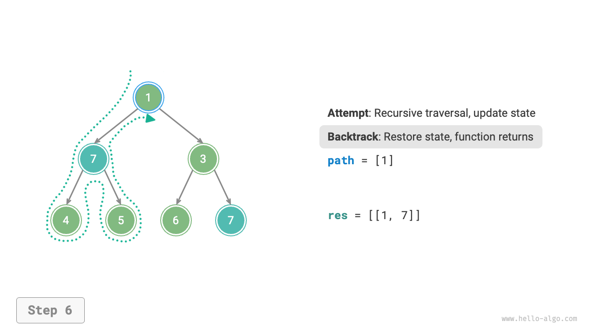{ class="animation-figure" }

=== "<7>"
    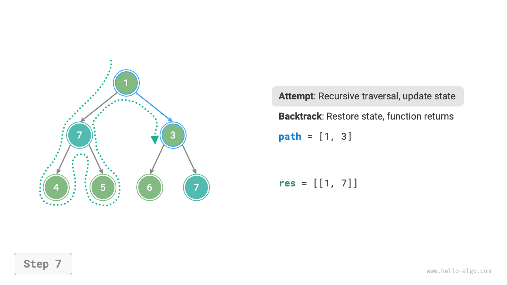{ class="animation-figure" }

=== "<8>"
    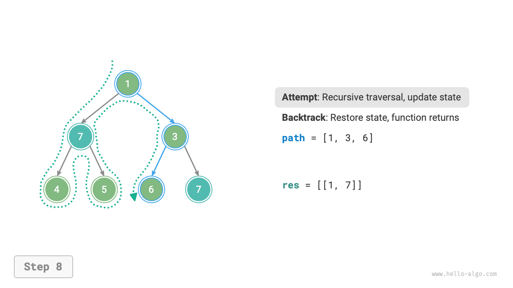{ class="animation-figure" }

=== "<9>"
    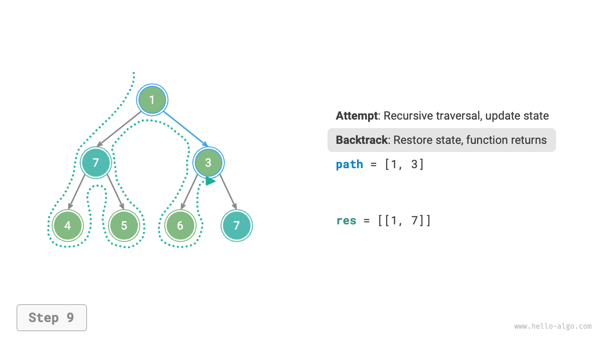{ class="animation-figure" }

=== "<10>"
    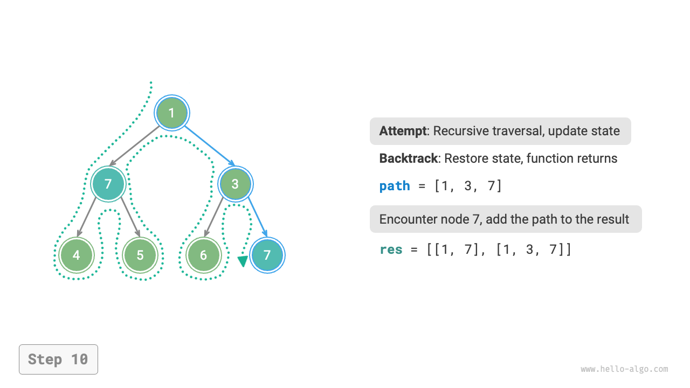{ class="animation-figure" }

=== "<11>"
    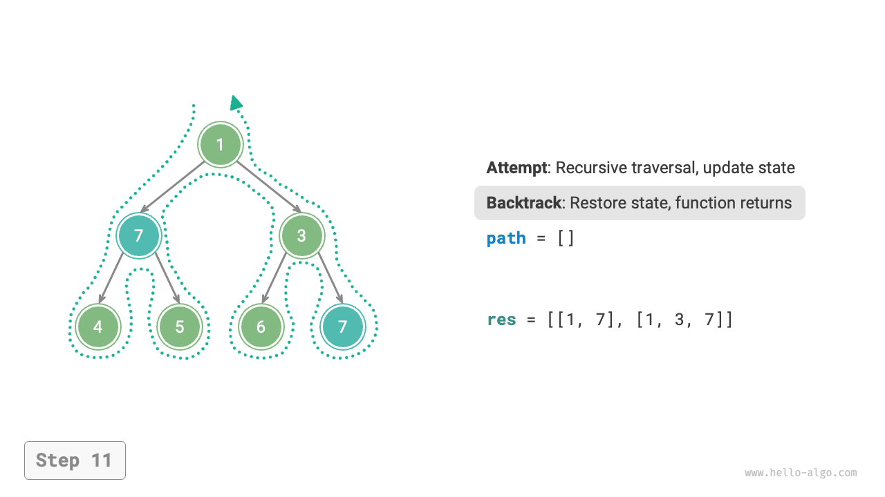{ class="animation-figure" }

<p align="center"> 図 13-2 &nbsp; 試行と戻る </p>

## 13.1.2 &nbsp; 枝刈り

複雑なバックトラッキング問題には、通常 1 つ以上の制約条件が含まれます。**制約条件は多くの場合「枝刈り」に利用できます**。

!!! question "例題3"

    二分木の中で値が $7$ のノードをすべて探索し、根ノードからそれらのノードまでの経路を返してください。**ただし、経路には値が $3$ のノードを含めてはいけません**。

上の制約条件を満たすために、**枝刈り操作を追加する必要があります**。探索中に値が $3$ のノードに出会った場合は、そこで早めに return し、それ以上探索を続けません。コードは次のとおりです。

=== "Python"

    ```python title="preorder_traversal_iii_compact.py"
    def pre_order(root: TreeNode):
        """前順走査：例題 3"""
        # 枝刈り
        if root is None or root.val == 3:
            return
        # 試す
        path.append(root)
        if root.val == 7:
            # 解を記録
            res.append(list(path))
        pre_order(root.left)
        pre_order(root.right)
        # バックトラック
        path.pop()
    ```

=== "C++"

    ```cpp title="preorder_traversal_iii_compact.cpp"
    /* 前順走査：例題 3 */
    void preOrder(TreeNode *root) {
        // 枝刈り
        if (root == nullptr || root->val == 3) {
            return;
        }
        // 試す
        path.push_back(root);
        if (root->val == 7) {
            // 解を記録
            res.push_back(path);
        }
        preOrder(root->left);
        preOrder(root->right);
        // バックトラック
        path.pop_back();
    }
    ```

=== "Java"

    ```java title="preorder_traversal_iii_compact.java"
    /* 前順走査：例題 3 */
    void preOrder(TreeNode root) {
        // 枝刈り
        if (root == null || root.val == 3) {
            return;
        }
        // 試す
        path.add(root);
        if (root.val == 7) {
            // 解を記録
            res.add(new ArrayList<>(path));
        }
        preOrder(root.left);
        preOrder(root.right);
        // バックトラック
        path.remove(path.size() - 1);
    }
    ```

=== "C#"

    ```csharp title="preorder_traversal_iii_compact.cs"
    /* 前順走査：例題 3 */
    void PreOrder(TreeNode? root) {
        // 枝刈り
        if (root == null || root.val == 3) {
            return;
        }
        // 試す
        path.Add(root);
        if (root.val == 7) {
            // 解を記録
            res.Add(new List<TreeNode>(path));
        }
        PreOrder(root.left);
        PreOrder(root.right);
        // バックトラック
        path.RemoveAt(path.Count - 1);
    }
    ```

=== "Go"

    ```go title="preorder_traversal_iii_compact.go"
    /* 前順走査：例題 3 */
    func preOrderIII(root *TreeNode, res *[][]*TreeNode, path *[]*TreeNode) {
        // 枝刈り
        if root == nil || root.Val == 3 {
            return
        }
        // 試す
        *path = append(*path, root)
        if root.Val.(int) == 7 {
            // 解を記録
            *res = append(*res, append([]*TreeNode{}, *path...))
        }
        preOrderIII(root.Left, res, path)
        preOrderIII(root.Right, res, path)
        // バックトラック
        *path = (*path)[:len(*path)-1]
    }
    ```

=== "Swift"

    ```swift title="preorder_traversal_iii_compact.swift"
    /* 前順走査：例題 3 */
    func preOrder(root: TreeNode?) {
        // 枝刈り
        guard let root = root, root.val != 3 else {
            return
        }
        // 試す
        path.append(root)
        if root.val == 7 {
            // 解を記録
            res.append(path)
        }
        preOrder(root: root.left)
        preOrder(root: root.right)
        // バックトラック
        path.removeLast()
    }
    ```

=== "JS"

    ```javascript title="preorder_traversal_iii_compact.js"
    /* 前順走査：例題 3 */
    function preOrder(root, path, res) {
        // 枝刈り
        if (root === null || root.val === 3) {
            return;
        }
        // 試す
        path.push(root);
        if (root.val === 7) {
            // 解を記録
            res.push([...path]);
        }
        preOrder(root.left, path, res);
        preOrder(root.right, path, res);
        // バックトラック
        path.pop();
    }
    ```

=== "TS"

    ```typescript title="preorder_traversal_iii_compact.ts"
    /* 前順走査：例題 3 */
    function preOrder(
        root: TreeNode | null,
        path: TreeNode[],
        res: TreeNode[][]
    ): void {
        // 枝刈り
        if (root === null || root.val === 3) {
            return;
        }
        // 試す
        path.push(root);
        if (root.val === 7) {
            // 解を記録
            res.push([...path]);
        }
        preOrder(root.left, path, res);
        preOrder(root.right, path, res);
        // バックトラック
        path.pop();
    }
    ```

=== "Dart"

    ```dart title="preorder_traversal_iii_compact.dart"
    /* 前順走査：例題 3 */
    void preOrder(
      TreeNode? root,
      List<TreeNode> path,
      List<List<TreeNode>> res,
    ) {
      if (root == null || root.val == 3) {
        return;
      }

      // 試す
      path.add(root);
      if (root.val == 7) {
        // 解を記録
        res.add(List.from(path));
      }
      preOrder(root.left, path, res);
      preOrder(root.right, path, res);
      // バックトラック
      path.removeLast();
    }
    ```

=== "Rust"

    ```rust title="preorder_traversal_iii_compact.rs"
    /* 前順走査：例題 3 */
    fn pre_order(
        res: &mut Vec<Vec<Rc<RefCell<TreeNode>>>>,
        path: &mut Vec<Rc<RefCell<TreeNode>>>,
        root: Option<&Rc<RefCell<TreeNode>>>,
    ) {
        // 枝刈り
        if root.is_none() || root.as_ref().unwrap().borrow().val == 3 {
            return;
        }
        if let Some(node) = root {
            // 試す
            path.push(node.clone());
            if node.borrow().val == 7 {
                // 解を記録
                res.push(path.clone());
            }
            pre_order(res, path, node.borrow().left.as_ref());
            pre_order(res, path, node.borrow().right.as_ref());
            // バックトラック
            path.pop();
        }
    }
    ```

=== "C"

    ```c title="preorder_traversal_iii_compact.c"
    /* 前順走査：例題 3 */
    void preOrder(TreeNode *root) {
        // 枝刈り
        if (root == NULL || root->val == 3) {
            return;
        }
        // 試す
        path[pathSize++] = root;
        if (root->val == 7) {
            // 解を記録
            for (int i = 0; i < pathSize; i++) {
                res[resSize][i] = path[i];
            }
            resSize++;
        }
        preOrder(root->left);
        preOrder(root->right);
        // バックトラック
        pathSize--;
    }
    ```

=== "Kotlin"

    ```kotlin title="preorder_traversal_iii_compact.kt"
    /* 前順走査：例題 3 */
    fun preOrder(root: TreeNode?) {
        // 枝刈り
        if (root == null || root._val == 3) {
            return
        }
        // 試す
        path!!.add(root)
        if (root._val == 7) {
            // 解を記録
            res!!.add(path!!.toMutableList())
        }
        preOrder(root.left)
        preOrder(root.right)
        // バックトラック
        path!!.removeAt(path!!.size - 1)
    }
    ```

=== "Ruby"

    ```ruby title="preorder_traversal_iii_compact.rb"
    ### 前順走査：例題3 ###
    def pre_order(root)
      # 枝刈り
      return if !root || root.val == 3

      # 試す
      $path.append(root)

      # 解を記録
      $res << $path.dup if root.val == 7

      pre_order(root.left)
      pre_order(root.right)

      # バックトラック
      $path.pop
    end
    ```

??? pythontutor "コードの可視化"

    <div style="height: 549px; width: 100%;"><iframe class="pythontutor-iframe" src="https://pythontutor.com/iframe-embed.html#code=class%20TreeNode%3A%0A%20%20%20%20%22%22%22%E4%BA%8C%E5%88%86%E6%9C%A8%E3%83%8E%E3%83%BC%E3%83%89%E3%82%AF%E3%83%A9%E3%82%B9%22%22%22%0A%0A%20%20%20%20def%20__init__%28self%2C%20val%3A%20int%20%3D%200%29%3A%0A%20%20%20%20%20%20%20%20self.val%3A%20int%20%3D%20val%20%20%23%20%E3%83%8E%E3%83%BC%E3%83%89%E5%80%A4%0A%20%20%20%20%20%20%20%20self.left%3A%20TreeNode%20%7C%20None%20%3D%20None%20%20%23%20%E5%B7%A6%E5%AD%90%E3%83%8E%E3%83%BC%E3%83%89%E3%81%B8%E3%81%AE%E5%8F%82%E7%85%A7%0A%20%20%20%20%20%20%20%20self.right%3A%20TreeNode%20%7C%20None%20%3D%20None%20%20%23%20%E5%8F%B3%E5%AD%90%E3%83%8E%E3%83%BC%E3%83%89%E3%81%B8%E3%81%AE%E5%8F%82%E7%85%A7%0A%0Adef%20list_to_tree_dfs%28arr%3A%20list%5Bint%5D%2C%20i%3A%20int%29%20-%3E%20TreeNode%20%7C%20None%3A%0A%20%20%20%20%22%22%22%E3%83%AA%E3%82%B9%E3%83%88%E3%82%92%E4%BA%8C%E5%88%86%E6%9C%A8%E3%81%AB%E3%83%87%E3%82%B7%E3%83%AA%E3%82%A2%E3%83%A9%E3%82%A4%E3%82%BA%E3%81%99%E3%82%8B%3A%20%E5%86%8D%E5%B8%B0%22%22%22%0A%20%20%20%20%23%20%E6%B7%BB%E5%AD%97%E3%81%8C%E9%85%8D%E5%88%97%E9%95%B7%E3%82%92%E8%B6%85%E3%81%88%E3%82%8B%E3%81%8B%E3%80%81%E5%AF%BE%E5%BF%9C%E3%81%99%E3%82%8B%E8%A6%81%E7%B4%A0%E3%81%8C%20None%20%E3%81%AA%E3%82%89%E3%80%81None%20%E3%82%92%E8%BF%94%E3%81%99%0A%20%20%20%20if%20i%20%3C%200%20or%20i%20%3E%3D%20len%28arr%29%20or%20arr%5Bi%5D%20is%20None%3A%0A%20%20%20%20%20%20%20%20return%20None%0A%20%20%20%20%23%20%E7%8F%BE%E5%9C%A8%E3%81%AE%E3%83%8E%E3%83%BC%E3%83%89%E3%82%92%E6%A7%8B%E7%AF%89%E3%81%99%E3%82%8B%0A%20%20%20%20root%20%3D%20TreeNode%28arr%5Bi%5D%29%0A%20%20%20%20%23%20%E5%B7%A6%E5%8F%B3%E3%81%AE%E9%83%A8%E5%88%86%E6%9C%A8%E3%82%92%E5%86%8D%E5%B8%B0%E7%9A%84%E3%81%AB%E6%A7%8B%E7%AF%89%E3%81%99%E3%82%8B%0A%20%20%20%20root.left%20%3D%20list_to_tree_dfs%28arr%2C%202%20%2A%20i%20%2B%201%29%0A%20%20%20%20root.right%20%3D%20list_to_tree_dfs%28arr%2C%202%20%2A%20i%20%2B%202%29%0A%20%20%20%20return%20root%0A%0Adef%20list_to_tree%28arr%3A%20list%5Bint%5D%29%20-%3E%20TreeNode%20%7C%20None%3A%0A%20%20%20%20%22%22%22%E3%83%AA%E3%82%B9%E3%83%88%E3%82%92%E4%BA%8C%E5%88%86%E6%9C%A8%E3%81%AB%E3%83%87%E3%82%B7%E3%83%AA%E3%82%A2%E3%83%A9%E3%82%A4%E3%82%BA%E3%81%99%E3%82%8B%22%22%22%0A%20%20%20%20return%20list_to_tree_dfs%28arr%2C%200%29%0A%0A%0Adef%20pre_order%28root%3A%20TreeNode%29%3A%0A%20%20%20%20%22%22%22%E5%89%8D%E9%A0%86%E8%B5%B0%E6%9F%BB%EF%BC%9A%E4%BE%8B%E9%A1%8C%203%22%22%22%0A%20%20%20%20%23%20%E6%9E%9D%E5%88%88%E3%82%8A%0A%20%20%20%20if%20root%20is%20None%20or%20root.val%20%3D%3D%203%3A%0A%20%20%20%20%20%20%20%20return%0A%20%20%20%20%23%20%E8%A9%A6%E3%81%99%0A%20%20%20%20path.append%28root%29%0A%20%20%20%20if%20root.val%20%3D%3D%207%3A%0A%20%20%20%20%20%20%20%20%23%20%E8%A7%A3%E3%82%92%E8%A8%98%E9%8C%B2%0A%20%20%20%20%20%20%20%20res.append%28list%28path%29%29%0A%20%20%20%20pre_order%28root.left%29%0A%20%20%20%20pre_order%28root.right%29%0A%20%20%20%20%23%20%E3%83%90%E3%83%83%E3%82%AF%E3%83%88%E3%83%A9%E3%83%83%E3%82%AF%0A%20%20%20%20path.pop%28%29%0A%0A%0Aif%20__name__%20%3D%3D%20%22__main__%22%3A%0A%20%20%20%20root%20%3D%20list_to_tree%28%5B1%2C%207%2C%203%2C%204%2C%205%2C%206%2C%207%5D%29%0A%0A%20%20%20%20%23%20%E5%85%88%E8%A1%8C%E9%A0%86%E8%B5%B0%E6%9F%BB%0A%20%20%20%20path%20%3D%20list%5BTreeNode%5D%28%29%0A%20%20%20%20res%20%3D%20list%5Blist%5BTreeNode%5D%5D%28%29%0A%20%20%20%20pre_order%28root%29%0A%0A%20%20%20%20print%28%22%5Cn%E6%A0%B9%E3%83%8E%E3%83%BC%E3%83%89%E3%81%8B%E3%82%89%E3%83%8E%E3%83%BC%E3%83%89%207%20%E3%81%BE%E3%81%A7%E3%81%AE%E7%B5%8C%E8%B7%AF%E3%82%92%E3%81%99%E3%81%B9%E3%81%A6%E5%87%BA%E5%8A%9B%E3%81%97%E3%80%81%E7%B5%8C%E8%B7%AF%E3%81%AB%E3%81%AF%E5%80%A4%E3%81%8C%203%20%E3%81%AE%E3%83%8E%E3%83%BC%E3%83%89%E3%82%92%E5%90%AB%E3%82%81%E3%81%AA%E3%81%84%22%29%0A%20%20%20%20for%20path%20in%20res%3A%0A%20%20%20%20%20%20%20%20print%28%5Bnode.val%20for%20node%20in%20path%5D%29&codeDivHeight=472&codeDivWidth=350&cumulative=false&curInstr=126&heapPrimitives=nevernest&origin=opt-frontend.js&py=311&rawInputLstJSON=%5B%5D&textReferences=false"> </iframe></div>
    <div style="margin-top: 5px;"><a href="https://pythontutor.com/iframe-embed.html#code=class%20TreeNode%3A%0A%20%20%20%20%22%22%22%E4%BA%8C%E5%88%86%E6%9C%A8%E3%83%8E%E3%83%BC%E3%83%89%E3%82%AF%E3%83%A9%E3%82%B9%22%22%22%0A%0A%20%20%20%20def%20__init__%28self%2C%20val%3A%20int%20%3D%200%29%3A%0A%20%20%20%20%20%20%20%20self.val%3A%20int%20%3D%20val%20%20%23%20%E3%83%8E%E3%83%BC%E3%83%89%E5%80%A4%0A%20%20%20%20%20%20%20%20self.left%3A%20TreeNode%20%7C%20None%20%3D%20None%20%20%23%20%E5%B7%A6%E5%AD%90%E3%83%8E%E3%83%BC%E3%83%89%E3%81%B8%E3%81%AE%E5%8F%82%E7%85%A7%0A%20%20%20%20%20%20%20%20self.right%3A%20TreeNode%20%7C%20None%20%3D%20None%20%20%23%20%E5%8F%B3%E5%AD%90%E3%83%8E%E3%83%BC%E3%83%89%E3%81%B8%E3%81%AE%E5%8F%82%E7%85%A7%0A%0Adef%20list_to_tree_dfs%28arr%3A%20list%5Bint%5D%2C%20i%3A%20int%29%20-%3E%20TreeNode%20%7C%20None%3A%0A%20%20%20%20%22%22%22%E3%83%AA%E3%82%B9%E3%83%88%E3%82%92%E4%BA%8C%E5%88%86%E6%9C%A8%E3%81%AB%E3%83%87%E3%82%B7%E3%83%AA%E3%82%A2%E3%83%A9%E3%82%A4%E3%82%BA%E3%81%99%E3%82%8B%3A%20%E5%86%8D%E5%B8%B0%22%22%22%0A%20%20%20%20%23%20%E6%B7%BB%E5%AD%97%E3%81%8C%E9%85%8D%E5%88%97%E9%95%B7%E3%82%92%E8%B6%85%E3%81%88%E3%82%8B%E3%81%8B%E3%80%81%E5%AF%BE%E5%BF%9C%E3%81%99%E3%82%8B%E8%A6%81%E7%B4%A0%E3%81%8C%20None%20%E3%81%AA%E3%82%89%E3%80%81None%20%E3%82%92%E8%BF%94%E3%81%99%0A%20%20%20%20if%20i%20%3C%200%20or%20i%20%3E%3D%20len%28arr%29%20or%20arr%5Bi%5D%20is%20None%3A%0A%20%20%20%20%20%20%20%20return%20None%0A%20%20%20%20%23%20%E7%8F%BE%E5%9C%A8%E3%81%AE%E3%83%8E%E3%83%BC%E3%83%89%E3%82%92%E6%A7%8B%E7%AF%89%E3%81%99%E3%82%8B%0A%20%20%20%20root%20%3D%20TreeNode%28arr%5Bi%5D%29%0A%20%20%20%20%23%20%E5%B7%A6%E5%8F%B3%E3%81%AE%E9%83%A8%E5%88%86%E6%9C%A8%E3%82%92%E5%86%8D%E5%B8%B0%E7%9A%84%E3%81%AB%E6%A7%8B%E7%AF%89%E3%81%99%E3%82%8B%0A%20%20%20%20root.left%20%3D%20list_to_tree_dfs%28arr%2C%202%20%2A%20i%20%2B%201%29%0A%20%20%20%20root.right%20%3D%20list_to_tree_dfs%28arr%2C%202%20%2A%20i%20%2B%202%29%0A%20%20%20%20return%20root%0A%0Adef%20list_to_tree%28arr%3A%20list%5Bint%5D%29%20-%3E%20TreeNode%20%7C%20None%3A%0A%20%20%20%20%22%22%22%E3%83%AA%E3%82%B9%E3%83%88%E3%82%92%E4%BA%8C%E5%88%86%E6%9C%A8%E3%81%AB%E3%83%87%E3%82%B7%E3%83%AA%E3%82%A2%E3%83%A9%E3%82%A4%E3%82%BA%E3%81%99%E3%82%8B%22%22%22%0A%20%20%20%20return%20list_to_tree_dfs%28arr%2C%200%29%0A%0A%0Adef%20pre_order%28root%3A%20TreeNode%29%3A%0A%20%20%20%20%22%22%22%E5%89%8D%E9%A0%86%E8%B5%B0%E6%9F%BB%EF%BC%9A%E4%BE%8B%E9%A1%8C%203%22%22%22%0A%20%20%20%20%23%20%E6%9E%9D%E5%88%88%E3%82%8A%0A%20%20%20%20if%20root%20is%20None%20or%20root.val%20%3D%3D%203%3A%0A%20%20%20%20%20%20%20%20return%0A%20%20%20%20%23%20%E8%A9%A6%E3%81%99%0A%20%20%20%20path.append%28root%29%0A%20%20%20%20if%20root.val%20%3D%3D%207%3A%0A%20%20%20%20%20%20%20%20%23%20%E8%A7%A3%E3%82%92%E8%A8%98%E9%8C%B2%0A%20%20%20%20%20%20%20%20res.append%28list%28path%29%29%0A%20%20%20%20pre_order%28root.left%29%0A%20%20%20%20pre_order%28root.right%29%0A%20%20%20%20%23%20%E3%83%90%E3%83%83%E3%82%AF%E3%83%88%E3%83%A9%E3%83%83%E3%82%AF%0A%20%20%20%20path.pop%28%29%0A%0A%0Aif%20__name__%20%3D%3D%20%22__main__%22%3A%0A%20%20%20%20root%20%3D%20list_to_tree%28%5B1%2C%207%2C%203%2C%204%2C%205%2C%206%2C%207%5D%29%0A%0A%20%20%20%20%23%20%E5%85%88%E8%A1%8C%E9%A0%86%E8%B5%B0%E6%9F%BB%0A%20%20%20%20path%20%3D%20list%5BTreeNode%5D%28%29%0A%20%20%20%20res%20%3D%20list%5Blist%5BTreeNode%5D%5D%28%29%0A%20%20%20%20pre_order%28root%29%0A%0A%20%20%20%20print%28%22%5Cn%E6%A0%B9%E3%83%8E%E3%83%BC%E3%83%89%E3%81%8B%E3%82%89%E3%83%8E%E3%83%BC%E3%83%89%207%20%E3%81%BE%E3%81%A7%E3%81%AE%E7%B5%8C%E8%B7%AF%E3%82%92%E3%81%99%E3%81%B9%E3%81%A6%E5%87%BA%E5%8A%9B%E3%81%97%E3%80%81%E7%B5%8C%E8%B7%AF%E3%81%AB%E3%81%AF%E5%80%A4%E3%81%8C%203%20%E3%81%AE%E3%83%8E%E3%83%BC%E3%83%89%E3%82%92%E5%90%AB%E3%82%81%E3%81%AA%E3%81%84%22%29%0A%20%20%20%20for%20path%20in%20res%3A%0A%20%20%20%20%20%20%20%20print%28%5Bnode.val%20for%20node%20in%20path%5D%29&codeDivHeight=800&codeDivWidth=600&cumulative=false&curInstr=126&heapPrimitives=nevernest&origin=opt-frontend.js&py=311&rawInputLstJSON=%5B%5D&textReferences=false" target="_blank" rel="noopener noreferrer">全画面で見る ></a></div>

「枝刈り」は非常にイメージしやすい名称です。次の図のように、探索中に**制約条件を満たさない探索分岐を切り落とす**ことで、多くの無意味な試行を避け、探索効率を高められます。

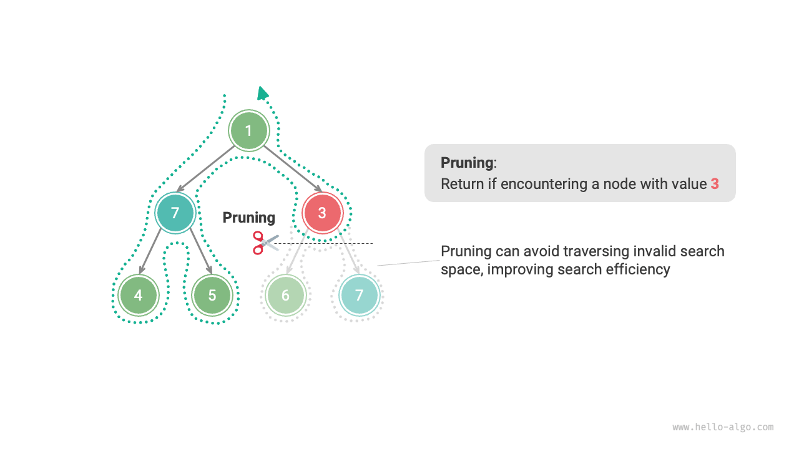{ class="animation-figure" }

<p align="center"> 図 13-3 &nbsp; 制約条件にもとづく枝刈り </p>

## 13.1.3 &nbsp; フレームワークコード

次に、バックトラッキングにおける「試行・戻る・枝刈り」の本体部分を抽出し、汎用性の高いコードフレームワークへまとめてみます。

以下のフレームワークコードでは、`state` は問題の現在状態、`choices` はその状態で取り得る選択肢を表します。

=== "Python"

    ```python title=""
    def backtrack(state: State, choices: list[choice], res: list[state]):
        """バックトラッキングアルゴリズムのフレームワーク"""
        # 解かどうかを判定
        if is_solution(state):
            # 解を記録
            record_solution(state, res)
            # これ以上探索しない
            return
        # すべての選択肢を走査
        for choice in choices:
            # 枝刈り: 選択が妥当かを判定
            if is_valid(state, choice):
                # 試行: 選択を行い、状態を更新
                make_choice(state, choice)
                backtrack(state, choices, res)
                # 戻る: 選択を取り消し、前の状態に戻す
                undo_choice(state, choice)
    ```

=== "C++"

    ```cpp title=""
    /* バックトラッキングアルゴリズムのフレームワーク */
    void backtrack(State *state, vector<Choice *> &choices, vector<State *> &res) {
        // 解かどうかを判定
        if (isSolution(state)) {
            // 解を記録
            recordSolution(state, res);
            // これ以上探索しない
            return;
        }
        // すべての選択肢を走査
        for (Choice choice : choices) {
            // 枝刈り: 選択が妥当かを判定
            if (isValid(state, choice)) {
                // 試行: 選択を行い、状態を更新
                makeChoice(state, choice);
                backtrack(state, choices, res);
                // 戻る: 選択を取り消し、前の状態に戻す
                undoChoice(state, choice);
            }
        }
    }
    ```

=== "Java"

    ```java title=""
    /* バックトラッキングアルゴリズムのフレームワーク */
    void backtrack(State state, List<Choice> choices, List<State> res) {
        // 解かどうかを判定
        if (isSolution(state)) {
            // 解を記録
            recordSolution(state, res);
            // これ以上探索しない
            return;
        }
        // すべての選択肢を走査
        for (Choice choice : choices) {
            // 枝刈り: 選択が妥当かを判定
            if (isValid(state, choice)) {
                // 試行: 選択を行い、状態を更新
                makeChoice(state, choice);
                backtrack(state, choices, res);
                // 戻る: 選択を取り消し、前の状態に戻す
                undoChoice(state, choice);
            }
        }
    }
    ```

=== "C#"

    ```csharp title=""
    /* バックトラッキングアルゴリズムのフレームワーク */
    void Backtrack(State state, List<Choice> choices, List<State> res) {
        // 解かどうかを判定
        if (IsSolution(state)) {
            // 解を記録
            RecordSolution(state, res);
            // これ以上探索しない
            return;
        }
        // すべての選択肢を走査
        foreach (Choice choice in choices) {
            // 枝刈り: 選択が妥当かを判定
            if (IsValid(state, choice)) {
                // 試行: 選択を行い、状態を更新
                MakeChoice(state, choice);
                Backtrack(state, choices, res);
                // 戻る: 選択を取り消し、前の状態に戻す
                UndoChoice(state, choice);
            }
        }
    }
    ```

=== "Go"

    ```go title=""
    /* バックトラッキングアルゴリズムのフレームワーク */
    func backtrack(state *State, choices []Choice, res *[]State) {
        // 解かどうかを判定
        if isSolution(state) {
            // 解を記録
            recordSolution(state, res)
            // これ以上探索しない
            return
        }
        // すべての選択肢を走査
        for _, choice := range choices {
            // 枝刈り: 選択が妥当かを判定
            if isValid(state, choice) {
                // 試行: 選択を行い、状態を更新
                makeChoice(state, choice)
                backtrack(state, choices, res)
                // 戻る: 選択を取り消し、前の状態に戻す
                undoChoice(state, choice)
            }
        }
    }
    ```

=== "Swift"

    ```swift title=""
    /* バックトラッキングアルゴリズムのフレームワーク */
    func backtrack(state: inout State, choices: [Choice], res: inout [State]) {
        // 解かどうかを判定
        if isSolution(state: state) {
            // 解を記録
            recordSolution(state: state, res: &res)
            // これ以上探索しない
            return
        }
        // すべての選択肢を走査
        for choice in choices {
            // 枝刈り: 選択が妥当かを判定
            if isValid(state: state, choice: choice) {
                // 試行: 選択を行い、状態を更新
                makeChoice(state: &state, choice: choice)
                backtrack(state: &state, choices: choices, res: &res)
                // 戻る: 選択を取り消し、前の状態に戻す
                undoChoice(state: &state, choice: choice)
            }
        }
    }
    ```

=== "JS"

    ```javascript title=""
    /* バックトラッキングアルゴリズムのフレームワーク */
    function backtrack(state, choices, res) {
        // 解かどうかを判定
        if (isSolution(state)) {
            // 解を記録
            recordSolution(state, res);
            // これ以上探索しない
            return;
        }
        // すべての選択肢を走査
        for (let choice of choices) {
            // 枝刈り: 選択が妥当かを判定
            if (isValid(state, choice)) {
                // 試行: 選択を行い、状態を更新
                makeChoice(state, choice);
                backtrack(state, choices, res);
                // 戻る: 選択を取り消し、前の状態に戻す
                undoChoice(state, choice);
            }
        }
    }
    ```

=== "TS"

    ```typescript title=""
    /* バックトラッキングアルゴリズムのフレームワーク */
    function backtrack(state: State, choices: Choice[], res: State[]): void {
        // 解かどうかを判定
        if (isSolution(state)) {
            // 解を記録
            recordSolution(state, res);
            // これ以上探索しない
            return;
        }
        // すべての選択肢を走査
        for (let choice of choices) {
            // 枝刈り: 選択が妥当かを判定
            if (isValid(state, choice)) {
                // 試行: 選択を行い、状態を更新
                makeChoice(state, choice);
                backtrack(state, choices, res);
                // 戻る: 選択を取り消し、前の状態に戻す
                undoChoice(state, choice);
            }
        }
    }
    ```

=== "Dart"

    ```dart title=""
    /* バックトラッキングアルゴリズムのフレームワーク */
    void backtrack(State state, List<Choice>, List<State> res) {
      // 解かどうかを判定
      if (isSolution(state)) {
        // 解を記録
        recordSolution(state, res);
        // これ以上探索しない
        return;
      }
      // すべての選択肢を走査
      for (Choice choice in choices) {
        // 枝刈り: 選択が妥当かを判定
        if (isValid(state, choice)) {
          // 試行: 選択を行い、状態を更新
          makeChoice(state, choice);
          backtrack(state, choices, res);
          // 戻る: 選択を取り消し、前の状態に戻す
          undoChoice(state, choice);
        }
      }
    }
    ```

=== "Rust"

    ```rust title=""
    /* バックトラッキングアルゴリズムのフレームワーク */
    fn backtrack(state: &mut State, choices: &Vec<Choice>, res: &mut Vec<State>) {
        // 解かどうかを判定
        if is_solution(state) {
            // 解を記録
            record_solution(state, res);
            // これ以上探索しない
            return;
        }
        // すべての選択肢を走査
        for choice in choices {
            // 枝刈り: 選択が妥当かを判定
            if is_valid(state, choice) {
                // 試行: 選択を行い、状態を更新
                make_choice(state, choice);
                backtrack(state, choices, res);
                // 戻る: 選択を取り消し、前の状態に戻す
                undo_choice(state, choice);
            }
        }
    }
    ```

=== "C"

    ```c title=""
    /* バックトラッキングアルゴリズムのフレームワーク */
    void backtrack(State *state, Choice *choices, int numChoices, State *res, int numRes) {
        // 解かどうかを判定
        if (isSolution(state)) {
            // 解を記録
            recordSolution(state, res, numRes);
            // これ以上探索しない
            return;
        }
        // すべての選択肢を走査
        for (int i = 0; i < numChoices; i++) {
            // 枝刈り: 選択が妥当かを判定
            if (isValid(state, &choices[i])) {
                // 試行: 選択を行い、状態を更新
                makeChoice(state, &choices[i]);
                backtrack(state, choices, numChoices, res, numRes);
                // 戻る: 選択を取り消し、前の状態に戻す
                undoChoice(state, &choices[i]);
            }
        }
    }
    ```

=== "Kotlin"

    ```kotlin title=""
    /* バックトラッキングアルゴリズムのフレームワーク */
    fun backtrack(state: State?, choices: List<Choice?>, res: List<State?>?) {
        // 解かどうかを判定
        if (isSolution(state)) {
            // 解を記録
            recordSolution(state, res)
            // これ以上探索しない
            return
        }
        // すべての選択肢を走査
        for (choice in choices) {
            // 枝刈り: 選択が妥当かを判定
            if (isValid(state, choice)) {
                // 試行: 選択を行い、状態を更新
                makeChoice(state, choice)
                backtrack(state, choices, res)
                // 戻る: 選択を取り消し、前の状態に戻す
                undoChoice(state, choice)
            }
        }
    }
    ```

=== "Ruby"

    ```ruby title=""
    ### バックトラッキングアルゴリズムのフレームワーク ###
    def backtrack(state, choices, res)
        # 解かどうかを判定
        if is_solution?(state)
            # 解を記録
            record_solution(state, res)
            return
        end

        # すべての選択肢を走査
        for choice in choices
            # 枝刈り: 選択が妥当かを判定
            if is_valid?(state, choice)
                # 試行: 選択を行い、状態を更新
                make_choice(state, choice)
                backtrack(state, choices, res)
                # 戻る: 選択を取り消し、前の状態に戻す
                undo_choice(state, choice)
            end
        end
    end
    ```

次に、このフレームワークコードを用いて例題3を解きます。状態 `state` はノードの走査経路、選択肢 `choices` は現在のノードの左子ノードと右子ノード、結果 `res` は経路のリストです。

=== "Python"

    ```python title="preorder_traversal_iii_template.py"
    def is_solution(state: list[TreeNode]) -> bool:
        """現在の状態が解かどうかを判定"""
        return state and state[-1].val == 7

    def record_solution(state: list[TreeNode], res: list[list[TreeNode]]):
        """解を記録"""
        res.append(list(state))

    def is_valid(state: list[TreeNode], choice: TreeNode) -> bool:
        """現在の状態で、この選択が有効かどうかを判定"""
        return choice is not None and choice.val != 3

    def make_choice(state: list[TreeNode], choice: TreeNode):
        """状態を更新"""
        state.append(choice)

    def undo_choice(state: list[TreeNode], choice: TreeNode):
        """状態を元に戻す"""
        state.pop()

    def backtrack(
        state: list[TreeNode], choices: list[TreeNode], res: list[list[TreeNode]]
    ):
        """バックトラッキング：例題 3"""
        # 解かどうかを確認
        if is_solution(state):
            # 解を記録
            record_solution(state, res)
        # すべての選択肢を走査
        for choice in choices:
            # 枝刈り：選択が妥当かを確認する
            if is_valid(state, choice):
                # 試行: 選択を行い、状態を更新
                make_choice(state, choice)
                # 次の選択へ進む
                backtrack(state, [choice.left, choice.right], res)
                # バックトラック：選択を取り消し、前の状態に戻す
                undo_choice(state, choice)
    ```

=== "C++"

    ```cpp title="preorder_traversal_iii_template.cpp"
    /* 現在の状態が解かどうかを判定 */
    bool isSolution(vector<TreeNode *> &state) {
        return !state.empty() && state.back()->val == 7;
    }

    /* 解を記録 */
    void recordSolution(vector<TreeNode *> &state, vector<vector<TreeNode *>> &res) {
        res.push_back(state);
    }

    /* 現在の状態で、この選択が有効かどうかを判定 */
    bool isValid(vector<TreeNode *> &state, TreeNode *choice) {
        return choice != nullptr && choice->val != 3;
    }

    /* 状態を更新 */
    void makeChoice(vector<TreeNode *> &state, TreeNode *choice) {
        state.push_back(choice);
    }

    /* 状態を元に戻す */
    void undoChoice(vector<TreeNode *> &state, TreeNode *choice) {
        state.pop_back();
    }

    /* バックトラッキング：例題 3 */
    void backtrack(vector<TreeNode *> &state, vector<TreeNode *> &choices, vector<vector<TreeNode *>> &res) {
        // 解かどうかを確認
        if (isSolution(state)) {
            // 解を記録
            recordSolution(state, res);
        }
        // すべての選択肢を走査
        for (TreeNode *choice : choices) {
            // 枝刈り：選択が妥当かを確認する
            if (isValid(state, choice)) {
                // 試行: 選択を行い、状態を更新
                makeChoice(state, choice);
                // 次の選択へ進む
                vector<TreeNode *> nextChoices{choice->left, choice->right};
                backtrack(state, nextChoices, res);
                // バックトラック：選択を取り消し、前の状態に戻す
                undoChoice(state, choice);
            }
        }
    }
    ```

=== "Java"

    ```java title="preorder_traversal_iii_template.java"
    /* 現在の状態が解かどうかを判定 */
    boolean isSolution(List<TreeNode> state) {
        return !state.isEmpty() && state.get(state.size() - 1).val == 7;
    }

    /* 解を記録 */
    void recordSolution(List<TreeNode> state, List<List<TreeNode>> res) {
        res.add(new ArrayList<>(state));
    }

    /* 現在の状態で、この選択が有効かどうかを判定 */
    boolean isValid(List<TreeNode> state, TreeNode choice) {
        return choice != null && choice.val != 3;
    }

    /* 状態を更新 */
    void makeChoice(List<TreeNode> state, TreeNode choice) {
        state.add(choice);
    }

    /* 状態を元に戻す */
    void undoChoice(List<TreeNode> state, TreeNode choice) {
        state.remove(state.size() - 1);
    }

    /* バックトラッキング：例題 3 */
    void backtrack(List<TreeNode> state, List<TreeNode> choices, List<List<TreeNode>> res) {
        // 解かどうかを確認
        if (isSolution(state)) {
            // 解を記録
            recordSolution(state, res);
        }
        // すべての選択肢を走査
        for (TreeNode choice : choices) {
            // 枝刈り：選択が妥当かを確認する
            if (isValid(state, choice)) {
                // 試行: 選択を行い、状態を更新
                makeChoice(state, choice);
                // 次の選択へ進む
                backtrack(state, Arrays.asList(choice.left, choice.right), res);
                // バックトラック：選択を取り消し、前の状態に戻す
                undoChoice(state, choice);
            }
        }
    }
    ```

=== "C#"

    ```csharp title="preorder_traversal_iii_template.cs"
    /* 現在の状態が解かどうかを判定 */
    bool IsSolution(List<TreeNode> state) {
        return state.Count != 0 && state[^1].val == 7;
    }

    /* 解を記録 */
    void RecordSolution(List<TreeNode> state, List<List<TreeNode>> res) {
        res.Add(new List<TreeNode>(state));
    }

    /* 現在の状態で、この選択が有効かどうかを判定 */
    bool IsValid(List<TreeNode> state, TreeNode choice) {
        return choice != null && choice.val != 3;
    }

    /* 状態を更新 */
    void MakeChoice(List<TreeNode> state, TreeNode choice) {
        state.Add(choice);
    }

    /* 状態を元に戻す */
    void UndoChoice(List<TreeNode> state, TreeNode choice) {
        state.RemoveAt(state.Count - 1);
    }

    /* バックトラッキング：例題 3 */
    void Backtrack(List<TreeNode> state, List<TreeNode> choices, List<List<TreeNode>> res) {
        // 解かどうかを確認
        if (IsSolution(state)) {
            // 解を記録
            RecordSolution(state, res);
        }
        // すべての選択肢を走査
        foreach (TreeNode choice in choices) {
            // 枝刈り：選択が妥当かを確認する
            if (IsValid(state, choice)) {
                // 試行: 選択を行い、状態を更新
                MakeChoice(state, choice);
                // 次の選択へ進む
                Backtrack(state, [choice.left!, choice.right!], res);
                // バックトラック：選択を取り消し、前の状態に戻す
                UndoChoice(state, choice);
            }
        }
    }
    ```

=== "Go"

    ```go title="preorder_traversal_iii_template.go"
    /* 現在の状態が解かどうかを判定 */
    func isSolution(state *[]*TreeNode) bool {
        return len(*state) != 0 && (*state)[len(*state)-1].Val == 7
    }

    /* 解を記録 */
    func recordSolution(state *[]*TreeNode, res *[][]*TreeNode) {
        *res = append(*res, append([]*TreeNode{}, *state...))
    }

    /* 現在の状態で、この選択が有効かどうかを判定 */
    func isValid(state *[]*TreeNode, choice *TreeNode) bool {
        return choice != nil && choice.Val != 3
    }

    /* 状態を更新 */
    func makeChoice(state *[]*TreeNode, choice *TreeNode) {
        *state = append(*state, choice)
    }

    /* 状態を元に戻す */
    func undoChoice(state *[]*TreeNode, choice *TreeNode) {
        *state = (*state)[:len(*state)-1]
    }

    /* バックトラッキング：例題 3 */
    func backtrackIII(state *[]*TreeNode, choices *[]*TreeNode, res *[][]*TreeNode) {
        // 解かどうかを確認
        if isSolution(state) {
            // 解を記録
            recordSolution(state, res)
        }
        // すべての選択肢を走査
        for _, choice := range *choices {
            // 枝刈り：選択が妥当かを確認する
            if isValid(state, choice) {
                // 試行: 選択を行い、状態を更新
                makeChoice(state, choice)
                // 次の選択へ進む
                temp := make([]*TreeNode, 0)
                temp = append(temp, choice.Left, choice.Right)
                backtrackIII(state, &temp, res)
                // バックトラック：選択を取り消し、前の状態に戻す
                undoChoice(state, choice)
            }
        }
    }
    ```

=== "Swift"

    ```swift title="preorder_traversal_iii_template.swift"
    /* 現在の状態が解かどうかを判定 */
    func isSolution(state: [TreeNode]) -> Bool {
        !state.isEmpty && state.last!.val == 7
    }

    /* 解を記録 */
    func recordSolution(state: [TreeNode], res: inout [[TreeNode]]) {
        res.append(state)
    }

    /* 現在の状態で、この選択が有効かどうかを判定 */
    func isValid(state: [TreeNode], choice: TreeNode?) -> Bool {
        choice != nil && choice!.val != 3
    }

    /* 状態を更新 */
    func makeChoice(state: inout [TreeNode], choice: TreeNode) {
        state.append(choice)
    }

    /* 状態を元に戻す */
    func undoChoice(state: inout [TreeNode], choice: TreeNode) {
        state.removeLast()
    }

    /* バックトラッキング：例題 3 */
    func backtrack(state: inout [TreeNode], choices: [TreeNode], res: inout [[TreeNode]]) {
        // 解かどうかを確認
        if isSolution(state: state) {
            recordSolution(state: state, res: &res)
        }
        // すべての選択肢を走査
        for choice in choices {
            // 枝刈り：選択が妥当かを確認する
            if isValid(state: state, choice: choice) {
                // 試行: 選択を行い、状態を更新
                makeChoice(state: &state, choice: choice)
                // 次の選択へ進む
                backtrack(state: &state, choices: [choice.left, choice.right].compactMap { $0 }, res: &res)
                // バックトラック：選択を取り消し、前の状態に戻す
                undoChoice(state: &state, choice: choice)
            }
        }
    }
    ```

=== "JS"

    ```javascript title="preorder_traversal_iii_template.js"
    /* 現在の状態が解かどうかを判定 */
    function isSolution(state) {
        return state && state[state.length - 1]?.val === 7;
    }

    /* 解を記録 */
    function recordSolution(state, res) {
        res.push([...state]);
    }

    /* 現在の状態で、この選択が有効かどうかを判定 */
    function isValid(state, choice) {
        return choice !== null && choice.val !== 3;
    }

    /* 状態を更新 */
    function makeChoice(state, choice) {
        state.push(choice);
    }

    /* 状態を元に戻す */
    function undoChoice(state) {
        state.pop();
    }

    /* バックトラッキング：例題 3 */
    function backtrack(state, choices, res) {
        // 解かどうかを確認
        if (isSolution(state)) {
            // 解を記録
            recordSolution(state, res);
        }
        // すべての選択肢を走査
        for (const choice of choices) {
            // 枝刈り：選択が妥当かを確認する
            if (isValid(state, choice)) {
                // 試行: 選択を行い、状態を更新
                makeChoice(state, choice);
                // 次の選択へ進む
                backtrack(state, [choice.left, choice.right], res);
                // バックトラック：選択を取り消し、前の状態に戻す
                undoChoice(state);
            }
        }
    }
    ```

=== "TS"

    ```typescript title="preorder_traversal_iii_template.ts"
    /* 現在の状態が解かどうかを判定 */
    function isSolution(state: TreeNode[]): boolean {
        return state && state[state.length - 1]?.val === 7;
    }

    /* 解を記録 */
    function recordSolution(state: TreeNode[], res: TreeNode[][]): void {
        res.push([...state]);
    }

    /* 現在の状態で、この選択が有効かどうかを判定 */
    function isValid(state: TreeNode[], choice: TreeNode): boolean {
        return choice !== null && choice.val !== 3;
    }

    /* 状態を更新 */
    function makeChoice(state: TreeNode[], choice: TreeNode): void {
        state.push(choice);
    }

    /* 状態を元に戻す */
    function undoChoice(state: TreeNode[]): void {
        state.pop();
    }

    /* バックトラッキング：例題 3 */
    function backtrack(
        state: TreeNode[],
        choices: TreeNode[],
        res: TreeNode[][]
    ): void {
        // 解かどうかを確認
        if (isSolution(state)) {
            // 解を記録
            recordSolution(state, res);
        }
        // すべての選択肢を走査
        for (const choice of choices) {
            // 枝刈り：選択が妥当かを確認する
            if (isValid(state, choice)) {
                // 試行: 選択を行い、状態を更新
                makeChoice(state, choice);
                // 次の選択へ進む
                backtrack(state, [choice.left, choice.right], res);
                // バックトラック：選択を取り消し、前の状態に戻す
                undoChoice(state);
            }
        }
    }
    ```

=== "Dart"

    ```dart title="preorder_traversal_iii_template.dart"
    /* 現在の状態が解かどうかを判定 */
    bool isSolution(List<TreeNode> state) {
      return state.isNotEmpty && state.last.val == 7;
    }

    /* 解を記録 */
    void recordSolution(List<TreeNode> state, List<List<TreeNode>> res) {
      res.add(List.from(state));
    }

    /* 現在の状態で、この選択が有効かどうかを判定 */
    bool isValid(List<TreeNode> state, TreeNode? choice) {
      return choice != null && choice.val != 3;
    }

    /* 状態を更新 */
    void makeChoice(List<TreeNode> state, TreeNode? choice) {
      state.add(choice!);
    }

    /* 状態を元に戻す */
    void undoChoice(List<TreeNode> state, TreeNode? choice) {
      state.removeLast();
    }

    /* バックトラッキング：例題 3 */
    void backtrack(
      List<TreeNode> state,
      List<TreeNode?> choices,
      List<List<TreeNode>> res,
    ) {
      // 解かどうかを確認
      if (isSolution(state)) {
        // 解を記録
        recordSolution(state, res);
      }
      // すべての選択肢を走査
      for (TreeNode? choice in choices) {
        // 枝刈り：選択が妥当かを確認する
        if (isValid(state, choice)) {
          // 試行: 選択を行い、状態を更新
          makeChoice(state, choice);
          // 次の選択へ進む
          backtrack(state, [choice!.left, choice.right], res);
          // バックトラック：選択を取り消し、前の状態に戻す
          undoChoice(state, choice);
        }
      }
    }
    ```

=== "Rust"

    ```rust title="preorder_traversal_iii_template.rs"
    /* 現在の状態が解かどうかを判定 */
    fn is_solution(state: &mut Vec<Rc<RefCell<TreeNode>>>) -> bool {
        return !state.is_empty() && state.last().unwrap().borrow().val == 7;
    }

    /* 解を記録 */
    fn record_solution(
        state: &mut Vec<Rc<RefCell<TreeNode>>>,
        res: &mut Vec<Vec<Rc<RefCell<TreeNode>>>>,
    ) {
        res.push(state.clone());
    }

    /* 現在の状態で、この選択が有効かどうかを判定 */
    fn is_valid(_: &mut Vec<Rc<RefCell<TreeNode>>>, choice: Option<&Rc<RefCell<TreeNode>>>) -> bool {
        return choice.is_some() && choice.unwrap().borrow().val != 3;
    }

    /* 状態を更新 */
    fn make_choice(state: &mut Vec<Rc<RefCell<TreeNode>>>, choice: Rc<RefCell<TreeNode>>) {
        state.push(choice);
    }

    /* 状態を元に戻す */
    fn undo_choice(state: &mut Vec<Rc<RefCell<TreeNode>>>, _: Rc<RefCell<TreeNode>>) {
        state.pop();
    }

    /* バックトラッキング：例題 3 */
    fn backtrack(
        state: &mut Vec<Rc<RefCell<TreeNode>>>,
        choices: &Vec<Option<&Rc<RefCell<TreeNode>>>>,
        res: &mut Vec<Vec<Rc<RefCell<TreeNode>>>>,
    ) {
        // 解かどうかを確認
        if is_solution(state) {
            // 解を記録
            record_solution(state, res);
        }
        // すべての選択肢を走査
        for &choice in choices.iter() {
            // 枝刈り：選択が妥当かを確認する
            if is_valid(state, choice) {
                // 試行: 選択を行い、状態を更新
                make_choice(state, choice.unwrap().clone());
                // 次の選択へ進む
                backtrack(
                    state,
                    &vec![
                        choice.unwrap().borrow().left.as_ref(),
                        choice.unwrap().borrow().right.as_ref(),
                    ],
                    res,
                );
                // バックトラック：選択を取り消し、前の状態に戻す
                undo_choice(state, choice.unwrap().clone());
            }
        }
    }
    ```

=== "C"

    ```c title="preorder_traversal_iii_template.c"
    /* 現在の状態が解かどうかを判定 */
    bool isSolution(void) {
        return pathSize > 0 && path[pathSize - 1]->val == 7;
    }

    /* 解を記録 */
    void recordSolution(void) {
        for (int i = 0; i < pathSize; i++) {
            res[resSize][i] = path[i];
        }
        resSize++;
    }

    /* 現在の状態で、この選択が有効かどうかを判定 */
    bool isValid(TreeNode *choice) {
        return choice != NULL && choice->val != 3;
    }

    /* 状態を更新 */
    void makeChoice(TreeNode *choice) {
        path[pathSize++] = choice;
    }

    /* 状態を元に戻す */
    void undoChoice(void) {
        pathSize--;
    }

    /* バックトラッキング：例題 3 */
    void backtrack(TreeNode *choices[2]) {
        // 解かどうかを確認
        if (isSolution()) {
            // 解を記録
            recordSolution();
        }
        // すべての選択肢を走査
        for (int i = 0; i < 2; i++) {
            TreeNode *choice = choices[i];
            // 枝刈り：選択が妥当かを確認する
            if (isValid(choice)) {
                // 試行: 選択を行い、状態を更新
                makeChoice(choice);
                // 次の選択へ進む
                TreeNode *nextChoices[2] = {choice->left, choice->right};
                backtrack(nextChoices);
                // バックトラック：選択を取り消し、前の状態に戻す
                undoChoice();
            }
        }
    }
    ```

=== "Kotlin"

    ```kotlin title="preorder_traversal_iii_template.kt"
    /* 現在の状態が解かどうかを判定 */
    fun isSolution(state: MutableList<TreeNode?>): Boolean {
        return state.isNotEmpty() && state[state.size - 1]?._val == 7
    }

    /* 解を記録 */
    fun recordSolution(state: MutableList<TreeNode?>?, res: MutableList<MutableList<TreeNode?>?>) {
        res.add(state!!.toMutableList())
    }

    /* 現在の状態で、この選択が有効かどうかを判定 */
    fun isValid(state: MutableList<TreeNode?>?, choice: TreeNode?): Boolean {
        return choice != null && choice._val != 3
    }

    /* 状態を更新 */
    fun makeChoice(state: MutableList<TreeNode?>, choice: TreeNode?) {
        state.add(choice)
    }

    /* 状態を元に戻す */
    fun undoChoice(state: MutableList<TreeNode?>, choice: TreeNode?) {
        state.removeLast()
    }

    /* バックトラッキング：例題 3 */
    fun backtrack(
        state: MutableList<TreeNode?>,
        choices: MutableList<TreeNode?>,
        res: MutableList<MutableList<TreeNode?>?>
    ) {
        // 解かどうかを確認
        if (isSolution(state)) {
            // 解を記録
            recordSolution(state, res)
        }
        // すべての選択肢を走査
        for (choice in choices) {
            // 枝刈り：選択が妥当かを確認する
            if (isValid(state, choice)) {
                // 試行: 選択を行い、状態を更新
                makeChoice(state, choice)
                // 次の選択へ進む
                backtrack(state, mutableListOf(choice!!.left, choice.right), res)
                // バックトラック：選択を取り消し、前の状態に戻す
                undoChoice(state, choice)
            }
        }
    }
    ```

=== "Ruby"

    ```ruby title="preorder_traversal_iii_template.rb"
    ### 現在の状態が解かどうかを判定 ###
    def is_solution?(state)
      !state.empty? && state.last.val == 7
    end

    ### 解を記録 ###
    def record_solution(state, res)
      res << state.dup
    end

    ### 現在の状態で、この選択が妥当かを判定 ###
    def is_valid?(state, choice)
      choice && choice.val != 3
    end

    ### 状態を更新 ###
    def make_choice(state, choice)
      state << choice
    end

    ### 状態を復元 ###
    def undo_choice(state, choice)
      state.pop
    end

    ### バックトラッキング法：例題3 ###
    def backtrack(state, choices, res)
      # 解かどうかを確認
      record_solution(state, res) if is_solution?(state)

      # すべての選択肢を走査
      for choice in choices
        # 枝刈り：選択が妥当かを確認する
        if is_valid?(state, choice)
          # 試行: 選択を行い、状態を更新
          make_choice(state, choice)
          # 次の選択へ進む
          backtrack(state, [choice.left, choice.right], res)
          # バックトラック：選択を取り消し、前の状態に戻す
          undo_choice(state, choice)
        end
      end
    end
    ```

??? pythontutor "コードの可視化"

    <div style="height: 549px; width: 100%;"><iframe class="pythontutor-iframe" src="https://pythontutor.com/iframe-embed.html#code=class%20TreeNode%3A%0A%0A%20%20%20%20def%20__init__%28self%2C%20val%3A%20int%3D0%29%3A%0A%20%20%20%20%20%20%20%20self.val%3A%20int%20%3D%20val%0A%20%20%20%20%20%20%20%20self.left%3A%20TreeNode%20%7C%20None%20%3D%20None%0A%20%20%20%20%20%20%20%20self.right%3A%20TreeNode%20%7C%20None%20%3D%20None%0A%0Adef%20list_to_tree_dfs%28arr%3A%20list%5Bint%5D%2C%20i%3A%20int%29%20-%3E%20TreeNode%20%7C%20None%3A%0A%20%20%20%20if%20i%20%3C%200%20or%20i%20%3E%3D%20len%28arr%29%20or%20arr%5Bi%5D%20is%20None%3A%0A%20%20%20%20%20%20%20%20return%20None%0A%20%20%20%20root%20%3D%20TreeNode%28arr%5Bi%5D%29%0A%20%20%20%20root.left%20%3D%20list_to_tree_dfs%28arr%2C%202%20%2A%20i%20%2B%201%29%0A%20%20%20%20root.right%20%3D%20list_to_tree_dfs%28arr%2C%202%20%2A%20i%20%2B%202%29%0A%20%20%20%20return%20root%0A%0Adef%20list_to_tree%28arr%3A%20list%5Bint%5D%29%20-%3E%20TreeNode%20%7C%20None%3A%0A%20%20%20%20return%20list_to_tree_dfs%28arr%2C%200%29%0A%0Adef%20is_solution%28state%3A%20list%5BTreeNode%5D%29%20-%3E%20bool%3A%0A%20%20%20%20return%20state%20and%20state%5B-1%5D.val%20%3D%3D%207%0A%0Adef%20record_solution%28state%3A%20list%5BTreeNode%5D%2C%20res%3A%20list%5Blist%5BTreeNode%5D%5D%29%3A%0A%20%20%20%20res.append%28list%28state%29%29%0A%0Adef%20is_valid%28state%3A%20list%5BTreeNode%5D%2C%20choice%3A%20TreeNode%29%20-%3E%20bool%3A%0A%20%20%20%20return%20choice%20is%20not%20None%20and%20choice.val%20%21%3D%203%0A%0Adef%20make_choice%28state%3A%20list%5BTreeNode%5D%2C%20choice%3A%20TreeNode%29%3A%0A%20%20%20%20state.append%28choice%29%0A%0Adef%20undo_choice%28state%3A%20list%5BTreeNode%5D%2C%20choice%3A%20TreeNode%29%3A%0A%20%20%20%20state.pop%28%29%0A%0Adef%20backtrack%28state%3A%20list%5BTreeNode%5D%2C%20choices%3A%20list%5BTreeNode%5D%2C%20res%3A%20list%5Blist%5BTreeNode%5D%5D%29%3A%0A%20%20%20%20if%20is_solution%28state%29%3A%0A%20%20%20%20%20%20%20%20record_solution%28state%2C%20res%29%0A%20%20%20%20for%20choice%20in%20choices%3A%0A%20%20%20%20%20%20%20%20if%20is_valid%28state%2C%20choice%29%3A%0A%20%20%20%20%20%20%20%20%20%20%20%20make_choice%28state%2C%20choice%29%0A%20%20%20%20%20%20%20%20%20%20%20%20backtrack%28state%2C%20%5Bchoice.left%2C%20choice.right%5D%2C%20res%29%0A%20%20%20%20%20%20%20%20%20%20%20%20undo_choice%28state%2C%20choice%29%0Aif%20__name__%20%3D%3D%20%27__main__%27%3A%0A%20%20%20%20root%20%3D%20list_to_tree%28%5B1%2C%207%2C%203%2C%204%2C%205%2C%206%2C%207%5D%29%0A%20%20%20%20res%20%3D%20%5B%5D%0A%20%20%20%20backtrack%28state%3D%5B%5D%2C%20choices%3D%5Broot%5D%2C%20res%3Dres%29%0A%20%20%20%20print%28%27%5Cn%E3%81%99%E3%81%B9%E3%81%A6%E3%81%AE%E7%B5%8C%E8%B7%AF%E3%82%92%E5%87%BA%E5%8A%9B%27%29%0A%20%20%20%20for%20path%20in%20res%3A%0A%20%20%20%20%20%20%20%20print%28%5Bnode.val%20for%20node%20in%20path%5D%29&codeDivHeight=472&codeDivWidth=350&cumulative=false&curInstr=138&heapPrimitives=nevernest&origin=opt-frontend.js&py=311&rawInputLstJSON=%5B%5D&textReferences=false"> </iframe></div>
    <div style="margin-top: 5px;"><a href="https://pythontutor.com/iframe-embed.html#code=class%20TreeNode%3A%0A%0A%20%20%20%20def%20__init__%28self%2C%20val%3A%20int%3D0%29%3A%0A%20%20%20%20%20%20%20%20self.val%3A%20int%20%3D%20val%0A%20%20%20%20%20%20%20%20self.left%3A%20TreeNode%20%7C%20None%20%3D%20None%0A%20%20%20%20%20%20%20%20self.right%3A%20TreeNode%20%7C%20None%20%3D%20None%0A%0Adef%20list_to_tree_dfs%28arr%3A%20list%5Bint%5D%2C%20i%3A%20int%29%20-%3E%20TreeNode%20%7C%20None%3A%0A%20%20%20%20if%20i%20%3C%200%20or%20i%20%3E%3D%20len%28arr%29%20or%20arr%5Bi%5D%20is%20None%3A%0A%20%20%20%20%20%20%20%20return%20None%0A%20%20%20%20root%20%3D%20TreeNode%28arr%5Bi%5D%29%0A%20%20%20%20root.left%20%3D%20list_to_tree_dfs%28arr%2C%202%20%2A%20i%20%2B%201%29%0A%20%20%20%20root.right%20%3D%20list_to_tree_dfs%28arr%2C%202%20%2A%20i%20%2B%202%29%0A%20%20%20%20return%20root%0A%0Adef%20list_to_tree%28arr%3A%20list%5Bint%5D%29%20-%3E%20TreeNode%20%7C%20None%3A%0A%20%20%20%20return%20list_to_tree_dfs%28arr%2C%200%29%0A%0Adef%20is_solution%28state%3A%20list%5BTreeNode%5D%29%20-%3E%20bool%3A%0A%20%20%20%20return%20state%20and%20state%5B-1%5D.val%20%3D%3D%207%0A%0Adef%20record_solution%28state%3A%20list%5BTreeNode%5D%2C%20res%3A%20list%5Blist%5BTreeNode%5D%5D%29%3A%0A%20%20%20%20res.append%28list%28state%29%29%0A%0Adef%20is_valid%28state%3A%20list%5BTreeNode%5D%2C%20choice%3A%20TreeNode%29%20-%3E%20bool%3A%0A%20%20%20%20return%20choice%20is%20not%20None%20and%20choice.val%20%21%3D%203%0A%0Adef%20make_choice%28state%3A%20list%5BTreeNode%5D%2C%20choice%3A%20TreeNode%29%3A%0A%20%20%20%20state.append%28choice%29%0A%0Adef%20undo_choice%28state%3A%20list%5BTreeNode%5D%2C%20choice%3A%20TreeNode%29%3A%0A%20%20%20%20state.pop%28%29%0A%0Adef%20backtrack%28state%3A%20list%5BTreeNode%5D%2C%20choices%3A%20list%5BTreeNode%5D%2C%20res%3A%20list%5Blist%5BTreeNode%5D%5D%29%3A%0A%20%20%20%20if%20is_solution%28state%29%3A%0A%20%20%20%20%20%20%20%20record_solution%28state%2C%20res%29%0A%20%20%20%20for%20choice%20in%20choices%3A%0A%20%20%20%20%20%20%20%20if%20is_valid%28state%2C%20choice%29%3A%0A%20%20%20%20%20%20%20%20%20%20%20%20make_choice%28state%2C%20choice%29%0A%20%20%20%20%20%20%20%20%20%20%20%20backtrack%28state%2C%20%5Bchoice.left%2C%20choice.right%5D%2C%20res%29%0A%20%20%20%20%20%20%20%20%20%20%20%20undo_choice%28state%2C%20choice%29%0Aif%20__name__%20%3D%3D%20%27__main__%27%3A%0A%20%20%20%20root%20%3D%20list_to_tree%28%5B1%2C%207%2C%203%2C%204%2C%205%2C%206%2C%207%5D%29%0A%20%20%20%20res%20%3D%20%5B%5D%0A%20%20%20%20backtrack%28state%3D%5B%5D%2C%20choices%3D%5Broot%5D%2C%20res%3Dres%29%0A%20%20%20%20print%28%27%5Cn%E3%81%99%E3%81%B9%E3%81%A6%E3%81%AE%E7%B5%8C%E8%B7%AF%E3%82%92%E5%87%BA%E5%8A%9B%27%29%0A%20%20%20%20for%20path%20in%20res%3A%0A%20%20%20%20%20%20%20%20print%28%5Bnode.val%20for%20node%20in%20path%5D%29&codeDivHeight=800&codeDivWidth=600&cumulative=false&curInstr=138&heapPrimitives=nevernest&origin=opt-frontend.js&py=311&rawInputLstJSON=%5B%5D&textReferences=false" target="_blank" rel="noopener noreferrer">全画面で見る ></a></div>

問題の条件より、値が $7$ のノードを見つけた後も探索を続ける必要があります。**そのため、解を記録した後の `return` 文は削除しなければなりません**。次の図は、`return` 文を残す場合と削除する場合の探索過程を比較したものです。

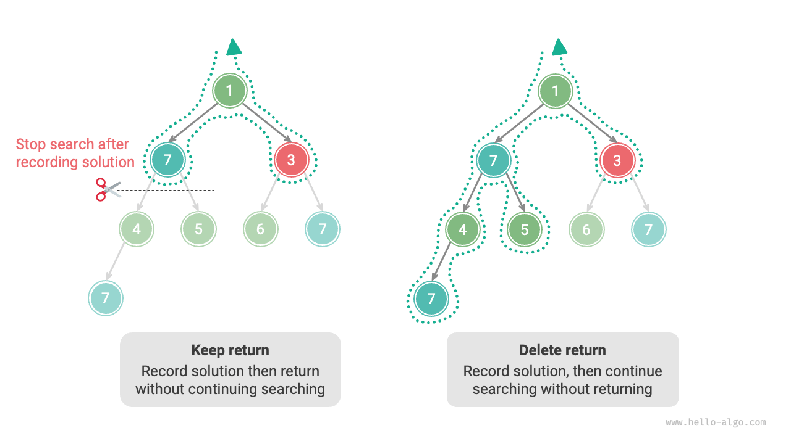{ class="animation-figure" }

<p align="center"> 図 13-4 &nbsp; return を残す場合と削除する場合の探索過程の比較 </p>

前順走査にもとづく実装と比べると、バックトラッキングアルゴリズムのフレームワークにもとづく実装はやや冗長に見えますが、汎用性に優れています。実際、**多くのバックトラッキング問題はこのフレームワークで解けます**。具体的な問題に応じて `state` と `choices` を定義し、各メソッドを実装すれば十分です。

## 13.1.4 &nbsp; よく使われる用語

アルゴリズム問題をより明確に分析するために、バックトラッキングでよく使われる用語の意味を整理し、例題3に対応する例を次の表にまとめます。

<p align="center"> 表 13-1 &nbsp; よく使われるバックトラッキング用語 </p>

<div class="center-table" markdown>

| 用語                   | 定義                                                                       | 例題3                                                                 |
| ---------------------- | -------------------------------------------------------------------------- | -------------------------------------------------------------------- |
| 解（solution）         | 問題の特定の条件を満たす答えであり、1 つまたは複数存在し得る               | 根ノードからノード $7$ までの、制約条件を満たすすべての経路            |
| 制約条件（constraint） | 解の実現可能性を制限する条件であり、通常は枝刈りに用いられる               | 経路にノード $3$ を含まないこと                                         |
| 状態（state）          | ある時点における問題の状況を表し、すでに行った選択を含む                   | 現在までに訪問したノードの経路、すなわち `path` ノードリスト           |
| 試行（attempt）        | 利用可能な選択肢にもとづいて解空間を探索する過程であり、選択、状態更新、解判定を含む | 左右の子ノードを再帰的に訪問し、ノードを `path` に追加し、値が $7$ か判定する |
| 戻る（backtracking）   | 制約条件を満たさない状態に出会ったとき、それまでの選択を取り消して前の状態へ戻ること | 葉ノードを越えたとき、ノード訪問を終えたとき、値が $3$ のノードに出会ったときに探索を終了し、関数から戻る |
| 枝刈り（pruning）      | 問題の性質や制約条件にもとづき、無意味な探索経路を避ける方法であり、探索効率を高める | 値が $3$ のノードに出会ったら、それ以上探索しない                      |

</div>

!!! tip

    問題、解、状態などの概念は汎用的であり、分割統治、バックトラッキング、動的計画法、貪欲法などのアルゴリズムにも共通して現れます。

## 13.1.5 &nbsp; 利点と限界

バックトラッキングアルゴリズムの本質は深さ優先探索です。条件を満たす解を見つけるまで、あり得るすべての解を試します。この方法の利点は、考えられるすべての解を見つけられることであり、適切な枝刈りを行えば高い効率を発揮します。

しかし、大規模または複雑な問題を扱う場合、**バックトラッキングアルゴリズムの実行効率は受け入れがたいことがあります**。

- **時間**：バックトラッキングアルゴリズムでは通常、状態空間のすべての可能性をたどる必要があり、時間計算量は指数時間や階乗時間に達することがあります。
- **空間**：再帰呼び出しの過程では現在の状態（たとえば経路や枝刈り用の補助変数など）を保持する必要があり、深さが大きいと空間使用量も大きくなります。

それでもなお、**バックトラッキングアルゴリズムは一部の探索問題や制約充足問題に対する最良の解法です**。この種の問題では、どの選択が有効な解を生むかを事前に予測できないため、可能な選択肢をすべてたどる必要があります。このときの鍵は**いかに効率を最適化するか**であり、代表的な方法は 2 つあります。

- **枝刈り**：解が生じないことが確実な経路を探索しないことで、時間と空間を節約する。
- **ヒューリスティック探索**：探索中に何らかの戦略や推定値を導入し、有効な解を生みやすい経路を優先的に探索する。

## 13.1.6 &nbsp; バックトラッキングの典型例題

バックトラッキングアルゴリズムは、多くの探索問題、制約充足問題、組合せ最適化問題の解決に利用できます。

**探索問題**：この種の問題の目標は、特定の条件を満たす解を見つけることです。

- 全順列問題：ある集合が与えられたとき、考えられるすべての順列を求める。
- 部分和問題：ある集合と目標和が与えられたとき、和が目標値となるすべての部分集合を見つける。
- ハノイの塔問題：3 本の柱と大きさの異なる複数の円盤が与えられたとき、すべての円盤を 1 本の柱から別の柱へ移動する。ただし 1 回に 1 枚しか動かせず、大きい円盤を小さい円盤の上に置いてはならない。

**制約充足問題**：この種の問題の目標は、すべての制約条件を満たす解を見つけることです。

- $n$ クイーン問題：$n \times n$ の盤面に $n$ 個のクイーンを配置し、互いに攻撃し合わないようにする。
- 数独：$9 \times 9$ のグリッドに数字 $1$ ~ $9$ を入れ、各行・各列・各 $3 \times 3$ の小区画で数字が重複しないようにする。
- グラフ彩色問題：無向グラフが与えられたとき、隣接する頂点が同じ色にならないように、できるだけ少ない色で各頂点を彩色する。

**組合せ最適化問題**：この種の問題の目標は、組合せ空間の中で条件を満たす最適解を見つけることです。

- 0-1 ナップサック問題：複数の品物とナップサックが与えられ、各品物には価値と重さがある。ナップサック容量の範囲内で総価値が最大になるように品物を選ぶ。
- 巡回セールスマン問題：グラフ内のある頂点から出発し、他のすべての頂点をちょうど 1 回ずつ訪れて出発点へ戻るときの最短経路を求める。
- 最大クリーク問題：無向グラフが与えられたとき、任意の 2 頂点間に辺が存在する最大の完全部分グラフを見つける。

多くの組合せ最適化問題では、バックトラッキングは最適な解法ではない点に注意してください。

- 0-1 ナップサック問題は通常、より高い時間効率を得るために動的計画法で解く。
- 巡回セールスマン問題は著名な NP-Hard 問題であり、よく用いられる解法には遺伝的アルゴリズムや蟻コロニー最適化などがある。
- 最大クリーク問題はグラフ理論における古典的問題であり、貪欲法などのヒューリスティックで解ける。
