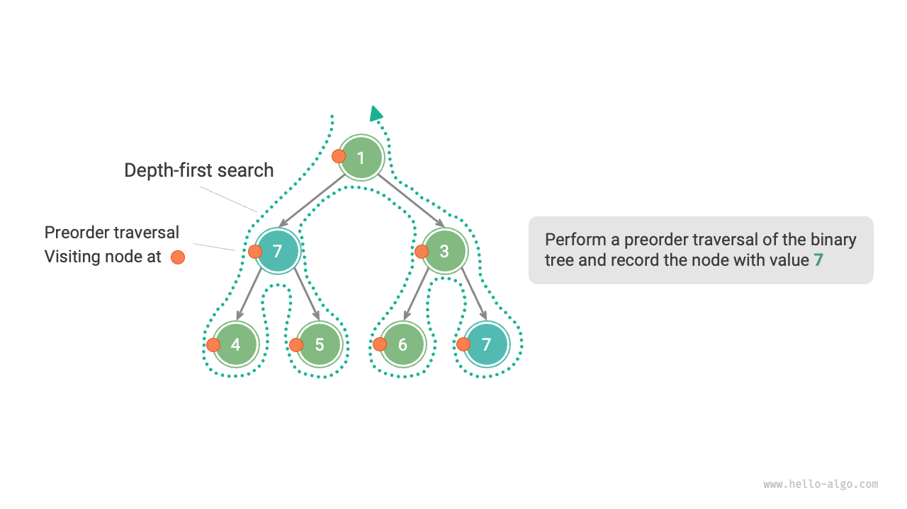
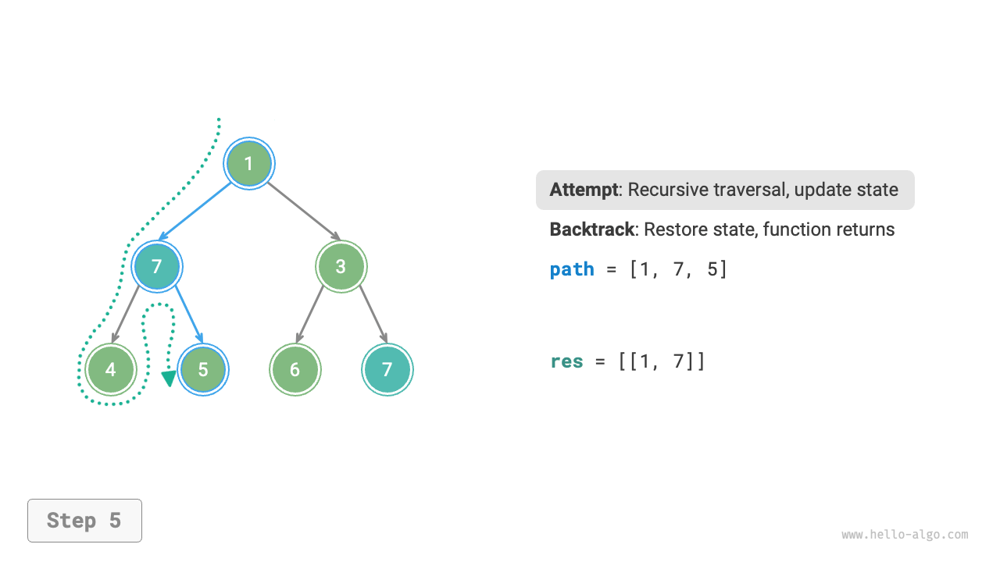

# バックトラッキングアルゴリズム

<u>バックトラッキングアルゴリズム</u>は全数探索によって問題を解決する方法です。その核心概念は、初期状態から開始してすべての可能な解を総当たりで探索することです。アルゴリズムは正しいものを記録し、解が見つかるか、すべての可能な解が試されたが解が見つからないまで続けます。

バックトラッキングは通常「深さ優先探索」を使用して解空間を走査します。「二分木」の章で、前順、中順、後順走査はすべて深さ優先探索であることを述べました。次に、前順走査を使用してバックトラッキング問題を解決し、アルゴリズムの動作を段階的に理解していきます。

!!! question "例1"

    二分木が与えられた場合、値が $7$ のすべてのノードを検索して記録し、リストで返してください。

この問題を解決するために、この木を前順で走査し、現在のノードの値が $7$ かどうかを確認します。そうであれば、ノードの値を結果リスト `res` に追加します。プロセスは以下の図に示されています：

```src
[file]{preorder_traversal_i_compact}-[class]{}-[func]{pre_order}
```



## 試行と後退

**解空間を探索する際に「試行」と「後退」戦略を使用するため、バックトラッキングアルゴリズムと呼ばれます**。探索中、満足のいく解を得るためにもはや進めない状態に遭遇するたびに、前の選択を取り消して前の状態に戻り、次の試行のために他の可能な選択を選択できるようにします。

例1では、各ノードの訪問が「試行」を開始します。そして葉ノードを通過するか、`return` 文で親ノードに戻ることが「後退」を示唆します。

**後退は単に関数の戻り値ではないことに注意してください**。例1の問題を少し拡張して、それが何を意味するかを説明します。

!!! question "例2"

    二分木で、値が $7$ のすべてのノードを検索し、すべてのマッチングノードについて、**ルートノードからそのノードまでのパスを返してください**。

例1のコードに基づいて、訪問したノードパスを記録するために `path` というリストを使用する必要があります。値が $7$ のノードに到達すると、`path` をコピーして結果リスト `res` に追加します。走査後、`res` にはすべての解が保持されます。コードは以下の通りです：

```src
[file]{preorder_traversal_ii_compact}-[class]{}-[func]{pre_order}
```

各「試行」で、現在のノードを `path` に追加することでパスを記録します。「後退」が必要なときはいつでも、`path` からノードをポップして**この失敗した試行前の状態を復元します**。

以下の図に示すプロセスを観察することで、**試行は「前進」のようで、後退は「元に戻す」のようです**。後者のペアは、対応するものに対する逆操作と見なすことができます。

=== "<1>"
    

=== "<2>"
    

=== "<3>"
    

=== "<4>"
    

=== "<5>"
    

=== "<6>"
    

=== "<7>"
    

=== "<8>"
    

=== "<9>"
    

=== "<10>"
    

=== "<11>"
    

## 剪定

複雑なバックトラッキング問題は通常1つ以上の制約を含み、**これらは「剪定」によく使用されます**。

!!! question "例3"

    二分木で、値が $7$ のすべてのノードを検索し、ルートからこれらのノードまでのパスを返してください。**ただし、パスには値が $3$ のノードを含まないという制限があります**。

上記の制約を満たすために、**剪定操作を追加する必要があります**：検索プロセス中に、値が $3$ のノードに遭遇した場合、そのパスを通じてさらに検索することを即座に中止します。コードは以下の通りです：

```src
[file]{preorder_traversal_iii_compact}-[class]{}-[func]{pre_order}
```

「剪定」は非常に生き生きとした名詞です。以下の図に示すように、検索プロセスで、**制約を満たさない検索分岐を「切り取り」ます**。さらなる不要な試行を避け、検索効率を向上させます。


## フレームワークコード

今度は、バックトラッキングから「試行、後退、剪定」の主要なフレームワークを抽出して、コードの汎用性を向上させてみましょう。

以下のフレームワークコードでは、`state` は問題の現在の状態を表し、`choices` は現在の状態で利用可能な選択肢を表します：

=== "Python"

    ```python title=""
    def backtrack(state: State, choices: list[choice], res: list[state]):
        """バックトラッキングアルゴリズムフレームワーク"""
        # 解かどうかを確認
        if is_solution(state):
            # 解を記録
            record_solution(state, res)
            # 検索を停止
            return
        # すべての選択肢を反復
        for choice in choices:
            # 剪定：選択肢が有効かどうかを確認
            if is_valid(state, choice):
                # 試行：選択を行い、状態を更新
                make_choice(state, choice)
                backtrack(state, choices, res)
                # 後退：選択を取り消し、前の状態に戻す
                undo_choice(state, choice)
    ```

次に、上記のフレームワークの操作を定義します。

- **`is_solution(state)`**：現在の状態が解であるかどうかを判定します。
- **`record_solution(state, res)`**：解を記録します。
- **`is_valid(state, choice)`**：現在の状態で特定の選択肢が有効（合法）かどうかを判定します。
- **`make_choice(state, choice)`**：選択を更新し、状態を更新します。
- **`undo_choice(state, choice)`**：選択を取り消し、状態を前の状態に戻します。

フレームワークコードの利点は、**特定の問題に対して上記のメソッドを実装するだけで、問題を解決できることです**。実際、**深さ優先探索、二分木前順走査、広がりなしの解の検索も、このフレームワークのスコープ内にあります**。

## 典型的な例

次に、3つの典型的なバックトラッキング問題を使用して、アルゴリズムの動作原理と実装コードを詳しく理解しましょう。

### 全順列

全順列問題は、バックトラッキングアルゴリズムの典型的な応用です。異なる整数のセット `nums` が与えられた場合、すべての可能な順列を返します。


### 部分集合和問題

正の整数の配列 `nums` とターゲット正整数 `target` が与えられた場合、すべての可能な組み合わせを見つけて、選択された要素の和が `target` に等しくなるようにします。配列の各要素は最大1回選択でき、各解のすべての要素は重複なしである必要があります。


### Nクイーン問題

$n \times n$ のチェスボードに $n$ 個のクイーンを配置し、それらが互いに攻撃しないようにします。任意の2つのクイーンは同じ行、列、対角線上にあってはなりません。


これらの例を通じて、バックトラッキングアルゴリズムの多様性と強力さを見ることができます。