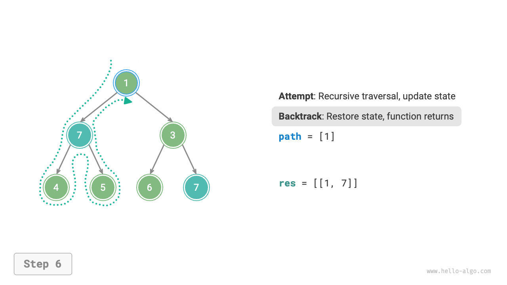
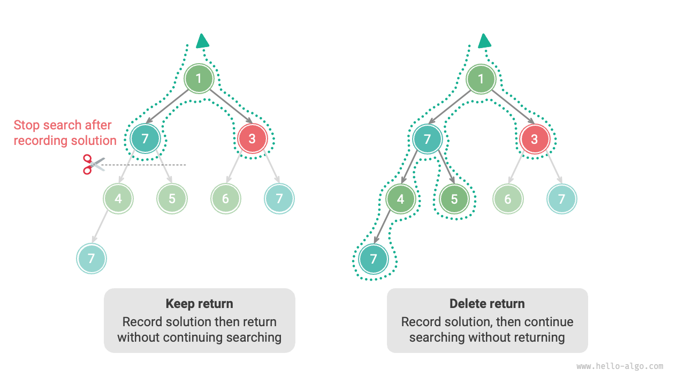

# バックトラッキングアルゴリズム

<u>バックトラッキングアルゴリズム</u>は全数探索によって問題を解決する方法です。その核心概念は、初期状態から開始してすべての可能な解を総当たりで探索することです。アルゴリズムは正しいものを記録し、解が見つかるか、すべての可能な解が試されたが解が見つからないまで続けます。

バックトラッキングは通常「深さ優先探索」を使用して解空間を走査します。「二分木」の章で、前順、中順、後順走査はすべて深さ優先探索であることを述べました。次に、前順走査を使用してバックトラッキング問題を解決し、アルゴリズムの動作を段階的に理解していきます。

!!! question "例1"

    二分木が与えられた場合、値が $7$ のすべてのノードを検索して記録し、リストで返してください。

この問題を解決するために、この木を前順で走査し、現在のノードの値が $7$ かどうかを確認します。そうであれば、ノードの値を結果リスト `res` に追加します。プロセスは以下の図に示されています：

```src
[file]{preorder_traversal_i_compact}-[class]{}-[func]{pre_order}
```


## 試行と後退

**解空間を探索する際に「試行」と「後退」戦略を使用するため、バックトラッキングアルゴリズムと呼ばれます**。探索中、満足のいく解を得るためにもはや進めない状態に遭遇するたびに、前の選択を取り消して前の状態に戻り、次の試行のために他の可能な選択を選択できるようにします。

例1では、各ノードの訪問が「試行」を開始します。そして葉ノードを通過するか、`return` 文で親ノードに戻ることが「後退」を示唆します。

**後退は単に関数の戻り値ではないことに注意してください**。例1の問題を少し拡張して、それが何を意味するかを説明します。

!!! question "例2"

    二分木で、値が $7$ のすべてのノードを検索し、すべてのマッチングノードについて、**ルートノードからそのノードまでのパスを返してください**。

例1のコードに基づいて、訪問したノードパスを記録するために `path` というリストを使用する必要があります。値が $7$ のノードに到達すると、`path` をコピーして結果リスト `res` に追加します。走査後、`res` にはすべての解が保持されます。コードは以下の通りです：

```src
[file]{preorder_traversal_ii_compact}-[class]{}-[func]{pre_order}
```

各「試行」で、現在のノードを `path` に追加することでパスを記録します。「後退」が必要なときはいつでも、`path` からノードをポップして**この失敗した試行前の状態を復元します**。

以下の図に示すプロセスを観察することで、**試行は「前進」のようで、後退は「元に戻す」のようです**。後者のペアは、対応するものに対する逆操作と見なすことができます。

=== "<1>"
    

=== "<2>"
    

=== "<3>"
    

=== "<4>"
    

=== "<5>"
    

=== "<6>"
    

=== "<7>"
    

=== "<8>"
    

=== "<9>"
    

=== "<10>"
    

=== "<11>"
    

## 剪定

複雑なバックトラッキング問題は通常1つ以上の制約を含み、**これらは「剪定」によく使用されます**。

!!! question "例3"

    二分木で、値が $7$ のすべてのノードを検索し、ルートからこれらのノードまでのパスを返してください。**ただし、パスには値が $3$ のノードを含まないという制限があります**。

上記の制約を満たすために、**剪定操作を追加する必要があります**：検索プロセス中に、値が $3$ のノードに遭遇した場合、そのパスを通じてさらに検索することを即座に中止します。コードは以下の通りです：

```src
[file]{preorder_traversal_iii_compact}-[class]{}-[func]{pre_order}
```

「剪定」は非常に生き生きとした名詞です。以下の図に示すように、検索プロセスで、**制約を満たさない検索分岐を「切り取り」ます**。さらなる不要な試行を避け、検索効率を向上させます。


## フレームワークコード

今度は、バックトラッキングから「試行、後退、剪定」の主要なフレームワークを抽出して、コードの汎用性を向上させてみましょう。

以下のフレームワークコードでは、`state` は問題の現在の状態を表し、`choices` は現在の状態で利用可能な選択肢を表します：

=== "Python"

    ```python title=""
    def backtrack(state: State, choices: list[choice], res: list[state]):
        """バックトラッキングアルゴリズムフレームワーク"""
        # 解かどうかを確認
        if is_solution(state):
            # 解を記録
            record_solution(state, res)
            # 検索を停止
            return
        # すべての選択肢を反復
        for choice in choices:
            # 剪定：選択肢が有効かどうかを確認
            if is_valid(state, choice):
                # 試行：選択を行い、状態を更新
                make_choice(state, choice)
                backtrack(state, choices, res)
                # 後退：選択を取り消し、前の状態に戻す
                undo_choice(state, choice)
    ```

=== "C++"

    ```cpp title=""
    /* バックトラッキングアルゴリズムフレームワーク */
    void backtrack(State *state, vector<Choice *> &choices, vector<State *> &res) {
        // 解かどうかを確認
        if (isSolution(state)) {
            // 解を記録
            recordSolution(state, res);
            // 検索を停止
            return;
        }
        // すべての選択肢を反復
        for (Choice choice : choices) {
            // 剪定：選択肢が有効かどうかを確認
            if (isValid(state, choice)) {
                // 試行：選択を行い、状態を更新
                makeChoice(state, choice);
                backtrack(state, choices, res);
                // 後退：選択を取り消し、前の状態に戻す
                undoChoice(state, choice);
            }
        }
    }
    ```

=== "Java"

    ```java title=""
    /* バックトラッキングアルゴリズムフレームワーク */
    void backtrack(State state, List<Choice> choices, List<State> res) {
        // 解かどうかを確認
        if (isSolution(state)) {
            // 解を記録
            recordSolution(state, res);
            // 検索を停止
            return;
        }
        // すべての選択肢を反復
        for (Choice choice : choices) {
            // 剪定：選択肢が有効かどうかを確認
            if (isValid(state, choice)) {
                // 試行：選択を行い、状態を更新
                makeChoice(state, choice);
                backtrack(state, choices, res);
                // 後退：選択を取り消し、前の状態に戻す
                undoChoice(state, choice);
            }
        }
    }
    ```

=== "C#"

    ```csharp title=""
    /* バックトラッキングアルゴリズムフレームワーク */
    void Backtrack(State state, List<Choice> choices, List<State> res) {
        // 解かどうかを確認
        if (IsSolution(state)) {
            // 解を記録
            RecordSolution(state, res);
            // 検索を停止
            return;
        }
        // すべての選択肢を反復
        foreach (Choice choice in choices) {
            // 剪定：選択肢が有効かどうかを確認
            if (IsValid(state, choice)) {
                // 試行：選択を行い、状態を更新
                MakeChoice(state, choice);
                Backtrack(state, choices, res);
                // 後退：選択を取り消し、前の状態に戻す
                UndoChoice(state, choice);
            }
        }
    }
    ```

=== "Go"

    ```go title=""
    /* バックトラッキングアルゴリズムフレームワーク */
    func backtrack(state *State, choices []Choice, res *[]State) {
        // 解かどうかを確認
        if isSolution(state) {
            // 解を記録
            recordSolution(state, res)
            // 検索を停止
            return
        }
        // すべての選択肢を反復
        for _, choice := range choices {
            // 剪定：選択肢が有効かどうかを確認
            if isValid(state, choice) {
                // 試行：選択を行い、状態を更新
                makeChoice(state, choice)
                backtrack(state, choices, res)
                // 後退：選択を取り消し、前の状態に戻す
                undoChoice(state, choice)
            }
        }
    }
    ```

=== "Swift"

    ```swift title=""
    /* バックトラッキングアルゴリズムフレームワーク */
    func backtrack(state: inout State, choices: [Choice], res: inout [State]) {
        // 解かどうかを確認
        if isSolution(state: state) {
            // 解を記録
            recordSolution(state: state, res: &res)
            // 検索を停止
            return
        }
        // すべての選択肢を反復
        for choice in choices {
            // 剪定：選択肢が有効かどうかを確認
            if isValid(state: state, choice: choice) {
                // 試行：選択を行い、状態を更新
                makeChoice(state: &state, choice: choice)
                backtrack(state: &state, choices: choices, res: &res)
                // 後退：選択を取り消し、前の状態に戻す
                undoChoice(state: &state, choice: choice)
            }
        }
    }
    ```

=== "JS"

    ```javascript title=""
    /* バックトラッキングアルゴリズムフレームワーク */
    function backtrack(state, choices, res) {
        // 解かどうかを確認
        if (isSolution(state)) {
            // 解を記録
            recordSolution(state, res);
            // 検索を停止
            return;
        }
        // すべての選択肢を反復
        for (let choice of choices) {
            // 剪定：選択肢が有効かどうかを確認
            if (isValid(state, choice)) {
                // 試行：選択を行い、状態を更新
                makeChoice(state, choice);
                backtrack(state, choices, res);
                // 後退：選択を取り消し、前の状態に戻す
                undoChoice(state, choice);
            }
        }
    }
    ```

=== "TS"

    ```typescript title=""
    /* バックトラッキングアルゴリズムフレームワーク */
    function backtrack(state: State, choices: Choice[], res: State[]): void {
        // 解かどうかを確認
        if (isSolution(state)) {
            // 解を記録
            recordSolution(state, res);
            // 検索を停止
            return;
        }
        // すべての選択肢を反復
        for (let choice of choices) {
            // 剪定：選択肢が有効かどうかを確認
            if (isValid(state, choice)) {
                // 試行：選択を行い、状態を更新
                makeChoice(state, choice);
                backtrack(state, choices, res);
                // 後退：選択を取り消し、前の状態に戻す
                undoChoice(state, choice);
            }
        }
    }
    ```

=== "Dart"

    ```dart title=""
    /* バックトラッキングアルゴリズムフレームワーク */
    void backtrack(State state, List<Choice>, List<State> res) {
      // 解かどうかを確認
      if (isSolution(state)) {
        // 解を記録
        recordSolution(state, res);
        // 検索を停止
        return;
      }
      // すべての選択肢を反復
      for (Choice choice in choices) {
        // 剪定：選択肢が有効かどうかを確認
        if (isValid(state, choice)) {
          // 試行：選択を行い、状態を更新
          makeChoice(state, choice);
          backtrack(state, choices, res);
          // 後退：選択を取り消し、前の状態に戻す
          undoChoice(state, choice);
        }
      }
    }
    ```

=== "Rust"

    ```rust title=""
    /* バックトラッキングアルゴリズムフレームワーク */
    fn backtrack(state: &mut State, choices: &Vec<Choice>, res: &mut Vec<State>) {
        // 解かどうかを確認
        if is_solution(state) {
            // 解を記録
            record_solution(state, res);
            // 検索を停止
            return;
        }
        // すべての選択肢を反復
        for choice in choices {
            // 剪定：選択肢が有効かどうかを確認
            if is_valid(state, choice) {
                // 試行：選択を行い、状態を更新
                make_choice(state, choice);
                backtrack(state, choices, res);
                // 後退：選択を取り消し、前の状態に戻す
                undo_choice(state, choice);
            }
        }
    }
    ```

=== "C"

    ```c title=""
    /* バックトラッキングアルゴリズムフレームワーク */
    void backtrack(State *state, Choice *choices, int numChoices, State *res, int numRes) {
        // 解かどうかを確認
        if (isSolution(state)) {
            // 解を記録
            recordSolution(state, res, numRes);
            // 検索を停止
            return;
        }
        // すべての選択肢を反復
        for (int i = 0; i < numChoices; i++) {
            // 剪定：選択肢が有効かどうかを確認
            if (isValid(state, &choices[i])) {
                // 試行：選択を行い、状態を更新
                makeChoice(state, &choices[i]);
                backtrack(state, choices, numChoices, res, numRes);
                // 後退：選択を取り消し、前の状態に戻す
                undoChoice(state, &choices[i]);
            }
        }
    }
    ```

=== "Kotlin"

    ```kotlin title=""
    /* バックトラッキングアルゴリズムフレームワーク */
    fun backtrack(state: State?, choices: List<Choice?>, res: List<State?>?) {
        // 解かどうかを確認
        if (isSolution(state)) {
            // 解を記録
            recordSolution(state, res)
            // 検索を停止
            return
        }
        // すべての選択肢を反復
        for (choice in choices) {
            // 剪定：選択肢が有効かどうかを確認
            if (isValid(state, choice)) {
                // 試行：選択を行い、状態を更新
                makeChoice(state, choice)
                backtrack(state, choices, res)
                // 後退：選択を取り消し、前の状態に戻す
                undoChoice(state, choice)
            }
        }
    }
    ```

=== "Ruby"

    ```ruby title=""
    ### バックトラッキングアルゴリズムフレームワーク ###
    def backtrack(state, choices, res)
        # 解かどうかを確認
        if is_solution?(state)
            # 解を記録
            record_solution(state, res)
            return
        end

        # すべての選択肢を反復
        for choice in choices
            # 剪定：選択肢が有効かどうかを確認
            if is_valid?(state, choice)
                # 試行：選択を行い、状態を更新
                make_choice(state, choice)
                backtrack(state, choices, res)
                # 後退：選択を取り消し、前の状態に戻す
                undo_choice(state, choice)
            end
        end
    end
    ```

=== "Zig"

    ```zig title=""

    ```

次に、フレームワークコードに基づいて例題 3 を解きます。状態 `state` はノードの走査経路を表し、選択肢 `choices` は現在ノードの左子ノードと右子ノード、結果 `res` は経路リストです：

```src
[file]{preorder_traversal_iii_template}-[class]{}-[func]{backtrack}
```

問題文の意味に従い、値が $7$ のノードを見つけた後も探索を続ける必要があります。**したがって、解を記録した後の `return` 文を削除する必要があります**。次の図は、`return` 文を保持する場合と削除する場合の探索過程の比較です。



前順走査に基づくコード実装と比べると、バックトラッキングアルゴリズムのフレームワークに基づく実装はやや冗長に見えますが、汎用性はより高いです。実際、**多くのバックトラッキング問題はこのフレームワークの下で解くことができます**。具体的な問題に応じて `state` と `choices` を定義し、フレームワーク内の各メソッドを実装すればよいのです。

## よく使われる用語

アルゴリズム問題をより明確に分析するために、バックトラッキングアルゴリズムでよく使われる用語の意味をまとめ、例題 3 の対応例を以下の表に示します。

<p align="center"> 表 <id> &nbsp; バックトラッキングアルゴリズムでよく使われる用語 </p>

| 名称                           | 定義                                                                                                         | 例題 3                                                                                    |
| ------------------------------ | ------------------------------------------------------------------------------------------------------------ | ----------------------------------------------------------------------------------------- |
| 解（solution）                 | 解は問題の特定条件を満たす答えであり、1 つまたは複数存在する可能性がある                                     | 根ノードからノード $7$ までの制約条件を満たすすべての経路                                 |
| 制約条件（constraint）         | 制約条件は、解の実現可能性を制限する条件であり、通常は枝刈りに使用される                                     | 経路にノード $3$ を含まない                                                               |
| 状態（state）                  | 状態は、ある時点での問題の状況を表し、これまでに行った選択を含む                                             | 現在訪問したノード経路、すなわち `path` ノードリスト                                      |
| 試行（attempt）                | 試行は、利用可能な選択肢に基づいて解空間を探索する過程であり、選択を行い、状態を更新し、解かどうかを確認する | 左（右）子ノードを再帰的に訪問し、ノードを `path` に追加し、ノードの値が $7$ かを確認する |
| バックトラック（backtracking） | 制約条件を満たさない状態に遭遇した場合、以前の選択を取り消して前の状態に戻ること                             | 葉ノードを越えたとき、探索終了、値が $3$ のノードに遭遇したとき探索を終了し、関数が戻る   |
| 枝刈り（pruning）              | 問題の特性や制約条件に基づき、無意味な探索経路を避ける方法であり、探索効率を向上させる                       | 値が $3$ のノードに遭遇した場合、それ以上探索しない                                       |

!!! tip

    問題、解、状態などの概念は一般的なものであり、分割統治、バックトラッキング、動的計画法、貪欲法などのアルゴリズムにも関係します。

## 長所と限界

バックトラッキングアルゴリズムは本質的に深さ優先探索（DFS）アルゴリズムの一種であり、条件を満たす解を見つけるまであらゆる可能な解を試みます。この方法の利点は、すべての可能な解を見つけられる点であり、適切な枝刈りを行えば効率が高いことです。

しかし、大規模または複雑な問題を扱う場合、**バックトラッキングアルゴリズムの実行効率は許容できないほど低下する可能性があります**。

- **時間**：バックトラッキングアルゴリズムは通常、状態空間のすべての可能性を探索する必要があり、時間計算量は指数オーダーまたは階乗オーダーに達する可能性があります。
- **空間**：再帰呼び出し中に現在の状態（例：経路、枝刈り用の補助変数など）を保存する必要があり、深さが大きい場合、空間の使用量が増加します。

それでもなお、**バックトラッキングアルゴリズムは特定の探索問題や制約満足問題の最良の解法であることが多いです**。これらの問題では、どの選択が有効な解を生成するかを予測できないため、すべての可能な選択を試す必要があります。このような場合、**効率の最適化が鍵**となります。一般的な最適化手法は次の 2 つです。

- **枝刈り**：解を生成しないことが確実な経路を避けることで、時間と空間を節約します。
- **ヒューリスティック探索**：探索中に戦略や評価値を導入し、有効な解を生成する可能性が高い経路を優先的に探索します。

## バックトラッキングの典型的な例題

バックトラッキングアルゴリズムは、多くの探索問題、制約満足問題、組合せ最適化問題を解くのに使用できます。

**探索問題**：この種の問題の目標は、特定の条件を満たす解を見つけることです。

- 全順列問題：与えられた集合のすべての可能な順列を求める。
- 部分和問題：与えられた集合と目標和に対して、和が目標値になるすべての部分集合を求める。
- ハノイの塔：3 本の柱と異なるサイズの円盤があり、すべての円盤を 1 本の柱から別の柱に移す。1 回に 1 枚しか動かせず、大きな円盤を小さい円盤の上に置くことはできない。

**制約満足問題**：この種の問題の目標は、すべての制約条件を満たす解を見つけることです。

- $n$ クイーン問題：$n imes n$ のチェス盤に $n$ 個のクイーンを配置し、互いに攻撃しないようにする。
- 数独：$9 imes 9$ のグリッドに数字 $1$ \~ $9$ を入力し、各行、列、$3 imes 3$ のサブグリッドに重複がないようにする。
- グラフ彩色問題：与えられた無向グラフに対し、隣接頂点が異なる色になるように最小限の色で彩色する。

**組合せ最適化問題**：この種の問題の目標は、組合せ空間内で特定の条件を満たす最適解を見つけることです。

- 0-1 ナップサック問題：与えられた物品群とバックパックがあり、各物品には価値と重さが設定されている。バックパックの容量制限内で、総価値を最大化する物品の選択を求める。
- 旅行セールスマン問題：グラフ上で、1 つの点から出発し、すべての他の点を 1 回ずつ訪問して出発点に戻る最短経路を求める。
- 最大クリーク問題：与えられた無向グラフの中で、任意の 2 頂点間に辺が存在する最大の完全部分グラフを見つける。

注意すべきは、多くの組合せ最適化問題に対して、バックトラッキングが最適解法ではないということです。

- 0-1 ナップサック問題は、時間効率を高めるために動的計画法がよく使用されます。
- 旅行セールスマン問題は有名な NP-Hard 問題であり、遺伝的アルゴリズムやアントコロニーアルゴリズムなどの手法がよく使われます。
- 最大クリーク問題はグラフ理論の古典的な問題であり、貪欲法などのヒューリスティックアルゴリズムで解くことができます。
