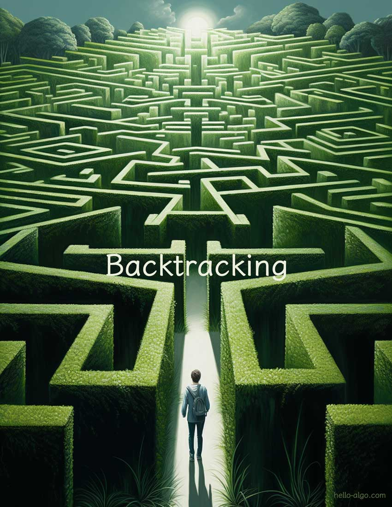

# 第 13 章 &nbsp; バックトラッキング

{ class="cover-image" }

!!! abstract

    迷路の探検家のように、私たちは前進する道で障害に遭遇することがあります。

    バックトラッキングの力は、私たちに新しく始めること、試し続けること、そして最終的に光への出口を見つけることを可能にします。

## 章の内容

- [13.1 &nbsp; バックトラッキングアルゴリズム](backtracking_algorithm.md)
- [13.2 &nbsp; 順列問題](permutations_problem.md)
- [13.3 &nbsp; 部分集合和問題](subset_sum_problem.md)
- [13.4 &nbsp; Nクイーン問題](n_queens_problem.md)
- [13.5 &nbsp; まとめ](summary.md)
