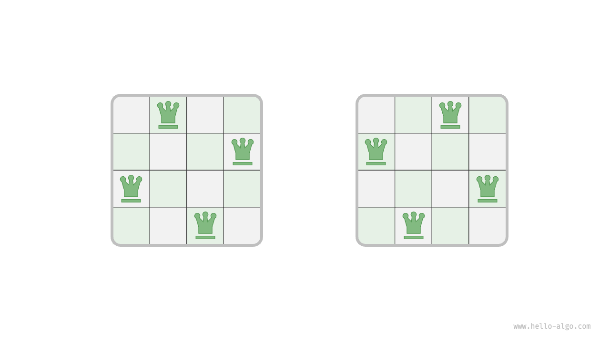
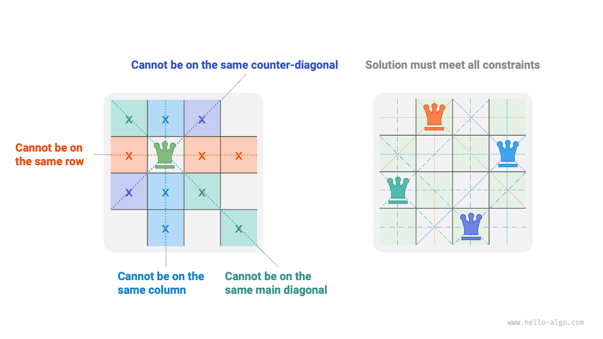
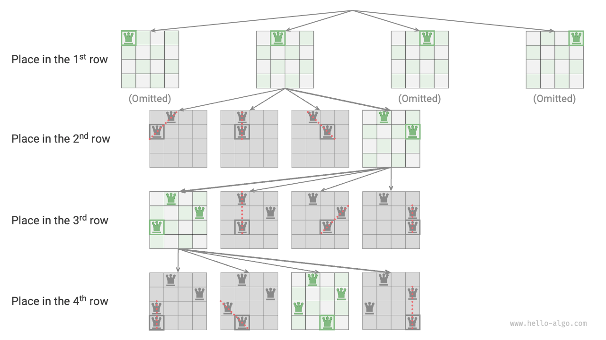
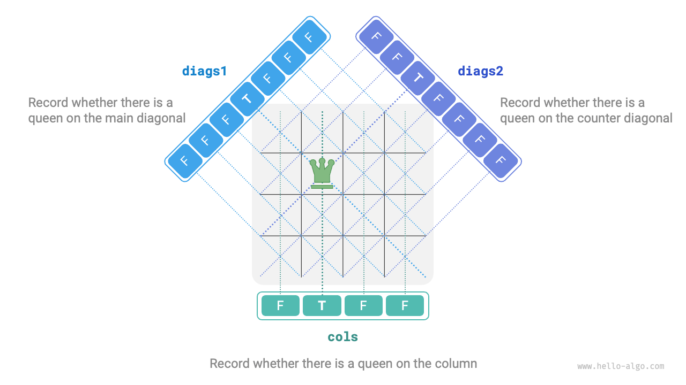

# Nクイーン問題

!!! question

    チェスのルールによると、クイーンは同じ行、列、または対角線上の駒を攻撃できます。$n$ 個のクイーンと $n \times n$ のチェスボードが与えられた場合、2つのクイーンが互いに攻撃できない配置を見つけてください。

以下の図に示すように、$n = 4$ の場合、2つの解があります。バックトラッキングアルゴリズムの観点から、$n \times n$ のチェスボードには $n^2$ 個のマスがあり、すべての可能な選択肢 `choices` を示しています。チェスボードの状態 `state` は、各クイーンが配置されるにつれて継続的に変化します。



以下の図は、この問題の3つの制約を示しています：**複数のクイーンは同じ行、列、または対角線を占有できません**。対角線は主対角線 `\` と副対角線 `/` に分かれることに注意することが重要です。



### 行ごとの配置戦略

クイーンの数がチェスボードの行数と等しく、どちらも $n$ であるため、**チェスボードの各行には1つのクイーンのみが配置できることが**容易に結論付けられます。

これは、行ごとの配置戦略を採用できることを意味します：最初の行から開始して、最後の行に到達するまで行ごとに1つのクイーンを配置します。

以下の図は、4クイーン問題の行ごとの配置プロセスを示しています。スペースの制限により、図は最初の行の1つの検索分岐のみを展開し、列と対角線の制約を満たさない配置を剪定します。



本質的に、**行ごとの配置戦略は剪定関数として機能し**、同じ行に複数のクイーンを配置するすべての検索分岐を除去します。

### 列と対角線の剪定

列の制約を満たすために、長さ $n$ のブール配列 `cols` を使用して、各列にクイーンが占有されているかどうかを追跡できます。各配置決定の前に、`cols` を使用してすでにクイーンがある列を剪定し、バックトラッキング中に動的に更新されます。

!!! tip

    行列の原点は左上隅にあり、行インデックスは上から下に増加し、列インデックスは左から右に増加することに注意してください。

対角線の制約はどうでしょうか？チェスボード上の特定のセルの行と列のインデックスを $(row, col)$ とします。特定の主対角線を選択することで、その対角線上のすべてのセルで差 $row - col$ が同じであることに気付きます。**つまり、$row - col$ は主対角線上で定数値です**。

言い換えると、2つのセルが $row_1 - col_1 = row_2 - col_2$ を満たす場合、それらは確実に同じ主対角線上にあります。このパターンを使用して、以下の図に示す配列 `diags1` を利用して、クイーンが主対角線上にあるかどうかを追跡できます。

同様に、**$row + col$ の和は副対角線上のすべてのセルで定数値です**。配列 `diags2` を使用して副対角線の制約も処理できます。



### コード実装

$n$ 次元の正方行列では、$row - col$ の範囲は $[-n + 1, n - 1]$ で、$row + col$ の範囲は $[0, 2n - 2]$ であることに注意してください。したがって、主対角線と副対角線の数はどちらも $2n - 1$ で、配列 `diags1` と `diags2` の長さは $2n - 1$ です。

```src
[file]{n_queens}-[class]{}-[func]{n_queens}
```

$n$ 個のクイーンを行ごとに配置し、列の制約を考慮して、最初の行から最後の行まで、$n$、$n-1$、$\dots$、$2$、$1$ の選択肢があり、$O(n!)$ 時間を使用します。解を記録する際、行列 `state` をコピーして `res` に追加する必要があり、コピー操作は $O(n^2)$ 時間を使用します。したがって、**全体の時間計算量は $O(n! \cdot n^2)$ です**。実際には、対角線制約に基づく剪定により検索空間を大幅に削減できるため、多くの場合、検索効率は上記の時間計算量よりも優れています。

配列 `state` は $O(n^2)$ 空間を使用し、配列 `cols`、`diags1`、`diags2` はそれぞれ $O(n)$ 空間を使用します。最大再帰深度は $n$ で、$O(n)$ のスタックフレーム空間を使用します。したがって、**空間計算量は $O(n^2)$ です**。
