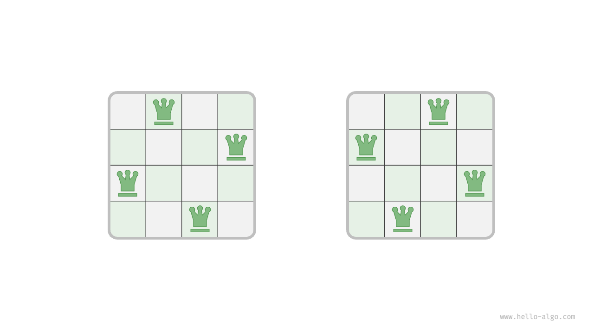
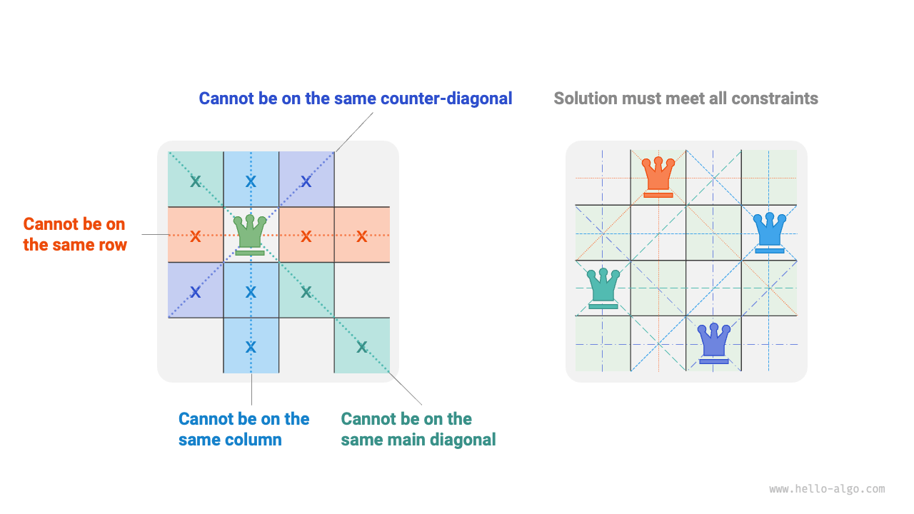
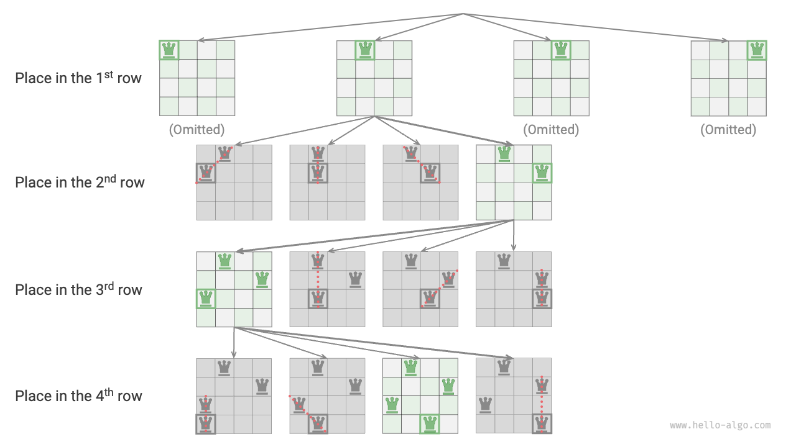
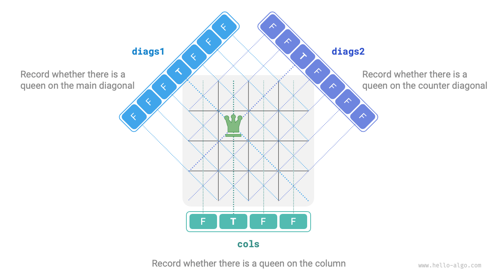

# n クイーン問題

!!! question

    チェスのルールによれば、クイーンは同じ行、同じ列、または同じ斜線上にある駒を攻撃できます。$n$ 個のクイーンと $n \times n$ サイズの盤面が与えられたとき、すべてのクイーンが互いに攻撃し合わない配置を求めます。

下図に示すように、$n = 4$ のとき、2 つの解を見つけることができます。バックトラッキングの観点から見ると、$n \times n$ サイズの盤面には合計 $n^2$ 個のマスがあり、これがすべての選択肢 `choices` を与えます。クイーンを 1 つずつ配置していく過程で、盤面の状態は絶えず変化し、その各時点の盤面が状態 `state` です。



下図は本問題の 3 つの制約条件を示しています。**複数のクイーンは同じ行、同じ列、同じ対角線上に置けません**。なお、対角線には主対角線 `\` と副対角線 `/` の 2 種類があります。



### 行ごとの配置戦略

クイーンの数と盤面の行数はいずれも $n$ なので、次の推論を容易に得られます：**盤面の各行にはクイーンを 1 つだけ配置できます**。

つまり、行ごとの配置戦略を採用できます：最初の行から始めて、各行に 1 つのクイーンを配置し、最後の行まで進みます。

下図は 4 クイーン問題における行ごとの配置過程を示しています。図の大きさの都合上、下図では 1 行目における検索分岐の 1 つだけを展開し、列制約と対角線制約を満たさない案はすべて枝刈りしています。



本質的には、**行ごとの配置戦略は枝刈りとして機能します**。これにより、同じ行に複数のクイーンが現れるすべての探索分岐を回避できます。

### 列と対角線の枝刈り

列制約を満たすために、長さ $n$ のブール配列 `cols` を用いて、各列にクイーンがあるかどうかを記録できます。配置を決めるたびに、`cols` を使って既存のクイーンがある列を枝刈りし、バックトラッキングの中で `cols` の状態を動的に更新します。

!!! tip

    注意として、行列の原点は左上にあり、行インデックスは上から下へ、列インデックスは左から右へ増加します。

では、対角線制約はどのように扱えばよいのでしょうか。盤面上のあるマスの行列インデックスを $(row, col)$ とし、行列内のある主対角線を選ぶと、その対角線上のすべてのマスで行インデックスから列インデックスを引いた値が等しいことが分かります。**つまり、主対角線上のすべてのマスでは $row - col$ が一定値になります**。

つまり、2 つのマスが $row_1 - col_1 = row_2 - col_2$ を満たすなら、それらは必ず同じ主対角線上にあります。この性質を利用して、下図の配列 `diags1` により、各主対角線にクイーンがあるかどうかを記録できます。

同様に、**副対角線上のすべてのマスでは $row + col$ が一定値です**。副対角線制約も配列 `diags2` を使って処理できます。



### コード実装

注意として、$n$ 次正方行列では $row - col$ の範囲は $[-n + 1, n - 1]$ 、$row + col$ の範囲は $[0, 2n - 2]$ です。したがって、主対角線と副対角線の本数はいずれも $2n - 1$ であり、配列 `diags1` と `diags2` の長さもともに $2n - 1$ です。

```src
[file]{n_queens}-[class]{}-[func]{n_queens}
```

行ごとに $n$ 回配置し、列制約を考慮すると、1 行目から最終行までの選択肢はそれぞれ $n$、$n-1$、$\dots$、$2$、$1$ 個となるため、時間計算量は $O(n!)$ です。解を記録する際には、行列 `state` をコピーして `res` に追加する必要があり、このコピー操作には $O(n^2)$ 時間を要します。したがって、**全体の時間計算量は $O(n! \cdot n^2)$** です。実際には、対角線制約による枝刈りも探索空間を大きく縮小できるため、探索効率はしばしば上記の時間計算量より良くなります。

配列 `state` は $O(n^2)$ の空間を使用し、配列 `cols`、`diags1`、`diags2` はいずれも $O(n)$ の空間を使用します。最大再帰深さは $n$ で、スタックフレーム空間として $O(n)$ を使用します。したがって、**空間計算量は $O(n^2)$** です。
