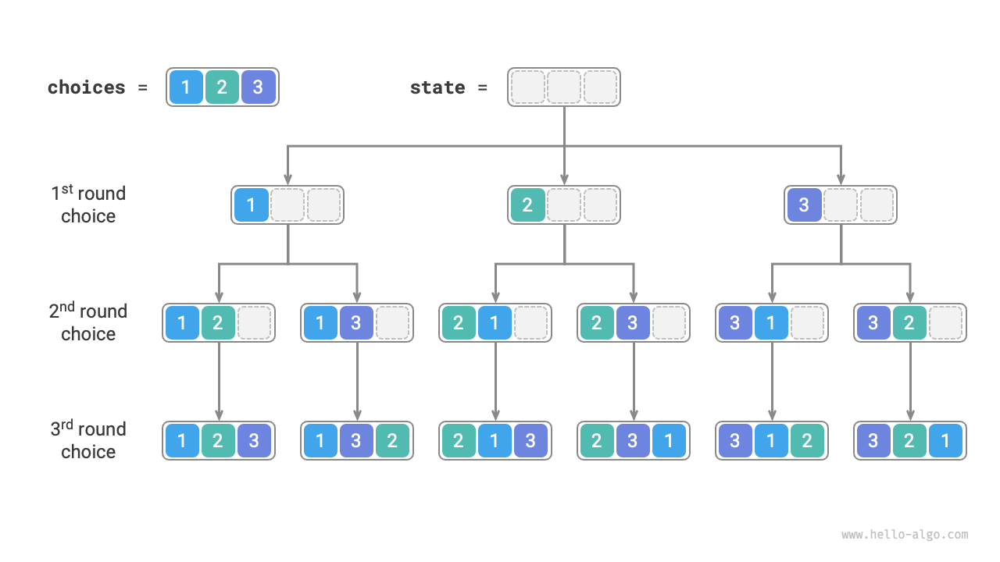
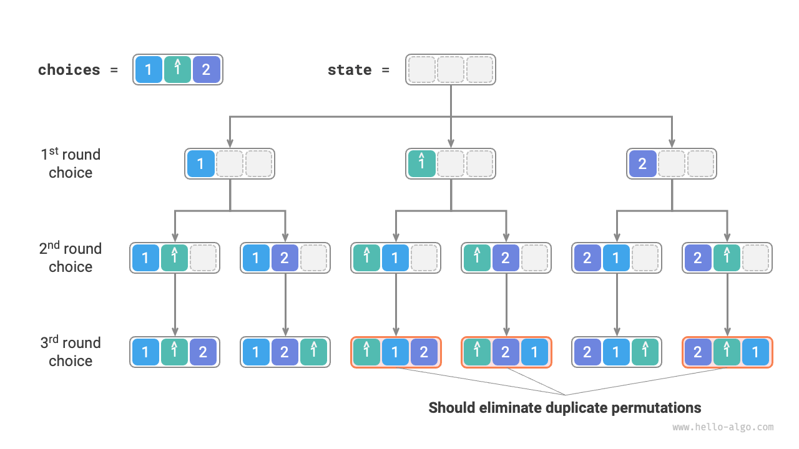
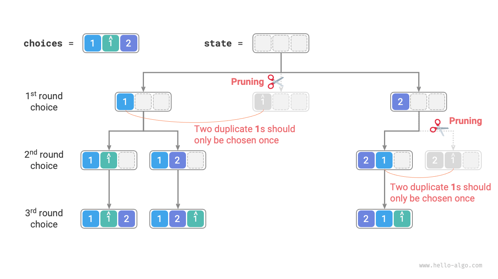
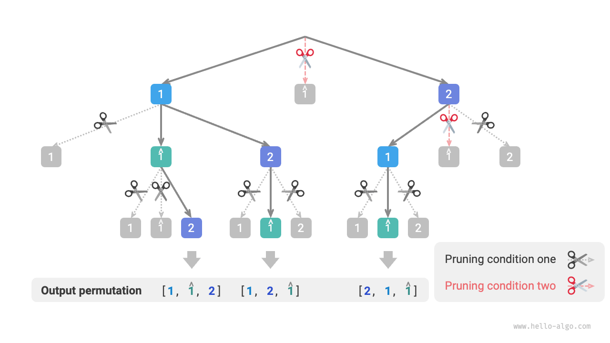

# 順列問題

順列問題は、バックトラッキングアルゴリズムの典型的な応用です。これは、配列や文字列などの与えられた集合から要素のすべての可能な配置（順列）を見つけることを含みます。

以下の表は、入力配列とその対応する順列を含むいくつかの例を示しています。

<p align="center"> 表 <id> &nbsp; 順列の例 </p>

| 入力配列     | 順列                                                                |
| :----------- | :----------------------------------------------------------------- |
| $[1]$        | $[1]$                                                              |
| $[1, 2]$     | $[1, 2], [2, 1]$                                                   |
| $[1, 2, 3]$  | $[1, 2, 3], [1, 3, 2], [2, 1, 3], [2, 3, 1], [3, 1, 2], [3, 2, 1]$ |

## 重複要素がない場合

!!! question

    重複要素のない整数配列が与えられた場合、すべての可能な順列を返してください。

バックトラッキングの観点から、**順列を生成するプロセスを一連の選択として見ることができます。** 入力配列が $[1, 2, 3]$ だとします。最初に $1$ を選択し、次に $3$、最後に $2$ を選択すると、順列 $[1, 3, 2]$ が得られます。「バックトラッキング」は前の選択を取り消して、代替オプションを探索することを意味します。

コーディングの観点から、候補集合 `choices` は入力配列のすべての要素で構成され、`state` はこれまでに選択された要素を保持します。各要素は一度だけ選択できるため、**`state` のすべての要素は一意である必要があります**。

以下の図に示すように、検索プロセスを再帰木に展開できます。各ノードは現在の `state` を表します。ルートノードから開始して、3回の選択の後、葉ノードに到達します—それぞれが順列に対応します。



### 重複選択の剪定

各要素が一度だけ選択されることを保証するために、ブール配列 `selected` を導入します。ここで `selected[i]` は `choices[i]` が選択されたかどうかを示します。次に、この配列に基づいて剪定ステップを実行します：

- `choice[i]` を選択した後、`selected[i]` を $\text{True}$ に設定して選択されたとマークします。
- `choices` を反復処理する際、選択されたとマークされたすべての要素をスキップします（つまり、それらの分岐を剪定します）。

以下の図に示すように、最初のラウンドで1を選択し、2番目のラウンドで3を選択し、最後のラウンドで2を選択するとします。2番目のラウンドで要素1の分岐と、3番目のラウンドで要素1と3の分岐を剪定する必要があります。


図から、この剪定プロセスが検索空間を $O(n^n)$ から $O(n!)$ に削減することがわかります。

### コード実装

この理解により、フレームワークコードの「空欄を埋める」ことができます。全体のコードを簡潔に保つため、フレームワークの各部分を個別に実装せず、代わりに `backtrack()` 関数ですべてを展開します：

```src
[file]{permutations_i}-[class]{}-[func]{permutations_i}
```

## 重複要素を考慮する場合

!!! question

    **重複要素を含む可能性のある**整数配列が与えられた場合、すべての一意の順列を返してください。

入力配列が $[1, 1, 2]$ だとします。2つの同一要素 $1$ を区別するために、2番目を $\hat{1}$ とラベル付けします。

以下の図に示すように、この方法で生成される順列の半分は重複です：



では、これらの重複順列をどのように除去できるでしょうか？一つの直接的なアプローチは、すべての順列を生成した後にハッシュセットを使用して重複を除去することです。しかし、これはあまり優雅ではありません。**重複を生成する分岐は本来不要であり、事前に剪定されるべきだからです**、これによりアルゴリズムの効率が向上します。

### 等値要素の剪定

以下の図を見ると、最初のラウンドで $1$ または $\hat{1}$ を選択すると同じ順列につながるため、$\hat{1}$ を剪定します。

同様に、最初のラウンドで $2$ を選択した後、2番目のラウンドで $1$ または $\hat{1}$ を選択しても重複分岐につながるため、その時も $\hat{1}$ を剪定します。

本質的に、**私たちの目標は、複数の同一要素が選択の各ラウンドで一度だけ選択されることを保証することです。**



### コード実装

前の問題のコードに基づいて、各ラウンドでハッシュセット `duplicated` を導入します。このセットは、すでに試行した要素を追跡し、重複を剪定できるようにします：

```src
[file]{permutations_ii}-[class]{}-[func]{permutations_ii}
```

すべての要素が異なると仮定すると、$n$ 個の要素の順列は $n!$ （階乗）個あります。各結果を記録するには長さ $n$ のリストをコピーする必要があり、これには $O(n)$ 時間がかかります。**したがって、総時間計算量は $O(n!n)$ です。**

最大再帰深度は $n$ で、$O(n)$ のスタック空間を使用します。`selected` 配列も $O(n)$ 空間が必要です。一度に最大 $n$ 個の個別の `duplicated` セットが存在する可能性があるため、それらは集合的に $O(n^2)$ 空間を占有します。**したがって、空間計算量は $O(n^2)$ です。**

### 2つの剪定方法の比較

`selected` と `duplicated` はどちらも剪定メカニズムとして機能しますが、異なる問題をターゲットにしています：

- **重複選択の剪定**（`selected` 経由）：検索全体に単一の `selected` 配列があり、現在の状態にすでにある要素を示します。これにより、同じ要素が `state` に複数回現れることを防ぎます。
- **等値要素の剪定**（`duplicated` 経由）：`backtrack` 関数の各呼び出しは独自の `duplicated` セットを使用し、その特定の反復（`for` ループ）ですでに選択された要素を記録します。これにより、等しい要素が選択の各ラウンドで一度だけ選択されることを保証します。

以下の図は、これら2つの剪定戦略の範囲を示しています。木の各ノードは選択を表します。ルートから任意の葉への経路は、1つの完全な順列に対応します。


